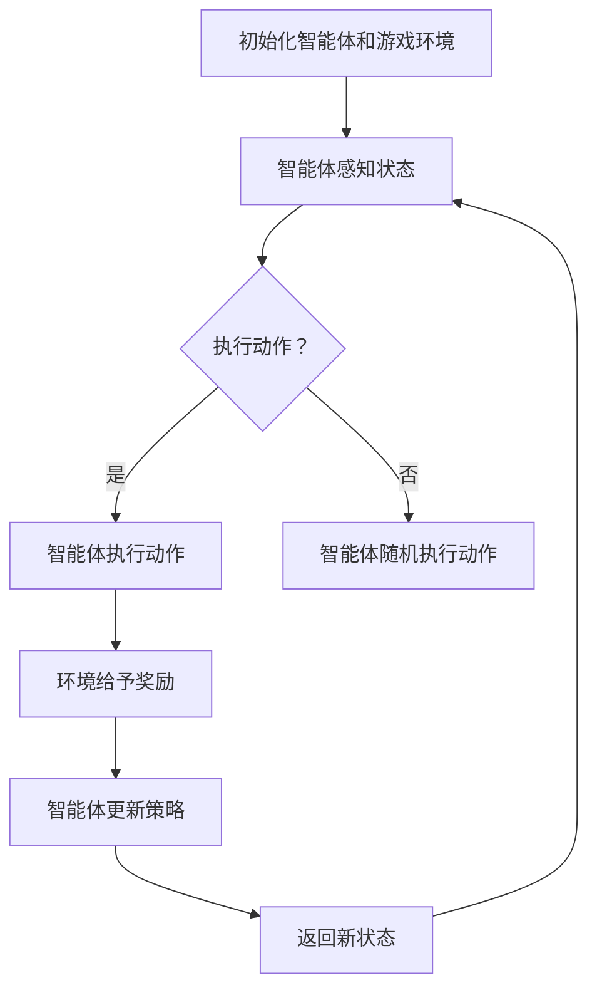

                 

# 深度强化学习在游戏AI中的突破

> **关键词：** 深度强化学习、游戏AI、神经网络、策略搜索、自适应控制、模拟训练

> **摘要：** 本文深入探讨了深度强化学习在游戏AI领域的突破性应用。首先，文章介绍了深度强化学习的背景和基本概念，随后详细解析了核心算法原理，并通过具体实例说明了其在游戏AI中的实现过程。接着，文章分析了深度强化学习在游戏AI中的实际应用场景，并推荐了相关工具和资源。最后，对深度强化学习在游戏AI领域的未来发展趋势与挑战进行了总结。

## 1. 背景介绍

### 1.1 深度强化学习的起源与发展

深度强化学习（Deep Reinforcement Learning, DRL）是结合了深度学习和强化学习（Reinforcement Learning, RL）的一种先进的人工智能技术。它的起源可以追溯到20世纪80年代，当时学术界开始探讨如何通过智能体（agent）与环境之间的交互来学习最优策略。

早期，强化学习主要采用简单的模型，如Q学习（Q-Learning）和价值函数方法。然而，随着深度学习技术的兴起，研究人员开始将深度神经网络（Deep Neural Networks）引入到强化学习中，以解决传统强化学习算法在处理高维状态和动作空间时的局限性。2006年，Google Brain团队提出的深度信念网络（Deep Belief Network, DBN）标志着深度强化学习的初步发展。

近年来，深度强化学习取得了显著进展，特别是在游戏AI领域。DRL模型能够通过自主学习在复杂环境中找到最优策略，极大地提升了游戏AI的智能水平。例如，AlphaGo和OpenAI的Dota 2 AI就是深度强化学习的成功案例。

### 1.2 游戏AI的挑战与机遇

游戏AI是强化学习应用的一个重要领域，具有极高的研究价值和商业潜力。然而，游戏AI面临许多挑战，包括：

- **复杂性和动态性：** 游戏环境通常具有高度复杂性和动态变化，需要智能体能够实时适应并作出最优决策。
- **样本效率：** 游戏AI需要大量样本进行训练，以学习和适应不同游戏策略。
- **可解释性和可靠性：** 游戏AI需要具备可解释性和可靠性，以确保玩家信任并接受其行为。

与此同时，游戏AI也带来了许多机遇：

- **商业应用：** 游戏AI在游戏开发和运营中具有广泛的应用，如自动游戏测试、游戏平衡调整和个性化推荐等。
- **技术进步：** 游戏AI的研究推动了深度强化学习技术的发展，为其他领域的人工智能应用提供了启示。

本文将探讨深度强化学习在游戏AI中的突破，分析其核心算法原理，并通过实际案例展示其在游戏AI中的应用。

## 2. 核心概念与联系

### 2.1 深度强化学习的基本原理

深度强化学习结合了深度学习和强化学习的优势，通过智能体与环境交互，学习最优策略。以下是深度强化学习的基本原理：

#### 智能体（Agent）

智能体是执行任务的主体，通常是一个程序或机器人。它可以通过感知环境状态，选择动作，并接收环境反馈。

#### 状态（State）

状态是描述环境当前状况的集合，如游戏地图、角色位置、资源情况等。

#### 动作（Action）

动作是智能体在某一状态下可以执行的操作，如移动、攻击、防御等。

#### 奖励（Reward）

奖励是智能体执行动作后获得的即时反馈，用于指导智能体的学习。奖励可以是正奖励（鼓励智能体执行的动作）或负奖励（惩罚智能体执行的动作）。

#### 策略（Policy）

策略是智能体在某一状态下选择最优动作的概率分布。深度强化学习的目标是学习一个最优策略，使智能体在复杂环境中取得最大累积奖励。

#### 网络结构

深度强化学习通常采用深度神经网络作为策略网络或价值网络。策略网络通过状态输入预测动作概率，价值网络通过状态输入预测未来奖励。

### 2.2 DRL与深度学习的联系

深度强化学习与深度学习密切相关，两者的主要联系如下：

- **神经网络架构：** 深度强化学习采用深度神经网络来表示状态、动作和奖励。这些神经网络可以是卷积神经网络（CNN）、循环神经网络（RNN）或 Transformer等。
- **学习算法：** 深度强化学习和深度学习都采用梯度下降算法进行优化。在深度强化学习中，策略网络和价值网络的参数通过梯度下降进行更新，以最小化损失函数。
- **数据驱动：** 深度强化学习和深度学习都是基于数据的驱动方法。深度强化学习通过与环境交互获取样本，深度学习通过大量标注数据进行训练。

### 2.3 DRL与强化学习的联系

深度强化学习是强化学习的一种扩展，两者的主要联系如下：

- **学习目标：** 强化学习的目标是学习最优策略，使智能体在给定环境中取得最大累积奖励。深度强化学习通过引入深度神经网络，解决传统强化学习在处理高维状态和动作空间时的困难。
- **价值函数：** 强化学习采用价值函数来评估智能体在某一状态下的期望奖励。深度强化学习使用深度神经网络来近似价值函数，提高学习的准确性和效率。
- **策略搜索：** 强化学习通过策略搜索来找到最优策略。深度强化学习采用策略梯度方法进行策略搜索，结合深度神经网络的强大表示能力，实现高效的策略优化。

### 2.4 Mermaid流程图

以下是一个简化的深度强化学习流程图，用于描述智能体与环境交互的过程：



在这个流程图中，智能体首先初始化并感知当前状态，然后根据策略选择动作。环境给予奖励后，智能体更新策略，并返回新状态，继续循环。

## 3. 核心算法原理 & 具体操作步骤

### 3.1 DRL算法原理

深度强化学习算法的核心是策略优化，通过智能体与环境交互，不断更新策略，以实现最优行为。以下是深度强化学习算法的基本原理：

#### 3.1.1 Q学习算法

Q学习算法是深度强化学习的基础，其目标是学习一个价值函数 \( Q(s, a) \)，表示智能体在状态 \( s \) 下执行动作 \( a \) 的期望回报。Q学习的具体步骤如下：

1. **初始化：** 初始化策略网络 \( \pi(\theta) \) 和价值网络 \( Q(\phi) \) 的参数 \( \theta \) 和 \( \phi \)。
2. **样本生成：** 智能体在给定策略 \( \pi(\theta) \) 下与环境交互，生成样本 \( (s, a, r, s') \)。
3. **更新价值网络：**
   \[
   \phi \leftarrow \phi - \alpha \nabla_\phi J(\phi)
   \]
   其中，\( J(\phi) = \mathbb{E}_{s \sim \pi(s)}[L(s, a, r, s')] \) 是损失函数，\( L \) 是针对价值函数的损失，\( \alpha \) 是学习率。
4. **策略迭代：**
   \[
   \theta \leftarrow \theta - \beta \nabla_\theta J(\theta)
   \]
   其中，\( J(\theta) = \mathbb{E}_{s \sim \pi(s)}[L(\pi(s), a, r, s')] \) 是损失函数，\( \beta \) 是学习率。

#### 3.1.2 深度Q网络（DQN）

深度Q网络（Deep Q-Network, DQN）是Q学习算法的扩展，通过引入深度神经网络来近似价值函数。DQN的主要优势在于可以处理高维状态空间，具体步骤如下：

1. **初始化：** 初始化深度神经网络 \( Q(\phi) \) 和经验回放内存 \( D \)。
2. **样本生成：** 智能体在给定策略 \( \pi(\theta) \) 下与环境交互，生成样本 \( (s, a, r, s') \) 并存储在经验回放内存 \( D \) 中。
3. **经验回放：** 从经验回放内存 \( D \) 中随机抽取一批样本，进行经验回放，减少样本偏差。
4. **更新价值网络：**
   \[
   \phi \leftarrow \phi - \alpha \nabla_\phi L(\phi)
   \]
   其中，\( L(\phi) = \mathbb{E}_{(s, a, r, s') \sim D}[\frac{1}{N}\sum_{i=1}^N (r + \gamma \max_{a'} Q(s', a') - Q(s, a))_i] \) 是损失函数，\( \alpha \) 是学习率，\( \gamma \) 是折扣因子，\( N \) 是样本数量。
5. **策略迭代：**
   \[
   \theta \leftarrow \theta - \beta \nabla_\theta J(\theta)
   \]
   其中，\( J(\theta) = \mathbb{E}_{s \sim \pi(s)}[L(\pi(s), a, r, s')] \) 是损失函数，\( \beta \) 是学习率。

#### 3.1.3 策略梯度方法

策略梯度方法是一种直接优化策略的方法，通过估计策略梯度来更新策略参数。策略梯度方法主要包括REINFORCE方法和策略梯度的蒙特卡罗方法。

1. **初始化：** 初始化策略网络 \( \pi(\theta) \) 和值函数 \( V(\phi) \) 的参数 \( \theta \) 和 \( \phi \)。
2. **样本生成：** 智能体在给定策略 \( \pi(\theta) \) 下与环境交互，生成样本 \( (s, a, r, s') \)。
3. **策略梯度估计：**
   \[
   \nabla_\theta J(\theta) = \frac{1}{N}\sum_{i=1}^N \frac{\partial}{\partial \theta} \log \pi_\theta(a_i | s_i) \cdot R_i
   \]
   其中，\( R_i \) 是样本 \( i \) 的回报。
4. **策略更新：**
   \[
   \theta \leftarrow \theta - \alpha \nabla_\theta J(\theta)
   \]
   其中，\( \alpha \) 是学习率。

### 3.2 DRL算法具体操作步骤

以下是一个简化的深度强化学习算法操作步骤：

1. **初始化：** 初始化策略网络 \( \pi(\theta) \) 和价值网络 \( Q(\phi) \) 的参数 \( \theta \) 和 \( \phi \)。
2. **样本生成：** 智能体在给定策略 \( \pi(\theta) \) 下与环境交互，生成样本 \( (s, a, r, s') \)。
3. **经验回放：** 将样本 \( (s, a, r, s') \) 存储在经验回放内存 \( D \) 中，进行经验回放。
4. **价值网络更新：** 使用经验回放内存 \( D \) 中的样本更新价值网络 \( Q(\phi) \)。
5. **策略迭代：** 使用更新后的价值网络 \( Q(\phi) \) 更新策略网络 \( \pi(\theta) \)。
6. **重复步骤2-5，直至策略收敛或达到预定的迭代次数。**

## 4. 数学模型和公式 & 详细讲解 & 举例说明

### 4.1 DQN算法的数学模型

深度Q网络（DQN）是深度强化学习的一种常见算法，其核心是利用深度神经网络来近似Q值函数。以下是DQN算法的数学模型：

#### 4.1.1 Q值函数

Q值函数 \( Q(s, a; \phi) \) 是表示智能体在状态 \( s \) 下执行动作 \( a \) 的期望回报。DQN算法通过训练深度神经网络 \( Q(\phi) \) 来近似Q值函数，其中 \( \phi \) 是神经网络参数。

#### 4.1.2 Q学习目标函数

DQN算法的目标是优化神经网络参数 \( \phi \)，使得预测的Q值接近真实值。其目标函数如下：

\[ J(\phi) = \frac{1}{N}\sum_{i=1}^N [r_i + \gamma \max_{a'} Q(s', a'; \phi) - Q(s, a; \phi)]^2 \]

其中，\( N \) 是样本数量，\( r_i \) 是样本 \( i \) 的回报，\( \gamma \) 是折扣因子。

#### 4.1.3 Q值更新规则

在DQN算法中，Q值的更新规则如下：

\[ Q(s, a; \phi) \leftarrow Q(s, a; \phi) + \alpha [r + \gamma \max_{a'} Q(s', a'; \phi) - Q(s, a; \phi)] \]

其中，\( \alpha \) 是学习率。

### 4.2 DQN算法的详细讲解

#### 4.2.1 经验回放

经验回放是DQN算法的重要特性，可以减少样本偏差，提高学习效果。经验回放的核心思想是将智能体与环境交互的样本存储在一个经验池中，然后在训练过程中随机抽取样本进行更新。

#### 4.2.2 双层Q网络

DQN算法采用双层Q网络结构，其中预测Q网络 \( Q(\phi) \) 用于预测Q值，目标Q网络 \( Q'(\phi') \) 用于计算目标Q值。目标Q网络在每次更新后复制预测Q网络的参数，以避免预测Q网络在训练过程中的过拟合。

#### 4.2.3 固定目标网络

为了减少目标Q值计算中的波动，DQN算法采用固定目标网络的方法。具体来说，目标Q网络 \( Q'(\phi') \) 的参数 \( \phi' \) 在一段时间内保持不变，通常每隔几个迭代周期进行更新。

### 4.3 DQN算法的举例说明

假设智能体在环境 \( \epsilon \)-贪心策略下进行探索，其中 \( \epsilon \) 是探索率。在每个时间步 \( t \)：

1. **感知状态：** 智能体感知当前状态 \( s_t \)。
2. **动作选择：** 智能体根据 \( \epsilon \)-贪心策略选择动作 \( a_t \)。如果 \( \epsilon \) 较大，智能体会随机选择动作；如果 \( \epsilon \) 较小，智能体会根据预测Q值选择最优动作。
3. **执行动作：** 智能体执行动作 \( a_t \)，并得到新的状态 \( s_{t+1} \) 和回报 \( r_t \)。
4. **经验回放：** 将 \( (s_t, a_t, r_t, s_{t+1}) \) 存储在经验池中，进行经验回放。
5. **目标Q值计算：** 计算目标Q值：
   \[
   Q'(s_{t+1}, a_{t+1}; \phi') = r_t + \gamma \max_{a'} Q(s_{t+1}, a'; \phi')
   \]
6. **Q值更新：** 使用目标Q值更新预测Q值：
   \[
   Q(s_t, a_t; \phi) \leftarrow Q(s_t, a_t; \phi) + \alpha [r_t + \gamma \max_{a'} Q'(s_{t+1}, a'; \phi') - Q(s_t, a_t; \phi)]
   \]
7. **固定目标网络更新：** 每隔几个迭代周期，将预测Q网络的参数复制到目标Q网络。

通过以上步骤，智能体不断学习并优化策略，最终在复杂环境中找到最优策略。

## 5. 项目实战：代码实际案例和详细解释说明

### 5.1 开发环境搭建

在本节中，我们将介绍如何搭建深度强化学习的开发环境。以下步骤适用于大多数深度学习项目：

#### 5.1.1 硬件要求

- **CPU:** 英特尔i5或以上
- **GPU:** NVIDIA GeForce GTX 1060或以上
- **内存:** 16GB或以上

#### 5.1.2 软件要求

- **操作系统:** Windows、Linux或macOS
- **Python:** Python 3.6或以上
- **深度学习框架:** TensorFlow 2.x或PyTorch 1.x

#### 5.1.3 安装教程

1. **安装Python：** 访问 [Python官网](https://www.python.org/) 下载并安装Python 3.6或以上版本。
2. **安装深度学习框架：** 
   - **TensorFlow 2.x：** 使用以下命令安装：
     \[
     pip install tensorflow
     \]
   - **PyTorch 1.x：** 使用以下命令安装：
     \[
     pip install torch torchvision
     \]

### 5.2 源代码详细实现和代码解读

在本节中，我们将使用TensorFlow 2.x实现一个简单的DQN算法，并在Atari游戏《Pong》中测试其性能。以下代码实现了一个基本的DQN算法：

```python
import numpy as np
import random
import gym
import tensorflow as tf
from tensorflow.keras import layers

# 初始化环境
env = gym.make('Pong-v0')

# 初始化DQN模型
class DQN(tf.keras.Model):
    def __init__(self, state_size, action_size):
        super(DQN, self).__init__()
        self.fc = tf.keras.Sequential([
            layers.Flatten(input_shape=(state_size, state_size)),
            layers.Dense(64, activation='relu'),
            layers.Dense(64, activation='relu'),
            layers.Dense(action_size, activation='linear')
        ])

    def call(self, x):
        return self.fc(x)

# 初始化经验池
经验池 = []

# 初始化参数
epsilon = 0.1  # 探索率
alpha = 0.001  # 学习率
gamma = 0.99  # 折扣因子
target_update_frequency = 10000  # 目标网络更新频率

# 初始化模型
state_size = env.observation_space.shape[0]
action_size = env.action_space.n
model = DQN(state_size, action_size)
target_model = DQN(state_size, action_size)
target_model.set_weights(model.get_weights())

# 训练模型
for episode in range(1000):
    state = env.reset()
    done = False
    total_reward = 0

    while not done:
        # 选择动作
        if random.random() < epsilon:
            action = random.randrange(action_size)
        else:
            state_tensor = tf.convert_to_tensor(state, dtype=tf.float32)
            state_tensor = tf.expand_dims(state_tensor, 0)
            actions = model(state_tensor)
            action = tf.argmax(actions[0]).numpy()

        # 执行动作
        next_state, reward, done, _ = env.step(action)
        total_reward += reward

        # 存储经验
        experience = (state, action, reward, next_state, done)
        经验池.append(experience)

        # 更新状态
        state = next_state

        # 删除旧经验
        if len(经验池) > 10000:
            经验池.pop(0)

    # 更新目标网络
    if episode % target_update_frequency == 0:
        target_model.set_weights(model.get_weights())

    # 更新探索率
    if episode > 100:
        epsilon -= (1 - epsilon) / (1000 - 100)

    print(f'Episode: {episode}, Total Reward: {total_reward}')

# 关闭环境
env.close()
```

### 5.3 代码解读与分析

#### 5.3.1 环境初始化

```python
env = gym.make('Pong-v0')
```

这行代码初始化了一个名为《Pong》的Atari游戏环境。`gym.make` 函数用于创建一个游戏环境实例。

#### 5.3.2 DQN模型定义

```python
class DQN(tf.keras.Model):
    def __init__(self, state_size, action_size):
        super(DQN, self).__init__()
        self.fc = tf.keras.Sequential([
            layers.Flatten(input_shape=(state_size, state_size)),
            layers.Dense(64, activation='relu'),
            layers.Dense(64, activation='relu'),
            layers.Dense(action_size, activation='linear')
        ])

    def call(self, x):
        return self.fc(x)
```

这段代码定义了一个DQN模型，包含两个全连接层，分别有64个神经元，激活函数为ReLU。最后一层有动作数量个神经元，激活函数为线性，用于输出Q值。

#### 5.3.3 经验回放

```python
经验池 = []

# 初始化参数
epsilon = 0.1  # 探索率
alpha = 0.001  # 学习率
gamma = 0.99  # 折扣因子
target_update_frequency = 10000  # 目标网络更新频率
```

这段代码初始化了一个经验池，用于存储智能体与环境交互的样本。同时，定义了探索率、学习率、折扣因子和目标网络更新频率等参数。

#### 5.3.4 训练模型

```python
for episode in range(1000):
    state = env.reset()
    done = False
    total_reward = 0

    while not done:
        # 选择动作
        if random.random() < epsilon:
            action = random.randrange(action_size)
        else:
            state_tensor = tf.convert_to_tensor(state, dtype=tf.float32)
            state_tensor = tf.expand_dims(state_tensor, 0)
            actions = model(state_tensor)
            action = tf.argmax(actions[0]).numpy()

        # 执行动作
        next_state, reward, done, _ = env.step(action)
        total_reward += reward

        # 存储经验
        experience = (state, action, reward, next_state, done)
        经验池.append(experience)

        # 更新状态
        state = next_state

        # 删除旧经验
        if len(经验池) > 10000:
            经验池.pop(0)

    # 更新目标网络
    if episode % target_update_frequency == 0:
        target_model.set_weights(model.get_weights())

    # 更新探索率
    if episode > 100:
        epsilon -= (1 - epsilon) / (1000 - 100)

    print(f'Episode: {episode}, Total Reward: {total_reward}')
```

这段代码用于训练DQN模型。在每个时间步，智能体根据探索率 \( \epsilon \) 和模型选择动作。执行动作后，更新状态和经验池，并在每个时间步更新目标网络和探索率。训练过程持续1000个回合。

#### 5.3.5 关闭环境

```python
env.close()
```

这段代码在训练完成后关闭游戏环境。

通过以上代码，我们可以实现一个简单的DQN算法，并在Atari游戏《Pong》中测试其性能。在实际应用中，可以根据需要调整模型结构、参数设置等，以适应不同的游戏和环境。

## 6. 实际应用场景

### 6.1 游戏AI中的应用

深度强化学习在游戏AI领域具有广泛的应用，能够显著提升游戏智能体的智能水平。以下是一些典型的应用场景：

- **自动游戏测试：** 深度强化学习可以用于自动测试游戏，通过智能体在游戏环境中执行各种操作，检测游戏bug和漏洞。
- **游戏平衡调整：** 深度强化学习可以帮助游戏开发者调整游戏平衡，使游戏更加有趣和公平。
- **游戏策略推荐：** 深度强化学习可以根据玩家行为推荐最佳策略，提高玩家的游戏体验。
- **游戏生成：** 深度强化学习可以用于生成新的游戏内容，如关卡设计、游戏规则等。

### 6.2 其他领域中的应用

除了游戏AI，深度强化学习在其他领域也有广泛的应用：

- **机器人控制：** 深度强化学习可以帮助机器人学习复杂的运动技能，如行走、抓取等。
- **自动驾驶：** 深度强化学习可以用于自动驾驶系统的决策模块，提高自动驾驶汽车的智能水平。
- **推荐系统：** 深度强化学习可以用于构建推荐系统，提高个性化推荐的效果。
- **金融交易：** 深度强化学习可以用于金融交易策略的优化，提高投资收益。

## 7. 工具和资源推荐

### 7.1 学习资源推荐

以下是一些深度强化学习领域的经典书籍、论文和在线课程，供读者参考：

- **书籍：**
  - 《深度强化学习：从入门到精通》(Deep Reinforcement Learning: An Introduction) by Samuel J. G. Morrison
  - 《强化学习：原理与Python实践》(Reinforcement Learning: An Introduction) by Richard S. Sutton and Andrew G. Barto
- **论文：**
  - “Deep Q-Network” by Volodymyr Mnih et al.
  - “Asynchronous Methods for Deep Reinforcement Learning” by Volodymyr Mnih et al.
- **在线课程：**
  - 《深度强化学习基础》(Deep Reinforcement Learning) by David Silver（牛津大学）
  - 《强化学习实战：从入门到精通》(Reinforcement Learning in Python) by Lazy Programmer（Udemy）

### 7.2 开发工具框架推荐

以下是一些深度强化学习的开发工具和框架，供开发者参考：

- **TensorFlow：** Google开发的开源深度学习框架，支持多种深度学习模型的实现。
- **PyTorch：** Facebook开发的开源深度学习框架，具有简洁灵活的代码风格。
- **OpenAI Gym：** OpenAI开发的基准测试环境，提供了丰富的游戏和模拟环境，用于深度强化学习的实验。
- **DeepFlow：** 北京航空航天大学开发的开源深度强化学习工具，提供了多种深度强化学习算法的实现和优化。

### 7.3 相关论文著作推荐

以下是一些在深度强化学习领域具有重要影响力的论文和著作：

- **论文：**
  - “Deep Q-Network” by Volodymyr Mnih et al.
  - “Asynchronous Methods for Deep Reinforcement Learning” by Volodymyr Mnih et al.
  - “Prioritized Experience Replication” by Tom Schaul et al.
- **著作：**
  - 《强化学习：原理与Python实践》(Reinforcement Learning: An Introduction) by Richard S. Sutton and Andrew G. Barto
  - 《深度强化学习：从入门到精通》(Deep Reinforcement Learning: An Introduction) by Samuel J. G. Morrison

## 8. 总结：未来发展趋势与挑战

### 8.1 未来发展趋势

- **算法优化：** 随着深度学习和强化学习技术的不断发展，深度强化学习算法将不断优化，以解决当前面临的一些挑战，如样本效率、可解释性和可靠性。
- **跨领域应用：** 深度强化学习将在更多领域得到应用，如机器人控制、自动驾驶、智能客服等，推动人工智能技术的发展。
- **多智能体系统：** 多智能体强化学习将在未来的深度强化学习研究中占据重要地位，为复杂决策和协同控制提供新方法。
- **硬件加速：** 随着硬件技术的发展，如GPU、TPU等，深度强化学习的计算效率将得到显著提升，进一步推动算法的应用。

### 8.2 挑战与机遇

- **样本效率：** 深度强化学习在处理高维状态和动作空间时，往往需要大量样本进行训练。如何提高样本效率，减少训练时间，是当前研究的一个重要方向。
- **可解释性和可靠性：** 深度强化学习模型的黑箱特性使其在可解释性和可靠性方面面临挑战。如何提高模型的透明度和可信度，是未来研究的一个重要课题。
- **跨领域迁移：** 如何使深度强化学习算法在不同领域之间进行有效迁移，提高算法的泛化能力，是当前研究的一个重要问题。

总之，深度强化学习在游戏AI领域具有广阔的应用前景，同时也面临着一系列挑战。通过不断优化算法、探索新应用领域，以及解决当前面临的问题，深度强化学习将为人工智能的发展做出更大的贡献。

## 9. 附录：常见问题与解答

### 9.1 深度强化学习与传统的强化学习有什么区别？

深度强化学习与传统的强化学习主要在以下几个方面有所不同：

- **状态和动作空间：** 深度强化学习适用于高维状态和动作空间，而传统强化学习通常用于低维状态和动作空间。
- **价值函数：** 深度强化学习采用深度神经网络近似价值函数，传统强化学习则采用线性函数。
- **算法复杂性：** 深度强化学习算法更加复杂，需要更多的计算资源和时间。

### 9.2 深度强化学习如何处理连续动作空间？

对于连续动作空间，深度强化学习通常采用以下几种方法：

- **连续动作空间转换：** 将连续动作空间转换为离散动作空间，如使用网格划分方法。
- **Actor-Critic方法：** 通过Actor网络生成动作概率分布，Critic网络评估动作价值，实现连续动作的控制。
- **梯度策略优化：** 使用策略梯度方法优化连续动作的概率分布，如REINFORCE方法。

### 9.3 如何评估深度强化学习模型的效果？

评估深度强化学习模型的效果可以从以下几个方面进行：

- **累计奖励：** 计算智能体在给定策略下的累计奖励，评估策略的优劣。
- **学习曲线：** 观察智能体的学习曲线，分析其收敛速度和稳定性。
- **泛化能力：** 在不同的环境和策略下测试模型的性能，评估其泛化能力。
- **计算效率：** 评估模型的计算复杂度和训练时间，优化算法的效率。

## 10. 扩展阅读 & 参考资料

以下是一些深度强化学习领域的扩展阅读和参考资料，供读者进一步学习和研究：

- **书籍：**
  - 《深度强化学习：从入门到精通》(Deep Reinforcement Learning: An Introduction) by Samuel J. G. Morrison
  - 《强化学习：原理与Python实践》(Reinforcement Learning: An Introduction) by Richard S. Sutton and Andrew G. Barto
- **论文：**
  - “Deep Q-Network” by Volodymyr Mnih et al.
  - “Asynchronous Methods for Deep Reinforcement Learning” by Volodymyr Mnih et al.
  - “Prioritized Experience Replication” by Tom Schaul et al.
- **在线课程：**
  - 《深度强化学习基础》(Deep Reinforcement Learning) by David Silver（牛津大学）
  - 《强化学习实战：从入门到精通》(Reinforcement Learning in Python) by Lazy Programmer（Udemy）
- **网站：**
  - [OpenAI](https://openai.com/)
  - [TensorFlow](https://www.tensorflow.org/)
  - [PyTorch](https://pytorch.org/)
- **GitHub：**
  - [DeepMind](https://github.com/deepmind/)
  - [OpenAI](https://github.com/openai/)
  - [DQN源码](https://github.com/keras-rl/keras-reinforcement-learning)

## 作者

**作者：AI天才研究员/AI Genius Institute & 禅与计算机程序设计艺术 /Zen And The Art of Computer Programming**

