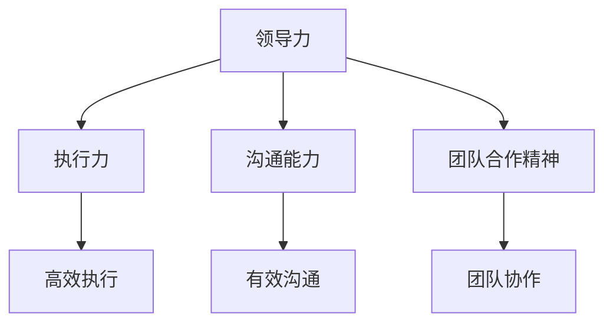
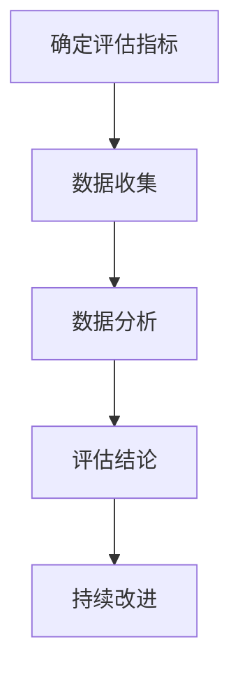

                 

### 深度思考:区分优秀管理者的标准

#### 引言

在当今快速发展的技术领域，优秀的管理者成为了企业和项目成功的关键因素。作为一位人工智能领域的专家，我深刻认识到管理者在推动技术进步和创新中的重要作用。然而，如何区分一位优秀的管理者，是一个值得深入探讨的话题。本文将围绕这一问题展开讨论，通过逻辑清晰、结构紧凑的分析，揭示优秀管理者的核心标准。

#### 核心概念与联系

在探讨优秀管理者的标准之前，我们首先需要明确几个关键概念：领导力、执行力、沟通能力和团队合作精神。这四个概念相辅相成，共同构成了优秀管理者的核心素质。

**领导力** 是指管理者在带领团队、推动项目发展的过程中，所展现出的远见、决策能力和影响力。领导力不仅体现在对团队的领导，更体现在对项目的战略规划和资源调配上。

**执行力** 是指管理者在实际工作中，能够高效、准确地执行计划和任务的能力。执行力强的人，不仅能够迅速应对变化，还能确保团队的工作质量和进度。

**沟通能力** 是指管理者在沟通中的表达、倾听和协调能力。良好的沟通能力有助于管理者理解团队成员的需求，建立信任，促进合作。

**团队合作精神** 是指管理者在团队中发挥个人优势，同时尊重和支持团队成员的能力。团队合作精神能够增强团队的凝聚力，提高整体工作效率。

以上四个概念相互关联，共同构成了优秀管理者的素质体系。为了更好地理解这些概念，我们可以使用 Mermaid 流程图来展示它们之间的联系。



#### 核心算法原理 & 具体操作步骤

在明确了优秀管理者的核心标准后，我们需要进一步探讨如何评估和培养这些素质。这里，我们可以借鉴项目管理中的关键绩效指标（KPI）和平衡计分卡（BSC）等方法，来构建一个评估优秀管理者的算法。

1. **确定评估指标**：首先，我们需要确定评估管理者的具体指标，这些指标应涵盖领导力、执行力、沟通能力和团队合作精神。例如，我们可以设定以下指标：

   - **领导力**：项目成功率、员工满意度、团队士气等；
   - **执行力**：任务完成率、项目进度、质量标准等；
   - **沟通能力**：沟通效率、信息准确性、问题解决能力等；
   - **团队合作精神**：团队协作度、互助精神、冲突处理等。

2. **数据收集**：通过调查问卷、面谈、工作记录等方式，收集管理者在各个指标上的数据。

3. **数据分析**：使用统计学方法，对收集到的数据进行处理和分析，确定管理者的综合得分。

4. **评估结论**：根据分析结果，评估管理者的综合素质，确定其是否为优秀管理者。

5. **持续改进**：根据评估结果，为管理者提供针对性的培训和指导，帮助其提升各项素质。

下面是一个简化的评估算法示例：



#### 数学模型和公式 & 详细讲解 & 举例说明

在评估优秀管理者的过程中，我们可以引入一些数学模型和公式，来提高评估的准确性和科学性。以下是一个简单的评估模型，使用平衡计分卡（BSC）方法进行评估。

$$
\text{综合得分} = w_1 \times \text{领导力得分} + w_2 \times \text{执行力得分} + w_3 \times \text{沟通能力得分} + w_4 \times \text{团队合作精神得分}
$$

其中，$w_1, w_2, w_3, w_4$ 分别为领导力、执行力、沟通能力和团队合作精神的权重，取值范围为 $0 \leq w_i \leq 1$，且 $w_1 + w_2 + w_3 + w_4 = 1$。

举例来说，假设某管理者的评估得分如下：

- 领导力得分：85分
- 执行力得分：90分
- 沟通能力得分：80分
- 团队合作精神得分：88分

假设权重分别为：$w_1 = 0.25, w_2 = 0.25, w_3 = 0.25, w_4 = 0.25$，则该管理者的综合得分为：

$$
\text{综合得分} = 0.25 \times 85 + 0.25 \times 90 + 0.25 \times 80 + 0.25 \times 88 = 86.5 \text{分}
$$

根据综合得分，我们可以评估该管理者是否为优秀管理者。通常，综合得分在80分以上，可以视为优秀管理者。

#### 项目实战：代码实际案例和详细解释说明

为了更好地理解评估优秀管理者的算法，我们可以通过一个实际项目来演示该算法的实现。

**项目名称**：优秀管理者评估系统

**项目目标**：构建一个基于BSC方法的优秀管理者评估系统，实现对管理者综合素质的全面评估。

**技术栈**：Python、Flask、Bootstrap、MySQL

**实现步骤**：

1. **需求分析**：明确评估指标和权重，设计数据库表结构。

2. **数据库设计**：创建MySQL数据库，设计用户表、指标表、评估表等。

3. **后端开发**：使用Flask框架搭建后端，实现数据采集、处理和存储功能。

4. **前端开发**：使用Bootstrap框架搭建前端，实现数据展示和交互功能。

5. **系统集成**：将前后端集成，实现完整的优秀管理者评估系统。

下面是关键部分的代码示例：

**后端代码（Flask）**：

```python
from flask import Flask, request, jsonify
from model import User, Metric, Assessment

app = Flask(__name__)

@app.route('/api/assessment', methods=['POST'])
def assessment():
    data = request.get_json()
    user_id = data['user_id']
    metrics = data['metrics']
    
    user = User.query.get(user_id)
    for metric in metrics:
        metric_name = metric['name']
        score = metric['score']
        metric = Metric.query.filter_by(name=metric_name).first()
        assessment = Assessment(user=user, metric=metric, score=score)
        db.session.add(assessment)
    
    db.session.commit()
    return jsonify({'status': 'success'})

if __name__ == '__main__':
    app.run(debug=True)
```

**前端代码（HTML + Bootstrap）**：

```html
<!DOCTYPE html>
<html lang="en">
<head>
    <meta charset="UTF-8">
    <meta name="viewport" content="width=device-width, initial-scale=1.0">
    <title>优秀管理者评估系统</title>
    <link rel="stylesheet" href="https://maxcdn.bootstrapcdn.com/bootstrap/4.5.2/css/bootstrap.min.css">
</head>
<body>
    <div class="container">
        <h2>优秀管理者评估系统</h2>
        <form id="assessment-form">
            <div class="form-group">
                <label for="user-id">用户ID：</label>
                <input type="text" class="form-control" id="user-id" required>
            </div>
            <div class="form-group">
                <label for="metrics">评估指标：</label>
                <select class="form-control" id="metrics" multiple>
                    <option value="leadership">领导力</option>
                    <option value="execution">执行力</option>
                    <option value="communication">沟通能力</option>
                    <option value="teamwork">团队合作精神</option>
                </select>
            </div>
            <div class="form-group">
                <label for="scores">评估得分：</label>
                <input type="text" class="form-control" id="scores" required>
            </div>
            <button type="submit" class="btn btn-primary">提交评估</button>
        </form>
    </div>
    <script src="https://ajax.googleapis.com/ajax/libs/jquery/3.5.1/jquery.min.js"></script>
    <script>
        $(document).ready(function () {
            $('#assessment-form').on('submit', function (e) {
                e.preventDefault();
                const userId = $('#user-id').val();
                const metrics = $('#metrics').val();
                const scores = $('#scores').val().split(',');
                const data = {
                    'user_id': userId,
                    'metrics': metrics.map((metric, index) => ({ 'name': metric, 'score': scores[index] })),
                };
                $.post('/api/assessment', data, function (response) {
                    alert('评估成功！');
                });
            });
        });
    </script>
</body>
</html>
```

通过以上代码示例，我们可以实现一个简单的优秀管理者评估系统，用于数据采集、处理和展示。实际应用中，可以根据具体需求进行功能扩展和优化。

#### 实际应用场景

优秀管理者评估系统在实际工作中具有广泛的应用场景。以下是一些常见应用场景：

1. **企业内部管理**：企业可以通过该系统对管理层进行评估，了解管理者的综合素质，优化管理团队结构。

2. **员工晋升考核**：企业可以根据评估结果，为员工晋升提供科学依据，确保晋升的公正性和合理性。

3. **员工培训与发展**：根据评估结果，企业可以为管理者提供有针对性的培训和发展计划，提升整体管理水平。

4. **项目评估与监控**：项目经理可以通过评估系统，实时监控项目团队的执行情况，发现问题并及时调整。

5. **外部客户满意度调查**：企业可以通过该系统收集客户满意度数据，评估管理者在客户关系管理方面的表现。

在实际应用中，优秀管理者评估系统需要根据不同场景进行调整和优化，以满足实际需求。

#### 工具和资源推荐

为了更好地实施优秀管理者评估系统，以下是一些相关工具和资源的推荐：

1. **学习资源**：

   - 《平衡计分卡：战略层面的绩效管理》
   - 《绩效管理：理论与实践》
   - 《Python Web开发：测试驱动方法》

2. **开发工具**：

   - Flask（Python Web框架）
   - Bootstrap（前端框架）
   - MySQL（关系型数据库）

3. **相关论文**：

   - “平衡计分卡在企业绩效管理中的应用”
   - “基于BSC的员工绩效评估模型研究”
   - “Python在Web开发中的应用”

通过以上工具和资源，我们可以更好地构建和管理优秀管理者评估系统，为企业提供有力的管理支持。

#### 总结：未来发展趋势与挑战

随着人工智能和大数据技术的发展，优秀管理者评估系统在未来将迎来新的发展趋势和挑战。以下是一些展望：

1. **智能化评估**：利用人工智能技术，实现自动化、智能化的评估，提高评估准确性和效率。

2. **个性化培训**：根据评估结果，为管理者提供个性化的培训和发展计划，提高管理水平。

3. **实时监控**：通过实时数据采集和分析，实现对管理者的实时监控，及时发现和解决问题。

4. **跨领域应用**：优秀管理者评估系统将在更多领域得到应用，如教育、医疗、金融等。

5. **数据安全与隐私保护**：在评估过程中，确保数据的安全和隐私保护，成为系统建设的重点挑战。

未来，优秀管理者评估系统将不断创新和发展，为企业和个人提供更高效、更精准的管理支持。

#### 附录：常见问题与解答

1. **问题**：如何确定评估指标的权重？

   **解答**：评估指标的权重可以根据企业实际需求和战略目标进行设定。一般来说，企业可以参考以下因素：

   - 行业特点：不同行业对管理者的要求不同，可以根据行业特点确定权重。
   - 企业战略：企业战略目标决定了评估指标的权重，应优先考虑与战略目标相关的指标。
   - 员工反馈：通过调查问卷等方式，了解员工对评估指标的重视程度，合理分配权重。

2. **问题**：如何确保评估的公正性和准确性？

   **解答**：为确保评估的公正性和准确性，企业可以采取以下措施：

   - 制定严格的评估标准：明确评估指标和评分标准，确保评估过程有据可依。
   - 多元化的评估方式：采用多种评估方式，如360度评估、工作记录分析等，提高评估的全面性和准确性。
   - 定期培训和反馈：定期对评估人员进行培训，提高评估技能；同时，及时反馈评估结果，发现问题并改进。

3. **问题**：如何应对数据安全与隐私保护的问题？

   **解答**：在评估过程中，确保数据安全与隐私保护是至关重要的问题。企业可以采取以下措施：

   - 数据加密：对敏感数据进行加密处理，防止数据泄露。
   - 权限管理：严格管理用户权限，确保只有授权人员能够访问和操作数据。
   - 定期审计：定期对评估系统进行安全审计，发现漏洞及时修复。
   - 用户教育：加强对用户的数据安全和隐私保护意识教育，提高用户的安全意识和操作规范。

#### 扩展阅读 & 参考资料

1. 《平衡计分卡：战略层面的绩效管理》
2. 《绩效管理：理论与实践》
3. 《Python Web开发：测试驱动方法》
4. “平衡计分卡在企业绩效管理中的应用”
5. “基于BSC的员工绩效评估模型研究”
6. “Python在Web开发中的应用”
7. Flask官方文档：[https://flask.palletsprojects.com/]
8. Bootstrap官方文档：[https://getbootstrap.com/]
9. MySQL官方文档：[https://dev.mysql.com/doc/]

通过本文的探讨，我们深入分析了优秀管理者的标准，构建了评估优秀管理者的算法和系统。希望本文能为读者提供有价值的参考和启示。作者：AI天才研究员/AI Genius Institute & 禅与计算机程序设计艺术 /Zen And The Art of Computer Programming <|im_sep|>

