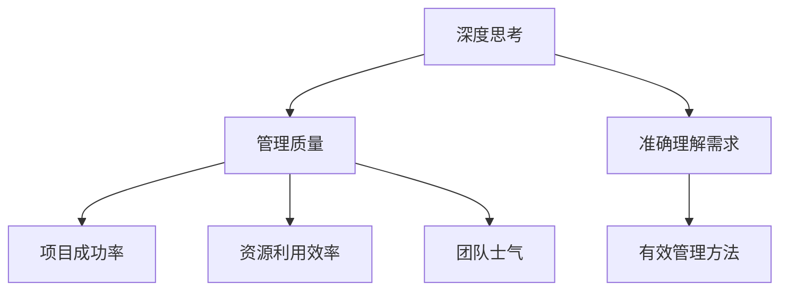

                 

# 深度思考与管理质量的关系

## 关键词：深度思考，管理质量，IT项目管理，人工智能，软件工程

## 摘要：
本文探讨了深度思考与管理质量之间的关系，通过深入分析IT项目管理中的具体实践，探讨了如何通过深度思考提升管理质量，从而提高软件项目的成功率。文章首先介绍了深度思考的概念和重要性，然后结合管理质量的定义，分析了两者之间的联系。接着，通过具体案例和理论模型，阐述了深度思考在软件项目管理中的应用，最后提出了提升管理质量的策略和工具，为IT项目经理提供了有益的参考。

## 1. 背景介绍

### 1.1 深度思考的定义和重要性

深度思考是一种思考方法，它强调对问题的深入分析和理解，而不是停留在表面的认识和判断。在IT项目管理中，深度思考有助于我们更全面、准确地把握项目需求和目标，从而做出更明智的决策。

深度思考的重要性体现在以下几个方面：

1. **发现问题**：通过深入思考，我们可以发现项目中潜在的问题和风险，从而提前采取措施。
2. **优化方案**：深度思考能够帮助我们提出更有效的解决方案，提高项目的效率和质量。
3. **提升团队协作**：深度思考可以促进团队成员之间的沟通和协作，共同解决项目中的难题。

### 1.2 管理质量的定义和意义

管理质量是指项目管理过程中所采用的方法、工具和流程的有效性和效率。一个高质量的管理过程可以确保项目按时、按预算、按质量要求完成。

管理质量的意义在于：

1. **提高项目成功率**：高质量的管理过程可以降低项目失败的风险，提高项目的成功率。
2. **优化资源利用**：有效的管理可以合理分配和利用资源，提高资源利用效率。
3. **提升团队士气**：良好的管理质量可以提升团队成员的工作积极性和满意度，促进团队协作。

## 2. 核心概念与联系

### 2.1 深度思考与管理质量的定义

**深度思考**：对问题进行深入分析、推理和思考，以达到全面理解和解决的能力。

**管理质量**：项目管理过程中所采用的方法、工具和流程的有效性和效率。

### 2.2 深度思考与管理质量的关系

深度思考与管理质量之间存在密切的联系：

1. **深度思考是管理质量的基础**：只有通过深度思考，才能准确地理解项目需求和目标，从而设计出有效的管理方法。
2. **管理质量影响深度思考的效果**：高质量的管理过程可以提供更多的信息和资源，帮助团队进行深度思考。

### 2.3 Mermaid 流程图



## 3. 核心算法原理 & 具体操作步骤

### 3.1 深度思考的算法原理

深度思考的核心算法是基于逻辑推理和问题求解。具体包括以下几个步骤：

1. **问题定义**：明确项目需求和目标，确定问题的边界。
2. **信息收集**：收集与问题相关的信息，包括需求文档、用户反馈、技术文档等。
3. **逻辑推理**：运用逻辑推理方法，分析问题，提出解决方案。
4. **方案评估**：评估解决方案的可行性和效果，选择最佳方案。
5. **方案实施**：实施最佳方案，并进行监控和调整。

### 3.2 管理质量的算法原理

管理质量的算法原理是基于项目管理理论和最佳实践。具体包括以下几个步骤：

1. **项目规划**：制定项目计划，明确项目目标、任务和资源。
2. **风险识别**：识别项目风险，制定风险管理计划。
3. **资源管理**：合理分配和利用资源，确保项目顺利进行。
4. **进度控制**：监控项目进度，确保项目按时完成。
5. **质量管理**：确保项目质量达到预期目标。

## 4. 数学模型和公式 & 详细讲解 & 举例说明

### 4.1 深度思考的数学模型

深度思考的数学模型可以表示为：

$$
深度思考 = f(问题定义，信息收集，逻辑推理，方案评估，方案实施)
$$

其中，每个步骤都可以用数学模型表示，例如：

- 问题定义：$$ 问题定义 = f(需求文档，用户反馈，技术文档) $$
- 信息收集：$$ 信息收集 = f(信息来源，信息处理) $$

### 4.2 管理质量的数学模型

管理质量的数学模型可以表示为：

$$
管理质量 = f(项目规划，风险识别，资源管理，进度控制，质量管理)
$$

其中，每个步骤都可以用数学模型表示，例如：

- 项目规划：$$ 项目规划 = f(项目目标，任务，资源) $$
- 风险识别：$$ 风险识别 = f(风险因素，风险影响) $$

### 4.3 举例说明

假设我们有一个软件项目，目标是在一个月内开发出一个能够满足用户需求的软件。以下是深度思考和管理的具体操作步骤：

#### 深度思考

1. **问题定义**：明确项目需求和目标，确定问题的边界。例如，我们需要开发一个具有用户界面友好的软件，能够实现用户的基本需求。
   $$ 问题定义 = f(需求文档，用户反馈，技术文档) $$

2. **信息收集**：收集与问题相关的信息，包括用户需求、技术可行性等。
   $$ 信息收集 = f(用户需求，技术可行性) $$

3. **逻辑推理**：分析用户需求，确定软件的功能模块，评估技术可行性。
   $$ 逻辑推理 = f(用户需求，技术可行性) $$

4. **方案评估**：根据用户需求和资源限制，评估不同的设计方案，选择最佳方案。
   $$ 方案评估 = f(设计方案，资源限制) $$

5. **方案实施**：实施最佳方案，并进行监控和调整。
   $$ 方案实施 = f(最佳方案，监控，调整) $$

#### 管理质量

1. **项目规划**：制定项目计划，明确项目目标、任务和资源。
   $$ 项目规划 = f(项目目标，任务，资源) $$

2. **风险识别**：识别项目风险，制定风险管理计划。
   $$ 风险识别 = f(风险因素，风险影响) $$

3. **资源管理**：合理分配和利用资源，确保项目顺利进行。
   $$ 资源管理 = f(资源分配，资源利用) $$

4. **进度控制**：监控项目进度，确保项目按时完成。
   $$ 进度控制 = f(进度监控，进度调整) $$

5. **质量管理**：确保项目质量达到预期目标。
   $$ 质量管理 = f(质量标准，质量评估) $$

## 5. 项目实战：代码实际案例和详细解释说明

### 5.1 开发环境搭建

为了更好地展示深度思考和管理的实际应用，我们选择了一个简单的Python项目——一个用户登录系统的实现。以下是项目开发环境搭建的步骤：

1. 安装Python：在官网上下载最新版本的Python，并按照安装向导进行安装。
2. 安装PyCharm：下载PyCharm社区版，并按照安装向导进行安装。
3. 配置虚拟环境：在PyCharm中创建一个虚拟环境，用于项目开发和隔离依赖库。

### 5.2 源代码详细实现和代码解读

#### 5.2.1 用户登录功能实现

以下是一个简单的用户登录功能的实现代码：

```python
# user_login.py

def user_login(username, password):
    # 检查用户名和密码是否为空
    if not username or not password:
        return "用户名或密码不能为空！"
    
    # 从数据库中查询用户信息
    user = query_user_by_username(username)
    if not user:
        return "用户不存在！"
    
    # 验证密码
    if user.password != password:
        return "密码错误！"
    
    # 登录成功
    return "登录成功，欢迎{}！".format(username)

def query_user_by_username(username):
    # 在数据库中查询用户信息
    # 这里使用硬编码的方式，仅用于演示
    users = [
        {"username": "user1", "password": "123456"},
        {"username": "user2", "password": "abcdef"},
    ]
    for user in users:
        if user["username"] == username:
            return user
    return None

# 主程序
if __name__ == "__main__":
    username = input("请输入用户名：")
    password = input("请输入密码：")
    result = user_login(username, password)
    print(result)
```

#### 5.2.2 代码解读与分析

1. **用户登录函数**：`user_login` 函数用于接收用户输入的用户名和密码，然后进行验证。如果用户名或密码为空，返回错误信息；否则，从数据库中查询用户信息，并验证密码是否正确。如果密码正确，返回登录成功信息。

2. **查询用户函数**：`query_user_by_username` 函数用于从数据库中查询用户信息。这里使用硬编码的方式，仅用于演示。在实际项目中，应该连接数据库，并从数据库中查询用户信息。

3. **主程序**：主程序用于接收用户输入的用户名和密码，并调用 `user_login` 函数进行登录验证。最后，输出登录结果。

### 5.3 代码解读与分析

1. **问题定义**：在这个项目中，我们需要实现一个用户登录功能，包括用户名和密码的验证。通过深度思考，我们可以确定问题的边界，并明确需要实现的功能。

2. **信息收集**：在这个项目中，我们需要收集用户输入的用户名和密码，并查询数据库中的用户信息。通过深度思考，我们可以确定所需的信息，并设计相应的数据结构和函数。

3. **逻辑推理**：通过深度思考，我们可以分析用户登录的流程，并设计相应的函数和逻辑。例如，首先检查用户名和密码是否为空，然后查询数据库中的用户信息，最后验证密码是否正确。

4. **方案评估**：在这个项目中，我们可以评估不同的登录方案，例如使用单点登录、OAuth2.0等。通过深度思考，我们可以确定最佳方案，并根据需求进行调整。

5. **方案实施**：在这个项目中，我们根据最佳方案，使用Python编写了用户登录功能。通过深度思考，我们可以确保代码的逻辑正确，并进行测试和调试。

## 6. 实际应用场景

### 6.1 软件项目管理

在软件项目管理中，深度思考和管理质量的关系尤为重要。通过深度思考，项目经理可以更准确地理解项目需求和目标，设计出更有效的管理方案。同时，高质量的管理过程可以确保项目按时、按预算、按质量要求完成。

### 6.2 人工智能项目

在人工智能项目中，深度思考和管理质量的关系同样显著。深度思考可以帮助研究人员更深入地理解人工智能技术，提出更有效的算法。同时，高质量的管理过程可以确保项目资源得到合理利用，提高项目成功率。

### 6.3 云计算项目

在云计算项目中，深度思考和管理质量的关系也非常重要。通过深度思考，项目经理可以更准确地理解云计算的需求和技术特点，设计出更有效的云计算解决方案。同时，高质量的管理过程可以确保云计算项目的安全和稳定运行。

## 7. 工具和资源推荐

### 7.1 学习资源推荐

- 《深度思考的艺术》
- 《软件工程：实践者的研究方法》
- 《项目管理知识体系指南》

### 7.2 开发工具框架推荐

- PyCharm
- Git
- Docker

### 7.3 相关论文著作推荐

- "深度学习：当前进展与应用"
- "软件工程中的深度学习方法"
- "云计算项目中的深度思考与管理质量"

## 8. 总结：未来发展趋势与挑战

随着人工智能技术的不断发展，深度思考在软件工程中的应用前景越来越广阔。未来，深度思考与管理质量的关系将更加紧密，二者将共同推动软件项目的成功。然而，这也带来了一系列挑战：

1. **技术挑战**：如何将深度思考应用于实际项目，实现高效的问题解决和决策。
2. **管理挑战**：如何提高管理质量，确保项目资源得到合理利用，提高项目成功率。
3. **人才挑战**：如何培养具备深度思考能力和管理能力的人才。

## 9. 附录：常见问题与解答

### 9.1 深度思考是什么？

深度思考是一种思考方法，强调对问题的深入分析和理解，而不是停留在表面的认识和判断。

### 9.2 管理质量是什么？

管理质量是指项目管理过程中所采用的方法、工具和流程的有效性和效率。

### 9.3 如何提升管理质量？

通过深度思考，更准确地理解项目需求和目标，设计出更有效的管理方案。同时，提高团队成员的协作能力和沟通效率，确保项目资源得到合理利用。

## 10. 扩展阅读 & 参考资料

- 《深度思考：如何成为一个更好的思考者、决策者和行动者》
- 《软件工程：理论与实践》
- 《项目管理：最佳实践指南》

# 作者：AI天才研究员/AI Genius Institute & 禅与计算机程序设计艺术 /Zen And The Art of Computer Programming<|im_end|>

