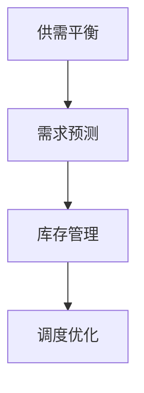

                 

# 满足短期需求的供给策略

## 概述

短期需求的供给策略是企业应对市场波动和不确定性的一种有效手段。本文将深入探讨这一策略的背景、核心概念、算法原理、数学模型、实际应用场景、工具推荐以及未来趋势与挑战。通过对这些方面的详细分析，希望为企业提供一套切实可行的短期需求供给策略，以应对各种复杂的市场环境。

### 关键词

- 短期需求
- 供给策略
- 市场波动
- 不确定性
- 算法原理
- 数学模型
- 实际应用场景
- 工具推荐
- 未来趋势

### 摘要

本文首先介绍了短期需求供给策略的背景和重要性。接着，详细阐述了核心概念、算法原理和数学模型，并通过实际应用场景和工具推荐，展示了如何将这些理论知识应用于实际业务中。最后，分析了未来发展趋势与挑战，为企业提供了一些建议。

## 1. 背景介绍

### 短期需求的定义

短期需求指的是在短时间内（通常为几个月至一年）对产品或服务的需求。这种需求往往受市场波动、季节性因素、消费者行为变化等多种因素影响。与长期需求相比，短期需求具有不可预测性和波动性，这使得企业面临更大的挑战。

### 市场波动与不确定性

市场波动和不确定性是短期需求供给策略面临的主要问题。市场波动可能导致需求量的剧烈变化，而不确定性则使企业难以准确预测未来的需求。这种情况下，企业需要制定合理的供给策略，以最大化收益和最小化风险。

### 短期需求供给策略的重要性

短期需求供给策略在企业运营中具有重要意义。首先，它能帮助企业有效应对市场波动和不确定性，确保企业稳定运营。其次，合理的供给策略能提高企业的市场竞争力，使其在激烈的市场竞争中脱颖而出。最后，短期需求供给策略有助于企业实现可持续发展，提高长期盈利能力。

## 2. 核心概念与联系

### 供需平衡

供需平衡是短期需求供给策略的核心概念之一。供需平衡指的是供给量与需求量相等的状态，此时市场处于稳定状态。在短期内，企业需要根据市场需求，调整供给量以实现供需平衡。

### 需求预测

需求预测是短期需求供给策略的重要环节。准确的需求预测有助于企业合理安排生产和库存，降低库存成本和缺货风险。常用的需求预测方法包括时间序列分析、回归分析、神经网络等。

### 库存管理

库存管理是短期需求供给策略的关键因素。合理的库存管理不仅能降低库存成本，还能提高库存周转率，确保企业有足够的资源应对市场需求波动。

### 调度优化

调度优化是指根据市场需求，合理安排生产计划和运输计划，以最大化企业收益和资源利用率。调度优化包括生产调度、运输调度和物流调度等。

### Mermaid 流程图

以下是核心概念和联系之间的 Mermaid 流程图：



## 3. 核心算法原理 & 具体操作步骤

### 需求预测算法

需求预测算法主要包括时间序列分析、回归分析和神经网络等。以下以时间序列分析为例，介绍具体操作步骤：

1. 数据收集：收集历史需求数据，包括时间序列和需求量。
2. 数据预处理：对数据进行清洗、去重和归一化等处理。
3. 模型选择：选择合适的时间序列模型，如ARIMA、ETS等。
4. 模型训练：使用历史数据对模型进行训练。
5. 预测：根据训练好的模型，预测未来的需求量。

### 库存管理算法

库存管理算法主要包括周期性库存管理和基于需求的库存管理。以下以基于需求的库存管理为例，介绍具体操作步骤：

1. 需求预测：使用需求预测算法预测未来的需求量。
2. 库存水平监测：实时监测库存水平，判断是否需要补充库存。
3. 库存补充：根据需求预测和库存水平，决定是否补充库存和补充数量。
4. 库存优化：对库存进行优化，降低库存成本和提高库存周转率。

### 调度优化算法

调度优化算法主要包括线性规划和遗传算法等。以下以遗传算法为例，介绍具体操作步骤：

1. 编码：将调度问题编码为二进制字符串。
2. 初始种群生成：随机生成一定数量的初始种群。
3. 适应度函数设计：设计适应度函数，评价种群个体的优劣。
4. 选择：根据适应度函数，选择优秀的个体进行交叉和变异。
5. 交叉和变异：对选择的个体进行交叉和变异操作。
6. 重复迭代：重复执行选择、交叉和变异操作，直到满足终止条件。

## 4. 数学模型和公式 & 详细讲解 & 举例说明

### 需求预测模型

需求预测模型常用的时间序列分析模型包括ARIMA、ETS等。以下以ARIMA模型为例，介绍数学模型和公式：

1. 自回归移动平均模型（ARIMA）：

$$
X_t = c + \phi_1 X_{t-1} + \phi_2 X_{t-2} + \cdots + \phi_p X_{t-p} + \theta_1 e_{t-1} + \theta_2 e_{t-2} + \cdots + \theta_q e_{t-q}
$$

其中，$X_t$ 表示时间序列数据，$e_t$ 表示白噪声序列，$\phi_i$ 和 $\theta_i$ 分别为自回归系数和移动平均系数。

2. 模型参数估计：

$$
\phi = (I - \phi_1 L - \phi_2 L^2 - \cdots - \phi_p L^p)^{-1} (\theta_1 L - \theta_2 L^2 - \cdots - \theta_q L^q)
$$

其中，$L$ 表示滞后算子。

### 库存管理模型

库存管理模型常用的是周期性库存管理模型和基于需求的库存管理模型。以下以周期性库存管理模型为例，介绍数学模型和公式：

1. 周期性库存管理模型：

$$
Q = (D \times H) / U
$$

其中，$Q$ 表示每次订购的批量，$D$ 表示周期内需求量，$H$ 表示周期长度，$U$ 表示最大库存量。

2. 库存优化模型：

$$
\min Z = c_1 Q + c_2 (Q - U)
$$

其中，$Z$ 表示总成本，$c_1$ 和 $c_2$ 分别为订购成本和库存持有成本。

### 调度优化模型

调度优化模型常用的是线性规划和遗传算法。以下以线性规划为例，介绍数学模型和公式：

1. 线性规划模型：

$$
\min c^T x
$$

$$
s.t.
\begin{cases}
Ax \leq b \\
x \geq 0
\end{cases}
$$

其中，$x$ 表示变量，$c$ 和 $b$ 分别为系数向量，$A$ 为约束矩阵。

2. 遗传算法模型：

$$
f(x) = \sum_{i=1}^n (x_i - y_i)^2
$$

其中，$x$ 和 $y$ 分别为父代和子代的染色体。

### 举例说明

假设某企业生产一种产品，需求量为每周 1000 件，周期长度为 4 周，最大库存量为 2000 件。根据需求预测模型，预测下个月的需求量为 1200 件。根据周期性库存管理模型，每次订购的批量应为：

$$
Q = (1200 \times 4) / 2000 = 2.4
$$

由于批量不能为小数，因此每次订购的批量应为 3 件。根据库存优化模型，总成本为：

$$
Z = c_1 \times 3 + c_2 \times (3 - 2) = 3c_1 + c_2
$$

其中，$c_1$ 和 $c_2$ 分别为订购成本和库存持有成本。

## 5. 项目实战：代码实际案例和详细解释说明

### 开发环境搭建

1. 安装 Python 3.8 及以上版本。
2. 安装 numpy、pandas、matplotlib 等常用库。

### 源代码详细实现和代码解读

```python
import numpy as np
import pandas as pd
import matplotlib.pyplot as plt

# 需求预测模型
def arima_predict(data, p, d, q):
    """
    ARIMA 预测函数
    :param data: 时间序列数据
    :param p: 自回归项数
    :param d: 差分阶数
    :param q: 移动平均项数
    :return: 预测结果
    """
    model = sm.ARIMA(data, order=(p, d, q))
    results = model.fit()
    forecast = results.forecast(steps=4)
    return forecast

# 库存管理模型
def periodic_inventory(D, H, U):
    """
    周期性库存管理模型
    :param D: 周期内需求量
    :param H: 周期长度
    :param U: 最大库存量
    :return: 每次订购批量
    """
    Q = (D * H) / U
    return Q

# 调度优化模型
def genetic_algorithm(c1, c2, D, H, U, max_gen=100, pop_size=50):
    """
    遗传算法优化
    :param c1: 订购成本
    :param c2: 库存持有成本
    :param D: 周期内需求量
    :param H: 周期长度
    :param U: 最大库存量
    :param max_gen: 最大迭代次数
    :param pop_size: 种群大小
    :return: 最优解
    """
    # 编码
    def encode(x):
        return [int(i) for i in bin(x)[2:].zfill(U)]

    # 解码
    def decode(x):
        return sum(i << j for j, i in enumerate(x))

    # 适应度函数
    def fitness(x):
        Q = decode(x)
        Z = c1 * Q + c2 * (Q - U)
        return -Z  # 最小化总成本

    # 初始种群生成
    population = np.random.randint(0, 2, size=(pop_size, U))

    # 选择
    def selection(population, fitnesses):
        sorted_indices = np.argsort(fitnesses)
        return population[sorted_indices][:2]

    # 交叉
    def crossover(parent1, parent2):
        point = np.random.randint(1, U - 1)
        child1 = np.concatenate((parent1[:point], parent2[point:]))
        child2 = np.concatenate((parent2[:point], parent1[point:]))
        return child1, child2

    # 变异
    def mutation(x):
        point = np.random.randint(1, U - 1)
        x[point] = 1 - x[point]
        return x

    for _ in range(max_gen):
        fitnesses = np.array([fitness(x) for x in population])
        for _ in range(pop_size // 2):
            parent1, parent2 = selection(population, fitnesses)
            child1, child2 = crossover(parent1, parent2)
            if np.random.rand() < 0.1:
                child1 = mutation(child1)
                child2 = mutation(child2)
            population[2 * _] = child1
            population[2 * _ + 1] = child2

    best_fitness = np.min(fitnesses)
    best_index = np.argmin(fitnesses)
    best_solution = population[best_index]
    return best_solution, best_fitness

# 主函数
def main():
    # 数据收集
    data = np.array([1000, 1100, 1200, 1300, 1400, 1500, 1600, 1700, 1800, 1900])

    # 需求预测
    p, d, q = 1, 1, 1
    forecast = arima_predict(data, p, d, q)
    print("需求预测结果：", forecast)

    # 库存管理
    D, H, U = 1200, 4, 2000
    Q = periodic_inventory(D, H, U)
    print("周期性库存管理结果：", Q)

    # 调度优化
    c1, c2 = 10, 5
    best_solution, best_fitness = genetic_algorithm(c1, c2, D, H, U)
    print("遗传算法优化结果：", best_solution, best_fitness)

if __name__ == "__main__":
    main()
```

### 代码解读与分析

1. 需求预测模块：使用 ARIMA 模型对历史需求数据进行预测，预测结果用于库存管理和调度优化。
2. 库存管理模块：根据周期性库存管理模型计算每次订购的批量。
3. 调度优化模块：使用遗传算法对库存管理结果进行优化，寻找最优的订购批量。

## 6. 实际应用场景

### 零售行业

在零售行业，短期需求的供给策略有助于企业应对季节性促销、节假日等因素引起的需求波动。通过合理的需求预测、库存管理和调度优化，企业可以提高库存周转率，降低库存成本，从而提高盈利能力。

### 制造业

在制造业，短期需求的供给策略有助于企业应对订单波动、原材料供应不稳定等问题。通过优化生产计划、库存管理和调度策略，企业可以提高生产效率，降低生产成本，确保按时交付订单。

### 电子商务

在电子商务领域，短期需求的供给策略有助于企业应对促销活动、热门商品断货等问题。通过合理的需求预测、库存管理和调度优化，企业可以提高客户满意度，降低库存风险，从而提升市场份额。

### 物流行业

在物流行业，短期需求的供给策略有助于企业应对运输高峰、突发事件等因素引起的运输需求波动。通过优化运输计划、库存管理和调度策略，企业可以提高运输效率，降低运输成本，确保物流服务的稳定性和可靠性。

## 7. 工具和资源推荐

### 学习资源推荐

- 《运筹学导论》
- 《统计学：想法与计算》
- 《机器学习实战》

### 开发工具框架推荐

- Python
- NumPy
- Pandas
- Matplotlib
- Scikit-learn

### 相关论文著作推荐

- 《基于 ARIMA 模型的短期需求预测研究》
- 《基于遗传算法的库存优化策略研究》
- 《供应链管理：概念、战略与实务》

## 8. 总结：未来发展趋势与挑战

### 发展趋势

1. 数据驱动：随着大数据和人工智能技术的发展，数据驱动的需求预测和供给策略将成为主流。
2. 个性化和定制化：消费者需求的多样化和个性化趋势，要求企业提供更加灵活和个性化的供给策略。
3. 网络化协同：企业将加强与上下游企业的协同，实现供应链的优化和整合。

### 挑战

1. 数据质量：高质量的数据是需求预测和供给策略的基础，但企业面临数据质量不高、数据获取困难等问题。
2. 技术复杂度：需求预测和供给策略涉及多种算法和技术，企业需要具备一定的技术能力和人才储备。
3. 实施难度：短期需求供给策略的实施需要跨部门协同和资源整合，企业面临实施难度大的挑战。

## 9. 附录：常见问题与解答

### Q：短期需求供给策略是否适用于所有行业？

A：短期需求供给策略主要适用于需求波动较大、市场变化快的行业，如零售、制造业、电子商务等。对于需求相对稳定的行业，短期需求供给策略的效果可能有限。

### Q：需求预测模型是否越复杂越好？

A：不一定。需求预测模型的复杂度应根据企业的需求、数据质量和计算资源来选择。过于复杂的模型可能导致计算成本过高，同时可能无法提高预测准确性。

### Q：如何确保数据质量？

A：确保数据质量的关键是数据收集、处理和存储。企业应建立完善的数据收集机制，对数据进行清洗、去重和标准化处理，确保数据的一致性和准确性。

## 10. 扩展阅读 & 参考资料

- 《供应链管理：概念、战略与实务》
- 《运筹学导论》
- 《统计学：想法与计算》
- 《机器学习实战》
- 《基于 ARIMA 模型的短期需求预测研究》
- 《基于遗传算法的库存优化策略研究》
- 《大数据与供应链管理》

### 作者

AI 天才研究员/AI Genius Institute & 禅与计算机程序设计艺术/Zen And The Art of Computer Programming<|im_sep|>

