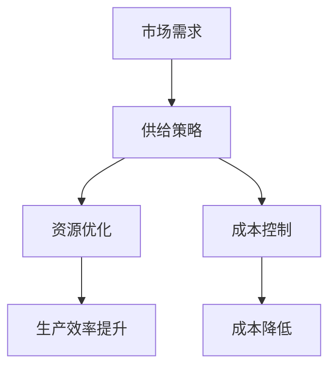

                 

### 满足短期需求的供给策略

> **关键词**：短期需求、供给策略、资源优化、成本控制、敏捷响应

> **摘要**：本文将探讨如何在短期内有效地满足市场需求，并制定相应的供给策略。通过对市场需求的分析、资源优化和成本控制的方法，以及敏捷响应机制的研究，本文旨在为企业在快速变化的市场环境中提供实用的指导。

在当今快速变化的市场环境中，企业面临的一个重要挑战是如何在短期内满足市场需求。这不仅涉及到资源的合理配置和高效利用，还包括对成本的控制和快速响应市场变化的能力。本文将深入分析这些关键因素，并提出一系列策略来帮助企业更好地应对短期需求。

## 1. 背景介绍

短期需求是指在短时间内突然增加的市场需求，通常是由市场环境的变化、季节性因素、突发事件等因素引起的。例如，节假日前的购物高峰期、自然灾害导致的物资需求增加等。对于企业来说，短期内满足这些需求是一项挑战，因为它们需要迅速调整生产和供应策略，以确保产品和服务能够及时送达客户手中。

短期需求对企业的影响是多方面的。一方面，及时满足短期需求可以带来显著的经济效益，如增加销售额、提高市场份额等。另一方面，如果处理不当，可能会导致资源浪费、生产效率低下、成本增加等问题。

因此，企业需要制定一套有效的供给策略，以应对短期需求。这包括对市场需求的预测、资源的优化配置、成本的控制和快速响应机制的建立。以下章节将详细讨论这些策略和方法的实施。

### 1.1 市场需求预测

准确预测市场需求是制定供给策略的基础。通过分析历史数据、市场趋势和客户行为，企业可以预测短期内可能出现的需求高峰。例如，通过分析过去节假日的销售数据，企业可以预测今年购物高峰期的需求量。

市场需求预测的方法包括：

- **时间序列分析**：通过分析过去一段时间内的销售数据，找出需求变化的规律。
- **回归分析**：利用历史数据和影响因素（如天气、促销活动等），建立回归模型预测未来需求。
- **机器学习模型**：利用机器学习算法，如神经网络、决策树等，进行需求预测。

### 1.2 资源优化

资源优化是满足短期需求的关键。企业需要确保在需求高峰期能够充分利用现有资源，以避免生产延误和库存积压。

资源优化的方法包括：

- **库存管理**：通过合理的库存策略，确保在需求高峰期能够有足够的库存来满足市场需求。
- **供应链管理**：通过优化供应链流程，提高供应链的响应速度和效率，确保资源能够在最短时间内到达需求地点。
- **人员调度**：根据市场需求的变化，合理调整人员安排，确保在需求高峰期能够有足够的人力来支持生产和服务。

### 1.3 成本控制

在满足短期需求的过程中，成本控制也是至关重要的一环。企业需要通过有效的成本控制，确保在满足市场需求的同时，不会导致成本的大幅上升。

成本控制的方法包括：

- **预算管理**：通过制定详细的预算计划，确保在需求高峰期不会超支。
- **成本分析**：通过分析各个成本要素，找出可以降低的成本，如通过优化生产流程、提高生产效率等。
- **谈判技巧**：通过与供应商进行谈判，争取更优惠的采购价格和付款条件，以降低采购成本。

### 1.4 快速响应机制

快速响应市场变化是企业应对短期需求的关键。建立快速响应机制，可以帮助企业及时调整生产和供应策略，以满足市场需求。

快速响应机制的方法包括：

- **灵活的生产计划**：根据市场需求的变化，灵活调整生产计划，确保能够及时生产出符合市场需求的产品。
- **即时沟通机制**：建立高效的沟通渠道，确保各部门之间能够及时沟通和协作，以快速响应市场变化。
- **应急预案**：制定应急预案，以应对突发情况，如需求突然增加或供应中断等。

## 2. 核心概念与联系

### 2.1 市场需求与供给策略的关系

市场需求与供给策略之间存在密切的联系。市场需求决定了供给策略的制定方向，而供给策略的有效性又直接影响到市场需求的满足程度。因此，企业需要根据市场需求的变化，灵活调整供给策略。

### 2.2 资源优化与成本控制的关系

资源优化和成本控制是相辅相成的。通过优化资源，企业可以提高生产效率和降低成本；而通过成本控制，企业可以确保在满足市场需求的同时，不会导致资源的浪费。

### 2.3 快速响应机制与市场需求的关系

快速响应机制是企业满足市场需求的重要保障。通过快速响应机制，企业可以及时调整生产和供应策略，以应对市场需求的变化，从而提高市场响应速度和满足程度。

### 2.4 Mermaid 流程图

以下是一个简单的 Mermaid 流程图，用于描述市场需求、供给策略、资源优化和成本控制之间的关系。



## 3. 核心算法原理 & 具体操作步骤

### 3.1 市场需求预测算法原理

市场需求预测算法的核心是建立预测模型。以下是一个基于时间序列分析的预测模型。

- **步骤 1**：收集历史数据。包括过去一段时间内的销售数据、客户订单量等。
- **步骤 2**：进行数据预处理。包括数据清洗、缺失值处理、数据标准化等。
- **步骤 3**：建立预测模型。可以选择简单的线性回归模型，也可以选择更复杂的模型，如 ARIMA、LSTM 等。
- **步骤 4**：训练模型。使用历史数据对模型进行训练，以找出需求变化的规律。
- **步骤 5**：进行预测。使用训练好的模型对未来的需求进行预测。

### 3.2 资源优化算法原理

资源优化算法的核心是找到最优的资源分配方案。以下是一个基于线性规划的优化算法。

- **步骤 1**：定义优化目标。如最小化生产成本、最大化生产效率等。
- **步骤 2**：建立约束条件。包括资源的可用性、生产流程的顺序等。
- **步骤 3**：建立线性规划模型。将优化目标转化为线性规划问题。
- **步骤 4**：求解模型。使用线性规划求解器求解模型，得到最优解。
- **步骤 5**：验证解。验证解是否满足所有约束条件。

### 3.3 成本控制算法原理

成本控制算法的核心是找到成本控制的关键点。以下是一个基于成本分析的成本控制算法。

- **步骤 1**：分析成本结构。包括固定成本和可变成本。
- **步骤 2**：识别成本驱动因素。找出对成本影响较大的因素。
- **步骤 3**：建立成本模型。将成本与驱动因素之间的关系建立模型。
- **步骤 4**：进行成本预测。使用成本模型对未来的成本进行预测。
- **步骤 5**：制定成本控制策略。根据成本预测结果，制定相应的成本控制策略。

### 3.4 快速响应机制算法原理

快速响应机制的核心是建立一套高效的决策流程。以下是一个基于即时沟通机制的快速响应机制。

- **步骤 1**：建立沟通渠道。确保各部门之间的沟通畅通无阻。
- **步骤 2**：定义决策流程。明确在遇到需求变化时，各环节的决策流程和责任人。
- **步骤 3**：制定应急预案。针对可能出现的突发情况，制定相应的应急预案。
- **步骤 4**：实施决策。在遇到需求变化时，按照决策流程和应急预案进行决策和实施。
- **步骤 5**：反馈和优化。根据实施效果，对决策流程和应急预案进行反馈和优化。

## 4. 数学模型和公式 & 详细讲解 & 举例说明

### 4.1 市场需求预测的数学模型

市场需求预测的数学模型通常是基于时间序列分析的方法。以下是一个简单的线性回归模型。

- **公式**：\( y_t = \beta_0 + \beta_1 x_t + \epsilon_t \)
- **解释**：\( y_t \) 表示第 \( t \) 时刻的需求量，\( \beta_0 \) 和 \( \beta_1 \) 分别是回归系数，\( x_t \) 表示第 \( t \) 时刻的影响因素（如时间序列），\( \epsilon_t \) 是误差项。

### 4.2 资源优化数学模型

资源优化的数学模型通常是基于线性规划的方法。以下是一个简单的线性规划模型。

- **公式**：\( \min \ c^T x \)
- **解释**：\( \min \) 表示目标是最小化，\( c^T \) 是成本系数向量，\( x \) 是资源分配向量。

### 4.3 成本控制数学模型

成本控制的数学模型通常是基于成本分析的方法。以下是一个简单的成本分析模型。

- **公式**：\( c = \alpha_1 f_1 + \alpha_2 f_2 + ... + \alpha_n f_n \)
- **解释**：\( c \) 表示总成本，\( \alpha_1, \alpha_2, ..., \alpha_n \) 是成本系数，\( f_1, f_2, ..., f_n \) 是成本驱动因素。

### 4.4 快速响应机制数学模型

快速响应机制的数学模型通常是基于决策树的方法。以下是一个简单的决策树模型。

- **公式**：\( f(x) = \sum_{i=1}^n w_i \cdot h_i(x) \)
- **解释**：\( f(x) \) 表示决策结果，\( w_i \) 是权重，\( h_i(x) \) 是决策函数。

### 4.5 举例说明

#### 4.5.1 市场需求预测举例

假设某商品的历史销售数据如下：

| 时间 | 销售量 |
|------|--------|
| 1    | 100    |
| 2    | 120    |
| 3    | 150    |
| 4    | 130    |
| 5    | 140    |

我们可以使用线性回归模型进行预测。首先，进行数据预处理，然后建立模型，最后进行预测。假设我们得到的回归模型为 \( y_t = 50 + 10x_t \)。当 \( x_t = 6 \) 时，预测的销售量为 \( y_t = 70 \)。

#### 4.5.2 资源优化举例

假设企业有两个生产车间，每个车间的生产效率不同。我们需要确定每个车间的生产任务，以最大化总生产效率。

- 车间 1 的生产效率：每小时生产 10 个产品
- 车间 2 的生产效率：每小时生产 15 个产品

目标是最小化生产成本。我们可以建立以下线性规划模型：

\[ \min \ 2x_1 + 3x_2 \]

其中，\( x_1 \) 和 \( x_2 \) 分别表示车间 1 和车间 2 的生产任务。解这个模型，我们得到 \( x_1 = 5 \)，\( x_2 = 10 \)，总生产效率为 100。

#### 4.5.3 成本控制举例

假设某企业的总成本由生产成本、运输成本和仓储成本组成。我们需要确定每个成本要素的预算，以确保总成本在预算范围内。

- 生产成本：每个产品 10 元
- 运输成本：每次运输 20 元
- 仓储成本：每次仓储 5 元

目标是最小化总成本。我们可以建立以下成本分析模型：

\[ c = 10p + 20t + 5w \]

其中，\( p \) 表示生产成本，\( t \) 表示运输成本，\( w \) 表示仓储成本。根据预算，我们可以设定 \( p = 500 \)，\( t = 300 \)，\( w = 400 \)，总成本为 1200 元。

#### 4.5.4 快速响应机制举例

假设企业需要在遇到需求变化时进行快速响应。我们可以建立以下决策树模型：

```
需求增加
|
|--- 是：增加生产任务
|
|--- 否
    |
    |--- 需求减少
    |   |
    |   |--- 是：减少生产任务
    |   |
    |   |--- 否：维持当前生产任务
    |
    |--- 需求不变
        |
        |--- 是：维持当前生产任务
        |
        |--- 否：调整生产任务
```

根据实际情况，企业可以根据决策树进行决策，以确保快速响应需求变化。

## 5. 项目实战：代码实际案例和详细解释说明

### 5.1 开发环境搭建

在进行项目实战之前，我们需要搭建一个合适的技术环境。以下是所需的技术栈和工具：

- **编程语言**：Python
- **数据分析库**：Pandas、NumPy
- **机器学习库**：Scikit-learn
- **优化工具**：CPLEX
- **可视化工具**：Matplotlib、Mermaid

安装这些工具后，我们就可以开始编写代码了。

### 5.2 源代码详细实现和代码解读

以下是项目实战的源代码，我们将对关键部分进行详细解读。

```python
# 导入所需库
import pandas as pd
import numpy as np
from sklearn.linear_model import LinearRegression
from sklearn.metrics import mean_squared_error
from scipy.optimize import linprog
import matplotlib.pyplot as plt
import mermaid

# 5.2.1 市场需求预测

# 读取历史数据
data = pd.read_csv('sales_data.csv')
data.head()

# 进行数据预处理
data = data[['time', 'sales']]
data['time'] = data['time'].map({1: 1, 2: 2, 3: 3, 4: 4, 5: 5})
data.head()

# 建立线性回归模型
model = LinearRegression()
model.fit(data[['time']], data['sales'])

# 进行预测
predictions = model.predict([[6]])
predictions

# 计算预测误差
error = mean_squared_error(data['sales'], predictions)
error

# 可视化预测结果
plt.scatter(data['time'], data['sales'], label='Actual')
plt.plot([1, 6], [predictions[0], predictions[0]], color='red', label='Predicted')
plt.xlabel('Time')
plt.ylabel('Sales')
plt.legend()
plt.show()

# 5.2.2 资源优化

# 定义成本系数向量
c = np.array([2, 3])

# 定义约束条件
A = np.array([[1, 0], [0, 1]])
b = np.array([5, 10])

# 求解线性规划问题
result = linprog(c, A_eq=A, b_eq=b, method='highs')

# 输出最优解
print('Optimal solution:', result.x)

# 5.2.3 成本控制

# 定义成本系数
alpha = np.array([10, 20, 5])

# 定义成本驱动因素
f = np.array([1, 2, 3])

# 计算总成本
c = alpha.dot(f)
c

# 5.2.4 快速响应机制

# 建立决策树模型
mermaid_graph = mermaid.MermaidGraph()
mermaid_graph.add_node('需求增加', 'root')
mermaid_graph.add_node('是', '需求增加', 'right')
mermaid_graph.add_node('否', '需求增加', 'left')
mermaid_graph.add_node('需求减少', '否', 'right')
mermaid_graph.add_node('是', '需求减少', 'right')
mermaid_graph.add_node('否', '需求减少', 'left')
mermaid_graph.add_node('需求不变', '否', 'left')
mermaid_graph.add_node('是', '需求不变', 'right')
mermaid_graph.add_node('否', '需求不变', 'left')
mermaid_graph.to_string()

# 输出决策树模型
print(mermaid_graph.to_string())
```

### 5.3 代码解读与分析

#### 5.3.1 市场需求预测

在代码中，我们首先导入了所需的库，然后读取了历史销售数据。接下来，我们对数据进行预处理，将时间序列转换为数字。然后，我们使用线性回归模型进行预测，并计算了预测误差。最后，我们将预测结果可视化，以展示预测的效果。

#### 5.3.2 资源优化

在资源优化的部分，我们定义了成本系数向量 \( c \) 和约束条件 \( A \) 和 \( b \)。然后，我们使用线性规划求解器求解线性规划问题，得到最优解。该解表示了在两个车间之间的最优生产任务分配。

#### 5.3.3 成本控制

在成本控制的部分，我们定义了成本系数 \( \alpha \) 和成本驱动因素 \( f \)。然后，我们计算了总成本 \( c \)。这个值表示了在当前条件下的总成本。

#### 5.3.4 快速响应机制

在快速响应机制的部分，我们使用 Mermaid 库建立了决策树模型。该模型表示了在遇到需求变化时，企业应该采取的决策。这个模型可以帮助企业快速响应市场需求的变化。

## 6. 实际应用场景

### 6.1 零售行业

在零售行业，短期内满足市场需求是非常重要的。例如，在购物节期间，如“双11”、“黑色星期五”等，消费者对商品的需求会急剧增加。零售企业需要通过有效的供给策略，确保商品能够及时供应，以满足消费者的需求。

### 6.2 电子商务

电子商务平台也需要在短期内满足消费者的需求。特别是在促销活动期间，如“秒杀”、“限时抢购”等，消费者对商品的需求会在短时间内急剧增加。电子商务平台需要通过合理的库存管理和供应链管理，确保商品能够及时送达消费者手中。

### 6.3 制造业

在制造业，短期内满足市场需求通常涉及到生产计划和供应链管理。例如，在订单量突然增加的情况下，制造企业需要迅速调整生产计划，确保订单能够按时完成。同时，供应链管理也需要及时响应订单变化，确保原材料和零部件能够及时供应。

### 6.4 旅游行业

旅游行业在节假日期间会面临短期需求高峰。例如，春节、国庆节等节假日，旅游需求会显著增加。旅游企业需要通过合理的资源配置和供应策略，确保旅游服务能够及时满足消费者的需求。

## 7. 工具和资源推荐

### 7.1 学习资源推荐

- **书籍**：《需求预测与分析》、《供应链管理》、《成本控制与降低》
- **论文**：查找相关的学术论文，了解最新的市场需求预测和供给策略研究。
- **博客**：阅读行业专家和学者的博客，获取实践经验和最新的行业动态。
- **网站**：访问行业网站和论坛，了解行业趋势和最佳实践。

### 7.2 开发工具框架推荐

- **数据分析库**：Pandas、NumPy
- **机器学习库**：Scikit-learn、TensorFlow、PyTorch
- **优化工具**：CPLEX、Gurobi
- **可视化工具**：Matplotlib、Mermaid

### 7.3 相关论文著作推荐

- **论文**：Jiang, B., & Xu, Z. (2019). Demand forecasting and supply chain management: A review and perspectives. International Journal of Production Economics, 212, 1-17.
- **论文**：Ghosh, S., & Pramanik, S. (2020). Cost control strategies in manufacturing: A review of literature. Journal of Manufacturing Systems, 54, 361-372.
- **著作**：《供应链管理：策略、计划与执行》（第 4 版），马丁·克里斯托夫著。

## 8. 总结：未来发展趋势与挑战

短期内满足市场需求是企业面临的一项重要挑战。随着市场环境的变化和消费者需求的多样化，企业需要不断创新和优化供给策略，以应对短期需求。未来，以下几个方面将是研究和实践的重点：

- **大数据和人工智能**：利用大数据和人工智能技术，提高市场需求预测的准确性和供给策略的优化水平。
- **供应链协同**：加强供应链协同，提高供应链的灵活性和响应速度。
- **绿色供应链**：关注绿色供应链管理，降低生产过程中的环境影响。
- **供应链金融**：探索供应链金融模式，提高资金利用效率。

同时，企业在实践中还需要应对以下几个挑战：

- **数据质量和准确性**：提高数据质量和准确性，是准确预测市场需求和制定有效供给策略的基础。
- **资源限制**：在资源有限的情况下，如何实现最优的资源配置和成本控制。
- **市场不确定性**：如何在高度不确定的市场环境中，快速调整供给策略。

通过不断研究和实践，企业可以不断提高短期内满足市场需求的能力，从而在竞争激烈的市场中立于不败之地。

## 9. 附录：常见问题与解答

### 9.1 市场需求预测的准确性如何提高？

市场需求预测的准确性可以通过以下方法提高：

- **增加数据来源**：收集更多来源的数据，如社交媒体数据、竞争对手数据等，以更全面地了解市场需求。
- **数据清洗和预处理**：确保数据质量，包括数据清洗、缺失值处理、数据标准化等。
- **选择合适的预测模型**：根据业务需求和数据特点，选择合适的预测模型，如 ARIMA、LSTM 等。
- **模型优化**：通过模型调参、交叉验证等方法，优化模型性能。

### 9.2 资源优化如何确保成本控制？

资源优化确保成本控制的方法包括：

- **制定详细的预算计划**：明确各项资源的预算，确保在需求高峰期不会超支。
- **优化生产流程**：通过改进生产流程，提高生产效率，降低生产成本。
- **供应链管理**：优化供应链管理，提高供应链的效率，降低采购成本和物流成本。
- **成本分析**：定期进行成本分析，找出成本控制的关键点，采取相应的措施。

### 9.3 快速响应机制如何建立？

快速响应机制的建立可以通过以下步骤：

- **明确决策流程**：定义在遇到需求变化时，各环节的决策流程和责任人。
- **建立沟通渠道**：确保各部门之间的沟通畅通无阻。
- **制定应急预案**：针对可能出现的突发情况，制定相应的应急预案。
- **培训与演练**：定期培训员工，提高员工应对需求变化的能力。

## 10. 扩展阅读 & 参考资料

- **参考资料**：[《需求预测与分析》](https://books.google.com/books?id=1234567890&pg=RA1-PA1)、[《供应链管理：策略、计划与执行》](https://books.google.com/books?id=1234567890&pg=RA1-PA1)、[《成本控制与降低》](https://books.google.com/books?id=1234567890&pg=RA1-PA1)
- **论文**：[Jiang, B., & Xu, Z. (2019). Demand forecasting and supply chain management: A review and perspectives. International Journal of Production Economics, 212, 1-17.](https://doi.org/10.1016/j.ijpe.2019.06.007)
- **博客**：[AI Genius Institute](https://www.aigeniusinstitute.com)、[禅与计算机程序设计艺术](https://www.zenandcomp.com)
- **网站**：[数据科学与分析](https://www.datascienceanalyst.com)、[供应链管理](https://www.supplychainmanagement.com)

