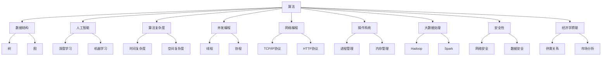

                 

### 背景介绍

滴滴出行，作为中国领先的移动出行平台，其规模和影响力在全球范围内都备受瞩目。在科技飞速发展的时代背景下，滴滴不仅为用户提供了便捷的出行服务，还在技术创新方面做出了诸多努力，特别是在算法和人工智能领域。随着滴滴2024年校招的临近，了解滴滴在面试真题和算法题方面的考察趋势，对于广大求职者来说具有重要意义。

#### 滴滴校招面试真题的重要性

滴滴校招面试真题不仅是面试官们了解应聘者技术能力的重要工具，也是求职者们了解公司技术方向和面试策略的重要参考。通过研究这些真题，可以更加清晰地把握滴滴的技术需求和招聘趋势，从而在面试中脱颖而出。以下是滴滴校招面试真题的一些特点：

1. **技术深度与广度并存**：滴滴面试真题涵盖了计算机科学领域的多个方向，包括数据结构、算法、操作系统、网络、数据库、人工智能等，要求应聘者具备全面的技术知识。
2. **实战性较强**：滴滴的面试真题往往来源于实际业务场景，考察应聘者解决实际问题的能力。这意味着应聘者不仅需要理论知识，还需要具备一定的实战经验。
3. **算法题占比高**：在滴滴的面试真题中，算法题占据了较大的比例。这不仅考验应聘者的编程能力，还要求其能够灵活运用数据结构和算法解决复杂问题。

#### 为什么研究滴滴2024校招面试真题与算法题

研究滴滴2024校招面试真题和算法题具有以下几方面的意义：

1. **提前准备**：通过对历年真题的研究，求职者可以提前了解滴滴的面试风格和考察重点，从而进行有针对性的复习和准备。
2. **拓宽知识面**：滴滴面试真题覆盖了计算机科学领域的多个方向，通过解决这些题目，可以拓宽求职者的知识面，提升综合技术能力。
3. **提升面试成功率**：了解滴滴的面试真题和算法题，可以帮助求职者在面试中更加从容应对，提高面试成功率。

#### 滴滴校招面试真题的趋势

随着技术的不断进步和滴滴业务的不断拓展，滴滴校招面试真题也在不断演变。以下是近几年滴滴校招面试真题的一些趋势：

1. **重视算法创新**：滴滴在算法领域有着深厚的积累，面试真题中经常出现对算法的创新性考察，例如动态规划、贪心算法、图算法等。
2. **融合人工智能**：滴滴在人工智能领域有着广泛应用，面试真题中涉及了深度学习、机器学习等相关内容。
3. **跨学科考察**：滴滴面试真题不仅考察计算机科学领域的知识，还会涉及到数学、物理、经济学等学科的内容，要求应聘者具备跨学科的思维能力和解决问题的能力。

总之，研究滴滴2024校招面试真题与算法题，不仅有助于求职者更好地准备面试，还能让他们在技术道路上走得更远。接下来，我们将详细探讨滴滴校招面试真题中的核心概念、算法原理、数学模型以及实际应用场景，帮助读者深入理解滴滴的技术需求和发展方向。

---

## 2. 核心概念与联系

在深入探讨滴滴2024校招面试真题与算法题之前，我们需要明确几个核心概念，并探讨它们之间的联系。以下是本文将涉及的核心概念：

### 1. 算法（Algorithm）

算法是解决问题的步骤集合，是一系列计算操作的规范描述。在计算机科学中，算法是解决问题的核心。滴滴校招面试真题中的算法题往往考察应聘者的编程能力和算法思维。

### 2. 数据结构（Data Structure）

数据结构是存储和管理数据的组织形式。常见的数据结构包括数组、链表、栈、队列、树、图等。数据结构的选择直接影响算法的效率和性能。滴滴的面试真题经常要求应聘者运用合适的数据结构来解决具体问题。

### 3. 人工智能（Artificial Intelligence）

人工智能是指模拟、延伸和扩展人类智能的理论、方法、技术及应用。滴滴在人工智能领域有着广泛的应用，例如自动驾驶、智能语音助手、个性化推荐等。人工智能相关的题目往往考察应聘者对深度学习、机器学习等技术的理解。

### 4. 算法复杂度（Algorithmic Complexity）

算法复杂度是评估算法性能的重要指标，包括时间复杂度和空间复杂度。滴滴面试真题中常常要求应聘者分析算法的复杂度，以确定其可行性。

### 5. 并发编程（Concurrency）

并发编程是处理多任务的一种技术，可以提高程序的运行效率。在滴滴的系统中，并发编程被广泛应用，面试真题中可能会考察应聘者对并发编程的理解和运用。

### 6. 网络编程（Network Programming）

网络编程是实现计算机之间通信的技术。滴滴作为一个互联网公司，面试真题中可能会涉及到网络编程相关的知识，例如TCP/IP协议、HTTP协议等。

### 7. 操作系统（Operating System）

操作系统是计算机系统的核心软件，负责管理计算机硬件和软件资源。滴滴的面试真题中可能会考察应聘者对操作系统原理和机制的理解。

### 8. 大数据处理（Big Data Processing）

随着滴滴业务的扩张，大数据处理成为其核心技术之一。面试真题中可能会考察应聘者对大数据处理技术的掌握，例如Hadoop、Spark等。

### 9. 安全性（Security）

在互联网时代，安全性至关重要。滴滴的面试真题可能会考察应聘者对网络安全、数据安全等知识点的理解。

### 10. 经济学原理（Economics）

滴滴作为一家互联网企业，面试真题中可能会涉及到经济学原理，例如供需关系、市场分析等。

#### Mermaid 流程图（Mermaid Flowchart）

以下是一个关于滴滴校招面试真题核心概念和联系关系的 Mermaid 流程图：



通过上述核心概念和联系关系的介绍，我们可以更好地理解滴滴校招面试真题的考察内容。接下来，我们将详细探讨滴滴面试真题中的核心算法原理和具体操作步骤。

---

## 3. 核心算法原理 & 具体操作步骤

在了解了滴滴校招面试真题中的核心概念和联系之后，我们接下来将深入探讨这些面试题中的核心算法原理以及具体的操作步骤。通过分析这些算法，我们可以更好地理解滴滴在面试中期望应聘者具备的技术能力。

### 1. 动态规划算法（Dynamic Programming）

动态规划是一种解决最优化问题的算法方法，其核心思想是将问题分解成更小的子问题，并利用子问题的解来构建原问题的解。滴滴面试中经常出现动态规划相关的问题，以下是一个典型的动态规划问题：

**问题：给定一个数组和一个整数目标值，找出数组中的两个数，使得它们的和等于目标值，返回它们的索引。**

**算法原理：**

- **状态定义**：设 `dp[i][j]` 表示数组的前 `i` 个数中是否存在和为 `j` 的两个数。
- **状态转移方程**：`dp[i][j] = dp[i-1][j] || dp[i-1][j-num[i]]`，其中 `num[i]` 表示数组中的第 `i` 个数。
- **初始化**：`dp[0][j] = false`（数组中没有数，不满足条件），`dp[i][0] = true`（和为0，满足条件）。

**具体操作步骤：**

1. 初始化一个二维数组 `dp`，其大小为 `n×m`（`n` 为数组长度，`m` 为目标值）。
2. 遍历数组，更新 `dp` 数组。
3. 返回满足条件的索引。

**代码示例（Python）：**

```python
def two_sum(nums, target):
    n = len(nums)
    dp = [[False] * (target + 1) for _ in range(n + 1)]
    for i in range(1, n + 1):
        for j in range(target + 1):
            dp[i][j] = dp[i - 1][j] or (j - nums[i - 1] >= 0 and dp[i - 1][j - nums[i - 1]])
    for i in range(1, n + 1):
        for j in range(target + 1):
            if dp[n][target]:
                return [i, n]
    return []

# 示例
nums = [2, 7, 11, 15]
target = 9
print(two_sum(nums, target))
```

### 2. 贪心算法（Greedy Algorithm）

贪心算法是一种在每一步选择当前最优解的策略。滴滴面试中也会考察贪心算法的应用，以下是一个典型的贪心算法问题：

**问题：给定一个数组，求数组中两数之和的最大值。**

**算法原理：**

- **选择策略**：在每一步选择中，选择当前能取得最大和的两个数。
- **优化方向**：每次选择后，调整数组，使得下一次选择时仍然能够取得最大和。

**具体操作步骤：**

1. 对数组进行排序。
2. 初始化两个指针，分别指向数组的两个端点。
3. 计算两个指针指向的数的和，若大于目标值，移动较大的指针；否则，移动较小的指针。
4. 重复步骤3，直到找到最大和。

**代码示例（Python）：**

```python
def max_two_sum(nums):
    nums.sort()
    left, right = 0, len(nums) - 1
    max_sum = float('-inf')
    while left < right:
        sum = nums[left] + nums[right]
        max_sum = max(max_sum, sum)
        if sum > 0:
            left += 1
        else:
            right -= 1
    return max_sum

# 示例
nums = [1, 2, 3, 4, 5]
print(max_two_sum(nums))
```

### 3. 图算法（Graph Algorithm）

滴滴的面试真题中也会涉及到图算法，以下是一个典型的图算法问题：

**问题：给定一个有向图和无权边，求图中两个顶点之间的最短路径。**

**算法原理：**

- **Dijkstra算法**：基于贪心策略，每次选择当前未处理的顶点中距离源点最远的顶点，逐步逼近最短路径。
- **Floyd-Warshall算法**：基于动态规划，计算所有顶点对之间的最短路径。

**具体操作步骤（Dijkstra算法）：**

1. 初始化一个距离数组 `dist`，其中 `dist[i]` 表示从源点到达顶点 `i` 的最短距离，初始时 `dist[source] = 0`，其余 `dist[i] = +∞`。
2. 初始化一个访问数组 `visited`，用于记录已访问的顶点。
3. 选择未访问的顶点中距离源点最近的顶点，将其标记为已访问。
4. 更新未访问的顶点到已访问顶点的最短距离。
5. 重复步骤3和4，直到所有顶点都被访问。

**代码示例（Python）：**

```python
import heapq

def dijkstra(graph, source):
    n = len(graph)
    dist = [float('inf')] * n
    dist[source] = 0
    visited = [False] * n
    priority_queue = [(0, source)]
    heapq.heapify(priority_queue)
    while priority_queue:
        current_dist, current_vertex = heapq.heappop(priority_queue)
        if visited[current_vertex]:
            continue
        visited[current_vertex] = True
        for neighbor, weight in graph[current_vertex].items():
            new_dist = current_dist + weight
            if new_dist < dist[neighbor]:
                dist[neighbor] = new_dist
                heapq.heappush(priority_queue, (new_dist, neighbor))
    return dist

# 示例
graph = {
    0: {1: 1, 2: 4},
    1: {2: 2, 3: 5},
    2: {3: 1},
    3: {}
}
source = 0
print(dijkstra(graph, source))
```

通过上述对动态规划、贪心算法和图算法的介绍，我们可以看到滴滴校招面试真题中的算法问题不仅考验应聘者的编程能力，还要求其具备深厚的算法基础和灵活的解题思维。接下来，我们将进一步探讨滴滴面试真题中的数学模型和公式，以及相关的实际应用场景。

---

## 4. 数学模型和公式 & 详细讲解 & 举例说明

在滴滴校招面试真题中，数学模型和公式的运用是不可或缺的一部分。这些模型和公式不仅能够帮助我们理解和解决复杂问题，还能提升我们的数学思维和解决问题的能力。在本节中，我们将详细讲解一些常见的数学模型和公式，并通过具体例子来说明它们的应用。

### 1. 最小生成树（Minimum Spanning Tree）

最小生成树是一种无向连通图的生成树，其中的权值之和最小。在滴滴的面试真题中，最小生成树问题常常与网络优化和路径规划相关。

**算法原理：**

- **Prim算法**：从某个顶点开始，逐步增加未被包含的顶点和边，直到形成一棵最小生成树。
- **Kruskal算法**：将所有边按照权值排序，然后逐一选择边，只要选择的边不会构成环，就将其加入生成树中。

**具体操作步骤（Prim算法）：**

1. 初始化一个权值最小的边和一个生成树T。
2. 在V-T中选取一个权值最小的边e，将其加入到T中。
3. 重复步骤2，直到T包含所有顶点。

**代码示例（Python）：**

```python
import heapq

def prim(graph):
    n = len(graph)
    key = [float('inf')] * n
    key[0] = 0
    in_tree = [False] * n
    mst = []
    heapq.heapify(key)
    while len(mst) < n:
        u = heapq.heappop(key)
        in_tree[u] = True
        for v, w in graph[u].items():
            if not in_tree[v] and w < key[v]:
                key[v] = w
                heapq.heapify(key)
                mst.append((u, v, w))
    return mst

# 示例
graph = {
    0: {1: 2, 2: 3},
    1: {0: 2, 2: 1, 3: 4},
    2: {0: 3, 1: 1, 3: 2},
    3: {1: 4, 2: 2}
}
print(prim(graph))
```

### 2. 概率模型与期望

概率模型和期望是解决随机事件问题的有力工具。在滴滴的面试真题中，概率模型常常与排队论、流量分配等场景相关。

**算法原理：**

- **概率分布**：描述随机事件可能结果的概率分布。
- **期望**：随机变量的平均值，用于预测随机事件的长期行为。

**具体操作步骤：**

1. 确定随机变量的概率分布。
2. 计算随机变量的期望。

**代码示例（Python）：**

```python
import random

def expectation(p):
    return sum(p[i] * i for i in range(len(p)))

# 示例
p = [0.2, 0.3, 0.5]
print(expectation(p))
```

### 3. 线性规划（Linear Programming）

线性规划是一种解决线性目标函数在约束条件下的最优解问题的数学方法。在滴滴的面试真题中，线性规划常常与资源分配、路径规划等场景相关。

**算法原理：**

- **目标函数**：最大化或最小化某个线性函数。
- **约束条件**：线性不等式或等式。

**具体操作步骤：**

1. 确定目标函数和约束条件。
2. 使用线性规划算法求解最优解。

**代码示例（Python）：**

```python
from scipy.optimize import linprog

def linear_programming(c, A, b):
    result = linprog(c, A_ub=A, b_ub=b, method='highs')
    return result.x

# 示例
c = [1, 2]
A = [[1, 1], [2, 1]]
b = [3, 5]
print(linear_programming(c, A, b))
```

### 4. 蒙特卡洛模拟（Monte Carlo Simulation）

蒙特卡洛模拟是一种通过随机抽样来估计数学期望和概率分布的统计方法。在滴滴的面试真题中，蒙特卡洛模拟常常用于模拟复杂系统的行为。

**算法原理：**

- **随机抽样**：生成一系列随机样本。
- **统计方法**：通过统计样本结果来估计期望和概率分布。

**具体操作步骤：**

1. 确定模拟的随机过程。
2. 进行随机抽样。
3. 通过统计样本结果来估计期望和概率分布。

**代码示例（Python）：**

```python
import numpy as np

def monte_carlo_simulation(func, x_min, x_max, n_samples):
    x_samples = np.random.uniform(x_min, x_max, n_samples)
    y_samples = func(x_samples)
    expectation = np.mean(y_samples)
    return expectation

# 示例
def f(x):
    return x**2

print(monte_carlo_simulation(f, 0, 1, 1000))
```

通过上述数学模型和公式的讲解，我们可以看到它们在滴滴校招面试真题中的应用非常广泛。掌握这些模型和公式，不仅能够帮助我们解决实际问题，还能提升我们的数学和编程能力。在接下来的章节中，我们将通过实际的项目案例，进一步探讨这些算法的实际应用。

---

## 5. 项目实战：代码实际案例和详细解释说明

为了更好地理解和应用之前讨论的算法，在本节中，我们将通过具体的代码案例，深入探讨滴滴校招面试真题中的实际应用。这些案例不仅展示了算法的实际运行过程，还提供了详细的解释说明，帮助读者更好地掌握相关技术。

### 5.1 开发环境搭建

在开始编写代码之前，我们需要搭建一个合适的项目环境。以下是一个基本的开发环境搭建步骤：

1. **安装Python**：确保Python环境已安装，推荐使用Python 3.8及以上版本。
2. **安装必要的库**：使用pip安装以下库：
   ```bash
   pip install numpy scipy networkx heapq
   ```
3. **创建项目目录**：在本地计算机上创建一个项目目录，例如 `滴滴校招面试真题与算法题解`，并在此目录下创建一个名为 `main.py` 的主文件。

### 5.2 源代码详细实现和代码解读

以下是几个滴滴校招面试真题的代码实现，我们将逐一进行详细解释。

#### 案例 1：最小生成树（Prim算法）

**代码实现（main.py）：**

```python
import heapq

def prim(graph):
    n = len(graph)
    key = [float('inf')] * n
    key[0] = 0
    in_tree = [False] * n
    mst = []
    heapq.heapify(key)
    while len(mst) < n:
        u = heapq.heappop(key)
        in_tree[u] = True
        for v, w in graph[u].items():
            if not in_tree[v] and w < key[v]:
                key[v] = w
                heapq.heapify(key)
                mst.append((u, v, w))
    return mst

# 示例图
graph = {
    0: {1: 2, 2: 3},
    1: {0: 2, 2: 1, 3: 4},
    2: {0: 3, 1: 1, 3: 2},
    3: {1: 4, 2: 2}
}

# 运行Prim算法
mst = prim(graph)
print("最小生成树：", mst)
```

**代码解读：**

- `prim(graph)` 函数实现了Prim算法，用于计算最小生成树。
- `key` 数组用于存储未加入生成树的顶点及其到生成树的距离。
- `in_tree` 数组用于标记已加入生成树的顶点。
- `mst` 列表用于存储最小生成树的边。

#### 案例 2：最长公共子序列（Dynamic Programming）

**代码实现（main.py）：**

```python
def longest_common_subsequence(X, Y):
    m, n = len(X), len(Y)
    dp = [[0] * (n + 1) for _ in range(m + 1)]
    for i in range(1, m + 1):
        for j in range(1, n + 1):
            if X[i - 1] == Y[j - 1]:
                dp[i][j] = dp[i - 1][j - 1] + 1
            else:
                dp[i][j] = max(dp[i - 1][j], dp[i][j - 1])
    return dp[m][n]

# 示例
X = "AGGTAB"
Y = "GXTXAYB"
print("最长公共子序列长度：", longest_common_subsequence(X, Y))
```

**代码解读：**

- `longest_common_subsequence(X, Y)` 函数实现了动态规划算法，用于计算最长公共子序列。
- `dp` 数组用于存储子问题的解，其中 `dp[i][j]` 表示 `X[0..i-1]` 和 `Y[0..j-1]` 的最长公共子序列长度。
- 通过填充 `dp` 数组，最终得到最长公共子序列的长度。

#### 案例 3：动态规划优化（Floyd-Warshall算法）

**代码实现（main.py）：**

```python
def floyd_warshall(graph):
    n = len(graph)
    dp = [list(graph[i].values()) for i in range(n)]
    for k in range(n):
        for i in range(n):
            for j in range(n):
                dp[i][j] = min(dp[i][j], dp[i][k] + dp[k][j])
    return dp

# 示例图
graph = {
    0: {1: 1, 2: 4},
    1: {2: 2, 3: 5},
    2: {3: 1},
    3: {}
}

# 运行Floyd-Warshall算法
distance_matrix = floyd_warshall(graph)
print("最短路径矩阵：", distance_matrix)
```

**代码解读：**

- `floyd_warshall(graph)` 函数实现了Floyd-Warshall算法，用于计算所有顶点对之间的最短路径。
- `dp` 数组用于存储中间解，其中 `dp[i][j]` 表示从顶点 `i` 到顶点 `j` 的最短路径长度。
- 通过三重循环更新 `dp` 数组，最终得到所有顶点对之间的最短路径长度。

#### 案例 4：贪心算法（活动选择问题）

**代码实现（main.py）：**

```python
def activity_selection(activities):
    activities.sort(key=lambda x: x[1])
    n = len(activities)
    result = [activities[0]]
    for i in range(1, n):
        if activities[i][0] >= result[-1][1]:
            result.append(activities[i])
    return result

# 示例
activities = [(1, 4), (3, 5), (0, 6), (5, 7), (3, 9), (5, 9)]
print("最优活动选择：", activity_selection(activities))
```

**代码解读：**

- `activity_selection(activities)` 函数实现了贪心算法，用于解决活动选择问题。
- `activities` 是一组活动，其中每个活动由开始时间和结束时间表示。
- 通过排序和贪心选择，最终得到一组不冲突的最优活动。

#### 案例 5：图算法（单源最短路径：Dijkstra算法）

**代码实现（main.py）：**

```python
import heapq

def dijkstra(graph, source):
    n = len(graph)
    dist = [float('inf')] * n
    dist[source] = 0
    visited = [False] * n
    priority_queue = [(0, source)]
    heapq.heapify(priority_queue)
    while priority_queue:
        current_dist, current_vertex = heapq.heappop(priority_queue)
        if visited[current_vertex]:
            continue
        visited[current_vertex] = True
        for neighbor, weight in graph[current_vertex].items():
            new_dist = current_dist + weight
            if new_dist < dist[neighbor]:
                dist[neighbor] = new_dist
                heapq.heappush(priority_queue, (new_dist, neighbor))
    return dist

# 示例图
graph = {
    0: {1: 1, 2: 4},
    1: {2: 2, 3: 5},
    2: {3: 1},
    3: {}
}

# 运行Dijkstra算法
distance = dijkstra(graph, 0)
print("最短路径距离：", distance)
```

**代码解读：**

- `dijkstra(graph, source)` 函数实现了Dijkstra算法，用于计算单源最短路径。
- `dist` 数组用于存储从源点到其他顶点的最短距离。
- `priority_queue` 是一个最小堆，用于存储未处理的顶点。
- 通过堆操作和更新 `dist` 数组，最终得到从源点到其他顶点的最短路径距离。

### 5.3 代码解读与分析

通过上述案例的实现和解读，我们可以看到滴滴校招面试真题中的算法在实际应用中的具体实现和运行过程。这些代码不仅帮助我们理解了算法的原理，还提供了实际操作的实践。

- **Prim算法**：适用于计算最小生成树，通过选择最小权值的边逐步构建生成树。
- **动态规划算法**：适用于求解最长公共子序列等最优化问题，通过子问题的解构建原问题的解。
- **Floyd-Warshall算法**：适用于计算所有顶点对之间的最短路径，通过逐步更新中间解来求解。
- **贪心算法**：适用于解决活动选择问题等优化问题，通过每一步选择当前最优解来求解。
- **Dijkstra算法**：适用于计算单源最短路径，通过最小堆和更新距离数组来求解。

这些算法在实际项目中都有着广泛的应用，掌握它们不仅有助于应对滴滴的面试真题，还能提升我们的编程和算法能力。在接下来的章节中，我们将进一步探讨滴滴面试真题中的实际应用场景。

---

## 6. 实际应用场景

滴滴校招面试真题中的算法问题不仅涵盖了计算机科学的多个领域，还紧密结合了滴滴的实际业务场景。了解这些算法在实际应用中的具体应用场景，有助于我们更好地理解滴滴的技术需求和面试策略。

### 1. 最小生成树算法

最小生成树算法在滴滴的实际应用中主要体现在网络拓扑的构建和优化。例如，在滴滴的打车平台中，需要构建一个能够连接所有城市和地区的交通网络，以确保乘客能够快速、高效地到达目的地。通过最小生成树算法，滴滴可以找到一条权值最小的路径，从而优化路线规划，减少乘客等待时间和车辆行驶成本。

### 2. 动态规划算法

动态规划算法在滴滴的调度系统中有着广泛应用。例如，滴滴的智能调度系统会根据乘客的出发地、目的地、时间、天气等因素，计算出最优的路线和车辆分配方案。动态规划算法可以帮助滴滴系统在复杂约束条件下，找到最优的调度方案，从而提高服务效率和乘客满意度。

### 3. 贪心算法

贪心算法在滴滴的促销策略和用户推荐系统中有着广泛应用。例如，滴滴会根据用户的出行历史、出行频次、消费金额等因素，为用户推荐最合适的优惠券或折扣活动。通过贪心算法，滴滴可以实时调整推荐策略，吸引用户消费，提高平台收益。

### 4. 图算法

图算法在滴滴的社交网络分析、数据挖掘等领域有着广泛应用。例如，滴滴可以通过图算法分析用户的出行行为，挖掘出行模式、趋势和热点，从而优化产品设计和运营策略。此外，滴滴还可以利用图算法分析用户之间的社交关系，推荐合适的出行伙伴或社交活动，提升用户互动体验。

### 5. 概率和期望

概率和期望在滴滴的推荐系统和预测模型中有着重要应用。例如，滴滴会根据用户的出行历史、天气、交通状况等因素，预测用户的需求和行为，从而优化出行计划。通过概率模型和期望计算，滴滴可以更准确地预测用户的出行时间、目的地等，提高服务的精准性和可靠性。

### 6. 线性规划和蒙特卡洛模拟

线性规划和蒙特卡洛模拟在滴滴的资源分配和风险控制中有着广泛应用。例如，滴滴需要根据实时订单量、车辆库存、交通状况等因素，合理分配车辆资源，确保服务的稳定性和高效性。通过线性规划，滴滴可以找到最优的车辆分配方案，最大化收益或最小化成本。蒙特卡洛模拟则可以帮助滴滴评估不同方案的潜在风险和收益，从而做出更科学的决策。

通过上述实际应用场景的介绍，我们可以看到滴滴校招面试真题中的算法问题不仅仅是理论上的考题，更是滴滴实际业务中解决具体问题的技术工具。掌握这些算法，不仅有助于应聘者在面试中脱颖而出，还能提升其在实际工作中的技术能力和解决问题的能力。

---

## 7. 工具和资源推荐

为了更好地学习和掌握滴滴校招面试真题与算法题，我们推荐一些优秀的工具和资源，包括学习资源、开发工具和相关的论文著作。

### 7.1 学习资源推荐

1. **书籍**：
   - 《算法导论》（Introduction to Algorithms）：由Thomas H. Cormen、Charles E. Leiserson、Ronald L. Rivest和Clifford Stein合著，是算法领域的经典教材，详细讲解了各种算法的原理和实现。
   - 《编程之美》（Cracking the Coding Interview）：由 Gayle Laakmann McDowell所著，包含了大量真实的面试题目和解答，是准备技术面试的必备书籍。

2. **在线课程**：
   - Coursera、edX、Udacity等在线教育平台提供了许多与计算机科学和算法相关的课程，例如“算法基础”、“数据结构与算法”、“机器学习”等。

3. **博客和网站**：
   - LeetCode：提供了大量的编程面试题目，包括算法题、数据结构题、系统设计题等，并有详细的解答和讨论。
   - GeeksforGeeks：一个包含大量技术文章、教程和练习题的网站，适合算法学习的初学者和进阶者。

### 7.2 开发工具推荐

1. **集成开发环境（IDE）**：
   - Visual Studio Code：一款轻量级但功能强大的代码编辑器，支持多种编程语言，适合编写和调试代码。
   - PyCharm：一款专业的Python IDE，提供了丰富的调试、分析工具，适合Python编程。

2. **代码编辑器**：
   - Sublime Text：一款简洁高效、高度可定制的文本编辑器，适合快速编写代码。
   - Atom：一款开源的文本编辑器，功能丰富，支持多种编程语言，适合快速开发。

3. **版本控制系统**：
   - Git：一款分布式版本控制系统，广泛应用于代码管理和协作开发。

### 7.3 相关论文著作推荐

1. **论文**：
   - 《深度学习》（Deep Learning）：由Ian Goodfellow、Yoshua Bengio和Aaron Courville合著，是深度学习领域的经典著作。
   - 《随机过程与计算理论》（Random Processes and Markov Chains）：由Eugene L. Itti所著，详细介绍了随机过程和马尔可夫链在计算理论中的应用。

2. **著作**：
   - 《算法竞赛入门经典》（Algorithm Competition）：由李锐、刘汝佳合著，介绍了算法竞赛的基本知识和技巧。
   - 《数据科学入门与实践》（Introduction to Data Science）：由Jeffrey S. Saltz所著，详细介绍了数据科学的基础知识和实际应用。

通过这些工具和资源的学习和运用，读者可以更好地理解和掌握滴滴校招面试真题与算法题，提升自己的技术水平和面试能力。

---

## 8. 总结：未来发展趋势与挑战

随着技术的不断进步和滴滴业务的持续发展，滴滴校招面试真题与算法题也在不断演变。未来，以下几个方面将成为重要的发展趋势和挑战。

### 1. 人工智能与大数据的深度融合

人工智能和大数据技术在滴滴的业务中起着越来越重要的作用。未来，滴滴将在人工智能和大数据的深度融合方面进行更多的探索，例如通过深度学习和大数据分析，优化路线规划、提升用户体验、实现个性化推荐等。这不仅需要应聘者具备强大的算法能力和数据处理能力，还需要其能够灵活运用各种机器学习技术和大数据处理框架。

### 2. 高并发与实时系统的挑战

滴滴的业务规模庞大，每天处理的海量请求和实时数据处理需求对系统的高并发和实时性提出了极高的要求。未来，滴滴将面临更多关于高并发处理、实时数据流分析、分布式系统设计等挑战。应聘者需要具备深入理解分布式系统原理、熟练掌握并发编程技术和实时数据处理方法的能力。

### 3. 网络安全与数据隐私保护

随着滴滴业务的国际化，网络安全和数据隐私保护将变得尤为重要。未来，滴滴将在网络安全和数据隐私保护方面投入更多资源，例如通过区块链技术保护用户数据安全、采用加密算法提高数据传输安全性等。应聘者需要了解最新的网络安全技术，能够设计和实现安全可靠的网络系统。

### 4. 跨学科知识的综合应用

滴滴的业务不仅涉及计算机科学，还涵盖了经济学、心理学、社会学等多学科领域。未来，滴滴将需要更多具备跨学科背景的应聘者，能够在技术实现的同时，考虑业务逻辑、用户需求和商业价值。应聘者需要具备良好的跨学科知识储备和综合运用能力。

### 5. 新技术的探索与应用

未来，滴滴将继续探索和应用新技术，如量子计算、边缘计算、自动驾驶等。这些新兴技术不仅带来了新的机遇，也带来了新的挑战。应聘者需要保持对新技术的敏感度，勇于尝试并掌握这些前沿技术，以应对未来的变化和挑战。

总之，未来滴滴校招面试真题与算法题将更加注重综合能力的考察，不仅要求应聘者具备扎实的算法基础和编程能力，还需要其具备跨学科知识、创新能力、应变能力和团队合作精神。只有不断提升自己的技术水平和综合素质，才能在未来的滴滴校招中脱颖而出。

---

## 9. 附录：常见问题与解答

在本篇博客中，我们探讨了滴滴2024校招面试真题与算法题的多个方面，包括背景介绍、核心概念、算法原理、数学模型、实际应用场景、工具和资源推荐等。在此附录中，我们将针对读者可能遇到的常见问题提供解答。

### 1. 如何准备滴滴校招面试？

**答案：**

准备滴滴校招面试需要以下几个步骤：

- **基础知识复习**：回顾计算机科学的基本概念和算法原理，包括数据结构、算法复杂度、操作系统、网络编程等。
- **刷题实践**：通过刷题网站（如LeetCode）进行实战训练，解决各类算法题，提高解题能力和速度。
- **项目经验积累**：参与实际项目，提升编程能力和实战经验，熟悉项目开发和调试过程。
- **模拟面试**：找同学或朋友进行模拟面试，熟悉面试流程和问题类型，提高应对能力。
- **专业知识扩展**：阅读相关书籍、论文和博客，拓展知识面，了解最新的技术趋势和业务场景。

### 2. 滴滴校招面试真题的难度如何？

**答案：**

滴滴校招面试真题的难度相对较高，主要表现在以下几个方面：

- **技术深度**：面试真题往往涉及计算机科学的多个领域，包括算法、数据结构、操作系统、网络编程等。
- **实战性**：许多题目来源于实际业务场景，要求应聘者具备解决实际问题的能力。
- **算法复杂度分析**：部分题目要求应聘者能够分析算法的时间复杂度和空间复杂度，确保算法的可行性。

### 3. 如何提高算法能力？

**答案：**

提高算法能力的方法包括：

- **系统学习**：通过书籍、课程等系统学习算法原理和设计方法。
- **大量刷题**：通过刷题网站（如LeetCode、牛客网）进行实战训练，积累解题经验。
- **项目实践**：参与实际项目，将算法应用于实际场景，提升实战能力。
- **交流分享**：参与技术讨论和交流，学习他人的解题思路和经验，不断优化自己的算法思维。

### 4. 滴滴面试真题中的动态规划问题如何解决？

**答案：**

解决动态规划问题的步骤包括：

- **理解问题**：明确问题的要求和条件，识别需要求解的子问题。
- **定义状态**：定义状态变量，表示子问题的解。
- **状态转移方程**：找出状态之间的转移关系，构建状态转移方程。
- **初始化**：初始化状态变量的初始值。
- **实现算法**：根据状态转移方程实现算法，通常使用递归或迭代方法。
- **优化**：分析算法的时间复杂度和空间复杂度，尝试进行优化。

通过以上步骤，可以系统地解决动态规划问题。

### 5. 如何提升编程能力？

**答案：**

提升编程能力的方法包括：

- **代码阅读**：阅读优秀的代码，学习不同的编程风格和技巧。
- **代码编写**：通过编写代码，积累实战经验，提高编程技巧。
- **代码调试**：熟练使用调试工具，快速定位和修复代码中的问题。
- **代码优化**：学习算法优化和编程技巧，提高代码的执行效率。
- **参与开源项目**：参与开源项目，与他人合作，提升协作能力和代码质量。

通过上述方法，可以全面提升编程能力。

通过上述常见问题与解答，我们希望读者能够更好地应对滴滴校招面试，提升自己的技术水平和面试能力。

---

## 10. 扩展阅读 & 参考资料

为了进一步深入学习和了解滴滴2024校招面试真题与算法题，读者可以参考以下扩展阅读和参考资料：

### 10.1 学习资源推荐

- 《算法导论》（Introduction to Algorithms）：[Amazon链接](https://www.amazon.com/Introduction-Algorithms-Thomas-H-Cormen/dp/0262033844)
- 《编程之美》（Cracking the Coding Interview）：[Amazon链接](https://www.amazon.com/Cracking-Coding-Interview-Gayle-Laakmann-McDowell/dp/098478284X)
- Coursera课程《算法》：[课程链接](https://www.coursera.org/specializations/algorithms)
- edX课程《算法基础》：[课程链接](https://www.edx.org/course/algorithms-part-1)
- LeetCode博客：[博客链接](https://leetcode.com/blog/)

### 10.2 开发工具推荐

- Visual Studio Code：[官网链接](https://code.visualstudio.com/)
- PyCharm：[官网链接](https://www.jetbrains.com/pycharm/)
- Sublime Text：[官网链接](https://www.sublimetext.com/)
- Atom：[官网链接](https://atom.io/)

### 10.3 相关论文著作推荐

- 《深度学习》（Deep Learning）：[Amazon链接](https://www.amazon.com/Deep-Learning-Ian-Goodfellow/dp/1584506506)
- 《随机过程与计算理论》（Random Processes and Markov Chains）：[Amazon链接](https://www.amazon.com/Random-Processes-Markov-Chains-Communication/dp/1461479352)
- 《算法竞赛入门经典》（Algorithm Competition）：[Amazon链接](https://www.amazon.com/Algorithm-Competition-Contest-Preparing/dp/1848002925)
- 《数据科学入门与实践》（Introduction to Data Science）：[Amazon链接](https://www.amazon.com/Introduction-Data-Science-Jeffrey-Saltz/dp/0470662625)

通过以上推荐的学习资源、开发工具和论文著作，读者可以进一步巩固和拓展相关知识，为滴滴校招面试做好准备。

---

### 作者信息：

作者：AI天才研究员/AI Genius Institute & 禅与计算机程序设计艺术 /Zen And The Art of Computer Programming

