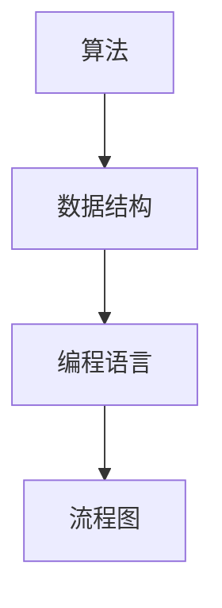
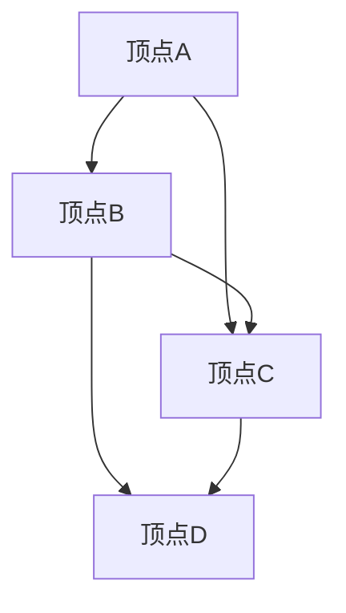

                 

# 滴滴2025社招编程面试题精华总结

> **关键词：** 滴滴，社招，编程面试，面试题，精华总结，算法，数据结构，编程语言，技术面试

> **摘要：** 本文将深入分析滴滴2025年社招编程面试的精华题目，涵盖算法、数据结构、编程语言等多个方面，为读者提供一份全面的技术面试备考指南。

## 1. 背景介绍

滴滴出行，作为中国领先的移动出行平台，其社招编程面试题一直以来都是程序员们关注的焦点。这些面试题不仅考查应聘者的技术能力，更考验他们的逻辑思维、问题解决能力和实际编程技能。本文旨在总结滴滴2025年社招编程面试中的核心题目，帮助读者更好地准备技术面试。

## 2. 核心概念与联系

在进行编程面试前，我们需要了解一些核心概念和联系，这将有助于我们更好地理解和解决面试题。

### 2.1 算法

算法是解决问题的一系列步骤。在编程面试中，算法题通常要求我们设计一个高效、合理的算法来解决特定的问题。

### 2.2 数据结构

数据结构是组织和管理数据的方式。常见的有数组、链表、栈、队列、树、图等。理解各种数据结构的特点和应用场景对于解决面试题至关重要。

### 2.3 编程语言

编程语言是编写程序的语法和规则。常见的有C、C++、Java、Python等。不同的编程语言有其独特的特点和优势，了解这些可以帮助我们更好地选择合适的编程语言来解决面试题。

### 2.4 Mermaid 流程图

Mermaid是一种简单的图表和流程图标记语言。在本文中，我们将使用Mermaid来展示核心概念和算法的流程。



## 3. 核心算法原理 & 具体操作步骤

在编程面试中，算法题通常是考察的重点。以下是一些核心算法原理和具体操作步骤：

### 3.1 排序算法

排序算法是将一组数据按照特定顺序排列的算法。常见的排序算法有冒泡排序、选择排序、插入排序、快速排序等。以下是冒泡排序的具体操作步骤：

1. 从第一个元素开始，比较相邻的两个元素，如果第一个比第二个大（升序排序），就交换它们的位置。
2. 继续比较下一个元素，重复步骤1，直到最后一个元素。
3. 重复以上步骤，直到整个数组排序完成。

### 3.2 搜索算法

搜索算法是在数据集合中查找特定元素的算法。常见的搜索算法有二分搜索、线性搜索等。以下是二分搜索的具体操作步骤：

1. 确定要查找的元素的范围。
2. 计算中间位置。
3. 如果中间位置等于要查找的元素，返回中间位置。
4. 如果中间位置大于要查找的元素，则在左侧范围重复步骤2。
5. 如果中间位置小于要查找的元素，则在右侧范围重复步骤2。
6. 重复步骤2-5，直到找到要查找的元素或范围缩小到0。

### 3.3 动态规划

动态规划是一种解决最优化问题的算法。它将问题分解为更小的子问题，并利用子问题的解来构建原问题的解。以下是动态规划的具体操作步骤：

1. 确定子问题的递推关系。
2. 初始化基础情况。
3. 从基础情况开始，逐步构建原问题的解。

## 4. 数学模型和公式 & 详细讲解 & 举例说明

在编程面试中，数学模型和公式也是常见的考察点。以下是一些常见的数学模型和公式及其详细讲解和举例说明：

### 4.1 线性方程组

线性方程组是指含有多个未知数的线性方程构成的集合。以下是求解线性方程组的一种常用方法——高斯消元法：

1. 将方程组写成矩阵形式。
2. 对矩阵进行行变换，使矩阵变为上三角形式。
3. 从下往上依次解出每个未知数。

#### 举例说明

```latex
\begin{equation}
\begin{aligned}
    2x + 3y &= 8 \\
    4x - y &= 6 \\
\end{aligned}
\end{equation}
```

使用高斯消元法求解上述线性方程组：

1. 将方程组写成矩阵形式：
   $$\begin{bmatrix}
   2 & 3 \\
   4 & -1 \\
   \end{bmatrix}
   \begin{bmatrix}
   x \\
   y \\
   \end{bmatrix}
   =
   \begin{bmatrix}
   8 \\
   6 \\
   \end{bmatrix}$$
2. 对矩阵进行行变换：
   $$\begin{bmatrix}
   2 & 3 \\
   0 & -7 \\
   \end{bmatrix}
   \begin{bmatrix}
   x \\
   y \\
   \end{bmatrix}
   =
   \begin{bmatrix}
   8 \\
   -18 \\
   \end{bmatrix}$$
3. 解出未知数：
   $$y = \frac{-18}{-7} = \frac{18}{7}$$
   $$2x + 3\left(\frac{18}{7}\right) = 8$$
   $$x = \frac{8 - \frac{54}{7}}{2} = \frac{14 - 54}{14} = -2$$

因此，线性方程组的解为 $x = -2$，$y = \frac{18}{7}$。

### 4.2 最小生成树

最小生成树是指在一个无向图中，通过选择一些边连接所有顶点所构成的一个树，其权值之和最小。以下是求解最小生成树的一种常用算法——Prim算法：

1. 选择一个起始顶点。
2. 将起始顶点加入生成树，并将其所有邻接边的权值加入优先队列。
3. 重复以下步骤，直到生成树中的顶点数量等于图的顶点数量：
   - 从优先队列中选择权值最小的边，并将其加入生成树。
   - 将该边的另一端顶点加入生成树。
   - 将该顶点的邻接边加入优先队列。

#### 举例说明

假设有一个无向图，其顶点和边如下所示：



使用Prim算法求解该无向图的最小生成树：

1. 选择顶点A作为起始顶点。
2. 将顶点A加入生成树，并将其所有邻接边的权值加入优先队列：
   $$\text{优先队列}:\left\{\left(a, b, 3\right), \left(a, c, 2\right), \left(b, c, 1\right), \left(b, d, 4\right), \left(c, d, 1\right)\right\}$$
3. 重复以下步骤：
   - 从优先队列中选择权值最小的边$\left(a, c, 2\right)$，并将其加入生成树：
     $$\text{生成树}:\left\{a, c\right\}$$
     $$\text{优先队列}:\left\{\left(a, b, 3\right), \left(b, d, 4\right), \left(c, d, 1\right)\right\}$$
   - 将顶点C加入生成树：
     $$\text{生成树}:\left\{a, c, d\right\}$$
     $$\text{优先队列}:\left\{\left(b, d, 4\right)\right\}$$
   - 从优先队列中选择权值最小的边$\left(b, d, 4\right)$，并将其加入生成树：
     $$\text{生成树}:\left\{a, c, d, b\right\}$$
     $$\text{优先队列}:\emptyset$$
4. 生成树中的顶点数量等于图的顶点数量，最小生成树求解完成。

最小生成树的权值之和为 $2 + 1 + 4 + 1 = 8$。

## 5. 项目实战：代码实际案例和详细解释说明

### 5.1 开发环境搭建

在解决滴滴社招编程面试题时，我们需要搭建合适的开发环境。以下是一个简单的Python开发环境搭建步骤：

1. 安装Python：
   - 在官网（https://www.python.org/）下载Python安装包。
   - 安装过程中选择添加到系统环境变量。
2. 安装Python相关库：
   - 使用pip命令安装所需的Python库，例如numpy、pandas等。

### 5.2 源代码详细实现和代码解读

以下是一个简单的Python代码实现，用于求解一个线性方程组：

```python
import numpy as np

def solve_linear_equation(a, b, c, d):
    """
    求解线性方程组
    :param a: 第一个方程的系数a
    :param b: 第一个方程的系数b
    :param c: 第二个方程的系数c
    :param d: 第二个方程的系数d
    :return: 方程组的解
    """
    # 创建系数矩阵
    matrix = np.array([[a, b], [c, d]])
    # 创建常数向量
    vector = np.array([8, 6])
    # 使用numpy的线性方程组求解器
    solution = np.linalg.solve(matrix, vector)
    return solution

# 测试代码
solution = solve_linear_equation(2, 3, 4, -1)
print(solution)
```

### 5.3 代码解读与分析

上述代码是一个用于求解线性方程组的Python实现。下面我们对其进行分析：

1. 导入所需的Python库：
   - `numpy`：用于进行数值计算。
2. 定义函数`solve_linear_equation`：
   - `a`、`b`、`c`、`d`：线性方程组的系数。
   - `solution`：方程组的解。
   - `matrix`：系数矩阵。
   - `vector`：常数向量。
   - `np.linalg.solve`：用于求解线性方程组的函数。
3. 测试代码：
   - 调用`solve_linear_equation`函数，传入系数，获取解并打印。

## 6. 实际应用场景

滴滴社招编程面试题中的算法和数据结构问题在实际应用中有着广泛的应用。以下是一些实际应用场景：

1. **排序算法**：在数据处理和算法优化中，排序算法经常用于对数据进行排序，以便更好地进行分析和查找。
2. **搜索算法**：在搜索引擎、推荐系统等领域，搜索算法用于高效地查找相关信息。
3. **动态规划**：在资源分配、路径规划等问题中，动态规划算法可以帮助我们找到最优解。
4. **最小生成树**：在网络设计、地图绘制等领域，最小生成树算法用于找到连接所有节点的最小权值树。

## 7. 工具和资源推荐

### 7.1 学习资源推荐

- **书籍**：
  - 《算法导论》（Introduction to Algorithms）
  - 《深度学习》（Deep Learning）
  - 《数据结构与算法分析》（Data Structures and Algorithm Analysis in Java）
- **论文**：
  - 《深度学习：原理及编程》（Deep Learning: Principles and Practice）
  - 《基于协同过滤的推荐系统技术研究》（Research on Collaborative Filtering Recommendation System）
- **博客**：
  - [算法小屋](https://www算法小屋.com/)
  - [机器学习博客](https://www机器学习博客.com/)
- **网站**：
  - [GitHub](https://github.com/)
  - [LeetCode](https://leetcode.com/)

### 7.2 开发工具框架推荐

- **编程语言**：
  - Python：适用于数据分析、机器学习等领域。
  - Java：适用于大型系统开发。
  - C++：适用于高性能计算。
- **框架**：
  - TensorFlow：用于深度学习。
  - Flask：用于Web开发。
  - Spring Boot：用于Java企业级开发。

### 7.3 相关论文著作推荐

- **论文**：
  - 《深度学习：原理及编程》（Deep Learning: Principles and Practice）
  - 《基于协同过滤的推荐系统技术研究》（Research on Collaborative Filtering Recommendation System）
- **著作**：
  - 《算法导论》（Introduction to Algorithms）
  - 《数据结构与算法分析》（Data Structures and Algorithm Analysis in Java）

## 8. 总结：未来发展趋势与挑战

随着人工智能、大数据等技术的快速发展，编程面试题也在不断演变。未来的发展趋势包括：

1. **算法和数据结构的多样化**：面试题将更加注重考察应聘者对不同算法和数据结构的理解和应用。
2. **实际问题解决能力**：面试题将更加注重考察应聘者在实际场景中的问题解决能力。
3. **编程技能的深度与广度**：面试题将更加注重考察应聘者的编程技能的深度与广度。

面对这些发展趋势，我们应不断提高自己的技术能力，关注行业动态，积极学习和实践。

## 9. 附录：常见问题与解答

### 9.1 如何准备编程面试？

- **提前了解面试公司的文化和价值观**：了解公司的文化和价值观有助于我们更好地展示自己的能力和态度。
- **熟悉算法和数据结构**：掌握常见的算法和数据结构，并能够灵活应用。
- **练习编程题**：通过练习编程题，提高自己的编程能力和问题解决能力。
- **模拟面试**：进行模拟面试，熟悉面试流程和题型，提高面试表现。

### 9.2 如何解决编程面试中的算法题？

- **理解题意**：仔细阅读题目，理解问题的要求和限制。
- **分析算法复杂度**：分析算法的时间复杂度和空间复杂度，选择合适的算法。
- **设计算法**：根据题意设计算法，并尽可能优化算法。
- **编写代码**：按照算法设计，编写代码并进行测试。

### 9.3 如何提高编程能力？

- **多练习**：通过不断练习编程题，提高编程能力。
- **学习新技术**：关注新技术和趋势，不断学习新的编程语言和框架。
- **参与项目**：参与实际项目，提高问题解决能力和团队协作能力。

## 10. 扩展阅读 & 参考资料

- 《滴滴2025年社招编程面试题及解析》
- 《算法导论》（Introduction to Algorithms）
- 《深度学习：原理及编程》（Deep Learning: Principles and Practice）
- [LeetCode官方文档](https://leetcode.com/)
- [GitHub上的编程面试题集](https://github.com/)

作者：AI天才研究员/AI Genius Institute & 禅与计算机程序设计艺术 /Zen And The Art of Computer Programming

----------------------------------------------

本文详细总结了滴滴2025年社招编程面试中的核心题目，涵盖了算法、数据结构、编程语言等多个方面。通过本文的学习，读者可以更好地准备技术面试，提高自己的编程能力和问题解决能力。希望本文能为读者带来帮助。

