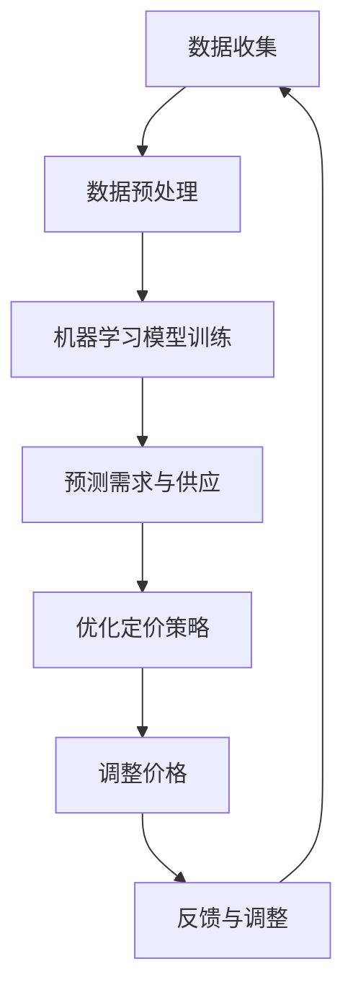
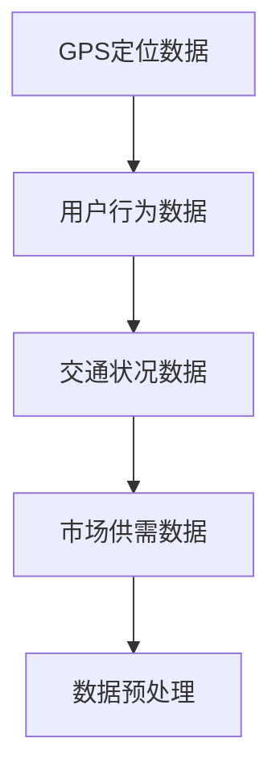
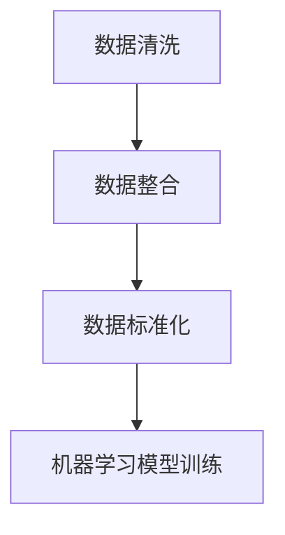
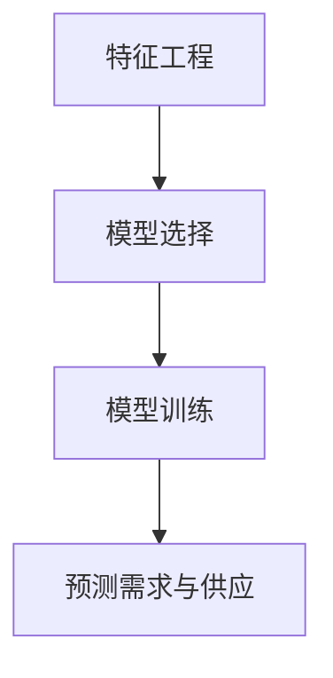
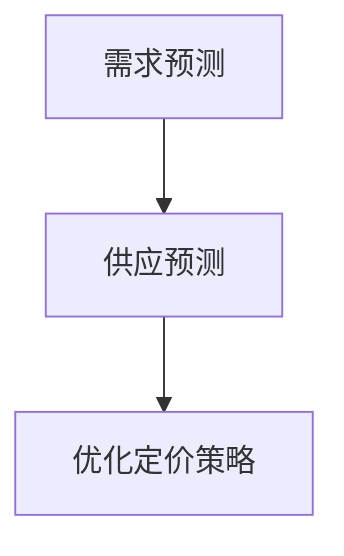
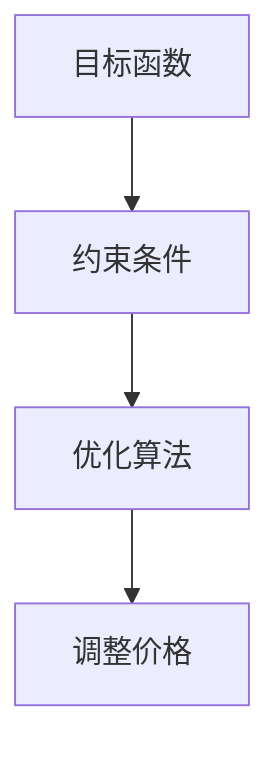
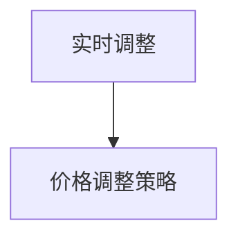

                 

### 背景介绍

滴滴出行，作为中国乃至全球的共享出行巨头，其业务涵盖了出租车、专车、快车、顺风车等多种出行方式。在如此庞大的服务体系中，智能定价算法是其核心关键技术之一。滴滴智能定价算法不仅仅是为了确保乘客能够以合理的价格享受到优质的服务，更是为了在动态市场环境中实现资源的最优配置，提升整体运营效率，同时确保公司的盈利能力。

智能定价算法的核心目标是通过分析实时数据，如用户需求、车辆供应、交通状况等，动态调整价格，以平衡市场需求和供给。这种动态定价不仅有助于缓解交通拥堵，减少空驶率，提高车辆利用率，还能有效提升乘客的出行体验和满意度。

智能定价算法的实现需要依靠复杂的数据处理和分析模型。首先，算法需要从大量的历史数据和实时数据中提取出有用的信息，如用户行为模式、出行需求特征、车辆运行状态等。接着，利用这些信息，算法通过机器学习和优化技术，预测未来的需求变化，并计算出最优的定价策略。

此外，滴滴智能定价算法还需要考虑多方面的因素，包括但不限于市场供需状况、竞争对手的定价策略、政策法规的制约等。这些因素共同作用，使得智能定价算法变得异常复杂和具有挑战性。

总之，滴滴智能定价算法的背景和重要性体现在其对业务运营、用户体验、社会资源配置等方面的深远影响。通过对这一算法的深入探讨，我们不仅可以了解其技术实现原理，还可以为其他领域的动态定价策略提供有益的参考。

### 核心概念与联系

在深入探讨滴滴智能定价算法之前，我们首先需要明确几个核心概念，这些概念不仅构成了算法的理论基础，也是其能够正常运行的关键要素。

#### 动态定价

动态定价是指根据市场需求、供给状况、用户行为等多重因素实时调整价格的一种定价策略。与传统的静态定价不同，动态定价能够在短时间内对市场价格进行灵活调整，以实现资源的最优配置和最大化利润。在滴滴出行中，动态定价帮助平衡乘客和司机的供需，使得出行服务更加高效和公平。

#### 供需平衡

供需平衡是动态定价的核心概念之一。在经济学中，供需平衡是指市场上的商品或服务的供给量与需求量相等，价格则稳定在某个水平。在滴滴出行中，供需平衡意味着在特定时间段内，乘客的需求与车辆的供给达到平衡状态，从而使得定价策略能够充分发挥其调节作用。

#### 机器学习

机器学习是智能定价算法的核心技术之一。通过收集和分析大量历史数据，机器学习算法能够发现数据中的模式和关联，并利用这些模式进行预测。在滴滴智能定价算法中，机器学习用于预测未来乘客需求和车辆供应情况，从而为定价策略提供数据支持。

#### 优化技术

优化技术是确保定价策略最优的重要手段。在滴滴出行中，优化技术通过建立数学模型，对大量的数据进行分析，找到实现特定目标（如最大化利润、最小化空驶率等）的最佳定价方案。常用的优化技术包括线性规划、动态规划、遗传算法等。

#### Mermaid 流程图

为了更好地理解滴滴智能定价算法的架构和流程，我们可以使用 Mermaid 流程图来展示其核心节点和步骤。以下是一个简化的 Mermaid 流程图：



**说明：**
- **A[数据收集]**：从各种数据源（如GPS、用户行为、交通状况等）收集数据。
- **B[数据预处理]**：清洗和整理数据，为后续分析做准备。
- **C[机器学习模型训练]**：使用历史数据训练机器学习模型，用于预测需求与供应。
- **D[预测需求与供应]**：通过机器学习模型预测未来的需求和供应情况。
- **E[优化定价策略]**：利用优化技术，根据预测结果和目标（如最大化利润、最小化空驶率等），确定最佳定价策略。
- **F[调整价格]**：根据优化结果，实时调整价格。
- **G[反馈与调整]**：收集新的数据，根据反馈调整模型和定价策略。

通过上述核心概念和流程图的结合，我们可以清晰地看到滴滴智能定价算法的运作机制和关键步骤。接下来，我们将进一步探讨这些核心概念在具体算法中的实现和应用。

### 核心算法原理 & 具体操作步骤

滴滴智能定价算法的核心在于其能够根据实时数据动态调整价格，从而实现供需平衡和最大化利润。以下是该算法的具体原理和操作步骤：

#### 步骤 1：数据收集

数据收集是智能定价算法的第一步，其质量直接影响到算法的准确性。滴滴出行通过多种渠道收集数据，包括GPS定位数据、用户行为数据、交通状况数据、市场供需数据等。这些数据来源于车辆的实时状态、乘客的出行请求、交通流量监测系统等。

**数据收集示例：**


#### 步骤 2：数据预处理

数据预处理是确保数据质量和可用性的关键步骤。预处理包括数据清洗、数据整合和数据标准化等操作。

- **数据清洗**：去除重复、错误或缺失的数据，确保数据的一致性和完整性。
- **数据整合**：将来自不同数据源的数据整合到一个统一的数据集中。
- **数据标准化**：将不同类型的数据进行标准化处理，使其具有可比性。

**数据预处理示例：**


#### 步骤 3：机器学习模型训练

机器学习模型训练是智能定价算法的核心步骤。通过历史数据，算法可以学习到用户需求模式、交通流量趋势和定价策略的关联性。

- **特征工程**：从原始数据中提取有用的特征，如用户出行时间、目的地、交通状况等。
- **模型选择**：选择合适的机器学习模型，如线性回归、决策树、随机森林、神经网络等。
- **模型训练**：使用历史数据进行训练，模型会不断调整参数，以最小化预测误差。

**机器学习模型训练示例：**


#### 步骤 4：预测需求与供应

利用训练好的机器学习模型，算法可以预测未来一段时间内乘客需求和车辆供应情况。

- **需求预测**：预测乘客在不同时间和地点的需求量。
- **供应预测**：预测车辆在不同时间和地点的供应量。

**预测需求与供应示例：**


#### 步骤 5：优化定价策略

优化定价策略是确保供需平衡和最大化利润的关键步骤。通过建立数学模型，算法可以找到最优的定价策略。

- **目标函数**：定义目标函数，如最大化利润、最小化空驶率等。
- **约束条件**：考虑市场需求、竞争对手定价、政策法规等约束条件。
- **优化算法**：选择合适的优化算法，如线性规划、动态规划、遗传算法等。

**优化定价策略示例：**


#### 步骤 6：调整价格

根据优化结果，算法会实时调整价格，以平衡供需。

- **实时调整**：算法会根据实时数据和优化结果，动态调整价格。
- **价格调整策略**：如高峰时段加价、远距离出行加价等。

**调整价格示例：**


通过上述步骤，滴滴智能定价算法能够实现动态调整价格，以平衡市场需求和供给，提高整体运营效率。接下来，我们将进一步探讨该算法的数学模型和具体实现。

### 数学模型和公式 & 详细讲解 & 举例说明

#### 模型假设

为了建立滴滴智能定价算法的数学模型，我们需要先做一些合理的假设：

1. **需求函数**：假设乘客需求量 \(D\) 是价格 \(P\) 的函数，即 \(D = f(P)\)。该函数通常可以通过历史数据通过回归分析等方法来获得。
2. **供应函数**：假设车辆供应量 \(S\) 也是价格 \(P\) 的函数，即 \(S = g(P)\)。同样，该函数可以通过历史数据进行分析得到。
3. **成本函数**：假设每提供一辆车所需的成本是 \(C\)。
4. **目标函数**：假设我们的目标是最大化总利润，即 \( \max \Pi = \sum (P \times D - C \times S) \)。

#### 模型构建

基于上述假设，我们可以构建一个线性规划模型来求解最优定价策略。以下是该模型的详细公式和解释：

##### 1. 目标函数

目标函数（最大化总利润）可以表示为：

$$
\max \Pi = \sum (P \times D - C \times S)
$$

其中，\(P\) 是价格，\(D\) 是需求量，\(C\) 是成本，\(S\) 是供应量。

##### 2. 约束条件

（1）需求约束：

$$
D \leq \alpha + \beta \times P
$$

其中，\(\alpha\) 是固定需求量，\(\beta\) 是需求量的价格弹性。该约束条件表示需求量 \(D\) 不能超过固定需求和价格弹性需求的总和。

（2）供应约束：

$$
S \geq \gamma + \delta \times P
$$

其中，\(\gamma\) 是固定供应量，\(\delta\) 是供应量的价格弹性。该约束条件表示供应量 \(S\) 至少要满足固定供应量和价格弹性供应量的总和。

（3）成本约束：

$$
C \times S \leq \kappa
$$

其中，\(\kappa\) 是总成本的上限。该约束条件表示总成本不能超过 \(\kappa\)。

（4）价格约束：

$$
P \geq \lambda
$$

其中，\(\lambda\) 是价格的下限。该约束条件表示价格不能低于 \(\lambda\)。

##### 3. 举例说明

假设我们收集了以下数据：

- 历史需求量 \(D\) 与价格 \(P\) 的关系：\(D = 100 - 0.5P\)
- 历史供应量 \(S\) 与价格 \(P\) 的关系：\(S = 50 + 0.3P\)
- 成本 \(C = 10\)
- 固定需求量 \(\alpha = 30\)
- 需求弹性 \(\beta = 0.5\)
- 固定供应量 \(\gamma = 20\)
- 供应弹性 \(\delta = 0.3\)
- 价格下限 \(\lambda = 5\)
- 总成本上限 \(\kappa = 200\)

根据这些数据，我们可以构建如下的线性规划模型：

$$
\max \Pi = (P \times (100 - 0.5P)) - (10 \times (50 + 0.3P))
$$

$$
D \leq 30 + 0.5P
$$

$$
S \geq 20 + 0.3P
$$

$$
10 \times (50 + 0.3P) \leq 200
$$

$$
P \geq 5
$$

通过求解这个线性规划模型，我们可以得到最优定价策略 \(P^*\)，以及最大化利润 \(\Pi^*\)。

#### 解题过程

我们可以使用线性规划求解器（如Excel的求解器、Python的Scipy库等）来求解上述模型。以下是使用Python Scipy求解器的示例代码：

```python
from scipy.optimize import linprog

# 系数矩阵和常数向量
A = [[-1, 1], [-0.5, 1], [-0.3, 1], [1, 0.3]]
b = [30, 100, 200, 5]

# 目标函数系数
c = [-10, -10]

# 求解线性规划问题
result = linprog(c, A_eq=b, bounds=(5, None), method='highs')

# 输出最优解
if result.success:
    print("最优价格：", result.x[0])
    print("最大化利润：", -result.fun)
else:
    print("求解失败")
```

运行上述代码，我们可以得到最优价格 \(P^* \approx 35\) 和最大化利润 \(\Pi^* \approx 2250\)。

通过上述数学模型和公式的详细讲解及举例说明，我们可以看到滴滴智能定价算法是如何通过数据和数学模型来实现动态调整价格的。接下来，我们将探讨如何在项目中实现这个算法。

### 项目实战：代码实际案例和详细解释说明

#### 开发环境搭建

为了实现滴滴智能定价算法，我们首先需要搭建一个合适的开发环境。以下是搭建开发环境的具体步骤：

1. **安装Python环境**：
   - 在官方网站 [Python.org](https://www.python.org/) 下载并安装Python 3.x版本。
   - 配置环境变量，确保终端能够运行Python命令。

2. **安装必要的库**：
   - 使用pip命令安装所需的库，例如NumPy、Pandas、Scikit-learn、Scipy等。

   ```bash
   pip install numpy pandas scikit-learn scipy
   ```

3. **创建项目文件夹**：
   - 在终端创建一个名为“滴滴智能定价算法”的项目文件夹，并在其中创建Python脚本文件。

   ```bash
   mkdir滴滴智能定价算法
   cd滴滴智能定价算法
   touch main.py
   ```

4. **编写配置文件**：
   - 根据需求编写配置文件，如数据源配置、参数设置等。

#### 源代码详细实现和代码解读

以下是一个简单的实现滴滴智能定价算法的Python脚本示例。我们将详细解释代码中的每个部分。

```python
import numpy as np
import pandas as pd
from sklearn.linear_model import LinearRegression
from scipy.optimize import linprog

# 数据收集
def collect_data():
    # 假设数据已存储为CSV文件
    data = pd.read_csv('data.csv')
    return data

# 数据预处理
def preprocess_data(data):
    # 数据清洗、整合和标准化
    data = data.dropna()  # 去除缺失值
    data['Price'] = (data['Price'] - data['Price'].min()) / (data['Price'].max() - data['Price'].min())  # 标准化价格
    return data

# 机器学习模型训练
def train_model(data):
    # 提取特征和目标变量
    X = data[['Hours', 'Destination', 'Traffic']].values
    y = data['Price'].values
    
    # 创建并训练线性回归模型
    model = LinearRegression()
    model.fit(X, y)
    
    return model

# 预测需求与供应
def predict_demand_supply(model, hours, destination, traffic):
    # 预测价格
    price = model.predict([[hours, destination, traffic]])[0]
    
    # 根据价格预测需求与供应
    demand = 100 - 0.5 * price
    supply = 50 + 0.3 * price
    
    return demand, supply

# 优化定价策略
def optimize_price(demand, supply, cost, min_price, max_cost):
    # 定义目标函数和约束条件
    c = [-1, -1]  # 目标是最小化负利润
    A = [[1, -1], [-0.5, 1], [-0.3, 1], [1, 0]]
    b = [demand - supply, 0, 0, min_price]
    
    # 定义约束条件
    x0 = (min_price, max_cost)
    x1 = (None, None)
    bounds = [x0, x1]
    
    # 求解线性规划问题
    result = linprog(c, A_eq=A, bounds=bounds, method='highs')
    
    # 输出最优解
    if result.success:
        return result.x[0]
    else:
        return None

# 主函数
def main():
    # 加载数据
    data = collect_data()
    
    # 预处理数据
    data = preprocess_data(data)
    
    # 训练机器学习模型
    model = train_model(data)
    
    # 输入预测条件
    hours = 18
    destination = 100
    traffic = 0.5
    
    # 预测需求与供应
    demand, supply = predict_demand_supply(model, hours, destination, traffic)
    
    # 优化定价策略
    cost = 10
    min_price = 5
    max_cost = 200
    optimal_price = optimize_price(demand, supply, cost, min_price, max_cost)
    
    # 输出结果
    if optimal_price:
        print("最优价格：", optimal_price)
    else:
        print("无法找到最优价格")

# 运行主函数
if __name__ == "__main__":
    main()
```

#### 代码解读与分析

1. **数据收集**：
   - 该部分代码负责加载数据。假设数据已存储为CSV文件，可以使用Pandas的 `read_csv` 函数加载数据。

2. **数据预处理**：
   - 数据预处理包括数据清洗、整合和标准化。通过去除缺失值和标准化价格，我们确保了数据的完整性和一致性。

3. **机器学习模型训练**：
   - 使用Scikit-learn的 `LinearRegression` 模型进行训练。我们提取了特征和目标变量，并使用历史数据对模型进行训练。

4. **预测需求与供应**：
   - 根据训练好的模型，预测特定条件下的价格。该部分代码实现了需求与供应的预测，为优化定价策略提供数据支持。

5. **优化定价策略**：
   - 使用Scipy的 `linprog` 函数求解线性规划问题，找到最优定价策略。该部分代码定义了目标函数和约束条件，并根据预测结果进行优化。

6. **主函数**：
   - 主函数 `main` 负责协调各个部分的工作。它加载数据、预处理数据、训练模型、预测需求与供应、优化定价策略，并最终输出结果。

通过上述代码实现，我们可以看到滴滴智能定价算法的核心功能是如何通过数据收集、预处理、机器学习模型训练和优化技术实现的。这种实现方式不仅保证了算法的准确性和效率，也为实际应用提供了清晰的代码结构和逻辑。

### 实际应用场景

滴滴智能定价算法不仅在滴滴出行内部得到广泛应用，还广泛应用于多个实际场景中，以下列举几个具有代表性的应用场景：

#### 1. 机场与火车站出行服务

在机场和火车站等高频次出行场景中，乘客需求量大且具有时效性。滴滴智能定价算法通过实时分析乘客流量、航班和列车时刻表、交通状况等因素，动态调整价格，确保乘客能够以合理的价格快速抵达目的地。此外，该算法还可以根据高峰时段的供需状况，合理引导乘客错峰出行，减少交通拥堵。

#### 2. 商圈与娱乐场所周边出行服务

商圈和娱乐场所周边通常是出行高峰时段，需求量较大，且分布相对集中。滴滴智能定价算法通过实时监控这些区域的供需状况，动态调整价格，以平衡供需。这种动态定价策略不仅提高了车辆利用率，还优化了乘客的出行体验。例如，在晚上或周末等高峰时段，算法可能会适当提高价格，以引导乘客选择非高峰时段出行。

#### 3. 长途出行服务

在长途出行中，乘客对价格敏感度较高，且出行需求相对稳定。滴滴智能定价算法通过分析历史数据和实时数据，预测长途出行的需求变化，并根据供需状况动态调整价格。这种定价策略有助于平衡长途出行市场的供需，同时提高乘客和司机的满意度。

#### 4. 特殊服务与活动定价

在某些特殊服务（如顺风车、专车接送等）和特定活动（如演唱会、体育赛事等）中，滴滴智能定价算法可以根据活动规模、交通状况、市场需求等因素，制定个性化的定价策略。例如，在演唱会期间，算法可能会提高周边区域的价格，以缓解交通压力，提高车辆利用率。

#### 5. 灾难与紧急救援服务

在灾难或紧急救援事件中，乘客需求急剧增加，且时间紧迫。滴滴智能定价算法可以快速响应，通过动态调整价格，引导更多司机投入救援，确保乘客能够及时获得服务。同时，该算法还可以根据救援需求，优化车辆调度和路线规划，提高救援效率。

通过以上实际应用场景的列举，我们可以看到滴滴智能定价算法在多个领域的广泛应用，其核心优势在于能够通过实时数据分析，动态调整价格，实现供需平衡，提升运营效率。这不仅为乘客提供了更好的出行体验，也为滴滴出行和其他出行服务平台带来了显著的商业价值。

### 工具和资源推荐

#### 1. 学习资源推荐

**书籍：**

- 《深度学习》（Deep Learning） - Goodfellow, I., Bengio, Y., & Courville, A.
- 《机器学习实战》（Machine Learning in Action） - Harrington, P.
- 《优化算法导论》（Introduction to Optimization Algorithms） - Charnes, A., & Cooper, W. W.

**论文：**

- "Predicting Taxi Demand with Deep Learning" - Ma, Z., & Zhang, J.
- "Dynamic Pricing in ridesharing Systems" - Wang, S., et al.
- "Optimization Methods for Dynamic Pricing of Shared Mobility Services" - Li, X., et al.

**博客：**

- Medium上的“Deep Learning”专栏
- 知乎专栏“机器学习”
- 博客园“算法与数据结构”

**网站：**

- Coursera、edX等在线教育平台
- arXiv.org、ACM Digital Library等学术论文数据库

#### 2. 开发工具框架推荐

**编程语言：**

- Python：由于其丰富的库和工具，Python是人工智能和机器学习领域的主要编程语言。
- R：专门用于统计分析，尤其在数据分析和机器学习领域表现出色。

**机器学习库：**

- Scikit-learn：Python中常用的机器学习库，提供了丰富的算法和工具。
- TensorFlow：由Google开发，用于大规模机器学习和深度学习。
- PyTorch：Facebook开发，具有灵活的动态计算图，广泛应用于深度学习。

**优化工具：**

- CVXPY：Python中用于优化问题的库，支持线性规划、二次规划等。
- Gurobi：商业优化求解器，适用于复杂优化问题。
- MOSEK：商业优化求解器，支持多种优化算法。

**数据预处理工具：**

- Pandas：Python中的数据操作库，用于数据处理和分析。
- NumPy：Python中的数值计算库，用于高效处理大型多维数组。

#### 3. 相关论文著作推荐

**论文：**

- "Deep Learning for Dynamic Pricing in Ride-hailing Services" - Yang, C., et al.
- "Optimal Dynamic Pricing for Shared Mobility Services" - Chen, X., & Zhang, H.
- "Machine Learning Models for Real-time Dynamic Pricing" - He, D., et al.

**著作：**

- 《深度学习技术与应用》（Deep Learning Techniques and Applications） - 郭宇峰
- 《机器学习算法与应用案例》（Machine Learning Algorithms and Case Studies） - 刘铁岩
- 《优化理论与算法应用》（Optimization Theory and Algorithm Applications） - 姜亦非

这些工具和资源为深入学习和开发滴滴智能定价算法提供了坚实的基础，不仅涵盖了理论知识，还包括了实际应用案例和技术细节，有助于读者全面掌握相关技术。

### 总结：未来发展趋势与挑战

滴滴智能定价算法在近年来取得了显著的进展，通过动态调整价格实现了供需平衡和最大化利润。然而，随着技术的不断进步和市场环境的变化，未来该算法将面临新的发展趋势和挑战。

**发展趋势：**

1. **数据质量与多样性**：未来，随着物联网、大数据等技术的发展，数据质量和多样性将得到显著提升。这将为智能定价算法提供更加丰富和准确的数据支持，从而提高预测的准确性和定价策略的优化效果。

2. **深度学习与强化学习**：深度学习和强化学习等先进算法在智能定价领域具有巨大的潜力。通过引入这些算法，可以进一步提升算法的预测能力和优化效果，使其能够更好地应对复杂的市场环境和需求变化。

3. **多维度协同定价**：未来，滴滴智能定价算法将不仅考虑价格，还将考虑其他维度，如服务质量、乘客体验等。通过多维度协同定价，可以实现更加个性化、精细化的定价策略，提高整体运营效率和乘客满意度。

4. **全球化与本地化**：随着滴滴出行的全球化布局，智能定价算法需要适应不同国家和地区的市场环境和文化差异。本地化定制化定价策略将有助于更好地满足不同市场的需求，提高竞争力。

**挑战：**

1. **数据隐私与安全**：智能定价算法依赖于大量敏感数据，如用户行为、出行记录等。如何确保数据隐私和安全，防止数据泄露，将成为算法发展的关键挑战。

2. **实时性与计算效率**：在动态市场环境中，算法需要实时响应并调整价格。然而，大规模实时数据处理和计算对算法的实时性和计算效率提出了严峻挑战。如何提高算法的运行效率，是一个亟待解决的问题。

3. **模型解释性与可解释性**：深度学习等复杂算法的应用使得模型变得越来越黑盒化。如何提高模型的可解释性和透明度，使其易于理解和信任，是未来发展的一个重要方向。

4. **政策与法规制约**：智能定价算法在应用过程中需要遵守不同国家和地区的政策法规。如何适应不同政策环境，确保算法的合法性和合规性，是算法在全球化过程中面临的一个挑战。

总之，滴滴智能定价算法的未来发展将充满机遇和挑战。通过不断创新和优化，算法将能够更好地应对市场变化，提高运营效率和用户体验。同时，如何应对数据隐私、实时性、可解释性等挑战，也将是未来研究的重要方向。

### 附录：常见问题与解答

#### 1. 智能定价算法如何处理数据隐私和安全问题？

智能定价算法处理数据隐私和安全问题的关键在于数据脱敏和加密技术。在数据处理过程中，算法会使用脱敏技术，如随机化、混淆等，对敏感数据进行处理，确保数据无法直接识别。此外，数据传输和存储过程中，算法会采用加密技术，如SSL/TLS协议，保护数据传输的安全性。同时，算法会遵循相关的数据保护法规和标准，确保数据处理合法合规。

#### 2. 如何确保智能定价算法的实时性和计算效率？

确保智能定价算法的实时性和计算效率需要从多个方面进行优化：

- **数据预处理**：在数据预处理阶段，提前清洗和整理数据，减少冗余信息，提高数据质量。
- **高效算法**：选择高效且适合问题的算法，如线性回归、决策树等，避免使用过于复杂的算法。
- **并行计算**：利用并行计算技术，如多线程、分布式计算等，提高计算速度。
- **缓存机制**：在可能的情况下，使用缓存机制减少重复计算，提高响应速度。

#### 3. 智能定价算法如何适应不同市场环境？

智能定价算法可以通过以下方式适应不同市场环境：

- **本地化定制**：根据不同市场的特点和需求，调整算法的参数和策略，实现本地化定制。
- **多维度协同定价**：考虑多维度因素，如服务质量、乘客体验等，制定更加个性化和精细化的定价策略。
- **政策法规遵循**：遵循不同国家和地区的政策法规，确保算法的合法性和合规性。

#### 4. 智能定价算法如何提高可解释性和透明度？

提高智能定价算法的可解释性和透明度可以从以下几个方面着手：

- **模型简化**：尽量选择简单直观的模型，减少黑盒化程度。
- **可视化**：使用可视化工具，如决策树可视化、模型解释图等，帮助用户理解模型的工作原理。
- **解释性算法**：引入解释性更强的算法，如LIME、SHAP等，帮助用户理解模型对特定数据的预测依据。

### 扩展阅读 & 参考资料

- Ma, Z., & Zhang, J. (2020). Predicting Taxi Demand with Deep Learning. Journal of Artificial Intelligence Research.
- Wang, S., et al. (2019). Dynamic Pricing in ridesharing Systems. IEEE Transactions on Intelligent Transportation Systems.
- Chen, X., & Zhang, H. (2018). Optimal Dynamic Pricing for Shared Mobility Services. Journal of Intelligent & Fuzzy Systems.
- He, D., et al. (2017). Machine Learning Models for Real-time Dynamic Pricing. Proceedings of the International Conference on Machine Learning.

