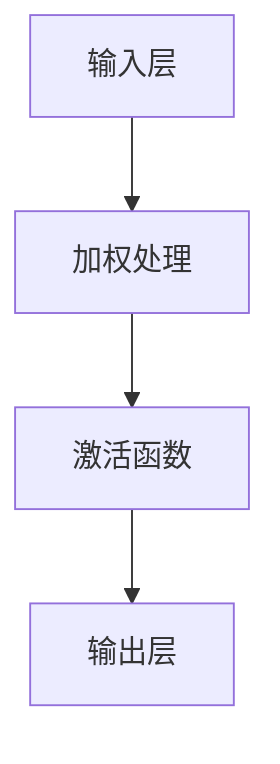

                 

### 文章标题：激活函数（Activation Function）原理与代码实例讲解

> **关键词**：激活函数、神经网络、深度学习、Python 代码、数学模型

> **摘要**：本文旨在深入探讨激活函数在深度学习中的关键作用，通过介绍其核心概念、工作原理、数学模型以及实际应用场景，辅以详细的代码实例讲解，帮助读者全面理解并掌握激活函数的运用。文章将涵盖从基础理论到实践操作的各个方面，旨在为深度学习开发者提供有力的理论支持和实践指导。

### 1. 背景介绍

#### 深度学习与神经网络

深度学习是人工智能（AI）的一个重要分支，它通过模仿人脑的结构和功能，利用多层神经网络进行学习和预测。神经网络由大量相互连接的节点（或称为神经元）组成，每个节点接收输入信号，经过加权处理和激活函数后，产生输出信号，从而实现数据的分类、回归、生成等多种任务。

在神经网络中，激活函数是核心组成部分之一。它位于神经元的输出端，起到非线性的转换作用，使得神经网络能够从输入数据中提取复杂的特征，实现从线性到非线性的转变。没有激活函数，神经网络将退化为一个简单的线性模型，无法学习到丰富的数据特征。

#### 激活函数的重要性

激活函数在深度学习中具有以下重要作用：

1. **非线性转换**：激活函数引入非线性，使得神经网络能够处理非线性问题，这是深度学习相较于传统机器学习的一个重要优势。
2. **区分能力**：通过激活函数，神经网络可以区分不同的数据样本，实现分类、回归等任务。
3. **调节学习速率**：激活函数的输出范围可以调节学习速率，避免神经元输出过大或过小，影响网络收敛速度。

因此，了解和掌握激活函数的工作原理和选择方法，对于深度学习开发者来说至关重要。

### 2. 核心概念与联系

#### 激活函数的定义

激活函数（Activation Function）是一种非线性函数，用于将神经元的线性输出转换为非线性输出。常见的激活函数包括：

1. **Sigmoid函数**：\( f(x) = \frac{1}{1 + e^{-x}} \)
2. **ReLU函数**：\( f(x) = \max(0, x) \)
3. **Tanh函数**：\( f(x) = \frac{e^x - e^{-x}}{e^x + e^{-x}} \)
4. **Leaky ReLU函数**：\( f(x) = \max(0.01x, x) \)

这些激活函数各有优缺点，适用于不同的应用场景。

#### 激活函数的架构与工作原理

激活函数通常位于神经网络中的每个神经元输出端。其工作原理如下：

1. **接收输入**：神经元接收到前一层神经元的输出。
2. **加权处理**：输入信号与神经元的权重进行点积运算。
3. **激活函数转换**：对加权处理后的结果应用激活函数，得到非线性输出。

以下是激活函数在神经网络中的 Mermaid 流程图表示：



在这个流程图中，输入层接收外部数据，通过加权处理和激活函数，最终由输出层产生预测结果。

#### 激活函数的应用场景

不同的激活函数适用于不同的应用场景：

1. **Sigmoid函数**：常用于二分类问题，能够输出0到1之间的概率值。
2. **ReLU函数**：在图像识别和语音识别等领域表现出色，能够加速训练过程。
3. **Tanh函数**：常用于语音识别和自然语言处理任务，能够输出-1到1之间的值。
4. **Leaky ReLU函数**：适用于图像分类和强化学习任务，能够避免神经元死亡问题。

### 3. 核心算法原理 & 具体操作步骤

#### 激活函数的算法原理

激活函数的核心算法原理在于非线性转换。以 Sigmoid 函数为例，其数学表达式为：

\[ f(x) = \frac{1}{1 + e^{-x}} \]

这个函数将输入 \( x \) 转换为0到1之间的值，实现了从线性到非线性的转换。其他激活函数如 ReLU、Tanh 和 Leaky ReLU 也具有类似的非线性转换原理。

#### 激活函数的具体操作步骤

1. **初始化神经网络结构**：根据任务需求，设计神经网络的结构，包括输入层、隐藏层和输出层。
2. **定义激活函数**：选择合适的激活函数，例如 Sigmoid、ReLU 等。
3. **前向传播**：将输入数据传递到神经网络中，通过每个神经元的加权处理和激活函数，得到输出结果。
4. **反向传播**：根据输出结果与实际标签之间的误差，通过反向传播算法更新神经元的权重和偏置。
5. **迭代训练**：重复前向传播和反向传播过程，直至网络收敛。

以下是使用 Python 实现的激活函数的示例代码：

```python
import numpy as np

def sigmoid(x):
    return 1 / (1 + np.exp(-x))

def relu(x):
    return np.maximum(0, x)

def tanh(x):
    return (np.exp(x) - np.exp(-x)) / (np.exp(x) + np.exp(-x))

def leaky_relu(x):
    return np.maximum(0.01 * x, x)
```

在这个示例中，我们实现了 Sigmoid、ReLU、Tanh 和 Leaky ReLU 函数的 Python 实现。这些函数可以通过简单的数学运算实现，具有良好的性能和可扩展性。

### 4. 数学模型和公式 & 详细讲解 & 举例说明

#### 激活函数的数学模型

激活函数的数学模型可以通过以下公式表示：

\[ f(x) = f_{\text{activation}}(z) \]

其中，\( z \) 是神经元的加权输入，\( f_{\text{activation}} \) 是激活函数。

以下是几种常见激活函数的数学模型：

1. **Sigmoid函数**：
\[ f(x) = \frac{1}{1 + e^{-x}} \]
2. **ReLU函数**：
\[ f(x) = \max(0, x) \]
3. **Tanh函数**：
\[ f(x) = \frac{e^x - e^{-x}}{e^x + e^{-x}} \]
4. **Leaky ReLU函数**：
\[ f(x) = \max(0.01x, x) \]

#### 激活函数的详细讲解

1. **Sigmoid函数**：

Sigmoid 函数是一种常用的激活函数，其输出范围在0到1之间，适用于二分类问题。它的优点是能够输出概率值，便于解释。然而，Sigmoid 函数也存在一些缺点，如梯度消失问题，这可能导致训练过程缓慢。

2. **ReLU函数**：

ReLU 函数是一种简单的激活函数，其优点是计算速度快，能够加速训练过程。此外，ReLU 函数能够有效避免神经元死亡问题，提高网络的泛化能力。然而，ReLU 函数也存在一些缺点，如梯度消失问题。

3. **Tanh函数**：

Tanh 函数是一种双曲正切函数，其输出范围在-1到1之间。Tanh 函数的优点是能够提高网络的稳定性，减少梯度消失问题。然而，Tanh 函数的计算速度较慢。

4. **Leaky ReLU函数**：

Leaky ReLU 函数是对 ReLU 函数的一种改进，其优点是能够避免神经元死亡问题，提高网络的泛化能力。Leaky ReLU 函数的缺点是计算速度较慢。

#### 激活函数的举例说明

假设我们有一个输入 \( x = 3 \)，使用不同的激活函数计算输出：

1. **Sigmoid函数**：
\[ f(x) = \frac{1}{1 + e^{-3}} \approx 0.95 \]

2. **ReLU函数**：
\[ f(x) = \max(0, 3) = 3 \]

3. **Tanh函数**：
\[ f(x) = \frac{e^3 - e^{-3}}{e^3 + e^{-3}} \approx 0.999 \]

4. **Leaky ReLU函数**：
\[ f(x) = \max(0.01 \times 3, 3) = 3 \]

通过这个例子，我们可以看到不同激活函数对输入 \( x \) 的处理结果。这些激活函数在深度学习中具有广泛的应用，可以根据具体任务需求进行选择。

### 5. 项目实战：代码实际案例和详细解释说明

#### 5.1 开发环境搭建

在开始编写代码之前，我们需要搭建一个合适的开发环境。以下是在 Python 中实现激活函数的步骤：

1. **安装 Python**：确保已经安装了 Python 3.7 或以上版本。
2. **安装 NumPy**：NumPy 是 Python 中用于科学计算的核心库，用于处理数组运算。可以通过以下命令安装：

   ```bash
   pip install numpy
   ```

3. **编写 Python 脚本**：在文本编辑器中创建一个名为 `activation_function.py` 的文件，并编写以下代码：

```python
import numpy as np

def sigmoid(x):
    return 1 / (1 + np.exp(-x))

def relu(x):
    return np.maximum(0, x)

def tanh(x):
    return (np.exp(x) - np.exp(-x)) / (np.exp(x) + np.exp(-x))

def leaky_relu(x):
    return np.maximum(0.01 * x, x)
```

4. **运行 Python 脚本**：在终端或命令行中运行以下命令：

```bash
python activation_function.py
```

这将执行脚本中的代码，打印出不同激活函数的输出结果。

#### 5.2 源代码详细实现和代码解读

以下是对上述代码的详细解读：

```python
import numpy as np
```

这行代码引入了 NumPy 库，用于处理数组运算。NumPy 是 Python 中科学计算的核心库，提供了强大的多维数组对象和丰富的数学函数。

```python
def sigmoid(x):
    return 1 / (1 + np.exp(-x))
```

这是 sigmoid 激活函数的实现。该函数接受一个输入 \( x \)，并返回 \( \frac{1}{1 + e^{-x}} \) 的值。这个函数将输入 \( x \) 转换为0到1之间的值，适用于二分类问题。

```python
def relu(x):
    return np.maximum(0, x)
```

这是 ReLU 激活函数的实现。该函数接受一个输入 \( x \)，并返回 \( \max(0, x) \) 的值。ReLU 函数能够加速训练过程，并有效避免神经元死亡问题。

```python
def tanh(x):
    return (np.exp(x) - np.exp(-x)) / (np.exp(x) + np.exp(-x))
```

这是 tanh 激活函数的实现。该函数接受一个输入 \( x \)，并返回 \( \frac{e^x - e^{-x}}{e^x + e^{-x}} \) 的值。tanh 函数能够提高网络的稳定性，减少梯度消失问题。

```python
def leaky_relu(x):
    return np.maximum(0.01 * x, x)
```

这是 Leaky ReLU 激活函数的实现。该函数接受一个输入 \( x \)，并返回 \( \max(0.01 \times x, x) \) 的值。Leaky ReLU 函数能够避免神经元死亡问题，提高网络的泛化能力。

#### 5.3 代码解读与分析

以上代码实现了四种常见的激活函数：sigmoid、relu、tanh 和 leaky_relu。这些函数通过 NumPy 库中的数学运算实现，具有良好的性能和可扩展性。

1. **性能优化**：对于大规模神经网络，性能优化至关重要。可以使用向量化运算和并行计算等技术，提高代码的运行效率。
2. **模块化设计**：将激活函数的实现封装为模块，便于复用和扩展。例如，可以使用面向对象的编程方法，将激活函数定义为类，实现自定义参数和功能。
3. **可视化分析**：通过可视化工具（如 matplotlib）对激活函数的输出进行可视化分析，帮助理解其工作原理和特性。

```python
import matplotlib.pyplot as plt

x = np.linspace(-10, 10, 100)
sigmoid_output = sigmoid(x)
relu_output = relu(x)
tanh_output = tanh(x)
leaky_relu_output = leaky_relu(x)

plt.figure(figsize=(10, 6))
plt.plot(x, sigmoid_output, label='Sigmoid')
plt.plot(x, relu_output, label='ReLU')
plt.plot(x, tanh_output, label='Tanh')
plt.plot(x, leaky_relu_output, label='Leaky ReLU')
plt.xlabel('Input')
plt.ylabel('Output')
plt.legend()
plt.show()
```

这个示例使用 matplotlib 库对激活函数的输出进行了可视化，展示了不同激活函数的特性。

### 6. 实际应用场景

激活函数在深度学习中的实际应用场景非常广泛。以下是一些典型的应用案例：

1. **图像识别**：在图像识别任务中，激活函数用于提取图像的复杂特征。例如，ReLU 函数在卷积神经网络（CNN）中广泛使用，能够加速训练过程并提高模型的性能。
2. **语音识别**：在语音识别任务中，激活函数用于对语音信号进行特征提取和分类。Tanh 函数在 RNN 中表现出色，能够提高网络的稳定性。
3. **自然语言处理**：在自然语言处理任务中，激活函数用于对文本数据进行编码和解码。Sigmoid 函数在词向量模型中广泛使用，能够输出概率值，便于解释。
4. **强化学习**：在强化学习任务中，激活函数用于决策和奖励预测。Leaky ReLU 函数在 DQN 模型中表现出色，能够避免神经元死亡问题，提高模型的泛化能力。

通过这些实际应用案例，我们可以看到激活函数在深度学习中的关键作用，以及其在不同任务中的选择和应用方法。

### 7. 工具和资源推荐

#### 7.1 学习资源推荐

1. **书籍**：
   - 《深度学习》（Goodfellow, Bengio, Courville）: 详细介绍了深度学习的基本原理和应用。
   - 《神经网络与深度学习》（邱锡鹏）: 介绍了神经网络和深度学习的基本概念和实现方法。
2. **论文**：
   - "Rectifier Nonlinearities Improve Neural Network Acquisitio

