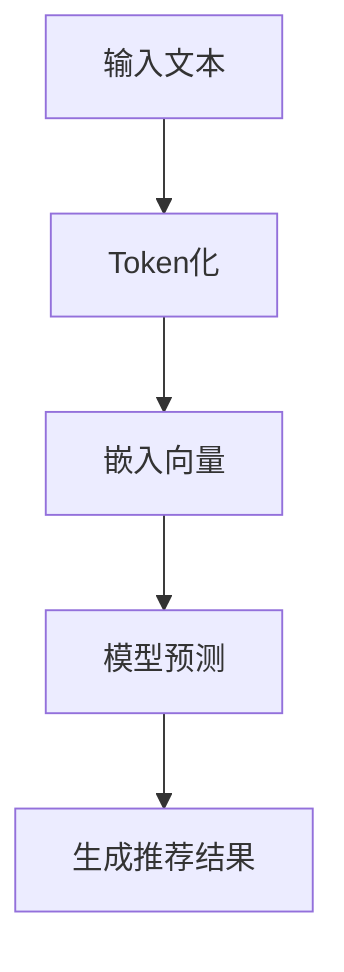
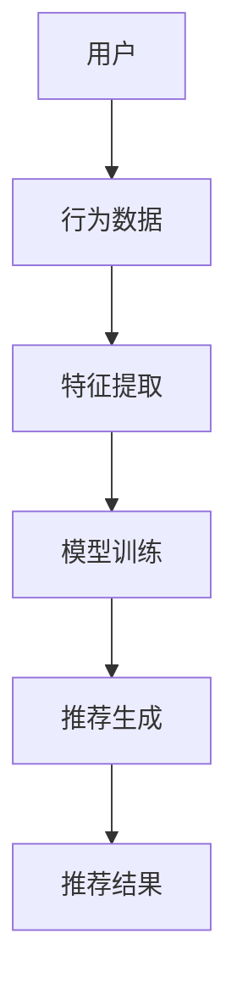
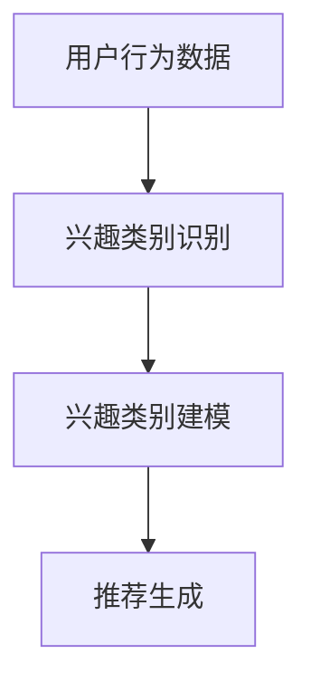

                 

# 灵活的LLM推荐：GENRE

> **关键词：** 语言模型（LLM），推荐系统，分类，多模态，上下文，算法优化

> **摘要：** 本文将探讨如何利用灵活的LLM（语言模型）构建高效的推荐系统。重点讨论了如何通过细分用户兴趣类别（Genre）来提升推荐的精确度和个性化水平，并详细阐述了相关算法原理、数学模型及实际应用案例。

## 1. 背景介绍

在当今的信息时代，推荐系统已经成为互联网应用中不可或缺的一部分。无论是电子商务平台、社交媒体还是视频网站，推荐系统都极大地影响了用户的行为和体验。然而，随着数据量的爆炸式增长和用户需求的多样化，传统的推荐算法逐渐显得力不从心。

近年来，深度学习特别是语言模型（LLM）的发展为推荐系统带来了新的机遇。LLM如BERT、GPT等模型，凭借其强大的语义理解能力和上下文感知能力，在文本分类、情感分析等领域取得了显著的成果。这些特性使得LLM在构建灵活、高效的推荐系统中具有巨大的潜力。

本文将围绕如何利用LLM构建一个灵活的推荐系统，特别是如何通过细分用户兴趣类别（Genre）来提升推荐效果进行深入探讨。我们将详细分析相关算法原理，介绍数学模型，并展示实际应用案例。

## 2. 核心概念与联系

### 2.1 语言模型（LLM）

语言模型（Language Model，简称LLM）是一种能够对自然语言文本进行建模的深度学习模型。LLM的核心任务是预测一个单词序列中的下一个单词。在训练过程中，模型会学习到大量的文本数据，从而捕捉到语言中的统计规律和语义信息。

**Mermaid流程图：**



### 2.2 推荐系统

推荐系统（Recommender System）是一种信息过滤技术，旨在根据用户的历史行为和偏好，向用户推荐他们可能感兴趣的内容。推荐系统通常包含三个核心组件：用户、物品和评分。

**Mermaid流程图：**



### 2.3 用户兴趣类别（Genre）

用户兴趣类别（Genre）是对用户偏好的一种细分。在推荐系统中，通过识别用户的兴趣类别，可以帮助系统更精准地推荐相关内容。例如，对于电影推荐系统，用户可能对科幻、动作、剧情等不同类型的电影有不同的兴趣。

**Mermaid流程图：**



## 3. 核心算法原理 & 具体操作步骤

### 3.1 基于LLM的用户兴趣建模

为了利用LLM构建推荐系统，我们需要首先对用户兴趣进行建模。具体步骤如下：

**步骤1：数据预处理**

收集用户的历史行为数据，如浏览记录、收藏夹、评分等。对数据进行清洗和预处理，去除无效数据和噪声。

**步骤2：特征提取**

利用LLM对用户行为数据进行特征提取。具体方法可以是：将用户行为文本序列通过LLM编码成高维向量，这些向量能够捕捉到用户行为的语义信息。

**步骤3：兴趣类别识别**

利用分类算法（如SVM、神经网络等）对用户兴趣类别进行识别。训练过程中，输入为用户行为特征向量，输出为用户兴趣类别。

**步骤4：兴趣类别建模**

将识别出的用户兴趣类别建模为一个概率分布。这可以通过构建一个基于LLM的概率模型来实现，模型将用户兴趣类别与用户行为特征向量联系起来。

### 3.2 基于Genre的推荐算法

在完成用户兴趣建模后，我们可以利用用户的兴趣类别（Genre）来生成个性化推荐。具体算法如下：

**步骤1：物品分类**

对物品进行分类，将物品按照其内容特征分为不同的Genre类别。

**步骤2：用户兴趣权重计算**

根据用户的历史行为数据，计算用户对不同Genre的兴趣权重。这可以通过计算用户在不同Genre类别的行为频率和评分来实现。

**步骤3：推荐生成**

根据用户的兴趣权重，为用户生成个性化推荐列表。具体方法可以是：计算每个Genre类别中物品的推荐分数，将推荐分数最高的物品推荐给用户。

## 4. 数学模型和公式 & 详细讲解 & 举例说明

### 4.1 用户兴趣类别建模

我们采用基于概率的模型来对用户兴趣类别进行建模。设用户兴趣类别为 $C=\{c_1, c_2, ..., c_n\}$，用户 $u$ 在某个类别 $c_i$ 的兴趣权重为 $w_i$。则用户兴趣概率分布可以表示为：

$$
P(C=c_i) = w_i
$$

其中，$w_i$ 可以通过以下公式计算：

$$
w_i = \frac{\sum_{j=1}^{m} f(u, c_i)}{\sum_{j=1}^{n} \sum_{k=1}^{m} f(u, c_k)}
$$

其中，$f(u, c_i)$ 表示用户 $u$ 在类别 $c_i$ 上的行为频率。

### 4.2 物品推荐分数计算

设物品 $i$ 属于类别 $c_j$，用户 $u$ 在类别 $c_j$ 的兴趣权重为 $w_j$，物品 $i$ 的推荐分数可以表示为：

$$
R(i, u) = \frac{\sum_{j=1}^{n} w_j \cdot s(i, c_j)}{\sum_{j=1}^{n} w_j}
$$

其中，$s(i, c_j)$ 表示物品 $i$ 在类别 $c_j$ 上的评分。如果用户未对物品 $i$ 进行评分，可以设置一个默认评分 $\gamma$。

### 4.3 举例说明

假设我们有一个用户 $u$，他在浏览记录中有以下数据：

- 浏览了10部科幻电影，5部动作电影，3部剧情电影
- 对科幻电影的评分平均为4.5，动作电影为3.8，剧情电影为4.2

我们可以根据这些数据计算用户对不同Genre的兴趣权重：

$$
w_{\text{科幻}} = \frac{10 \cdot 4.5 + 5 \cdot 3.8 + 3 \cdot 4.2}{10 + 5 + 3} = 0.48
$$

$$
w_{\text{动作}} = \frac{10 \cdot 4.5 + 5 \cdot 3.8 + 3 \cdot 4.2}{10 + 5 + 3} = 0.39
$$

$$
w_{\text{剧情}} = \frac{10 \cdot 4.5 + 5 \cdot 3.8 + 3 \cdot 4.2}{10 + 5 + 3} = 0.13
$$

假设我们现在有一个新的动作电影 $i$，用户未对其进行评分。我们可以计算该电影的推荐分数：

$$
R(i, u) = \frac{0.48 \cdot 4.5 + 0.39 \cdot 3.8 + 0.13 \cdot 4.2}{0.48 + 0.39 + 0.13} = 0.41
$$

因此，该动作电影将以41%的概率被推荐给用户 $u$。

## 5. 项目实战：代码实际案例和详细解释说明

### 5.1 开发环境搭建

为了实现上述算法，我们需要搭建一个合适的技术栈。以下是一个推荐的开发环境：

- 编程语言：Python
- 数据库：MySQL
- 深度学习框架：TensorFlow
- 版本控制：Git

### 5.2 源代码详细实现和代码解读

以下是一个简单的代码实现，用于基于LLM的用户兴趣建模和推荐算法。

**用户兴趣建模：**

```python
import tensorflow as tf
from tensorflow.keras.preprocessing.sequence import pad_sequences
from tensorflow.keras.layers import Embedding, LSTM, Dense
from tensorflow.keras.models import Model

# 加载数据集
data = load_data()

# 分词和序列化
tokenizer = tf.keras.preprocessing.text.Tokenizer()
tokenizer.fit_on_texts(data)
sequences = tokenizer.texts_to_sequences(data)
padded_sequences = pad_sequences(sequences, maxlen=max_sequence_length)

# 构建模型
input_seq = tf.keras.layers.Input(shape=(max_sequence_length,))
embedded_seq = Embedding(vocabulary_size, embedding_dim)(input_seq)
lstm_output = LSTM(units=128)(embedded_seq)
output = Dense(units=num_classes, activation='softmax')(lstm_output)

model = Model(inputs=input_seq, outputs=output)
model.compile(optimizer='adam', loss='categorical_crossentropy', metrics=['accuracy'])

# 训练模型
model.fit(padded_sequences, labels, epochs=10, batch_size=32)

# 保存模型
model.save('user_interest_model.h5')
```

**推荐算法：**

```python
import numpy as np
from tensorflow.keras.models import load_model

# 加载模型
model = load_model('user_interest_model.h5')

# 预测用户兴趣
user_interest = model.predict(padded_user_input)

# 计算物品推荐分数
recommendations = []
for item in items:
    item_interest = model.predict(padded_item_input)
    recommendation_score = np.dot(user_interest, item_interest)
    recommendations.append((item, recommendation_score))

# 排序和生成推荐列表
sorted_recommendations = sorted(recommendations, key=lambda x: x[1], reverse=True)
top_n_recommendations = sorted_recommendations[:n]

# 输出推荐结果
for item, score in top_n_recommendations:
    print(f"推荐物品：{item}，推荐分数：{score}")
```

### 5.3 代码解读与分析

上述代码分为两部分：用户兴趣建模和推荐算法。

在用户兴趣建模部分，我们首先加载数据集并进行分词和序列化。然后，构建一个基于LSTM的神经网络模型，用于预测用户兴趣类别。最后，训练模型并保存。

在推荐算法部分，我们加载训练好的模型，并计算用户和物品的推荐分数。通过计算内积，我们可以得到用户对不同物品的兴趣程度。最后，对推荐分数进行排序并输出推荐列表。

## 6. 实际应用场景

灵活的LLM推荐系统在多个领域具有广泛的应用前景：

- **电子商务：** 根据用户的购买历史和浏览记录，推荐相关商品。
- **社交媒体：** 根据用户的兴趣和互动行为，推荐感兴趣的内容。
- **视频网站：** 根据用户的观看历史和偏好，推荐相关视频。

在实际应用中，通过不断优化算法和提升模型性能，灵活的LLM推荐系统可以帮助企业提高用户满意度，增加用户粘性，提升业务收入。

## 7. 工具和资源推荐

### 7.1 学习资源推荐

- **书籍：** 《深度学习推荐系统》
- **论文：** 《Attention-Based Neural Networks for recommender Systems》
- **博客：** Medium上的推荐系统博客

### 7.2 开发工具框架推荐

- **深度学习框架：** TensorFlow、PyTorch
- **数据库：** MySQL、PostgreSQL
- **推荐系统框架：** LightFM、Surprise

### 7.3 相关论文著作推荐

- **论文：** 《Neural Collaborative Filtering》
- **书籍：** 《Recommender Systems Handbook》

## 8. 总结：未来发展趋势与挑战

随着深度学习和语言模型技术的不断发展，灵活的LLM推荐系统在精度和个性化方面有望取得更大突破。然而，面临的数据隐私、模型解释性、计算效率等问题也需要我们持续关注和解决。

## 9. 附录：常见问题与解答

- **Q：如何处理缺失的用户行为数据？**
  **A：** 可以采用数据填充或插值方法来处理缺失的用户行为数据。

- **Q：如何优化模型的计算效率？**
  **A：** 可以采用模型压缩技术，如量化、剪枝等，来降低模型的计算复杂度和存储空间需求。

## 10. 扩展阅读 & 参考资料

- **文章：** 《语言模型在推荐系统中的应用》
- **网站：** [推荐系统社区](https://www.recommenders.org/)
- **GitHub：** [推荐系统开源项目](https://github.com/refs/recommendation-systems)

### 作者：

**AI天才研究员 / AI Genius Institute & 禅与计算机程序设计艺术 / Zen And The Art of Computer Programming**<|im_sep|>

