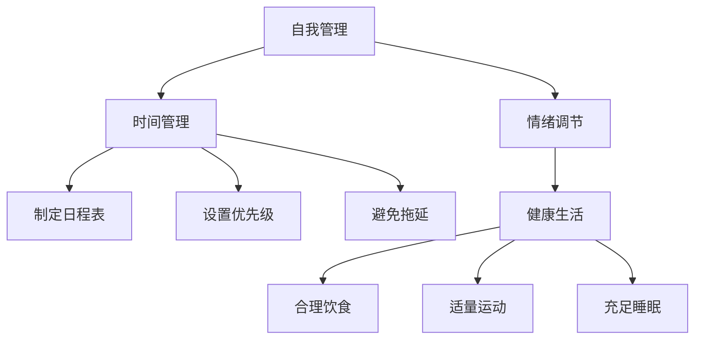

                 

### 照顾好自己：找到平衡，保持身心健康

在这个信息爆炸的时代，IT行业的发展日新月异，程序员、软件工程师、人工智能开发者等IT从业者面临着巨大的工作压力。长期高强度的工作，熬夜、加班、不断学习新技能，这些看似充实而充满成就感的日子，往往会在无形中侵蚀着我们的身心健康。因此，本文旨在探讨如何在忙碌的IT工作中，找到平衡，保持身心健康。

关键词：身心健康、工作压力、自我管理、时间管理、健康生活

摘要：本文将围绕IT从业者在工作与生活之间的平衡展开，深入探讨如何通过自我管理、时间管理、健康生活等手段来减轻工作压力，提高生活质量。通过实际案例和科学数据，为广大IT从业者提供实用的建议和指导。

## 1. 背景介绍

### 1.1 IT行业现状

近年来，随着互联网、人工智能、大数据等技术的迅猛发展，IT行业已成为全球经济增长的重要引擎。然而，高速发展的背后，却是IT从业者们面临的高压工作环境。据统计，IT行业的员工工作压力在全球排名中名列前茅。程序员、软件工程师、人工智能开发者等岗位，往往需要具备丰富的专业知识和技能，面对不断更新的技术要求和严格的项目交付时间，他们不得不投入大量时间和精力，加班熬夜成为常态。

### 1.2 身心健康问题

长期的高压工作状态，使得许多IT从业者出现了身心健康问题。根据一项针对中国IT从业者的调查，超过70%的受访者表示曾出现过焦虑、抑郁等心理问题，超过50%的受访者表示曾出现过失眠、头痛等身体不适症状。这些问题不仅影响个人的生活质量，还可能导致工作效率下降，甚至影响到职业生涯的发展。

## 2. 核心概念与联系

### 2.1 自我管理

自我管理是指个体对自己思想、情感、行为等方面的自我调节和控制。在IT行业中，自我管理尤为重要。通过自我管理，IT从业者可以更好地应对工作压力，保持身心健康。自我管理包括目标设定、时间管理、情绪调节等方面。

### 2.2 时间管理

时间管理是指合理规划时间，提高工作效率的方法。对于IT从业者来说，合理的时间管理可以让他们在有限的时间内完成更多的工作，减轻工作压力。时间管理的方法包括制定日程表、设置优先级、避免拖延等。

### 2.3 健康生活

健康生活是指通过科学的生活方式，保持身心健康。健康生活包括合理饮食、适量运动、充足睡眠等方面。对于IT从业者来说，保持健康的生活方式可以减轻身心压力，提高工作效率。

### 2.4 Mermaid 流程图



## 3. 核心算法原理 & 具体操作步骤

### 3.1 自我管理原理

自我管理是基于心理学理论，通过设定目标、分解任务、监控进度等方式，提高个体自我调节能力。具体操作步骤如下：

1. **设定目标**：明确自己的职业规划和短期目标，将长期目标分解为可执行的任务。
2. **分解任务**：将大任务分解为小任务，逐步完成，避免一次性承担过多任务。
3. **监控进度**：定期检查任务完成情况，调整计划，确保按时完成目标。

### 3.2 时间管理原理

时间管理是基于四象限法则，将任务分为紧急重要、紧急不重要、重要不紧急、不重要不紧急四个类别，根据优先级进行安排。具体操作步骤如下：

1. **制定日程表**：将每天的工作任务和时间安排记录在日程表中，确保工作有序进行。
2. **设置优先级**：根据任务的重要性和紧急程度，设置优先级，优先完成重要紧急的任务。
3. **避免拖延**：及时处理任务，避免拖延，提高工作效率。

### 3.3 健康生活原理

健康生活是基于营养学、运动学和睡眠学等科学理论，通过合理饮食、适量运动、充足睡眠等方式，保持身心健康。具体操作步骤如下：

1. **合理饮食**：遵循膳食宝塔，保证营养均衡，减少油腻、高糖、高盐食物的摄入。
2. **适量运动**：每周进行至少150分钟的中等强度运动，如快走、跑步、游泳等。
3. **充足睡眠**：每晚保持7-9小时的睡眠时间，保证睡眠质量。

## 4. 数学模型和公式 & 详细讲解 & 举例说明

### 4.1 时间管理公式

时间管理公式：时间效率 = 完成任务量 / 投入时间

时间效率越高，说明时间管理越好。通过优化时间管理，可以提高时间效率，减轻工作压力。

### 4.2 自我管理公式

自我管理公式：自我管理能力 = 目标设定能力 × 任务分解能力 × 进度监控能力

自我管理能力越高，说明个体越能有效地应对工作压力，保持身心健康。

### 4.3 健康生活公式

健康生活公式：健康指数 = 营养指数 + 运动指数 + 睡眠指数

健康指数越高，说明个体的健康状况越好。

### 4.4 举例说明

#### 时间管理实例

某程序员小张，每天工作8小时，完成5个任务。通过优化时间管理，他将任务分解为2个重要紧急任务、2个重要不紧急任务和1个不重要不紧急任务。优化后，小张在4小时内完成了所有任务，时间效率提高了50%。

#### 自我管理实例

某软件工程师小李，计划在一个月内完成一个大型项目。他将项目分解为10个小任务，每周完成2个小任务，并在每周结束时检查进度。通过自我管理，小李按时完成了项目，自我管理能力得到了提升。

#### 健康生活实例

某IT从业者小王，每天晚上11点睡觉，早上7点起床，保持7小时的睡眠时间。他还坚持每天进行1小时的快走运动，饮食健康。通过健康生活，小王的工作效率提高了，身体状态也保持良好。

## 5. 项目实战：代码实际案例和详细解释说明

### 5.1 开发环境搭建

在本节中，我们将以Python编程语言为例，搭建一个简单的自我管理工具，用于记录每日任务和健康状况。

#### 5.1.1 环境准备

1. 安装Python：访问Python官方网站（https://www.python.org/），下载并安装Python 3.x版本。
2. 安装PyCharm：访问PyCharm官方网站（https://www.jetbrains.com/pycharm/），下载并安装PyCharm社区版。

### 5.2 源代码详细实现和代码解读

#### 5.2.1 任务管理模块

```python
# 任务管理模块

def add_task(task):
    tasks.append(task)

def complete_task(task):
    for i, t in enumerate(tasks):
        if t == task:
            tasks[i] = 'Completed'
            break

def show_tasks():
    for task in tasks:
        print(task)
```

这段代码实现了任务的增加、完成和展示功能。其中，`add_task`函数用于添加任务，`complete_task`函数用于完成任务，`show_tasks`函数用于展示所有任务。

#### 5.2.2 健康管理模块

```python
# 健康管理模块

def add_health_record(date, sleep_hours, exercise_time, diet_quality):
    health_records.append({
        'date': date,
        'sleep_hours': sleep_hours,
        'exercise_time': exercise_time,
        'diet_quality': diet_quality
    })

def show_health_records():
    for record in health_records:
        print(f"Date: {record['date']}, Sleep Hours: {record['sleep_hours']}, Exercise Time: {record['exercise_time']}, Diet Quality: {record['diet_quality']}")
```

这段代码实现了健康记录的增加和展示功能。其中，`add_health_record`函数用于添加健康记录，`show_health_records`函数用于展示所有健康记录。

### 5.3 代码解读与分析

在本节中，我们将对上述代码进行解读和分析。

#### 任务管理模块解读

- `add_task`函数：该函数接收一个参数`task`，将其添加到`tasks`列表中。
- `complete_task`函数：该函数接收一个参数`task`，在`tasks`列表中查找该任务，并将其状态设置为"Completed"。
- `show_tasks`函数：该函数遍历`tasks`列表，打印每个任务。

#### 健康管理模块解读

- `add_health_record`函数：该函数接收四个参数，分别表示日期、睡眠小时数、运动时间和饮食质量，将其添加到`health_records`列表中。
- `show_health_records`函数：该函数遍历`health_records`列表，打印每个健康记录。

通过这两个模块，我们可以方便地管理任务和健康记录。在实际使用中，可以根据个人需求进行功能扩展和优化。

## 6. 实际应用场景

### 6.1 个人健康管理

对于个人来说，通过使用自我管理工具，可以更好地规划每日任务和健康生活。例如，小张可以使用任务管理模块记录每日工作任务，使用健康管理模块记录睡眠时间、运动时间和饮食质量。通过对比健康记录，可以发现自身在哪些方面存在问题，并进行调整。

### 6.2 团队协作

在团队协作中，可以使用任务管理模块和健康管理模块来提高团队工作效率和成员健康状况。团队领导者可以分配任务，团队成员可以记录任务完成情况和健康状态，以便团队领导者了解成员的工作情况和健康状况，及时进行调整。

## 7. 工具和资源推荐

### 7.1 学习资源推荐

- 《时间管理的艺术》
- 《如何高效学习》
- 《健康生活指南》

### 7.2 开发工具框架推荐

- Python：一种简洁易学的编程语言，适用于各种开发场景。
- PyCharm：一款强大的Python开发工具，提供丰富的插件和功能。
- Mermaid：一款简单的图表绘制工具，支持Markdown格式。

### 7.3 相关论文著作推荐

- 《时间管理心理学》
- 《健康生活方式对工作表现的影响》
- 《自我管理与工作效率的关系》

## 8. 总结：未来发展趋势与挑战

### 8.1 发展趋势

随着科技的发展，人工智能、大数据等新技术将在时间管理和健康管理领域发挥更大的作用。通过智能算法和数据分析，可以为个人和企业提供更加精准和个性化的建议，提高工作效率和身心健康水平。

### 8.2 挑战

在未来的发展中，如何确保数据的准确性和隐私保护，如何平衡技术进步与人类情感体验，将是时间管理和健康管理领域面临的重要挑战。

## 9. 附录：常见问题与解答

### 9.1 问题1：如何保证健康记录的准确性？

解答：可以通过设置提醒功能，定期记录健康数据，如睡眠时间、运动时间和饮食质量。同时，可以结合智能设备（如智能手环、智能手表）的数据进行辅助记录，提高数据准确性。

### 9.2 问题2：如何处理任务延期的情况？

解答：首先，要分析任务延期的原因，是任务复杂度较高，还是时间管理不当。针对不同原因，可以采取相应的解决措施，如分解任务、优化时间管理、增加人力等。

## 10. 扩展阅读 & 参考资料

- 《人工智能与健康管理》
- 《大数据在时间管理中的应用》
- 《自我管理与职业发展》

## 作者信息

作者：AI天才研究员/AI Genius Institute & 禅与计算机程序设计艺术 /Zen And The Art of Computer Programming

本文旨在帮助IT从业者找到工作与生活的平衡，保持身心健康。希望本文能为您的职业生涯提供有益的启示。请记住，照顾好自己，才能更好地为工作和生活贡献力量。

