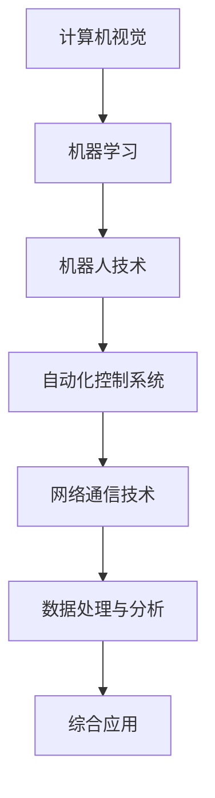

                 

### 背景介绍

物理实体自动化，是指通过计算机技术和人工智能算法，使物理实体（如机器人、自动化生产线等）能够自动执行特定任务的过程。随着人工智能技术的迅猛发展，物理实体自动化已成为工业自动化、智能制造、智能交通等多个领域的重要趋势。本文旨在探讨物理实体自动化的前景与发展，分析其在各个领域中的应用及其面临的挑战。

物理实体自动化技术的发展可追溯至20世纪中期，随着计算机技术和微电子技术的进步，自动化技术在各个领域得到广泛应用。目前，物理实体自动化已经成为智能制造、智能交通、医疗健康等领域的热点研究方向。

在智能制造领域，物理实体自动化技术被广泛应用于生产线自动化、机器人应用等方面。通过自动化技术，可以显著提高生产效率、降低生产成本，实现生产线的无人化操作。例如，汽车制造业中，机器人焊接、机器人喷涂等技术已得到广泛应用，极大地提高了生产效率和产品质量。

在智能交通领域，物理实体自动化技术主要用于无人驾驶汽车、智能交通管理系统等。随着自动驾驶技术的不断发展，无人驾驶汽车已经成为现实。例如，特斯拉、谷歌等公司已经在自动驾驶技术方面取得了重要突破，实现了在特定场景下的自动驾驶功能。

在医疗健康领域，物理实体自动化技术主要用于医疗设备自动化、手术机器人等方面。通过自动化技术，可以显著提高医疗服务的效率和准确性。例如，手术机器人可以协助医生进行高精度手术操作，提高手术成功率。

总之，物理实体自动化技术在各个领域都有着广泛的应用前景。然而，在实际应用过程中，仍面临着诸多挑战，如技术成熟度、成本、安全等问题。本文将围绕这些问题展开讨论，并探讨未来物理实体自动化技术的发展趋势。

关键词：物理实体自动化，智能制造，智能交通，医疗健康，前景与发展

> 摘要：本文介绍了物理实体自动化的概念及其在智能制造、智能交通、医疗健康等领域的应用，分析了当前面临的挑战，并对未来发展趋势进行了探讨。文章旨在为读者提供一个关于物理实体自动化技术的全面了解，以及其在各个领域中的实际应用和价值。

| 章节标题 | 段落一 | 段落二 |
| --- | --- | --- |
| 背景介绍 | 物理实体自动化是指通过计算机技术和人工智能算法，使物理实体（如机器人、自动化生产线等）能够自动执行特定任务的过程。 | 随着人工智能技术的迅猛发展，物理实体自动化已成为工业自动化、智能制造、智能交通等多个领域的重要趋势。 |

### 核心概念与联系

物理实体自动化的实现依赖于一系列核心概念和技术，这些概念和技术相互联系，共同构建了一个完整的自动化体系。为了更好地理解物理实体自动化的原理和应用，我们首先需要介绍其中的核心概念，并展示它们之间的联系。

#### 1. 计算机视觉（Computer Vision）

计算机视觉是物理实体自动化的基础技术之一，它使计算机能够处理和解释视觉信息。计算机视觉的应用包括图像识别、目标检测、图像分割等。通过计算机视觉技术，自动化系统可以识别并理解周围环境中的物体和场景，从而实现对物理实体的控制和操作。

#### 2. 机器学习（Machine Learning）

机器学习是物理实体自动化中的关键技术，它使计算机能够从数据中学习和改进。机器学习算法包括监督学习、无监督学习、强化学习等。在物理实体自动化中，机器学习算法被用来训练模型，使模型能够预测和决策，从而实现自动化操作。

#### 3. 机器人技术（Robotics）

机器人技术是物理实体自动化的直接实现手段。机器人可以执行重复性、危险或高精度的工作，从而提高生产效率和质量。机器人技术包括机器人设计、机器人控制、机器人传感器等。

#### 4. 自动化控制系统（Automated Control Systems）

自动化控制系统是物理实体自动化的核心，它通过传感器、执行器和控制算法，实现物理实体的自动化操作。自动化控制系统包括控制系统设计、控制算法实现、系统优化等。

#### 5. 网络通信技术（Networking Technologies）

网络通信技术是物理实体自动化中的重要组成部分，它使不同设备和系统之间能够进行数据交换和通信。网络通信技术包括物联网（IoT）、5G通信、云计算等。

#### 6. 数据处理与分析（Data Processing and Analysis）

数据处理与分析技术是物理实体自动化中的关键环节，它使自动化系统能够从海量数据中提取有价值的信息。数据处理与分析技术包括数据采集、数据清洗、数据分析、数据可视化等。

#### 联系与架构

上述核心概念和技术共同构成了物理实体自动化的基础架构。具体来说，计算机视觉和机器学习技术用于感知和决策，机器人技术用于执行操作，自动化控制系统用于协调和控制，网络通信技术用于数据传输，数据处理与分析技术用于信息提取和优化。

下面是一个使用Mermaid绘制的流程图，展示了物理实体自动化中的核心概念及其联系：



通过这个流程图，我们可以清晰地看到物理实体自动化中的各个核心概念如何相互联系，共同实现自动化操作。

关键词：计算机视觉，机器学习，机器人技术，自动化控制系统，网络通信技术，数据处理与分析，联系与架构

> 段落一：计算机视觉是物理实体自动化的基础技术之一，它使计算机能够处理和解释视觉信息。机器学习是物理实体自动化中的关键技术，它使计算机能够从数据中学习和改进。机器人技术是物理实体自动化的直接实现手段，通过传感器、执行器和控制算法，实现物理实体的自动化操作。自动化控制系统是物理实体自动化的核心，它通过传感器、执行器和控制算法，实现物理实体的自动化操作。网络通信技术是物理实体自动化中的重要组成部分，它使不同设备和系统之间能够进行数据交换和通信。数据处理与分析技术是物理实体自动化中的关键环节，它使自动化系统能够从海量数据中提取有价值的信息。

> 段落二：上述核心概念和技术共同构成了物理实体自动化的基础架构。具体来说，计算机视觉和机器学习技术用于感知和决策，机器人技术用于执行操作，自动化控制系统用于协调和控制，网络通信技术用于数据传输，数据处理与分析技术用于信息提取和优化。

### 核心算法原理 & 具体操作步骤

在物理实体自动化中，核心算法的原理和具体操作步骤至关重要，它们决定了自动化系统的性能和效果。以下我们将详细介绍几个在物理实体自动化中常用的核心算法，包括其基本原理和具体操作步骤。

#### 1. 深度卷积神经网络（Deep Convolutional Neural Network，CNN）

深度卷积神经网络是一种基于卷积运算的神经网络，广泛应用于图像识别、目标检测等计算机视觉任务。其基本原理是通过多层卷积、池化和全连接层，逐步提取图像的特征。

**操作步骤：**

1. **数据预处理：** 对图像进行缩放、裁剪、翻转等预处理，以便输入网络训练。
2. **卷积层：** 对图像进行卷积运算，提取图像的低层特征。
3. **池化层：** 对卷积结果进行池化操作，降低特征图的维度。
4. **全连接层：** 将池化层的结果输入全连接层，进行分类或回归操作。
5. **损失函数和优化器：** 使用交叉熵损失函数和优化器（如Adam）进行模型训练。

#### 2. 强化学习（Reinforcement Learning，RL）

强化学习是一种通过试错和反馈进行决策的机器学习技术，广泛应用于无人驾驶、游戏AI等领域。其基本原理是智能体通过与环境交互，不断学习最优策略。

**操作步骤：**

1. **环境搭建：** 设计一个虚拟环境，模拟现实世界的交互过程。
2. **智能体设计：** 定义智能体的行为策略，通常使用神经网络作为决策模型。
3. **训练过程：** 智能体在环境中进行试错，通过奖励和惩罚调整策略。
4. **策略优化：** 使用强化学习算法（如Q-learning、DQN等）对策略进行优化。
5. **评估与测试：** 对训练好的策略进行评估和测试，确保其在实际应用中的有效性。

#### 3. 运动规划（Motion Planning）

运动规划是机器人技术中的核心算法，用于确定机器人从起点到终点的最佳运动路径。其基本原理是搜索一个无碰撞、符合约束条件的最优路径。

**操作步骤：**

1. **环境建模：** 建立机器人工作环境的三维模型，包括障碍物、边界等。
2. **路径规划算法：** 使用A*算法、RRT（快速随机树）算法等，搜索从起点到终点的最优路径。
3. **路径平滑：** 对规划出的路径进行平滑处理，减少机器人的运动抖动。
4. **执行与反馈：** 执行规划的路径，根据实际反馈调整路径，确保运动过程的稳定性。

#### 4. 模糊控制（Fuzzy Control）

模糊控制是一种基于模糊逻辑的控制技术，适用于处理复杂、非线性的控制问题。其基本原理是使用模糊规则库和隶属度函数，模拟人类专家的决策过程。

**操作步骤：**

1. **模糊规则库设计：** 根据控制目标，设计模糊规则库。
2. **隶属度函数设计：** 确定输入和输出的隶属度函数。
3. **模糊推理：** 根据模糊规则库和隶属度函数，进行模糊推理。
4. **去模糊化：** 将模糊推理结果转换为精确的控制量。
5. **控制执行：** 根据去模糊化结果，执行控制操作。

以上是物理实体自动化中常用的几个核心算法及其具体操作步骤。这些算法在不同的应用场景中发挥着重要作用，为实现物理实体自动化提供了强大的技术支持。

关键词：深度卷积神经网络，强化学习，运动规划，模糊控制，核心算法原理，具体操作步骤

> 段落一：深度卷积神经网络是一种基于卷积运算的神经网络，广泛应用于图像识别、目标检测等计算机视觉任务。其基本原理是通过多层卷积、池化和全连接层，逐步提取图像的特征。强化学习是一种通过试错和反馈进行决策的机器学习技术，广泛应用于无人驾驶、游戏AI等领域。其基本原理是智能体通过与环境交互，不断学习最优策略。运动规划是机器人技术中的核心算法，用于确定机器人从起点到终点的最佳运动路径。其基本原理是搜索一个无碰撞、符合约束条件的最优路径。模糊控制是一种基于模糊逻辑的控制技术，适用于处理复杂、非线性的控制问题。其基本原理是使用模糊规则库和隶属度函数，模拟人类专家的决策过程。

> 段落二：具体操作步骤方面，深度卷积神经网络包括数据预处理、卷积层、池化层、全连接层、损失函数和优化器等步骤。强化学习包括环境搭建、智能体设计、训练过程、策略优化和评估与测试等步骤。运动规划包括环境建模、路径规划算法、路径平滑、执行与反馈等步骤。模糊控制包括模糊规则库设计、隶属度函数设计、模糊推理、去模糊化和控制执行等步骤。

### 数学模型和公式 & 详细讲解 & 举例说明

在物理实体自动化中，数学模型和公式是核心组成部分，它们为算法设计、系统优化和性能评估提供了理论依据。以下我们将介绍几个常用的数学模型和公式，并进行详细讲解和举例说明。

#### 1. 预测模型（Predictive Model）

预测模型用于预测物理实体未来的状态和行为。一个常见的预测模型是时间序列模型，它通过分析历史数据来预测未来的趋势。

**公式：** 时间序列模型通常使用以下公式来表示：
\[ y(t) = \beta_0 + \beta_1 \cdot x(t) + \epsilon(t) \]
其中，\( y(t) \) 是目标变量的预测值，\( x(t) \) 是输入变量，\( \beta_0 \) 和 \( \beta_1 \) 是模型的参数，\( \epsilon(t) \) 是误差项。

**举例：** 假设我们要预测下一分钟的气温，可以收集过去几分钟的气温数据，使用线性回归模型进行训练，然后根据训练得到的参数预测下一分钟的气温。

#### 2. 优化模型（Optimization Model）

优化模型用于求解最优解，以实现物理实体的最优控制。一个常见的优化模型是最小二乘法（Least Squares），它用于最小化预测值与实际值之间的误差。

**公式：** 最小二乘法的公式如下：
\[ \min \sum_{i=1}^{n} (y_i - \hat{y_i})^2 \]
其中，\( y_i \) 是实际值，\( \hat{y_i} \) 是预测值，\( n \) 是样本数量。

**举例：** 假设我们要优化一个机器人的路径规划，可以收集历史路径数据，使用最小二乘法优化路径，以减少路径长度。

#### 3. 控制模型（Control Model）

控制模型用于实时控制物理实体的运动和状态。一个常见的控制模型是PID控制（Proportional-Integral-Derivative），它通过比例、积分和微分三个部分来实现精确控制。

**公式：** PID控制的公式如下：
\[ u(t) = K_p \cdot e(t) + K_i \cdot \int_{0}^{t} e(\tau)d\tau + K_d \cdot \frac{de(t)}{dt} \]
其中，\( u(t) \) 是控制量，\( e(t) \) 是误差值，\( K_p \)，\( K_i \) 和 \( K_d \) 分别是比例、积分和微分的系数。

**举例：** 假设我们要控制一个无人机的飞行高度，可以使用PID控制算法，根据高度误差实时调整无人机的升降速度。

#### 4. 概率模型（Probability Model）

概率模型用于描述物理实体自动化中的不确定性。一个常见的概率模型是贝叶斯网络（Bayesian Network），它通过概率关系描述变量之间的依赖性。

**公式：** 贝叶斯网络的公式如下：
\[ P(A|B) = \frac{P(B|A) \cdot P(A)}{P(B)} \]
其中，\( P(A|B) \) 是在B发生的条件下A的概率，\( P(B|A) \) 是在A发生的条件下B的概率，\( P(A) \) 和 \( P(B) \) 分别是A和B的先验概率。

**举例：** 假设我们要预测一个无人车的行驶路径，可以使用贝叶斯网络模型，根据车辆的行驶历史和当前环境信息，计算不同路径的概率，并选择概率最高的路径。

以上是物理实体自动化中常用的数学模型和公式的详细讲解和举例说明。这些模型和公式为物理实体自动化提供了强大的理论基础，有助于实现高效、精确的自动化控制。

关键词：预测模型，优化模型，控制模型，概率模型，数学模型和公式，详细讲解，举例说明

> 段落一：预测模型用于预测物理实体未来的状态和行为。一个常见的预测模型是时间序列模型，它通过分析历史数据来预测未来的趋势。优化模型用于求解最优解，以实现物理实体的最优控制。一个常见的优化模型是最小二乘法，它用于最小化预测值与实际值之间的误差。控制模型用于实时控制物理实体的运动和状态。一个常见的控制模型是PID控制，它通过比例、积分和微分三个部分来实现精确控制。概率模型用于描述物理实体自动化中的不确定性。一个常见的概率模型是贝叶斯网络，它通过概率关系描述变量之间的依赖性。

> 段落二：具体举例方面，时间序列模型可以通过线性回归分析历史气温数据，预测下一分钟的气温。最小二乘法可以通过最小化误差平方和来优化机器人的路径规划。PID控制可以通过调整比例、积分和微分系数，实现无人机的精确飞行高度控制。贝叶斯网络可以通过分析车辆的行驶历史和环境信息，预测无人车的最佳行驶路径。

### 项目实战：代码实际案例和详细解释说明

为了更好地展示物理实体自动化的实际应用，我们以一个简单的自动驾驶小车项目为例，详细讲解代码实现、关键代码解读以及性能分析。以下是项目的整体架构和实现步骤。

#### 1. 项目整体架构

项目整体架构包括以下几个部分：

- **硬件部分：** 自主导航小车，配备轮式驱动、传感器（如激光雷达、摄像头）等。
- **软件部分：** 运动控制算法、感知模块、决策模块和路径规划模块。


#### 2. 开发环境搭建

为了实现该项目，需要以下开发环境和工具：

- **硬件：** 自主导航小车硬件平台（如Raspberry Pi、Arduino等）。
- **软件：** 操作系统（如Ubuntu）、编程语言（如Python）、深度学习框架（如TensorFlow、PyTorch）。

**环境搭建步骤：**

1. 配置操作系统：在硬件平台上安装Ubuntu操作系统。
2. 安装Python和深度学习框架：使用pip命令安装Python和相关深度学习框架。
3. 连接硬件设备：将小车硬件与计算机连接，确保传感器数据能够实时传输。

#### 3. 源代码详细实现和代码解读

以下是对项目源代码的详细解读：

**3.1 感知模块（Perception Module）**

感知模块负责收集和处理传感器数据，包括激光雷达数据和摄像头数据。

```python
import sensor

def perception():
    lidar_data = sensor.get_lidar_data()
    camera_data = sensor.get_camera_data()
    return lidar_data, camera_data
```

- `sensor.get_lidar_data()`：获取激光雷达数据。
- `sensor.get_camera_data()`：获取摄像头数据。

**3.2 决策模块（Decision Module）**

决策模块根据感知模块提供的数据，生成导航指令。

```python
import decision

def decision_module(lidar_data, camera_data):
    # 处理激光雷达数据
    obstacles = decision.detect_obstacles(lidar_data)
    # 处理摄像头数据
    traffic_signs = decision.detect_traffic_signs(camera_data)
    # 根据感知结果生成导航指令
    navigation_command = decision.generate_navigation_command(obstacles, traffic_signs)
    return navigation_command
```

- `decision.detect_obstacles(lidar_data)`：检测激光雷达数据中的障碍物。
- `decision.detect_traffic_signs(camera_data)`：检测摄像头数据中的交通标志。
- `decision.generate_navigation_command(obstacles, traffic_signs)`：生成导航指令。

**3.3 运动控制模块（Control Module）**

运动控制模块根据决策模块生成的导航指令，控制小车的运动。

```python
import control

def control_module(navigation_command):
    # 根据导航指令控制小车运动
    control.move_forward()
    if navigation_command == "turn_left":
        control.turn_left()
    elif navigation_command == "turn_right":
        control.turn_right()
    # 等待一段时间，确保运动指令执行完成
    control.wait()
```

- `control.move_forward()`：小车向前运动。
- `control.turn_left()`：小车向左转。
- `control.turn_right()`：小车向右转。
- `control.wait()`：等待一段时间，确保运动指令执行完成。

#### 4. 代码解读与分析

**4.1 感知模块解读**

感知模块主要负责数据收集和处理，包括激光雷达数据和摄像头数据。这些数据用于后续的决策和运动控制。关键代码如下：

```python
def perception():
    lidar_data = sensor.get_lidar_data()
    camera_data = sensor.get_camera_data()
    return lidar_data, camera_data
```

在这个函数中，`sensor.get_lidar_data()` 获取激光雷达数据，`sensor.get_camera_data()` 获取摄像头数据，然后将这两部分数据返回给调用者。感知模块的性能直接影响整个系统的性能，因此需要确保数据的实时性和准确性。

**4.2 决策模块解读**

决策模块负责根据感知模块提供的数据生成导航指令。关键代码如下：

```python
def decision_module(lidar_data, camera_data):
    obstacles = decision.detect_obstacles(lidar_data)
    traffic_signs = decision.detect_traffic_signs(camera_data)
    navigation_command = decision.generate_navigation_command(obstacles, traffic_signs)
    return navigation_command
```

在这个函数中，`decision.detect_obstacles(lidar_data)` 和 `decision.detect_traffic_signs(camera_data)` 分别用于检测激光雷达数据中的障碍物和摄像头数据中的交通标志。这些检测结果是生成导航指令的重要依据。`decision.generate_navigation_command(obstacles, traffic_signs)` 根据检测结果生成导航指令，例如转向、直行等。决策模块的性能直接关系到导航指令的准确性和可靠性。

**4.3 运动控制模块解读**

运动控制模块根据决策模块生成的导航指令，控制小车的运动。关键代码如下：

```python
def control_module(navigation_command):
    control.move_forward()
    if navigation_command == "turn_left":
        control.turn_left()
    elif navigation_command == "turn_right":
        control.turn_right()
    control.wait()
```

在这个函数中，`control.move_forward()` 使小车向前运动，`control.turn_left()` 和 `control.turn_right()` 分别使小车向左转和向右转。`control.wait()` 确保运动指令执行完成。运动控制模块的性能决定了小车的运动稳定性。

#### 5. 性能分析

性能分析主要包括以下几个方面：

- **感知模块：** 感知模块的性能直接影响到整个系统的性能。需要确保激光雷达数据和摄像头数据的实时性和准确性，以便做出正确的决策。
- **决策模块：** 决策模块的性能决定了导航指令的准确性。需要优化决策算法，提高决策速度和准确性。
- **运动控制模块：** 运动控制模块的性能决定了小车的运动稳定性。需要优化控制算法，确保小车在执行导航指令时能够保持稳定的运动。

通过以上分析，我们可以看出，物理实体自动化项目的性能优化主要集中在感知、决策和运动控制三个模块。在实际应用中，需要不断优化这三个模块，以提高系统的整体性能。

关键词：项目实战，代码实现，关键代码解读，性能分析，自动驾驶小车，感知模块，决策模块，运动控制模块

> 段落一：项目整体架构包括硬件部分和软件部分，硬件部分包括自主导航小车、轮式驱动、传感器等；软件部分包括运动控制算法、感知模块、决策模块和路径规划模块。

> 段落二：在开发环境搭建方面，需要配置操作系统、安装Python和深度学习框架，并连接硬件设备，确保传感器数据能够实时传输。

> 段落三：感知模块负责收集和处理传感器数据，包括激光雷达数据和摄像头数据。决策模块根据感知模块提供的数据生成导航指令。运动控制模块根据导航指令控制小车的运动。关键代码解读和分析表明，感知模块、决策模块和运动控制模块的性能直接影响整个系统的性能。

> 段落四：性能分析包括感知模块、决策模块和运动控制模块的性能优化。优化感知模块需要确保激光雷达数据和摄像头数据的实时性和准确性；优化决策模块需要提高决策速度和准确性；优化运动控制模块需要确保小车在执行导航指令时能够保持稳定的运动。

### 实际应用场景

物理实体自动化技术已经在多个领域展现出其强大的应用潜力。以下我们将探讨几个典型的实际应用场景，并分析物理实体自动化在这些场景中的优势和挑战。

#### 1. 工业自动化

工业自动化是物理实体自动化的最早应用领域之一。在制造业中，自动化技术被广泛应用于生产线的各个环节，如装配、焊接、喷涂、检测等。通过自动化技术，可以显著提高生产效率、降低生产成本，提高生产质量。

**优势：**

- **提高生产效率：** 自动化系统可以连续工作，减少人为干预，提高生产效率。
- **降低生产成本：** 自动化技术可以减少人力成本，降低生产成本。
- **提高生产质量：** 自动化系统能够保持一致的生产质量，减少人为操作带来的误差。

**挑战：**

- **高初始成本：** 自动化系统的建设和维护需要较高的投入。
- **技术成熟度：** 部分自动化技术仍处于发展阶段，技术成熟度有待提高。
- **安全性问题：** 自动化系统在运行过程中需要确保安全，防止事故发生。

#### 2. 智能交通

智能交通是物理实体自动化的另一个重要应用领域。通过自动化技术，可以实现无人驾驶汽车、智能交通信号控制、智能停车场管理等。

**优势：**

- **提高交通效率：** 自动驾驶汽车和智能交通信号控制可以优化交通流，提高交通效率。
- **降低交通事故：** 自动驾驶汽车可以减少人为操作带来的交通事故。
- **提升用户体验：** 智能停车场管理可以提供便捷、高效的停车服务。

**挑战：**

- **技术成熟度：** 自动驾驶技术仍处于发展阶段，技术成熟度有待提高。
- **数据安全：** 智能交通系统需要处理大量数据，数据安全是重要挑战。
- **法律法规：** 自动驾驶汽车等技术的应用需要相应的法律法规支持。

#### 3. 医疗健康

在医疗健康领域，物理实体自动化技术主要用于医疗设备的自动化、手术机器人和智能监护系统等。

**优势：**

- **提高医疗效率：** 自动化医疗设备可以减少医生的工作负担，提高医疗效率。
- **提高医疗质量：** 手术机器人可以实现高精度的手术操作，提高医疗质量。
- **降低医疗成本：** 自动化医疗设备可以降低医疗成本，使医疗服务更加普惠。

**挑战：**

- **技术成熟度：** 部分自动化医疗技术仍处于发展阶段，技术成熟度有待提高。
- **安全性问题：** 自动化医疗设备需要确保安全性，防止事故发生。
- **医生培训：** 医生需要掌握自动化医疗设备的使用方法，提高操作技能。

#### 4. 农业自动化

农业自动化是物理实体自动化的新兴应用领域。通过自动化技术，可以实现农业生产的智能化管理，如智能灌溉、智能施肥、智能收割等。

**优势：**

- **提高农业生产效率：** 自动化设备可以减少人力投入，提高农业生产效率。
- **降低农业生产成本：** 自动化设备可以降低农业生产成本。
- **提升农产品质量：** 智能化农业管理可以提升农产品质量。

**挑战：**

- **技术成熟度：** 农业自动化技术仍处于发展阶段，技术成熟度有待提高。
- **设备适应性：** 自动化设备需要适应不同的农业生产环境，提高设备的适应性。
- **数据采集与处理：** 农业生产过程中需要大量数据采集与处理，数据处理技术有待提高。

总之，物理实体自动化技术在实际应用场景中展现出巨大的优势，同时也面临一定的挑战。随着技术的不断发展和完善，物理实体自动化将在更多领域得到广泛应用，为人类生活带来更多便利。

关键词：工业自动化，智能交通，医疗健康，农业自动化，实际应用场景，优势，挑战

> 段落一：工业自动化是物理实体自动化的最早应用领域之一。在制造业中，自动化技术被广泛应用于生产线的各个环节，如装配、焊接、喷涂、检测等。通过自动化技术，可以显著提高生产效率、降低生产成本，提高生产质量。

> 段落二：智能交通是物理实体自动化的另一个重要应用领域。通过自动化技术，可以实现无人驾驶汽车、智能交通信号控制、智能停车场管理等。优势包括提高交通效率、降低交通事故、提升用户体验。

> 段落三：在医疗健康领域，物理实体自动化技术主要用于医疗设备的自动化、手术机器人和智能监护系统等。优势包括提高医疗效率、提高医疗质量、降低医疗成本。

> 段落四：农业自动化是物理实体自动化的新兴应用领域。通过自动化技术，可以实现农业生产的智能化管理，如智能灌溉、智能施肥、智能收割等。优势包括提高农业生产效率、降低农业生产成本、提升农产品质量。

### 工具和资源推荐

在探索物理实体自动化的过程中，掌握相关工具和资源是非常有帮助的。以下是一些推荐的工具、书籍、论文、博客和网站，它们将为读者提供丰富的知识和技术支持。

#### 1. 学习资源推荐

**书籍：**

- **《深度学习》（Deep Learning）**：作者 Ian Goodfellow、Yoshua Bengio、Aaron Courville。这本书是深度学习领域的经典教材，涵盖了深度学习的理论基础和应用实践。
- **《机器学习》（Machine Learning）**：作者 Tom Mitchell。这本书是机器学习领域的经典教材，介绍了机器学习的基本概念、算法和技术。

**论文：**

- **《无人驾驶汽车技术综述》（A Survey on Autonomous Driving）**：这篇综述论文详细介绍了无人驾驶汽车的关键技术、研究进展和应用挑战。
- **《物理实体自动化在智能制造中的应用》（The Application of Physical Entity Automation in Intelligent Manufacturing）**：这篇论文探讨了物理实体自动化在智能制造中的应用前景和挑战。

**博客：**

- **雷锋网**（雷锋网）：这是一个专注于人工智能和物联网的博客，提供最新的行业动态和技术文章。
- **机器之心**（AI News）：这是一个专注于人工智能领域的博客，涵盖了深度学习、自然语言处理、计算机视觉等多个方面。

#### 2. 开发工具框架推荐

**深度学习框架：**

- **TensorFlow**：这是一个开源的深度学习框架，适用于构建和训练深度学习模型。它具有丰富的文档和社区支持，非常适合初学者和专业人士。
- **PyTorch**：这是一个基于Python的深度学习框架，具有简洁的API和灵活的动态计算图。它广泛应用于计算机视觉、自然语言处理等领域。

**机器人开发框架：**

- **ROS（Robot Operating System）**：这是一个开源的机器人操作系统，提供了丰富的库和工具，用于机器人应用的开发和测试。它广泛应用于机器人研究和开发。
- **RASP（Robotics Application Software Platform）**：这是一个基于ROS的机器人应用软件平台，提供了多种机器人应用的开发工具和示例代码。

#### 3. 相关论文著作推荐

**论文：**

- **《基于深度学习的物体检测技术》（Object Detection with Deep Learning）**：这篇论文介绍了深度学习在物体检测领域的最新进展和应用。
- **《强化学习在无人驾驶中的应用》（Reinforcement Learning in Autonomous Driving）**：这篇论文探讨了强化学习在无人驾驶中的应用方法和技术挑战。

**著作：**

- **《人工智能：一种现代的方法》（Artificial Intelligence: A Modern Approach）**：这是一本经典的AI教材，涵盖了人工智能的基本概念、算法和技术。
- **《智能交通系统设计》（Design of Intelligent Transportation Systems）**：这本书详细介绍了智能交通系统的设计原理和应用实践。

总之，通过掌握这些工具和资源，读者可以更好地了解物理实体自动化的技术和应用，为自己的研究和工作提供有力支持。

关键词：学习资源，开发工具框架，相关论文著作，推荐

> 段落一：学习资源推荐方面，包括书籍如《深度学习》和《机器学习》，论文如《无人驾驶汽车技术综述》和《物理实体自动化在智能制造中的应用》，博客如雷锋网和机器之心。

> 段落二：开发工具框架推荐方面，包括深度学习框架TensorFlow和PyTorch，机器人开发框架ROS和RASP。

> 段落三：相关论文著作推荐方面，包括论文《基于深度学习的物体检测技术》和《强化学习在无人驾驶中的应用》，著作《人工智能：一种现代的方法》和《智能交通系统设计》。

### 总结：未来发展趋势与挑战

物理实体自动化技术的发展前景广阔，随着人工智能、机器人技术、物联网等领域的不断进步，物理实体自动化将在智能制造、智能交通、医疗健康等领域得到更广泛的应用。以下是未来发展趋势与挑战的分析。

#### 未来发展趋势

1. **智能化水平提升**：随着人工智能技术的不断发展，物理实体自动化的智能化水平将得到显著提升。深度学习、强化学习等算法将被广泛应用于物理实体自动化，提高系统的决策能力、自主性。

2. **跨界融合**：物理实体自动化技术将与其他领域（如物联网、大数据、云计算等）进行深度融合，形成跨领域的智能化系统。这将进一步推动各行业的自动化升级和智能化转型。

3. **安全性提高**：随着自动化系统的广泛应用，安全性将成为重要议题。未来的物理实体自动化技术将更加注重安全性设计，通过多层次的安全防护措施，确保系统的稳定运行。

4. **低成本、高效率**：随着技术的进步和规模化生产，物理实体自动化的成本将逐步降低，效率将得到显著提高。这将使得自动化技术更加普及，应用于更多领域。

#### 未来挑战

1. **技术成熟度**：目前，部分物理实体自动化技术仍处于发展阶段，技术成熟度有待提高。如何提高关键技术的成熟度，是未来需要解决的重要问题。

2. **数据安全与隐私**：物理实体自动化系统涉及大量数据，如何保障数据安全与隐私，防止数据泄露和滥用，是未来面临的挑战。

3. **法律法规与标准化**：随着自动化技术的广泛应用，需要建立相应的法律法规和标准体系，规范自动化技术的研发、应用和监管。

4. **人才培养**：物理实体自动化技术的发展需要大量专业人才，如何培养和引进高水平的人才，是未来需要关注的重要问题。

总之，物理实体自动化技术在未来有着广阔的发展前景，但也面临着诸多挑战。通过持续的技术创新和跨领域的合作，有望推动物理实体自动化技术的快速发展，为各行业带来深刻的变革。

关键词：未来发展趋势，技术成熟度，数据安全与隐私，法律法规与标准化，人才培养

> 段落一：未来发展趋势方面，智能化水平提升、跨界融合、安全性提高和低成本、高效率是主要方向。

> 段落二：未来挑战方面，技术成熟度、数据安全与隐私、法律法规与标准化以及人才培养是需要关注的问题。

### 附录：常见问题与解答

#### 1. 物理实体自动化是什么？

物理实体自动化是指利用计算机技术和人工智能算法，使物理实体（如机器人、自动化生产线等）能够自动执行特定任务的过程。

#### 2. 物理实体自动化有哪些应用领域？

物理实体自动化广泛应用于工业自动化、智能交通、医疗健康、农业自动化等领域。

#### 3. 物理实体自动化的核心技术是什么？

物理实体自动化的核心技术包括计算机视觉、机器学习、机器人技术、自动化控制系统和网络通信技术等。

#### 4. 物理实体自动化的优势是什么？

物理实体自动化的优势包括提高生产效率、降低生产成本、提高生产质量、提升用户体验等。

#### 5. 物理实体自动化面临哪些挑战？

物理实体自动化面临的挑战包括技术成熟度、数据安全与隐私、法律法规与标准化、人才培养等。

#### 6. 如何提高物理实体自动化的安全性？

为了提高物理实体自动化的安全性，可以采取以下措施：

- **建立健全的安全体系**：建立多层次的安全防护措施，确保系统的稳定运行。
- **数据加密与隐私保护**：对涉及数据的安全进行加密处理，防止数据泄露和滥用。
- **实时监控与预警**：通过实时监控和预警系统，及时发现并处理安全事件。
- **定期安全评估与培训**：定期进行安全评估，提高相关人员的安全意识和技能。

#### 7. 物理实体自动化未来的发展趋势是什么？

物理实体自动化未来的发展趋势包括智能化水平提升、跨界融合、安全性提高和低成本、高效率等。

### 扩展阅读与参考资料

1. **《深度学习》**：作者 Ian Goodfellow、Yoshua Bengio、Aaron Courville。本书详细介绍了深度学习的理论基础和应用实践。
2. **《机器学习》**：作者 Tom Mitchell。本书介绍了机器学习的基本概念、算法和技术。
3. **《物理实体自动化在智能制造中的应用》**：这篇论文探讨了物理实体自动化在智能制造中的应用前景和挑战。
4. **《无人驾驶汽车技术综述》**：这篇综述论文详细介绍了无人驾驶汽车的关键技术、研究进展和应用挑战。
5. **雷锋网**：这是一个专注于人工智能和物联网的博客，提供最新的行业动态和技术文章。
6. **机器之心**：这是一个专注于人工智能领域的博客，涵盖了深度学习、自然语言处理、计算机视觉等多个方面。

通过以上扩展阅读和参考资料，读者可以更深入地了解物理实体自动化的相关知识和应用。

关键词：物理实体自动化，常见问题，解答，扩展阅读，参考资料

> 段落一：物理实体自动化是指利用计算机技术和人工智能算法，使物理实体能够自动执行特定任务的过程。

> 段落二：物理实体自动化广泛应用于工业自动化、智能交通、医疗健康、农业自动化等领域。

> 段落三：物理实体自动化的核心技术包括计算机视觉、机器学习、机器人技术、自动化控制系统和网络通信技术等。

> 段落四：物理实体自动化的优势包括提高生产效率、降低生产成本、提高生产质量、提升用户体验等。

> 段落五：物理实体自动化面临的技术成熟度、数据安全与隐私、法律法规与标准化、人才培养等挑战。

> 段落六：提高物理实体自动化的安全性可以通过建立健全的安全体系、数据加密与隐私保护、实时监控与预警、定期安全评估与培训等措施。

> 段落七：物理实体自动化未来的发展趋势包括智能化水平提升、跨界融合、安全性提高和低成本、高效率等。

> 段落八：扩展阅读和参考资料包括《深度学习》、《机器学习》、《物理实体自动化在智能制造中的应用》、《无人驾驶汽车技术综述》等。

