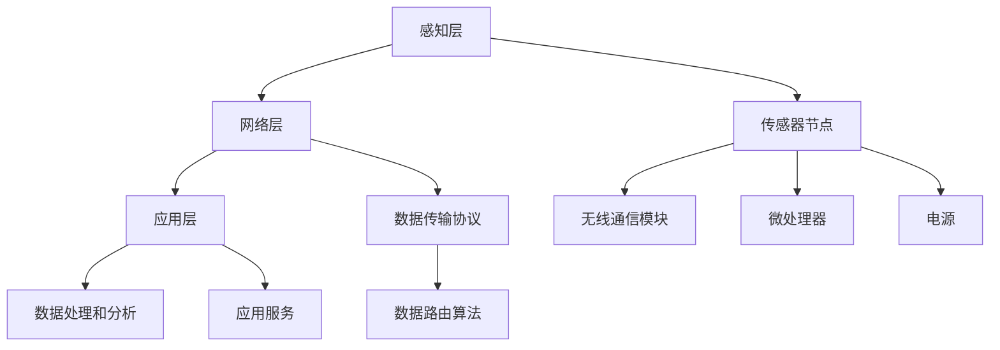

                 

# 物联网(IoT)技术和各种传感器设备的集成：传感器网络的设计与优化

> **关键词**：物联网(IoT)、传感器设备、传感器网络、设计优化、数据传输、功耗管理、网络拓扑、协议栈

> **摘要**：本文将深入探讨物联网（IoT）技术和各种传感器设备的集成，重点关注传感器网络的设计与优化。通过分析物联网的背景、核心概念、算法原理，以及实际应用场景，本文旨在为读者提供一个全面的视角，以帮助他们在开发物联网应用时做出更明智的决策。

## 1. 背景介绍

随着互联网和通信技术的飞速发展，物联网（IoT）已经成为现代信息技术的一个重要领域。物联网是指通过各种信息传感设备（如传感器、射频识别（RFID）等）实时采集任何需要监控、连接、互动的物体或过程，将其与互联网相连接，以实现智能化识别、定位、跟踪、监控和管理的一种网络技术。物联网技术的应用范围非常广泛，包括智能家居、智慧城市、智能医疗、工业自动化等领域。

在物联网中，传感器设备是关键组成部分。传感器是一种能够检测并响应到某种类型输入（如温度、湿度、光强度等）的设备，将物理量转换为电信号，从而被计算机系统所处理。随着传感器技术的不断发展，各种新型传感器不断涌现，如光电传感器、超声波传感器、温度传感器等，为物联网提供了丰富的数据源。

传感器网络是由一组传感器节点组成的网络，这些节点可以感知环境信息，并通过无线通信协议将数据传输到中央处理单元。传感器网络的设计与优化是物联网应用中至关重要的一环，涉及到网络拓扑、数据传输、功耗管理等多个方面。

## 2. 核心概念与联系

### 2.1 物联网架构

物联网系统通常包括感知层、网络层和应用层三个层次。感知层由各种传感器和采集设备组成，负责数据采集。网络层则负责数据传输和通信，将感知层采集到的数据传输到中央处理单元。应用层则实现对数据的处理和分析，提供相应的应用服务。

### 2.2 传感器节点

传感器节点是传感器网络的基本组成单元，通常由传感器、微处理器、无线通信模块和电源组成。传感器节点负责采集环境数据，并将数据发送到网络中的其他节点或中央处理单元。传感器节点通常具有有限的计算能力和电池供电，因此功耗管理是设计中的关键问题。

### 2.3 网络拓扑

传感器网络的拓扑结构对网络性能有重要影响。常见的网络拓扑结构包括星形拓扑、链形拓扑、总线拓扑和网状拓扑等。网状拓扑具有高可靠性、可扩展性和自修复性等优点，但节点间的通信复杂度较高。

### 2.4 数据传输

数据传输是传感器网络中的另一个关键问题。传感器网络通常采用无线通信方式进行数据传输，包括无线传感器网络（WSN）和传感器网络（SN）。无线通信的可靠性和功耗是设计中的主要挑战。

### 2.5 协议栈

传感器网络中的协议栈通常包括物理层、数据链路层、网络层和传输层等。物理层负责无线信号的传输，数据链路层负责数据帧的封装和解封装，网络层负责数据路由和传输，传输层则负责端到端的数据传输。

### 2.6 Mermaid 流程图

下面是一个简单的 Mermaid 流程图，展示了物联网系统中的关键组件和它们之间的联系。



## 3. 核心算法原理 & 具体操作步骤

### 3.1 数据采集与处理

传感器节点首先采集环境数据，例如温度、湿度、光照强度等。采集到的数据通常需要进行预处理，包括去噪、滤波和归一化等操作，以提高数据的质量和可靠性。

具体操作步骤如下：

1. 采集数据：传感器节点通过传感器模块采集环境数据。
2. 预处理：对采集到的数据去噪、滤波和归一化，以提高数据质量。

### 3.2 数据传输

预处理后的数据需要通过无线通信模块传输到网络中的其他节点或中央处理单元。数据传输过程中，需要考虑无线通信的可靠性和功耗。

具体操作步骤如下：

1. 数据封装：将预处理后的数据封装成数据帧。
2. 无线传输：通过无线通信模块将数据帧发送到其他节点或中央处理单元。
3. 数据接收：接收端接收到数据帧后，进行数据解封装和解压缩。

### 3.3 数据路由

数据路由是传感器网络中的关键问题，涉及到数据在网络中的传输路径选择。常用的数据路由算法包括距离矢量路由算法、最短路径优先算法（Dijkstra 算法）和基于质心的路由算法等。

具体操作步骤如下：

1. 距离计算：计算源节点到目标节点的距离或跳数。
2. 路径选择：选择距离或跳数最小的路径进行数据传输。
3. 路径维护：定期更新网络拓扑和路由信息。

### 3.4 数据处理和分析

接收到的数据需要在应用层进行处理和分析，以提供相应的应用服务。数据处理和分析通常包括数据聚合、特征提取和模式识别等操作。

具体操作步骤如下：

1. 数据聚合：将来自不同节点的数据进行聚合，以减少数据传输量和存储需求。
2. 特征提取：从原始数据中提取有用的特征信息，以便进行后续分析。
3. 模式识别：使用机器学习算法对特征信息进行分类和预测。

## 4. 数学模型和公式 & 详细讲解 & 举例说明

### 4.1 数据传输速率

数据传输速率是传感器网络中的一个重要参数，通常用比特每秒（bps）表示。数据传输速率可以通过以下公式计算：

$$
R = \frac{L}{T}
$$

其中，$R$ 是数据传输速率，$L$ 是数据帧长度，$T$ 是数据帧传输时间。

### 4.2 跳数

跳数是传感器网络中数据传输路径的一个度量，表示数据从源节点到目标节点需要经过的中间节点数。跳数可以通过以下公式计算：

$$
H = \sum_{i=1}^{N} d_i
$$

其中，$H$ 是跳数，$d_i$ 是从源节点到第 $i$ 个中间节点的距离。

### 4.3 能耗

能耗是传感器网络设计中的一个关键问题，通常包括数据传输能耗、数据处理能耗和传感器能耗等。能耗可以通过以下公式计算：

$$
E = E_t + E_p + E_s
$$

其中，$E$ 是总能耗，$E_t$ 是数据传输能耗，$E_p$ 是数据处理能耗，$E_s$ 是传感器能耗。

### 4.4 举例说明

假设一个传感器网络中，数据帧长度为 1000 比特，传输速率为 1 kbps，数据传输距离为 100 米。根据上述公式，可以计算出数据传输时间为 1 秒，跳数为 1。如果数据传输距离为 500 米，数据传输时间将变为 5 秒，跳数为 2。根据能耗公式，可以计算出总能耗为 1.5 焦耳。

## 5. 项目实战：代码实际案例和详细解释说明

### 5.1 开发环境搭建

在开始编写传感器网络代码之前，需要搭建一个合适的开发环境。以下是搭建开发环境的步骤：

1. 安装 Python 3.8 或更高版本。
2. 安装 Node.js 12 或更高版本。
3. 安装 MQTT 客户端库（例如：`mosquitto`）。
4. 安装网络调试工具（例如：`Wireshark`）。

### 5.2 源代码详细实现和代码解读

以下是一个简单的传感器网络示例，使用 Python 和 MQTT 协议实现。代码主要包括以下部分：

1. 传感器节点代码：负责数据采集和发送。
2. 代理服务器代码：负责接收传感器节点的数据，并处理数据。
3. 客户端代码：用于可视化传感器节点的数据。

#### 传感器节点代码

```python
import paho.mqtt.client as mqtt
import time
import random

# MQTT 代理服务器地址和端口
MQTT_SERVER = "localhost"
MQTT_PORT = 1883

# MQTT 主题
MQTT_TOPIC = "sensor/data"

# 创建 MQTT 客户端
client = mqtt.Client()

# 连接 MQTT 代理服务器
client.connect(MQTT_SERVER, MQTT_PORT, 60)

# 数据采集和发送
while True:
    # 采集数据（温度、湿度等）
    temperature = random.uniform(20, 30)
    humidity = random.uniform(30, 70)

    # 构建数据消息
    message = f"{' '.join(map(str, [temperature, humidity]))}"

    # 发布消息
    client.publish(MQTT_TOPIC, message)

    # 等待 1 秒
    time.sleep(1)
```

#### 代理服务器代码

```python
import paho.mqtt.client as mqtt
import time
import json

# MQTT 代理服务器地址和端口
MQTT_SERVER = "localhost"
MQTT_PORT = 1883

# MQTT 主题
MQTT_TOPIC = "sensor/data"

# 创建 MQTT 客户端
client = mqtt.Client()

# 连接 MQTT 代理服务器
client.connect(MQTT_SERVER, MQTT_PORT, 60)

# 订阅主题
client.subscribe(MQTT_TOPIC)

# 接收消息并处理
def on_message(client, userdata, message):
    # 解析消息
    payload = message.payload.decode()
    data = json.loads(payload)

    # 打印消息
    print(f"Received message: {data}")

    # 处理数据（例如：存储、分析等）
    # ...

# 绑定消息处理函数
client.on_message = on_message

# 启动 MQTT 客户端
client.loop_forever()
```

#### 客户端代码

```python
import paho.mqtt.client as mqtt
import time
import json

# MQTT 代理服务器地址和端口
MQTT_SERVER = "localhost"
MQTT_PORT = 1883

# MQTT 主题
MQTT_TOPIC = "sensor/data"

# 创建 MQTT 客户端
client = mqtt.Client()

# 连接 MQTT 代理服务器
client.connect(MQTT_SERVER, MQTT_PORT, 60)

# 订阅主题
client.subscribe(MQTT_TOPIC)

# 接收消息并处理
def on_message(client, userdata, message):
    # 解析消息
    payload = message.payload.decode()
    data = json.loads(payload)

    # 打印消息
    print(f"Received message: {data}")

    # 处理数据（例如：可视化、分析等）
    # ...

# 绑定消息处理函数
client.on_message = on_message

# 启动 MQTT 客户端
client.loop_forever()
```

### 5.3 代码解读与分析

以上代码展示了如何使用 Python 和 MQTT 协议实现一个简单的传感器网络。传感器节点负责采集环境数据（例如温度、湿度等），并将数据发送到 MQTT 代理服务器。代理服务器接收到数据后，进行存储、分析和处理。客户端订阅代理服务器上的主题，接收并处理传感器节点的数据。

代码解读如下：

1. **传感器节点代码**：传感器节点使用 `paho.mqtt.client` 库创建 MQTT 客户端，连接到 MQTT 代理服务器。在主循环中，传感器节点随机生成温度和湿度数据，将数据转换为 JSON 格式，并通过 MQTT 协议发送到代理服务器。

2. **代理服务器代码**：代理服务器使用 `paho.mqtt.client` 库创建 MQTT 客户端，连接到 MQTT 代理服务器。代理服务器订阅主题 `sensor/data`，当接收到消息时，调用 `on_message` 函数处理消息。在该示例中，处理消息的功能是打印消息。

3. **客户端代码**：客户端使用 `paho.mqtt.client` 库创建 MQTT 客户端，连接到 MQTT 代理服务器。客户端订阅主题 `sensor/data`，当接收到消息时，调用 `on_message` 函数处理消息。在该示例中，处理消息的功能是打印消息。

通过以上代码示例，可以了解如何实现一个简单的传感器网络，以及如何使用 MQTT 协议进行数据传输和处理。在实际应用中，可以根据需求扩展代码功能，例如添加数据存储、分析、可视化等功能。

## 6. 实际应用场景

传感器网络在物联网应用中有着广泛的应用场景。以下是一些常见的应用场景：

1. **智能家居**：传感器网络可以用于监控家庭环境，如温度、湿度、光照强度等。通过智能控制器，用户可以远程调节家庭设备，实现智能家居。

2. **智慧城市**：传感器网络可以用于监控城市基础设施，如交通流量、空气质量、垃圾回收等。通过数据分析，可以优化城市资源配置，提高城市运行效率。

3. **智能医疗**：传感器网络可以用于监测患者健康状况，如心率、血压、血糖等。通过实时数据传输，医生可以远程监测患者病情，及时进行干预。

4. **工业自动化**：传感器网络可以用于监控工业生产过程中的各种参数，如温度、压力、流量等。通过实时数据分析和优化，可以提高生产效率和质量。

5. **环境监测**：传感器网络可以用于监测环境污染，如空气质量、水质等。通过实时数据监测，可以及时发现环境问题，采取措施进行治理。

## 7. 工具和资源推荐

### 7.1 学习资源推荐

1. **书籍**：
   - 《物联网：概念、技术和应用》
   - 《传感器网络：原理、算法与应用》
2. **论文**：
   - “Sensor Networks: Applications, Infrastructure and Systems”
   - “A Survey on Wireless Sensor Networks: Applications and Techniques”
3. **博客和网站**：
   - “物联网那些事儿”（https://www.iotblog.cn/）
   - “传感器网络技术与应用”（https://www.sensornetworks.com/）

### 7.2 开发工具框架推荐

1. **编程语言**：
   - Python（适用于快速开发和数据处理）
   - Java（适用于大规模系统和性能优化）
2. **MQTT 客户端库**：
   - Paho MQTT 客户端（适用于 Python、Java 和其他编程语言）
   - Eclipse Paho MQTT 客户端（适用于各种编程语言）
3. **开发框架**：
   - TensorFlow（适用于机器学习和数据分析）
   - Flask（适用于 Web 开发）

### 7.3 相关论文著作推荐

1. “A Survey on Wireless Sensor Networks: Applications and Techniques”
2. “Sensor Networks: Applications, Infrastructure and Systems”
3. “A Survey on IoT: Architecture, Enabling Technologies, Security and Privacy”

## 8. 总结：未来发展趋势与挑战

物联网（IoT）技术和传感器网络的集成在近年来取得了显著的进展，为各个领域带来了巨大的变革。然而，随着物联网应用的不断扩大，仍面临着一些挑战和机遇。

### 8.1 未来发展趋势

1. **智能化与自动化**：随着人工智能技术的不断发展，传感器网络将逐渐实现智能化和自动化，提高数据采集、处理和分析的效率。
2. **边缘计算**：边缘计算将数据处理和分析任务从云端转移到网络边缘，降低数据传输延迟和功耗，提高实时性和响应速度。
3. **5G 与物联网**：5G 技术的商用化将推动物联网应用的普及，实现更快、更稳定的数据传输，促进物联网与各行各业的深度融合。
4. **隐私保护**：随着物联网设备数量的增加，用户隐私保护将变得越来越重要。未来的传感器网络将需要更加完善的隐私保护机制。

### 8.2 挑战

1. **数据安全和隐私**：物联网设备和传感器网络容易受到黑客攻击，数据安全和隐私保护是一个亟待解决的问题。
2. **功耗管理**：传感器节点通常采用电池供电，功耗管理是设计中的关键挑战，需要开发低功耗、高效的传感器网络技术。
3. **可靠性**：传感器网络需要在各种复杂环境下稳定运行，提高网络可靠性和容错性是未来研究的一个重要方向。
4. **标准化**：物联网技术的标准化工作尚不完善，不同厂商和平台之间的互操作性问题需要得到解决。

## 9. 附录：常见问题与解答

### 9.1 物联网和传感器网络的关系

物联网和传感器网络是密切相关的两个概念。传感器网络是物联网的感知层，负责数据的采集和传输。物联网则包括感知层、网络层和应用层，通过对传感器网络采集到的数据进行处理和分析，提供各种应用服务。

### 9.2 传感器网络的拓扑结构有哪些？

传感器网络的拓扑结构包括星形拓扑、链形拓扑、总线拓扑和网状拓扑等。网状拓扑具有高可靠性、可扩展性和自修复性等优点，但节点间的通信复杂度较高。

### 9.3 MQTT 协议是什么？

MQTT（Message Queuing Telemetry Transport）是一种轻量级的消息传输协议，广泛应用于物联网设备和传感器网络中。它具有低功耗、可扩展性强、可靠性高等优点，适合在资源受限的环境中传输数据。

## 10. 扩展阅读 & 参考资料

1. “物联网那些事儿”（https://www.iotblog.cn/）
2. “传感器网络技术与应用”（https://www.sensornetworks.com/）
3. “A Survey on Wireless Sensor Networks: Applications and Techniques”
4. “Sensor Networks: Applications, Infrastructure and Systems”
5. “MQTT 客户端库 Paho”（https://www.eclipse.org/paho/）
6. “TensorFlow 官方文档”（https://www.tensorflow.org/）
7. “Flask 官方文档”（https://flask.palletsprojects.com/）

### 作者

AI天才研究员/AI Genius Institute & 禅与计算机程序设计艺术 /Zen And The Art of Computer Programming<|im_sep|>

