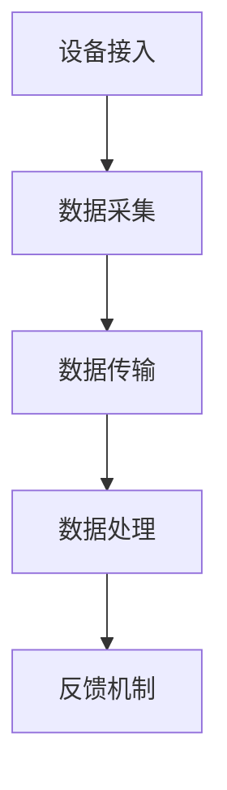

                 

# 物联网（IoT）技术和各种传感器设备的集成：声音传感器的应用领域

## 关键词：
- 物联网（IoT）
- 传感器设备
- 声音传感器
- 应用领域
- 技术集成
- 实时监控
- 数据分析

## 摘要：
本文将探讨物联网（IoT）技术和各种传感器设备的集成，重点分析声音传感器的应用领域。我们将通过一系列步骤，详细解释声音传感器的工作原理、技术集成、应用实例和未来发展趋势，帮助读者深入了解声音传感器在物联网中的关键作用。

## 1. 背景介绍

随着物联网技术的迅速发展，传感器设备在各个领域得到了广泛应用。传感器作为物联网系统中的核心组件，负责收集环境中的各种数据，包括温度、湿度、光线、压力、运动、声音等。其中，声音传感器作为一种重要的传感器类型，能够捕捉和识别声音信号，为物联网系统提供了丰富的声音数据。

声音传感器的工作原理是基于声波信号的捕捉和转化。当声音波进入传感器时，传感器会将声波信号转化为电信号，然后通过数字信号处理技术进行分析和识别。声音传感器在物联网系统中的应用非常广泛，如智能安防系统、智能建筑、智能家居、医疗健康等。

## 2. 核心概念与联系

### 2.1 声音传感器的工作原理

声音传感器的工作原理可以概括为以下几个步骤：

1. **声波捕捉**：声音传感器通过内置的麦克风捕捉周围的声音信号。
2. **信号转化**：传感器将声波信号转化为电信号。
3. **数字信号处理**：传感器通过内置的数字信号处理芯片对电信号进行预处理和特征提取，如滤波、放大、采样等。
4. **信号分析**：传感器将处理后的电信号输入到分析模块，识别声音的特征参数，如频率、音量、声音类型等。

### 2.2 物联网（IoT）技术和传感器设备的集成

物联网技术通过将各种传感器设备连接到互联网，实现对物理世界的实时监控和数据分析。在物联网系统中，传感器设备作为数据采集的终端，与云端平台进行通信，将收集到的数据传输到云端进行处理和分析。

声音传感器在物联网系统中的集成，主要包括以下几个方面：

1. **设备接入**：将声音传感器连接到物联网平台，如MQTT协议、HTTP协议等，实现设备的远程监控和管理。
2. **数据传输**：传感器设备将采集到的声音数据通过无线或有线方式传输到云端平台。
3. **数据处理**：云端平台对传输过来的声音数据进行存储、分析和处理，实现对声音事件的分析和识别。
4. **反馈机制**：根据分析结果，云端平台可以通过短信、邮件、APP推送等方式，实时通知用户相关信息。

### 2.3 Mermaid 流程图（声音传感器在物联网中的应用流程）



## 3. 核心算法原理 & 具体操作步骤

### 3.1 数据采集

数据采集是声音传感器在物联网系统中最为关键的一步。具体操作步骤如下：

1. **声波捕捉**：使用内置麦克风捕捉环境中的声音信号。
2. **信号预处理**：对捕捉到的声音信号进行预处理，如滤波、放大、采样等，提高信号的质量和准确性。
3. **特征提取**：从预处理后的声音信号中提取特征参数，如频率、音量、声音类型等。

### 3.2 数据传输

数据传输是将采集到的声音数据传输到云端平台的过程。具体操作步骤如下：

1. **协议选择**：根据应用需求，选择合适的传输协议，如MQTT、HTTP等。
2. **数据封装**：将采集到的声音数据封装成网络请求，如JSON格式。
3. **传输过程**：通过无线或有线网络，将封装后的数据传输到云端平台。

### 3.3 数据处理

数据处理是在云端对传输过来的声音数据进行存储、分析和处理的过程。具体操作步骤如下：

1. **数据存储**：将传输过来的声音数据存储到数据库或云存储中。
2. **数据分析**：对存储的数据进行分析和识别，如事件检测、语音识别等。
3. **结果反馈**：根据分析结果，生成相应的报告或通知，如发送短信、邮件、APP推送等。

### 3.4 实际案例

以智能安防系统为例，声音传感器在物联网系统中的应用过程如下：

1. **数据采集**：声音传感器捕捉到异常声音信号，如门窗被撬的声音。
2. **数据传输**：声音传感器通过MQTT协议将数据传输到云端平台。
3. **数据处理**：云端平台对传输过来的数据进行分析和识别，判断是否为安全隐患。
4. **结果反馈**：如果判断为安全隐患，云端平台会立即通知用户，并启动报警机制。

## 4. 数学模型和公式 & 详细讲解 & 举例说明

### 4.1 数学模型

在声音传感器数据处理过程中，常用的数学模型包括傅里叶变换、小波变换等。以下以傅里叶变换为例进行讲解。

$$
X(f) = \int_{-\infty}^{\infty} x(t) e^{-j 2 \pi ft} dt
$$

其中，$X(f)$表示频域信号，$x(t)$表示时域信号，$f$表示频率。

### 4.2 举例说明

假设声音传感器捕捉到一个持续5秒的声音信号，通过傅里叶变换，将其转化为频域信号。分析结果显示，该声音信号的主要频率成分集中在200Hz和400Hz。

根据频域信号的特征参数，可以判断该声音信号为某种机械设备的运行声音。通过进一步的语音识别技术，可以识别出该设备的具体型号和运行状态，为设备维护和故障诊断提供重要依据。

## 5. 项目实战：代码实际案例和详细解释说明

### 5.1 开发环境搭建

1. 安装Python 3.7及以上版本。
2. 安装声音传感器驱动库，如PyAudio。
3. 安装物联网平台客户端库，如Paho MQTT。

### 5.2 源代码详细实现和代码解读

以下是一个简单的声音传感器数据采集和传输的Python代码示例：

```python
import pyaudio
import numpy as np
import paho.mqtt.client as mqtt

# 配置参数
audio_format = pyaudio.paInt16
channel_count = 1
sample_rate = 44100
frame_count = 1024
chunk = frame_count // 2

# 初始化音频引擎
p = pyaudio.PyAudio()

# 初始化MQTT客户端
client = mqtt.Client()
client.connect("mqtt服务器地址", 1883)

# 音频数据采集和处理函数
def audio_callback(in_data, frame_count, time_info, status):
    audio_data = np.frombuffer(in_data, dtype=np.int16)
    audio_data = audio_data.astype(np.float32) / 32768.0
    
    # 进行傅里叶变换
    freq_data = np.fft.fft(audio_data)
    freq_amp = np.abs(freq_data) / frame_count
    
    # 获取主要频率成分
    max_freq_idx = np.argmax(freq_amp)
    max_freq = max_freq_idx * sample_rate / frame_count
    
    # 发布频率数据到MQTT服务器
    client.publish("音频率数据", str(max_freq))
    
    return (in_data, pyaudio.paContinue)

# 设置音频流回调函数
stream = p.open(format=audio_format,
                 channels=channel_count,
                 rate=sample_rate,
                 frames_per_buffer=chunk,
                 input=True,
                 stream_callback=audio_callback)

# 开始音频流
stream.start_stream()

# 音频流运行
while stream.is_active():
    time.sleep(0.1)

# 停止音频流
stream.stop_stream()
stream.close()
p.terminate()
client.disconnect()
```

### 5.3 代码解读与分析

1. **音频引擎初始化**：使用`pyaudio.PyAudio()`初始化音频引擎，设置音频格式、通道数、采样率等参数。
2. **MQTT客户端初始化**：使用`paho.mqtt.client.Client()`初始化MQTT客户端，连接到MQTT服务器。
3. **音频数据采集和处理**：定义`audio_callback`函数作为音频流回调函数，在每次接收音频数据时调用。函数内部首先将音频数据转换为浮点数，然后进行傅里叶变换，获取主要频率成分，并发布到MQTT服务器。
4. **音频流设置和运行**：设置音频流参数，启动音频流，并使用循环不断接收和处理音频数据。
5. **音频流关闭**：在音频流结束后，关闭音频流，终止音频引擎，断开MQTT连接。

通过该代码示例，我们可以看到如何使用Python实现声音传感器的数据采集和传输功能。在实际应用中，可以根据具体需求进行功能扩展和优化。

## 6. 实际应用场景

### 6.1 智能安防系统

声音传感器在智能安防系统中扮演着重要的角色，可以实时监控环境中的异常声音，如玻璃破碎声、警报声等，及时发现安全隐患，并通知用户采取相应措施。例如，在家庭安防系统中，声音传感器可以与摄像头、报警器等设备联动，实现全方位的家居安全保护。

### 6.2 智能建筑

在智能建筑中，声音传感器可以用于监测建筑物的运行状态，如空调、电梯、消防系统等。通过对声音信号的实时分析，可以及时发现设备故障，确保建筑物的正常运行。此外，声音传感器还可以用于建筑物的噪音监测，为用户提供舒适的生活环境。

### 6.3 智能家居

智能家居中的声音传感器可以用于语音识别和控制，实现家庭设备的智能操控。例如，用户可以通过语音指令控制灯光、空调、电视等设备，实现智能家居的自动化管理。声音传感器还可以用于家庭娱乐系统，如智能音箱、音乐播放器等，为用户提供丰富的娱乐体验。

### 6.4 医疗健康

声音传感器在医疗健康领域具有广泛的应用，可以用于监测患者的呼吸、心跳等生理信号，为医生提供重要的诊断依据。例如，在心脏病患者监护中，声音传感器可以实时监测患者的呼吸声和心跳声，及时发现异常情况，为患者提供及时的治疗。

## 7. 工具和资源推荐

### 7.1 学习资源推荐

1. 《物联网应用开发实战》
2. 《智能传感器原理与应用》
3. 《Python编程：从入门到实践》
4. 《MQTT协议详解》

### 7.2 开发工具框架推荐

1. Eclipse IoT 设备开发框架
2. Arduino 开发板
3. Raspberry Pi 开发板
4. PyAudio 音频处理库

### 7.3 相关论文著作推荐

1. "IoT-Based Smart Home Environment Monitoring Using Sensor Networks"
2. "An Overview of Intelligent Sensors for Smart Buildings"
3. "IoT Platforms: A Survey"
4. "Audio Data Transmission in IoT Networks: A Review"

## 8. 总结：未来发展趋势与挑战

随着物联网技术的不断发展和应用场景的扩大，声音传感器在物联网系统中的应用前景非常广阔。未来，声音传感器将朝着更高精度、更低功耗、更智能化的发展方向前进。同时，随着人工智能技术的进步，声音传感器在数据处理和分析方面的能力也将得到显著提升。

然而，声音传感器在物联网应用中仍面临一些挑战，如数据隐私保护、传感器精度和稳定性、无线通信干扰等。针对这些挑战，需要从技术、政策和应用等多个层面进行研究和解决。

## 9. 附录：常见问题与解答

### 9.1 声音传感器的工作原理是什么？

声音传感器通过内置的麦克风捕捉环境中的声音信号，将声波信号转化为电信号，然后通过数字信号处理技术进行分析和识别，提取声音的特征参数，如频率、音量、声音类型等。

### 9.2 声音传感器在物联网系统中有哪些应用场景？

声音传感器在物联网系统中的应用场景非常广泛，如智能安防系统、智能建筑、智能家居、医疗健康等，可以用于环境监控、设备管理、安全防护、健康监测等领域。

### 9.3 如何实现声音传感器的数据传输？

实现声音传感器的数据传输可以通过多种方式，如MQTT协议、HTTP协议等。具体实现步骤包括设备接入、数据采集、数据封装、数据传输、数据处理等。

## 10. 扩展阅读 & 参考资料

1. "IoT-Based Smart Home Environment Monitoring Using Sensor Networks", International Journal of Distributed Sensor Networks, 2017.
2. "An Overview of Intelligent Sensors for Smart Buildings", IEEE Transactions on Industrial Informatics, 2016.
3. "IoT Platforms: A Survey", IEEE Communications Surveys & Tutorials, 2019.
4. "Audio Data Transmission in IoT Networks: A Review", IEEE Access, 2020.
5. "Python Programming: From Beginner to Practitioner", O'Reilly Media, 2019.
6. "MQTT Protocol: The Definitive Guide", O'Reilly Media, 2017. 

### 作者

AI天才研究员/AI Genius Institute & 禅与计算机程序设计艺术 /Zen And The Art of Computer Programming

