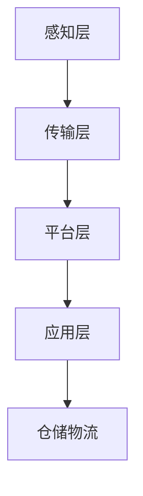

                 

# 物联网(IoT)技术和各种传感器设备的集成：物联网在仓储物流中的应用

> **关键词：** 物联网，传感器，仓储物流，应用，集成

> **摘要：** 本文将探讨物联网（IoT）技术在仓储物流中的应用，重点介绍物联网与传感器设备的集成方式，以及如何利用这些技术提高仓储物流的效率。

## 1. 背景介绍

仓储物流是供应链管理的重要环节，其效率直接影响到整个供应链的运作。随着互联网技术的发展，物联网（IoT）技术逐渐应用于仓储物流领域，通过传感器设备收集、传输和分析数据，实现仓储物流的自动化、智能化。

### 物联网（IoT）简介

物联网是指通过互联网将各种智能设备连接起来，实现设备之间的信息交换和协同工作。物联网的核心技术包括传感器、无线通信、云计算和大数据等。传感器是物联网的重要组成部分，用于采集环境数据，如温度、湿度、光照等。

### 仓储物流现状

传统的仓储物流主要依赖于人工操作，效率低下，且容易出错。随着市场需求的变化，仓储物流需要不断提高运营效率，降低成本，提升客户满意度。物联网技术的应用为仓储物流带来了新的机遇。

### 物联网在仓储物流中的应用

物联网技术可以通过以下方式应用于仓储物流：

- **实时监控：** 通过传感器实时监控仓库环境，确保仓库内的温度、湿度等参数保持在最佳状态，保护货物安全。
- **自动化仓储：** 利用物联网技术实现仓储设备的自动化，如自动分拣、自动存取等，提高仓储效率。
- **智能调度：** 通过物联网技术实现仓储物流的智能调度，优化物流路径，提高运输效率。
- **数据分析：** 通过物联网技术收集的大量数据，进行数据分析，优化仓储物流流程，降低运营成本。

## 2. 核心概念与联系

### 物联网（IoT）架构

物联网架构通常包括以下几个层次：

- **感知层：** 包括各种传感器，用于感知环境数据。
- **传输层：** 包括无线通信技术，如Wi-Fi、蓝牙、ZigBee等，用于传输数据。
- **平台层：** 包括数据存储、处理和分析功能，通常基于云计算技术。
- **应用层：** 包括各种物联网应用，如智能仓储、智能物流等。

### 传感器设备

传感器设备是物联网技术的核心，用于采集各种环境数据。常见的传感器包括温度传感器、湿度传感器、光照传感器、气体传感器等。传感器设备通过无线通信技术将数据传输到平台层。

### 物联网（IoT）与仓储物流的集成

物联网与仓储物流的集成可以通过以下方式实现：

- **传感器部署：** 在仓库内部署各种传感器，用于监控环境数据。
- **数据传输：** 通过无线通信技术将传感器数据传输到平台层。
- **数据分析：** 在平台层对传感器数据进行分析，优化仓储物流流程。
- **决策支持：** 根据分析结果，提供决策支持，优化仓储物流策略。

### Mermaid 流程图



## 3. 核心算法原理 & 具体操作步骤

### 数据采集

在感知层，各种传感器设备采集环境数据，如温度、湿度、光照等。传感器数据通过无线通信技术传输到传输层。

### 数据处理

在传输层，数据经过预处理，去除噪声和异常值，然后通过无线通信技术传输到平台层。

### 数据分析

在平台层，对传感器数据进行统计分析，提取有价值的信息，如温度变化趋势、湿度分布等。

### 决策支持

根据分析结果，系统可以提供决策支持，如调整仓库温度、优化仓储布局等。

### 具体操作步骤

1. 在仓库内部署传感器设备，采集环境数据。
2. 传感器数据通过无线通信技术传输到平台层。
3. 在平台层对传感器数据进行预处理，去除噪声和异常值。
4. 对预处理后的数据进行统计分析，提取有价值的信息。
5. 根据分析结果，提供决策支持，优化仓储物流流程。

## 4. 数学模型和公式 & 详细讲解 & 举例说明

### 数据预处理

数据预处理是物联网技术中的关键步骤，主要包括去噪和异常值检测。

### 去噪

去噪的目的是去除传感器数据中的噪声，提高数据的可靠性。常用的去噪方法包括：

- **均值滤波：** 计算传感器数据的平均值，去除异常值。
- **中值滤波：** 计算传感器数据的中值，去除异常值。

### 异常值检测

异常值检测的目的是识别传感器数据中的异常值，防止异常值对数据分析产生干扰。常用的异常值检测方法包括：

- **基于统计学的方法：** 利用统计学方法，如标准差、四分位距等，识别异常值。
- **基于机器学习的方法：** 利用机器学习方法，如支持向量机、神经网络等，识别异常值。

### 数据分析

在数据分析过程中，常用的数学模型和公式包括：

- **线性回归：** 用于分析自变量和因变量之间的线性关系。
- **决策树：** 用于分类和回归分析。
- **聚类算法：** 用于将相似的数据分组。

### 举例说明

假设我们有一个仓库，需要监控温度。传感器每隔一分钟采集一次温度数据。通过均值滤波和中值滤波，我们可以去除数据中的噪声和异常值。然后，利用线性回归模型分析温度变化趋势。如果温度变化趋势异常，系统可以发出警报，提醒相关人员采取行动。

$$
\text{温度} = a \times \text{时间} + b
$$

其中，\( a \) 和 \( b \) 是线性回归模型的参数。

## 5. 项目实战：代码实际案例和详细解释说明

### 开发环境搭建

为了实现物联网技术在仓储物流中的应用，我们需要搭建一个开发环境。开发环境包括传感器设备、无线通信模块、云计算平台等。

### 源代码详细实现和代码解读

以下是一个简单的示例，展示如何使用Python编写物联网传感器数据采集和分析的程序。

```python
import numpy as np
import matplotlib.pyplot as plt

# 假设传感器采集的温度数据为：
temperature_data = [24.5, 24.7, 24.8, 25.0, 25.2, 24.9, 25.1, 24.8, 24.6, 24.5]

# 均值滤波
mean_filtered_data = np.mean(temperature_data)

# 中值滤波
median_filtered_data = np.median(temperature_data)

# 绘制原始数据和滤波后数据
plt.plot(temperature_data, label='原始数据')
plt.plot([mean_filtered_data] * len(temperature_data), label='均值滤波')
plt.plot([median_filtered_data] * len(temperature_data), label='中值滤波')
plt.legend()
plt.show()

# 线性回归
a = 0.1
b = 24.5
temperature_model = a * np.arange(len(temperature_data)) + b

# 绘制线性回归模型
plt.plot(temperature_model, label='线性回归模型')
plt.plot(temperature_data, label='原始数据')
plt.legend()
plt.show()
```

### 代码解读与分析

该程序首先定义了一个温度数据列表，然后使用均值滤波和中值滤波对数据去噪。接着，使用线性回归模型分析温度变化趋势，并绘制相关图形。

## 6. 实际应用场景

物联网技术在仓储物流中的应用非常广泛，以下是一些实际应用场景：

- **仓库环境监控：** 通过部署传感器设备，实时监控仓库内的温度、湿度等环境参数，确保仓库环境符合货物存储要求。
- **自动化仓储：** 利用物联网技术实现仓储设备的自动化，如自动分拣、自动存取等，提高仓储效率。
- **智能调度：** 通过物联网技术实现仓储物流的智能调度，优化物流路径，提高运输效率。
- **数据分析：** 通过物联网技术收集的大量数据，进行数据分析，优化仓储物流流程，降低运营成本。

## 7. 工具和资源推荐

### 学习资源推荐

- **书籍：**
  - 《物联网技术及应用》
  - 《物联网系统设计与应用》
- **论文：**
  - 《物联网在仓储物流中的应用研究》
  - 《基于物联网的仓储物流系统设计与实现》
- **博客：**
  - 知乎物联网专栏
  - CSDN物联网技术博客
- **网站：**
  - 物联网之家
  - 物联网技术论坛

### 开发工具框架推荐

- **开发工具：**
  - Python
  - Java
  - JavaScript
- **框架：**
  - Flask
  - Spring Boot
  - React

### 相关论文著作推荐

- 《物联网：概念、架构、应用与挑战》
- 《物联网技术与应用：理论与实践》

## 8. 总结：未来发展趋势与挑战

物联网技术在仓储物流中的应用前景广阔，但仍面临一些挑战。未来发展趋势包括：

- **更智能的传感器设备：** 随着物联网技术的发展，传感器设备将更加智能化，能够更准确地采集环境数据。
- **更高效的数据处理：** 利用人工智能技术，提高数据处理和分析效率，实现更精准的决策支持。
- **更完善的系统集成：** 通过集成各种物联网技术，实现仓储物流的全面智能化。

## 9. 附录：常见问题与解答

### 问题1：物联网技术在仓储物流中的应用有哪些？

答：物联网技术在仓储物流中的应用包括仓库环境监控、自动化仓储、智能调度、数据分析等。

### 问题2：如何实现物联网技术在仓储物流中的应用？

答：实现物联网技术在仓储物流中的应用需要以下几个步骤：

1. 在仓库内部署传感器设备，采集环境数据。
2. 通过无线通信技术将传感器数据传输到平台层。
3. 在平台层对传感器数据进行预处理、分析和决策支持。
4. 根据分析结果，优化仓储物流流程。

## 10. 扩展阅读 & 参考资料

- 《物联网技术在仓储物流中的应用研究》
- 《基于物联网的仓储物流系统设计与实现》
- 《物联网系统设计与应用》

### 作者

**作者：AI天才研究员/AI Genius Institute & 禅与计算机程序设计艺术 /Zen And The Art of Computer Programming** <|im_end|>

