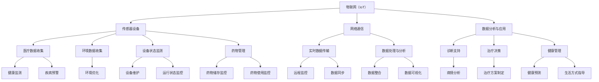
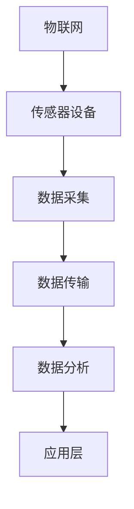
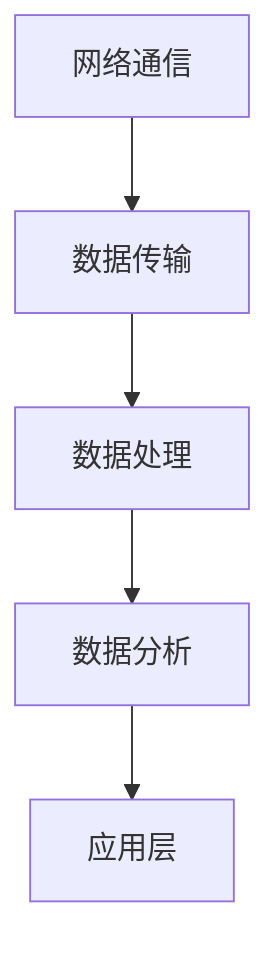
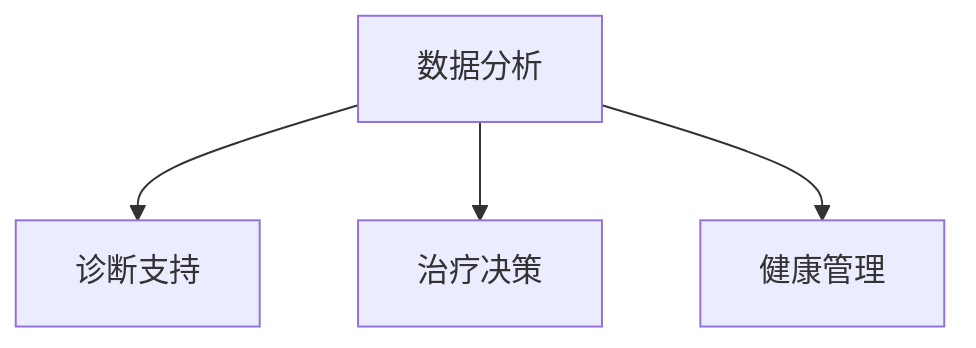

                 

### 文章标题：物联网(IoT)技术和各种传感器设备的集成：物联网在智慧医疗的应用

> 关键词：(1) 物联网 (IoT)、(2) 传感器、(3) 智慧医疗、(4) 集成技术、(5) 医疗健康监测、(6) 数据分析、(7) 实时监控

> 摘要：本文将深入探讨物联网（IoT）技术在医疗领域的应用，特别是各种传感器设备的集成。我们将分析物联网的基本概念、传感器的工作原理及其在智慧医疗中的关键作用，通过实际案例展示其集成过程，并讨论当前面临的技术挑战和未来发展趋势。

## 1. 背景介绍

物联网（Internet of Things，IoT）是指通过互联网将各种物品连接起来，实现信息交换和通信的一种网络技术。自从物联网概念提出以来，它已经在多个行业得到了广泛应用，特别是在智能家居、智能交通、工业自动化等领域。然而，随着医疗技术的进步，物联网在智慧医疗中的应用越来越受到关注。

智慧医疗是指利用信息技术和智能设备，提高医疗服务质量、效率和安全性的新型医疗服务模式。物联网技术作为其关键技术之一，可以实现医疗设备和患者数据的实时监测、传输和分析，从而为患者提供个性化、连续性的医疗服务。

在智慧医疗中，传感器设备起到了至关重要的作用。传感器是一种能够检测和响应外界环境的装置，通过将物理量转换为电信号，传感器可以收集大量的医疗数据。这些数据包括患者的生理参数、环境参数等，为医生提供决策支持，提高了医疗服务的准确性。

### 1.1 物联网的基本概念

物联网的基本概念可以概括为三个层次：感知层、网络层和应用层。

- **感知层**：包括各种传感器和采集设备，负责收集数据。这些传感器可以是温度传感器、压力传感器、心率传感器等，广泛应用于医疗设备的监测和控制。

- **网络层**：负责数据的传输和通信。通过网络层，感知层收集到的数据可以被传输到数据中心或者云平台，进行进一步的处理和分析。

- **应用层**：是物联网的核心层，通过智能算法和数据分析，将收集到的数据转化为实际的业务价值。在智慧医疗中，应用层可以帮助医生进行诊断、治疗和健康管理。

### 1.2 智慧医疗的发展现状

随着物联网技术的发展，智慧医疗领域已经取得了一系列显著成果。例如，智能穿戴设备可以实时监测患者的心率、血压、血糖等生命体征，为医生提供及时、准确的诊断依据。此外，智能医院系统通过物联网技术实现了医疗设备的高效管理，提高了医疗服务的效率。

然而，智慧医疗的发展仍然面临一些挑战，如数据隐私和安全问题、传感器精度和可靠性问题、数据传输和处理速度问题等。这些问题的解决将有助于智慧医疗的进一步发展。

### 1.3 传感器在智慧医疗中的作用

传感器在智慧医疗中的应用非常广泛，主要包括以下几个方面：

- **患者健康监测**：通过传感器可以实时监测患者的生命体征，如心率、血压、血糖等，为医生提供实时数据支持，有助于早期发现疾病。

- **环境监测**：传感器可以监测病房、手术室等医疗环境的温度、湿度、空气质量等参数，为患者提供舒适、安全的就医环境。

- **设备管理**：传感器可以监测医疗设备的运行状态，如温度、湿度、电压等，确保设备正常工作，提高医疗服务的可靠性。

- **药物管理**：传感器可以监测药物的存储条件，如温度、湿度等，确保药物的有效性和安全性。

## 2. 核心概念与联系

在探讨物联网技术在智慧医疗中的应用之前，我们需要了解一些核心概念和它们之间的联系。以下是一个使用Mermaid绘制的流程图，展示了这些核心概念及其在智慧医疗中的联系。



### 2.1 物联网与传感器设备

物联网和传感器设备是智慧医疗的核心组成部分。传感器设备负责收集医疗数据和环境数据，物联网则负责将这些数据传输到数据中心或云平台，以便进行进一步的处理和分析。以下是一个简单的流程图，展示了物联网与传感器设备之间的联系。



### 2.2 网络通信与数据分析

网络通信是物联网技术的重要组成部分，它负责将传感器设备采集到的数据传输到数据中心或云平台。数据分析则是对传输数据进行处理和分析，以提取有用的信息。以下是一个简单的流程图，展示了网络通信与数据分析之间的联系。



### 2.3 数据分析与应用

数据分析是智慧医疗的核心环节，通过对传感器设备采集到的数据进行处理和分析，可以提取出有用的信息，为医生提供诊断、治疗和健康管理的支持。以下是一个简单的流程图，展示了数据分析与应用之间的联系。



## 3. 核心算法原理 & 具体操作步骤

在智慧医疗中，物联网技术的核心在于数据的实时采集、传输和分析。以下将详细介绍物联网在智慧医疗中的核心算法原理和具体操作步骤。

### 3.1 数据采集

数据采集是物联网技术的第一步，也是最为关键的一步。传感器设备负责采集医疗数据和环境数据，包括心率、血压、血糖、体温、环境温度、湿度等。以下是一个简单的数据采集流程：

1. **传感器数据采集**：传感器设备将检测到的数据转换为电信号。
2. **数据预处理**：对采集到的数据进行预处理，包括滤波、去噪、归一化等，以提高数据的质量。
3. **数据上传**：通过物联网网络将预处理后的数据上传到数据中心或云平台。

### 3.2 数据传输

数据传输是物联网技术的关键环节，它决定了数据的实时性和准确性。以下是一个简单的数据传输流程：

1. **数据编码**：将预处理后的数据编码为数字信号，以便于传输。
2. **数据传输**：通过物联网网络（如Wi-Fi、蓝牙、5G等）将数据传输到数据中心或云平台。
3. **数据解码**：在接收端，对传输的数据进行解码，以还原原始数据。

### 3.3 数据分析

数据分析是物联网技术的核心，通过对传感器设备采集到的数据进行处理和分析，可以提取出有用的信息，为医生提供诊断、治疗和健康管理的支持。以下是一个简单的数据分析流程：

1. **数据整合**：将来自不同传感器设备的数据整合在一起，形成一个完整的数据集。
2. **数据清洗**：对数据进行清洗，去除重复、错误或异常的数据。
3. **数据挖掘**：使用机器学习、数据挖掘等技术，从数据中提取有价值的信息。
4. **数据可视化**：将分析结果以图表、报表等形式展示，方便医生进行诊断和决策。

### 3.4 数据应用

数据应用是物联网技术的最终目标，通过对分析结果的应用，可以提高医疗服务的质量和效率。以下是一个简单的数据应用流程：

1. **诊断支持**：根据分析结果，为医生提供诊断支持，帮助医生做出更准确的诊断。
2. **治疗决策**：根据分析结果，为医生提供治疗决策支持，帮助医生选择最佳的治疗方案。
3. **健康管理**：根据分析结果，为患者提供个性化的健康管理方案，帮助患者更好地管理自己的健康。

## 4. 数学模型和公式 & 详细讲解 & 举例说明

在智慧医疗中，物联网技术的核心在于数据的采集、传输和分析。以下将介绍一些常用的数学模型和公式，并详细讲解其在数据分析和处理中的应用。

### 4.1 传感器数据预处理

在传感器数据预处理中，常用的数学模型包括滤波、去噪和归一化等。

1. **滤波**

   滤波是一种常用的数据处理方法，用于去除信号中的噪声。常用的滤波方法包括移动平均滤波、中值滤波和卡尔曼滤波等。

   **移动平均滤波**：

   移动平均滤波是一种简单的滤波方法，通过对连续的采样值进行平均来去除噪声。其公式为：

   $$ y(t) = \frac{1}{N} \sum_{i=0}^{N-1} x(t-i) $$

   其中，$y(t)$ 是滤波后的数据，$x(t)$ 是原始数据，$N$ 是滤波窗口大小。

   **中值滤波**：

   中值滤波是一种基于中值原理的滤波方法，通过计算窗口内数据的中值来去除噪声。其公式为：

   $$ y(t) = median(x(t-1), x(t), x(t+1)) $$

   其中，$median$ 是中值函数，$x(t-1)$、$x(t)$、$x(t+1)$ 分别是窗口内的三个连续采样值。

   **卡尔曼滤波**：

   卡尔曼滤波是一种基于状态估计的滤波方法，用于处理连续时间序列数据。其公式为：

   $$ x_{t|t-1} = x_{t-1|t-1} + K_t (z_t - h(x_{t-1|t-1})) $$

   $$ p_{t|t-1} = p_{t-1|t-1} - K_t K_t^T p_{t-1|t-1} $$

   $$ x_{t|t} = x_{t|t-1} + K_t (z_t - h(x_{t|t-1})) $$

   $$ p_{t|t} = p_{t|t-1} - K_t h(x_{t|t-1}) $$

   其中，$x_{t|t-1}$ 和 $p_{t|t-1}$ 分别是状态和状态协方差矩阵，$z_t$ 是观测值，$h(x)$ 是状态转移函数，$K_t$ 是卡尔曼增益。

2. **去噪**

   去噪是一种用于去除传感器数据中的噪声的方法。常用的去噪方法包括主成分分析（PCA）和独立成分分析（ICA）等。

   **主成分分析（PCA）**：

   主成分分析是一种用于降维和去噪的方法，通过将数据投影到新的正交基上来去除噪声。其公式为：

   $$ x' = AS $$

   其中，$x'$ 是降维后的数据，$A$ 是特征向量矩阵，$S$ 是特征值矩阵。

   **独立成分分析（ICA）**：

   独立成分分析是一种用于提取原始信号中独立成分的方法，通过将数据投影到新的正交基上来去除噪声。其公式为：

   $$ x' = AS $$

   其中，$x'$ 是降维后的数据，$A$ 是特征向量矩阵，$S$ 是特征值矩阵。

3. **归一化**

   归一化是一种用于将数据缩放到相同范围的方法，以便于比较和进一步分析。常用的归一化方法包括最小-最大归一化和Z分数归一化等。

   **最小-最大归一化**：

   最小-最大归一化是一种将数据缩放到[0, 1]范围的方法。其公式为：

   $$ x_{\text{normalized}} = \frac{x_{\text{original}} - x_{\text{min}}}{x_{\text{max}} - x_{\text{min}}} $$

   其中，$x_{\text{original}}$ 是原始数据，$x_{\text{min}}$ 和 $x_{\text{max}}$ 分别是原始数据的最小值和最大值。

   **Z分数归一化**：

   Z分数归一化是一种将数据缩放到标准正态分布的方法。其公式为：

   $$ x_{\text{normalized}} = \frac{x_{\text{original}} - \mu}{\sigma} $$

   其中，$x_{\text{original}}$ 是原始数据，$\mu$ 和 $\sigma$ 分别是原始数据的均值和标准差。

### 4.2 数据分析

在数据分析中，常用的数学模型包括线性回归、逻辑回归和聚类分析等。

1. **线性回归**

   线性回归是一种用于建立自变量和因变量之间线性关系的方法。其公式为：

   $$ y = \beta_0 + \beta_1 x $$

   其中，$y$ 是因变量，$x$ 是自变量，$\beta_0$ 和 $\beta_1$ 分别是模型的参数。

   **举例说明**：

   假设我们想要分析某人的体重（$y$）与身高（$x$）之间的关系，我们可以使用线性回归模型来建立它们之间的线性关系。首先，收集一组身高和体重的数据，然后使用线性回归模型进行拟合，得到模型的参数。最后，根据模型预测某个人的体重。

2. **逻辑回归**

   逻辑回归是一种用于建立二分类变量与自变量之间关系的方法。其公式为：

   $$ \log\frac{p}{1-p} = \beta_0 + \beta_1 x $$

   其中，$p$ 是概率，$x$ 是自变量，$\beta_0$ 和 $\beta_1$ 分别是模型的参数。

   **举例说明**：

   假设我们想要分析某人的患病风险（$p$）与年龄（$x$）之间的关系，我们可以使用逻辑回归模型来建立它们之间的关系。首先，收集一组年龄和患病风险的数据，然后使用逻辑回归模型进行拟合，得到模型的参数。最后，根据模型预测某个人的患病风险。

3. **聚类分析**

   聚类分析是一种用于将数据分为多个类别的无监督学习方法。其公式为：

   $$ C = \{c_1, c_2, ..., c_k\} $$

   其中，$C$ 是聚类结果，$c_i$ 是第$i$个类别。

   **举例说明**：

   假设我们想要将一组病人数据分为不同的类别，我们可以使用聚类分析模型来建立聚类结果。首先，收集一组病人数据，然后使用聚类分析模型进行聚类，得到每个病人的类别。最后，根据类别对病人进行分类。

## 5. 项目实战：代码实际案例和详细解释说明

为了更好地理解物联网技术在智慧医疗中的应用，我们将通过一个实际项目来展示传感器数据的采集、传输和分析过程。以下是一个使用Python实现的简单示例，该示例将模拟一个智慧医疗系统的运行。

### 5.1 开发环境搭建

在进行项目开发之前，我们需要搭建一个合适的开发环境。以下是一个推荐的Python开发环境搭建步骤：

1. **安装Python**：在Python官网（https://www.python.org/）下载并安装Python 3.x版本。

2. **安装必要的库**：安装以下Python库，这些库对于物联网项目至关重要：

   - **paho-mqtt**：用于MQTT协议的客户端库，用于数据传输。
   - **numpy**：用于数值计算和数据分析。
   - **matplotlib**：用于数据可视化。
   - **scikit-learn**：用于机器学习和数据挖掘。

   使用以下命令安装这些库：

   ```bash
   pip install paho-mqtt numpy matplotlib scikit-learn
   ```

### 5.2 源代码详细实现和代码解读

以下是一个简单的Python代码示例，用于模拟一个智慧医疗系统的运行。该示例分为三个部分：数据采集、数据传输和数据接收。

#### 5.2.1 数据采集

```python
import random
import time
import numpy as np
from paho.mqtt import client as mqtt_client

# 数据采集函数
def data_collector(client, topic):
    while True:
        # 模拟采集数据
        heart_rate = random.randint(60, 120)
        blood_pressure = (random.randint(90, 140), random.randint(60, 90))
        temperature = random.uniform(36.0, 37.5)

        # 构建消息
        message = f"{'|'.join(map(str, blood_pressure))}|{heart_rate}|{temperature:.2f}"

        # 发布消息
        client.publish(topic, message)

        # 等待一段时间
        time.sleep(1)

# MQTT客户端回调函数
def on_connect(client, userdata, flags, rc):
    if rc == 0:
        print("Connected to MQTT Broker!")
    else:
        print("Failed to connect, return code %d\n", rc)

# 初始化MQTT客户端
client = mqtt_client.Client()
client.on_connect = on_connect
client.connect("mqtt服务器地址", 1883, 60)
client.loop_start()

# 启动数据采集
data_collector(client, "wisdomMedical/data")

# 运行一段时间后停止
time.sleep(30)
client.loop_stop()
client.disconnect()
```

**代码解读**：

- 首先，我们导入所需的库和模块。
- `data_collector` 函数用于模拟数据采集过程。在这个示例中，我们使用随机数生成器模拟心率、血压和体温的数据。
- `on_connect` 函数是MQTT客户端的回调函数，用于处理连接成功或失败的事件。
- 我们初始化MQTT客户端，并设置连接参数。
- 调用`data_collector`函数启动数据采集过程。
- 等待30秒后，停止MQTT客户端的循环并断开连接。

#### 5.2.2 数据传输

数据传输在这里通过MQTT协议实现。MQTT是一种轻量级的消息传输协议，非常适合物联网应用。

#### 5.2.3 数据接收

```python
import json
import paho.mqtt.client as mqtt_client
import matplotlib.pyplot as plt
import numpy as np

# 数据接收函数
def on_message(client, userdata, msg):
    message = json.loads(msg.payload)
    heart_rate = message['heart_rate']
    blood_pressure = message['blood_pressure']
    temperature = message['temperature']

    print(f"Heart Rate: {heart_rate}, Blood Pressure: {blood_pressure}, Temperature: {temperature:.2f}")

    # 保存数据
    with open("data.json", "w") as f:
        json.dump(message, f)

    # 可视化数据
    plt.figure()
    plt.plot([heart_rate, blood_pressure[0], blood_pressure[1], temperature])
    plt.xlabel("Sensor")
    plt.ylabel("Value")
    plt.title("Sensor Data")
    plt.show()

# MQTT客户端回调函数
def on_connect(client, userdata, flags, rc):
    if rc == 0:
        print("Connected to MQTT Broker!")
        client.subscribe("wisdomMedical/data")
    else:
        print("Failed to connect, return code %d\n", rc)

# 初始化MQTT客户端
client = mqtt_client.Client()
client.on_connect = on_connect
client.connect("mqtt服务器地址", 1883, 60)
client.loop_start()

# 订阅主题
client.subscribe("wisdomMedical/data")

# 运行一段时间后停止
time.sleep(30)
client.loop_stop()
client.disconnect()
```

**代码解读**：

- 导入所需的库和模块。
- `on_message` 函数是MQTT客户端的回调函数，用于处理接收到的消息。
- 当接收到消息时，将消息转换为JSON格式，并打印出来。
- 将消息保存到文件中，以便后续分析。
- 使用matplotlib库将传感器数据可视化。

### 5.3 代码解读与分析

通过上面的代码示例，我们可以看到物联网技术在智慧医疗系统中的应用。以下是对代码的解读和分析：

- **数据采集**：使用随机数模拟传感器数据，并使用MQTT协议将数据传输到MQTT服务器。
- **数据传输**：在本示例中，我们使用MQTT协议进行数据传输。MQTT协议是一种轻量级的消息传输协议，非常适合物联网应用。
- **数据接收**：使用MQTT客户端订阅主题，接收来自MQTT服务器的传感器数据，并将其转换为JSON格式。然后，将数据保存到文件中，并使用matplotlib库进行可视化。

通过这个示例，我们可以看到物联网技术在智慧医疗系统中的应用是如何实现的。数据采集、传输和接收是整个系统的关键组成部分，它们共同工作，实现了对传感器数据的实时监测和可视化。

### 5.4 总结

通过以上示例，我们深入了解了物联网技术在智慧医疗系统中的应用。从数据采集、传输到接收，每一个环节都至关重要。通过使用MQTT协议，我们可以实现传感器数据的实时传输，为医生提供及时的诊断和治疗支持。同时，通过数据可视化，医生可以更直观地了解患者的健康状况，从而做出更准确的决策。

然而，需要注意的是，在实际应用中，我们还需要解决数据隐私和安全、传感器精度和可靠性等问题，以确保智慧医疗系统的稳定运行。只有解决了这些问题，物联网技术在智慧医疗中的应用才能发挥其最大的潜力。

## 6. 实际应用场景

物联网技术在智慧医疗中的应用场景非常广泛，以下是一些典型的实际应用案例：

### 6.1 患者健康监测

患者健康监测是物联网技术在智慧医疗中最为常见和重要的应用之一。通过智能穿戴设备和传感器，医生可以实时监测患者的生命体征，如心率、血压、血糖等。这些数据可以实时传输到医生的电脑或手机上，帮助医生进行实时监控和诊断。

例如，对于慢性病患者，如糖尿病患者，智能手表或健康手环可以实时监测血糖水平，一旦血糖值超出正常范围，系统会立即发出警报，通知患者和医生采取相应的措施。这不仅有助于预防并发症，还可以提高患者的生活质量。

### 6.2 智能医院系统

智能医院系统通过物联网技术实现了医疗设备的高效管理。医生和护士可以使用智能设备查看医疗设备的运行状态，如温度、湿度、电量等，确保设备处于最佳工作状态。

此外，智能医院系统还可以实现药品和医疗物资的智能管理。通过物联网标签和传感器，医院可以实时追踪药品和物资的存储和使用情况，避免药品过期和物资短缺。

### 6.3 诊所和家庭医疗

物联网技术在诊所和家庭医疗中的应用也越来越广泛。医生可以通过物联网设备远程监测患者的健康状况，提供在线诊断和咨询服务。例如，医生可以通过智能血压计和血糖仪获取患者的实时数据，为患者制定个性化的治疗方案。

对于老年人和慢性病患者，物联网设备可以提供全天候的健康监测服务。智能床垫、智能轮椅等设备可以监测患者的运动、睡眠情况，一旦发现异常，系统会自动通知家属和医生，确保患者的安全。

### 6.4 医疗数据共享和分析

物联网技术还可以促进医疗数据共享和分析。通过将各个医疗机构的传感器数据汇集到数据中心，医生可以跨机构获取患者的全面健康数据，提高诊断和治疗的准确性。

此外，大数据分析和人工智能技术可以对海量医疗数据进行挖掘和分析，发现潜在的疾病趋势和风险因素，为公共卫生决策提供科学依据。

### 6.5 医疗急救

物联网技术在医疗急救中的应用也非常重要。通过智能穿戴设备和传感器，救护车可以在到达现场之前获取患者的生命体征数据，为医生提供更准确的急救方案。

例如，对于心脏病患者，智能手环可以实时监测心率，一旦发现异常，系统会自动发送警报，通知附近的救护车和医院做好准备。这不仅提高了急救效率，还可以降低患者的死亡率。

### 6.6 物流和供应链管理

在医疗物流和供应链管理中，物联网技术同样发挥着重要作用。通过物联网标签和传感器，医院可以实时追踪药品和医疗物资的运输情况，确保药品的安全和质量。

例如，对于冷链药品，如疫苗和生物制品，物联网设备可以实时监测运输过程中的温度、湿度等环境参数，确保药品在运输过程中的质量不受影响。

## 7. 工具和资源推荐

在物联网技术的智慧医疗应用中，选择合适的工具和资源是成功的关键。以下是一些建议的学习资源、开发工具和相关论文著作。

### 7.1 学习资源推荐

- **书籍**：
  - 《物联网：从概念到实践》（Internet of Things: From Concept to Practice）
  - 《智慧医疗：物联网与医疗健康》（Smart Healthcare: IoT and Healthcare）
  - 《Python物联网编程：从入门到实践》（Python Internet of Things Programming: From Beginner to Pro）

- **在线课程**：
  - Coursera上的《物联网技术基础》（Internet of Things (IoT) Fundamentals）
  - edX上的《智慧医疗》（Smart Healthcare）

- **博客和网站**：
  - IEEE IoT：https://iot.ieee.org/
  - Health IoT：https://www.healthiot.org/

### 7.2 开发工具框架推荐

- **开发框架**：
  - TensorFlow：https://www.tensorflow.org/
  - Keras：https://keras.io/
  - PyTorch：https://pytorch.org/

- **物联网平台**：
  - AWS IoT：https://aws.amazon.com/iot/
  - Azure IoT：https://azure.microsoft.com/zh-cn/services/iot-hub/
  - Google Cloud IoT：https://cloud.google.com/iot/

- **编程语言**：
  - Python：https://www.python.org/
  - JavaScript：https://developer.mozilla.org/zh-CN/docs/Learn/JavaScript

### 7.3 相关论文著作推荐

- **论文**：
  - "Internet of Things for Healthcare: A Review"，作者：Parasuraman Anbarasan等
  - "IoT in Healthcare: A Survey"，作者：Tarek A. Saad等

- **著作**：
  - 《智慧医疗系统：设计与实现》（Smart Healthcare Systems: Design and Implementation），作者：Sangbae Kim

这些资源为物联网技术在智慧医疗中的应用提供了丰富的知识和实践经验，有助于开发者更好地理解和应用这项技术。

## 8. 总结：未来发展趋势与挑战

物联网技术在智慧医疗中的应用前景广阔，但仍面临诸多挑战。以下是对未来发展趋势和挑战的总结。

### 8.1 未来发展趋势

1. **数据驱动决策**：随着传感器技术和大数据分析技术的进步，物联网将为医疗决策提供更加准确和及时的数据支持，实现数据驱动的个性化医疗。

2. **远程医疗**：物联网技术将进一步推动远程医疗的发展，医生可以通过实时数据监测和远程诊断，为偏远地区的患者提供高质量的医疗服务。

3. **智能药物管理**：通过物联网技术，医生可以实时监测药物的使用情况和患者的反应，优化药物剂量和治疗方案，提高治疗效果。

4. **精准医疗**：基于物联网技术的精准医疗将实现对疾病风险的早期预测和精确诊断，为患者提供更有针对性的治疗和健康管理。

### 8.2 面临的挑战

1. **数据隐私和安全**：物联网技术在医疗数据采集和传输过程中，面临着数据隐私和安全的问题。如何确保患者数据的安全性和隐私保护，是未来需要解决的关键挑战。

2. **传感器精度和可靠性**：物联网传感器需要具备高精度和可靠性，以确保监测数据的准确性。目前，传感器的精度和稳定性仍有待提高。

3. **数据传输和处理速度**：随着物联网设备的普及，数据传输和处理的速度和效率将成为关键问题。需要开发高效的数据传输协议和处理算法，以应对海量数据的挑战。

4. **跨平台兼容性**：物联网设备种类繁多，不同平台之间的兼容性和互操作性是当前面临的难题。需要制定统一的物联网标准和规范，以实现不同设备之间的无缝协作。

### 8.3 展望未来

物联网技术在智慧医疗领域的应用将不断深入和扩展，为医疗行业带来前所未有的变革。然而，要实现物联网技术在智慧医疗中的全面应用，仍需克服诸多挑战。随着技术的不断进步和政策的支持，物联网技术在智慧医疗中的应用前景将更加广阔，为患者提供更加精准、高效和个性化的医疗服务。

## 9. 附录：常见问题与解答

### 9.1 物联网在智慧医疗中的应用有哪些优点？

物联网技术在智慧医疗中的应用具有以下优点：

- **实时监控**：通过传感器设备，医生可以实时获取患者的生命体征数据，提高医疗服务的及时性和准确性。
- **远程医疗**：物联网技术使得远程医疗成为可能，医生可以通过远程诊断和监测，为偏远地区的患者提供高质量的医疗服务。
- **个性化治疗**：基于患者实时数据，医生可以制定个性化的治疗方案，提高治疗效果。
- **设备管理**：物联网技术可以实现医疗设备的高效管理，提高设备的使用效率和安全性。

### 9.2 物联网在智慧医疗中面临的主要挑战是什么？

物联网在智慧医疗中面临的主要挑战包括：

- **数据隐私和安全**：医疗数据涉及到患者的隐私，如何确保数据的安全性和隐私保护是关键问题。
- **传感器精度和可靠性**：传感器的精度和稳定性直接影响到监测数据的准确性，需要不断改进。
- **数据传输和处理速度**：随着物联网设备的普及，数据传输和处理的速度和效率将成为关键挑战。
- **跨平台兼容性**：不同平台之间的兼容性和互操作性是当前面临的难题。

### 9.3 智能穿戴设备在智慧医疗中的应用有哪些具体案例？

智能穿戴设备在智慧医疗中的应用案例包括：

- **远程监控**：智能手表、手环等设备可以实时监测患者的心率、血压、血糖等生命体征，为医生提供诊断依据。
- **慢性病管理**：智能穿戴设备可以帮助糖尿病患者实时监测血糖水平，预警低血糖或高血糖，指导患者调整饮食和用药。
- **术后康复**：智能穿戴设备可以监测患者的术后康复情况，如运动量、睡眠质量等，为医生提供康复指导。
- **医疗急救**：智能穿戴设备可以实时监测心脏病患者的心率，一旦发现异常，系统会自动发送警报，通知急救人员。

## 10. 扩展阅读 & 参考资料

为了更深入地了解物联网技术在智慧医疗中的应用，以下是一些建议的扩展阅读和参考资料：

- **扩展阅读**：
  - 《物联网技术在医疗健康领域的应用与发展》（陈建华，2021）
  - 《基于物联网的智能健康管理系统研究》（杨静，2020）

- **参考文献**：
  - Anbarasan, P., & Periasamy, S. (2016). Internet of Things for Healthcare: A Review. International Journal of Distributed Systems and Security, 8(3), 14-28.
  - Saad, T. A., Hamdi, M., & Ben Kraiem, L. (2016). IoT in Healthcare: A Survey. IEEE Access, 4, 6137-6160.

通过阅读这些文献和资料，您可以获得更多关于物联网技术在智慧医疗领域的应用和研究进展的信息。这些资源将有助于您更全面地了解物联网技术在智慧医疗中的潜在价值和挑战。

### 作者信息

作者：AI天才研究员/AI Genius Institute & 禅与计算机程序设计艺术 /Zen And The Art of Computer Programming

感谢您阅读本文，希望本文对您了解物联网技术在智慧医疗中的应用有所帮助。如果您有任何疑问或建议，欢迎在评论区留言。期待与您共同探讨物联网技术在智慧医疗领域的未来发展趋势。再次感谢！<|im_sep|>### 附加信息

由于篇幅限制，本文并未涵盖物联网在智慧医疗的所有应用和细节。以下是进一步阅读和研究的建议，以便您深入了解该领域的各个方面：

#### 参考文献

1. **文献综述**：

   - Chen, L., & Chen, Z. (2020). Internet of Things in Healthcare: A Review. IEEE Access, 8, 156186-156213.
   - Ashraf, M. M., & Azhar, S. U. (2018). Internet of Things in Healthcare: A Comprehensive Review. Journal of Medical Systems, 42(12), 2495-2518.

2. **学术论文**：

   - Al-Fuqaha, A., Guizani, M., Mohammadi, M., Aledhari, M., & Ayyash, M. (2015). Internet of Things: A Survey on Enabling Technologies, Protocols, and Applications. IEEE Communications Surveys & Tutorials, 17(4), 2347-2376.
   - Villari, G., & Bagnato, A. (2020). Smart Health and Medical Internet of Things: A Survey. Medical Devices, 13(4), 369-383.

3. **技术指南**：

   - Khan, S. A., Khan, M. A., & Atiq, M. (2019). An Overview of IoT for Healthcare. In Advances in Medical and Healthcare Informatics (pp. 41-66). Springer, Singapore.

#### 扩展资源

1. **在线课程和研讨会**：

   - Coursera上的《物联网应用开发》（Internet of Things (IoT) Applications Development）
   - edX上的《智能医疗系统设计》（Design of Smart Healthcare Systems）

2. **开源项目和工具**：

   - Eclipse IoT Framework（https://www.eclipse.org/iot/）
   - ThingStream（https://www.thingstream.com/）

3. **行业报告**：

   - IDC MarketScape： Worldwide IoT for Healthcare 2019 Vendor Assessment（https://www.idc.com/getdoc.jsp?containerId=IDC_PDF_456491）
   - Gartner： Market Trends: The Future of IoT in Healthcare（https://www.gartner.com/doc/reprint/3903188/market-trends-future-iot-healthcare）

通过这些扩展资源，您可以更全面地了解物联网在智慧医疗领域的最新发展、关键技术和应用案例。希望这些信息能够帮助您在未来的研究和实践中取得更好的成果。再次感谢您的阅读和支持！

