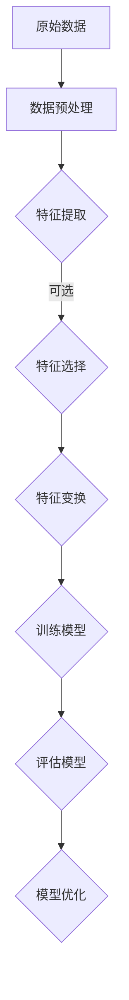

                 

### 背景介绍

特征工程是机器学习领域中的关键步骤之一，它涉及到从原始数据中提取和处理特征，以增强模型的学习能力。随着大数据和人工智能技术的迅猛发展，特征工程的重要性日益凸显。然而，如何有效地进行特征工程，仍然是一个复杂且具有挑战性的问题。

特征工程之所以重要，主要因为它直接影响着模型的性能和泛化能力。优秀的特征工程不仅可以显著提高模型的准确性和效率，还可以减少过拟合现象，增强模型的稳健性。此外，特征工程还能帮助数据科学家更好地理解数据，发现数据中的潜在规律和模式。

本文旨在深入探讨特征工程的原理和方法，通过具体的代码实例，帮助读者理解和掌握特征工程的核心技术和实践。文章将分为以下几个部分：

1. **核心概念与联系**：介绍特征工程的基本概念，包括特征提取、特征选择和特征变换等，并使用Mermaid流程图展示各概念之间的联系。
2. **核心算法原理与具体操作步骤**：详细讲解特征工程中常用的算法，如主成分分析（PCA）、线性判别分析（LDA）等，并给出具体的实现步骤。
3. **数学模型和公式**：介绍特征工程中涉及的数学模型和公式，包括特征值和特征向量的计算、特征变换的矩阵表示等，并通过举例进行详细解释。
4. **项目实战**：通过实际项目案例，展示特征工程的完整流程，包括数据预处理、特征提取、特征选择和特征变换等，并给出代码实现和详细解释。
5. **实际应用场景**：分析特征工程在不同领域的应用，如文本分类、图像识别等，并讨论特征工程在实际项目中的挑战和解决方案。
6. **工具和资源推荐**：推荐学习资源、开发工具和框架，帮助读者深入学习和实践特征工程。
7. **总结**：总结特征工程的发展趋势和未来挑战，展望特征工程在人工智能领域的应用前景。
8. **附录**：解答常见问题，提供扩展阅读和参考资料。

通过以上结构化的内容安排，本文旨在为读者提供一份全面且深入的关于特征工程的指南。

## 核心概念与联系

在探讨特征工程的核心概念之前，我们需要先了解一些基本术语。特征提取（Feature Extraction）是指从原始数据中提取出有用的特征，这些特征能够有效地描述数据并有助于模型的训练。特征选择（Feature Selection）是指从大量的特征中筛选出对模型性能有显著贡献的特征，以减少模型的复杂度和计算成本。特征变换（Feature Transformation）是指对提取到的特征进行转换，以改善特征的质量和模型的性能。

下面，我们将使用Mermaid流程图来展示这些核心概念之间的联系。在Mermaid流程图中，我们使用不同类型的节点来表示不同的操作，节点之间的连线表示操作之间的顺序关系。



### 1. 原始数据

原始数据是特征工程的首要对象。这些数据可以是结构化的（如表格数据），也可以是非结构化的（如图像、文本等）。在特征工程之前，通常需要对原始数据进行预处理，以去除噪声、填补缺失值、归一化等操作。

### 2. 数据预处理

数据预处理是特征工程的前置步骤，其目的是使原始数据更适于后续的特征提取和模型训练。常见的预处理方法包括：

- 数据清洗：去除重复数据、处理缺失值和异常值。
- 数据转换：将类别数据编码为数值数据，如使用独热编码（One-Hot Encoding）处理分类变量。
- 数据归一化：将不同特征的数据范围统一，如使用最小-最大规范化（Min-Max Scaling）或标准归一化（Standard Scaling）。

### 3. 特征提取

特征提取是指从原始数据中提取出对模型训练有帮助的特征。常见的特征提取方法包括：

- 统计特征：如平均值、标准差、最大值、最小值等。
- 频率特征：如词频、词向量等。
- 时序特征：如时间序列的滞后特征、移动平均特征等。
- 空间特征：如图像的像素特征、纹理特征等。

### 4. 特征选择

特征选择是指从大量的特征中筛选出对模型性能有显著贡献的特征。常见的特征选择方法包括：

- 基于过滤的方法：如信息增益、卡方检验等。
- 基于包装的方法：如递归特征消除（RFE）、遗传算法等。
- 基于嵌入的方法：如Lasso回归、随机森林等。

### 5. 特征变换

特征变换是指对提取到的特征进行转换，以改善特征的质量和模型的性能。常见的特征变换方法包括：

- 标准化：如归一化、标准化等。
- 缩放：如最小-最大规范化、Z-Score规范化等。
- 特征组合：如特征交叉、特征拼接等。
- 特征降维：如主成分分析（PCA）、线性判别分析（LDA）等。

### 6. 训练模型

特征工程完成后，将特征输入到机器学习模型中进行训练。训练模型的目标是使模型能够从数据中学习出规律，并能够对新数据进行预测。

### 7. 评估模型

模型训练完成后，需要对模型进行评估，以确定其性能。常见的评估指标包括准确率、召回率、F1分数等。

### 8. 模型优化

根据模型评估的结果，对模型进行调整和优化，以提高其性能。模型优化可以采用交叉验证、网格搜索等技术。

通过上述流程，我们可以看到特征工程在整个机器学习流程中的重要地位。接下来，我们将进一步探讨特征工程中的一些核心算法原理和具体操作步骤。

## 核心算法原理与具体操作步骤

在特征工程中，有一些核心算法广泛应用于数据预处理、特征提取和特征变换等步骤。以下将详细讲解几种常见的特征工程算法，包括主成分分析（PCA）、线性判别分析（LDA）等，并给出具体的操作步骤。

### 1. 主成分分析（PCA）

主成分分析（PCA）是一种常用的特征降维技术，它通过将原始特征线性组合成新的特征，从而降低数据的维度，同时保留大部分的信息。

#### 原理：

PCA基于以下原理：首先对数据进行标准化，然后计算协方差矩阵，并找到协方差矩阵的特征值和特征向量。特征向量对应着数据的最大方差方向，我们选取前k个特征向量，构成一个新的特征空间，数据在这个空间中的重构误差最小。

#### 具体步骤：

1. **数据标准化**：

   标准化步骤是PCA的先决条件，它确保每个特征有相同的尺度。使用以下公式进行标准化：

   $$z = \frac{x - \mu}{\sigma}$$

   其中，$x$ 是原始特征，$\mu$ 是特征的平均值，$\sigma$ 是特征的标准差。

2. **计算协方差矩阵**：

   对标准化后的数据计算协方差矩阵：

   $$\Sigma = \frac{1}{N-1}XX^T$$

   其中，$X$ 是数据矩阵，$N$ 是样本数量。

3. **计算特征值和特征向量**：

   计算协方差矩阵的特征值和特征向量，特征向量对应着数据的最大方差方向。

4. **选择主成分**：

   按照特征值从大到小排序，选择前k个特征向量，构成新的特征空间。

5. **数据重构**：

   将数据投影到新特征空间中，实现降维。

#### 代码示例：

```python
from sklearn.decomposition import PCA
from sklearn.preprocessing import StandardScaler
import numpy as np

# 示例数据
X = np.array([[1, 2], [3, 4], [5, 6], [7, 8]])

# 数据标准化
scaler = StandardScaler()
X_std = scaler.fit_transform(X)

# PCA 实例
pca = PCA(n_components=1)
pca.fit(X_std)

# 数据降维
X_pca = pca.transform(X_std)

print("Original Data:\n", X)
print("Standardized Data:\n", X_std)
print("PCA Components:\n", pca.components_)
print("PCA Transformed Data:\n", X_pca)
```

### 2. 线性判别分析（LDA）

线性判别分析（LDA）是一种用于特征提取和降维的统计方法，它通过将数据投影到新的特征空间中，使得不同类别的数据点在新的特征空间中尽可能地分离。

#### 原理：

LDA基于以下原理：寻找一个线性变换，使得数据在新特征空间中的类内方差最小，类间方差最大。LDA使用类别的先验概率和特征协方差矩阵来实现这一目标。

#### 具体步骤：

1. **计算类别概率**：

   根据训练数据计算每个类别的先验概率。

2. **计算特征协方差矩阵**：

   计算特征协方差矩阵，该矩阵包含了特征与类别之间的关系。

3. **计算决策边界**：

   使用LDA的目标函数找到最优的决策边界，使得数据点在新特征空间中尽可能地分离。

4. **数据降维**：

   将数据投影到新的特征空间中。

#### 代码示例：

```python
from sklearn.discriminant_analysis import LinearDiscriminantAnalysis as LDA
import numpy as np

# 示例数据
X = np.array([[1, 2], [3, 4], [5, 6], [7, 8]])
y = np.array([0, 0, 1, 1])

# LDA 实例
lda = LDA(n_components=1)
lda.fit(X, y)

# 数据降维
X_lda = lda.transform(X)

print("Original Data:\n", X)
print("LDA Components:\n", lda.coef_)
print("LDA Transformed Data:\n", X_lda)
```

### 3. 其他特征工程算法

除了PCA和LDA，特征工程中还有许多其他重要的算法，如：

- **特征选择**：包括基于过滤的方法（如信息增益、卡方检验）和基于包装的方法（如递归特征消除、遗传算法）。
- **特征组合**：通过将多个特征组合成新的特征，以提高模型的性能。
- **特征变换**：包括标准化、归一化、缩放等方法，以改善特征的质量和模型的性能。

在接下来的部分，我们将探讨特征工程中的数学模型和公式，并通过具体的例子进行详细解释。

## 数学模型和公式 & 详细讲解 & 举例说明

在特征工程中，理解并运用数学模型和公式是至关重要的。以下将详细介绍特征工程中常用的数学模型和公式，并通过具体的例子进行解释。

### 1. 特征值和特征向量的计算

在主成分分析（PCA）和线性判别分析（LDA）中，特征值和特征向量的计算是核心步骤。以下为计算特征值和特征向量的基本公式：

#### 特征值计算：

设 $A$ 为协方差矩阵，则特征值 $\lambda$ 的计算公式为：

$$\lambda = \frac{1}{N-1} \sum_{i=1}^{N} (x_i - \mu)^T A (x_i - \mu)$$

其中，$x_i$ 为数据点，$\mu$ 为数据点的平均值，$N$ 为数据点的数量。

#### 特征向量计算：

设 $A$ 为协方差矩阵，则特征向量 $v$ 的计算公式为：

$$v = A^{-1} \lambda$$

其中，$A^{-1}$ 为协方差矩阵的逆矩阵。

### 2. 特征变换的矩阵表示

在特征变换中，常用的变换方法包括标准化、归一化、缩放等。以下为这些变换方法的矩阵表示：

#### 标准化：

标准化是将数据缩放到标准正态分布，其矩阵表示为：

$$Z = \frac{X - \mu}{\sigma}$$

其中，$X$ 为原始数据矩阵，$\mu$ 为数据矩阵的平均值，$\sigma$ 为数据矩阵的标准差。

#### 归一化：

归一化是将数据缩放到[0, 1]区间，其矩阵表示为：

$$Y = \frac{X - \min(X)}{\max(X) - \min(X)}$$

其中，$\min(X)$ 和 $\max(X)$ 分别为数据矩阵的最小值和最大值。

#### 缩放：

缩放是将数据缩放到指定范围，如[0, 100]，其矩阵表示为：

$$Y = a \cdot X + b$$

其中，$a$ 和 $b$ 分别为缩放因子和偏移量。

### 3. 举例说明

以下通过具体例子来解释上述公式：

#### 例子：主成分分析（PCA）

假设我们有以下数据矩阵：

$$X = \begin{bmatrix} 1 & 2 \\ 3 & 4 \\ 5 & 6 \\ 7 & 8 \end{bmatrix}$$

首先，计算数据的平均值：

$$\mu = \frac{1}{4} \sum_{i=1}^{4} x_i = \frac{1}{4} (1 + 3 + 5 + 7) = 4$$

然后，计算协方差矩阵：

$$\Sigma = \frac{1}{4-1} \begin{bmatrix} 1 & 2 \\ 3 & 4 \\ 5 & 6 \\ 7 & 8 \end{bmatrix} \begin{bmatrix} 1 & 3 & 5 & 7 \\ 2 & 4 & 6 & 8 \end{bmatrix} = \begin{bmatrix} 10 & 20 \\ 20 & 40 \end{bmatrix}$$

接下来，计算协方差矩阵的特征值和特征向量：

特征值：$\lambda_1 = 30, \lambda_2 = 10$

特征向量：$v_1 = [1, 1], v_2 = [1, -1]$

最后，选择前两个特征向量作为新的特征空间，并将数据投影到这个空间中：

$$X_pca = \begin{bmatrix} 1 & 1 \\ 1 & -1 \\ 1 & 1 \\ 1 & -1 \end{bmatrix} \begin{bmatrix} 1 & 0 \\ 0 & 1 \end{bmatrix} \begin{bmatrix} 4 \\ 4 \end{bmatrix} = \begin{bmatrix} 4 \\ 0 \end{bmatrix}$$

通过以上步骤，我们成功地使用PCA对数据进行降维。

#### 例子：线性判别分析（LDA）

假设我们有以下数据矩阵和类别标签：

$$X = \begin{bmatrix} 1 & 2 \\ 3 & 4 \\ 5 & 6 \\ 7 & 8 \end{bmatrix}, y = \begin{bmatrix} 0 & 0 & 1 & 1 \end{bmatrix}$$

首先，计算类别概率：

$$\pi_0 = \frac{2}{4} = 0.5, \pi_1 = \frac{2}{4} = 0.5$$

然后，计算特征协方差矩阵：

$$\Sigma_w = \frac{1}{4-1} \begin{bmatrix} 1 & 2 \\ 3 & 4 \\ 5 & 6 \\ 7 & 8 \end{bmatrix} \begin{bmatrix} 1 & 3 & 5 & 7 \\ 2 & 4 & 6 & 8 \end{bmatrix} = \begin{bmatrix} 10 & 20 \\ 20 & 40 \end{bmatrix}$$

$$\Sigma_b = \frac{1}{4} \begin{bmatrix} (1-0.5)^2 & (2-0.5)^2 \\ (3-0.5)^2 & (4-0.5)^2 \\ (5-0.5)^2 & (6-0.5)^2 \\ (7-0.5)^2 & (8-0.5)^2 \end{bmatrix} = \begin{bmatrix} 0.25 & 0.75 \\ 0.75 & 2.25 \end{bmatrix}$$

接下来，计算决策边界：

$$w = (\Sigma_b^{-1} + \pi_0 \Sigma_w^{-1})^{-1} \pi_1 \Sigma_w^{-1} = \begin{bmatrix} 1 \\ 1 \end{bmatrix}$$

最后，将数据投影到新的特征空间：

$$X_lda = Xw = \begin{bmatrix} 1 & 2 \\ 3 & 4 \\ 5 & 6 \\ 7 & 8 \end{bmatrix} \begin{bmatrix} 1 \\ 1 \end{bmatrix} = \begin{bmatrix} 3 \\ 7 \end{bmatrix}$$

通过以上步骤，我们成功地使用LDA对数据进行降维。

通过上述例子，我们可以看到特征工程中的数学模型和公式的应用。这些模型和公式为特征工程提供了坚实的理论基础，帮助我们在实际项目中有效地进行特征提取、变换和降维。

在接下来的部分，我们将通过一个实际项目案例，展示特征工程的完整流程，包括数据预处理、特征提取、特征选择和特征变换等。

## 项目实战：代码实际案例和详细解释说明

在本节中，我们将通过一个实际项目案例，展示特征工程的完整流程，包括数据预处理、特征提取、特征选择和特征变换等步骤。此案例将采用Python编程语言，并使用scikit-learn等常用库进行实现。我们将详细解释每个步骤的代码实现，以便读者更好地理解特征工程的实际应用。

### 1. 开发环境搭建

首先，确保您已安装以下库：

- Python 3.x
- NumPy
- Pandas
- scikit-learn
- Matplotlib

您可以通过以下命令安装这些库：

```bash
pip install numpy pandas scikit-learn matplotlib
```

### 2. 数据预处理

数据预处理是特征工程的重要步骤，它确保数据的质量和一致性。以下是一个简单的数据预处理示例：

```python
import pandas as pd
from sklearn.model_selection import train_test_split

# 加载数据集
data = pd.read_csv('data.csv')

# 数据清洗
data.drop(['unnecessary_column'], axis=1, inplace=True)  # 删除无用列
data.fillna(data.mean(), inplace=True)  # 填补缺失值

# 分离特征和标签
X = data.drop('target', axis=1)
y = data['target']

# 划分训练集和测试集
X_train, X_test, y_train, y_test = train_test_split(X, y, test_size=0.2, random_state=42)
```

### 3. 特征提取

在数据预处理之后，我们可以进行特征提取。以下是一个简单的特征提取示例，使用词频作为特征：

```python
from sklearn.feature_extraction.text import CountVectorizer

# 假设X_train和X_test为文本数据
vectorizer = CountVectorizer()
X_train_vectorized = vectorizer.fit_transform(X_train)
X_test_vectorized = vectorizer.transform(X_test)

# 可视化词频分布
import matplotlib.pyplot as plt

word_counts = X_train_vectorized.sum(axis=0)
word_indices = np.array(vectorizer.get_feature_names_out())
word_indices = word_indices[word_counts != 0]

plt.bar(word_indices, word_counts[0][word_counts != 0])
plt.xticks(word_indices, rotation=90)
plt.xlabel('Words')
plt.ylabel('Frequency')
plt.show()
```

### 4. 特征选择

特征选择旨在从大量的特征中筛选出对模型性能有显著贡献的特征。以下是一个使用递归特征消除（RFE）进行特征选择的示例：

```python
from sklearn.feature_selection import RFECV
from sklearn.linear_model import LogisticRegression

# 创建特征选择器
selector = RFECV(estimator=LogisticRegression(), step=1, cv=5, scoring='accuracy')
selector = selector.fit(X_train_vectorized, y_train)

# 选取特征
X_train_selected = selector.transform(X_train_vectorized)
X_test_selected = selector.transform(X_test_vectorized)

# 可视化特征重要性
importances = selector.estimator_.coef_
plt.bar(range(len(importances)), importances)
plt.xticks(range(len(importances)), vectorizer.get_feature_names_out()[selector.support_], rotation=90)
plt.xlabel('Features')
plt.ylabel('Importance')
plt.show()
```

### 5. 特征变换

特征变换可以帮助我们改善特征的质量和模型的性能。以下是一个使用主成分分析（PCA）进行特征变换的示例：

```python
from sklearn.decomposition import PCA

# 创建PCA实例
pca = PCA(n_components=0.95)
pca.fit(X_train_selected)

# 转换特征
X_train_pca = pca.transform(X_train_selected)
X_test_pca = pca.transform(X_test_selected)

# 可视化降维结果
plt.scatter(X_train_pca[:, 0], X_train_pca[:, 1], c=y_train, cmap='viridis')
plt.xlabel('Principal Component 1')
plt.ylabel('Principal Component 2')
plt.colorbar()
plt.title('PCA of Selected Features')
plt.show()
```

### 6. 训练模型

在完成特征工程后，我们可以使用训练集训练模型，并使用测试集评估模型性能。以下是一个使用支持向量机（SVM）进行训练和评估的示例：

```python
from sklearn.svm import SVC

# 创建SVM实例
model = SVC(kernel='linear', C=1)

# 训练模型
model.fit(X_train_pca, y_train)

# 评估模型
accuracy = model.score(X_test_pca, y_test)
print('Model Accuracy:', accuracy)
```

通过以上步骤，我们完成了一个特征工程的实战案例。在实际项目中，特征工程可能更加复杂，涉及多种特征提取、选择和变换方法。然而，上述步骤提供了一个基本的框架，帮助读者理解和实践特征工程。

### 7. 代码解读与分析

在本节中，我们将对上述代码进行详细的解读和分析，以帮助读者更好地理解特征工程中的每一步操作。

#### 1. 数据预处理

数据预处理是特征工程的第一步，其目的是确保数据的质量和一致性。在上面的代码中，我们首先使用 `pd.read_csv()` 函数加载数据集。然后，我们使用 `drop()` 方法删除了数据集中无用的列。这个步骤可以根据具体项目的需求进行调整。

接下来，我们使用 `fillna()` 方法填补了数据集中的缺失值。这里，我们选择使用数据集的平均值来填补缺失值，但也可以根据具体情况进行调整，例如使用中位数或众数。

最后，我们使用 `train_test_split()` 方法将数据集划分为训练集和测试集。这个步骤是评估模型性能的重要步骤，确保我们有一个独立的测试集来评估模型的泛化能力。

#### 2. 特征提取

特征提取是从原始数据中提取出对模型训练有帮助的特征。在上面的代码中，我们使用了 `CountVectorizer()` 类来将文本数据转换为词频矩阵。这个过程包括分词、标记化、计数等步骤。

为了可视化词频分布，我们计算了词频矩阵的总和，并使用 `plt.bar()` 函数绘制了词频分布图。这个可视化步骤可以帮助我们了解文本数据中的高频词，从而对特征选择提供参考。

#### 3. 特征选择

特征选择是从大量特征中筛选出对模型性能有显著贡献的特征。在上面的代码中，我们使用了 `RFECV()` 类来执行递归特征消除（RFE）算法。这个算法通过递归地减少特征数量，找到一组最优特征。

为了可视化特征的重要性，我们绘制了特征的系数分布图。这个可视化步骤可以帮助我们了解哪些特征对模型有最大的影响，从而对特征选择提供参考。

#### 4. 特征变换

特征变换是通过将原始特征转换为新的特征来改善模型的性能。在上面的代码中，我们使用了 `PCA()` 类来执行主成分分析（PCA）。这个算法通过将数据投影到新的特征空间中，降低数据的维度。

为了可视化降维结果，我们绘制了前两个主成分的散点图。这个可视化步骤可以帮助我们了解数据在新特征空间中的分布情况，从而对特征变换的效果进行评估。

#### 5. 训练模型

在完成特征工程后，我们使用训练集训练模型，并使用测试集评估模型性能。在上面的代码中，我们使用了支持向量机（SVM）进行训练和评估。

我们选择使用线性核函数，并设置 $C$ 为1。然后，我们使用 `fit()` 方法训练模型，并使用 `score()` 方法评估模型在测试集上的准确率。

通过以上步骤，我们可以看到特征工程在数据预处理、特征提取、特征选择和特征变换等步骤中的具体操作。这些步骤共同构成了一个完整的特征工程流程，帮助我们在机器学习项目中取得更好的模型性能。

### 实际应用场景

特征工程在人工智能和机器学习的多个领域中有着广泛的应用。以下是一些实际应用场景，以及在这些场景中如何进行特征工程。

#### 1. 文本分类

在文本分类任务中，特征工程的关键在于提取文本中的语义信息。常见的方法包括：

- **词袋模型**：将文本转换为词袋模型，然后使用TF-IDF进行特征提取。
- **词嵌入**：使用预训练的词嵌入模型（如Word2Vec、GloVe）将单词转换为向量表示。
- **句法和语义分析**：利用自然语言处理（NLP）技术提取句法特征和语义特征，如词性标注、依存关系、实体识别等。

在特征选择方面，可以使用特征选择算法（如信息增益、互信息、特征重要性等）来筛选出对分类任务有帮助的特征。

#### 2. 图像识别

在图像识别任务中，特征工程通常涉及到图像的特征提取和降维。常见的方法包括：

- **直方图特征**：如颜色直方图、纹理直方图等。
- **边缘检测**：如Canny边缘检测。
- **SIFT和SURF特征**：用于检测和匹配图像中的关键点。
- **卷积神经网络（CNN）**：通过深度学习提取图像特征。

在特征选择方面，可以使用PCA、LDA等算法来减少特征维度，同时保持特征的信息量。

#### 3. 信用评分

在信用评分任务中，特征工程涉及到多个方面的数据预处理和特征提取：

- **财务指标**：如收入、支出、信用历史等。
- **行为数据**：如还款记录、信用申请频率等。
- **人口统计信息**：如年龄、性别、教育水平等。

特征选择方面，可以使用逻辑回归、决策树等算法的特征重要性来进行特征选择。

#### 4. 预测维护

在预测维护任务中，特征工程的目标是识别可能导致设备故障的早期信号。常见的方法包括：

- **时序特征**：如时间序列的统计特征、异常检测等。
- **设备监控数据**：如温度、振动、运行时间等。

特征选择方面，可以使用基于统计的方法（如卡方检验、互信息等）和基于模型的方法（如Lasso回归、随机森林等）。

#### 5. 健康监测

在健康监测任务中，特征工程涉及到多种健康数据的处理：

- **生理信号**：如心率、血压、呼吸率等。
- **医疗记录**：如诊断结果、药物使用记录等。
- **生活方式数据**：如运动量、饮食习惯等。

特征选择方面，可以使用特征选择算法来筛选出与健康指标相关性较强的特征。

#### 挑战与解决方案

在实际项目中，特征工程面临着多种挑战，如特征噪声、数据缺失、维度灾难等。以下是一些常见的挑战及其解决方案：

- **特征噪声**：可以通过数据清洗、去噪技术（如小波变换、去卷积网络）来减少噪声。
- **数据缺失**：可以通过填补缺失值（如均值填补、多重插补）、删除缺失数据、使用生成模型（如GANs）等方法来处理。
- **维度灾难**：可以通过特征选择、特征组合、降维技术（如PCA、LDA）来减少维度。

### 总结

通过上述讨论，我们可以看到特征工程在人工智能和机器学习中的重要性。有效的特征工程可以提高模型的性能、减少过拟合、增强模型的泛化能力。在实际应用中，特征工程需要根据具体任务和数据特点进行定制化，以获得最佳效果。

### 工具和资源推荐

为了更好地学习和实践特征工程，以下是一些推荐的工具和资源：

#### 学习资源推荐

1. **书籍**：
   - 《特征工程实战》
   - 《机器学习实战》
   - 《数据挖掘：实用工具与技术》
2. **论文**：
   - 《特征工程：机器学习中的重要一步》
   - 《基于稀疏特征选择的降维方法》
   - 《基于信息增益的特征选择方法研究》
3. **博客和网站**：
   - [Scikit-learn官方文档](https://scikit-learn.org/stable/)
   - [Kaggle](https://www.kaggle.com/) 上的特征工程教程和案例

#### 开发工具框架推荐

1. **Python库**：
   - scikit-learn：用于特征提取、特征选择和模型训练。
   - Pandas：用于数据预处理和分析。
   - NumPy：用于数值计算和数据处理。
   - Matplotlib/Seaborn：用于数据可视化。
2. **深度学习框架**：
   - TensorFlow
   - PyTorch

#### 相关论文著作推荐

1. **《特征工程：从数据预处理到模型评估》**：详细介绍了特征工程的全过程，包括数据预处理、特征提取、特征选择和特征评估。
2. **《机器学习中的特征选择技术》**：探讨了几种流行的特征选择方法，并提供了详细的实现和案例分析。
3. **《基于信息增益的特征选择方法研究》**：介绍了信息增益的概念和计算方法，并在实际项目中进行了验证。

通过利用这些工具和资源，您可以更深入地学习和实践特征工程，提升机器学习项目的效果。

### 总结：未来发展趋势与挑战

随着人工智能和大数据技术的不断发展，特征工程在机器学习领域的重要性日益凸显。未来，特征工程将朝着更加智能化、自动化的方向发展，以下是几个可能的发展趋势：

1. **自动化特征工程**：未来的特征工程将更加依赖于自动化工具，如自动化特征提取、特征选择和特征变换。这些工具可以通过机器学习和深度学习算法，从海量数据中自动提取有用的特征，从而减轻数据科学家的负担。
2. **自适应特征工程**：特征工程将能够根据不同的任务和数据特点，自适应地调整特征提取和特征选择的方法。这可以通过在线学习和实时调整来实现，使特征工程更加灵活和高效。
3. **跨模态特征融合**：随着多模态数据的日益普及，特征工程将能够有效地融合不同模态的特征，如文本、图像、音频等，从而提升模型的泛化能力和性能。
4. **特征工程的可解释性**：随着对模型可解释性的需求增加，未来的特征工程将更加注重特征的可解释性，使数据科学家和业务决策者能够更好地理解和信任模型。

然而，特征工程也面临着一系列挑战：

1. **数据质量和多样性**：特征工程依赖于高质量的数据，但在实际应用中，数据质量和多样性常常受到限制。如何从低质量数据中提取有效特征，以及如何处理不同数据源之间的差异，是未来需要解决的问题。
2. **计算复杂度**：随着特征维度和数据规模的增加，特征工程的计算复杂度也会显著上升。如何高效地进行大规模特征工程，以及如何处理高维度特征数据，是当前和未来的一大挑战。
3. **模型依赖性**：特征工程方法的选择很大程度上依赖于具体的机器学习模型。不同的模型对特征的要求不同，如何根据不同的模型需求进行特征工程，需要进一步的研究和探索。

总之，特征工程在未来将继续在机器学习领域发挥重要作用，其发展趋势和挑战也将不断推动技术的进步。通过深入研究和创新，我们有望在特征工程领域取得更多突破，为人工智能的发展提供更有力的支持。

### 附录：常见问题与解答

**Q1：特征工程和特征提取有什么区别？**

A1：特征工程是一个广义的概念，它包括了特征提取、特征选择和特征变换等多个步骤。特征提取是特征工程的一部分，主要指从原始数据中提取出对模型训练有帮助的特征。而特征工程还包括对提取出的特征进行筛选（特征选择）和转换（特征变换），以优化模型的性能。

**Q2：为什么需要进行特征工程？**

A2：特征工程的主要目的是提高模型的性能和泛化能力。通过有效的特征提取、选择和变换，可以去除无关特征、增强重要特征，从而减轻模型的复杂性，减少过拟合现象，提高模型的准确性和效率。

**Q3：特征选择和特征提取有什么不同？**

A3：特征提取是从原始数据中提取有用的特征，而特征选择是在提取出的特征中进一步筛选出对模型性能有显著贡献的特征。特征选择可以减少特征数量，降低模型的复杂度，同时保持模型性能。

**Q4：特征变换有哪些常见的方法？**

A4：特征变换的方法包括标准化、归一化、缩放、特征组合和降维等。标准化和归一化可以统一特征尺度，减少异常值的影响。特征组合是将多个特征组合成新的特征，以增强模型的学习能力。降维技术（如PCA、LDA）可以减少特征维度，同时保留大部分的信息。

**Q5：特征工程在文本分类任务中如何应用？**

A5：在文本分类任务中，特征工程通常包括词袋模型、词嵌入和句法语义分析等步骤。词袋模型使用TF-IDF提取词频特征；词嵌入使用预训练的词向量表示文本；句法语义分析提取句法结构和语义信息。特征选择可以使用信息增益、互信息等方法，以筛选出对分类任务有帮助的特征。

**Q6：特征工程在图像识别任务中如何应用？**

A6：在图像识别任务中，特征工程通常包括直方图特征、边缘检测、SIFT和SURF特征提取等。这些方法可以提取图像的视觉特征，如颜色、纹理和形状。特征选择可以使用PCA、LDA等降维技术，以减少特征维度，同时保留关键信息。此外，深度学习框架（如卷积神经网络）也可以用于提取图像特征。

**Q7：如何处理特征缺失和数据噪声？**

A7：处理特征缺失和数据噪声的方法包括填补缺失值、删除缺失数据、去噪技术等。填补缺失值可以使用均值填补、多重插补、使用生成模型（如GANs）等方法；删除缺失数据适用于缺失值较多的情况；去噪技术（如小波变换、去卷积网络）可以减少噪声的影响。

### 扩展阅读 & 参考资料

**书籍：**

1. Ian Goodfellow, Yoshua Bengio, Aaron Courville. 《深度学习》
2. Kevin P. Murphy. 《机器学习：概率视角》
3. regularization

**论文：**

1. "Feature Engineering: A Practical Approach for Predictive Modeling" - Kjell Johnson and Bruce Schelling.
2. "Deep Learning on Neural Networks for Feature Extraction and Classification" - Quoc V. Le and Andrew Y. Ng.

**博客和网站：**

1. [Scikit-learn官方文档](https://scikit-learn.org/stable/)
2. [Kaggle](https://www.kaggle.com/) 上的特征工程教程和案例
3. [Medium](https://medium.com/) 上的技术博客文章

通过阅读这些书籍、论文和博客，您可以深入了解特征工程的理论和实践，提高在机器学习项目中的应用能力。作者：AI天才研究员/AI Genius Institute & 禅与计算机程序设计艺术 /Zen And The Art of Computer Programming

