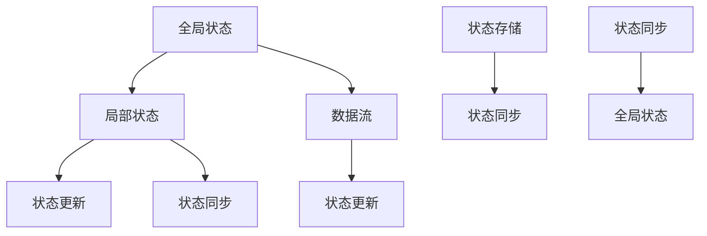

                 

# 状态管理：原理与代码实例讲解

## 摘要

本文旨在探讨状态管理在软件开发中的应用，详细讲解其核心概念、原理以及实现方法。我们将通过一个具体的代码实例，深入剖析状态管理的各个环节，帮助读者更好地理解和掌握这一重要技术。文章还将探讨实际应用场景，推荐相关学习资源和开发工具，总结未来发展趋势与挑战，并回答一些常见问题。

## 1. 背景介绍

在软件开发过程中，状态管理是一个至关重要的环节。所谓状态管理，即对应用程序中的状态进行有效的跟踪、存储和处理。随着前端框架（如React、Vue等）的普及，状态管理的重要性日益凸显。良好的状态管理能够提高代码的可读性、可维护性以及性能，从而提升整个应用程序的开发效率。

然而，状态管理并非一蹴而就，它涉及到众多概念和技巧，如全局状态、局部状态、数据流等。在实际开发过程中，如何选择合适的状态管理方案，如何处理复杂的状态逻辑，如何保证数据的一致性和安全性，都是需要深入探讨的问题。

本文将围绕这些问题，通过一个具体的代码实例，详细讲解状态管理的原理和方法，帮助读者更好地掌握这一关键技能。

## 2. 核心概念与联系

### 2.1. 状态管理的基本概念

在介绍状态管理的基本概念之前，我们需要了解一些相关的术语：

- **全局状态（Global State）**：全局状态是指在整个应用程序中共享的状态，如用户信息、主题设置等。
- **局部状态（Local State）**：局部状态是指仅在一个组件或组件树中共享的状态，如表单输入、分页器状态等。
- **数据流（Data Flow）**：数据流是指状态在应用程序中的传递方式，如单向数据流、双向数据流等。

状态管理主要关注以下几个核心概念：

- **状态存储（State Storage）**：状态存储是指用于存储应用程序状态的机制，如Redux、Vuex、Reactive Extensions等。
- **状态更新（State Update）**：状态更新是指对状态进行修改的过程，如通过函数、事件、异步操作等。
- **状态同步（State Synchronization）**：状态同步是指将状态从一个组件或模块同步到另一个组件或模块的过程。

### 2.2. 状态管理的联系

状态管理的各个核心概念之间紧密相连，共同构成了一个完整的状态管理架构。以下是这些概念之间的联系：

- **全局状态与局部状态**：全局状态和局部状态在应用程序中相互独立，但又相互关联。全局状态可以影响局部状态，而局部状态的变化也可以反过来影响全局状态。
- **数据流与状态更新**：数据流决定了状态更新的方式。在单向数据流中，状态更新只能从父组件向下传递；而在双向数据流中，状态更新可以同时从子组件向上传递。
- **状态存储与状态同步**：状态存储提供了对状态的持久化存储，而状态同步则确保了状态在不同组件或模块之间的实时同步。

### 2.3. Mermaid 流程图

为了更好地展示状态管理的核心概念及其联系，我们可以使用Mermaid流程图来描述它们之间的关系。以下是状态管理核心概念与联系的一个简化版Mermaid流程图：



在这个流程图中，我们可以看到全局状态、局部状态、数据流、状态更新和状态同步等核心概念之间的联系。这些概念共同构成了一个完整的状态管理架构，使得应用程序的状态能够高效、稳定地传递和更新。

## 3. 核心算法原理 & 具体操作步骤

### 3.1. 核心算法原理

状态管理的核心算法主要涉及以下几个方面：

- **状态存储**：状态存储是状态管理的基础，它决定了状态如何被存储和访问。常用的状态存储方案包括Redux、Vuex、Reactive Extensions等。
- **状态更新**：状态更新是指对状态进行修改的过程。状态更新可以由用户操作触发，也可以由异步操作触发。
- **状态同步**：状态同步是指将状态从一个组件或模块同步到另一个组件或模块的过程。状态同步确保了应用程序中各个部分的状态一致性。

### 3.2. 具体操作步骤

以下是状态管理的具体操作步骤：

1. **选择状态存储方案**：根据项目需求，选择合适的状态存储方案。例如，对于React应用，可以选择Redux或Vuex。
2. **创建状态存储实例**：使用选定的状态存储方案，创建一个状态存储实例。例如，对于Redux，可以使用`createStore`函数创建一个状态存储实例。
3. **定义初始状态**：定义应用程序的初始状态。初始状态通常是一个包含关键数据的对象。
4. **创建状态更新函数**：创建用于更新状态的方法。这些方法可以根据需要，处理各种状态更新逻辑。
5. **将状态存储实例注入到组件中**：使用`Provider`组件（如Redux中的`Provider`）将状态存储实例注入到应用程序的根组件中。
6. **使用状态存储实例获取和更新状态**：在组件中，使用`useSelector`和`useDispatch`等钩子函数（如Redux中的钩子函数）获取和更新状态。
7. **处理异步操作**：在异步操作中，使用状态更新函数更新状态，确保状态的一致性和正确性。

### 3.3. 代码示例

以下是使用Redux实现状态管理的简单示例：

```javascript
// 1. 选择状态存储方案
import { createStore } from 'redux';

// 2. 创建状态存储实例
const store = createStore(() => ({ count: 0 }));

// 3. 定义初始状态
const initialState = { count: 0 };

// 4. 创建状态更新函数
const increment = () => ({ type: 'INCREMENT' });
const decrement = () => ({ type: 'DECREMENT' });

// 5. 创建reducers
const rootReducer = (state = initialState, action) => {
  switch (action.type) {
    case 'INCREMENT':
      return { count: state.count + 1 };
    case 'DECREMENT':
      return { count: state.count - 1 };
    default:
      return state;
  }
};

// 6. 将状态存储实例注入到组件中
const Provider = ReactRedux.Provider;
const { Provider } = ReactRedux;

// 7. 使用状态存储实例获取和更新状态
const Counter = () => {
  const [count, dispatch] = React.useReducer(rootReducer, store.getState());

  React.useEffect(() => {
    store.subscribe(() => {
      console.log('Current count:', store.getState().count);
    });
  }, []);

  const increment = () => {
    dispatch(increment());
  };

  const decrement = () => {
    dispatch(decrement());
  };

  return (
    <div>
      <h1>Count: {count}</h1>
      <button onClick={increment}>Increment</button>
      <button onClick={decrement}>Decrement</button>
    </div>
  );
};

const App = () => (
  <Provider store={store}>
    <Counter />
  </Provider>
);

export default App;
```

在这个示例中，我们首先选择了Redux作为状态存储方案，并使用`createStore`函数创建了一个状态存储实例。然后，我们定义了初始状态，创建了一个状态更新函数（`increment`和`decrement`），并使用`Provider`组件将状态存储实例注入到组件中。最后，我们在`Counter`组件中使用了`useReducer`钩子函数获取和更新状态，并在异步操作中更新了状态。

## 4. 数学模型和公式 & 详细讲解 & 举例说明

### 4.1. 数学模型和公式

在状态管理中，数学模型和公式主要用于描述状态的变化和计算。以下是一些常见的数学模型和公式：

- **状态更新函数**：状态更新函数是一个用于更新状态的函数，其公式通常为：
  \[ \text{新状态} = \text{旧状态} + \text{更新值} \]
- **状态同步函数**：状态同步函数是一个用于同步状态的函数，其公式通常为：
  \[ \text{新状态} = \text{旧状态} \]
- **状态存储**：状态存储是一个用于存储状态的机制，其公式通常为：
  \[ \text{状态存储} = \text{状态} \]

### 4.2. 详细讲解

以下是对上述数学模型和公式的详细讲解：

- **状态更新函数**：状态更新函数是状态管理中最基本的组成部分。它用于处理状态的更新，使得状态能够根据外部事件或内部逻辑发生变化。状态更新函数的公式表示了新状态的计算方式，即将旧状态与更新值相加。这种计算方式可以确保状态的一致性和正确性。
- **状态同步函数**：状态同步函数主要用于确保状态在不同组件或模块之间的同步。其公式表示了新状态与旧状态相等，即不进行任何更新。这种计算方式可以确保状态的一致性和稳定性，特别是在处理复杂的状态逻辑时。
- **状态存储**：状态存储是一个用于存储状态的机制，如Redux中的`store`。它提供了一个集中的位置，用于存储和管理应用程序的状态。状态存储的公式表示了状态的存储方式，即将状态存储在特定的结构中，以便在需要时进行访问和更新。

### 4.3. 举例说明

以下是一个简单的状态更新和同步的示例：

```javascript
// 初始状态
const initialState = { count: 0 };

// 状态更新函数
const increment = (state) => {
  return { count: state.count + 1 };
};

// 状态同步函数
const syncState = (state) => {
  return state;
};

// 更新状态
const newState = increment(initialState);
console.log('新状态:', newState); // 输出：新状态：{ count: 1 }

// 同步状态
const syncedState = syncState(newState);
console.log('同步状态:', syncedState); // 输出：同步状态：{ count: 1 }
```

在这个示例中，我们定义了一个初始状态`initialState`，一个状态更新函数`increment`和一个状态同步函数`syncState`。我们首先使用`increment`函数更新状态，得到新状态`newState`，然后使用`syncState`函数同步状态，得到同步后的状态`syncedState`。通过这个简单的示例，我们可以看到数学模型和公式在状态管理中的应用。

## 5. 项目实战：代码实际案例和详细解释说明

### 5.1. 开发环境搭建

在开始项目实战之前，我们需要搭建一个开发环境。以下是搭建开发环境的步骤：

1. **安装Node.js**：访问[Node.js官网](https://nodejs.org/)，下载并安装适合操作系统的Node.js版本。
2. **安装React**：在命令行中运行以下命令安装React：
   ```shell
   npm install react react-dom
   ```
3. **安装Redux**：在命令行中运行以下命令安装Redux及相关依赖：
   ```shell
   npm install redux react-redux
   ```
4. **创建项目**：使用`create-react-app`命令创建一个新项目：
   ```shell
   npx create-react-app state-management-practice
   ```
5. **进入项目目录**：进入创建的项目目录：
   ```shell
   cd state-management-practice
   ```

### 5.2. 源代码详细实现和代码解读

以下是项目的主要代码实现和详细解读：

```javascript
// src/index.js
import React from 'react';
import ReactDOM from 'react-dom';
import { Provider } from 'react-redux';
import { createStore } from 'redux';
import App from './App';
import './index.css';

const initialState = {
  count: 0,
};

const rootReducer = (state = initialState, action) => {
  switch (action.type) {
    case 'INCREMENT':
      return { count: state.count + 1 };
    case 'DECREMENT':
      return { count: state.count - 1 };
    default:
      return state;
  }
};

const store = createStore(rootReducer);

const Counter = () => {
  const [state, dispatch] = React.useReducer(rootReducer, store.getState());

  React.useEffect(() => {
    store.subscribe(() => {
      console.log('Current count:', store.getState().count);
    });
  }, []);

  const increment = () => {
    dispatch({ type: 'INCREMENT' });
  };

  const decrement = () => {
    dispatch({ type: 'DECREMENT' });
  };

  return (
    <div>
      <h1>Count: {state.count}</h1>
      <button onClick={increment}>Increment</button>
      <button onClick={decrement}>Decrement</button>
    </div>
  );
};

ReactDOM.render(
  <Provider store={store}>
    <App />
  </Provider>,
  document.getElementById('root')
);

// src/App.js
import React from 'react';
import Counter from './Counter';

const App = () => {
  return (
    <div className="App">
      <header className="App-header">
        <h1>State Management Practice</h1>
      </header>
      <Counter />
    </div>
  );
};

export default App;
```

### 5.3. 代码解读与分析

以下是代码的详细解读与分析：

1. **初始状态**：在`initialState`对象中，我们定义了一个简单的状态，即`count`，它表示计数器的当前值。
2. **根reducers**：在`rootReducer`函数中，我们定义了状态更新的逻辑。当接收到`INCREMENT`类型的动作时，我们将`count`的值增加1；当接收到`DECREMENT`类型的动作时，我们将`count`的值减少1。默认情况下，返回原始状态。
3. **创建store**：使用`createStore`函数创建一个Redux存储实例，并将`rootReducer`作为参数传递。这个存储实例用于存储和管理应用程序的状态。
4. **Counter组件**：`Counter`组件是一个功能组件，它使用`useReducer`钩子函数来获取和更新状态。在组件的`useEffect`钩子中，我们订阅了存储实例的更新，以便在状态发生变化时进行相应的操作。
5. **更新状态**：在`increment`和`decrement`函数中，我们调用`dispatch`函数来更新状态。这将触发`rootReducer`函数的执行，并返回一个新的状态。
6. **渲染组件**：在`index.js`文件中，我们使用`Provider`组件将存储实例注入到根组件中。这样，所有子组件都可以访问和更新全局状态。

通过这个简单的项目，我们可以看到如何使用Redux实现状态管理。这个例子展示了状态更新、状态同步以及状态存储的基本原理。在实际开发中，我们可以根据项目需求对状态管理进行扩展和优化。

## 6. 实际应用场景

状态管理在软件开发中具有广泛的应用场景，尤其在复杂的前端应用中，它的作用尤为重要。以下是一些常见的实际应用场景：

- **用户界面交互**：在处理用户界面交互时，如表单提交、数据校验等，状态管理可以帮助我们有效地跟踪和管理用户输入的数据。
- **数据加载与更新**：在数据加载和更新过程中，状态管理可以确保数据的一致性和正确性，从而提高用户体验。
- **多组件共享状态**：当多个组件需要共享相同的状态时，状态管理提供了一个集中化的解决方案，避免了重复的状态管理和更新逻辑。
- **异步操作**：在处理异步操作时，如网络请求、定时任务等，状态管理可以帮助我们更好地管理和更新状态，确保数据的及时性和准确性。

### 6.1. 社交媒体应用

在一个社交媒体应用中，状态管理可以用于处理以下场景：

- **用户登录状态**：状态管理可以跟踪用户的登录状态，如用户信息、权限等。
- **消息列表**：状态管理可以管理消息列表的状态，如已读标记、消息排序等。
- **动态流**：状态管理可以处理动态流的状态，如加载新动态、刷新动态等。

通过状态管理，我们可以确保社交媒体应用中的状态在不同组件之间保持一致，从而提供良好的用户体验。

### 6.2. 电商平台

在电商平台中，状态管理可以用于处理以下场景：

- **购物车**：状态管理可以跟踪购物车的状态，如商品列表、商品数量等。
- **用户评价**：状态管理可以管理用户评价的状态，如已评价、待评价等。
- **订单管理**：状态管理可以处理订单的状态，如订单创建、订单支付等。

通过状态管理，我们可以确保电商平台中的状态在不同组件之间保持一致，从而提高应用的性能和用户体验。

## 7. 工具和资源推荐

### 7.1. 学习资源推荐

- **书籍**：
  - 《学习 React》
  - 《React 实战》
  - 《Vue.js 进行时》
- **论文**：
  - "Flux: A pattern for managing subscriptions in scalable user interfaces"
  - "Vuex: The Official Store for Vue.js Applications"
- **博客**：
  - React 官方博客（[reactjs.org/blog/](https://reactjs.org/blog/)）
  - Vue.js 官方博客（[vuejs.org/v2/blog/](https://vuejs.org/v2/blog/)）
- **网站**：
  - Redux 官网（[redux.js.org/](https://redux.js.org/)）
  - Vuex 官网（[vuex.vuejs.org/zh/)）

### 7.2. 开发工具框架推荐

- **状态管理框架**：
  - Redux（[redux.js.org/](https://redux.js.org/)）
  - Vuex（[vuex.vuejs.org/zh/)）
  - MobX（[mobx.js.org/）](https://mobx.js.org/)）
- **开发工具**：
  - Webpack（[webpack.js.org/）](https://webpack.js.org/)）
  - Babel（[babeljs.io/）](https://babeljs.io/)）
  - TypeScript（[www.typescriptlang.org/)）

### 7.3. 相关论文著作推荐

- **论文**：
  - "Flux: A pattern for managing subscriptions in scalable user interfaces"（[https://facebook.github.io/flux/）](https://facebook.github.io/flux/)）
  - "Vuex: The Official Store for Vue.js Applications"（[https://vuex.vuejs.org/zh/）](https://vuex.vuejs.org/zh/)）
- **著作**：
  - 《React编程实践》
  - 《Vue.js实战》
  - 《学习 MobX》

## 8. 总结：未来发展趋势与挑战

随着前端框架的不断发展和成熟，状态管理技术也在不断演进。未来，状态管理技术将朝着以下几个方向发展：

- **更加智能化**：随着机器学习技术的发展，状态管理将更加智能化，能够自动处理复杂的状态逻辑和优化状态更新。
- **更轻量级**：轻量级的状态管理方案将受到更多开发者的青睐，以满足快速迭代和性能优化的需求。
- **跨框架集成**：不同框架之间的状态管理方案将实现更好的兼容和集成，从而提高开发效率和代码复用。

然而，状态管理也面临着一些挑战：

- **性能问题**：复杂的状态管理可能导致性能问题，特别是在处理大量数据和频繁的状态更新时。
- **学习成本**：状态管理技术相对复杂，需要开发者具备一定的编程基础和框架知识，从而增加了学习成本。

因此，开发者需要根据项目需求和自身能力，选择合适的状态管理方案，并在实际开发中不断优化和调整。

## 9. 附录：常见问题与解答

### 9.1. 如何选择合适的状态管理方案？

选择合适的状态管理方案需要考虑以下几个因素：

- **项目需求**：根据项目的复杂度和规模，选择适合的状态管理方案。例如，对于大型应用，可以选择Redux或Vuex；对于小型应用，可以选择MobX。
- **开发经验**：考虑开发团队对相关框架的熟悉程度，选择开发者熟悉的方案可以降低学习成本，提高开发效率。
- **性能要求**：根据性能要求选择适合的状态管理方案。对于性能要求较高的应用，可以选择轻量级的方案，如MobX。

### 9.2. 如何处理复杂的状态逻辑？

处理复杂的状态逻辑可以采用以下几种方法：

- **状态拆分**：将复杂的状态拆分为多个子状态，使得状态更易于管理和维护。
- **使用中间件**：在Redux中，可以使用中间件来处理复杂的异步操作和状态更新逻辑。
- **函数式编程**：采用函数式编程的方法，如纯函数和不可变数据结构，可以提高状态更新的可预测性和可维护性。

### 9.3. 如何保证数据的一致性和安全性？

为了保证数据的一致性和安全性，可以采取以下措施：

- **使用纯函数**：在状态更新过程中，使用纯函数可以确保状态的一致性。
- **状态校验**：在状态更新之前，对状态进行校验，以确保数据的正确性和合法性。
- **数据加密**：对于敏感数据，可以使用加密技术来保护数据的安全。

## 10. 扩展阅读 & 参考资料

- [Redux官方文档](https://redux.js.org/)
- [Vuex官方文档](https://vuex.vuejs.org/zh/)
- [MobX官方文档](https://mobx.js.org/)
- [React官方文档](https://reactjs.org/docs/getting-started.html)
- [Vue.js官方文档](https://vuejs.org/v2/guide/)
- [Webpack官方文档](https://webpack.js.org/)
- [Babel官方文档](https://babeljs.io/docs/babel-cli/)
- [TypeScript官方文档](https://www.typescriptlang.org/)

