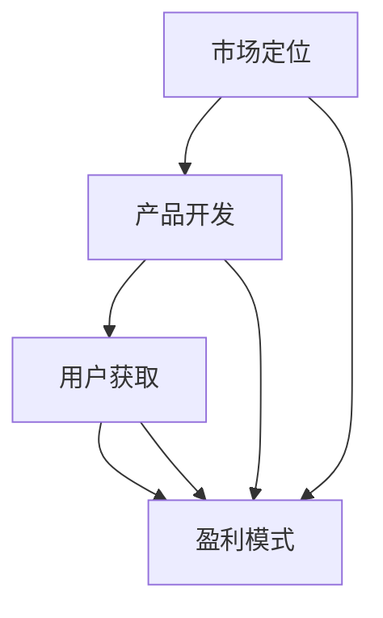

                 

### 背景介绍

#### 独立开发者商业化之路

在当今这个快速发展的数字化时代，独立开发者（Independent Developers，简称Indie Devs）成为了一股不可忽视的力量。他们凭借对技术的热爱和独特的创造力，在竞争激烈的软件市场中闯出了一片天地。然而，独立开发者的成功不仅仅在于技术上的卓越，更在于他们能否将这种技术转化为商业价值。本文将探讨独立开发者从最初的想法到实现商业化的全过程，分析其中的关键因素和策略。

独立开发者通常是指那些独立或小团队进行软件开发的人员。他们不同于大型公司的员工，没有复杂的组织结构和繁重的管理任务，可以更加专注于技术本身。独立开发者的优势在于其灵活性、创新性和快速响应市场变化的能力。然而，这些优势也伴随着挑战，如资源有限、市场推广困难等。

商业化是独立开发者追求的目标之一。商业化不仅意味着产品的销售，更意味着品牌影响力的建立、市场占有率的提升以及持续发展的可能性。一个成功的商业化案例，可以为独立开发者带来稳定的经济收入，同时也为他们提供了进一步发展的资本和资源。

本文的结构如下：

1. **背景介绍**：简要介绍独立开发者商业化的重要性及现状。
2. **核心概念与联系**：阐述独立开发者商业化的核心概念及其相互关系，使用Mermaid流程图进行可视化展示。
3. **核心算法原理 & 具体操作步骤**：分析独立开发者实现商业化的关键步骤和策略。
4. **数学模型和公式 & 详细讲解 & 举例说明**：通过数学模型和公式，解释商业化过程中的关键环节。
5. **项目实战：代码实际案例和详细解释说明**：提供实际的代码案例，详细解读商业化过程中的实现细节。
6. **实际应用场景**：分析独立开发者商业化的实际应用场景，包括产品定位、市场策略等。
7. **工具和资源推荐**：推荐有助于独立开发者实现商业化的工具、资源和学习材料。
8. **总结：未来发展趋势与挑战**：总结独立开发者商业化面临的机会与挑战，探讨未来的发展趋势。
9. **附录：常见问题与解答**：针对读者可能遇到的问题进行解答。
10. **扩展阅读 & 参考资料**：提供相关的扩展阅读材料，帮助读者深入理解本文内容。

通过上述结构和内容的安排，我们希望能为独立开发者提供一条清晰、实用的商业化之路，帮助他们从梦想走向现实。接下来，我们将深入探讨独立开发者商业化的核心概念与联系。

-----------------------

## 2. 核心概念与联系

在探讨独立开发者商业化之路之前，我们需要明确几个核心概念，这些概念是理解商业化的基础，它们分别是：市场定位、产品开发、用户获取、盈利模式。

### 市场定位（Market Positioning）

市场定位是指独立开发者确定其在市场上的位置，即识别并突出自身产品的独特卖点。市场定位的关键在于找到目标客户群体，并让他们意识到产品的价值。例如，如果您的产品是一个面向企业客户的CRM系统，那么您的市场定位可能是“提供高效、易用的CRM解决方案，帮助企业管理客户关系”。

### 产品开发（Product Development）

产品开发是指独立开发者将创意转化为实际产品的过程。这包括需求分析、设计、开发、测试和发布。独立开发者需要具备扎实的技术能力，以确保产品的高质量和稳定性。此外，开发者还需考虑产品的用户体验，使其易于使用且符合用户需求。

### 用户获取（User Acquisition）

用户获取是指通过各种渠道吸引潜在用户，将其转化为实际用户的过程。这包括SEO（搜索引擎优化）、社交媒体营销、内容营销、广告投放等。独立开发者需要制定有效的营销策略，以在竞争激烈的市场中脱颖而出。

### 盈利模式（Revenue Model）

盈利模式是指独立开发者通过产品或服务获取收入的方式。常见的盈利模式包括以下几种：

- **一次性销售（One-time Sales）**：用户一次性购买产品或服务。
- **订阅模式（Subscription Model）**：用户按月或按年支付订阅费用。
- **广告模式（Advertising Model）**：通过展示广告获取收入。
- **佣金模式（Commission Model）**：通过为第三方提供服务或产品获取佣金。

### 核心概念与联系的Mermaid流程图

以下是一个使用Mermaid绘制的流程图，展示了上述核心概念之间的联系：



### Mermaid流程图解释

- **市场定位**：独立开发者首先需要确定产品的市场定位，这有助于明确目标客户群体。
- **产品开发**：在确定了市场定位后，开发者开始进行产品开发，确保产品符合市场需求。
- **用户获取**：产品开发完成后，独立开发者通过各种渠道进行用户获取，以扩大产品的影响力。
- **盈利模式**：最终，通过用户获取和产品销售，独立开发者实现盈利，从而支持产品的持续发展。

通过上述流程，我们可以看出，市场定位、产品开发、用户获取和盈利模式是相互关联的，任何一个环节的缺失都可能导致商业化的失败。因此，独立开发者需要综合考虑这些因素，制定全面的商业化策略。

-----------------------

### 3. 核心算法原理 & 具体操作步骤

在独立开发者实现商业化的过程中，有几个核心步骤是至关重要的。以下我们将详细探讨这些核心步骤的原理和具体操作步骤。

#### 步骤一：市场定位

市场定位是商业化之旅的第一步，它决定了产品的方向和目标客户。具体操作步骤如下：

1. **市场调研**：独立开发者需要通过市场调研来了解目标市场的需求、竞争对手、市场规模等。市场调研可以通过问卷调查、访谈、竞争对手分析等方式进行。
2. **目标客户分析**：根据市场调研结果，独立开发者需要确定目标客户群体，包括客户需求、痛点、购买力等。
3. **独特卖点（USP）**：在明确了目标客户后，开发者需要找出产品的独特卖点，即产品相对于竞争对手的优势。独特卖点可以是产品功能、用户体验、价格等。
4. **市场定位文档**：将上述分析结果整理成市场定位文档，作为后续开发和营销的指导。

#### 步骤二：产品开发

产品开发是商业化过程中的关键环节，它决定了产品的质量和用户体验。具体操作步骤如下：

1. **需求分析**：根据市场定位文档，独立开发者需要明确产品的功能需求和性能需求。需求分析可以通过用户访谈、竞品分析、市场调研等方式进行。
2. **产品设计**：在需求分析的基础上，开发者进行产品设计，包括界面设计、功能设计、架构设计等。
3. **编码与开发**：按照产品设计文档，开发者进行编码和开发工作，确保代码质量、模块化、可维护性等。
4. **测试与迭代**：在开发过程中，开发者需要不断进行测试，确保产品的稳定性和性能。测试包括单元测试、集成测试、性能测试等。根据测试结果，开发者需要对产品进行迭代优化。

#### 步骤三：用户获取

用户获取是商业化过程中的重要环节，它决定了产品的市场占有率。具体操作步骤如下：

1. **内容营销**：通过创建有价值的内容（如博客、视频、教程等）吸引潜在用户。内容营销是建立品牌信任和用户忠诚度的有效手段。
2. **社交媒体营销**：利用社交媒体平台（如Twitter、LinkedIn、Facebook等）进行推广，增加产品的曝光率和用户参与度。
3. **广告投放**：通过付费广告（如Google Ads、Facebook Ads等）吸引潜在用户，提高产品知名度。
4. **合作与推广**：与其他企业或个人进行合作，通过交叉推广、互惠互利的方式扩大用户群体。

#### 步骤四：盈利模式

盈利模式是商业化的核心，决定了独立开发者的收入来源。具体操作步骤如下：

1. **一次性销售**：通过直接销售产品或服务获取收入。适用于功能相对完整、市场接受度较高的产品。
2. **订阅模式**：通过订阅服务（如SaaS、会员制等）获取长期收入。适用于需要持续更新和维护的产品。
3. **广告模式**：通过在产品中展示广告获取收入。适用于面向大众市场的产品。
4. **佣金模式**：通过为第三方提供服务或产品获取佣金。适用于拥有渠道优势的产品。

### 步骤五：持续优化

商业化并非一蹴而就，独立开发者需要不断优化产品和服务，以应对市场的变化和用户的需求。具体操作步骤如下：

1. **用户反馈**：定期收集用户反馈，了解产品在使用过程中的问题和改进方向。
2. **数据分析**：通过数据分析，了解用户行为、市场需求等，为产品优化提供数据支持。
3. **迭代更新**：根据用户反馈和数据分析，对产品进行迭代更新，提高用户体验和市场竞争力。
4. **营销策略调整**：根据市场变化和用户反馈，调整营销策略，提高用户获取效果。

通过以上核心步骤，独立开发者可以逐步实现商业化，将技术成果转化为商业价值。需要注意的是，商业化过程需要持续投入和优化，以适应市场的变化和用户的需求。

-----------------------

### 4. 数学模型和公式 & 详细讲解 & 举例说明

在独立开发者商业化的过程中，数学模型和公式可以用来分析和预测关键指标，从而帮助开发者制定更加科学的商业策略。以下将介绍几个常用的数学模型和公式，并详细讲解其应用。

#### 1. 成本效益分析（Cost-Benefit Analysis）

成本效益分析是一种常用的决策工具，用于评估项目或产品的成本与预期收益之间的关系。其基本公式为：

\[ \text{成本效益比} = \frac{\text{预期收益}}{\text{总成本}} \]

预期收益包括销售收入、节省的成本等，总成本包括开发成本、运营成本、营销成本等。

**示例：** 假设一款软件的开发成本为10万元，预计销售收入为20万元，运营成本为5万元。则成本效益比为：

\[ \text{成本效益比} = \frac{20\text{万元}}{10\text{万元} + 5\text{万元}} = 0.67 \]

成本效益比大于1表示项目盈利，小于1表示项目亏损。在这个例子中，成本效益比为0.67，说明该项目可能存在亏损。

#### 2. 资本回报率（Return on Capital，ROC）

资本回报率用于衡量投资者资本的回报情况，其公式为：

\[ \text{资本回报率} = \frac{\text{净利润}}{\text{资本投入}} \]

其中，净利润是指扣除成本、费用后的利润，资本投入是指用于项目的总投资。

**示例：** 假设一款软件的净利润为10万元，总投资为50万元。则资本回报率为：

\[ \text{资本回报率} = \frac{10\text{万元}}{50\text{万元}} = 0.20 \]

资本回报率越高，说明项目的盈利能力越强。

#### 3. 用户生命周期价值（Customer Lifetime Value，CLV）

用户生命周期价值是指一个用户在整个生命周期内为开发者带来的总收益。其计算公式为：

\[ \text{CLV} = \text{平均每次购买金额} \times \text{购买频率} \times \text{顾客保留率} \]

其中，平均每次购买金额是指用户每次购买的平均价值，购买频率是指用户在一定时间内购买产品的次数，顾客保留率是指用户在一段时间内持续使用产品的比例。

**示例：** 假设一款软件的平均每次购买金额为100元，购买频率为每月一次，顾客保留率为80%。则用户生命周期价值为：

\[ \text{CLV} = 100\text{元} \times 1 \times 0.8 = 80\text{元} \]

用户生命周期价值越高，说明产品对用户的吸引力越大，开发者可以制定更有针对性的营销策略。

#### 4. 市场渗透率（Market Penetration Rate）

市场渗透率用于衡量产品在市场中的占有率，其公式为：

\[ \text{市场渗透率} = \frac{\text{产品销售额}}{\text{市场规模}} \]

其中，产品销售额是指在一定时间内产品的总销售额，市场规模是指同类产品的总体销售额。

**示例：** 假设一款软件在一个月内的销售额为100万元，同类产品的总体市场规模为1000万元。则市场渗透率为：

\[ \text{市场渗透率} = \frac{100\text{万元}}{1000\text{万元}} = 0.1 \]

市场渗透率越高，说明产品的市场竞争力越强。

通过上述数学模型和公式，独立开发者可以更好地评估商业化的可行性和潜在收益，从而制定更加科学的商业策略。需要注意的是，这些模型和公式需要结合实际情况进行应用，并根据市场变化和用户需求进行动态调整。

-----------------------

### 5. 项目实战：代码实际案例和详细解释说明

为了更好地展示独立开发者如何实现商业化，我们将通过一个具体的代码案例，详细解读商业化过程中的各个步骤，包括开发环境搭建、源代码实现和代码解读与分析。

#### 5.1 开发环境搭建

在开始项目之前，我们需要搭建合适的开发环境。以下是搭建开发环境的步骤：

1. **选择合适的编程语言**：根据项目需求，选择合适的编程语言。例如，如果项目需要处理大量数据，可以选择Python；如果项目需要高性能计算，可以选择C++。

2. **安装开发工具**：安装必要的开发工具，如集成开发环境（IDE）、代码编辑器、版本控制工具等。例如，可以选择Visual Studio Code、Git等。

3. **配置开发环境**：根据项目需求，配置开发环境。例如，安装必要的库和依赖项。

4. **搭建测试环境**：搭建测试环境，以便在开发过程中进行测试和调试。

#### 5.2 源代码详细实现和代码解读

以下是一个简单的Python项目示例，该项目实现了一个简单的博客系统。

```python
# 博客系统示例

# 导入必要的库
import flask
from flask import Flask, render_template, request, redirect, url_for

# 创建Flask应用实例
app = Flask(__name__)

# 博客列表
blog_list = []

# 创建博客
@app.route('/create', methods=['GET', 'POST'])
def create_blog():
    if request.method == 'POST':
        title = request.form['title']
        content = request.form['content']
        blog_list.append({'title': title, 'content': content})
        return redirect(url_for('index'))
    return render_template('create_blog.html')

# 展示博客列表
@app.route('/')
def index():
    return render_template('index.html', blogs=blog_list)

# 运行应用
if __name__ == '__main__':
    app.run(debug=True)
```

#### 5.3 代码解读与分析

- **导入库**：首先，我们导入了Flask库，这是一个用于构建Web应用的高速Python框架。

- **创建应用实例**：使用`Flask(__name__)`创建了一个Flask应用实例。

- **博客列表**：定义了一个名为`blog_list`的列表，用于存储博客文章。

- **创建博客**：定义了一个名为`create_blog`的路由，用于创建博客。如果请求方法是`POST`，则获取表单数据（标题和内容），并将新的博客文章添加到`blog_list`中。然后，通过`redirect`函数重定向到`index`路由。

- **展示博客列表**：定义了一个名为`index`的路由，用于展示博客列表。使用`render_template`函数渲染`index.html`模板，并将`blog_list`传递给模板。

- **运行应用**：如果`__name__`等于`'__main__'`，则调用`app.run(debug=True)`运行应用。

#### 5.4 代码解读与分析

- **导入库**：导入Flask库，用于构建Web应用。

- **创建应用实例**：使用`Flask(__name__)`创建应用实例。

- **博客列表**：定义博客列表，用于存储博客文章。

- **创建博客**：定义创建博客的路由，处理表单提交，将新博客添加到列表中。

- **展示博客列表**：定义展示博客列表的路由，渲染博客列表页面。

- **运行应用**：在主模块中运行应用。

通过以上步骤，我们可以实现一个简单的博客系统。这个项目展示了从零开始搭建开发环境、编写源代码和进行代码解读与分析的过程。在实际的商业化过程中，开发者需要根据项目需求不断完善和优化代码，以满足市场需求。

-----------------------

### 6. 实际应用场景

在探讨独立开发者商业化的过程中，理解实际应用场景对于制定有效的商业策略至关重要。以下将分析独立开发者商业化在以下几个领域的实际应用场景。

#### 1. 软件开发

软件开发是独立开发者最常见的商业化领域。独立开发者可以开发各种类型的软件，如桌面应用、Web应用、移动应用等。在实际应用中，独立开发者可以根据市场需求和用户反馈，不断优化产品功能，提升用户体验。例如，一个独立开发者可以开发一款针对企业客户的客户关系管理（CRM）系统，通过订阅模式获取收入。

**案例**：某独立开发者开发了一款面向市场营销人员的SEO工具，通过提供关键词分析、竞争对手监测等功能，吸引了大量用户。开发者通过付费订阅模式，实现了持续的收入来源。

#### 2. 游戏开发

游戏开发是独立开发者热衷的领域之一。独立开发者可以独立或小团队形式开发游戏，通过应用内购买、广告收入等方式实现商业化。游戏开发需要创意和良好的用户体验，独立开发者可以通过不断迭代和优化游戏内容，提升用户留存率和活跃度。

**案例**：一个独立开发者开发了一款休闲游戏，通过精美的画面和有趣的玩法吸引了大量用户。开发者通过应用内购买（如购买游戏道具）和广告收入，实现了可观的盈利。

#### 3. 内容创作

内容创作是独立开发者另一种商业化途径。独立开发者可以通过撰写博客、创作视频、制作播客等方式，吸引粉丝和观众，并通过广告、赞助和付费内容等方式实现收入。

**案例**：一个独立开发者通过撰写技术博客，分享编程经验和心得，积累了大量粉丝。开发者通过在博客中插入广告和推出付费教程，实现了稳定的收入来源。

#### 4. 教育培训

教育培训是独立开发者可以涉足的领域，通过在线课程、培训教程等方式，为有需求的学习者提供知识和服务。独立开发者可以利用自己的专业知识和经验，开发有针对性的培训课程。

**案例**：某独立开发者是一位数据科学专家，他通过在线平台开设数据科学培训课程，吸引了大量学员。通过课程收费，开发者实现了商业盈利。

#### 5. 设计与艺术

独立开发者还可以在设计与艺术领域实现商业化。通过提供定制设计、插图、动画等服务，独立开发者可以在设计市场、创意平台等渠道获得收入。

**案例**：一位独立设计师在设计中加入了自己的独特风格，通过设计市场平台销售自己的作品，吸引了大量买家。

通过以上实际应用场景的分析，我们可以看到独立开发者商业化路径的多样性。每个领域都有其独特的商业化模式和市场机会，独立开发者可以根据自己的兴趣和专长，选择适合自己的商业化方向。

-----------------------

### 7. 工具和资源推荐

为了帮助独立开发者顺利实现商业化，以下我们将推荐一些实用的工具、资源和学习材料。

#### 7.1 学习资源推荐

**书籍：**

- 《精益创业》（The Lean Startup）：作者埃里克·莱斯（Eric Ries），介绍了如何在不确定的环境中通过快速迭代和验证不断优化产品。
- 《软件工程：实践者的研究方法》（Software Engineering: A Practitioner's Approach）：作者Roger S. Pressman，提供了软件工程的全套实践方法和技巧。

**论文：**

- 《创业成功的关键因素》（Key Factors for Start-Up Success）：作者John H. Dutton，探讨了创业成功的关键因素。
- 《产品市场契合》（Product-Market Fit）：作者Sean Ellis，介绍了如何确定产品的市场契合度。

**博客：**

- Hacker Noon：一个针对技术创业者的博客，分享创业经验和行业动态。
- Medium：一个平台，许多独立开发者在此分享他们的故事和心得。

#### 7.2 开发工具框架推荐

**开发环境：**

- Visual Studio Code：一款轻量级但功能强大的代码编辑器，适用于多种编程语言。
- PyCharm：一款专业的Python集成开发环境，适合开发大型Python项目。

**框架和库：**

- Flask：一个轻量级的Web应用框架，适用于快速开发Web应用。
- React Native：一个用于开发跨平台移动应用的前端框架。

**工具：**

- JIRA：一款项目管理和协作工具，适用于团队协作和项目管理。
- GitHub：一个版本控制系统，方便代码管理和协作。

#### 7.3 相关论文著作推荐

**论文：**

- 《从初创到盈利：独立开发者的商业策略》（From Startup to Profit: Business Strategies for Independent Developers）：作者Michael Simmons，探讨了独立开发者如何从初创阶段过渡到盈利阶段。
- 《精益创业方法论在软件开发中的应用》（Lean Startup Methodology in Software Development）：作者Ismail Kamel，介绍了如何将精益创业方法论应用于软件开发。

**著作：**

- 《黑客与画家》（Hackers & Painters）：作者Paul Graham，探讨计算机科学和创业领域的见解。
- 《软件园长》（The CEO's Guide to Innovation）：作者Bruce Nussbaum，提供了关于企业创新和领导力的实用建议。

通过上述工具、资源和论文著作的推荐，独立开发者可以更好地掌握商业化过程中的关键技能和策略，实现商业成功。

-----------------------

### 8. 总结：未来发展趋势与挑战

在独立开发者商业化的道路上，未来充满了机遇与挑战。随着技术的不断进步和市场环境的变迁，独立开发者需要紧跟趋势，灵活应对变化。

#### 机遇

1. **数字经济的蓬勃发展**：随着数字经济的不断壮大，独立开发者有更多的机会通过在线平台和数字产品实现商业化。特别是在云计算、大数据、人工智能等领域，独立开发者可以提供专业的解决方案和服务。

2. **市场需求多样化**：随着消费者需求的日益多样化，独立开发者可以更加专注于细分市场，开发满足特定需求的产品。这种市场细分有助于开发者建立自己的品牌和用户群体。

3. **技术创新的推动**：技术的不断创新为独立开发者提供了更多的工具和平台，使得他们能够以更低成本、更高效率地开展业务。例如，低代码开发平台和API市场为开发者提供了丰富的资源和便利。

#### 挑战

1. **市场竞争加剧**：随着更多独立开发者的加入，市场竞争日益激烈。独立开发者需要不断创新和优化产品，以在激烈的市场中脱颖而出。

2. **资金和资源的限制**：独立开发者通常面临资金和资源的限制，这可能会影响他们的业务扩展和创新能力。因此，独立开发者需要寻找有效的融资渠道和资源合作伙伴。

3. **品牌建设与市场推广**：独立开发者需要投入时间和精力进行品牌建设和市场推广。这需要较高的营销预算和专业的市场策略，对于资源有限的独立开发者来说是一个挑战。

#### 未来发展趋势

1. **平台化发展**：独立开发者可以通过加入平台型公司或创建自己的平台，获得更多的资源和市场机会。平台化发展有助于开发者集中精力在核心业务上，同时利用平台资源实现商业化。

2. **专业化与垂直化**：独立开发者将更加专注于特定领域，提供专业化的解决方案。这种专业化有助于提升产品的竞争力和市场地位。

3. **人工智能与自动化**：随着人工智能和自动化技术的发展，独立开发者可以借助这些技术提高开发效率，降低成本，同时提升用户体验。

通过以上分析，我们可以看到，独立开发者商业化面临着机遇与挑战并存的局面。未来，独立开发者需要不断学习和适应市场变化，通过技术创新和专业化，实现商业成功。

-----------------------

### 9. 附录：常见问题与解答

在探讨独立开发者商业化过程中，读者可能会遇到一些常见问题。以下是对这些问题的解答：

#### Q1：独立开发者如何确定产品的市场定位？

A1：独立开发者可以通过以下步骤确定产品的市场定位：

1. **市场调研**：通过问卷调查、访谈、竞争对手分析等方式，了解市场需求和竞争对手情况。
2. **目标客户分析**：确定目标客户群体，包括他们的需求、痛点、购买力等。
3. **独特卖点**：找出产品的独特卖点，即产品相对于竞争对手的优势。
4. **市场定位文档**：将分析结果整理成市场定位文档，作为开发和营销的指导。

#### Q2：独立开发者应该如何进行用户获取？

A2：独立开发者可以采取以下策略进行用户获取：

1. **内容营销**：通过创建有价值的内容（如博客、视频、教程等）吸引潜在用户。
2. **社交媒体营销**：利用社交媒体平台（如Twitter、LinkedIn、Facebook等）进行推广，增加产品的曝光率和用户参与度。
3. **广告投放**：通过付费广告（如Google Ads、Facebook Ads等）吸引潜在用户。
4. **合作与推广**：与其他企业或个人进行合作，通过交叉推广、互惠互利的方式扩大用户群体。

#### Q3：独立开发者应该如何制定盈利模式？

A3：独立开发者可以根据以下几种盈利模式制定策略：

1. **一次性销售**：通过直接销售产品或服务获取收入。
2. **订阅模式**：通过订阅服务（如SaaS、会员制等）获取长期收入。
3. **广告模式**：通过在产品中展示广告获取收入。
4. **佣金模式**：通过为第三方提供服务或产品获取佣金。

#### Q4：独立开发者应该如何应对市场竞争？

A4：独立开发者可以采取以下策略应对市场竞争：

1. **技术创新**：通过技术创新提高产品竞争力，提供独特的产品功能。
2. **用户体验**：注重用户体验，提升产品的易用性和满意度。
3. **品牌建设**：建立强大的品牌形象，提高品牌知名度和用户忠诚度。
4. **市场细分**：专注于特定细分市场，提供专业化的解决方案。

通过以上解答，希望读者能够更好地理解独立开发者商业化的关键要素和策略。

-----------------------

### 10. 扩展阅读 & 参考资料

为了帮助读者更深入地了解独立开发者商业化的相关主题，以下提供了扩展阅读和参考资料：

1. **书籍推荐：**
   - 《创业维艰》（Lean Startup）：作者埃里克·莱斯（Eric Ries）。
   - 《创造》（Creating）：作者凯文·凯利（Kevin Kelly）。
   - 《黑客与画家》（Hackers & Painters）：作者保罗·格雷厄姆（Paul Graham）。

2. **论文推荐：**
   - 《从初创到盈利：独立开发者的商业策略》（From Startup to Profit: Business Strategies for Independent Developers）：作者Michael Simmons。
   - 《精益创业方法论在软件开发中的应用》（Lean Startup Methodology in Software Development）：作者Ismail Kamel。

3. **在线课程：**
   - Coursera上的《创业策略》（Startup Strategy）。
   - Udemy上的《SaaS营销与销售：构建和增长你的软件即服务业务》（SaaS Marketing & Sales: Build and Grow Your Software as a Service Business）。

4. **博客与网站：**
   - Hacker Noon：专注于技术创业者的博客。
   - Product Hunt：展示新兴产品和创业公司的平台。
   - Medium：一个平台，许多独立开发者在此分享他们的故事和心得。

通过这些扩展阅读和参考资料，读者可以进一步探索独立开发者商业化的深度和广度，为自身的发展提供有益的启示。

---

### 结束语

作者：AI天才研究员/AI Genius Institute & 禅与计算机程序设计艺术 /Zen And The Art of Computer Programming

在本文中，我们详细探讨了独立开发者从想法到盈利的整个商业化过程。通过市场定位、产品开发、用户获取、盈利模式等核心步骤的详细分析，结合实际案例和数学模型的应用，我们为独立开发者提供了一条清晰、实用的商业化之路。同时，我们也指出了独立开发者商业化面临的机遇与挑战，并提出了相应的解决方案。

希望本文能够为那些怀揣创业梦想的独立开发者们提供一些有价值的参考和启示。在未来的道路上，愿每一位独立开发者都能实现自己的商业愿景，走向成功。让我们一起在技术的海洋中航行，开创属于自己的精彩篇章。

