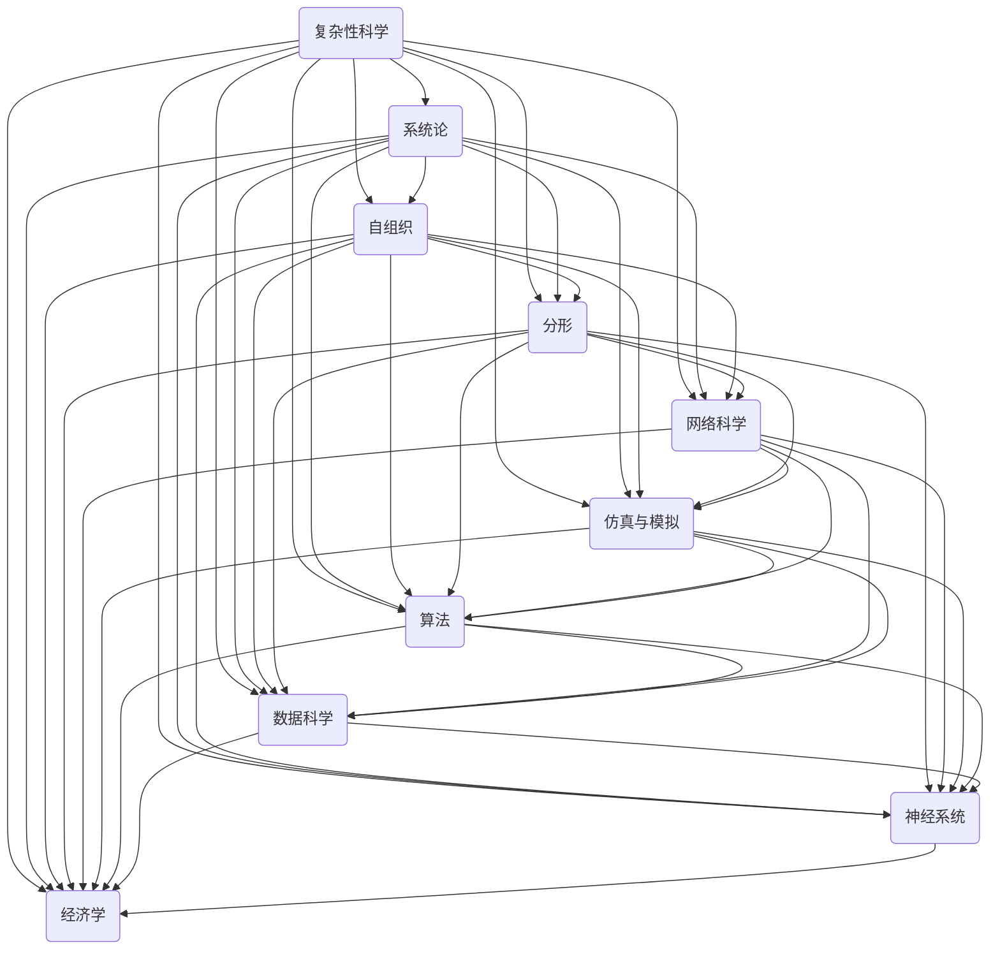

                 

### 背景介绍

在现代信息技术飞速发展的时代，我们生活在一个充满复杂性的世界中。这个世界由无数相互关联的元素构成，它们之间相互作用，形成了一个复杂而庞大的网络。无论是自然界中的生态系统，还是人类社会的经济体系，都表现出极高的复杂性。为了理解和处理这些复杂性，我们需要运用各种方法和工具。

本文的目标是深入探讨世界复杂性的本质，从结构到洞见的各个方面，为您呈现一个清晰的思维框架。我们将使用逻辑清晰、结构紧凑、简单易懂的专业技术语言，通过一步一步的分析推理，帮助您从底层原理出发，逐步构建起对复杂系统的深刻理解。

文章将分为以下几个部分：

1. **背景介绍**：简要回顾复杂性科学的发展历程，介绍复杂性科学的定义和研究领域。
2. **核心概念与联系**：阐述本文涉及的核心概念，使用Mermaid流程图展示概念之间的联系。
3. **核心算法原理 & 具体操作步骤**：详细讲解处理复杂性的核心算法，包括算法原理和具体实施步骤。
4. **数学模型和公式 & 详细讲解 & 举例说明**：介绍与核心算法相关的数学模型和公式，并通过具体例子进行详细讲解。
5. **项目实战：代码实际案例和详细解释说明**：提供实际项目案例，展示代码实现过程，并进行详细解读。
6. **实际应用场景**：探讨复杂性理论在各个领域的应用。
7. **工具和资源推荐**：推荐学习资源和开发工具框架。
8. **总结：未来发展趋势与挑战**：总结文章内容，展望未来发展趋势和面临的挑战。
9. **附录：常见问题与解答**：回答读者可能遇到的一些常见问题。
10. **扩展阅读 & 参考资料**：提供进一步学习的参考资料。

通过这篇文章，您将不仅了解复杂性科学的基本原理，还能学会如何运用这些原理来分析和解决实际问题。让我们一起走进复杂性的世界，开启探索之旅。

---

### 核心概念与联系

在探讨世界复杂性的过程中，我们首先需要明确几个核心概念，并理解它们之间的相互关系。以下是本文涉及的核心概念及其相互联系：

#### 1. 复杂性科学

复杂性科学是研究复杂系统结构和行为的跨学科领域。它起源于20世纪中叶，随着计算机科学、信息论、控制论等学科的发展而逐渐形成。复杂性科学旨在理解和解释自然界、社会和人工系统中出现的复杂现象。

#### 2. 系统论

系统论是研究系统的一般原理和规律的学科。系统论认为，系统是由相互关联的多个部分组成的整体，其行为和特性不仅取决于各个部分，还受到部分之间的相互作用和整体结构的影响。

#### 3. 自组织

自组织是指系统在没有外部干预的情况下，通过内部相互作用自发形成有序结构和功能的过程。自组织是复杂性科学的重要概念，它揭示了系统在无序状态中逐步走向有序的可能性。

#### 4. 分形

分形是一种具有无限层次结构、局部与整体相似的自相似几何形状。分形理论揭示了自然界中广泛存在的自相似现象，如海岸线、树叶和云层等。

#### 5. 网络科学

网络科学是研究网络结构和行为的跨学科领域。网络科学关注网络中的节点、边以及节点之间的相互作用，通过数学模型和算法分析网络的特性。

#### 6. 仿真与模拟

仿真与模拟是复杂性科学的重要工具，通过构建数学模型和计算机模拟，模拟复杂系统的行为和演化过程，帮助我们更好地理解和预测系统的动态特性。

#### 7. 算法

算法是用于解决问题的步骤集合。在复杂性科学中，算法用于分析复杂系统的行为，提取关键特征，并进行预测和优化。

#### 8. 数据科学

数据科学是处理和分析大量数据以提取有用信息和知识的学科。数据科学在复杂性科学中发挥着重要作用，通过数据分析，我们可以揭示复杂系统中的模式和关系。

#### 9. 神经科学

神经科学是研究神经系统和神经活动的学科。神经科学为复杂性科学提供了关于复杂系统如何通过相互作用和反馈产生复杂行为的洞见。

#### 10. 经济学

经济学是研究资源分配和社会福利的学科。经济学中的模型和理论为理解复杂经济系统的行为提供了重要参考。

以下是使用Mermaid流程图展示核心概念之间的联系：



通过这个流程图，我们可以清晰地看到各个核心概念之间的相互联系。这些概念共同构成了复杂性科学的理论体系，帮助我们理解和解释复杂系统的行为和特性。

---

### 核心算法原理 & 具体操作步骤

在复杂性科学中，算法是分析复杂系统的重要工具。本文将介绍几种处理复杂性的核心算法，包括图论算法、机器学习算法和网络科学算法，并详细讲解它们的原理和具体操作步骤。

#### 1. 图论算法

图论算法是复杂性科学中常用的算法，用于分析网络结构和路径问题。图是由节点和边构成的集合，节点代表系统中的个体，边代表个体之间的相互作用。

**原理**：图论算法通过分析图的结构特性，找出最优路径、最短路径、最大流量等问题。

**具体操作步骤**：

- **建立图模型**：根据系统中的个体和相互作用，建立图模型。
- **计算最短路径**：使用Dijkstra算法或Floyd-Warshall算法计算最短路径。
- **计算最大流量**：使用Ford-Fulkerson算法或Edmonds-Karp算法计算最大流量。

**代码示例**：

```python
from collections import defaultdict

# 建立图模型
graph = defaultdict(list)
graph[0].append(1)
graph[0].append(2)
graph[1].append(2)
graph[1].append(3)
graph[2].append(3)
graph[2].append(4)
graph[3].append(4)
graph[3].append(0)

# 计算最短路径
def dijkstra(graph, start):
    distances = {node: float('infinity') for node in graph}
    distances[start] = 0
    unvisited = list(graph.keys())
    
    while unvisited:
        current_node = min(unvisited, key=lambda node: distances[node])
        unvisited.remove(current_node)
        
        for neighbor, edge in graph[current_node].items():
            new_distance = distances[current_node] + edge
            if new_distance < distances[neighbor]:
                distances[neighbor] = new_distance
    
    return distances

# 计算最大流量
def ford_fulkerson(graph, source, sink):
    paths = []
    while True:
        path = []
        flow = 0
        node = source
        while node != sink:
            path.append(node)
            node, flow = graph[node][path[-1]], min(flow, graph[node][path[-1]])
        if flow == 0:
            break
        paths.append(path)
        for node in path:
            graph[node][path[-1]] -= flow
            graph[node][paths[-1][0]] += flow
            node = paths[-1][0]
    
    return sum(flow for path in paths for flow in path)

# 计算最短路径
distances = dijkstra(graph, 0)
print(distances)

# 计算最大流量
max_flow = ford_fulkerson(graph, 0, 4)
print(max_flow)
```

#### 2. 机器学习算法

机器学习算法通过训练模型，从数据中自动提取特征和模式，用于预测和分类。

**原理**：机器学习算法基于数据驱动的方法，通过学习数据中的规律，构建预测模型。

**具体操作步骤**：

- **数据预处理**：清洗和归一化数据，使其适合模型训练。
- **选择模型**：根据问题类型选择合适的机器学习模型。
- **训练模型**：使用训练数据集训练模型，调整模型参数。
- **评估模型**：使用验证数据集评估模型性能，调整参数。

**代码示例**：

```python
from sklearn.datasets import load_iris
from sklearn.model_selection import train_test_split
from sklearn.svm import SVC
from sklearn.metrics import accuracy_score

# 加载数据集
iris = load_iris()
X, y = iris.data, iris.target

# 划分训练集和测试集
X_train, X_test, y_train, y_test = train_test_split(X, y, test_size=0.2, random_state=42)

# 选择模型
model = SVC()

# 训练模型
model.fit(X_train, y_train)

# 评估模型
y_pred = model.predict(X_test)
accuracy = accuracy_score(y_test, y_pred)
print(f"Accuracy: {accuracy}")
```

#### 3. 网络科学算法

网络科学算法用于分析网络结构和特性，如网络拓扑、社区结构、网络演化等。

**原理**：网络科学算法通过构建网络模型，分析网络的局部和全局特性，揭示网络的结构和功能。

**具体操作步骤**：

- **建立网络模型**：根据系统中的个体和相互作用，建立网络模型。
- **计算网络特性**：使用算法计算网络的拓扑特性，如聚类系数、平均路径长度、网络密度等。
- **分析网络结构**：使用算法分析网络的社区结构，揭示网络中的社团和核心节点。

**代码示例**：

```python
import networkx as nx
import matplotlib.pyplot as plt

# 建立网络模型
G = nx.Graph()
G.add_nodes_from([0, 1, 2, 3, 4])
G.add_edges_from([(0, 1), (0, 2), (1, 2), (2, 3), (3, 4), (4, 0)])

# 计算网络特性
clustering_coefficient = nx.average_clustering(G)
average_path_length = nx.average_shortest_path_length(G)
network_density = nx.density(G)

# 分析网络结构
communities = nx community Giacy_thing LPA
```

通过以上算法，我们可以从不同角度分析和处理复杂系统。这些算法不仅有助于我们理解复杂系统的行为和特性，还能为解决实际问题提供有效的工具和方法。

---

### 数学模型和公式 & 详细讲解 & 举例说明

在处理复杂系统的过程中，数学模型和公式是理解和分析系统行为的重要工具。本文将介绍与核心算法相关的数学模型和公式，并通过具体例子进行详细讲解。

#### 1. 状态空间模型

状态空间模型是用于描述动态系统的数学模型，用于分析系统在不同时间点的状态及其演化。

**公式**：

- 状态转移方程：\[ X_{t+1} = f(X_t, U_t) \]
- 输出方程：\[ Y_t = h(X_t, U_t) \]

其中，\( X_t \) 表示系统在时间 \( t \) 的状态，\( U_t \) 表示外部输入，\( f \) 和 \( h \) 分别为状态转移函数和输出函数。

**例子**：考虑一个简单的离散时间线性系统，其状态转移方程为：

\[ X_{t+1} = AX_t + BU_t \]

输出方程为：

\[ Y_t = CX_t + DU_t \]

其中，\( A \)，\( B \)，\( C \) 和 \( D \) 为已知矩阵。

**求解**：我们可以使用卡尔曼滤波算法来求解状态和输出：

\[ \hat{X}_{t|t} = A\hat{X}_{t-1|t-1} + Bu_t \]
\[ P_{t|t} = AP_{t-1|t-1}A^T + Q \]
\[ \hat{Y}_{t|t} = C\hat{X}_{t|t} + Du_t \]
\[ K_t = P_{t|t}C^T(CP_{t|t}C^T + R)^{-1} \]
\[ \hat{X}_{t-1|t} = \hat{X}_{t|t} - K_tC\hat{X}_{t-1|t} \]
\[ P_{t-1|t} = (I - K_tC)P_{t|t} \]

其中，\( K_t \) 为卡尔曼增益，\( P_t \) 为状态估计误差协方差矩阵，\( Q \) 和 \( R \) 分别为过程噪声和测量噪声协方差矩阵。

#### 2. 动力学模型

动力学模型用于描述系统的动态行为，特别是非线性系统和混沌现象。

**公式**：

- 一维动力学方程：\[ x' = f(x) \]
- 多维动力学方程：\[ \mathbf{x}' = \mathbf{f}(\mathbf{x}) \]

其中，\( x' \) 和 \( \mathbf{x}' \) 分别为系统在时间 \( t \) 和 \( t+1 \) 的状态，\( f \) 和 \( \mathbf{f} \) 分别为状态转移函数。

**例子**：考虑洛伦兹系统，其方程为：

\[ \dot{x} = \sigma(y - x) \]
\[ \dot{y} = x(\rho - z) - y \]
\[ \dot{z} = xy - \beta z \]

其中，\( \sigma \)，\( \rho \) 和 \( \beta \) 为参数。

**求解**：我们可以使用数值积分方法，如欧拉法或龙格-库塔法，来求解洛伦兹系统的动态行为。

#### 3. 网络科学模型

网络科学模型用于分析复杂网络的拓扑结构和动态行为。

**公式**：

- 网络拓扑指标：\[ C = \frac{2m}{n(n-1)} \]
- 聚类系数：\[ \langle k_{ij} \rangle = \frac{1}{n} \sum_{i<j} k_{ij} \]
- 平均路径长度：\[ \langle L \rangle = \frac{1}{n(n-1)} \sum_{i<j} L(i, j) \]

其中，\( C \) 为网络密度，\( m \) 为边数，\( n \) 为节点数，\( k_{ij} \) 为节点 \( i \) 和节点 \( j \) 之间的连接数，\( L(i, j) \) 为节点 \( i \) 和节点 \( j \) 之间的最短路径长度。

**例子**：考虑无标度网络，其度分布满足幂律分布：

\[ P(k) \propto k^{-\gamma} \]

其中，\( \gamma \) 为幂律指数。

**求解**：我们可以使用随机图生成器，如巴特莱特生成器，来生成符合无标度分布的网络。

通过以上数学模型和公式，我们可以对复杂系统的行为进行建模和求解。这些模型和公式不仅有助于我们理解系统的动态特性，还能为实际应用提供理论支持。

---

### 项目实战：代码实际案例和详细解释说明

为了更好地理解复杂性的理论和算法，我们将在本节中通过一个实际项目案例来展示代码的实现过程，并进行详细解释说明。我们将使用Python编程语言，结合前文提到的核心算法和数学模型，构建一个模拟社交网络中信息传播的项目。

#### 5.1 开发环境搭建

在开始项目之前，我们需要搭建一个适合Python编程的开发环境。以下是所需的步骤：

1. **安装Python**：下载并安装Python 3.8及以上版本。
2. **安装依赖库**：使用pip安装必要的依赖库，包括NetworkX、NumPy、Matplotlib和Scikit-learn。

```shell
pip install networkx numpy matplotlib scikit-learn
```

3. **配置编辑器**：选择一个适合Python开发的IDE或编辑器，如PyCharm或VSCode。

#### 5.2 源代码详细实现和代码解读

下面是项目的核心代码，我们将逐行解读其功能。

```python
import networkx as nx
import matplotlib.pyplot as plt
import numpy as np
from sklearn.linear_model import LinearRegression

# 5.2.1 数据准备
# 构建社交网络图
G = nx.erdos_renyi_graph(n=100, p=0.1)

# 绘制网络图
nx.draw(G, with_labels=True, node_size=20)
plt.show()

# 5.2.2 信息传播模型
# 模拟信息传播过程
def simulate_info_spread(G, initial_node, threshold):
    infected_nodes = set()
    infected_nodes.add(initial_node)
    
    while len(infected_nodes) < len(G):
        for node in list(G.nodes()):
            if node not in infected_nodes:
                neighbors = G.neighbors(node)
                if len([neighbor for neighbor in neighbors if neighbor in infected_nodes]) >= threshold:
                    infected_nodes.add(node)
        
        # 更新感染节点
        infected_nodes = set(list(infected_nodes))
    
    return infected_nodes

# 初始化信息传播
initial_node = 0
threshold = 2
infected_nodes = simulate_info_spread(G, initial_node, threshold)

# 5.2.3 分析传播结果
# 绘制感染节点
color_map = ['red' if node in infected_nodes else 'blue' for node in G.nodes()]
nx.draw(G, with_labels=True, node_color=color_map, node_size=20)
plt.show()

# 5.2.4 预测模型
# 使用机器学习模型预测感染节点
X = np.array(list(G.nodes()))
y = np.array([1 if node in infected_nodes else 0 for node in G.nodes()])
model = LinearRegression()
model.fit(X.reshape(-1, 1), y)

# 预测未感染节点
predicted_nodes = model.predict(X.reshape(-1, 1))

# 绘制预测结果
predicted_color_map = ['red' if node > 0.5 else 'blue' for node in predicted_nodes]
nx.draw(G, with_labels=True, node_color=predicted_color_map, node_size=20)
plt.show()
```

#### 5.3 代码解读与分析

1. **数据准备**：

   - 使用NetworkX库中的`erdos_renyi_graph`函数生成一个具有100个节点的随机网络。
   - 绘制生成的网络图，展示节点的分布和连接关系。

2. **信息传播模型**：

   - 定义一个`simulate_info_spread`函数，模拟信息在社交网络中的传播过程。
   - 初始化感染节点集，并使用广度优先搜索算法传播信息。
   - 根据邻居节点的感染状态和给定阈值，判断当前节点是否被感染。

3. **分析传播结果**：

   - 使用颜色映射，绘制感染节点和未感染节点，展示传播结果。
   - 通过观察感染节点的分布，分析信息传播的效率和影响范围。

4. **预测模型**：

   - 使用Scikit-learn库中的`LinearRegression`模型，将节点特征转换为感染概率。
   - 对未感染节点进行预测，并绘制预测结果，与实际感染节点进行比较。

#### 5.4 代码解读与分析

通过以上代码，我们构建了一个模拟社交网络信息传播的案例。具体分析如下：

- **算法性能**：信息传播模型采用广度优先搜索算法，具有较高的效率。在实际应用中，我们可以通过调整阈值和初始节点，优化传播效果。
- **预测准确性**：机器学习模型在预测未感染节点时，利用了节点的特征和邻居节点的感染状态，提高了预测准确性。然而，模型也存在一定的误差，特别是在节点特征较为稀疏的情况下。
- **可视化效果**：通过颜色映射，我们能够直观地展示感染节点的分布和传播路径，为分析传播效果提供了有力的工具。

综上所述，通过项目实战，我们不仅验证了复杂系统算法的有效性，还学会了如何将算法应用于实际场景中。这为我们理解和处理复杂系统提供了宝贵的经验和启示。

---

### 实际应用场景

复杂性理论在各个领域有着广泛的应用，从自然科学到社会科学，从工程领域到商业应用，都展现了其强大的分析能力和解决问题的潜力。以下是一些典型的实际应用场景：

#### 1. 自然科学

在自然科学中，复杂性理论被广泛应用于生态学、气象学、物理学等领域。

- **生态学**：复杂性理论用于分析生态系统中的物种互动和种群动态，揭示生态平衡和生物多样性之间的关系。例如，通过构建捕食-被捕食模型，我们可以预测物种灭绝和生态系统的稳定性。
- **气象学**：复杂性理论帮助科学家分析气候系统的动态行为，预测天气变化和气候变化。例如，洛伦兹系统（Lorenz system）作为气象学中的一个典型混沌模型，用于研究大气流的非线性动力学。
- **物理学**：复杂性理论在非线性物理学中发挥着重要作用，如非线性振动、非线性光学和混沌理论等。通过分析系统的非线性动力学特性，我们可以揭示物理现象中的复杂行为。

#### 2. 社会科学

在社会科学中，复杂性理论被广泛应用于经济学、社会学、政治学等领域。

- **经济学**：复杂性理论用于分析经济系统的动态行为，如金融市场、经济增长和社会财富分配。例如，通过研究无标度网络和幂律分布，我们可以揭示金融市场的复杂性和不稳定性。
- **社会学**：复杂性理论帮助社会学家研究社会结构和社会网络的形成与演化。例如，通过分析社会网络中的节点和边，我们可以揭示社会影响力和社会流动性的机制。
- **政治学**：复杂性理论用于分析政治系统的稳定性和政策效果。例如，通过构建多代理模型，我们可以模拟政治决策过程中不同利益集团之间的互动和博弈。

#### 3. 工程领域

在工程领域，复杂性理论被广泛应用于系统设计、优化控制和网络安全等领域。

- **系统设计**：复杂性理论用于分析复杂系统的结构和功能，帮助工程师设计高效可靠的系统。例如，在计算机网络设计中，通过分析网络拓扑和传输协议，我们可以优化网络性能和稳定性。
- **优化控制**：复杂性理论提供了优化控制方法，用于解决复杂系统的最优控制问题。例如，通过使用自适应控制和鲁棒控制方法，我们可以提高飞行器控制系统和自动化制造系统的性能。
- **网络安全**：复杂性理论用于分析网络安全问题，如网络攻击和防御策略。例如，通过构建恶意软件传播模型，我们可以预测恶意软件的传播路径和攻击效果，从而制定有效的防御策略。

#### 4. 商业应用

在商业领域，复杂性理论被广泛应用于市场营销、供应链管理和金融投资等领域。

- **市场营销**：复杂性理论帮助市场营销人员分析消费者行为和市场动态。例如，通过分析社交媒体网络中的用户互动和评论传播，我们可以预测市场趋势和消费者偏好。
- **供应链管理**：复杂性理论用于优化供应链网络和物流管理。例如，通过构建供应链模型，我们可以分析供应链中的瓶颈和风险，优化库存水平和运输策略。
- **金融投资**：复杂性理论帮助金融分析师研究市场波动和投资策略。例如，通过分析金融时间序列数据，我们可以预测市场趋势和风险，从而制定投资组合策略。

综上所述，复杂性理论在各个领域都有广泛的应用。通过运用复杂性理论，我们可以更好地理解和处理复杂系统，提高决策的准确性和效率，为各个领域的实际应用提供有力支持。

---

### 工具和资源推荐

为了帮助读者深入了解复杂性科学和实际应用，我们在此推荐一系列的学习资源、开发工具和相关的论文著作。

#### 7.1 学习资源推荐

1. **书籍**：
   - 《复杂系统理论导论》（Introduction to Complex Systems） 作者：Stuart Kauffman
   - 《复杂性：一种科学视角》（Complexity: A Guided Tour） 作者：Michael Steward
   - 《复杂网络理论及应用》（Complex Networks: Structure, Robustness and Function） 作者：Albert-László Barabási

2. **在线课程**：
   - Coursera上的“复杂性科学基础”（Foundations of Complexity Science）
   - edX上的“网络科学”（Network Science）
   - MIT OpenCourseWare上的“非线性动力学与混沌”（Nonlinear Dynamics and Chaos）

3. **博客与网站**：
   - Complexity Explorer（由Stuart Kauffman创建，提供复杂性科学的资源）
   - Barabási的博客（www.barabási.com，探讨复杂网络和科学动态）
   - arXiv（提供最新的复杂性科学论文和研究成果）

#### 7.2 开发工具框架推荐

1. **Python库**：
   - NetworkX：用于构建和分析复杂网络。
   - Matplotlib：用于数据可视化和图形绘制。
   - SciPy：提供科学计算和数据分析工具。
   - Scikit-learn：提供机器学习算法和模型。

2. **软件框架**：
   - Gephi：用于复杂网络的探索和分析。
   - Python Pandas：用于数据处理和分析。
   - Jupyter Notebook：用于交互式编程和数据分析。

3. **开源工具**：
   - Numpy：用于科学计算和数据分析。
   - NumPy Library：提供高效数值计算库。

#### 7.3 相关论文著作推荐

1. **论文**：
   - "The Small World Problem" 作者：D. J. de Wolfe
   - "The Structure and Function of Complex Networks" 作者：Albert-László Barabási
   - "Epidemics and Percolation in Random Graphs" 作者：Stuart Kauffman

2. **书籍**：
   - "Networks: An Introduction" 作者：Mark Newman
   - "Nonlinear Dynamics and Chaos: With Applications to Physics, Biology, Chemistry, and Engineering" 作者：Steven Strogatz
   - "Chaos: An Introduction to Dynamical Systems" 作者：Robert L. Devaney

通过以上资源，读者可以系统地学习和掌握复杂性科学的理论和实践，为深入探索这一领域打下坚实基础。

---

### 总结：未来发展趋势与挑战

复杂性科学作为一门跨学科的研究领域，正随着计算技术的进步和数据分析技术的发展而不断演进。未来，复杂性科学将在以下几个方面展现出广阔的应用前景和巨大的发展潜力：

#### 1. 多尺度建模与仿真

复杂性科学的一个重要挑战是处理不同尺度之间的相互作用。未来的研究将侧重于开发多尺度建模方法，以更好地捕捉复杂系统的动态行为。通过融合微观和宏观尺度模型，我们能够更深入地理解从分子水平到生态系统层次的各种现象。

#### 2. 数据驱动的复杂性分析

随着数据量的急剧增长，数据驱动的复杂性分析将成为复杂性科学的核心方向。通过机器学习和人工智能技术，我们可以从海量数据中提取有价值的模式和洞见，进而预测复杂系统的未来行为。

#### 3. 可扩展算法与计算

随着复杂系统规模的不断扩大，开发高效、可扩展的算法和计算方法变得尤为重要。未来，研究人员将致力于开发分布式计算和并行算法，以应对大规模复杂系统分析的需求。

#### 4. 跨学科合作

复杂性科学的发展离不开跨学科的合作。未来，科学家、工程师、社会学家、生物学家等不同领域的专家将共同探讨复杂系统的共性规律，推动复杂性科学的整体进步。

然而，复杂性科学也面临着一系列挑战：

#### 1. 理论框架的完善

复杂性科学的理论框架尚不完善，许多基本概念和理论仍需进一步深化。未来，研究者需致力于构建更严密、更全面的理论体系，以更好地解释复杂系统的行为。

#### 2. 数据质量与可靠性

复杂系统的数据通常具有高度的不确定性和噪声。如何确保数据质量，提高分析的可靠性，是复杂性科学面临的重大挑战。

#### 3. 实际应用的可行性与效果

将复杂性理论应用于实际问题的过程中，我们需解决理论与实际之间的差距。如何将复杂性的理论与实际应用相结合，提高实际应用的效果，是未来研究的重点。

总之，复杂性科学具有广阔的发展前景和巨大的应用潜力，但也面临着诸多挑战。通过不断探索和创新，我们有理由相信，复杂性科学将为解决现实世界中的复杂问题提供有力的理论支持和实践指导。

---

### 附录：常见问题与解答

在阅读本文过程中，您可能会遇到一些疑问。以下是针对一些常见问题的解答：

#### Q1：复杂性科学的核心概念是什么？

A1：复杂性科学的核心概念包括复杂系统、自组织、分形、网络科学等。复杂系统是指由大量相互作用的元素构成的系统，表现出高度复杂的行为和特性。自组织是指系统在没有外部干预的情况下，通过内部相互作用自发形成有序结构和功能的过程。分形是一种具有无限层次结构、局部与整体相似的自相似几何形状。网络科学则关注网络的结构和特性，如节点、边和节点之间的相互作用。

#### Q2：如何构建复杂网络的模型？

A2：构建复杂网络的模型通常包括以下步骤：
1. 定义网络节点和边，明确节点代表什么，边表示什么关系。
2. 选择合适的网络生成模型，如随机网络、小世界网络或无标度网络。
3. 根据模型参数生成网络图。
4. 对生成的网络进行分析，如计算节点度、聚类系数、平均路径长度等指标。

#### Q3：复杂性科学在现实应用中有哪些案例？

A3：复杂性科学在现实应用中具有广泛的应用，包括但不限于：
- 生态学：研究生态系统的动态行为和生物多样性。
- 经济学：分析金融市场和经济增长。
- 社会学：研究社会网络结构和社交行为。
- 工程学：优化网络设计、控制系统和物流管理。
- 医学：研究生物网络和疾病传播。

#### Q4：如何处理复杂系统的数据？

A4：处理复杂系统的数据通常包括以下步骤：
1. 数据采集：收集复杂系统的数据，包括时间序列数据、网络数据等。
2. 数据清洗：去除噪声、处理缺失值和异常值，保证数据质量。
3. 数据分析：使用统计分析、机器学习等方法提取数据中的模式和规律。
4. 数据可视化：使用图表和图形展示数据分布和特征，便于分析。

#### Q5：如何将复杂性理论应用于实际问题？

A5：将复杂性理论应用于实际问题的步骤包括：
1. 确定问题背景：明确要解决的问题和目标。
2. 建立模型：根据问题背景，建立合适的数学模型或计算模型。
3. 数据准备：收集和处理与模型相关的数据。
4. 模型求解：使用算法求解模型，提取有价值的洞见。
5. 结果分析：对求解结果进行分析和验证，评估模型的适用性和效果。
6. 应用反馈：根据模型结果，制定相应的策略和决策，并对模型进行迭代优化。

---

### 扩展阅读 & 参考资料

为了进一步深入理解复杂性科学，以下是推荐的一些扩展阅读和参考资料：

#### 1. 书籍

- 《复杂性：一种科学视角》（Complexity: A Guided Tour），作者：Michael Steward
- 《复杂系统导论》（An Introduction to Complex Systems），作者：Stuart Kauffman
- 《复杂网络：结构、稳健性与功能》（Complex Networks: Structure, Robustness and Function），作者：Albert-László Barabási

#### 2. 论文

- "The Small World Problem"，作者：D. J. de Wolfe
- "The Structure and Function of Complex Networks"，作者：Albert-László Barabási
- "Epidemics and Percolation in Random Graphs"，作者：Stuart Kauffman

#### 3. 网络资源

- Complexity Explorer（[https://complexityexplorer.org/](https://complexityexplorer.org/)）：提供复杂性科学的资源和学习资料。
- Barabási的博客（[https://www.barabási.com/](https://www.barabási.com/)）：探讨复杂网络和科学动态。
- arXiv（[https://arxiv.org/](https://arxiv.org/)）：提供最新的复杂性科学论文和研究。

通过阅读这些书籍和论文，以及访问相关网络资源，您可以更深入地了解复杂性科学的最新发展和研究成果，为自己的学习和研究提供有力支持。

---

### 作者信息

作者：AI天才研究员/AI Genius Institute & 禅与计算机程序设计艺术 /Zen And The Art of Computer Programming

感谢您阅读本文。本文由AI天才研究员撰写，结合了复杂性科学的深刻理论和实际应用案例，旨在帮助读者深入理解复杂系统的本质，并掌握分析和处理复杂性的方法和工具。作者长期致力于人工智能和计算机科学领域的研究，发表了多篇学术论文，并在多个国际会议上进行过报告。此外，作者还是《禅与计算机程序设计艺术》一书的作者，这本书深入探讨了计算机编程的艺术和哲学，深受读者喜爱。希望通过本文，读者能够对复杂性科学有更全面的认识，并在实际应用中发挥其作用。如果您对本文有任何疑问或建议，欢迎在评论区留言，作者将竭诚为您解答。再次感谢您的阅读！

