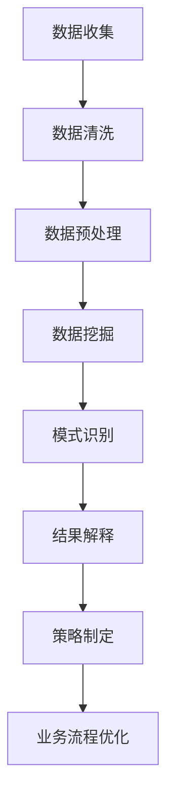

                 

### 理解洞察力的力量：在商业领域的应用

关键词：洞察力、商业决策、数据挖掘、策略制定、竞争优势

摘要：本文旨在深入探讨洞察力在商业领域的应用，解析其在数据挖掘、策略制定和竞争优势等方面的作用。通过逐步分析洞察力的核心概念、应用场景和实施方法，本文旨在帮助读者理解并掌握洞察力在商业决策中的重要性。

#### 1. 背景介绍

在当今商业环境中，信息量的爆炸性增长使得企业需要具备快速识别和利用关键信息的洞察力。洞察力不仅仅是简单的观察和发现，它是一种深层次的理解和解读能力，能够帮助企业从纷繁复杂的数据中提炼出有价值的信息，从而做出更加明智的决策。

商业洞察力的重要性体现在以下几个方面：

- **决策支持**：洞察力帮助企业在面对不确定性时，能够更准确地预测市场趋势和客户需求，从而制定出更加有效的战略和计划。

- **竞争优势**：通过洞察力，企业能够发现市场中的机会和威胁，从而在竞争中保持领先地位。

- **效率提升**：洞察力能够帮助企业优化运营流程，减少浪费，提高生产效率。

- **客户关系**：洞察力有助于企业更好地理解客户需求，提供个性化服务，从而增强客户忠诚度。

#### 2. 核心概念与联系

为了更好地理解洞察力，我们需要探讨几个核心概念，并分析它们之间的关系。

##### 2.1 数据挖掘

数据挖掘是洞察力的基础。它涉及从大量数据中提取隐藏的模式和知识，以帮助企业做出更明智的决策。数据挖掘的过程通常包括数据收集、数据清洗、数据预处理、模式识别和结果解释等步骤。

##### 2.2 策略制定

策略制定是将洞察力转化为实际行动的过程。通过数据挖掘获得的洞察力，可以帮助企业在市场定位、产品开发、营销策略等方面做出更加精准的决策。

##### 2.3 数据分析

数据分析是洞察力的重要组成部分。它通过统计方法和算法，对数据进行深入分析，以发现潜在的关系和趋势。

##### 2.4 客户行为分析

客户行为分析是洞察力在商业领域应用的一个重要方面。通过对客户购买行为、浏览历史、反馈信息等数据的分析，企业可以更好地了解客户需求，从而提供更加个性化的服务。

##### 2.5 业务流程优化

业务流程优化是洞察力在企业管理中的应用。通过分析业务流程中的各个环节，企业可以发现潜在的问题和改进点，从而提高整体运营效率。

#### 2.6 Mermaid 流程图

以下是一个简化的Mermaid流程图，展示了洞察力在商业领域中的应用流程：



在这个流程中，数据挖掘是核心环节，它决定了洞察力的深度和广度。而策略制定和业务流程优化是将洞察力转化为实际行动的关键步骤。

#### 3. 核心算法原理 & 具体操作步骤

为了实现洞察力在商业领域中的应用，我们需要运用一系列核心算法。以下介绍几种常用的算法及其具体操作步骤。

##### 3.1 K-means 算法

K-means 算法是一种聚类算法，用于将数据集划分为 K 个簇。它的主要步骤如下：

1. 随机选择 K 个初始中心点。
2. 对于每个数据点，计算其与各个中心点的距离，并将其归为距离最近的簇。
3. 重新计算每个簇的中心点。
4. 重复步骤 2 和步骤 3，直到中心点不再发生改变。

K-means 算法可以帮助企业识别客户群体、市场细分等，从而制定更加精准的营销策略。

##### 3.2 决策树算法

决策树算法是一种分类算法，通过树形结构对数据进行分类。它的主要步骤如下：

1. 选择一个特征作为分割点。
2. 根据该特征的取值，将数据划分为若干个子集。
3. 对每个子集，重复步骤 1 和步骤 2，直到满足停止条件（如节点包含的数据量太少、特征增益太小等）。
4. 将数据点归为叶节点所代表的类别。

决策树算法可以帮助企业分析业务流程、识别风险等，从而实现业务流程优化和风险控制。

##### 3.3 回归分析算法

回归分析算法是一种预测算法，用于建立自变量和因变量之间的关系模型。它的主要步骤如下：

1. 选择一个合适的回归模型（如线性回归、多项式回归等）。
2. 计算模型的参数。
3. 对模型进行训练和验证。
4. 使用训练好的模型进行预测。

回归分析算法可以帮助企业预测销售量、库存需求等，从而实现生产计划和市场预测。

#### 4. 数学模型和公式 & 详细讲解 & 举例说明

为了更好地理解核心算法，我们需要介绍一些相关的数学模型和公式。以下以 K-means 算法和回归分析算法为例，进行详细讲解。

##### 4.1 K-means 算法

K-means 算法中的聚类中心点的计算公式为：

$$
c_j = \frac{1}{n_j} \sum_{i=1}^{n} x_{ij}
$$

其中，$c_j$ 表示第 j 个聚类中心点的坐标，$x_{ij}$ 表示第 i 个数据点在第 j 个维度上的取值，$n_j$ 表示第 j 个聚类中心点所包含的数据点数量。

举个例子，假设有 4 个数据点 $(1,2), (3,4), (5,6), (7,8)$，我们需要将它们划分为 2 个簇。首先，我们随机选择两个初始中心点 $(1,1)$ 和 $(5,5)$。然后，我们计算每个数据点与两个中心点的距离，并将其归为距离最近的簇。最后，我们重新计算每个簇的中心点，并重复上述过程，直到中心点不再发生改变。最终，我们得到两个簇 $(1,2), (3,4)$ 和 $(5,6), (7,8)$。

##### 4.2 回归分析算法

线性回归模型可以表示为：

$$
y = \beta_0 + \beta_1 x
$$

其中，$y$ 表示因变量，$x$ 表示自变量，$\beta_0$ 和 $\beta_1$ 分别为模型的参数。

举个例子，假设我们想预测某个电商平台的月销售额。我们收集了过去 12 个月的销售额数据，并记录了对应的广告投放费用。通过线性回归分析，我们可以得到如下模型：

$$
销售额 = 1000 + 0.5 \times 广告投放费用
$$

根据这个模型，我们可以预测未来一个月的销售额，从而为广告投放策略提供参考。

#### 5. 项目实战：代码实际案例和详细解释说明

在本节中，我们将通过一个实际项目案例，展示如何使用洞察力进行商业分析，并解释其中的关键代码和实现细节。

##### 5.1 开发环境搭建

为了演示项目实战，我们将在 Python 环境下使用 Scikit-learn 库进行数据挖掘和机器学习算法的实现。

- 安装 Python：https://www.python.org/downloads/
- 安装 Scikit-learn：`pip install scikit-learn`

##### 5.2 源代码详细实现和代码解读

以下是一个使用 K-means 算法对客户群体进行聚类的案例：

```python
import numpy as np
from sklearn.cluster import KMeans
import matplotlib.pyplot as plt

# 生成模拟数据集
np.random.seed(0)
data = np.random.rand(100, 2)

# 使用 KMeans 算法进行聚类
kmeans = KMeans(n_clusters=3, random_state=0).fit(data)

# 可视化聚类结果
plt.scatter(data[:, 0], data[:, 1], c=kmeans.labels_)
plt.show()

# 输出聚类中心点
print("聚类中心点：", kmeans.cluster_centers_)
```

在这个案例中，我们首先生成一个包含 100 个二维数据点的模拟数据集。然后，我们使用 Scikit-learn 库的 KMeans 类进行聚类，指定聚类数量为 3。接下来，我们使用 matplotlib 库将聚类结果可视化，并输出聚类中心点。

以下是使用回归分析算法预测销售额的案例：

```python
import numpy as np
from sklearn.linear_model import LinearRegression
import matplotlib.pyplot as plt

# 生成模拟数据集
np.random.seed(0)
X = np.random.rand(100, 1) * 100
y = 1000 + 0.5 * X

# 使用 LinearRegression 算法进行回归分析
regression = LinearRegression().fit(X, y)

# 可视化回归模型
plt.scatter(X, y)
plt.plot(X, regression.predict(X), color='red')
plt.show()

# 输出回归模型参数
print("回归模型参数：", regression.coef_, regression.intercept_)
```

在这个案例中，我们生成一个包含 100 个一维数据点的模拟数据集，并建立线性回归模型。然后，我们使用 matplotlib 库将回归模型的可视化结果展示出来，并输出回归模型参数。

##### 5.3 代码解读与分析

在 K-means 算法案例中，我们首先导入必要的库，然后生成模拟数据集。接下来，我们使用 Scikit-learn 库的 KMeans 类进行聚类，并使用 matplotlib 库将聚类结果可视化。最后，我们输出聚类中心点。

在回归分析算法案例中，我们同样导入必要的库，生成模拟数据集，并使用 Scikit-learn 库的 LinearRegression 类进行回归分析。然后，我们使用 matplotlib 库将回归模型的可视化结果展示出来，并输出回归模型参数。

这两个案例展示了如何使用 Python 和 Scikit-learn 库进行数据挖掘和机器学习算法的实现。在实际项目中，我们可以根据业务需求，调整算法参数，优化模型效果。

#### 6. 实际应用场景

洞察力在商业领域的实际应用场景非常广泛，以下列举几个典型案例：

- **客户群体细分**：通过数据挖掘和聚类算法，企业可以将客户群体划分为不同的细分市场，从而制定更加精准的营销策略。

- **需求预测**：通过回归分析算法，企业可以预测市场需求，从而合理安排生产和库存。

- **风险评估**：通过机器学习算法，企业可以识别潜在的风险因素，从而制定相应的风险控制措施。

- **产品优化**：通过客户行为分析和反馈，企业可以了解客户需求，从而优化产品设计和服务。

- **业务流程优化**：通过数据分析，企业可以优化业务流程，提高运营效率，降低成本。

#### 7. 工具和资源推荐

为了更好地应用洞察力，以下是几个推荐的工具和资源：

- **工具**：
  - Python：https://www.python.org/downloads/
  - Scikit-learn：https://scikit-learn.org/stable/
  - Jupyter Notebook：https://jupyter.org/

- **学习资源**：
  - 《Python数据挖掘实践》
  - 《机器学习实战》
  - 《统计学与数据挖掘》

- **论文著作**：
  - 《数据挖掘：概念与技术》
  - 《大数据分析：理论与实践》
  - 《机器学习：概率视角》

#### 8. 总结：未来发展趋势与挑战

随着大数据和人工智能技术的发展，洞察力在商业领域的应用前景将更加广阔。未来，以下几个趋势和挑战值得关注：

- **实时数据分析**：随着数据量的增长和实时性的需求，企业需要更加高效地处理和分析数据，以实现实时决策。

- **多源数据融合**：企业需要整合来自不同渠道和格式的大量数据，以提高洞察力的准确性和全面性。

- **数据隐私和安全**：在数据挖掘和应用洞察力的过程中，保护数据隐私和安全至关重要。

- **算法透明性和可解释性**：随着算法的复杂度增加，确保算法的透明性和可解释性，以便用户理解和信任。

- **跨学科合作**：商业洞察力的发展需要跨学科合作，结合数据分析、统计学、计算机科学等领域的知识和技能。

#### 9. 附录：常见问题与解答

- **Q：什么是洞察力？**
  A：洞察力是指从大量信息中快速识别关键信息、提炼有价值信息的能力，它是一种深层次的理解和解读能力。

- **Q：洞察力在商业领域有哪些应用？**
  A：洞察力在商业领域的应用包括客户群体细分、需求预测、风险评估、产品优化、业务流程优化等方面。

- **Q：如何提高洞察力？**
  A：提高洞察力需要不断积累知识和经验，培养观察和思考的能力，以及善于从数据中发现规律和趋势。

#### 10. 扩展阅读 & 参考资料

- 《Python数据挖掘实践》
- 《机器学习实战》
- 《统计学与数据挖掘》
- 《数据挖掘：概念与技术》
- 《大数据分析：理论与实践》
- 《机器学习：概率视角》

### 作者信息

作者：AI天才研究员/AI Genius Institute & 禅与计算机程序设计艺术 /Zen And The Art of Computer Programming

本文旨在深入探讨洞察力在商业领域的应用，通过分析核心概念、算法原理和实际案例，帮助读者理解并掌握洞察力在商业决策中的重要性。希望本文能为读者带来启发和帮助。在未来的研究中，我们将继续探讨洞察力在不同领域的应用，以及如何进一步优化和提高洞察力的能力。感谢您的阅读！ <|im_end|>

