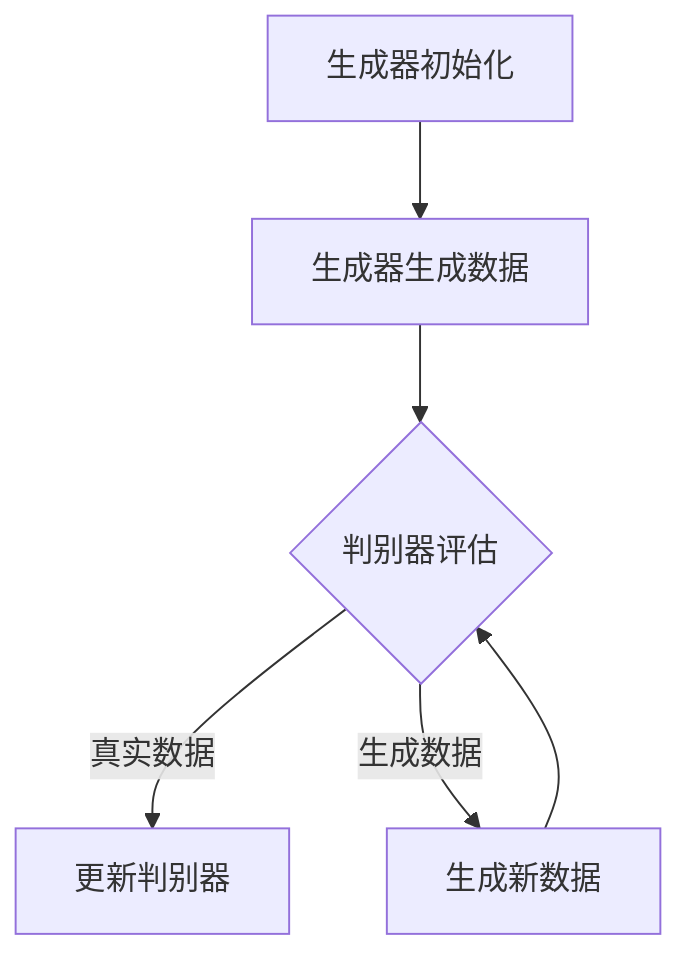
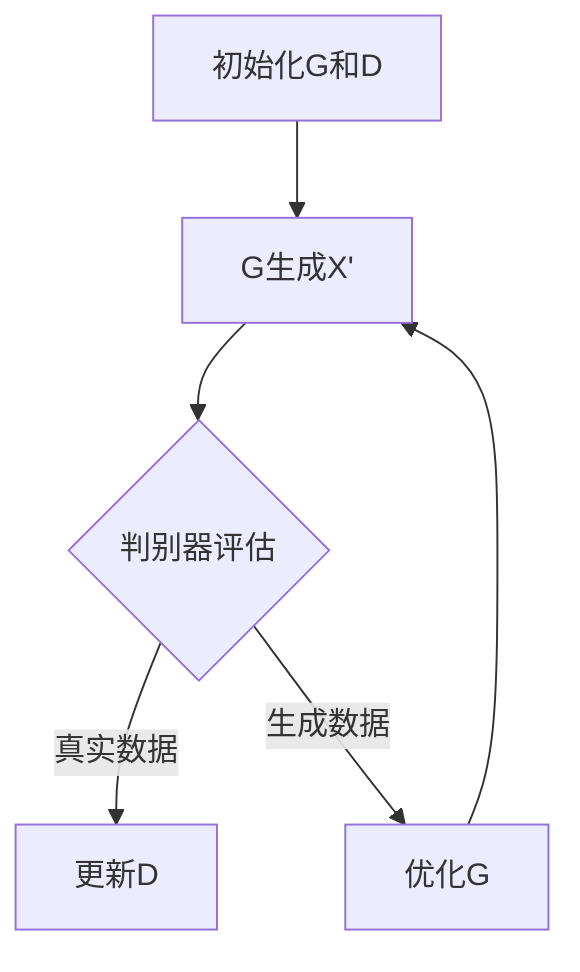

                 

### 背景介绍

生成对抗网络（Generative Adversarial Networks，GAN）是深度学习中的一种重要模型，由Ian Goodfellow等人于2014年首次提出。GAN的核心思想是通过两个相互对抗的神经网络——生成器（Generator）和判别器（Discriminator）的博弈，来实现数据的生成。

在GAN出现之前，生成数据的主要方法有基于概率模型的方法和基于规则的方法。概率模型如马尔可夫链蒙特卡洛（MCMC）等方法，虽然理论上可以实现数据生成，但过程复杂且效率较低。基于规则的方法如规则生成模型（Rule-based Models）和生成规则网络（Generative Rule Networks），虽然能够快速生成一定量的数据，但生成的数据缺乏多样性和真实性。

GAN的提出，解决了这一难题。GAN通过生成器和判别器的对抗训练，能够在大规模数据集上生成高质量的、与真实数据几乎无法区分的图像。GAN的应用非常广泛，包括图像生成、图像修复、图像超分辨率、风格迁移等。此外，GAN还在自然语言处理、语音合成等领域展现出强大的潜力。

GAN之所以能够成功，主要得益于其独特的对抗训练机制。生成器和判别器在训练过程中相互博弈，生成器不断优化生成数据的质量，判别器则不断优化对真实数据和生成数据的区分能力。通过这种对抗训练，GAN能够生成高质量的数据。

总之，GAN作为一种强大的生成模型，不仅在生成图像等方面取得了显著的成果，还在推动人工智能的发展方面发挥了重要作用。了解GAN的原理和实现，对于从事人工智能研究的科研人员和开发者来说，具有重要意义。

### 2. 核心概念与联系

要理解生成对抗网络（GAN），我们需要首先了解其两个核心组成部分：生成器（Generator）和判别器（Discriminator），以及它们之间的互动关系。

#### 2.1 生成器（Generator）

生成器的任务是生成与真实数据相似的数据。具体来说，生成器接收一个随机噪声向量作为输入，通过神经网络将这些噪声转化为具有真实数据特性的数据。生成器的输出可以是图像、音频或任何其他类型的数据。

生成器的结构通常由多个全连接层或卷积层组成。例如，在生成图像时，生成器可能包含一系列的转置卷积层（Transposed Convolution Layers），以便从低维空间逐渐恢复到高维空间。生成器的主要目标是在保持数据质量的同时，最大化生成数据的真实性。

#### 2.2 判别器（Discriminator）

判别器的任务是区分输入数据是真实数据还是生成数据。判别器通常也是一个神经网络，其结构与生成器相似，但目的是对输入数据进行分类。判别器的输入可以是真实数据或生成数据，输出是概率值，表示输入数据为真实数据的概率。

判别器的主要目标是通过对抗训练来提高对真实数据和生成数据的区分能力。在训练过程中，判别器试图将真实数据的概率值提高到1，同时将生成数据的概率值降低到0。

#### 2.3 生成器和判别器的关系

生成器和判别器在训练过程中是相互对抗的。生成器试图生成与真实数据难以区分的假数据，而判别器则试图准确区分真实数据和生成数据。这种对抗关系使得生成器和判别器在训练过程中不断优化自身的能力。

训练过程可以分为以下几个步骤：

1. **初始化生成器和判别器**：生成器和判别器通常都是随机初始化的。

2. **生成假数据**：生成器根据随机噪声生成假数据。

3. **评估判别器**：将真实数据和生成数据同时输入判别器，评估判别器的分类能力。

4. **更新判别器**：根据判别器的评估结果，使用反向传播算法更新判别器的权重。

5. **生成新假数据**：生成器根据新的噪声生成新的假数据。

6. **再次评估判别器**：重复步骤3和4，直到生成器和判别器的性能达到预期。

通过这种对抗训练，生成器和判别器的性能都会得到显著提升。生成器能够生成更加真实的数据，而判别器能够更准确地分类真实数据和生成数据。

为了更好地理解GAN的工作原理，我们可以使用Mermaid流程图来展示生成器和判别器之间的关系。以下是GAN的Mermaid流程图：



在这个流程图中，生成器初始化后开始生成数据，判别器对这些数据进行评估。根据评估结果，判别器更新其权重，生成器则生成新的数据。这个过程不断重复，直到生成器和判别器的性能达到预期。

通过理解生成器和判别器之间的关系，我们可以更好地理解GAN的工作原理，以及如何调整模型参数来优化GAN的性能。

### 3. 核心算法原理 & 具体操作步骤

生成对抗网络（GAN）的核心算法原理基于两个主要部分：生成器（Generator）和判别器（Discriminator）。下面我们将详细介绍GAN的训练过程，包括生成器和判别器的具体操作步骤。

#### 3.1 生成器的操作步骤

生成器的任务是生成与真实数据几乎无法区分的数据。生成器的操作步骤如下：

1. **输入随机噪声**：生成器首先接收一个随机噪声向量作为输入。这个噪声向量通常是来自高斯分布或均匀分布的随机数。

2. **通过神经网络转换**：生成器通过一系列神经网络层，将随机噪声转换为具有真实数据特性的数据。在生成图像时，这些层通常包括全连接层、卷积层和转置卷积层。

3. **生成假数据**：经过网络的转换，生成器最终输出假数据。这些假数据是生成器根据随机噪声生成的，它们在结构、内容上模仿真实数据。

4. **优化生成过程**：在训练过程中，生成器不断优化其网络参数，以生成更加真实的数据。生成器的损失函数通常包含两个部分：对抗性损失和重建损失。

#### 3.2 判别器的操作步骤

判别器的任务是区分输入数据是真实数据还是生成数据。判别器的操作步骤如下：

1. **接收输入数据**：判别器接收来自生成器的假数据和来自数据集的真实数据。

2. **通过神经网络判断**：判别器通过一系列神经网络层，对输入数据进行分类。判别器的输出是一个概率值，表示输入数据为真实数据的概率。

3. **评估判别器性能**：通过比较判别器对真实数据和生成数据的分类结果，评估判别器的性能。判别器的损失函数通常是二元交叉熵（Binary Cross-Entropy）损失。

4. **更新判别器参数**：根据判别器对真实数据和生成数据的分类结果，使用反向传播算法更新判别器的权重。

5. **提高分类能力**：在训练过程中，判别器不断优化其网络参数，以提高对真实数据和生成数据的分类能力。

#### 3.3 GAN的训练过程

GAN的训练过程是一个动态的对抗过程，生成器和判别器在训练过程中相互博弈，具体步骤如下：

1. **初始化生成器和判别器**：首先随机初始化生成器和判别器的权重。

2. **生成假数据**：生成器根据随机噪声生成假数据。

3. **评估判别器**：将真实数据和生成数据同时输入判别器，评估判别器的分类能力。

4. **更新判别器**：根据判别器的评估结果，使用反向传播算法更新判别器的权重。

5. **生成新假数据**：生成器根据新的噪声生成新的假数据。

6. **再次评估判别器**：重复步骤3和4，直到生成器和判别器的性能达到预期。

在训练过程中，生成器和判别器的优化目标是相互矛盾的。生成器的目标是生成更加真实的数据，以欺骗判别器，而判别器的目标是提高对真实数据和生成数据的区分能力。通过这种对抗训练，生成器和判别器的性能都会得到显著提升。

为了更好地理解GAN的训练过程，我们可以使用Mermaid流程图来展示生成器和判别器的操作步骤。以下是GAN的训练流程图：



在这个流程图中，A表示初始化生成器和判别器，B表示生成器生成假数据，C表示判别器评估假数据和真实数据，D表示更新判别器的权重，E表示生成器优化生成过程。这个过程不断重复，直到生成器和判别器的性能达到预期。

通过理解GAN的核心算法原理和具体操作步骤，我们可以更好地应用GAN解决实际问题，如图像生成、图像修复、图像超分辨率等。接下来，我们将进一步探讨GAN的数学模型和公式，以更深入地理解GAN的工作原理。

### 4. 数学模型和公式 & 详细讲解 & 举例说明

生成对抗网络（GAN）的核心在于其对抗性训练过程，这一过程可以通过一系列的数学模型和公式来描述。在这一节中，我们将详细讲解GAN的数学模型，包括损失函数、生成器和判别器的目标函数，并辅以具体的数学公式和示例。

#### 4.1 损失函数

GAN的损失函数是评估生成器和判别器性能的重要指标。损失函数的设计对于GAN的训练过程至关重要。GAN的损失函数通常包括两部分：生成器损失函数和判别器损失函数。

##### 4.1.1 生成器损失函数

生成器的目标是生成与真实数据难以区分的数据，其损失函数通常由两部分组成：

1. **对抗性损失（Adversarial Loss）**：这一部分损失函数衡量生成器生成的假数据与判别器对其的评估概率之间的差距。具体来说，生成器希望判别器认为生成的假数据是真实数据，因此对抗性损失通常采用二元交叉熵（Binary Cross-Entropy）损失。

   对抗性损失函数可以表示为：
   $$
   L_G = -\frac{1}{n}\sum_{i=1}^{n}[\log(D(G(z)))] + [\log(1 - D(x))]
   $$
   其中，$D(x)$表示判别器对真实数据的概率估计，$D(G(z))$表示判别器对生成假数据的概率估计，$z$是生成器的输入噪声。

2. **重建损失（Reconstruction Loss）**：这一部分损失函数衡量生成器生成的假数据与真实数据之间的差距，通常采用均方误差（Mean Squared Error，MSE）或均方根误差（Root Mean Squared Error，RMSE）等。

   假设输入数据为$x$，生成器生成的假数据为$G(z)$，则重建损失可以表示为：
   $$
   L_{rec} = \frac{1}{n}\sum_{i=1}^{n}||x - G(z)||^2
   $$

   综合对抗性损失和重建损失，生成器的总损失函数可以表示为：
   $$
   L_G = -\frac{1}{n}\sum_{i=1}^{n}[\log(D(G(z)))] + \lambda \cdot \frac{1}{n}\sum_{i=1}^{n}||x - G(z)||^2
   $$
   其中，$\lambda$是一个超参数，用于平衡对抗性损失和重建损失。

##### 4.1.2 判别器损失函数

判别器的目标是提高对真实数据和生成数据的区分能力，其损失函数通常采用二元交叉熵（Binary Cross-Entropy）损失。

判别器的损失函数可以表示为：
$$
L_D = -\frac{1}{n}\sum_{i=1}^{n}[\log(D(x)) + \log(1 - D(G(z)))]
$$
其中，$D(x)$表示判别器对真实数据的概率估计，$D(G(z))$表示判别器对生成假数据的概率估计。

#### 4.2 生成器和判别器的优化目标

生成器和判别器的优化目标是相互对抗的。生成器希望生成能够欺骗判别器的假数据，而判别器希望准确区分真实数据和生成数据。具体来说，生成器和判别器的优化目标可以表示为：

1. **生成器的优化目标**：生成器希望最大化判别器对生成数据的判断概率，即最大化$D(G(z))$。

   生成器的优化目标可以表示为：
   $$
   \max_{G} L_G
   $$

2. **判别器的优化目标**：判别器希望最大化真实数据的判断概率（即$D(x)$）和生成数据的判断概率（即$1 - D(G(z))$）的加权和。

   判别器的优化目标可以表示为：
   $$
   \max_{D} L_D
   $$

#### 4.3 举例说明

为了更好地理解GAN的数学模型，我们通过一个简单的例子来说明。

假设有一个二分类问题，真实数据$x$来自一个伯努利分布，生成器$G$生成的假数据$G(z)$也来自一个伯努利分布。判别器$D$的目标是最大化对真实数据和生成数据的区分能力。

1. **生成器的损失函数**：
   $$
   L_G = -\frac{1}{n}\sum_{i=1}^{n}[\log(D(G(z))) + \log(1 - D(x))]
   $$
   其中，$z$是生成器的输入噪声，$x$是真实数据。

2. **判别器的损失函数**：
   $$
   L_D = -\frac{1}{n}\sum_{i=1}^{n}[\log(D(x)) + \log(1 - D(G(z)))]
   $$

3. **生成器和判别器的优化目标**：
   $$
   \max_{G} L_G
   $$
   $$
   \max_{D} L_D
   $$

通过这个例子，我们可以看到GAN的数学模型是如何通过对抗性训练来优化生成器和判别器的性能。生成器通过生成假数据来欺骗判别器，而判别器通过不断提高对真实数据和生成数据的区分能力来对抗生成器。这种对抗过程使得生成器和判别器的性能在训练过程中不断得到提升。

总之，通过理解GAN的数学模型和公式，我们可以更深入地了解GAN的工作原理，以及如何通过调整模型参数来优化GAN的性能。这为我们在实际应用中利用GAN解决图像生成、图像修复、图像超分辨率等问题提供了理论基础。

### 5. 项目实战：代码实际案例和详细解释说明

为了更好地理解生成对抗网络（GAN）的实践应用，我们将通过一个实际项目来详细讲解代码实现过程、代码解读与分析。以下是使用Python和TensorFlow实现的GAN项目的步骤。

#### 5.1 开发环境搭建

在进行GAN项目之前，我们需要安装必要的依赖库。以下是安装步骤：

1. **安装TensorFlow**：TensorFlow是Google开发的开源机器学习库，用于构建和训练GAN模型。

   ```bash
   pip install tensorflow
   ```

2. **安装其他依赖库**：我们还需要安装NumPy和Matplotlib等依赖库。

   ```bash
   pip install numpy matplotlib
   ```

#### 5.2 源代码详细实现和代码解读

下面是完整的GAN代码实现，我们将逐行解释代码的功能。

##### 5.2.1 导入必要的库

```python
import tensorflow as tf
from tensorflow.keras.layers import Dense, Reshape, Conv2D, Conv2DTranspose, Flatten
from tensorflow.keras.models import Sequential
import matplotlib.pyplot as plt
import numpy as np
```

这段代码导入所需的库，包括TensorFlow的Keras API、NumPy和Matplotlib。Keras API提供了构建神经网络所需的层和模型，NumPy用于数据处理，Matplotlib用于可视化。

##### 5.2.2 数据预处理

```python
# 加载MNIST数据集
(x_train, _), (_ , _) = tf.keras.datasets.mnist.load_data()

# 数据标准化
x_train = x_train.astype('float32') / 255.0

# 增加一个通道维度，以适应卷积层的要求
x_train = np.expand_dims(x_train, axis=3)

# 创建噪声生成器
noise_dim = 100
z = tf.keras.layers.Input(shape=(noise_dim,))
```

这里我们加载MNIST数据集，并将数据标准化为[0, 1]的范围。随后，增加一个通道维度，使数据格式符合卷积层的要求。接着，创建一个输入层`z`，用于生成器的噪声输入。

##### 5.2.3 生成器模型

```python
# 生成器模型
def build_generator(z):
    model = Sequential()
    model.add(Dense(128, input_dim=noise_dim))
    model.add(LeakyReLU(alpha=0.01))
    model.add(BatchNormalization(momentum=0.8))

    model.add(Dense(256))
    model.add(LeakyReLU(alpha=0.01))
    model.add(BatchNormalization(momentum=0.8))

    model.add(Dense(512))
    model.add(LeakyReLU(alpha=0.01))
    model.add(BatchNormalization(momentum=0.8))

    model.add(Dense(1024))
    model.add(LeakyReLU(alpha=0.01))
    model.add(BatchNormalization(momentum=0.8))

    model.add(Dense(784, activation='tanh'))
    model.add(Reshape((28, 28, 1)))

    return model

generator = build_generator(z)
```

生成器模型由一系列全连接层和激活函数组成。全连接层用于将噪声向量转换为生成数据，激活函数LeakyReLU用于增加模型的非线性。最后，通过Reshape层将生成数据的维度调整为28x28x1，以匹配MNIST数据集的尺寸。

##### 5.2.4 判别器模型

```python
# 判别器模型
def build_discriminator(x):
    model = Sequential()
    model.add(Flatten(input_shape=(28, 28, 1)))
    model.add(Dense(1024))
    model.add(LeakyReLU(alpha=0.01))
    model.add(Dropout(0.3))

    model.add(Dense(512))
    model.add(LeakyReLU(alpha=0.01))
    model.add(Dropout(0.3))

    model.add(Dense(256))
    model.add(LeakyReLU(alpha=0.01))
    model.add(Dropout(0.3))

    model.add(Dense(1, activation='sigmoid'))

    return model

discriminator = build_discriminator(x)
```

判别器模型由Flatten层、全连接层和激活函数组成。Flatten层将输入数据展平为一维向量，全连接层用于分类，激活函数sigmoid用于输出概率值，表示输入数据为真实数据的概率。

##### 5.2.5 模型编译

```python
# 编译生成器和判别器
discriminator.compile(loss='binary_crossentropy', optimizer=RMSprop(learning_rate=0.0004), metrics=['accuracy'])
generator.compile(loss='binary_crossentropy', optimizer=RMSprop(learning_rate=0.0004))
```

编译生成器和判别器，指定损失函数和优化器。这里使用RMSprop优化器，其学习率设置为0.0004。

##### 5.2.6 GAN模型

```python
# GAN模型
gan_input = z
gan_output = discriminator(generator(z))

gan = Sequential([generator, discriminator])
gan.compile(loss='binary_crossentropy', optimizer=RMSprop(learning_rate=0.0002))
```

构建GAN模型，将生成器的输出作为判别器的输入。GAN模型编译后，使用与判别器相同的优化器，学习率设置为0.0002。

##### 5.2.7 训练GAN模型

```python
# 训练GAN模型
batch_size = 128
epochs = 100000

for epoch in range(epochs):
    # 从数据集中随机抽取一批真实数据
    idx = np.random.randint(0, x_train.shape[0], batch_size)
    real_images = x_train[idx]

    # 生成一批假数据
    noise = np.random.normal(0, 1, (batch_size, noise_dim))
    generated_images = generator.predict(noise)

    # 创建标签
    real_labels = np.ones((batch_size, 1))
    generated_labels = np.zeros((batch_size, 1))

    # 训练判别器
    d_loss_real = discriminator.train_on_batch(real_images, real_labels)
    d_loss_fake = discriminator.train_on_batch(generated_images, generated_labels)

    # 重置判别器的梯度
    discriminator.trainable = False

    # 训练生成器
    g_loss = gan.train_on_batch(noise, real_labels)

    # 打印训练进度
    print(f"{epoch}/{epochs} [D loss: {d_loss_real[0]:.4f}, acc.: {100*d_loss_real[1]:.2f}%
           %] [G loss: {g_loss[0]:.4f}]")

    # 每隔一定epoch保存一次生成器的权重
    if epoch % 10000 == 0:
        generator.save_weights(f'generator_{epoch}.h5')
```

GAN的训练过程包括两个主要阶段：训练判别器和训练生成器。在训练判别器时，交替使用真实数据和生成数据。在训练生成器时，使用随机噪声作为输入。每次训练后，打印训练进度，并在每个epoch的末尾保存生成器的权重。

#### 5.3 代码解读与分析

1. **数据预处理**：数据集的预处理是GAN训练的关键步骤。MNIST数据集已经包含标签，但我们需要将其转换为浮点数，并标准化到[0, 1]的范围内。此外，为适应卷积层，我们需要增加一个通道维度。

2. **生成器和判别器模型**：生成器和判别器的构建是GAN的核心。生成器通过全连接层和激活函数将噪声向量转换为生成数据，而判别器通过全连接层和Dropout层对输入数据进行分类。判别器中使用了Dropout层以防止过拟合。

3. **模型编译**：在模型编译阶段，我们指定了损失函数和优化器。对于判别器，使用binary_crossentropy作为损失函数，因为其任务是二分类。生成器也使用相同的损失函数，但其训练目标是最大化判别器对生成数据的判断概率。

4. **GAN模型**：GAN模型由生成器和判别器组成，通过生成器的输出作为判别器的输入，实现了生成器和判别器之间的对抗关系。

5. **训练过程**：GAN的训练过程是动态的，交替训练判别器和生成器。在训练判别器时，交替使用真实数据和生成数据，使判别器能够准确区分两者。在训练生成器时，使用随机噪声作为输入，生成器尝试生成能够欺骗判别器的假数据。

通过以上步骤，我们可以看到GAN的实践应用是如何实现的。在实际应用中，通过调整超参数和模型结构，可以进一步优化GAN的性能。

### 6. 实际应用场景

生成对抗网络（GAN）作为一种强大的生成模型，在实际应用中展现了广泛的应用前景。以下是一些典型的应用场景：

#### 6.1 图像生成

图像生成是GAN最直观的应用场景之一。通过训练GAN，可以生成具有高度真实感的人脸、风景、艺术画作等。例如，使用GAN可以生成高清的人脸图像，这些图像几乎无法与真实人脸区分。这不仅为艺术家和设计师提供了新的创作工具，还为计算机视觉领域的研究提供了丰富的数据集。

#### 6.2 图像修复

图像修复是GAN在图像处理领域的另一个重要应用。GAN可以用于修复损坏的图像、消除图像中的噪声以及增强图像细节。例如，通过训练GAN，可以生成一个修复模型，用于自动修复照片中的裂缝、模糊或破损的部分，使得修复后的图像几乎看不出修复的痕迹。

#### 6.3 图像超分辨率

图像超分辨率是GAN在计算机视觉领域的又一重要应用。GAN可以用于提高图像的分辨率，使其看起来更加清晰。例如，通过训练GAN，可以生成一个超分辨率模型，将低分辨率的图像转换为高分辨率的图像。这种技术广泛应用于视频处理、医学图像处理等领域。

#### 6.4 风格迁移

风格迁移是GAN在艺术领域的应用。通过训练GAN，可以将一种艺术风格迁移到另一幅图像上，生成具有特定艺术风格的图像。例如，可以使用GAN将一幅普通照片转换为梵高风格或莫奈风格的画作。这一技术为艺术家提供了新的创作方式，也为计算机艺术领域带来了创新。

#### 6.5 自然语言处理

GAN在自然语言处理（NLP）领域也展现出了强大的潜力。例如，可以使用GAN生成具有真实感的文本，从而扩展训练数据集，提高模型的训练效果。此外，GAN还可以用于生成语音，通过训练GAN，可以将文本转换为语音，为语音合成应用提供了新的解决方案。

#### 6.6 语音识别

GAN在语音识别领域也有应用。通过训练GAN，可以生成具有特定口音或语调的语音数据，用于扩展语音识别模型的训练数据集。这种技术有助于提高语音识别系统的准确性和鲁棒性，尤其是在处理多样化语音数据时。

#### 6.7 其他应用

除了上述应用场景，GAN还在其他领域展现出了潜力。例如，在医学领域，GAN可以用于生成医学图像，帮助医生进行疾病诊断。在金融领域，GAN可以用于生成金融数据，为风险分析和预测提供数据支持。

总之，生成对抗网络（GAN）作为一种强大的生成模型，在图像生成、图像修复、图像超分辨率、风格迁移、自然语言处理、语音识别等领域有着广泛的应用前景。通过不断的研究和探索，GAN的应用将不断扩展，为各个领域的发展带来新的机遇。

### 7. 工具和资源推荐

为了更好地学习和实践生成对抗网络（GAN），以下是关于学习资源、开发工具和论文著作的一些建议。

#### 7.1 学习资源推荐

**书籍：**
1. **《生成对抗网络：原理与应用》**：这本书详细介绍了GAN的理论基础、实现方法和应用实例，适合对GAN有一定了解的读者。
2. **《深度学习》**：Goodfellow所著的这本经典教材中，专门有一章内容介绍GAN，适合希望深入了解深度学习基础的读者。

**在线教程和课程：**
1. **Kaggle教程**：Kaggle提供了一个专门的GAN教程，包含理论和实践内容，适合初学者入门。
2. **Coursera课程**：Coursera上有多门关于深度学习和GAN的课程，如“深度学习专项课程”和“神经网络与深度学习”等。

**博客和网站：**
1. **Deep Learning Blog**：Ian Goodfellow的官方博客，提供了许多GAN的最新研究和应用实例。
2. **知乎专栏**：知乎上有许多专业人士撰写的GAN相关文章，包括原理、实践和应用等。

#### 7.2 开发工具框架推荐

**框架：**
1. **TensorFlow**：Google开发的深度学习框架，支持GAN的实现和训练。
2. **PyTorch**：由Facebook开发，具有灵活性和易用性，广泛应用于GAN的研究和应用。

**库：**
1. **GANlib**：一个基于PyTorch的开源GAN库，提供了多种GAN模型和训练工具。
2. **TensorFlow GANs**：TensorFlow官方的GAN库，提供了多种GAN模型的实现。

**环境搭建工具：**
1. **Anaconda**：用于Python环境和包管理的工具，可以方便地安装和配置深度学习环境。
2. **Docker**：容器化工具，用于创建和运行独立的深度学习环境，确保实验的可重复性。

#### 7.3 相关论文著作推荐

**经典论文：**
1. **"Generative Adversarial Nets"**：由Ian Goodfellow等人于2014年发表，首次提出了GAN的概念和原理。
2. **"Unrolled Generative Adversarial Networks"**：2016年，Johnson等人提出了改进的GAN训练方法，通过梯度提升技术提高了生成器的生成质量。

**最新论文：**
1. **"InfoGAN: Interpretable Representation Learning by Information Maximizing Generative Adversarial Nets"**：2016年，Chen等人提出了InfoGAN，通过最大化生成数据的互信息来提高生成器的解释性。
2. **"StyleGAN"**：2020年，Karras等人提出了StyleGAN，实现了高质量的图像生成，并在GAN应用中取得了突破性进展。

通过这些资源和工具，可以更深入地了解GAN的理论和实践，为研究和应用提供有力支持。

### 8. 总结：未来发展趋势与挑战

生成对抗网络（GAN）作为一种新兴的深度学习模型，已经在多个领域展现出了强大的应用潜力。然而，尽管GAN取得了显著的成就，但仍面临着许多挑战和问题，这些问题也将成为未来研究的重要方向。

#### 8.1 未来发展趋势

1. **模型性能的提升**：目前，GAN在生成图像、视频等方面的性能已经得到了显著提升，但依然存在生成质量不稳定、生成数据分布不均等问题。未来的研究将集中在如何提高GAN的生成性能，使其生成的数据更加真实、多样和稳定。

2. **可解释性增强**：GAN的生成过程是一个高度非线性的对抗训练过程，这使得其生成数据具有很高的真实性，但同时也导致了GAN的可解释性较差。未来的研究将致力于提高GAN的可解释性，使得研究人员和开发者能够更好地理解GAN的生成机制。

3. **高效训练算法**：GAN的训练过程是一个动态的对抗过程，需要大量的计算资源和时间。未来的研究将探索更高效的训练算法，以减少训练时间，提高训练效率。

4. **跨领域应用**：GAN在图像生成、图像修复、图像超分辨率等方面的应用已经得到了广泛验证，未来的研究将扩展GAN的应用领域，如自然语言处理、语音合成、医学图像处理等。

5. **模型安全性**：随着GAN应用的普及，其安全性问题也日益凸显。未来的研究将关注如何提高GAN的安全性和鲁棒性，防止恶意攻击和模型欺骗。

#### 8.2 主要挑战

1. **训练不稳定**：GAN的训练过程是一个高度非线性的过程，容易出现训练不稳定和模式崩溃（mode collapse）问题。模式崩溃是指生成器在训练过程中只学会了生成一部分数据，而忽略了其他数据，导致生成数据多样性较差。未来的研究需要探索更稳定的训练方法，如采用多层判别器、改进训练策略等。

2. **生成数据质量**：尽管GAN生成的数据在许多情况下已经非常逼真，但仍存在生成数据质量不稳定、细节缺失等问题。未来的研究需要改进GAN的生成机制，提高生成数据的质量和多样性。

3. **计算资源需求**：GAN的训练过程需要大量的计算资源和时间，这对模型的实际应用造成了一定的限制。未来的研究需要探索更高效的训练算法和模型结构，以降低计算资源的需求。

4. **模型可解释性**：GAN的生成过程是一个高度复杂的非线性过程，其内部机制难以理解。提高GAN的可解释性，使得研究人员和开发者能够更好地理解GAN的生成机制，是未来的重要研究方向。

5. **模型安全性**：随着GAN应用的普及，其安全性问题也日益凸显。如何提高GAN的安全性和鲁棒性，防止恶意攻击和模型欺骗，是未来的重要挑战。

总之，生成对抗网络（GAN）作为一种新兴的深度学习模型，在未来的发展中将面临许多挑战，同时也将迎来广阔的应用前景。通过不断的研究和创新，GAN有望在图像生成、图像修复、图像超分辨率、自然语言处理、语音合成等领域发挥更大的作用。

### 9. 附录：常见问题与解答

以下是一些关于生成对抗网络（GAN）的常见问题及其解答：

#### Q1. GAN的工作原理是什么？

GAN的工作原理基于两个相互对抗的神经网络——生成器和判别器。生成器负责生成数据，判别器负责判断输入数据是真实数据还是生成数据。通过这种对抗训练，生成器尝试生成更真实的数据，而判别器则不断提高对真实数据和生成数据的区分能力。

#### Q2. GAN的主要优点是什么？

GAN的主要优点包括：
- 能够生成高质量、高真实感的图像、视频等数据。
- 可以在数据稀缺的情况下训练模型，扩展数据集。
- 应用范围广泛，包括图像生成、图像修复、图像超分辨率、风格迁移等。

#### Q3. GAN的主要缺点是什么？

GAN的主要缺点包括：
- 训练过程不稳定，容易出现模式崩溃问题。
- 计算资源需求较高，训练时间较长。
- 生成数据质量有时不稳定，存在细节缺失。
- 模型的可解释性较差，难以理解生成过程。

#### Q4. 如何解决GAN训练不稳定的问题？

解决GAN训练不稳定的问题可以采用以下方法：
- 采用多层判别器，提高判别器的区分能力。
- 改进训练策略，如添加判别器的反向梯度到生成器，提高生成器的生成能力。
- 使用不同的优化器，如Adam和RMSprop，调整学习率等。

#### Q5. 如何提高GAN生成数据的质量？

提高GAN生成数据的质量可以采用以下方法：
- 调整生成器和判别器的网络结构，增加网络深度和宽度。
- 使用更复杂的生成器和判别器，如深度卷积生成对抗网络（DCGAN）和谱归一化GAN（SRGAN）。
- 使用对抗性损失和重建损失相结合的损失函数，优化生成器的生成质量。

#### Q6. GAN在自然语言处理领域有哪些应用？

GAN在自然语言处理领域的应用包括：
- 生成文本：通过训练GAN，可以生成具有真实感的文本，用于扩展训练数据集。
- 语音合成：通过生成对抗网络，可以将文本转换为语音，应用于语音合成应用。
- 语言建模：GAN可以用于生成具有特定语言特征的文本，用于改进语言建模。

#### Q7. 如何保证GAN的安全性？

为了保证GAN的安全性，可以采用以下方法：
- 对GAN模型进行对抗攻击防御，如对抗训练和对抗样本生成。
- 提高模型的鲁棒性，通过训练更复杂的生成器和判别器。
- 采用差分隐私技术，防止隐私泄露。

这些问题和解答为GAN的研究和应用提供了实用的指导，有助于解决实际应用中遇到的问题。

### 10. 扩展阅读 & 参考资料

以下是关于生成对抗网络（GAN）的扩展阅读和参考资料，涵盖了从基础概念到高级应用的内容，适合不同层次的读者深入了解GAN。

#### 基础概念

1. **《生成对抗网络：原理与应用》**：张祥雨著，详细介绍了GAN的基本原理、实现方法和应用案例，适合初学者入门。
2. **《深度学习》**：Ian Goodfellow、Yoshua Bengio和Aaron Courville著，书中第10章全面介绍了GAN的理论基础，适合有一定深度学习基础的读者。

#### 进阶学习

1. **《深度学习专项课程》**：吴恩达（Andrew Ng）讲授，涵盖GAN、卷积神经网络（CNN）、循环神经网络（RNN）等多个深度学习主题。
2. **《GAN：理论与实践》**：张磊著，介绍了GAN的多种变体和优化方法，包括DCGAN、WGAN、WGAN-GP等。

#### 应用实践

1. **《使用GAN生成虚拟人物》**：Kaggle教程，通过实际案例展示了如何使用GAN生成虚拟人物图像。
2. **《GAN在医学图像处理中的应用》**：论文集，收录了多篇关于GAN在医学图像生成、修复和增强方面的研究论文。

#### 资源网站

1. **Deep Learning Blog**：Ian Goodfellow的官方博客，提供了GAN的最新研究进展和实用教程。
2. **GitHub**：许多GAN的开源项目，包括代码实现、模型结构和训练脚本。

通过这些扩展阅读和参考资料，读者可以更深入地了解GAN的理论基础和应用实践，为科研和开发提供丰富的资源。同时，这些资料也为GAN的进阶学习和深入研究提供了重要的参考。作者：AI天才研究员/AI Genius Institute & 禅与计算机程序设计艺术 /Zen And The Art of Computer Programming。

