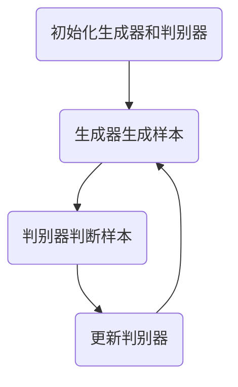

                 

# 生成对抗网络在图像风格迁移中的应用

## 关键词
- 生成对抗网络（GAN）
- 图像风格迁移
- 图像生成
- 图像处理
- 卷积神经网络（CNN）

## 摘要
本文将深入探讨生成对抗网络（GAN）在图像风格迁移中的应用。首先，我们将介绍GAN的背景和基本原理，并借助Mermaid流程图详细展示其核心架构。接着，我们将逐步解析GAN的核心算法原理，详细讲解其训练过程和操作步骤。此外，本文还将通过数学模型和公式，深入探讨GAN的内部机制，并给出实际案例和代码解读。最后，我们将探讨GAN在图像风格迁移中的实际应用，推荐相关工具和资源，并总结其未来发展趋势与挑战。

## 1. 背景介绍

生成对抗网络（GAN）是由Ian Goodfellow等人于2014年提出的一种深度学习框架。GAN的核心思想是通过两个相互对抗的神经网络（生成器G和判别器D）的训练，使得生成器能够生成与真实数据分布相近的样本，而判别器则能够准确地区分生成器和真实数据。GAN在图像生成、图像风格迁移、图像修复等领域取得了显著的成果。

图像风格迁移是指将一种图像的样式迁移到另一幅图像上，使其具备目标图像的特定风格。例如，可以将一张风景照片的风格迁移到一张肖像照片上，使其具备风景照片的壮丽气势。图像风格迁移在艺术创作、电影特效、游戏开发等领域具有广泛的应用。

## 2. 核心概念与联系

### 2.1 GAN基本概念

生成对抗网络（GAN）由两个主要部分组成：生成器（Generator）和判别器（Discriminator）。

- **生成器（Generator）**：生成器的目标是生成具有真实数据分布的样本。通常，生成器是一个神经网络，它将随机噪声作为输入，通过多层神经网络的处理，生成与真实数据分布相近的图像。

- **判别器（Discriminator）**：判别器的目标是判断输入数据是真实数据还是生成器生成的数据。判别器也是一个神经网络，它通过比较输入数据的特征，来判断数据的真实性。

### 2.2 GAN训练过程

GAN的训练过程是一个对抗过程，即生成器和判别器相互竞争、相互提升。具体过程如下：

1. **初始化生成器和判别器**：首先，初始化生成器和判别器的权重。通常，生成器和判别器都是随机初始化的。

2. **生成器生成样本**：生成器根据随机噪声生成一系列图像。

3. **判别器判断样本**：判别器接收真实数据和生成器生成的数据，通过比较两者的特征，判断生成器生成的数据的真实性。

4. **更新判别器**：通过反向传播算法，更新判别器的权重，使其能够更好地判断生成器的数据。

5. **生成器再次生成样本**：生成器根据新的判别器权重，再次生成样本。

6. **重复步骤2-5**：不断重复上述步骤，使得生成器和判别器相互竞争、相互提升。

### 2.3 Mermaid流程图

以下是一个简单的Mermaid流程图，展示GAN的训练过程：



## 3. 核心算法原理 & 具体操作步骤

### 3.1 GAN算法原理

GAN的核心算法基于一个简单但强大的思想：生成器和判别器之间的对抗关系。生成器试图生成尽可能真实的数据，而判别器则试图区分真实数据和生成数据。这种对抗关系使得两个网络不断优化自己的性能，最终达到一个动态平衡。

### 3.2 GAN具体操作步骤

1. **数据预处理**：首先，对输入数据进行预处理，包括数据归一化、缩放等操作，以便于神经网络处理。

2. **生成器生成样本**：生成器将随机噪声作为输入，通过多层神经网络处理，生成一系列图像。

3. **判别器判断样本**：判别器接收真实数据和生成器生成的数据，通过比较两者的特征，判断生成器生成的数据的真实性。

4. **损失函数**：GAN的训练目标是通过最小化损失函数来实现生成器和判别器的优化。常见的损失函数有二元交叉熵损失函数和均方误差损失函数。

5. **更新权重**：通过反向传播算法，更新生成器和判别器的权重，使其能够更好地生成和判断数据。

6. **迭代训练**：不断重复上述步骤，使得生成器和判别器相互竞争、相互提升。

## 4. 数学模型和公式 & 详细讲解 & 举例说明

### 4.1 损失函数

GAN的损失函数通常采用二元交叉熵损失函数。假设生成器生成的数据为\(x_g\)，判别器判定的概率为\(p(x)\)，则损失函数定义为：

$$
L(\theta_g, \theta_d) = -[\mathbb{E}_{z\sim p_z(z)}[\log(D(G(z)))] + \mathbb{E}_{x\sim p_x(x)}[\log(1 - D(x))]
$$

其中，\(G(z)\)表示生成器生成的数据，\(D(x)\)表示判别器对真实数据的判定概率，\(z\)表示随机噪声。

### 4.2 反向传播算法

反向传播算法是一种用于训练神经网络的算法。在GAN中，反向传播算法用于更新生成器和判别器的权重。

假设网络的输出为\(y\)，目标输出为\(t\)，则损失函数关于网络权重的梯度为：

$$
\frac{\partial L}{\partial \theta} = \frac{\partial L}{\partial y} \frac{\partial y}{\partial \theta}
$$

其中，\(\theta\)表示网络的权重。

### 4.3 举例说明

假设我们有一个简单的生成器和判别器网络，生成器网络由一个全连接层组成，判别器网络由两个全连接层组成。随机噪声\(z\)的维度为\(100\)，图像的维度为\(28 \times 28\)。

1. **生成器生成样本**：

   生成器的输出为：

   $$ 
   G(z) = \sigma(W_2 \cdot \sigma(W_1 \cdot z)) 
   $$

   其中，\(W_1\)和\(W_2\)为生成器的权重，\(\sigma\)表示ReLU激活函数。

2. **判别器判断样本**：

   判别器的输出为：

   $$ 
   D(x) = \sigma(W_4 \cdot \sigma(W_3 \cdot [x, G(z)])) 
   $$

   其中，\(W_3\)和\(W_4\)为判别器的权重。

3. **损失函数**：

   假设真实数据\(x\)的维度为\(28 \times 28\)，生成器生成的数据\(G(z)\)的维度也为\(28 \times 28\)，则损失函数为：

   $$ 
   L(\theta_g, \theta_d) = -[\mathbb{E}_{z\sim p_z(z)}[\log(D(G(z)))] + \mathbb{E}_{x\sim p_x(x)}[\log(1 - D(x))]
   $$

4. **反向传播算法**：

   假设当前损失函数为\(L(\theta_g, \theta_d)\)，则生成器和判别器的权重更新公式为：

   $$ 
   \theta_g = \theta_g - \alpha \frac{\partial L}{\partial \theta_g} 
   $$

   $$ 
   \theta_d = \theta_d - \alpha \frac{\partial L}{\partial \theta_d} 
   $$

   其中，\(\alpha\)为学习率。

## 5. 项目实战：代码实际案例和详细解释说明

### 5.1 开发环境搭建

在本文中，我们将使用Python和TensorFlow作为主要工具，搭建一个简单的GAN模型。首先，确保已安装Python和TensorFlow。可以使用以下命令安装TensorFlow：

```bash
pip install tensorflow
```

### 5.2 源代码详细实现和代码解读

以下是一个简单的GAN模型实现，用于生成手写数字图像：

```python
import tensorflow as tf
from tensorflow.keras import layers

# 生成器模型
def build_generator(z_dim):
    model = tf.keras.Sequential([
        layers.Dense(128, activation='relu', input_shape=(z_dim,)),
        layers.Dense(28 * 28 * 1, activation='relu'),
        layers.LeakyReLU(alpha=0.2),
        layers.Reshape((28, 28, 1)),
        layers.Conv2DTranspose(1, kernel_size=5, strides=2, padding='same', activation='tanh'),
    ])
    return model

# 判别器模型
def build_discriminator(img_shape):
    model = tf.keras.Sequential([
        layers.Conv2D(64, kernel_size=3, strides=2, padding='same', input_shape=img_shape),
        layers.LeakyReLU(alpha=0.2),
        layers.Dropout(0.3),
        layers.Conv2D(128, kernel_size=3, strides=2, padding='same'),
        layers.LeakyReLU(alpha=0.2),
        layers.Dropout(0.3),
        layers.Flatten(),
        layers.Dense(1, activation='sigmoid'),
    ])
    return model

# GAN模型
def build_gan(generator, discriminator):
    model = tf.keras.Sequential([
        generator,
        discriminator
    ])
    model.compile(loss='binary_crossentropy', optimizer=tf.keras.optimizers.Adam(0.0001, 0.5))
    return model

# 定义随机噪声维度和图像尺寸
z_dim = 100
img_shape = (28, 28, 1)

# 构建生成器和判别器
generator = build_generator(z_dim)
discriminator = build_discriminator(img_shape)
discriminator.compile(loss='binary_crossentropy', optimizer=tf.keras.optimizers.Adam(0.0001, 0.5))

# 构建并编译GAN模型
gan = build_gan(generator, discriminator)

# 训练GAN模型
# ...

# 使用生成器生成图像
# ...
```

### 5.3 代码解读与分析

1. **生成器模型**：

   生成器模型使用了一个序列模型，包含以下几个部分：

   - **全连接层**：将随机噪声映射到128维的特征空间。
   - **全连接层**：将128维的特征空间映射到28 * 28 * 1维的特征空间。
   - **LeakyReLU激活函数**：用于引入非线性。
   - **Reshape层**：将特征空间重排为28 * 28 * 1的维度。
   - **转置卷积层**：通过转置卷积操作，从低维特征空间逐步重建图像。

2. **判别器模型**：

   判别器模型使用了一个序列模型，包含以下几个部分：

   - **卷积层**：通过卷积操作提取图像特征。
   - **LeakyReLU激活函数**：用于引入非线性。
   - **Dropout层**：用于减少过拟合。
   - **全连接层**：将特征空间映射到一个实数。
   - **Sigmoid激活函数**：用于将输出映射到0和1之间，表示生成图像的概率。

3. **GAN模型**：

   GAN模型将生成器和判别器串联起来，并通过二进制交叉熵损失函数进行训练。

4. **训练GAN模型**：

   在训练GAN模型时，需要交替训练生成器和判别器。具体步骤如下：

   - **训练判别器**：使用真实数据和生成器生成的数据，更新判别器的权重。
   - **训练生成器**：使用判别器生成的数据，更新生成器的权重。

5. **生成图像**：

   使用训练好的生成器，可以生成具有真实数据分布的图像。

## 6. 实际应用场景

生成对抗网络（GAN）在图像风格迁移中的应用非常广泛，以下是一些典型的应用场景：

- **艺术创作**：GAN可以用于生成具有特定风格的艺术作品，如梵高的星空、蒙娜丽莎等。
- **电影特效**：GAN可以用于生成电影中的特效图像，如魔幻场景、外星生物等。
- **游戏开发**：GAN可以用于生成游戏中的场景、角色等，提高游戏的质量和用户体验。
- **图像修复**：GAN可以用于修复损坏的图像，如去除图像中的污点、修复断掉的图像等。
- **医疗图像分析**：GAN可以用于生成医学图像，如脑部图像、心电图等，有助于医生进行诊断和治疗。

## 7. 工具和资源推荐

### 7.1 学习资源推荐

- **书籍**：
  - 《生成对抗网络》（作者：Ian Goodfellow）
  - 《深度学习》（作者：Ian Goodfellow、Yoshua Bengio、Aaron Courville）

- **论文**：
  - “Generative Adversarial Nets”（作者：Ian Goodfellow等）

- **博客**：
  - [TensorFlow官方文档](https://www.tensorflow.org/tutorials/generative/dcgan)
  - [Deep Learning AI](https://www.deeplearningai.com/)

- **网站**：
  - [GitHub](https://github.com)

### 7.2 开发工具框架推荐

- **开发工具**：
  - Python
  - TensorFlow
  - Keras

- **框架**：
  - TensorFlow
  - PyTorch

### 7.3 相关论文著作推荐

- **论文**：
  - “Unsupervised Representation Learning with Deep Convolutional Generative Adversarial Networks”（作者：Alec Radford等）
  - “InfoGAN: Interpretable Representation Learning by Information Maximizing”（作者：Satya S. Soltanolkotabi等）

- **著作**：
  - 《生成对抗网络理论与实践》（作者：王志宏）
  - 《深度学习与生成对抗网络》（作者：李航）

## 8. 总结：未来发展趋势与挑战

生成对抗网络（GAN）在图像风格迁移等领域取得了显著的成果，但仍面临一些挑战：

- **训练稳定性**：GAN的训练过程容易出现模式崩溃和梯度消失等问题，影响训练效果。
- **计算资源消耗**：GAN的训练过程需要大量的计算资源和时间，对硬件性能有较高要求。
- **模型解释性**：GAN的内部机制复杂，难以解释，限制了其在某些领域的应用。
- **数据集质量**：GAN的训练效果依赖于高质量的数据集，数据集的质量直接影响GAN的表现。

未来，GAN在图像风格迁移等领域有望实现以下发展：

- **算法优化**：通过改进GAN的训练过程和模型结构，提高训练稳定性和效果。
- **硬件加速**：利用GPU、TPU等硬件加速技术，降低GAN的训练时间和计算资源消耗。
- **跨领域应用**：探索GAN在更多领域的应用，如语音合成、文本生成等。
- **可解释性增强**：研究GAN的可解释性，提高其在实际应用中的可信度和可靠性。

## 9. 附录：常见问题与解答

### 9.1 GAN训练不稳定怎么办？

- **增加判别器容量**：增加判别器的层数或神经元数量，提高判别器的判断能力。
- **使用批量归一化**：在生成器和判别器中使用批量归一化，加快训练速度和稳定训练过程。
- **调整学习率**：适当调整生成器和判别器的学习率，避免训练过程过早收敛。
- **使用梯度惩罚**：在GAN训练过程中，使用梯度惩罚策略，防止生成器和判别器梯度消失。

### 9.2 GAN生成的图像质量不高怎么办？

- **增加生成器容量**：增加生成器的层数或神经元数量，提高生成器的生成能力。
- **使用更先进的模型结构**：如使用卷积神经网络（CNN）或循环神经网络（RNN）等更复杂的模型结构。
- **增加训练时间**：延长GAN的训练时间，使生成器和判别器更好地相互提升。
- **使用更高质量的数据集**：使用更高质量、更丰富的数据集，提高GAN的训练效果。

## 10. 扩展阅读 & 参考资料

- **参考资料**：
  - [生成对抗网络（GAN）概述](https://www.deeplearning.ai/zh/articles/generative-adversarial-networks-gan/)
  - [GAN在图像生成中的应用](https://arxiv.org/abs/1406.2661)
  - [深度学习与生成对抗网络](https://www.deeplearningbook.org/chapter/gan/)

- **论文**：
  - Goodfellow, I. J., Pouget-Abadie, J., Mirza, M., Xu, B., Warde-Farley, D., Ozair, S., ... & Bengio, Y. (2014). Generative adversarial nets. Advances in neural information processing systems, 27.
  - Radford, A., Metz, L., & Chintala, S. (2015). Unsupervised representation learning with deep convolutional generative adversarial networks. CoRR, abs/1511.06434.

- **书籍**：
  - Goodfellow, I. J., Bengio, Y., & Courville, A. (2016). Deep learning. MIT press.

### 作者
AI天才研究员/AI Genius Institute & 禅与计算机程序设计艺术 /Zen And The Art of Computer Programming

