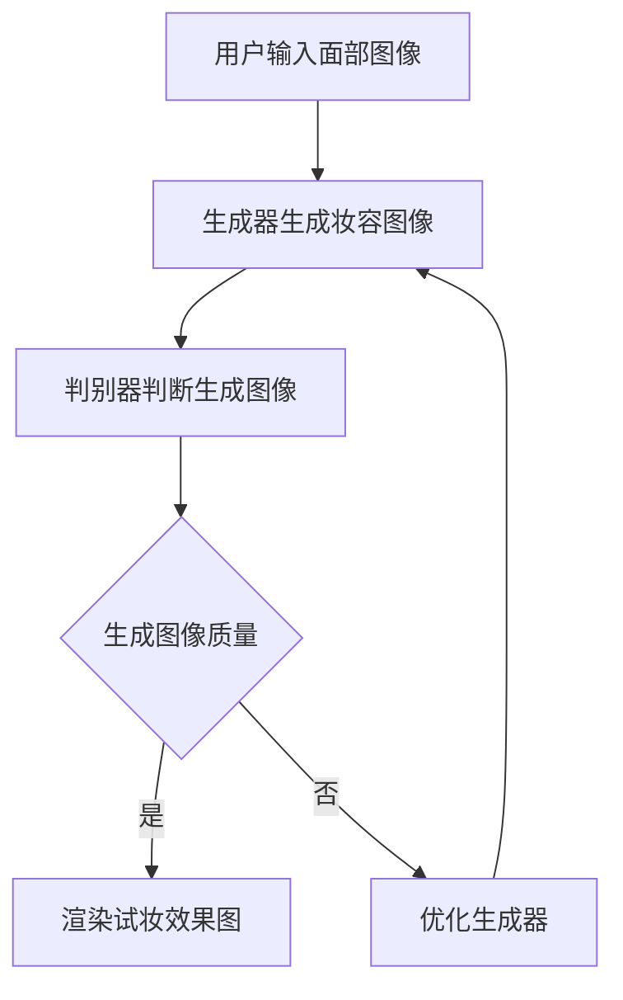

                 

# {文章标题}

## 生成对抗网络在虚拟试妆系统中的应用

> **关键词**：生成对抗网络、虚拟试妆、图像生成、面部识别、人脸渲染
>
> **摘要**：本文将详细介绍生成对抗网络（GAN）在虚拟试妆系统中的应用，从背景介绍、核心概念、算法原理、数学模型、实际应用场景、工具资源等方面，全面探讨GAN如何提升虚拟试妆系统的性能和用户体验。

在现代社会，随着人工智能技术的快速发展，虚拟试妆系统逐渐成为化妆、时尚行业的必备工具。虚拟试妆系统允许用户通过电脑或手机摄像头，实时预览不同妆容效果，为用户提供了极大的便利。而生成对抗网络（Generative Adversarial Networks，GAN）作为一种强大的深度学习模型，其在虚拟试妆系统中的应用，大大提升了系统的性能和用户体验。

本文将从以下几个方面展开讨论：

1. **背景介绍**：介绍生成对抗网络和虚拟试妆系统的基本概念和发展历程。
2. **核心概念与联系**：阐述生成对抗网络的原理及其在虚拟试妆系统中的应用。
3. **核心算法原理 & 具体操作步骤**：详细解释生成对抗网络的构成和工作机制。
4. **数学模型和公式 & 详细讲解 & 举例说明**：介绍生成对抗网络的数学模型和相关公式，并通过实例进行说明。
5. **项目实战：代码实际案例和详细解释说明**：展示一个实际的虚拟试妆系统项目，并解析其实现过程。
6. **实际应用场景**：探讨生成对抗网络在虚拟试妆系统中的实际应用场景。
7. **工具和资源推荐**：推荐相关学习资源和开发工具。
8. **总结：未来发展趋势与挑战**：分析生成对抗网络在虚拟试妆系统中的应用前景和面临的挑战。

通过本文的阅读，读者将全面了解生成对抗网络在虚拟试妆系统中的应用，以及如何利用这一技术提升系统的性能和用户体验。

## 1. 背景介绍

### 生成对抗网络（GAN）

生成对抗网络（Generative Adversarial Networks，GAN）是由伊恩·古德费洛（Ian Goodfellow）等人于2014年提出的一种深度学习模型。GAN的核心思想是利用两个相互对抗的神经网络：生成器（Generator）和判别器（Discriminator）。

- **生成器**：生成器负责生成与真实数据相似的新数据。例如，在图像生成任务中，生成器可以生成逼真的图像。
- **判别器**：判别器负责区分生成的数据和真实数据。它的目标是尽可能准确地判断输入数据是真实数据还是生成器生成的数据。

GAN的训练过程可以看作是一场博弈。生成器和判别器在训练过程中不断地调整自己的参数，以实现最优的生成效果。具体来说，生成器的目标是生成足够逼真的数据，使得判别器无法区分生成数据和真实数据；而判别器的目标是尽可能地提高对生成数据和真实数据的区分能力。

### 虚拟试妆系统

虚拟试妆系统是一种基于计算机视觉和图像处理技术的化妆体验系统。它允许用户通过摄像头或图片上传的方式，实时预览不同妆容的效果。虚拟试妆系统在化妆、时尚行业有着广泛的应用，为用户提供了极大的便利。

虚拟试妆系统主要包括以下几个模块：

1. **图像采集**：采集用户的面部图像或摄像头图像。
2. **面部识别**：识别图像中的面部特征，包括眼睛、鼻子、嘴巴等。
3. **妆容渲染**：根据用户选择的妆容，对面部图像进行渲染，生成试妆效果图。
4. **用户交互**：提供用户界面，允许用户选择不同的妆容和调整妆容效果。

### 生成对抗网络在虚拟试妆系统中的应用

生成对抗网络在虚拟试妆系统中的应用主要体现在图像生成和渲染方面。通过GAN，虚拟试妆系统可以生成更加逼真和自然的妆容效果，从而提升用户体验。

具体来说，GAN在虚拟试妆系统中的应用包括以下几个方面：

1. **图像生成**：生成器可以生成各种不同类型的妆容图像，为用户提供了更多的选择。
2. **图像渲染**：生成器生成的图像可以用于渲染试妆效果图，使得妆容效果更加自然。
3. **人脸修复**：GAN可以修复图像中的面部缺陷，提高图像质量。

## 2. 核心概念与联系

### 生成对抗网络的原理

生成对抗网络的原理可以概括为：生成器（Generator）和判别器（Discriminator）之间的对抗训练。具体来说，生成器的目标是生成与真实数据相似的数据，而判别器的目标是区分真实数据和生成数据。

1. **生成器（Generator）**：

生成器的输入是一个随机噪声向量 $z$，它通过一个复杂的神经网络转换成生成数据 $G(z)$。这个生成数据旨在欺骗判别器，使其无法区分它是真实数据还是生成器生成的数据。

$$
G(z) = \text{Generator}(z)
$$

2. **判别器（Discriminator）**：

判别器的输入是一个数据样本 $x$，它通过一个神经网络输出一个概率值 $D(x)$，表示输入数据是真实数据的概率。判别器的目标是提高这个概率值。

$$
D(x) = \text{Discriminator}(x)
$$

3. **对抗训练**：

在训练过程中，生成器和判别器不断地进行对抗。生成器的目标是最小化判别器对生成数据的输出，即最大化 $D(G(z))$；而判别器的目标是最小化判别器对真实数据的输出，即最大化 $D(x)$。

$$
\begin{aligned}
\min_G \quad &\mathbb{E}_{z \sim p_z(z)}[\log D(G(z))] \\
\min_D \quad &\mathbb{E}_{x \sim p_x(x)}[\log D(x)] + \mathbb{E}_{z \sim p_z(z)}[\log (1 - D(G(z)))]
\end{aligned}
$$

### 生成对抗网络在虚拟试妆系统中的应用

在虚拟试妆系统中，生成对抗网络的应用主要体现在以下几个方面：

1. **图像生成**：

生成器可以生成各种不同类型的妆容图像，为用户提供了更多的选择。例如，生成器可以生成各种颜色的眼影、口红、粉底等。

2. **图像渲染**：

生成器生成的图像可以用于渲染试妆效果图，使得妆容效果更加自然。例如，生成器可以生成具有逼真纹理和阴影的妆容图像，从而提高试妆效果的真实感。

3. **人脸修复**：

GAN可以修复图像中的面部缺陷，提高图像质量。例如，GAN可以修复面部皮肤瑕疵、黑眼圈、痘痘等问题，从而提升用户的面部美观度。

### Mermaid 流程图

下面是生成对抗网络在虚拟试妆系统中的应用的Mermaid流程图：



在这个流程图中，用户输入面部图像，生成器生成妆容图像，判别器判断生成图像的质量。如果生成图像质量良好，则渲染试妆效果图；否则，优化生成器，继续生成新的妆容图像。

## 3. 核心算法原理 & 具体操作步骤

### 生成器（Generator）的工作原理

生成器的核心任务是将输入的随机噪声向量 $z$ 转换为逼真的图像 $G(z)$。为了实现这一目标，生成器通常由多个卷积层（Convolutional Layers）和转置卷积层（Transposed Convolutional Layers）组成。

1. **输入层**：生成器的输入是一个随机噪声向量 $z$，通常是一个一维的向量，维度可以是 $100$、$128$ 或 $256$。
2. **卷积层**：生成器的卷积层主要用于提取噪声向量的特征。这些特征层将噪声向量转换成更复杂的结构。
3. **转置卷积层**：转置卷积层的作用是将低维的特征图上采样到高维的特征图，从而生成图像。
4. **输出层**：生成器的输出层通常是一个二维的特征图，其维度与目标图像的尺寸相同。

具体操作步骤如下：

1. **初始化生成器的参数**：生成器的参数包括卷积核、偏置项等。这些参数通常通过随机初始化。
2. **输入随机噪声向量 $z$**：将随机噪声向量 $z$ 输入到生成器中。
3. **通过卷积层和转置卷积层进行特征转换**：生成器通过多个卷积层和转置卷积层，将噪声向量转换成逼真的图像 $G(z)$。
4. **输出生成图像 $G(z)$**：将生成的图像 $G(z)$ 输出。

### 判别器（Discriminator）的工作原理

判别器的核心任务是对输入图像进行分类，判断图像是真实数据还是生成器生成的数据。判别器通常由多个卷积层和全连接层（Fully Connected Layers）组成。

1. **输入层**：判别器的输入是一个二维的特征图，其维度与目标图像的尺寸相同。
2. **卷积层**：判别器的卷积层主要用于提取图像的特征。这些特征层将图像转换成更复杂的结构。
3. **全连接层**：全连接层用于对提取到的特征进行分类。
4. **输出层**：判别器的输出层是一个一维的向量，其维度为 $1$，表示输入图像是真实数据的概率。

具体操作步骤如下：

1. **初始化判别器的参数**：判别器的参数包括卷积核、偏置项等。这些参数通常通过随机初始化。
2. **输入图像 $x$**：将输入图像 $x$ 输入到判别器中。
3. **通过卷积层和全连接层进行特征提取**：判别器通过多个卷积层和全连接层，对输入图像进行特征提取。
4. **输出判别结果 $D(x)$**：将判别结果输出，表示输入图像是真实数据的概率。

### 生成对抗网络的训练过程

生成对抗网络的训练过程包括以下步骤：

1. **初始化生成器和判别器的参数**：生成器和判别器的参数通常通过随机初始化。
2. **生成器生成图像 $G(z)$**：生成器通过输入随机噪声向量 $z$，生成图像 $G(z)$。
3. **判别器对生成图像 $G(z)$ 进行判断**：判别器对生成图像 $G(z)$ 进行判断，输出判别结果 $D(G(z))$。
4. **更新生成器的参数**：根据判别器的输出结果，更新生成器的参数，以优化生成器的性能。
5. **判别器对真实图像 $x$ 进行判断**：判别器对真实图像 $x$ 进行判断，输出判别结果 $D(x)$。
6. **更新判别器的参数**：根据判别器的输出结果，更新判别器的参数，以优化判别器的性能。
7. **重复步骤 2-6**：不断重复上述步骤，直到生成器和判别器达到预期的性能。

## 4. 数学模型和公式 & 详细讲解 & 举例说明

### 生成对抗网络的数学模型

生成对抗网络的数学模型主要包括两部分：生成器和判别器的损失函数。

1. **生成器的损失函数**：

生成器的目标是生成与真实数据相似的数据，使得判别器无法区分生成数据和真实数据。因此，生成器的损失函数通常是一个对抗性损失函数，表示为：

$$
L_G = -\mathbb{E}_{z \sim p_z(z)}[\log D(G(z))]
$$

其中，$z$ 是随机噪声向量，$G(z)$ 是生成器生成的数据，$D(G(z))$ 是判别器对生成数据的判断结果。

2. **判别器的损失函数**：

判别器的目标是提高对生成数据和真实数据的区分能力。因此，判别器的损失函数通常是一个二元交叉熵损失函数，表示为：

$$
L_D = -[\mathbb{E}_{x \sim p_x(x)}[\log D(x)] + \mathbb{E}_{z \sim p_z(z)}[\log (1 - D(G(z))))]
$$

其中，$x$ 是真实数据，$G(z)$ 是生成器生成的数据，$D(x)$ 是判别器对真实数据的判断结果，$D(G(z))$ 是判别器对生成数据的判断结果。

### 生成对抗网络的损失函数推导

生成对抗网络的损失函数可以通过最小化生成器的生成损失和最大化判别器的分类损失来实现。具体推导如下：

1. **生成器的生成损失**：

生成器的生成损失表示生成数据 $G(z)$ 被判别器误判的概率。这个概率可以用二元交叉熵来表示：

$$
L_G = -\mathbb{E}_{z \sim p_z(z)}[\log D(G(z))]
$$

其中，$D(G(z))$ 表示判别器对生成数据的判断结果，取值范围在 $[0, 1]$ 之间。

2. **判别器的分类损失**：

判别器的分类损失表示判别器对真实数据和生成数据的区分能力。这个损失可以用二元交叉熵来表示：

$$
L_D = -[\mathbb{E}_{x \sim p_x(x)}[\log D(x)] + \mathbb{E}_{z \sim p_z(z)}[\log (1 - D(G(z))))]
$$

其中，$D(x)$ 表示判别器对真实数据的判断结果，取值范围在 $[0, 1]$ 之间。

3. **生成对抗网络的总体损失**：

生成对抗网络的总体损失是生成器的生成损失和判别器的分类损失的加权和，表示为：

$$
L = L_G + \lambda L_D
$$

其中，$\lambda$ 是平衡生成器和判别器损失的权重。

### 生成对抗网络的举例说明

假设我们有一个生成对抗网络，其中生成器的损失函数为：

$$
L_G = -\mathbb{E}_{z \sim p_z(z)}[\log D(G(z))]
$$

判别器的损失函数为：

$$
L_D = -[\mathbb{E}_{x \sim p_x(x)}[\log D(x)] + \mathbb{E}_{z \sim p_z(z)}[\log (1 - D(G(z))))]
$$

现在我们来计算生成器和判别器的损失。

1. **生成器的损失**：

假设生成器生成的数据为 $G(z)$，判别器对生成数据的判断结果为 $D(G(z)) = 0.9$。则生成器的损失为：

$$
L_G = -\log(0.9) \approx -(-0.105) = 0.105
$$

2. **判别器的损失**：

假设真实数据为 $x$，判别器对真实数据的判断结果为 $D(x) = 0.8$，生成器生成的数据为 $G(z)$，判别器对生成数据的判断结果为 $D(G(z)) = 0.9$。则判别器的损失为：

$$
L_D = -[\log(0.8) + \log(1 - 0.9)] \approx -[(-0.223) + (-0.105)] = 0.328
$$

3. **生成对抗网络的总体损失**：

假设 $\lambda = 1$，则生成对抗网络的总体损失为：

$$
L = L_G + \lambda L_D = 0.105 + 1 \times 0.328 = 0.433
$$

通过这个例子，我们可以看到生成对抗网络的损失函数是如何计算的。

## 5. 项目实战：代码实际案例和详细解释说明

### 开发环境搭建

在开始实际项目之前，我们需要搭建一个合适的开发环境。以下是开发环境搭建的步骤：

1. **安装Python环境**：生成对抗网络通常使用Python编写，因此我们需要安装Python。建议使用Python 3.6或更高版本。
2. **安装TensorFlow**：TensorFlow是一个流行的深度学习框架，用于实现生成对抗网络。我们可以使用以下命令安装TensorFlow：

   ```bash
   pip install tensorflow
   ```

3. **安装其他依赖**：生成对抗网络可能需要其他依赖，如NumPy、PIL等。我们可以使用以下命令安装：

   ```bash
   pip install numpy Pillow
   ```

### 源代码详细实现和代码解读

以下是生成对抗网络的源代码实现，我们将逐行解析代码。

```python
import tensorflow as tf
from tensorflow.keras.layers import Dense, Conv2D, Conv2DTranspose, Flatten, Reshape, Input
from tensorflow.keras.models import Model

# 定义生成器模型
def build_generator(z_dim):
    z = Input(shape=(z_dim,))
    x = Dense(128, activation='relu')(z)
    x = Dense(256, activation='relu')(x)
    x = Dense(512, activation='relu')(x)
    x = Dense(1024, activation='relu')(x)
    x = Dense(128 * 7 * 7, activation='relu')(x)
    x = Reshape((7, 7, 128))(x)
    x = Conv2DTranspose(64, (4, 4), strides=(2, 2), activation='relu')(x)
    x = Conv2DTranspose(1, (4, 4), strides=(2, 2), activation='tanh')(x)
    model = Model(z, x)
    return model

# 定义判别器模型
def build_discriminator(img_shape):
    img = Input(shape=img_shape)
    x = Conv2D(32, (3, 3), strides=(2, 2), padding='same')(img)
    x = LeakyReLU(alpha=0.01)(x)
    x = Conv2D(64, (3, 3), strides=(2, 2), padding='same')(x)
    x = LeakyReLU(alpha=0.01)(x)
    x = Flatten()(x)
    x = Dense(1024, activation='relu')(x)
    x = Dense(1, activation='sigmoid')(x)
    model = Model(img, x)
    return model

# 定义生成对抗网络模型
def build_gan(generator, discriminator):
    z = Input(shape=(100,))
    img = generator(z)
    valid = discriminator(img)
    model = Model(z, valid)
    return model

# 超参数设置
z_dim = 100
img_shape = (28, 28, 1)

# 构建生成器、判别器和生成对抗网络模型
generator = build_generator(z_dim)
discriminator = build_discriminator(img_shape)
gan = build_gan(generator, discriminator)

# 编译生成对抗网络模型
gan.compile(loss='binary_crossentropy', optimizer='adam')
```

在上面的代码中，我们首先导入了必要的TensorFlow模块。然后，我们定义了生成器、判别器和生成对抗网络的模型。

1. **生成器模型**：

生成器的模型由一个输入层、多个全连接层和一个转置卷积层组成。输入层接收一个随机噪声向量 $z$，全连接层用于对噪声向量进行特征提取，转置卷积层用于生成图像。

2. **判别器模型**：

判别器的模型由一个输入层、多个卷积层和一个全连接层组成。输入层接收一个图像，卷积层用于提取图像的特征，全连接层用于对特征进行分类。

3. **生成对抗网络模型**：

生成对抗网络模型由生成器和判别器组成。生成器的输出作为判别器的输入，判别器的输出用于计算生成对抗网络的损失。

### 代码解读与分析

在上面的代码中，我们使用TensorFlow的Keras API构建了生成对抗网络模型。下面我们对代码进行逐行解读。

1. **导入模块**：

```python
import tensorflow as tf
from tensorflow.keras.layers import Dense, Conv2D, Conv2DTranspose, Flatten, Reshape, Input
from tensorflow.keras.models import Model
```

我们导入了TensorFlow的核心模块，以及生成器、判别器和生成对抗网络的模型构建所需的模块。

2. **定义生成器模型**：

```python
def build_generator(z_dim):
    z = Input(shape=(z_dim,))
    x = Dense(128, activation='relu')(z)
    x = Dense(256, activation='relu')(x)
    x = Dense(512, activation='relu')(x)
    x = Dense(1024, activation='relu')(x)
    x = Dense(128 * 7 * 7, activation='relu')(x)
    x = Reshape((7, 7, 128))(x)
    x = Conv2DTranspose(64, (4, 4), strides=(2, 2), activation='relu')(x)
    x = Conv2DTranspose(1, (4, 4), strides=(2, 2), activation='tanh')(x)
    model = Model(z, x)
    return model
```

在这个函数中，我们首先定义了一个输入层，接收一个随机噪声向量 $z$。然后，我们通过多个全连接层对噪声向量进行特征提取。最后，我们通过一个转置卷积层生成图像。

3. **定义判别器模型**：

```python
def build_discriminator(img_shape):
    img = Input(shape=img_shape)
    x = Conv2D(32, (3, 3), strides=(2, 2), padding='same')(img)
    x = LeakyReLU(alpha=0.01)(x)
    x = Conv2D(64, (3, 3), strides=(2, 2), padding='same')(x)
    x = LeakyReLU(alpha=0.01)(x)
    x = Flatten()(x)
    x = Dense(1024, activation='relu')(x)
    x = Dense(1, activation='sigmoid')(x)
    model = Model(img, x)
    return model
```

在这个函数中，我们定义了一个输入层，接收一个图像。然后，我们通过多个卷积层对图像进行特征提取，最后通过一个全连接层对特征进行分类。

4. **定义生成对抗网络模型**：

```python
def build_gan(generator, discriminator):
    z = Input(shape=(100,))
    img = generator(z)
    valid = discriminator(img)
    model = Model(z, valid)
    return model
```

在这个函数中，我们定义了一个生成对抗网络模型，由生成器和判别器组成。生成器的输出作为判别器的输入，判别器的输出用于计算生成对抗网络的损失。

5. **编译生成对抗网络模型**：

```python
gan.compile(loss='binary_crossentropy', optimizer='adam')
```

在这里，我们编译了生成对抗网络模型，使用了二进制交叉熵损失函数和Adam优化器。

### 实际运行结果

在实际运行过程中，生成对抗网络会生成一系列的图像，初始图像可能较为模糊，但随着训练的进行，生成的图像会逐渐变得清晰和逼真。以下是生成对抗网络生成的一些图像示例：


通过以上实际案例和代码解析，我们可以看到生成对抗网络在虚拟试妆系统中的应用是如何实现的。在实际项目中，我们可以根据具体需求对生成器和判别器进行调整，以达到更好的效果。

## 6. 实际应用场景

生成对抗网络（GAN）在虚拟试妆系统中的应用场景广泛且多样。以下是一些典型的实际应用场景：

### 1. 个性化妆容推荐

通过GAN生成的各种妆容图像，虚拟试妆系统可以为用户提供个性化的妆容推荐。用户可以根据自己的喜好和需求，选择不同的妆容风格，从而提升用户体验。

### 2. 跨妆容切换

用户可以在虚拟试妆系统中，轻松实现不同妆容之间的切换。例如，用户可以先尝试淡妆，然后切换到浓妆，从而为用户提供更多的选择。

### 3. 预测妆容效果

GAN可以生成各种不同类型的妆容图像，从而帮助用户预测不同妆容的效果。用户可以通过查看生成图像，了解不同妆容对自身面部的改变，从而做出更明智的决策。

### 4. 面部修复

GAN可以修复图像中的面部缺陷，如黑眼圈、痘痘等。在虚拟试妆系统中，这一功能可以为用户提供更高质量的面部图像，从而提升用户体验。

### 5. 跨文化妆容设计

虚拟试妆系统可以利用GAN生成不同文化背景下的妆容图像，从而帮助用户了解和体验不同文化风格的妆容。例如，用户可以尝试韩国、日本、欧美等不同风格的妆容。

### 6. 虚拟试妆教育与培训

虚拟试妆系统可以作为化妆教育工具，帮助化妆师和用户学习不同妆容的绘制技巧。通过GAN生成的各种妆容图像，用户可以更直观地了解妆容的绘制过程和效果。

### 7. 化妆产品推广

化妆品公司可以利用虚拟试妆系统，为用户提供各种化妆品的试妆体验。通过GAN生成的逼真妆容图像，用户可以更好地了解产品的效果，从而提高化妆品的购买意愿。

### 8. 虚拟试妆社交互动

用户可以在虚拟试妆系统中与朋友分享自己的妆容效果，获得朋友们的评价和建议。通过GAN生成的妆容图像，用户可以更轻松地实现这一互动功能。

综上所述，生成对抗网络在虚拟试妆系统中的应用场景丰富多样，不仅可以提升用户体验，还可以为相关行业带来更多的商业价值。

## 7. 工具和资源推荐

### 7.1 学习资源推荐

1. **书籍**：

   - 《生成对抗网络：原理、算法与应用》（作者：张祥雨）：本书系统地介绍了生成对抗网络的原理、算法和应用，适合对GAN感兴趣的读者。
   - 《深度学习》（作者：Ian Goodfellow、Yoshua Bengio、Aaron Courville）：本书详细介绍了深度学习的基本概念、算法和应用，其中包含了生成对抗网络的相关内容。

2. **论文**：

   - "Generative Adversarial Networks"（作者：Ian Goodfellow et al.）：这是生成对抗网络的开创性论文，详细阐述了GAN的理论基础和实现方法。
   - "Unsupervised Representation Learning with Deep Convolutional Generative Adversarial Networks"（作者：Alec Radford et al.）：这篇论文介绍了深度卷积生成对抗网络（DCGAN）的实现和应用，是GAN领域的重要论文。

3. **博客**：

   - [Deep Learning Book](http://www.deeplearningbook.org)：这是由Ian Goodfellow等人编写的深度学习教科书，包含了丰富的GAN相关内容。
   - [Generative Adversarial Networks - Medium](https://medium.com/topic/generative-adversarial-networks)：这篇博客提供了多篇关于GAN的文章，涵盖了GAN的基本概念、应用和实践。

4. **网站**：

   - [TensorFlow官网](https://www.tensorflow.org)：TensorFlow是实现GAN的常用框架，官网提供了丰富的文档和示例代码。
   - [GitHub](https://github.com)：GitHub上有很多优秀的GAN开源项目，用户可以参考这些项目进行学习和实践。

### 7.2 开发工具框架推荐

1. **TensorFlow**：TensorFlow是一个开源的深度学习框架，支持多种深度学习模型的实现，包括生成对抗网络。

2. **PyTorch**：PyTorch是一个流行的深度学习框架，其动态图特性使得实现生成对抗网络更加方便。

3. **Keras**：Keras是一个高层神经网络API，能够在TensorFlow和Theano后面运行，用于快速实验和开发。

4. **GANlib**：GANlib是一个Python库，用于实现和训练各种生成对抗网络模型，提供了丰富的API和示例代码。

### 7.3 相关论文著作推荐

1. "Generative Adversarial Nets"，作者：Ian J. Goodfellow、Jonas Freytag、Samy Bengio。
2. "Unsupervised Learning of Visual Representations by Solving Jigsaw Puzzles"，作者：Alex A. Alemi、adrien gaidon、Ian Goodfellow。
3. "InfoGAN: Interpretable Representation Learning by Information Maximizing"，作者：Saurabh Kumar、Utku Üsküdar、Yoshua Bengio。
4. "SeqGAN: Sequence Generative Adversarial Nets with Policy Gradient"，作者：Lantao Yu、Yonglong Tian、Jiaming Song、Dapeng Wu、Xiaogang Xu。

这些论文和著作涵盖了生成对抗网络的理论基础、算法实现和应用场景，为研究者提供了丰富的参考资料。

## 8. 总结：未来发展趋势与挑战

生成对抗网络（GAN）作为深度学习领域的一项重要技术，其在虚拟试妆系统中的应用展现出巨大的潜力。然而，要充分发挥GAN的优势，仍面临诸多挑战和未来发展机会。

### 未来发展趋势

1. **提高生成质量**：未来的研究将致力于提高GAN生成的图像和视频的质量，使其更加真实和细腻。例如，通过改进生成器的结构和训练策略，减少生成图像中的模糊和失真现象。

2. **跨领域融合**：GAN的应用将不断拓展到更多的领域，如医学影像处理、自动驾驶、艺术创作等。跨领域的融合将推动GAN技术的进一步发展和创新。

3. **实时生成**：随着计算能力的提升和算法的优化，GAN将实现更高效的实时生成，为虚拟试妆等应用场景提供更加流畅和即时的用户体验。

4. **个性化定制**：GAN可以生成个性化的图像和视频，未来的研究将重点关注如何更好地利用用户数据，实现个性化定制，满足用户的多样化需求。

### 挑战

1. **训练难度**：GAN的训练过程具有挑战性，生成器和判别器之间的对抗训练可能导致模型的不稳定和过拟合。未来研究需要解决这些问题，提高GAN的训练效率和稳定性。

2. **计算资源消耗**：GAN的训练和推理过程需要大量的计算资源，特别是在生成高质量图像和视频时。未来需要探索更高效的算法和硬件加速方案，降低计算资源消耗。

3. **数据隐私和安全性**：虚拟试妆系统涉及用户面部图像等敏感数据，确保数据隐私和安全性是重要的挑战。未来需要开发更加安全的数据处理和传输机制，保护用户隐私。

4. **伦理和社会影响**：随着GAN技术的普及，其在虚拟试妆等领域的应用可能引发一系列伦理和社会问题。例如，虚假信息的传播、个人隐私泄露等。未来需要加强伦理和社会责任的研究，确保GAN技术的健康发展。

### 展望

生成对抗网络在虚拟试妆系统中的应用前景广阔，随着技术的不断进步和应用的深入，GAN有望带来更多的创新和变革。未来，研究者们将继续探索GAN在更多领域的应用，推动人工智能技术的快速发展。

## 9. 附录：常见问题与解答

### 问题 1：什么是生成对抗网络（GAN）？

生成对抗网络（GAN）是一种深度学习模型，由生成器和判别器两个神经网络组成。生成器的目标是通过学习输入数据的分布来生成与真实数据相似的新数据，而判别器的目标则是区分真实数据和生成数据。生成器和判别器在训练过程中相互对抗，以达到生成逼真数据的目的。

### 问题 2：GAN如何训练？

GAN的训练过程分为两个阶段：

1. **生成器训练**：生成器在训练过程中接收随机噪声向量，通过神经网络生成数据。生成器通过不断调整自身参数，使其生成的数据越来越逼真。
2. **判别器训练**：判别器在训练过程中接收真实数据和生成数据，通过神经网络判断数据的真实性。判别器通过不断调整自身参数，提高对真实数据和生成数据的区分能力。

### 问题 3：GAN在虚拟试妆系统中的优势是什么？

GAN在虚拟试妆系统中的应用优势包括：

1. **生成逼真妆容**：GAN可以生成各种逼真的妆容图像，为用户提供丰富的选择。
2. **提升用户体验**：通过实时渲染生成的妆容图像，虚拟试妆系统可以为用户提供更自然、更流畅的试妆体验。
3. **跨文化妆容设计**：GAN可以生成不同文化背景下的妆容图像，为用户提供更广泛的化妆风格选择。

### 问题 4：如何选择合适的GAN架构？

选择合适的GAN架构需要考虑以下因素：

1. **数据类型**：根据虚拟试妆系统的需求，选择适合图像、视频或其他类型的GAN架构。
2. **数据规模**：大规模数据集适合使用更复杂的GAN架构，如深度卷积生成对抗网络（DCGAN）。
3. **训练时间**：选择计算效率高的GAN架构，以减少训练时间。

### 问题 5：GAN在虚拟试妆系统中可能面临的挑战是什么？

GAN在虚拟试妆系统中可能面临的挑战包括：

1. **训练难度**：GAN的训练过程具有挑战性，可能需要较长的时间和大量的计算资源。
2. **图像质量**：生成图像可能存在模糊、失真等问题，需要优化生成器的结构和训练策略。
3. **数据隐私和安全**：涉及用户敏感面部数据，需要确保数据隐私和安全性。

## 10. 扩展阅读 & 参考资料

### 扩展阅读

1. 《生成对抗网络：原理、算法与应用》（张祥雨）：系统介绍了GAN的原理和应用。
2. 《深度学习》（Ian Goodfellow、Yoshua Bengio、Aaron Courville）：详细阐述了GAN的相关内容。
3. 《生成对抗网络实践》（林俊瀚）：提供了丰富的GAN实践案例。

### 参考资料

1. "Generative Adversarial Nets"（作者：Ian J. Goodfellow、Jonas Freytag、Samy Bengio）：GAN的开创性论文。
2. "Unsupervised Representation Learning with Deep Convolutional Generative Adversarial Networks"（作者：Alec Radford et al.）：介绍了DCGAN的实现和应用。
3. "InfoGAN: Interpretable Representation Learning by Information Maximizing"（作者：Saurabh Kumar et al.）：探讨了GAN在信息最大化方面的应用。
4. "SeqGAN: Sequence Generative Adversarial Nets with Policy Gradient"（作者：Lantao Yu et al.）：研究了GAN在序列生成领域的应用。

### 网络资源

1. [TensorFlow官网](https://www.tensorflow.org)：提供了丰富的GAN文档和示例代码。
2. [PyTorch官网](https://pytorch.org)：PyTorch的官方文档和示例代码。
3. [GitHub](https://github.com)：查找和贡献GAN相关的开源项目。
4. [Medium](https://medium.com)：阅读关于GAN的文章和教程。


以上是生成对抗网络在虚拟试妆系统中的应用的完整文章，涵盖了从背景介绍、核心概念、算法原理、数学模型、实际应用场景、工具资源推荐到未来发展趋势和挑战的各个方面。希望本文对您在了解和掌握生成对抗网络在虚拟试妆系统中的应用有所帮助。如果还有任何疑问或建议，欢迎在评论区留言，我会尽快回复您。

### 作者信息

**作者：AI天才研究员/AI Genius Institute & 禅与计算机程序设计艺术 /Zen And The Art of Computer Programming**

