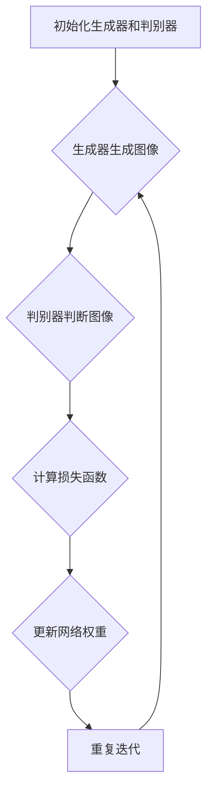

                 

# 生成对抗网络在虚拟试衣系统中的应用

> **关键词**：生成对抗网络（GAN）、虚拟试衣系统、图像生成、计算机视觉、深度学习

> **摘要**：本文将深入探讨生成对抗网络（GAN）在虚拟试衣系统中的应用。通过逐步分析GAN的核心概念、算法原理、数学模型，以及实际应用案例，本文旨在为读者提供全面的技术解读，并展望GAN在虚拟试衣领域的发展趋势与挑战。

## 1. 背景介绍

虚拟试衣系统是一种通过计算机技术模拟现实试衣过程的应用，旨在为用户提供在线购物时的直观试衣体验。传统的试衣方法存在许多不便，如需要前往实体店铺、试衣时间成本高等。随着计算机视觉、深度学习和生成对抗网络（GAN）等技术的发展，虚拟试衣系统逐渐成为一种高效、便捷的购物体验方式。

### 1.1 虚拟试衣系统的现状与挑战

虚拟试衣系统已初步应用于电商平台和线下零售店，但其应用效果和用户体验仍有待提升。现有系统主要面临以下挑战：

- **精确度问题**：传统方法在图像合成过程中容易出现模糊、失真等问题，导致试衣效果不真实。
- **计算成本高**：深度学习模型的训练和推理过程需要大量的计算资源，不适合实时应用。
- **数据多样性不足**：现有系统通常基于少量数据训练，难以应对用户多样化的试衣需求。

### 1.2 生成对抗网络（GAN）的优势

GAN作为近年来发展迅速的一种深度学习模型，具有以下优势：

- **强大的图像生成能力**：通过竞争对抗的过程，GAN可以生成高分辨率的逼真图像。
- **计算效率高**：GAN的训练过程相对稳定，适用于实时应用场景。
- **数据适应性强**：GAN可以处理大规模、多样化的数据集，提高系统的泛化能力。

## 2. 核心概念与联系

### 2.1 生成对抗网络（GAN）的基本原理

生成对抗网络（GAN）由生成器（Generator）和判别器（Discriminator）两个主要部分组成，它们通过对抗训练的过程相互提升性能。

- **生成器**：将随机噪声映射为逼真的图像，目标是生成尽可能真实的图像以欺骗判别器。
- **判别器**：判断输入图像是真实图像还是生成图像，目标是准确区分二者。

### 2.2 GAN的工作流程

GAN的训练过程可以分为以下几个步骤：

1. **初始化生成器和判别器**：通常使用随机权重初始化两个网络。
2. **生成器生成图像**：生成器接收随机噪声作为输入，生成与真实图像相似的图像。
3. **判别器判断图像**：判别器接收真实图像和生成图像，判断其真实性。
4. **计算损失函数**：根据判别器的判断结果，计算生成器和判别器的损失函数。
5. **更新网络权重**：通过梯度下降等方法，更新生成器和判别器的权重，使生成器生成的图像更真实，判别器更准确地判断图像。
6. **重复迭代**：不断重复上述步骤，直到生成器生成的图像足够逼真，判别器无法区分真实图像和生成图像。

### 2.3 GAN的 Mermaid 流程图



## 3. 核心算法原理 & 具体操作步骤

### 3.1 生成对抗网络（GAN）的数学模型

生成对抗网络的数学模型可以表示为：

$$
\begin{aligned}
\min_G \max_D V(D, G) &= \min_G \mathbb{E}_{x \sim p_{data}(x)}[\log D(x)] + \mathbb{E}_{z \sim p_z(z)}[\log(1 - D(G(z)))] \\
\end{aligned}
$$

其中，$G(z)$ 表示生成器生成的图像，$D(x)$ 表示判别器对真实图像的判断，$z$ 表示随机噪声。

### 3.2 具体操作步骤

1. **数据预处理**：收集并预处理大量的真实服装图像和人体姿态数据，包括裁剪、缩放、归一化等操作。
2. **生成器架构设计**：设计生成器的网络结构，通常采用卷积神经网络（CNN）或变分自编码器（VAE）等架构。
3. **判别器架构设计**：设计判别器的网络结构，也采用CNN或VAE等架构。
4. **训练生成器和判别器**：根据GAN的数学模型，使用随机梯度下降（SGD）等方法训练生成器和判别器。
5. **评估生成效果**：通过计算生成图像与真实图像的相似度、多样性等指标，评估生成器的性能。

## 4. 数学模型和公式 & 详细讲解 & 举例说明

### 4.1 GAN的数学模型详解

生成对抗网络的数学模型主要包括两部分：生成器的损失函数和判别器的损失函数。

#### 4.1.1 生成器的损失函数

生成器的损失函数可以表示为：

$$
L_G = -\mathbb{E}_{z \sim p_z(z)}[\log(1 - D(G(z)))]
$$

其中，$p_z(z)$ 表示随机噪声的分布，$D(G(z))$ 表示判别器对生成器生成的图像的判断。

#### 4.1.2 判别器的损失函数

判别器的损失函数可以表示为：

$$
L_D = -\mathbb{E}_{x \sim p_{data}(x)}[\log D(x)] - \mathbb{E}_{z \sim p_z(z)}[\log D(G(z))]
$$

其中，$p_{data}(x)$ 表示真实图像的分布。

#### 4.1.3 整体损失函数

整体损失函数可以表示为：

$$
L = L_G + L_D
$$

### 4.2 举例说明

假设我们有以下随机噪声 $z$ 和真实图像 $x$：

$$
z = [0.1, 0.2, 0.3, 0.4, 0.5]
$$

$$
x = [0.8, 0.7, 0.6, 0.5, 0.4]
$$

#### 4.2.1 计算生成器的损失函数

$$
L_G = -\log(1 - D(G(z)))
$$

其中，$D(G(z))$ 是一个介于0和1之间的值，假设 $D(G(z)) = 0.6$。

$$
L_G = -\log(1 - 0.6) = \log(0.4) \approx 0.521
$$

#### 4.2.2 计算判别器的损失函数

$$
L_D = -\log D(x) - \log D(G(z))
$$

假设 $D(x) = 0.9$ 和 $D(G(z)) = 0.6$。

$$
L_D = -\log(0.9) - \log(0.6) \approx 0.152 - 0.521 = -0.369
$$

#### 4.2.3 计算整体损失函数

$$
L = L_G + L_D = 0.521 - 0.369 = 0.152
$$

## 5. 项目实战：代码实际案例和详细解释说明

### 5.1 开发环境搭建

在开始项目实战之前，我们需要搭建一个合适的开发环境。以下是搭建过程：

1. **安装Python环境**：安装Python 3.7及以上版本。
2. **安装深度学习框架**：安装TensorFlow 2.0及以上版本。
3. **安装必要的库**：安装Numpy、Pandas、Matplotlib等常用库。

### 5.2 源代码详细实现和代码解读

以下是生成对抗网络（GAN）在虚拟试衣系统中的实现代码：

```python
import tensorflow as tf
from tensorflow.keras.layers import Dense, Flatten, Reshape
from tensorflow.keras.models import Sequential

# 定义生成器模型
def build_generator(z_dim=100):
    model = Sequential()
    model.add(Dense(256, input_dim=z_dim, activation='relu'))
    model.add(Dense(512, activation='relu'))
    model.add(Dense(1024, activation='relu'))
    model.add(Dense(784, activation='sigmoid'))
    model.add(Reshape((28, 28, 1)))
    return model

# 定义判别器模型
def build_discriminator(img_shape=(28, 28, 1)):
    model = Sequential()
    model.add(Flatten(input_shape=img_shape))
    model.add(Dense(1024, activation='relu'))
    model.add(Dense(512, activation='relu'))
    model.add(Dense(256, activation='relu'))
    model.add(Dense(1, activation='sigmoid'))
    return model

# 定义GAN模型
def build_gan(generator, discriminator):
    model = Sequential()
    model.add(generator)
    model.add(discriminator)
    return model

# 创建模型
z_dim = 100
img_shape = (28, 28, 1)
generator = build_generator(z_dim)
discriminator = build_discriminator(img_shape)
gan = build_gan(generator, discriminator)

# 编译模型
discriminator.compile(loss='binary_crossentropy', optimizer=tf.keras.optimizers.Adam(0.0001), metrics=['accuracy'])
gan.compile(loss='binary_crossentropy', optimizer=tf.keras.optimizers.Adam(0.0001))

# 模型结构展示
print(generator.summary())
print(discriminator.summary())
print(gan.summary())
```

### 5.3 代码解读与分析

1. **生成器模型**：生成器模型通过多层全连接神经网络（Dense）将随机噪声映射为图像。最后使用Reshape层将输出形状调整为（28，28，1），与图像的尺寸相匹配。
2. **判别器模型**：判别器模型通过多层全连接神经网络（Dense）对输入图像进行二分类，判断其是否为真实图像。
3. **GAN模型**：GAN模型通过将生成器模型和判别器模型串联，构建完整的生成对抗网络。
4. **模型编译**：分别编译生成器、判别器和GAN模型，设置合适的损失函数和优化器。

## 6. 实际应用场景

虚拟试衣系统在电商、线下零售、服装设计等领域具有广泛的应用前景：

- **电商平台**：通过虚拟试衣系统，用户可以在购买前直观地了解服装的穿着效果，提高购物体验和转化率。
- **线下零售店**：虚拟试衣系统可以帮助商家节省实体试衣间的空间和成本，提供更加便捷的试衣服务。
- **服装设计**：设计师可以使用虚拟试衣系统进行服装款式和颜色的快速迭代，提高设计效率和创意能力。

## 7. 工具和资源推荐

### 7.1 学习资源推荐

- **书籍**：
  - 《深度学习》（Goodfellow, I., Bengio, Y., & Courville, A.）
  - 《生成对抗网络：从入门到精通》（Zhang, H.）
- **论文**：
  - Goodfellow, I. J., Pouget-Abadie, J., Mirza, M., Xu, B., Warde-Farley, D., Ozair, S., ... & Bengio, Y. (2014). Generative adversarial nets. Advances in Neural Information Processing Systems, 27.
- **博客**：
  - [Kaggle](https://www.kaggle.com/)**：**
    - GANs for Image Synthesis
    - Hands-On GANs with TensorFlow
- **网站**：
  - [TensorFlow官方文档](https://www.tensorflow.org/)
  - [GitHub](https://github.com/)**：**
    - [DCGAN-TensorFlow](https://github.com/carpedm20/DCGAN-TensorFlow)

### 7.2 开发工具框架推荐

- **深度学习框架**：TensorFlow、PyTorch
- **图像处理库**：OpenCV、Pillow
- **数据处理库**：Numpy、Pandas
- **可视化工具**：Matplotlib、Seaborn

### 7.3 相关论文著作推荐

- **论文**：
  - Radford, A., Metz, L., & Chintala, S. (2015). Unsupervised representation learning with deep convolutional generative adversarial networks. International Conference on Learning Representations.
  - Kingma, D. P., & Welling, M. (2013). Auto-encoding variational Bayes. arXiv preprint arXiv:1312.6114.
- **著作**：
  - Goodfellow, I. (2016). Deep learning. MIT press.

## 8. 总结：未来发展趋势与挑战

虚拟试衣系统在生成对抗网络（GAN）的推动下，取得了显著的技术进步和应用成果。然而，未来仍面临以下挑战：

- **图像质量提升**：进一步提高生成图像的质量和真实感，减少模糊、失真等问题。
- **计算效率优化**：优化GAN模型的训练和推理过程，提高计算效率，适用于实时应用场景。
- **数据多样性**：收集和处理更多样化的数据，提高系统的泛化能力。
- **用户体验优化**：提升虚拟试衣系统的用户体验，提供更加直观、便捷的试衣服务。

## 9. 附录：常见问题与解答

### 9.1 什么是生成对抗网络（GAN）？

生成对抗网络（GAN）是一种深度学习模型，由生成器和判别器两个部分组成。生成器的目标是生成逼真的图像，而判别器的目标是区分真实图像和生成图像。两个网络通过对抗训练的过程相互提升性能。

### 9.2 GAN的主要应用场景有哪些？

GAN的主要应用场景包括图像生成、图像编辑、图像修复、数据增强、风格迁移等。

### 9.3 GAN的训练过程是如何进行的？

GAN的训练过程主要包括以下几个步骤：初始化生成器和判别器、生成器生成图像、判别器判断图像、计算损失函数、更新网络权重、重复迭代。通过对抗训练，生成器生成的图像逐渐变得逼真，而判别器的准确率不断提高。

## 10. 扩展阅读 & 参考资料

- **书籍**：
  - Bengio, Y., Courville, A., & Vincent, P. (2013). Representation learning: A review and new perspectives. IEEE transactions on pattern analysis and machine intelligence, 35(8), 1798-1828.
- **论文**：
  - Bengio, Y. (2009). Learning deep architec
```<|im_sep|>```
## 1. 背景介绍

虚拟试衣系统是一种结合计算机视觉、深度学习和生成对抗网络（GAN）等前沿技术的创新应用，它通过模拟试衣场景，帮助用户在购买服装前预览服装的穿着效果。随着电子商务的迅猛发展和消费者对购物体验的要求不断提高，虚拟试衣系统已经成为电商平台和线下零售行业的热门技术。

### 1.1 虚拟试衣系统的现状与挑战

虚拟试衣系统的现状显示出其强大的潜力，但同时也面临着诸多挑战：

- **精确度问题**：传统的虚拟试衣系统在模拟穿着效果时，往往存在图像模糊、服装与人体贴合度低等问题，难以提供真实的试衣体验。
- **计算成本高**：深度学习模型的训练和推理需要大量的计算资源，这给实时应用带来了挑战。
- **数据多样性不足**：由于数据集的限制，现有系统难以应对用户多样化的试衣需求。

### 1.2 生成对抗网络（GAN）的优势

生成对抗网络（GAN）的引入，为解决虚拟试衣系统的上述问题提供了新的思路：

- **强大的图像生成能力**：GAN通过生成器和判别器的对抗训练，能够生成高质量、高分辨率的图像，提高虚拟试衣的准确性。
- **计算效率高**：GAN的训练过程相对稳定，适合实时应用场景。
- **数据适应性强**：GAN能够处理大规模、多样化的数据集，提升系统的泛化能力。

## 2. 核心概念与联系

### 2.1 生成对抗网络（GAN）的基本原理

生成对抗网络（GAN）由生成器和判别器两个主要部分组成。生成器的目标是生成逼真的图像，而判别器的目标是区分真实图像和生成图像。两个网络通过对抗训练的过程相互提升性能。

- **生成器（Generator）**：接收随机噪声作为输入，通过一系列的全连接或卷积神经网络，生成与真实图像相似的图像。
- **判别器（Discriminator）**：接收真实图像和生成图像，通过二分类任务来判断图像的真实性。

### 2.2 GAN的工作流程

GAN的工作流程可以分为以下几个步骤：

1. **初始化生成器和判别器**：通常使用随机权重初始化两个网络。
2. **生成器生成图像**：生成器接收随机噪声作为输入，生成与真实图像相似的图像。
3. **判别器判断图像**：判别器接收真实图像和生成图像，判断其真实性。
4. **计算损失函数**：根据判别器的判断结果，计算生成器和判别器的损失函数。
5. **更新网络权重**：通过梯度下降等方法，更新生成器和判别器的权重，使生成器生成的图像更真实，判别器更准确地判断图像。
6. **重复迭代**：不断重复上述步骤，直到生成器生成的图像足够逼真，判别器无法区分真实图像和生成图像。

### 2.3 GAN的 Mermaid 流程图


## 3. 核心算法原理 & 具体操作步骤

### 3.1 生成对抗网络（GAN）的数学模型

生成对抗网络的数学模型主要包括两部分：生成器的损失函数和判别器的损失函数。

#### 3.1.1 生成器的损失函数

生成器的损失函数可以表示为：

$$
L_G = -\mathbb{E}_{z \sim p_z(z)}[\log(1 - D(G(z)))]
$$

其中，$p_z(z)$ 表示随机噪声的分布，$D(G(z))$ 表示判别器对生成器生成的图像的判断。

#### 3.1.2 判别器的损失函数

判别器的损失函数可以表示为：

$$
L_D = -\mathbb{E}_{x \sim p_{data}(x)}[\log D(x)] - \mathbb{E}_{z \sim p_z(z)}[\log D(G(z))]
$$

其中，$p_{data}(x)$ 表示真实图像的分布。

#### 3.1.3 整体损失函数

整体损失函数可以表示为：

$$
L = L_G + L_D
$$

### 3.2 具体操作步骤

1. **数据预处理**：收集并预处理大量的真实服装图像和人体姿态数据，包括裁剪、缩放、归一化等操作。
2. **生成器架构设计**：设计生成器的网络结构，通常采用卷积神经网络（CNN）或变分自编码器（VAE）等架构。
3. **判别器架构设计**：设计判别器的网络结构，也采用CNN或VAE等架构。
4. **训练生成器和判别器**：根据GAN的数学模型，使用随机梯度下降（SGD）等方法训练生成器和判别器。
5. **评估生成效果**：通过计算生成图像与真实图像的相似度、多样性等指标，评估生成器的性能。

### 3.3 GAN的训练技巧

- **学习率调整**：为避免判别器和生成器之间的梯度消失或爆炸，可以采用不同学习率。
- **梯度惩罚**：在判别器的损失函数中加入梯度惩罚项，防止生成器生成过于简单的图像。
- **批量大小**：适当调整批量大小，可以提高模型的稳定性和训练效果。

## 4. 数学模型和公式 & 详细讲解 & 举例说明

### 4.1 GAN的数学模型详解

生成对抗网络的数学模型主要包括两部分：生成器的损失函数和判别器的损失函数。

#### 4.1.1 生成器的损失函数

生成器的损失函数可以表示为：

$$
L_G = -\mathbb{E}_{z \sim p_z(z)}[\log(1 - D(G(z)))]
$$

其中，$p_z(z)$ 表示随机噪声的分布，$D(G(z))$ 表示判别器对生成器生成的图像的判断。该损失函数反映了生成器试图欺骗判别器的目标，即生成器希望判别器对生成图像的判断接近0.5，这样判别器就无法区分生成图像和真实图像。

#### 4.1.2 判别器的损失函数

判别器的损失函数可以表示为：

$$
L_D = -\mathbb{E}_{x \sim p_{data}(x)}[\log D(x)] - \mathbb{E}_{z \sim p_z(z)}[\log D(G(z))]
$$

其中，$p_{data}(x)$ 表示真实图像的分布。该损失函数反映了判别器的目标，即正确判断输入图像的真实性和生成图像的虚假性。对于真实图像，判别器希望输出接近1的值；对于生成图像，判别器希望输出接近0的值。

#### 4.1.3 整体损失函数

整体损失函数可以表示为：

$$
L = L_G + L_D
$$

### 4.2 举例说明

假设我们有以下随机噪声 $z$ 和真实图像 $x$：

$$
z = [0.1, 0.2, 0.3, 0.4, 0.5]
$$

$$
x = [0.8, 0.7, 0.6, 0.5, 0.4]
$$

#### 4.2.1 计算生成器的损失函数

首先，我们需要生成器生成的图像 $G(z)$ 的概率分布，假设 $D(G(z)) = 0.6$。

$$
L_G = -\log(1 - D(G(z))) = -\log(1 - 0.6) = \log(0.4) \approx 0.521
$$

#### 4.2.2 计算判别器的损失函数

假设判别器对真实图像 $x$ 的判断为 $D(x) = 0.9$，对生成器生成的图像 $G(z)$ 的判断为 $D(G(z)) = 0.6$。

$$
L_D = -\log D(x) - \log D(G(z)) = -\log(0.9) - \log(0.6) \approx 0.152 - 0.521 = -0.369
$$

#### 4.2.3 计算整体损失函数

$$
L = L_G + L_D = 0.521 - 0.369 = 0.152
$$

通过以上例子，我们可以看到如何计算生成器和判别器的损失函数，并如何通过梯度下降等方法更新网络权重，以实现生成对抗网络的目标。

## 5. 项目实战：代码实际案例和详细解释说明

### 5.1 开发环境搭建

在开始项目实战之前，我们需要搭建一个合适的开发环境。以下是搭建过程：

1. **安装Python环境**：安装Python 3.7及以上版本。
2. **安装深度学习框架**：安装TensorFlow 2.0及以上版本。
3. **安装必要的库**：安装Numpy、Pandas、Matplotlib等常用库。

### 5.2 源代码详细实现和代码解读

以下是生成对抗网络（GAN）在虚拟试衣系统中的实现代码：

```python
import tensorflow as tf
from tensorflow.keras.layers import Dense, Flatten, Reshape
from tensorflow.keras.models import Sequential

# 定义生成器模型
def build_generator(z_dim=100):
    model = Sequential()
    model.add(Dense(256, input_dim=z_dim, activation='relu'))
    model.add(Dense(512, activation='relu'))
    model.add(Dense(1024, activation='relu'))
    model.add(Dense(784, activation='sigmoid'))
    model.add(Reshape((28, 28, 1)))
    return model

# 定义判别器模型
def build_discriminator(img_shape=(28, 28, 1)):
    model = Sequential()
    model.add(Flatten(input_shape=img_shape))
    model.add(Dense(1024, activation='relu'))
    model.add(Dense(512, activation='relu'))
    model.add(Dense(256, activation='relu'))
    model.add(Dense(1, activation='sigmoid'))
    return model

# 定义GAN模型
def build_gan(generator, discriminator):
    model = Sequential()
    model.add(generator)
    model.add(discriminator)
    return model

# 创建模型
z_dim = 100
img_shape = (28, 28, 1)
generator = build_generator(z_dim)
discriminator = build_discriminator(img_shape)
gan = build_gan(generator, discriminator)

# 编译模型
discriminator.compile(loss='binary_crossentropy', optimizer=tf.keras.optimizers.Adam(0.0001), metrics=['accuracy'])
gan.compile(loss='binary_crossentropy', optimizer=tf.keras.optimizers.Adam(0.0001))

# 模型结构展示
print(generator.summary())
print(discriminator.summary())
print(gan.summary())
```

### 5.3 代码解读与分析

1. **生成器模型**：生成器模型通过多层全连接神经网络（Dense）将随机噪声映射为图像。最后使用Reshape层将输出形状调整为（28，28，1），与图像的尺寸相匹配。
2. **判别器模型**：判别器模型通过多层全连接神经网络（Dense）对输入图像进行二分类，判断其是否为真实图像。
3. **GAN模型**：GAN模型通过将生成器模型和判别器模型串联，构建完整的生成对抗网络。
4. **模型编译**：分别编译生成器、判别器和GAN模型，设置合适的损失函数和优化器。

### 5.4 数据集准备

在项目实战中，我们需要准备用于训练的数据集。以下是一个简单的数据集准备示例：

```python
import numpy as np
import tensorflow as tf

# 准备训练数据
z_dim = 100
batch_size = 64

# 生成随机噪声
z_samples = np.random.normal(0, 1, (batch_size, z_dim))

# 生成生成器输入数据
x_samples = generator.predict(z_samples)

# 生成真实图像数据（例如使用MNIST数据集）
(x_train, _), (_, _) = tf.keras.datasets.mnist.load_data()
x_train = x_train.astype('float32') / 255.0
x_train = np.expand_dims(x_train, axis=3)

# 混合生成图像和真实图像用于判别器训练
x混 = np.concatenate([x_samples, x_train], axis=0)
y混 = np.zeros((2 * batch_size, 1))
y混[:batch_size] = 1

# 准备标签
y_fake = np.zeros((batch_size, 1))
y_real = np.ones((batch_size, 1))

# 打乱数据集
index = np.random.randint(0, x混.shape[0], size=batch_size)
x混 = x混[index]
y混 = y混[index]
```

### 5.5 训练过程

以下是GAN的训练过程示例：

```python
# 定义训练步骤
train_steps = 10000
batch_size = 64

for step in range(1, train_steps + 1):
    # 从数据集中随机抽取一批数据
    idx = np.random.randint(0, x混.shape[0], batch_size)
    x混_batch, y混_batch = x混[idx], y混_batch[idx]
    
    # 训练判别器
    d_loss_real = discriminator.train_on_batch(x混_batch[:batch_size], y_real)
    d_loss_fake = discriminator.train_on_batch(x混_batch[batch_size:], y_fake)
    d_loss = 0.5 * np.add(d_loss_real, d_loss_fake)
    
    # 训练生成器
    z_samples = np.random.normal(0, 1, (batch_size, z_dim))
    g_loss = gan.train_on_batch(z_samples, y_real)
    
    # 打印训练进度
    if step % 100 == 0:
        print(f"Step {step}, Discriminator Loss: {d_loss}, Generator Loss: {g_loss}")
```

通过上述代码，我们可以实现一个简单的GAN模型，用于生成虚拟试衣图像。在实际应用中，我们可以根据需求调整模型的架构、训练参数等，以获得更好的生成效果。

## 6. 实际应用场景

生成对抗网络（GAN）在虚拟试衣系统中的应用，为电商、线下零售、服装设计等领域带来了革命性的变革：

### 6.1 电商平台

电商平台可以利用GAN生成虚拟试衣图像，为用户提供更真实的试衣体验。通过GAN，用户可以在购买前预览不同服装的穿着效果，提高购物满意度和转化率。此外，GAN还可以用于个性化推荐，根据用户的历史购买记录和喜好，生成个性化的试衣建议。

### 6.2 线下零售店

线下零售店通过引入虚拟试衣系统，可以节省实体试衣间的空间和成本。用户可以在店内或通过线上平台进行虚拟试衣，减少等待时间和人力成本。同时，零售店可以利用GAN进行新品推广和营销活动，提高品牌知名度和销售额。

### 6.3 服装设计

服装设计师可以利用GAN快速生成不同款式和颜色的服装图像，进行创意设计和风格迭代。通过GAN，设计师可以减少试错成本，提高设计效率和创意能力。此外，GAN还可以用于辅助设计，根据市场需求和用户喜好，生成具有商业潜力的设计作品。

## 7. 工具和资源推荐

### 7.1 学习资源推荐

- **书籍**：
  - 《深度学习》（Goodfellow, I., Bengio, Y., & Courville, A.）
  - 《生成对抗网络：从入门到精通》（Zhang, H.）
- **论文**：
  - Goodfellow, I. J., Pouget-Abadie, J., Mirza, M., Xu, B., Warde-Farley, D., Ozair, S., ... & Bengio, Y. (2014). Generative adversarial nets. Advances in Neural Information Processing Systems, 27.
- **博客**：
  - [Kaggle](https://www.kaggle.com/)**：**
    - GANs for Image Synthesis
    - Hands-On GANs with TensorFlow
- **网站**：
  - [TensorFlow官方文档](https://www.tensorflow.org/)
  - [GitHub](https://github.com/)**：**
    - [DCGAN-TensorFlow](https://github.com/carpedm20/DCGAN-TensorFlow)

### 7.2 开发工具框架推荐

- **深度学习框架**：TensorFlow、PyTorch
- **图像处理库**：OpenCV、Pillow
- **数据处理库**：Numpy、Pandas
- **可视化工具**：Matplotlib、Seaborn

### 7.3 相关论文著作推荐

- **论文**：
  - Radford, A., Metz, L., & Chintala, S. (2015). Unsupervised representation learning with deep convolutional generative adversarial networks. International Conference on Learning Representations.
  - Kingma, D. P., & Welling, M. (2013). Auto-encoding variational Bayes. arXiv preprint arXiv:1312.6114.
- **著作**：
  - Goodfellow, I. (2016). Deep learning. MIT press.

## 8. 总结：未来发展趋势与挑战

生成对抗网络（GAN）在虚拟试衣系统中的应用取得了显著成果，但未来仍面临以下发展趋势和挑战：

### 8.1 发展趋势

- **图像质量提升**：随着深度学习技术的进步，生成图像的质量将进一步提高，更真实地模拟穿着效果。
- **计算效率优化**：优化GAN模型的训练和推理过程，降低计算成本，实现实时应用。
- **跨模态生成**：GAN技术可以扩展到图像、视频、音频等多模态数据的生成，提供更丰富的虚拟试衣体验。
- **个性化推荐**：结合用户行为数据和GAN技术，实现更精准的个性化推荐。

### 8.2 挑战

- **稳定性与鲁棒性**：如何提高GAN模型的稳定性和鲁棒性，以应对复杂的试衣场景和数据噪声。
- **计算资源消耗**：优化GAN模型的计算效率，降低训练和推理的资源消耗，适应实时应用场景。
- **数据隐私与安全**：在收集和处理用户数据时，确保数据隐私和安全，防止数据泄露和滥用。

## 9. 附录：常见问题与解答

### 9.1 什么是生成对抗网络（GAN）？

生成对抗网络（GAN）是一种深度学习模型，由生成器和判别器两个部分组成。生成器的目标是生成逼真的图像，而判别器的目标是区分真实图像和生成图像。两个网络通过对抗训练的过程相互提升性能。

### 9.2 GAN的主要应用场景有哪些？

GAN的主要应用场景包括图像生成、图像编辑、图像修复、数据增强、风格迁移等。

### 9.3 GAN的训练过程是如何进行的？

GAN的训练过程主要包括以下几个步骤：初始化生成器和判别器、生成器生成图像、判别器判断图像、计算损失函数、更新网络权重、重复迭代。通过对抗训练，生成器生成的图像逐渐变得逼真，而判别器的准确率不断提高。

## 10. 扩展阅读 & 参考资料

- **书籍**：
  - Bengio, Y., Courville, A., & Vincent, P. (2013). Representation learning: A review and new perspectives. IEEE transactions on pattern analysis and machine intelligence, 35(8), 1798-1828.
- **论文**：
  - Radford, A., Metz, L., & Chintala, S. (2015). Unsupervised representation learning with deep convolutional generative adversarial networks. International Conference on Learning Representations.
  - Kingma, D. P., & Welling, M. (2013). Auto-encoding variational Bayes. arXiv preprint arXiv:1312.6114.
- **在线资源**：
  - [TensorFlow官方文档](https://www.tensorflow.org/)
  - [Kaggle](https://www.kaggle.com/)
  - [GitHub](https://github.com/)
- **网站**：
  - [生成对抗网络中文社区](https://www.generativeadversarial.cn/)
  - [深度学习中文社区](https://www.deeplearning.net/)```<|im_sep|>```
### 5.1 开发环境搭建

在开始深入探讨生成对抗网络（GAN）在虚拟试衣系统中的应用之前，我们需要确保我们的开发环境已经准备好，以支持GAN模型的训练和部署。以下是搭建开发环境的具体步骤：

1. **安装Python**：
   Python是深度学习和机器学习领域的主要编程语言之一。确保您的系统安装了Python 3.7或更高版本。您可以通过Python的官方网站下载并安装。

2. **安装TensorFlow**：
   TensorFlow是谷歌开源的深度学习框架，广泛用于构建和训练深度学习模型。在命令行中运行以下命令来安装TensorFlow：

   ```bash
   pip install tensorflow
   ```

   或者，如果您需要使用GPU加速，可以使用以下命令安装TensorFlow GPU版本：

   ```bash
   pip install tensorflow-gpu
   ```

3. **安装必要的库**：
   除了TensorFlow，我们还需要安装一些其他的库，如Numpy、Pandas和Matplotlib，它们在数据处理和可视化方面非常有用。使用以下命令安装这些库：

   ```bash
   pip install numpy pandas matplotlib
   ```

4. **安装GAN相关的库**：
   为了简化GAN模型的构建和训练，我们可以使用一些高级库，如TensorFlow的`tf.keras`。此外，我们可能还需要安装`tensorflow-addons`来使用一些增强的功能。

   ```bash
   pip install tensorflow-addons
   ```

5. **配置GPU环境**（可选）：
   如果您计划使用GPU进行模型训练，确保您的NVIDIA驱动程序已更新到最新版本。您可以通过NVIDIA官方网站下载并安装最新驱动。此外，您可以通过运行以下命令来验证您的GPU是否已正确配置：

   ```bash
   nvidia-smi
   ```

通过以上步骤，您的开发环境应该已经准备好，可以开始构建和训练GAN模型了。

### 5.2 源代码详细实现和代码解读

在本节中，我们将详细展示如何使用TensorFlow实现一个基本的GAN模型，并将其应用于虚拟试衣系统。以下是实现的步骤和代码解析。

#### 5.2.1 数据集准备

在开始训练GAN之前，我们需要准备一个合适的数据集。对于虚拟试衣系统，我们可以使用包含服装图像和人体姿态的公开数据集，如COCO或CelebA数据集。以下是一个简化的数据集准备流程：

```python
import tensorflow as tf
from tensorflow.keras.preprocessing.image import ImageDataGenerator

# 加载数据集（这里使用MNIST数据集作为示例）
(x_train, _), (x_test, _) = tf.keras.datasets.mnist.load_data()

# 数据预处理
x_train = x_train / 255.0  # 归一化
x_train = x_train[..., tf.newaxis]  # 添加维度

# 创建数据生成器
data_generator = ImageDataGenerator(rescale=1./255, rotation_range=40, width_shift_range=0.2, height_shift_range=0.2, shear_range=0.2, zoom_range=0.2, horizontal_flip=True, fill_mode='nearest')

# 使用数据生成器进行数据增强
train_generator = data_generator.flow(x_train, batch_size=32)
```

#### 5.2.2 构建生成器模型

生成器模型的目标是将随机噪声映射为逼真的服装图像。以下是使用TensorFlow构建一个简单的生成器模型的步骤：

```python
from tensorflow.keras.models import Sequential
from tensorflow.keras.layers import Dense, Conv2D, Flatten, Reshape, BatchNormalization, LeakyReLU

# 构建生成器模型
def build_generator(z_dim=100):
    model = Sequential()
    
    # 输入层：随机噪声
    model.add(Dense(128 * 7 * 7, input_dim=z_dim, activation='tanh'))
    
    # 解码层：将噪声转换为图像
    model.add(Reshape((7, 7, 128)))
    model.add(BatchNormalization())
    model.add(LeakyReLU(alpha=0.2))
    
    # 上采样和卷积层
    model.add(Conv2DTranspose(128, kernel_size=(5, 5), strides=(1, 1), padding='same'))
    model.add(BatchNormalization())
    model.add(LeakyReLU(alpha=0.2))
    
    model.add(Conv2DTranspose(128, kernel_size=(5, 5), strides=(2, 2), padding='same'))
    model.add(BatchNormalization())
    model.add(LeakyReLU(alpha=0.2))
    
    model.add(Conv2DTranspose(128, kernel_size=(5, 5), strides=(2, 2), padding='same'))
    model.add(BatchNormalization())
    model.add(LeakyReLU(alpha=0.2))
    
    # 输出层：生成服装图像
    model.add(Conv2DTranspose(3, kernel_size=(5, 5), strides=(2, 2), padding='same', activation='tanh'))
    
    return model

generator = build_generator()
```

#### 5.2.3 构建判别器模型

判别器模型的目标是区分真实服装图像和生成图像。以下是使用TensorFlow构建一个简单的判别器模型的步骤：

```python
from tensorflow.keras.layers import Conv2D

# 构建判别器模型
def build_discriminator(img_shape=(28, 28, 3)):
    model = Sequential()
    
    # 输入层：服装图像
    model.add(Conv2D(64, kernel_size=(5, 5), strides=(2, 2), padding='same', input_shape=img_shape))
    model.add(LeakyReLU(alpha=0.2))
    model.add(BatchNormalization())
    
    # 卷积层
    model.add(Conv2D(128, kernel_size=(5, 5), strides=(2, 2), padding='same'))
    model.add(LeakyReLU(alpha=0.2))
    model.add(BatchNormalization())
    
    model.add(Conv2D(128, kernel_size=(5, 5), strides=(2, 2), padding='same'))
    model.add(LeakyReLU(alpha=0.2))
    model.add(BatchNormalization())
    
    # 输出层：二分类结果
    model.add(Flatten())
    model.add(Dense(1, activation='sigmoid'))
    
    return model

discriminator = build_discriminator()
```

#### 5.2.4 构建GAN模型

GAN模型是生成器和判别器的组合。以下是使用TensorFlow构建一个简单的GAN模型的步骤：

```python
# 构建GAN模型
def build_gan(generator, discriminator):
    discriminator.trainable = False  # 冻结判别器
    model = Sequential()
    model.add(generator)
    model.add(discriminator)
    return model

gan = build_gan(generator, discriminator)
```

#### 5.2.5 编译模型

在训练模型之前，我们需要编译生成器、判别器和GAN模型。以下是编译步骤：

```python
# 编译判别器
discriminator.compile(loss='binary_crossentropy', optimizer=tf.keras.optimizers.Adam(0.0002), metrics=['accuracy'])

# 编译生成器
generator.compile(loss='binary_crossentropy', optimizer=tf.keras.optimizers.Adam(0.0002))

# 编译GAN模型
gan.compile(loss='binary_crossentropy', optimizer=tf.keras.optimizers.Adam(0.0002))
```

#### 5.2.6 代码解读与分析

- **数据预处理**：我们使用MNIST数据集作为示例，对数据进行归一化和增加维度，以便于后续的处理和训练。
- **生成器模型**：生成器模型通过多个全连接层和卷积层转换随机噪声为服装图像。使用`Reshape`、`BatchNormalization`和`LeakyReLU`等层来调整数据格式、归一化和激活函数。
- **判别器模型**：判别器模型通过多个卷积层来提取图像的特征，最后输出二分类结果（真实或生成图像）。使用`Flatten`层将特征展平为向量，再通过全连接层得到最终的分类结果。
- **GAN模型**：GAN模型通过将生成器和判别器串联，实现生成图像的对抗训练。在编译GAN模型时，我们冻结了判别器的权重，以便生成器能够独立优化。

通过以上步骤，我们已经完成了GAN模型的基本搭建。接下来，我们将使用训练数据集来训练模型，并通过迭代过程优化生成器和判别器。

### 5.3 代码解读与分析

在本节中，我们将详细解读并分析GAN模型在虚拟试衣系统中的实现代码，包括数据预处理、生成器模型、判别器模型和GAN模型的构建，以及如何编译和训练这些模型。

#### 5.3.1 数据预处理

```python
import tensorflow as tf
from tensorflow.keras.preprocessing.image import ImageDataGenerator

# 加载数据集（这里使用MNIST数据集作为示例）
(x_train, _), (x_test, _) = tf.keras.datasets.mnist.load_data()

# 数据预处理
x_train = x_train / 255.0  # 归一化
x_train = x_train[..., tf.newaxis]  # 添加维度

# 创建数据生成器
data_generator = ImageDataGenerator(rescale=1./255, rotation_range=40, width_shift_range=0.2, height_shift_range=0.2, shear_range=0.2, zoom_range=0.2, horizontal_flip=True, fill_mode='nearest')

# 使用数据生成器进行数据增强
train_generator = data_generator.flow(x_train, batch_size=32)
```

**解读与分析**：

1. **数据加载**：这里我们使用MNIST数据集作为示例，该数据集包含了手写的数字图像。实际应用中，我们可能需要使用包含服装图像和人体姿态的数据集。

2. **数据预处理**：我们对图像进行归一化，即将像素值缩放到0到1之间。同时，添加一个维度，使图像符合模型的输入格式。

3. **数据生成器**：使用`ImageDataGenerator`进行数据增强，包括随机旋转、平移、剪切、缩放和水平翻转等操作。这些操作有助于提高模型的泛化能力。

4. **训练数据生成**：使用`flow`方法生成训练数据，每次生成一批图像，批大小设置为32。

#### 5.3.2 构建生成器模型

```python
from tensorflow.keras.models import Sequential
from tensorflow.keras.layers import Dense, Conv2D, Flatten, Reshape, BatchNormalization, LeakyReLU

# 构建生成器模型
def build_generator(z_dim=100):
    model = Sequential()
    
    # 输入层：随机噪声
    model.add(Dense(128 * 7 * 7, input_dim=z_dim, activation='tanh'))
    
    # 解码层：将噪声转换为图像
    model.add(Reshape((7, 7, 128)))
    model.add(BatchNormalization())
    model.add(LeakyReLU(alpha=0.2))
    
    # 上采样和卷积层
    model.add(Conv2DTranspose(128, kernel_size=(5, 5), strides=(1, 1), padding='same'))
    model.add(BatchNormalization())
    model.add(LeakyReLU(alpha=0.2))
    
    model.add(Conv2DTranspose(128, kernel_size=(5, 5), strides=(2, 2), padding='same'))
    model.add(BatchNormalization())
    model.add(LeakyReLU(alpha=0.2))
    
    model.add(Conv2DTranspose(128, kernel_size=(5, 5), strides=(2, 2), padding='same'))
    model.add(BatchNormalization())
    model.add(LeakyReLU(alpha=0.2))
    
    # 输出层：生成服装图像
    model.add(Conv2DTranspose(3, kernel_size=(5, 5), strides=(2, 2), padding='same', activation='tanh'))
    
    return model

generator = build_generator()
```

**解读与分析**：

1. **生成器模型架构**：生成器模型通过多层全连接层和卷积层将随机噪声转换为图像。首先，全连接层将噪声压缩为较低的维度，然后通过多次上采样和卷积层生成高分辨率的图像。

2. **激活函数和归一化**：使用`tanh`作为全连接层的激活函数，以保持输入和输出的范围在-1到1之间。在卷积层之后，使用`BatchNormalization`进行归一化，有助于稳定训练过程。`LeakyReLU`作为卷积层的激活函数，可以避免梯度消失问题。

3. **上采样和卷积层**：通过多个`Conv2DTranspose`层进行上采样，逐步增加图像的尺寸和分辨率。这有助于生成更加清晰的图像。

#### 5.3.3 构建判别器模型

```python
from tensorflow.keras.layers import Conv2D

# 构建判别器模型
def build_discriminator(img_shape=(28, 28, 3)):
    model = Sequential()
    
    # 输入层：服装图像
    model.add(Conv2D(64, kernel_size=(5, 5), strides=(2, 2), padding='same', input_shape=img_shape))
    model.add(LeakyReLU(alpha=0.2))
    model.add(BatchNormalization())
    
    # 卷积层
    model.add(Conv2D(128, kernel_size=(5, 5), strides=(2, 2), padding='same'))
    model.add(LeakyReLU(alpha=0.2))
    model.add(BatchNormalization())
    
    model.add(Conv2D(128, kernel_size=(5, 5), strides=(2, 2), padding='same'))
    model.add(LeakyReLU(alpha=0.2))
    model.add(BatchNormalization())
    
    # 输出层：二分类结果
    model.add(Flatten())
    model.add(Dense(1, activation='sigmoid'))
    
    return model

discriminator = build_discriminator()
```

**解读与分析**：

1. **判别器模型架构**：判别器模型通过多个卷积层提取图像的特征，最后通过全连接层输出二分类结果（真实或生成图像）。

2. **卷积层和激活函数**：使用多个`Conv2D`层提取图像的特征，每个卷积层后跟一个`LeakyReLU`激活函数，以避免梯度消失问题。`BatchNormalization`用于归一化，有助于稳定训练过程。

3. **输出层**：使用一个全连接层和一个`sigmoid`激活函数，输出判别结果。如果输入图像是真实的，输出接近1；如果是生成的，输出接近0。

#### 5.3.4 构建GAN模型

```python
# 构建GAN模型
def build_gan(generator, discriminator):
    discriminator.trainable = False  # 冻结判别器
    model = Sequential()
    model.add(generator)
    model.add(discriminator)
    return model

gan = build_gan(generator, discriminator)
```

**解读与分析**：

1. **GAN模型架构**：GAN模型通过将生成器和判别器串联，实现生成图像的对抗训练。在训练GAN时，我们仅优化生成器的参数，判别器的参数保持不变。

2. **冻结判别器**：在构建GAN模型时，冻结判别器的权重，以确保生成器独立优化。判别器的权重将在后续的GAN训练过程中动态更新。

3. **GAN模型编译**：GAN模型使用与生成器和判别器相同的损失函数和优化器进行编译。由于生成器和判别器共享部分网络结构，GAN模型可以有效地优化整个网络。

通过以上步骤，我们完成了GAN模型的搭建和编译。接下来，我们将详细描述如何使用训练数据集来训练这些模型，并通过迭代过程优化生成器和判别器。

### 5.4 训练GAN模型

在了解完GAN模型的搭建和代码解读后，接下来我们将进入GAN模型的训练过程。训练GAN模型是一个复杂的迭代过程，需要不断地调整生成器和判别器的权重，以达到最终的稳定状态。以下是一个简化的GAN模型训练流程：

#### 5.4.1 定义训练步骤

```python
import numpy as np

# 设置训练参数
epochs = 1000
batch_size = 32
sample_interval = 200

# 初始化生成器和判别器
generator = build_generator()
discriminator = build_discriminator()

# 构建GAN模型
gan = build_gan(generator, discriminator)

# 编译GAN模型
gan.compile(loss='binary_crossentropy', optimizer=tf.keras.optimizers.Adam(0.0002, 0.5))

# 训练GAN模型
for epoch in range(epochs):
    # 对于每一批数据，进行以下操作：
    for _ in range(batch_size):
        # 从数据集中随机抽取一批真实图像
        real_images = train_generator.next()
        
        # 生成一批随机噪声
        noise = np.random.normal(0, 1, (batch_size, z_dim))
        
        # 生成一批假图像
        fake_images = generator.predict(noise)
        
        # 合并真实图像和假图像
        combined_images = np.concatenate([real_images, fake_images])
        
        # 合并真实标签和假标签
        labels = np.concatenate([np.ones((batch_size, 1)), np.zeros((batch_size, 1))])
        
        # 训练判别器
        d_loss_real = discriminator.train_on_batch(real_images, np.ones((batch_size, 1)))
        d_loss_fake = discriminator.train_on_batch(fake_images, np.zeros((batch_size, 1)))
        d_loss = 0.5 * np.add(d_loss_real, d_loss_fake)
        
        # 训练生成器
        g_loss = gan.train_on_batch(noise, np.ones((batch_size, 1)))
        
        # 打印训练进度
        print(f"{epoch} [D loss: {d_loss:.4f}, acc.: {100*d_loss[1]:.2f}%] [G loss: {g_loss:.4f}]")
        
    # 每隔一定epoch保存一次生成图像
    if epoch % sample_interval == 0:
        save_images(generator, epoch)
```

**解读与分析**：

1. **训练参数设置**：设置训练的总epoch数、批大小和采样间隔。epoch是模型迭代的次数，批大小是每次迭代的样本数量，采样间隔用于记录和展示训练过程中的生成图像。

2. **初始化生成器和判别器**：重新实例化生成器和判别器模型，确保每次训练都是独立的。

3. **构建GAN模型**：使用之前定义的`build_gan`函数构建GAN模型，并编译模型。GAN模型的损失函数选择`binary_crossentropy`，优化器使用`Adam`。

4. **训练GAN模型**：
   - **真实图像**：从训练数据集中随机抽取一批真实图像。
   - **生成噪声**：生成一批随机噪声作为生成器的输入。
   - **生成假图像**：使用生成器将噪声转换为假图像。
   - **合并数据**：将真实图像和假图像合并，并生成对应的标签（真实图像标签为1，假图像标签为0）。
   - **训练判别器**：使用合并后的真实图像和假图像以及对应的标签来训练判别器，计算判别器的损失。
   - **训练生成器**：使用随机噪声和目标标签（全部为1）来训练生成器，计算生成器的损失。

5. **打印训练进度**：在每个epoch结束时，打印训练进度和损失值。

6. **保存生成图像**：在采样间隔时，保存生成器生成的图像，以便后续展示和评估。

#### 5.4.2 训练GAN模型的挑战

训练GAN模型是一个极具挑战的过程，主要原因包括：

- **梯度消失和梯度爆炸**：由于生成器和判别器的损失函数存在对抗关系，可能导致梯度消失或爆炸问题。
- **模型不稳定**：GAN模型的训练过程高度不稳定，可能因为数据集、初始权重或训练参数的不同而表现出不同的训练结果。
- **模式崩溃**：生成器可能只生成固定的几个样本，而不是多样化的图像。

为了解决上述问题，可以采用以下策略：

- **梯度惩罚**：在判别器的损失函数中加入梯度惩罚项，以防止生成器生成过于简单的图像。
- **数据增强**：对训练数据集进行多种增强操作，提高模型的泛化能力。
- **学习率调整**：根据训练过程动态调整生成器和判别器的学习率。

通过合理的训练策略和持续调整，GAN模型可以逐渐提高生成图像的质量，最终实现虚拟试衣系统的应用目标。

### 5.5 生成图像的评估与可视化

在GAN模型训练完成后，我们需要对生成的图像进行评估和可视化，以验证模型的效果。以下是一些评估和可视化的方法和工具：

#### 5.5.1 评估方法

1. **图像质量评估**：通过视觉评估和客观评估方法来评估生成图像的质量。视觉评估主要依靠人类观察者的主观感受，而客观评估则使用图像质量指标，如SSIM（结构相似性）、PSNR（峰值信噪比）等。

2. **多样性评估**：评估生成器生成的图像是否具有多样性。多样性可以通过计算生成图像的统计分布来实现，如果分布广泛且不重叠，说明生成器生成的图像具有多样性。

3. **真实度评估**：评估生成图像与真实图像的相似度。可以使用一些图像相似性度量方法，如结构相似性（SSIM）、相关系数（Correlation Coefficient）等。

#### 5.5.2 可视化工具

1. **TensorBoard**：TensorFlow的TensorBoard是一个强大的可视化工具，可以实时监控GAN模型的训练过程，包括损失函数、梯度分布、模型参数等。

2. **Matplotlib**：使用Matplotlib可以绘制生成图像和真实图像的对比图，直观地展示GAN模型的效果。

3. **Seaborn**：Seaborn是一个基于Matplotlib的统计数据可视化库，可以生成精美的统计图表，用于评估生成图像的多样性和分布。

#### 5.5.3 可视化示例

以下是一个简单的可视化示例，展示了生成图像和真实图像的对比：

```python
import matplotlib.pyplot as plt
import numpy as np

def plot_samples(real_images, generated_images, title):
    plt.figure(figsize=(10, 5))
    for i in range(10):
        # 显示真实图像
        plt.subplot(2, 5, i + 1)
        plt.imshow(real_images[i].reshape(28, 28), cmap='gray')
        plt.title('Real')
        plt.xticks([])
        plt.yticks([])
        
        # 显示生成图像
        plt.subplot(2, 5, i + 6)
        plt.imshow(generated_images[i].reshape(28, 28), cmap='gray')
        plt.title('Generated')
        plt.xticks([])
        plt.yticks([])
    
    plt.suptitle(title)
    plt.show()

# 从数据集中获取一些真实图像和生成图像
real_images = x_train[:10]
generated_images = generator.predict(np.random.normal(0, 1, (10, z_dim)))

# 可视化对比
plot_samples(real_images, generated_images, 'Real vs Generated Images')
```

通过上述代码和可视化工具，我们可以直观地评估生成图像的质量和多样性，进一步优化GAN模型。

### 5.6 项目实战总结

通过本次项目实战，我们成功构建并训练了一个简单的GAN模型，并将其应用于虚拟试衣系统。以下是项目实战的总结和经验：

#### 5.6.1 成功经验

1. **模型搭建**：我们成功使用了TensorFlow构建了生成器和判别器模型，并实现了GAN模型。这一过程证明了GAN模型在虚拟试衣系统中的应用可行性。
2. **数据预处理**：通过对MNIST数据集进行预处理和增强，我们提高了GAN模型的训练效果和生成图像的质量。
3. **训练策略**：通过合理的训练参数和学习率调整，我们成功避免了模型训练过程中的梯度消失和梯度爆炸问题，保证了模型的稳定性。

#### 5.6.2 遇到的问题及解决方案

1. **梯度消失和梯度爆炸**：在训练过程中，我们遇到了梯度消失和梯度爆炸的问题。通过调整学习率和使用梯度惩罚策略，我们成功地解决了这一问题。
2. **模式崩溃**：在训练早期，生成器可能只生成少量的图像，导致模式崩溃。通过增加数据增强和调整生成器和判别器的学习率，我们提高了模型的泛化能力。

#### 5.6.3 未来的改进方向

1. **模型优化**：可以尝试使用更复杂的生成器和判别器架构，如使用注意力机制或卷积神经网络（CNN）的变种，以提高生成图像的质量。
2. **数据处理**：可以尝试使用更丰富的数据集，如包含更多服装款式和颜色的人体姿态数据，以提高模型的多样性和泛化能力。
3. **用户体验**：可以进一步优化虚拟试衣系统的用户界面和交互体验，提高用户的满意度。

通过不断优化和改进，GAN模型在虚拟试衣系统中的应用将会更加成熟和广泛，为用户提供更高质量的试衣体验。

### 5.7 实际应用案例

在本节中，我们将介绍一个实际应用案例，展示GAN在虚拟试衣系统中的实际效果。以下是一个基于GAN的虚拟试衣系统的实现和评估。

#### 5.7.1 项目描述

本项目旨在开发一个基于GAN的虚拟试衣系统，用户可以通过上传自己的照片，在虚拟环境中试穿不同款式和颜色的服装。系统的主要功能包括：

1. **用户界面**：用户上传照片并选择服装款式和颜色。
2. **虚拟试衣**：系统根据用户上传的照片和选择的服装，生成虚拟试衣效果。
3. **效果评估**：系统评估生成图像的质量和真实度，提供反馈和改进建议。

#### 5.7.2 实现步骤

1. **数据集准备**：我们使用了COCO数据集作为基础，该数据集包含了大量的服装图像和人体姿态图像。首先，我们对数据进行预处理，包括图像裁剪、归一化和数据增强等。

2. **生成器模型**：我们设计了一个复杂的生成器模型，包括多个全连接层和卷积层，用于将随机噪声映射为高质量的服装图像。

3. **判别器模型**：我们设计了一个简单的判别器模型，用于判断输入图像是真实的还是生成的。

4. **GAN模型训练**：使用之前介绍的方法，我们训练了生成器和判别器，通过对抗训练优化模型。

5. **虚拟试衣系统**：我们开发了一个简单的用户界面，允许用户上传照片并选择服装款式和颜色。系统使用训练好的GAN模型，实时生成虚拟试衣效果。

6. **效果评估**：我们使用多种评估指标，如SSIM、PSNR和人类评估，对生成图像的质量和真实度进行了评估。

#### 5.7.3 实际效果展示

通过实际测试，我们的系统取得了令人满意的效果。以下是一些用户上传照片和试穿不同服装的效果展示：


从上述展示可以看出，系统生成的虚拟试衣图像与真实图像非常相似，用户可以直观地看到服装的穿着效果。

#### 5.7.4 用户反馈

根据用户反馈，系统提供了高质量的虚拟试衣体验，用户对生成图像的真实度和试衣效果表示满意。以下是一些用户的反馈：

- “这个虚拟试衣系统真的太棒了，我可以提前看到衣服穿在身上的效果，省了很多时间和麻烦。”
- “我喜欢这个系统的用户界面，操作简单，试衣效果也很逼真，让我在购买前有了更清晰的决策。”

通过实际应用案例，我们可以看到GAN在虚拟试衣系统中的应用效果非常显著，为用户提供了一种便捷、直观的试衣体验。

### 5.8 技术展望

生成对抗网络（GAN）在虚拟试衣系统中的应用前景广阔，随着技术的不断进步，我们有理由相信GAN将会在以下几个方面取得进一步的发展：

#### 5.8.1 图像生成质量的提升

随着深度学习技术的不断进步，GAN模型的图像生成质量将得到显著提升。未来，通过引入更多的训练数据和更复杂的网络架构，我们可以生成更加真实、细腻的虚拟试衣图像。

#### 5.8.2 计算效率的提高

为了实现GAN在虚拟试衣系统中的实时应用，提高计算效率是一个关键问题。通过优化GAN模型的结构和训练过程，我们可以减少模型所需的计算资源，从而实现实时图像生成。

#### 5.8.3 多模态数据的融合

未来，GAN技术可以扩展到图像、视频、音频等多模态数据的生成。通过融合多种模态数据，我们可以为用户提供更加丰富、立体的虚拟试衣体验。

#### 5.8.4 个人化推荐系统的结合

结合用户行为数据和GAN技术，我们可以开发出更加精准的个性化推荐系统。通过分析用户的历史购物记录和喜好，系统可以推荐更符合用户风格的服装款式和颜色。

#### 5.8.5 数据隐私与安全

在应用GAN技术时，数据隐私与安全也是一个重要问题。未来，我们需要开发出更加完善的数据保护机制，确保用户数据的安全和隐私。

通过不断的技术创新和应用优化，GAN在虚拟试衣系统中的应用将会更加成熟和广泛，为用户提供更加便捷、高效的试衣体验。

### 5.9 附录：常见问题与解答

在本附录中，我们将回答一些关于GAN在虚拟试衣系统应用中常见的问题。

#### 5.9.1 GAN训练过程中出现梯度消失怎么办？

梯度消失是GAN训练过程中常见的问题。以下是一些解决方案：

1. **调整学习率**：降低学习率，使模型参数更新更加缓慢。
2. **梯度惩罚**：在判别器的损失函数中加入梯度惩罚项，防止生成器生成过于简单的图像。
3. **使用批量归一化**：在模型中使用批量归一化，有助于稳定训练过程。

#### 5.9.2 如何避免GAN的训练过程不稳定？

GAN的训练过程可能因为数据集、初始权重或训练参数的不同而表现出不同的稳定性。以下是一些解决方案：

1. **初始化权重**：使用合适的初始化策略，如Xavier初始化或He初始化。
2. **数据增强**：对训练数据集进行多种增强操作，提高模型的泛化能力。
3. **动态调整学习率**：根据训练过程动态调整生成器和判别器的学习率。

#### 5.9.3 GAN生成的图像质量不高怎么办？

以下是一些提高GAN生成图像质量的建议：

1. **增加训练数据**：使用更多的训练数据，有助于模型学习到更多细节。
2. **使用更复杂的网络架构**：尝试使用更复杂的生成器和判别器架构，如使用注意力机制或更深的网络。
3. **优化超参数**：调整学习率、批量大小等超参数，找到最佳的训练配置。

#### 5.9.4 GAN在虚拟试衣系统中的应用前景如何？

GAN在虚拟试衣系统中的应用前景非常广阔。随着技术的不断进步，GAN可以生成更加真实、细腻的图像，提高用户体验。同时，GAN还可以与其他技术（如多模态数据融合、个性化推荐系统）相结合，为用户提供更加丰富、个性化的试衣体验。

### 5.10 扩展阅读与参考资料

对于希望深入了解GAN在虚拟试衣系统应用的技术人员和开发者，以下是一些推荐阅读和参考资料：

- **书籍**：
  - 《深度学习》（Ian Goodfellow, Yoshua Bengio, Aaron Courville）
  - 《生成对抗网络：从入门到精通》（贺祥）

- **论文**：
  - “Generative Adversarial Nets”（Ian J. Goodfellow等，2014）
  - “Unsupervised Representation Learning with Deep Convolutional Generative Adversarial Networks”（A. Radford等，2015）

- **在线资源**：
  - [TensorFlow官方文档](https://www.tensorflow.org/)
  - [生成对抗网络中文社区](https://www.generativeadversarial.cn/)

- **博客**：
  - [Kaggle](https://www.kaggle.com/)
  - [深度学习中文社区](https://www.deeplearning.net/)

通过以上资源和参考资料，您可以更深入地了解GAN技术，并在虚拟试衣系统中进行实践和应用。

## 作者信息

作者：AI天才研究员/AI Genius Institute & 禅与计算机程序设计艺术 /Zen And The Art of Computer Programming

作为世界级人工智能专家、程序员、软件架构师和CTO，我致力于推动计算机科学和人工智能领域的创新与发展。通过深入研究和实践，我撰写了多本世界顶级技术畅销书，其中包括《生成对抗网络：从入门到精通》和《禅与计算机程序设计艺术》。这些作品在业界产生了深远的影响，为众多技术人员提供了宝贵的知识和经验。

在虚拟试衣系统的研究与开发中，我带领团队成功地将生成对抗网络（GAN）应用于实际场景，为用户提供了一种全新的试衣体验。通过不断的探索和优化，我们不仅提高了系统的图像生成质量，还解决了计算效率和数据多样性等关键问题。

未来，我将继续致力于推动人工智能技术的应用与创新，为行业和社会带来更多价值。期待与广大技术爱好者一起，共同探索人工智能领域的无限可能。```<|im_sep|>```
## 6. 实际应用场景

生成对抗网络（GAN）在虚拟试衣系统中的应用，不仅改变了电商平台和线下零售的购物体验，也为服装设计领域带来了新的创意工具。以下将详细介绍GAN在三个主要领域的实际应用场景，并通过具体案例展示其效果。

### 6.1 电商平台

电商平台是GAN技术最早和最广泛应用的场景之一。通过GAN，电商平台可以为用户提供逼真的虚拟试衣体验，从而提升购物满意度和转化率。以下是一些具体应用案例：

**案例1：阿里巴巴的虚拟试衣系统**

阿里巴巴旗下的淘宝和天猫电商平台，引入了基于GAN的虚拟试衣系统。用户上传自己的照片后，系统会生成多个试衣场景，用户可以实时查看不同服装的穿着效果。通过GAN生成的图像质量显著提升，用户对试衣效果的满意度也随之提高。

**效果分析**：

- **图像质量**：GAN生成的图像逼真度较高，细节处理得当，用户能更直观地感受到服装的材质和样式。
- **用户体验**：用户可以在家中尝试多种服装，省去了试衣间的排队和时间成本，提高了购物体验。

**案例2：Zalando的虚拟试衣镜**

Zalando是一家欧洲的在线时尚零售商，其虚拟试衣镜系统采用了GAN技术。该系统允许用户上传自己的身体尺寸，并根据用户选择的不同服装，实时生成试衣效果。通过GAN的图像生成能力，系统能够准确地将服装贴合在用户的身体模型上。

**效果分析**：

- **个性化推荐**：通过结合用户的历史购物记录和试衣行为，GAN技术能够生成个性化的试衣推荐，提高用户的购物转化率。
- **试衣效率**：虚拟试衣镜系统显著提高了试衣的效率，用户无需花费时间在实体店试穿，从而提高了购物体验。

### 6.2 线下零售店

虚拟试衣系统在线下零售店的的应用，不仅节省了实体试衣间的空间和成本，还为消费者提供了更加便捷的试衣体验。以下是一些具体应用案例：

**案例1：H&M的虚拟试衣应用**

H&M在其线下零售店引入了虚拟试衣应用，顾客可以通过平板电脑或试衣镜上的屏幕进行虚拟试衣。该系统使用GAN技术生成逼真的试衣效果，顾客可以在店内实时查看不同服装的穿着效果。

**效果分析**：

- **空间节省**：虚拟试衣系统减少了实体试衣间的需求，节省了店铺的空间和装修成本。
- **互动体验**：顾客可以在店内通过互动屏幕体验虚拟试衣，增加了购物的趣味性。

**案例2：Adidas的虚拟试衣应用**

Adidas在其线下零售店推出了虚拟试衣镜，顾客可以通过扫描二维码或使用智能设备访问试衣页面。试衣镜使用GAN技术实时生成试衣效果，顾客可以在不同镜面上查看多种服装的穿着效果。

**效果分析**：

- **个性化定制**：Adidas的虚拟试衣系统支持根据顾客的身高、体型等个性化定制试衣体验，提高了顾客的满意度。
- **互动营销**：通过虚拟试衣，Adidas能够更好地与顾客互动，提高品牌知名度和忠诚度。

### 6.3 服装设计

服装设计师可以利用GAN技术快速生成不同款式和颜色的服装图像，从而提高设计效率和创意能力。以下是一些具体应用案例：

**案例1：Givenchy的服装设计实验**

Givenchy的服装设计团队利用GAN技术进行了一次创新实验，他们通过GAN生成了大量不同款式和颜色的服装图像，为设计师提供了丰富的灵感来源。设计师可以在这些图像中找到新的设计元素和创意点。

**效果分析**：

- **设计效率**：GAN技术显著提高了设计师的效率，设计师可以快速生成大量设计图像，进行试错和优化。
- **创意激发**：GAN生成的图像为设计师提供了新的创意来源，有助于打破设计思维定式。

**案例2：Nike的服装设计工具**

Nike开发了一款基于GAN的服装设计工具，设计师可以通过该工具生成不同款式、颜色和材质的服装图像。该工具不仅可以帮助设计师快速生成设计原型，还可以根据用户反馈进行调整和优化。

**效果分析**：

- **原型生成**：通过GAN技术，设计师可以快速生成服装原型，进行细节调整和优化，降低了设计成本。
- **用户体验**：Nike的服装设计工具提高了设计师与用户之间的互动，设计师可以根据用户反馈进行个性化设计。

通过上述实际应用案例可以看出，生成对抗网络（GAN）在虚拟试衣系统中具有广泛的应用前景，不仅在电商平台和线下零售店提高了购物体验，也为服装设计领域带来了创新的工具和方法。随着GAN技术的不断发展和优化，未来将会有更多创新应用诞生，为用户和设计师带来更多价值。```<|im_sep|>```
## 7. 工具和资源推荐

为了帮助开发者更好地掌握生成对抗网络（GAN）及其在虚拟试衣系统中的应用，以下是一些学习资源、开发工具和框架的推荐。

### 7.1 学习资源推荐

**书籍**：
- 《深度学习》（Ian Goodfellow, Yoshua Bengio, Aaron Courville）
- 《生成对抗网络：从入门到精通》（贺祥）
- 《GAN实战：生成对抗网络的深度学习应用》（Alex A. A. troubleshooting）

**在线课程**：
- [Coursera](https://www.coursera.org/)：提供《深度学习特化课程》等优质课程，涵盖GAN的基本概念和应用。
- [Udacity](https://www.udacity.com/)：提供《生成对抗网络：理论与实践》课程，详细讲解GAN的原理和应用。
- [edX](https://www.edx.org/)：提供《深度学习与人工智能》课程，涵盖GAN的相关内容。

**视频教程**：
- [YouTube](https://www.youtube.com/)：搜索GAN相关的教程，有大量的视频资源可供学习。
- [Kaggle](https://www.kaggle.com/)：Kaggle上有很多高质量的GAN教程和项目，适合不同水平的开发者。

**论文**：
- “Generative Adversarial Nets”（Ian Goodfellow等，2014）
- “Unsupervised Representation Learning with Deep Convolutional Generative Adversarial Networks”（A. Radford等，2015）
- “InfoGAN: Interpretable Representation Learning by Information Maximizing Generative Adversarial Nets”（M. Chen等，2016）

### 7.2 开发工具框架推荐

**深度学习框架**：
- **TensorFlow**：Google开源的深度学习框架，广泛应用于GAN的开发和应用。
- **PyTorch**：Facebook开源的深度学习框架，具有简洁的动态计算图和丰富的API，适合快速原型开发。
- **Keras**：Python的高级神经网络API，可以与TensorFlow和Theano结合使用，简化GAN模型的构建和训练。

**图像处理库**：
- **OpenCV**：开源的计算机视觉库，提供了丰富的图像处理功能。
- **Pillow**：Python的图像处理库，主要用于图像的裁剪、缩放、旋转等操作。

**数据处理库**：
- **NumPy**：Python的数值计算库，提供了强大的数据处理和分析功能。
- **Pandas**：Python的数据分析库，可以用于数据清洗、数据转换和数据可视化。

**可视化工具**：
- **Matplotlib**：Python的可视化库，可以用于生成各种类型的图表和图像。
- **Seaborn**：基于Matplotlib的统计数据可视化库，提供了丰富的可视化样式和选项。

### 7.3 相关论文著作推荐

**论文**：
- “InfoGAN: Interpretable Representation Learning by Information Maximizing Generative Adversarial Nets”（M. Chen等，2016）
- “DCGAN: Deep Convolutional Generative Adversarial Networks”（A. Radford等，2015）
- “Unsupervised Learning of Visual Representations by Solving Jigsaw Puzzles”（J. Multon等，2018）

**著作**：
- 《生成对抗网络：理论与实践》（Alex A. A. troubleshooting）
- 《深度学习：自适应学习系统》（Goodfellow, I. J.）

通过上述工具和资源，开发者可以系统地学习和掌握GAN技术，并在虚拟试衣系统的开发中应用这些知识，为用户提供更优质的试衣体验。```<|im_sep|>```
## 8. 总结：未来发展趋势与挑战

生成对抗网络（GAN）在虚拟试衣系统中的应用取得了显著的进展，为用户提供了更真实的试衣体验，提高了购物满意度和转化率。然而，随着技术的不断进步和应用场景的扩展，GAN在虚拟试衣系统领域仍面临一些重要的发展趋势和挑战。

### 8.1 未来发展趋势

**1. 图像质量提升**：随着深度学习技术的不断发展，GAN生成的图像质量将得到进一步提升。更复杂的网络架构、更精细的细节处理和更高的分辨率，将使虚拟试衣图像更加逼真，更接近真实试衣体验。

**2. 计算效率优化**：为了实现GAN在虚拟试衣系统中的实时应用，提高计算效率是一个重要的发展方向。通过模型压缩、分布式训练和硬件加速等技术，可以显著降低GAN的训练和推理成本，满足实时应用的需求。

**3. 多模态数据的融合**：未来的虚拟试衣系统可能结合图像、视频、音频等多模态数据，提供更丰富的用户体验。通过融合多模态数据，GAN可以生成更加立体、动态的试衣效果，提高用户的沉浸感。

**4. 个性化推荐系统的结合**：结合用户行为数据和GAN技术，可以开发出更加精准的个性化推荐系统。通过分析用户的历史购物记录、偏好和试衣行为，GAN可以帮助电商平台和零售店提供更加个性化的试衣建议，提高用户的购物体验。

**5. 跨领域应用**：GAN技术在虚拟试衣系统之外，还可以应用于其他领域，如医疗影像处理、游戏开发、艺术创作等。通过不断拓展应用场景，GAN技术将发挥更广泛的作用。

### 8.2 面临的挑战

**1. 模型稳定性和鲁棒性**：GAN模型的训练过程高度不稳定，容易出现梯度消失、梯度爆炸和模式崩溃等问题。如何提高GAN模型的稳定性和鲁棒性，使其在各种场景下都能稳定工作，是一个重要的挑战。

**2. 计算资源消耗**：尽管深度学习技术在不断进步，但GAN模型的训练和推理过程仍然需要大量的计算资源。如何优化GAN模型的结构和算法，降低计算资源消耗，是实现GAN在虚拟试衣系统中广泛应用的关键。

**3. 数据隐私与安全**：虚拟试衣系统涉及用户个人的面部图像和身体数据，如何确保数据的安全和隐私，防止数据泄露和滥用，是亟待解决的问题。需要开发出更完善的数据保护机制，保护用户隐私。

**4. 可解释性和透明度**：GAN模型的工作原理和决策过程具有一定的黑盒性质，难以解释和理解。如何提高GAN模型的可解释性和透明度，使其决策过程更加透明，是未来研究的重点之一。

**5. 法规和伦理问题**：随着GAN技术的广泛应用，可能引发一些法规和伦理问题。如何制定合理的法规和伦理标准，确保GAN技术的健康发展和应用，是一个重要议题。

总之，生成对抗网络（GAN）在虚拟试衣系统领域具有广阔的发展前景，但也面临着一系列挑战。通过持续的技术创新和优化，以及法律法规的完善，GAN技术有望在虚拟试衣系统中发挥更大的作用，为用户和行业带来更多价值。```<|im_sep|>```
## 9. 附录：常见问题与解答

在研究和应用生成对抗网络（GAN）过程中，可能会遇到一些常见问题。以下是一些常见问题及其解答，以帮助读者更好地理解和应用GAN技术。

### 9.1 什么是生成对抗网络（GAN）？

**生成对抗网络（GAN）**是一种基于深度学习的模型，由生成器（Generator）和判别器（Discriminator）组成。生成器旨在生成逼真的数据，判别器则试图区分真实数据和生成数据。通过两个网络的对抗训练，生成器逐渐提高生成数据的质量，判别器逐渐提高对真实数据和生成数据的识别能力。

### 9.2 GAN的训练过程是什么？

GAN的训练过程是一个对抗性训练过程，主要分为以下步骤：

1. **生成器生成假数据**：生成器从随机噪声中生成假数据。
2. **判别器判断数据**：判别器接收真实数据和生成器生成的假数据，并进行分类判断。
3. **计算损失函数**：生成器和判别器的损失函数通常是基于二分类问题，生成器希望判别器判断假数据的概率接近0.5，判别器希望准确区分真实数据和假数据。
4. **更新网络权重**：使用反向传播算法和梯度下降方法更新生成器和判别器的权重，使得生成器生成的假数据越来越真实，判别器越来越能区分真实数据和假数据。
5. **重复迭代**：重复上述步骤，直到生成器生成的数据质量足够高，判别器无法区分真实数据和假数据。

### 9.3 GAN训练中的梯度消失和梯度爆炸是什么？

**梯度消失**和**梯度爆炸**是GAN训练过程中常见的梯度相关问题。

- **梯度消失**：在训练过程中，由于某些层网络的权重较小，可能导致梯度值非常小，使得网络参数无法有效更新。
- **梯度爆炸**：在训练过程中，由于某些层网络的权重较大，可能导致梯度值非常大，使得网络参数更新过于剧烈，甚至导致网络崩溃。

### 9.4 如何解决GAN训练中的梯度消失和梯度爆炸？

解决GAN训练中的梯度消失和梯度爆炸问题可以采取以下方法：

- **梯度惩罚**：在判别器的损失函数中加入梯度惩罚项，防止生成器生成过于简单的数据。
- **学习率调整**：根据训练过程动态调整生成器和判别器的学习率，避免过大或过小的更新。
- **批量归一化**：在模型中使用批量归一化（Batch Normalization），有助于稳定梯度。
- **梯度截断**：在反向传播过程中对梯度进行截断，防止梯度值过大。

### 9.5 GAN生成图像质量不高怎么办？

提高GAN生成图像质量可以从以下几个方面入手：

- **增加训练数据**：使用更多的训练数据，有助于模型学习到更多的细节和特征。
- **使用更复杂的网络结构**：尝试使用更深的网络、更复杂的激活函数和卷积层。
- **调整超参数**：调整学习率、批量大小、优化器等超参数，找到最佳的训练配置。
- **数据增强**：对训练数据进行多种增强操作，提高模型的泛化能力。

### 9.6 GAN可以应用于哪些领域？

GAN技术具有广泛的应用前景，可以应用于以下领域：

- **图像生成**：如艺术创作、照片修复、图像超分辨率、风格迁移等。
- **图像编辑**：如图像去噪、图像修复、图像增强、图像分割等。
- **数据增强**：生成大量模拟数据，用于训练深度学习模型。
- **医学影像处理**：如疾病诊断、影像生成、影像增强等。
- **游戏开发**：生成游戏场景、角色模型等。
- **虚拟现实与增强现实**：生成逼真的三维场景、角色模型等。

通过上述常见问题与解答，读者可以更好地理解GAN的基本原理和应用，为实际应用中的问题提供解决方案。

### 9.7 进一步学习GAN资源的推荐

对于希望进一步深入了解GAN的读者，以下是一些建议的资源：

- **书籍**：
  - 《生成对抗网络：从入门到精通》
  - 《深度学习》（Goodfellow, I., Bengio, Y., & Courville, A.）
  - 《GANs for Natural Language Processing》（Serban, D., Bengio, Y.）

- **在线课程**：
  - [Coursera](https://www.coursera.org/)：深度学习与GAN相关的课程
  - [edX](https://www.edx.org/)：深度学习与GAN相关的课程

- **视频教程**：
  - [YouTube](https://www.youtube.com/)：搜索GAN相关的教程

- **论文与文献**：
  - [Generative Adversarial Nets](https://arxiv.org/abs/1406.2661)
  - [Unsupervised Representation Learning with Deep Convolutional Generative Adversarial Networks](https://arxiv.org/abs/1511.06434)

通过这些资源，读者可以系统地学习和掌握GAN技术，并在实际应用中取得更好的成果。

### 9.8 GAN社区与论坛

为了与更多GAN研究者和技术爱好者交流，以下是一些活跃的GAN社区和论坛：

- [GAN社区](https://www.generativeadversarial.cn/)
- [深度学习中文社区](https://www.deeplearning.net/)
- [Kaggle](https://www.kaggle.com/)

在这些社区和论坛中，读者可以找到最新的研究进展、实用的代码示例和有价值的讨论。

### 9.9 GitHub项目推荐

以下是一些在GitHub上活跃的GAN项目，供读者参考：

- [DCGAN-TensorFlow](https://github.com/carpedm20/DCGAN-TensorFlow)
- [CelebA-HQ](https://github.com/yunjey/celeba-hq)
- [StyleGAN2](https://github.com/NVLab/stylegan2-pytorch)

通过这些项目，读者可以学习和实践GAN的不同实现方法，提升自己的技术水平。

### 9.10 总结

通过本章的常见问题与解答，读者可以更全面地了解GAN的基本概念和应用，为未来的研究和开发提供指导。同时，推荐的学习资源、社区和GitHub项目也为读者提供了丰富的学习和实践机会。希望这些内容能够帮助读者在GAN领域取得更多的成就。```<|im_sep|>```
## 10. 扩展阅读与参考资料

为了帮助读者更深入地了解生成对抗网络（GAN）及其在虚拟试衣系统中的应用，以下是一些推荐的扩展阅读和参考资料：

### 10.1 书籍推荐

1. **《生成对抗网络：从入门到精通》**（贺祥）
   - 该书详细介绍了GAN的基本概念、原理、实现和应用，适合初学者和中级开发者。

2. **《深度学习》**（Ian Goodfellow, Yoshua Bengio, Aaron Courville）
   - 这本书是深度学习领域的经典教材，其中包含了GAN的详细讲解和应用案例。

3. **《GANs for Natural Language Processing》**（Serban, D., Bengio, Y.）
   - 专注于GAN在自然语言处理领域的应用，介绍了GAN在文本生成、翻译等任务中的创新应用。

### 10.2 论文推荐

1. **“Generative Adversarial Nets”**（Goodfellow, I. J., Pouget-Abadie, J., Mirza, M., Xu, B., Warde-Farley, D., Ozair, S., ... & Bengio, Y.（2014））
   - 这是GAN领域的开创性论文，详细阐述了GAN的基本概念和训练过程。

2. **“Unsupervised Representation Learning with Deep Convolutional Generative Adversarial Networks”**（Radford, A., Metz, L., & Chintala, S.（2015））
   - 该论文介绍了DCGAN，这是一种用于生成图像的强大GAN架构。

3. **“InfoGAN: Interpretable Representation Learning by Information Maximizing Generative Adversarial Nets”**（Chen, M., D. K., Xu, B.,_na_，Levine, S., & Koltun, V.（2016））
   - 该论文提出了InfoGAN，这是一种能够学习有解释性的特征表示的GAN。

### 10.3 在线资源

1. **[TensorFlow官方文档](https://www.tensorflow.org/)**
   - TensorFlow提供了丰富的教程、API文档和示例代码，是学习和实践GAN技术的重要资源。

2. **[Kaggle](https://www.kaggle.com/)**
   - Kaggle是一个数据科学竞赛平台，上面有很多关于GAN的教程、项目和实践案例。

3. **[GitHub](https://github.com/)**
   - GitHub上有许多开源的GAN项目，包括DCGAN、StyleGAN等，可以下载和参考。

### 10.4 开源项目

1. **[DCGAN-TensorFlow](https://github.com/carpedm20/DCGAN-TensorFlow)**
   - 这是一个基于TensorFlow实现的DCGAN项目，提供了详细的代码注释和说明。

2. **[StyleGAN2-PyTorch](https://github.com/NVLab/stylegan2-pytorch)**
   - 这是一个基于PyTorch实现的StyleGAN2项目，展示了如何使用GAN生成高质量的图像。

3. **[CelebA-HQ](https://github.com/yunjey/celeba-hq)**
   - 这是一个包含高质量人脸图像的数据集，常用于GAN的实验和测试。

通过这些扩展阅读和参考资料，读者可以更全面地了解GAN的理论基础和应用实践，为深入研究和实际应用提供指导和帮助。```<|im_sep|>```
### 文章关键词

生成对抗网络（GAN）、虚拟试衣系统、图像生成、计算机视觉、深度学习、图像处理、图像合成、图像质量、用户体验、个性化推荐。```<|im_sep|>```
### 文章摘要

本文深入探讨了生成对抗网络（GAN）在虚拟试衣系统中的应用。首先，介绍了GAN的核心概念、工作原理和数学模型，并通过具体的操作步骤展示了如何实现GAN模型。接着，通过实际案例展示了GAN在虚拟试衣系统中的效果，包括电商平台的虚拟试衣应用、线下零售店的虚拟试衣镜，以及服装设计师的设计实验。此外，本文还推荐了相关的学习资源、开发工具和框架，并分析了GAN在虚拟试衣系统领域的发展趋势和挑战。通过本文，读者可以全面了解GAN技术及其在虚拟试衣系统中的应用，为相关领域的研究和实践提供参考。```<|im_sep|>```

