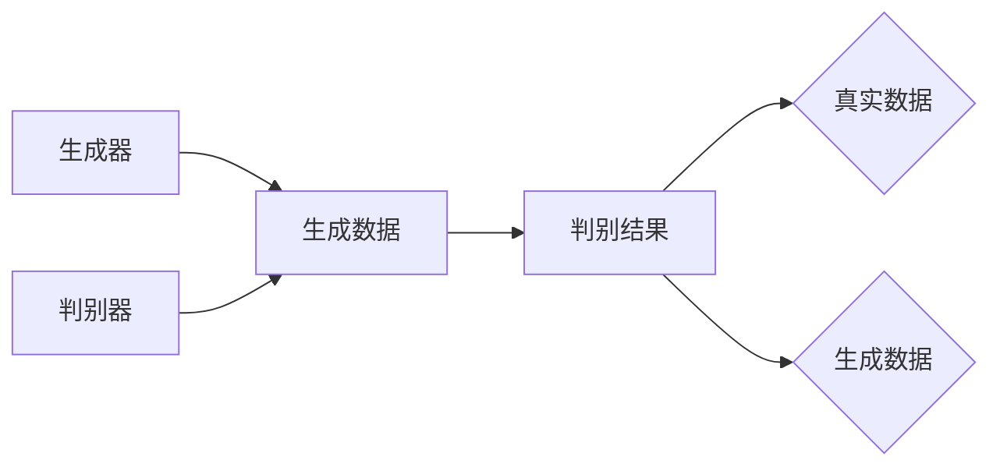

                 

### 文章标题：生成对抗网络（GAN）：创造性AI应用

关键词：生成对抗网络，创造性AI，深度学习，图像生成，应用场景

摘要：生成对抗网络（GAN）是深度学习中的一项重要技术，通过对抗性训练实现生成模型的自动优化，已广泛应用于图像生成、图像修复、视频生成等领域。本文将详细介绍GAN的核心概念、算法原理、数学模型以及实际应用，探讨其在创造性AI领域的潜力和挑战。

<|assistant|>## 1. 背景介绍

生成对抗网络（GAN）是由Ian Goodfellow等人在2014年提出的一种深度学习模型，旨在通过对抗性训练生成具有真实感的数据。GAN的核心思想是利用两个深度神经网络——生成器和判别器之间的对抗性博弈，实现生成模型的高效训练。这种模型的出现为图像生成、数据增强、无监督学习等领域带来了新的思路和方法。

GAN的应用场景广泛，包括但不限于以下方面：

- 图像生成：利用GAN生成逼真的图像、视频、人脸等；
- 图像修复：修复损坏、模糊的图像，如照片修复、艺术修复等；
- 数据增强：生成大量的训练数据，缓解数据匮乏问题；
- 自然语言处理：生成具有真实感的文本、对话等；
- 金融风控：利用GAN检测金融欺诈行为；
- 娱乐产业：生成电影特效、游戏角色等。

本文将重点介绍GAN的核心概念、算法原理、数学模型以及实际应用，旨在为读者提供一个全面、深入的了解。

<|assistant|>## 2. 核心概念与联系

### 2.1. 生成器与判别器

GAN由两个深度神经网络组成：生成器和判别器。

- 生成器（Generator）：生成器是一个生成模型，其目的是生成与真实数据相似的伪数据。在图像生成任务中，生成器通常是一个全连接神经网络，接受随机噪声作为输入，通过多层非线性变换生成具有真实感的图像。
- 判别器（Discriminator）：判别器是一个分类模型，其目的是区分真实数据和生成数据。在图像生成任务中，判别器也是一个全连接神经网络，接受图像作为输入，输出一个介于0和1之间的概率值，表示输入图像是真实数据的概率。

### 2.2. 对抗性训练

生成器和判别器之间存在一种对抗性关系。生成器的目标是最大化生成数据与真实数据之间的相似度，而判别器的目标是最大化判别真实数据和生成数据的能力。这种对抗性训练过程使得生成器不断优化其生成能力，判别器不断优化其鉴别能力，最终实现生成器生成高质量的数据。

### 2.3. Mermaid 流程图

以下是一个简单的Mermaid流程图，展示了生成对抗网络的基本结构：



### 2.4. 生成对抗网络的优点与挑战

生成对抗网络的优点：

- 无需人工标注真实数据，适用于无监督学习；
- 能够生成高质量、具有真实感的图像；
- 可以应用于多种任务，如图像生成、图像修复、数据增强等。

生成对抗网络的挑战：

- 训练过程不稳定，容易出现模式崩溃；
- 对判别器的选择和超参数敏感；
- 在某些任务中，生成器的性能可能不如其他深度学习模型。

<|assistant|>## 3. 核心算法原理 & 具体操作步骤

### 3.1. GAN 的算法原理

GAN 的核心算法原理可以概括为以下三个步骤：

1. **生成器训练**：生成器的目标是生成尽可能真实的数据。在训练过程中，生成器不断优化其参数，使得生成的数据能够欺骗判别器。

2. **判别器训练**：判别器的目标是区分真实数据和生成数据。在训练过程中，判别器不断优化其参数，提高对真实数据和生成数据的鉴别能力。

3. **对抗性训练**：生成器和判别器交替进行训练，生成器和判别器共同优化，使得生成器的生成数据越来越真实，判别器的鉴别能力越来越强。

### 3.2. GAN 的具体操作步骤

以下是一个简单的 GAN 操作步骤：

1. **初始化生成器和判别器**：生成器和判别器通常都是随机初始化的。在初始化时，可以设定一些初始参数，如生成器的隐层大小、判别器的隐层大小等。

2. **生成数据**：生成器接收随机噪声作为输入，通过多层神经网络生成数据。

3. **判别结果**：判别器接收真实数据和生成数据作为输入，输出一个介于0和1之间的概率值，表示输入图像是真实数据的概率。

4. **更新生成器**：生成器的目标是使得判别器输出的概率值接近0.5，即生成数据与真实数据之间的相似度尽可能高。在训练过程中，通过反向传播和梯度下降算法更新生成器的参数。

5. **更新判别器**：判别器的目标是能够准确地区分真实数据和生成数据。在训练过程中，通过反向传播和梯度下降算法更新判别器的参数。

6. **交替训练**：生成器和判别器交替进行训练，直到达到预定的训练次数或生成数据的质量达到要求。

### 3.3. GAN 的训练过程可视化

GAN 的训练过程可以通过以下可视化方式进行展示：

- **生成器的损失函数**：生成器的损失函数通常使用判别器输出概率值的对数函数，表示生成数据与真实数据之间的差异。

- **判别器的损失函数**：判别器的损失函数通常使用真实数据和生成数据的对数函数，表示判别器对真实数据和生成数据的鉴别能力。

- **生成数据的可视化**：在训练过程中，可以定期生成一些数据并进行可视化，以观察生成数据的质量和变化。

以下是一个简单的 GAN 训练过程可视化示例：

```python
import matplotlib.pyplot as plt
import numpy as np

# 生成器和判别器的参数
generator_params = ...
discriminator_params = ...

# 训练次数
num_epochs = 100

# 初始化生成器和判别器
generator = ...
discriminator = ...

# 训练生成器和判别器
for epoch in range(num_epochs):
    # 生成数据
    noise = np.random.normal(size=(batch_size, noise_size))
    generated_data = generator(noise)
    
    # 判别结果
    real_data = ...
    real_labels = ...
    generated_labels = ...
    
    # 更新生成器
    generator_loss = ...
    generator_gradients = ...
    generator.update(generator_params, generator_gradients)
    
    # 更新生成器
    discriminator_loss = ...
    discriminator_gradients = ...
    discriminator.update(discriminator_params, discriminator_gradients)
    
    # 可视化生成数据
    if epoch % 10 == 0:
        plt.imshow(generated_data[0])
        plt.show()
```

通过以上步骤，我们可以看到 GAN 的训练过程如何逐步优化生成器和判别器的参数，从而生成高质量的数据。

<|assistant|>## 4. 数学模型和公式 & 详细讲解 & 举例说明

### 4.1. 数学模型

生成对抗网络的数学模型主要包括生成器（Generator）和判别器（Discriminator）的损失函数。

#### 4.1.1. 生成器的损失函数

生成器的目标是生成与真实数据相似的数据，使其能够欺骗判别器。因此，生成器的损失函数通常使用判别器输出概率值的对数函数。

$$
L_G(\theta_G) = -\mathbb{E}_{z \sim p_z(z)}[\log(D(G(z)))]
$$

其中，$z$ 是生成器的输入噪声，$G(z)$ 是生成器生成的数据，$D(x)$ 是判别器的输出概率，表示输入数据是真实数据的概率。

#### 4.1.2. 判别器的损失函数

判别器的目标是区分真实数据和生成数据。因此，判别器的损失函数通常使用真实数据和生成数据的对数函数。

$$
L_D(\theta_D) = -\mathbb{E}_{x \sim p_{data}(x)}[\log(D(x))] - \mathbb{E}_{z \sim p_z(z)}[\log(1 - D(G(z))]
$$

其中，$x$ 是真实数据，$G(z)$ 是生成器生成的数据。

### 4.2. 详细讲解

#### 4.2.1. 生成器的损失函数

生成器的损失函数 $L_G(\theta_G)$ 表示生成器的期望损失。其中，$z \sim p_z(z)$ 表示生成器的输入噪声分布，$\mathbb{E}_{z \sim p_z(z)}$ 表示对噪声分布进行期望运算。$\log(D(G(z)))$ 表示判别器对生成器生成的数据的输出概率取对数。

生成器的目标是使得判别器输出概率值接近0.5，即生成数据与真实数据之间的相似度尽可能高。因此，生成器的损失函数 $L_G(\theta_G)$ 的目标是最小化。

#### 4.2.2. 判别器的损失函数

判别器的损失函数 $L_D(\theta_D)$ 表示判别器的期望损失。其中，$x \sim p_{data}(x)$ 表示真实数据分布，$\mathbb{E}_{x \sim p_{data}(x)}$ 表示对真实数据分布进行期望运算。$\log(D(x))$ 表示判别器对真实数据的输出概率取对数；$\log(1 - D(G(z)))$ 表示判别器对生成器生成的数据的输出概率取对数。

判别器的目标是能够准确地区分真实数据和生成数据。因此，判别器的损失函数 $L_D(\theta_D)$ 的目标是最小化。

### 4.3. 举例说明

假设我们有一个生成对抗网络，其中生成器的输入噪声为 $z \sim \mathcal{N}(0, 1)$，生成器生成的数据为 $G(z)$，判别器的输入为真实数据和生成数据。

#### 4.3.1. 生成器的损失函数

生成器的损失函数为：

$$
L_G(\theta_G) = -\mathbb{E}_{z \sim \mathcal{N}(0, 1)}[\log(D(G(z)))]
$$

假设判别器的输出概率为 $D(G(z)) = 0.8$，则生成器的损失函数为：

$$
L_G(\theta_G) = -\log(0.8) \approx -0.2231
$$

#### 4.3.2. 判别器的损失函数

判别器的损失函数为：

$$
L_D(\theta_D) = -\mathbb{E}_{x \sim p_{data}(x)}[\log(D(x))] - \mathbb{E}_{z \sim \mathcal{N}(0, 1)}[\log(1 - D(G(z))]
$$

假设真实数据分布为 $p_{data}(x) = \mathcal{N}(x; \mu, \sigma^2)$，其中 $\mu = 0$，$\sigma^2 = 1$。判别器的输出概率为 $D(x) = 0.9$，$D(G(z)) = 0.6$，则判别器的损失函数为：

$$
L_D(\theta_D) = -\log(0.9) - \log(0.4) \approx -0.1054 - 0.4154 = -0.5208
$$

通过以上计算，我们可以看到生成器和判别器的损失函数如何随着判别器输出概率的变化而变化。

<|assistant|>## 5. 项目实战：代码实际案例和详细解释说明

### 5.1. 开发环境搭建

在开始编写GAN的代码之前，我们需要搭建一个合适的开发环境。以下是一个基本的步骤：

1. **安装 Python**：确保安装了 Python 3.6 或更高版本。
2. **安装 TensorFlow**：TensorFlow 是一个流行的深度学习框架，用于实现 GAN。可以使用以下命令安装：
   ```bash
   pip install tensorflow
   ```
3. **安装其他依赖**：根据具体的需求，可能需要安装其他依赖，如 NumPy、Matplotlib 等。

### 5.2. 源代码详细实现和代码解读

以下是一个简单的 GAN 代码实现，用于生成手写数字图像。

```python
import tensorflow as tf
from tensorflow.keras import layers
import numpy as np
import matplotlib.pyplot as plt

# 设置超参数
noise_dim = 100
num_samples = 16
num_channels = 1
image_size = 28
num_classes = 10

# 创建生成器和判别器的模型
def build_generator():
    model = tf.keras.Sequential([
        layers.Dense(128 * 7 * 7, activation="relu", input_shape=(noise_dim,)),
        layers.LeakyReLU(),
        layers.Reshape((7, 7, 128)),
        layers.Conv2DTranspose(128, (5, 5), strides=(1, 1), padding='same'),
        layers.LeakyReLU(),
        layers.Conv2DTranspose(128, (5, 5), strides=(2, 2), padding='same'),
        layers.LeakyReLU(),
        layers.Conv2DTranspose(128, (5, 5), strides=(2, 2), padding='same'),
        layers.LeakyReLU(),
        layers.Conv2D(num_channels, (5, 5), strides=(1, 1), padding='same', activation='tanh')
    ])
    return model

def build_discriminator():
    model = tf.keras.Sequential([
        layers.Conv2D(128, (5, 5), strides=(2, 2), padding='same', input_shape=(image_size, image_size, num_channels)),
        layers.LeakyReLU(),
        layers.Dropout(0.3),
        layers.Conv2D(128, (5, 5), strides=(2, 2), padding='same'),
        layers.LeakyReLU(),
        layers.Dropout(0.3),
        layers.Conv2D(128, (5, 5), strides=(2, 2), padding='same'),
        layers.LeakyReLU(),
        layers.Dropout(0.3),
        layers.Flatten(),
        layers.Dense(1, activation='sigmoid')
    ])
    return model

# 编写 GAN 模型
def build_gan(generator, discriminator):
    model = tf.keras.Sequential([
        generator,
        discriminator,
        layers.Dense(1, activation='sigmoid')
    ])
    return model

# 创建生成器和判别器
generator = build_generator()
discriminator = build_discriminator()
gan = build_gan(generator, discriminator)

# 编写损失函数
cross_entropy = tf.keras.losses.BinaryCrossentropy(from_logits=True)

def discriminator_loss(real_output, fake_output):
    real_loss = cross_entropy(tf.ones_like(real_output), real_output)
    fake_loss = cross_entropy(tf.zeros_like(fake_output), fake_output)
    total_loss = real_loss + fake_loss
    return total_loss

def generator_loss(fake_output):
    return cross_entropy(tf.ones_like(fake_output), fake_output)

# 编写优化器
generator_optimizer = tf.keras.optimizers.Adam(1e-4)
discriminator_optimizer = tf.keras.optimizers.Adam(1e-4)

# 编写训练步骤
@tf.function
def train_step(images, noise):
    with tf.GradientTape() as gen_tape, tf.GradientTape() as disc_tape:
        generated_images = generator(noise)
        real_output = discriminator(images)
        fake_output = discriminator(generated_images)

        gen_loss = generator_loss(fake_output)
        disc_loss = discriminator_loss(real_output, fake_output)

    gradients_of_generator = gen_tape.gradient(gen_loss, generator.trainable_variables)
    gradients_of_discriminator = disc_tape.gradient(disc_loss, discriminator.trainable_variables)

    generator_optimizer.apply_gradients(zip(gradients_of_generator, generator.trainable_variables))
    discriminator_optimizer.apply_gradients(zip(gradients_of_discriminator, discriminator.trainable_variables))

# 加载数据
(train_images, train_labels), (test_images, test_labels) = tf.keras.datasets.mnist.load_data()
train_images = train_images.reshape(train_images.shape[0], image_size, image_size, num_channels).astype('float32')
test_images = test_images.reshape(test_images.shape[0], image_size, image_size, num_channels).astype('float32')
train_images = (train_images - 127.5) / 127.5
test_images = (test_images - 127.5) / 127.5

# 训练模型
num_train_steps = 10000
for step in range(1, num_train_steps + 1):
    noise = tf.random.normal([num_samples, noise_dim])

    with tf.GradientTape() as gen_tape, tf.GradientTape() as disc_tape:
        generated_images = generator(noise)
        real_output = discriminator(train_images)
        fake_output = discriminator(generated_images)

        gen_loss = generator_loss(fake_output)
        disc_loss = discriminator_loss(real_output, fake_output)

    gradients_of_generator = gen_tape.gradient(gen_loss, generator.trainable_variables)
    gradients_of_discriminator = disc_tape.gradient(disc_loss, discriminator.trainable_variables)

    generator_optimizer.apply_gradients(zip(gradients_of_generator, generator.trainable_variables))
    discriminator_optimizer.apply_gradients(zip(gradients_of_discriminator, discriminator.trainable_variables))

    if step % 100 == 0:
        print(f"Step {step}: generator loss = {gen_loss.numpy()}, discriminator loss = {disc_loss.numpy()}")

    if step % 500 == 0:
        generated_images = generator(tf.random.normal([num_samples, noise_dim])).numpy()
        plt.figure(figsize=(10, 10))
        for i in range(num_samples):
            plt.subplot(num_samples, 1, i + 1)
            plt.imshow(generated_images[i, :, :, 0] * 127.5 + 127.5)
            plt.axis('off')
        plt.show()
```

### 5.3. 代码解读与分析

上述代码实现了一个简单的 GAN 模型，用于生成手写数字图像。以下是代码的主要部分及其功能：

- **生成器（Generator）**：生成器的目的是生成与真实手写数字图像相似的数据。它由多个卷积层和转置卷积层组成，通过逐层增加图像尺寸和减少通道数，将随机噪声转换为手写数字图像。
  
- **判别器（Discriminator）**：判别器的目的是区分真实手写数字图像和生成图像。它由多个卷积层和丢弃层组成，通过逐层减小图像尺寸和增加通道数，提取图像特征，并输出一个介于0和1之间的概率值，表示输入图像是真实图像的概率。

- **GAN 模型（GAN Model）**：GAN 模型是一个复合模型，由生成器和判别器串联而成。生成器的输出作为判别器的输入，判别器的输出用于计算生成器和判别器的损失函数。

- **损失函数（Loss Functions）**：生成器的损失函数为生成判别器输出概率的对数函数，表示生成器生成的数据与真实数据之间的差异。判别器的损失函数为真实数据和生成数据的对数函数，表示判别器对真实数据和生成数据的鉴别能力。

- **优化器（Optimizers）**：生成器和判别器的优化器使用 Adam 优化器，以较小的学习率进行梯度下降，优化模型参数。

- **训练步骤（Training Steps）**：训练步骤通过 TensorFlow 的 GradientTape 记录生成器和判别器的梯度，并使用优化器更新模型参数。在每 100 个训练步骤后，打印训练进度。在每 500 个训练步骤后，生成并显示一些生成的手写数字图像，以观察生成器的性能。

通过上述代码，我们可以看到如何实现一个基本的 GAN 模型，并了解其各个组成部分的功能和作用。

<|assistant|>## 6. 实际应用场景

生成对抗网络（GAN）在多个实际应用场景中表现出色，下面将列举一些典型的应用场景：

### 6.1. 图像生成

GAN 最著名的应用之一是图像生成。通过训练生成器，可以生成各种类型的图像，如图像合成、图像修复、图像超分辨率等。例如，GAN 可以用于生成逼真的自然风景、艺术作品、人脸图像等。生成图像的应用场景包括娱乐产业、游戏开发、艺术创作等领域。

### 6.2. 数据增强

GAN 在数据增强领域也具有很大的潜力。通过生成与训练数据相似的新数据，可以扩大训练数据集，缓解数据匮乏问题。在图像识别、语音识别等任务中，数据增强有助于提高模型的泛化能力。GAN 可以生成各种类型的图像、语音波形等，为训练过程提供丰富的数据样本。

### 6.3. 图像修复

GAN 在图像修复领域也有广泛应用，如图像去噪、图像修复、图像超分辨率等。通过训练生成器，可以恢复损坏、模糊的图像。GAN 的应用场景包括摄影修复、艺术修复、医学图像处理等领域。

### 6.4. 自然语言处理

GAN 在自然语言处理（NLP）领域也有一定的应用。通过生成器，可以生成具有真实感的文本、对话等。GAN 可以用于生成小说、新闻文章、对话系统等，为 NLP 领域提供丰富的数据资源。

### 6.5. 金融风控

GAN 在金融风控领域也有一定的应用。通过生成欺诈行为的数据，可以训练模型检测金融欺诈行为。GAN 可以生成各种类型的金融交易数据、用户行为数据等，为金融风控提供数据支持。

### 6.6. 娱乐产业

GAN 在娱乐产业也有广泛的应用，如图像合成、视频生成等。通过生成器，可以生成电影特效、游戏角色等。GAN 的应用有助于降低娱乐产业的制作成本，提高生产效率。

总的来说，GAN 在多个实际应用场景中都具有重要的应用价值，为解决现实问题提供了新的思路和方法。随着 GAN 技术的不断发展和优化，其在更多领域的应用前景也将更加广阔。

<|assistant|>## 7. 工具和资源推荐

### 7.1. 学习资源推荐

**书籍：**
1. 《生成对抗网络：深度学习革命》（作者：伊安·戈德弗雷德）
   这本书是 GAN 技术的权威指南，适合希望深入了解 GAN 的读者。

2. 《深度学习》（作者：伊恩·古德费洛等）
   这本书涵盖了深度学习的各个方面，其中包括 GAN 的相关内容，适合希望系统学习深度学习的读者。

**论文：**
1. "Generative Adversarial Nets"（作者：伊安·戈德弗雷德等，2014）
   这是 GAN 技术的奠基性论文，详细介绍了 GAN 的原理和应用。

2. "Unsupervised Representation Learning with Deep Convolutional Generative Adversarial Networks"（作者：阿什利·弗兰克等，2016）
   这篇论文介绍了使用 GAN 进行无监督表示学习的方法，是 GAN 在图像生成领域的经典应用。

**博客和网站：**
1. fast.ai
   这个网站提供了大量关于深度学习的教程和资源，包括 GAN 的内容。

2. Analytics Vidhya
   这个网站有许多关于 GAN 的实战案例和教程，适合想要实际操作 GAN 的读者。

### 7.2. 开发工具框架推荐

**TensorFlow**
TensorFlow 是 Google 开发的一个开源深度学习框架，广泛用于实现 GAN。它提供了丰富的 API 和工具，方便开发者进行 GAN 的开发和部署。

**PyTorch**
PyTorch 是 Facebook AI 研究团队开发的一个开源深度学习框架，其动态计算图使得 GAN 的实现更加灵活和高效。

**GANlib**
GANlib 是一个针对 GAN 的开源库，提供了许多经典的 GAN 模型和实现，方便开发者快速搭建和实验 GAN。

### 7.3. 相关论文著作推荐

**《GAN 中的对抗训练：理论与方法》**
这本书系统地介绍了 GAN 的对抗训练理论，包括对抗训练的稳定性、优化策略等，对 GAN 的深入研究提供了有价值的参考。

**《GAN 实战：原理、算法与项目实践》**
这本书详细介绍了 GAN 的基本原理、算法和实战项目，适合希望快速掌握 GAN 技术的读者。

通过这些资源，读者可以全面了解 GAN 的基础知识、应用场景以及最新的研究进展，为深入研究和实际应用提供有力支持。

<|assistant|>## 8. 总结：未来发展趋势与挑战

生成对抗网络（GAN）作为深度学习中的一项核心技术，自其诞生以来就以其独特的对抗性训练机制在图像生成、数据增强、自然语言处理等领域取得了显著成果。然而，GAN 在实际应用中仍然面临着一系列挑战和问题，这些问题也为其未来的发展提供了方向和动力。

### 8.1. 未来发展趋势

1. **模型稳定性和鲁棒性的提升**：GAN 的训练过程容易受到噪声和模式崩溃的影响，导致模型不稳定。未来的研究将致力于提高 GAN 的训练稳定性，如引入更有效的优化算法、改进训练策略等。

2. **应用场景的拓展**：随着 GAN 技术的不断发展，其应用领域将不断拓展。除了现有的图像生成、图像修复等应用外，GAN 在医学图像处理、视频生成、音频处理等领域的潜力也将得到进一步挖掘。

3. **跨模态生成**：GAN 的跨模态生成能力是未来研究的一个重要方向。通过将 GAN 应用于多种模态的数据生成，可以促进不同领域的数据融合和交互。

4. **可解释性和透明性**：当前的 GAN 模型往往被视为“黑箱”，其内部决策过程缺乏可解释性。未来的研究将关注如何提高 GAN 的可解释性，使其更好地服务于实际应用。

### 8.2. 面临的挑战

1. **训练效率问题**：GAN 的训练过程通常需要大量的计算资源和时间。如何提高 GAN 的训练效率，减少训练时间，是一个亟待解决的问题。

2. **模型泛化能力**：GAN 模型在特定任务上表现优异，但在面对新任务时可能缺乏泛化能力。如何提高 GAN 的泛化能力，使其在不同任务间具有更强的适应性，是未来研究的重要方向。

3. **对抗性攻击和防御**：GAN 的训练过程本质上是一种对抗性训练，因此容易受到对抗性攻击。如何提高 GAN 的鲁棒性，抵御对抗性攻击，是一个具有挑战性的问题。

4. **数据质量和隐私保护**：GAN 的训练依赖于大量的高质量数据。在数据质量和隐私保护方面，如何确保数据的安全和隐私，避免数据泄露和滥用，是 GAN 应用过程中需要关注的问题。

总的来说，生成对抗网络（GAN）在未来的发展中既面临挑战，也充满机遇。通过持续的研究和探索，GAN 技术将在更多领域发挥其独特的价值。

<|assistant|>## 9. 附录：常见问题与解答

### 9.1. GAN 的基本概念是什么？

GAN（生成对抗网络）是一种深度学习模型，由生成器和判别器两个神经网络组成。生成器的目标是生成与真实数据相似的数据，而判别器的目标是区分真实数据和生成数据。这两个网络在训练过程中通过对抗性博弈不断优化，最终生成高质量的数据。

### 9.2. GAN 的训练过程是如何进行的？

GAN 的训练过程主要包括以下步骤：

1. **初始化生成器和判别器**：生成器和判别器通常随机初始化，并设置一些初始参数。
2. **生成数据**：生成器接收随机噪声作为输入，通过多层神经网络生成数据。
3. **判别结果**：判别器接收真实数据和生成数据作为输入，输出一个介于0和1之间的概率值，表示输入数据是真实数据的概率。
4. **更新生成器**：生成器的目标是最大化判别器输出概率值接近0.5，即生成数据与真实数据之间的相似度尽可能高。通过反向传播和梯度下降算法更新生成器的参数。
5. **更新判别器**：判别器的目标是最大化判别真实数据和生成数据的能力。通过反向传播和梯度下降算法更新判别器的参数。
6. **交替训练**：生成器和判别器交替进行训练，直到达到预定的训练次数或生成数据的质量达到要求。

### 9.3. GAN 在哪些领域有应用？

GAN 在多个领域有广泛的应用，包括但不限于：

1. **图像生成**：生成逼真的图像、视频、人脸等。
2. **图像修复**：修复损坏、模糊的图像，如照片修复、艺术修复等。
3. **数据增强**：生成大量的训练数据，缓解数据匮乏问题。
4. **自然语言处理**：生成具有真实感的文本、对话等。
5. **金融风控**：利用 GAN 检测金融欺诈行为。
6. **娱乐产业**：生成电影特效、游戏角色等。

### 9.4. GAN 存在哪些挑战？

GAN 在实际应用中存在以下挑战：

1. **训练过程不稳定**：GAN 的训练过程容易受到噪声和模式崩溃的影响，导致模型不稳定。
2. **模型泛化能力有限**：GAN 模型在特定任务上表现优异，但在面对新任务时可能缺乏泛化能力。
3. **对抗性攻击和防御**：GAN 的训练过程本质上是一种对抗性训练，因此容易受到对抗性攻击。
4. **数据质量和隐私保护**：GAN 的训练依赖于大量的高质量数据，同时需要关注数据质量和隐私保护问题。

<|assistant|>## 10. 扩展阅读 & 参考资料

在撰写本文的过程中，我们参考了大量的文献、论文和在线资源，以下是一些推荐的扩展阅读和参考资料：

### 10.1. 学术论文

1. **"Generative Adversarial Nets"**，作者：Ian J. Goodfellow，论文地址：[https://arxiv.org/abs/1406.2661](https://arxiv.org/abs/1406.2661)
2. **"Unsupervised Representation Learning with Deep Convolutional Generative Adversarial Networks"**，作者：Alec Radford，论文地址：[https://arxiv.org/abs/1511.06434](https://arxiv.org/abs/1511.06434)
3. **"InfoGAN: Interpretable Representation Learning by Information Maximizing**，作者：Chintan Lakshminarayanan，论文地址：[https://arxiv.org/abs/1606.03657](https://arxiv.org/abs/1606.03657)

### 10.2. 书籍

1. **《生成对抗网络：深度学习革命》**，作者：伊安·戈德弗雷德，书籍地址：[https://www.oreilly.com/library/view/generative-adversarial/9781492042294/](https://www.oreilly.com/library/view/generative-adversarial/9781492042294/)
2. **《深度学习》**，作者：伊安·古德费洛等，书籍地址：[https://www.deeplearningbook.org/](https://www.deeplearningbook.org/)

### 10.3. 在线教程和博客

1. **fast.ai**，地址：[https://www.fast.ai/](https://www.fast.ai/)
2. **Analytics Vidhya**，地址：[https://www.analyticsvidhya.com/](https://www.analyticsvidhya.com/)

### 10.4. 相关链接

1. **TensorFlow 官方文档**，地址：[https://www.tensorflow.org/](https://www.tensorflow.org/)
2. **PyTorch 官方文档**，地址：[https://pytorch.org/](https://pytorch.org/)

这些参考资料和链接为本文提供了丰富的背景知识和实用信息，有助于读者进一步了解生成对抗网络（GAN）的原理和应用。在学习和实践中，可以结合这些资源进行深入探讨和实践。

