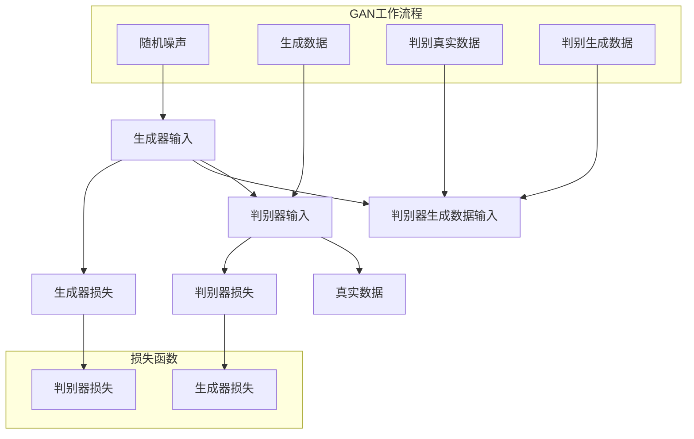
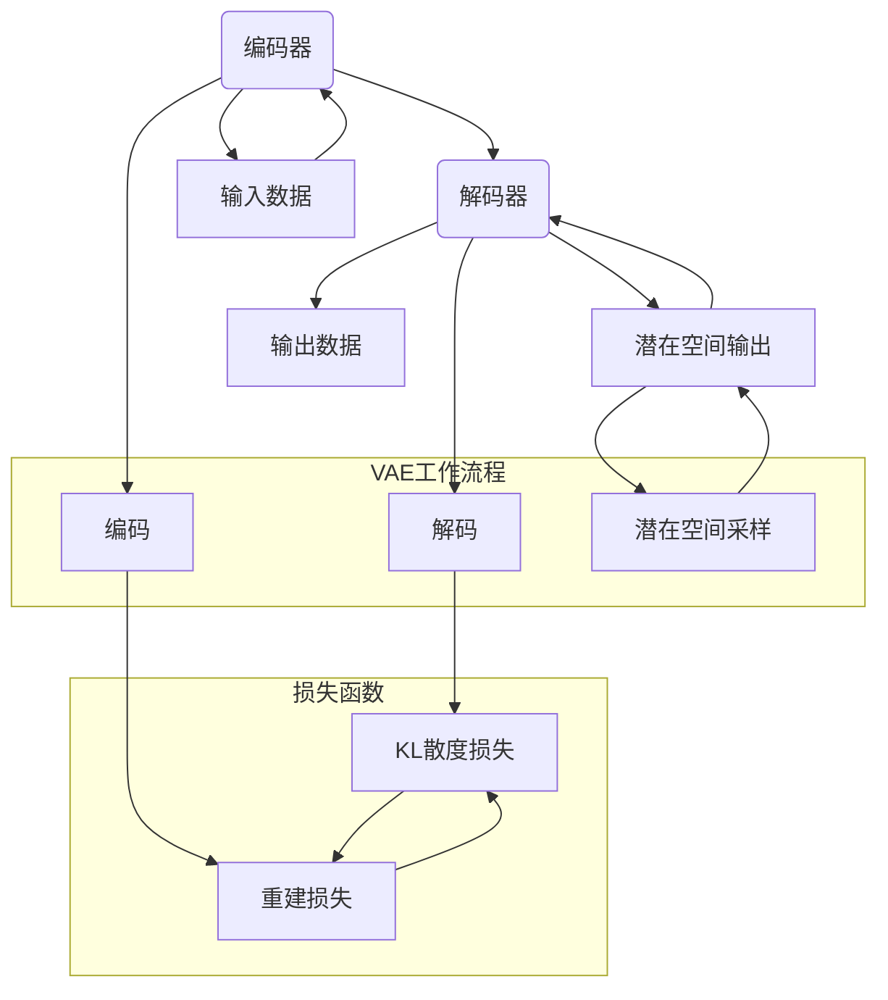

                 

### 1. 背景介绍

生成式AIGC（Artificial Intelligence Generated Content）是一种利用人工智能技术生成内容的方法。它起源于深度学习领域，特别是生成对抗网络（GAN）和变分自编码器（VAE）等算法。随着计算能力的提升和大数据的积累，AIGC技术逐渐从学术研究走向实际应用，尤其在商业领域展现出巨大的潜力。

近年来，AIGC在商业应用中逐渐崭露头角，尤其是在内容创作、个性化推荐、图像和视频生成等领域取得了显著的成果。例如，利用AIGC技术，可以快速生成高质量的广告内容、文章、音乐、图像等，极大地提高了生产效率和创作水平。此外，AIGC还在智能客服、虚拟助手、游戏设计等领域发挥着重要作用。

本文将深入探讨生成式AIGC在商业应用中的无限可能，通过分析其核心概念、算法原理、数学模型以及实际应用案例，为读者提供一幅全面而清晰的AIGC应用蓝图。我们将逐步介绍AIGC的发展历程、技术原理、应用场景以及面临的挑战和未来趋势，帮助读者更好地理解和应用这一前沿技术。

### 1.1 生成式AIGC的发展历程

生成式AIGC技术的发展可以追溯到20世纪80年代末和90年代初，当时科学家们开始研究如何使用计算机生成逼真的图像、声音和文本。早期的尝试主要集中在规则系统和模板匹配方法，但这些方法存在明显的局限性，无法生成高质量的、多样化的内容。

2006年，Ian Goodfellow等人提出了生成对抗网络（GAN）的概念。GAN由一个生成器（Generator）和一个判别器（Discriminator）组成，通过两者之间的对抗训练，生成器试图生成逼真的数据，而判别器则努力区分真实数据和生成数据。GAN的提出标志着深度学习在生成任务上取得了重大突破，成为AIGC技术发展的里程碑。

随着深度学习的快速发展，生成式AIGC技术逐渐完善，应用领域也不断扩大。2013年，变分自编码器（VAE）的提出进一步丰富了生成式模型的种类。VAE通过引入概率密度函数，使得生成模型能够更好地捕捉数据的分布特性。此外，自注意力机制、变分自编码器（VAE）等技术的引入，使得生成式AIGC在图像、文本、语音等生成任务上取得了更加出色的效果。

近年来，生成式AIGC在商业应用中逐渐崭露头角。随着计算能力的提升和大数据的积累，AIGC技术从实验室走向实际应用，特别是在内容创作、个性化推荐、图像和视频生成等领域取得了显著成果。例如，利用AIGC技术，可以快速生成高质量的广告内容、文章、音乐、图像等，极大地提高了生产效率和创作水平。

总的来说，生成式AIGC技术的发展经历了从早期规则系统到现代深度学习的转变，从单一图像生成到多模态内容生成的扩展，从学术研究到实际应用的转化。这一技术的发展历程为我们揭示了人工智能在生成内容方面的巨大潜力，也为未来的商业应用奠定了基础。

### 1.2 生成式AIGC的核心概念

生成式AIGC的核心概念主要包括生成对抗网络（GAN）、变分自编码器（VAE）、生成式模型等。这些模型通过不同的原理和结构，实现了从原始数据到生成数据的转换，为AIGC技术的应用提供了强大的支持。

**生成对抗网络（GAN）**

生成对抗网络（GAN）是由Ian Goodfellow等人于2006年提出的一种深度学习模型，由生成器（Generator）和判别器（Discriminator）两个主要部分组成。生成器试图生成与真实数据相似的数据，而判别器则判断输入数据是真实数据还是生成数据。两者的训练过程是通过对抗性学习实现的。

GAN的训练过程可以描述为以下步骤：

1. **初始化生成器和判别器**：生成器和判别器通常都是深度神经网络，初始化时可以随机初始化或者通过预训练的方式初始化。
2. **生成器生成数据**：生成器从随机噪声或上一个生成数据的分布中生成数据。
3. **判别器判断数据**：判别器对真实数据和生成数据进行分类，判断其是否为真实数据。
4. **生成器和判别器的优化**：通过损失函数和梯度下降算法对生成器和判别器进行优化，使生成器生成的数据更接近真实数据，判别器能够更准确地分类真实数据和生成数据。

GAN的核心原理在于生成器和判别器之间的对抗性训练，通过不断优化，生成器逐渐能够生成越来越逼真的数据。

**变分自编码器（VAE）**

变分自编码器（VAE）是由Kingma和Welling于2013年提出的一种生成模型。与GAN不同，VAE采用概率模型来表示数据分布，通过引入潜在变量（Latent Variable）来降低数据维度，实现数据的压缩和生成。

VAE的主要组成部分包括编码器（Encoder）和解码器（Decoder）。编码器将输入数据映射到一个潜在空间，解码器则从潜在空间生成输出数据。VAE的训练过程如下：

1. **初始化编码器和解码器**：编码器和解码器通常是深度神经网络，可以通过随机初始化或者预训练的方式初始化。
2. **编码器编码数据**：编码器将输入数据映射到一个潜在变量，这个潜在变量可以看作是数据的压缩表示。
3. **解码器解码数据**：解码器从潜在变量生成输出数据。
4. **损失函数优化**：VAE使用概率损失函数（如均方误差或交叉熵）来优化编码器和解码器，使生成的数据更接近原始数据。

VAE的优势在于能够更好地捕捉数据的分布特性，生成更加多样化的数据。

**生成式模型**

生成式模型是一种基于概率论的模型，通过学习数据的概率分布来生成数据。生成式模型包括马尔可夫模型、隐马尔可夫模型（HMM）、条件概率模型等。这些模型通过概率密度函数或概率分布模型来表示数据的生成过程。

生成式模型的主要思想是学习数据的生成规律，通过概率分布来生成新的数据。这些模型在图像生成、文本生成、语音合成等领域有广泛应用。

总的来说，生成式AIGC的核心概念包括GAN、VAE和生成式模型等，这些模型通过不同的原理和结构，实现了从原始数据到生成数据的转换，为AIGC技术的应用提供了强大的支持。理解这些核心概念对于深入研究和应用AIGC技术具有重要意义。

### 1.3 生成式AIGC在商业应用中的优势

生成式AIGC技术在商业应用中展现出了诸多优势，这些优势不仅提升了企业的生产效率，还带来了创新和变革的机遇。以下是生成式AIGC在商业应用中的几个显著优势：

**1. 提高内容创作效率**

在内容创作领域，生成式AIGC技术可以大幅提升创作效率。通过利用生成模型，企业可以快速生成高质量的广告内容、文章、音乐、图像等。例如，广告公司可以利用GAN生成逼真的广告图像，快速推出新产品广告；媒体机构可以利用VAE生成新闻文章的草稿，从而节省大量的人工写作时间。此外，生成式AIGC还可以用于生成个性化内容，根据用户喜好和需求生成定制化的文章、音乐等，提升用户体验。

**2. 实现个性化推荐**

个性化推荐是生成式AIGC在商业应用中的另一个重要领域。通过分析用户的行为数据和兴趣偏好，生成式模型可以生成个性化的推荐内容。例如，电子商务平台可以利用生成模型为用户推荐商品，提高销售额和用户满意度。音乐平台可以通过生成式AIGC为用户生成个性化的音乐播放列表，提升用户粘性。此外，社交媒体平台可以利用生成式模型生成用户可能感兴趣的内容，提高用户活跃度和参与度。

**3. 提升图像和视频生成质量**

在图像和视频生成领域，生成式AIGC技术可以生成高质量、多样化的图像和视频内容。例如，电影制作公司可以利用GAN生成逼真的特效场景，减少制作成本和时间。游戏开发团队可以利用VAE生成游戏中的角色和场景，提升游戏画面质量。此外，生成式AIGC还可以用于图像修复和图像增强，对受损或低分辨率的图像进行修复和提升，提高图像的视觉效果。

**4. 智能客服和虚拟助手**

智能客服和虚拟助手是生成式AIGC在商业应用中的又一重要领域。通过生成式模型，企业可以生成智能客服的对话内容，提高客户服务质量和效率。例如，银行、航空公司和电商平台等可以部署基于AIGC的智能客服系统，为用户提供快速、准确的答案和帮助。此外，生成式AIGC还可以用于生成虚拟助手的语音和文本回答，提升用户的交互体验。

**5. 改进产品设计和开发**

生成式AIGC技术还可以应用于产品设计和开发领域，帮助企业生成新的产品概念和设计方案。通过生成模型，企业可以探索不同的设计选项，优化产品外观和功能。例如，汽车制造商可以利用GAN生成不同风格和设计的汽车外观，快速筛选出最佳设计方案。此外，生成式AIGC还可以用于生成产品原型，加快产品开发周期，降低研发成本。

总的来说，生成式AIGC技术在商业应用中具有显著的优势，不仅提高了内容创作效率、实现个性化推荐、提升了图像和视频生成质量，还广泛应用于智能客服、虚拟助手、产品设计和开发等领域。随着技术的不断进步，生成式AIGC将在更多商业场景中发挥重要作用，为企业创造更大的价值。

### 1.4 生成式AIGC面临的挑战和未来发展趋势

尽管生成式AIGC技术在商业应用中展现出了巨大的潜力，但其在实际应用中仍然面临一系列挑战。以下是生成式AIGC面临的几个主要挑战以及未来的发展趋势：

**1. 数据质量和隐私问题**

生成式AIGC技术对数据的质量和多样性有着较高的要求。高质量的数据是生成高质量内容的基础，但获取高质量、多样性的数据往往是一个困难且成本高昂的过程。此外，数据隐私问题也是AIGC技术面临的重大挑战。在训练过程中，大量的敏感数据可能会被泄露，引发隐私泄露和安全风险。因此，如何在不侵犯用户隐私的前提下，获取高质量、多样的数据，是生成式AIGC技术需要解决的一个重要问题。

**2. 计算资源和能耗问题**

生成式AIGC技术通常需要大量的计算资源和能耗。特别是对于复杂的生成任务，如高分辨率图像和视频的生成，计算资源的需求更大。这给企业在部署AIGC技术时带来了巨大的成本压力。此外，随着生成式AIGC技术的普及，数据中心的计算资源和能耗需求也将大幅增加，对环境造成负面影响。因此，如何优化算法、降低计算资源和能耗的需求，是生成式AIGC技术需要关注的重要问题。

**3. 模型解释性和可靠性问题**

生成式AIGC技术通常是基于复杂的深度学习模型，这些模型的解释性和可靠性较低。在许多应用场景中，用户需要理解生成的结果和过程，以便进行有效的决策和反馈。然而，深度学习模型的黑箱特性使得其生成结果和过程难以解释。此外，生成式AIGC模型的可靠性也受到质疑，特别是在生成某些特定类型的数据时，如医疗图像、法律文件等，生成结果的准确性和可靠性至关重要。因此，提高生成式AIGC技术的解释性和可靠性，是未来的一个重要研究方向。

**4. 法规和伦理问题**

生成式AIGC技术的应用涉及多个领域，包括广告、媒体、金融、医疗等。这些领域的法律法规和伦理标准各不相同，对AIGC技术的应用提出了不同的要求。例如，在广告领域，生成式AIGC技术可能导致虚假广告和误导消费者的风险；在医疗领域，生成式AIGC技术可能影响医生的诊断和治疗决策。因此，如何在法律法规和伦理框架下，合理使用生成式AIGC技术，是未来需要解决的一个重要问题。

**未来发展趋势**

尽管面临诸多挑战，生成式AIGC技术仍然具有广阔的发展前景。以下是未来生成式AIGC技术可能的发展趋势：

**1. 模型优化和算法改进**

随着深度学习技术的不断发展，生成式AIGC技术也将迎来更多的模型优化和算法改进。例如，通过改进GAN和VAE的架构和训练方法，可以提高生成质量、降低计算资源需求。此外，新型生成模型，如生成式模型（GPM）、变分生成对抗网络（VGAN）等，也可能在未来得到广泛应用。

**2. 多模态生成**

多模态生成是生成式AIGC技术的一个重要发展方向。通过结合图像、文本、语音等多种数据模态，生成式AIGC技术可以实现更丰富的内容生成。例如，未来可能实现图像和文本的联合生成，生成包含图像和文字描述的复合内容，提升用户体验。

**3. 低能耗和高性能**

随着环保意识的提高，降低生成式AIGC技术的能耗需求成为重要目标。通过优化算法、硬件架构以及硬件加速技术，可以降低计算资源和能耗的需求，提高生成式AIGC技术的性能。

**4. 模型解释性和可靠性提升**

提高生成式AIGC技术的解释性和可靠性是未来的一个重要研究方向。通过引入可解释性方法、透明性机制以及验证技术，可以增强用户对生成结果的信任度，提高模型在关键应用场景中的可靠性。

总之，生成式AIGC技术面临着一系列挑战，但也具有广阔的发展前景。随着技术的不断进步和应用的深入，生成式AIGC技术将在更多商业场景中发挥重要作用，为企业和社会创造更大的价值。

### 2. 核心概念与联系

为了深入理解生成式AIGC技术，我们需要详细探讨其核心概念、原理以及架构。在这一部分，我们将使用Mermaid流程图来展示生成式AIGC的核心组件和它们之间的联系。

**2.1 生成对抗网络（GAN）的架构**

生成对抗网络（GAN）由生成器（Generator）和判别器（Discriminator）两个主要部分组成。以下是GAN的基本架构及其运作原理：



在上面的流程图中，我们可以看到：

- **生成器（Generator）**：从随机噪声或上一个生成数据的分布中生成数据。
- **判别器（Discriminator）**：判断输入数据是真实数据还是生成数据。
- **真实数据（C）**：真实数据作为判别器的输入，用于训练判别器。
- **生成数据（D）**：生成器生成的数据作为判别器的输入，用于训练判别器。

**2.2 变分自编码器（VAE）的架构**

变分自编码器（VAE）是一种基于概率模型的生成模型，它通过潜在变量来降低数据维度，并生成新的数据。以下是VAE的基本架构及其运作原理：



在上面的流程图中，我们可以看到：

- **编码器（Encoder）**：将输入数据映射到潜在空间，并生成数据分布参数。
- **解码器（Decoder）**：从潜在空间生成输出数据。
- **潜在空间（C）**：潜在空间是数据的压缩表示，用于生成新的数据。

**2.3 生成式模型与GAN、VAE的关系**

生成式模型是一类基于概率论的模型，包括马尔可夫模型、隐马尔可夫模型（HMM）、条件概率模型等。生成式模型与GAN、VAE之间的关系可以概括如下：

- **GAN**：GAN是一种生成式模型，通过对抗性训练生成数据，它属于生成式模型的范畴。
- **VAE**：VAE也是一种生成式模型，它采用概率密度函数来表示数据分布，并通过潜在变量实现数据的生成。
- **生成式模型**：生成式模型是一种更广泛的模型类别，包括GAN和VAE在内的多种模型都可以归为生成式模型。

总的来说，生成式AIGC的核心概念包括生成对抗网络（GAN）、变分自编码器（VAE）和生成式模型等。这些模型通过不同的原理和结构，实现了从原始数据到生成数据的转换。理解这些核心概念和它们之间的联系，对于深入研究和应用生成式AIGC技术具有重要意义。

### 3. 核心算法原理 & 具体操作步骤

在深入了解生成式AIGC技术之后，我们将深入探讨其核心算法原理，并详细说明生成对抗网络（GAN）和变分自编码器（VAE）的具体操作步骤。这些算法是实现生成式AIGC技术的基础，理解它们对于实际应用至关重要。

**3.1 生成对抗网络（GAN）的算法原理**

生成对抗网络（GAN）由生成器（Generator）和判别器（Discriminator）两个主要部分组成，其核心思想是通过对抗性训练生成高质量的数据。以下是GAN的算法原理和具体操作步骤：

**3.1.1 生成器（Generator）的算法原理**

生成器的任务是生成与真实数据相似的数据。生成器通常是一个深度神经网络，它从随机噪声或上一个生成数据的分布中生成数据。生成器通过学习如何将噪声映射到数据空间，生成逼真的数据。

**操作步骤：**

1. **初始化生成器**：生成器可以通过随机初始化或者预训练的方式初始化。随机初始化通常使用高斯噪声作为输入。
2. **生成数据**：生成器从随机噪声中生成数据，这一过程可以表示为：\[ G(z) = \text{神经网络}(z) \]，其中\( z \)是随机噪声，\( G(z) \)是生成的数据。

**3.1.2 判别器（Discriminator）的算法原理**

判别器的任务是判断输入数据是真实数据还是生成数据。判别器也是一个深度神经网络，它通过学习区分真实数据和生成数据。

**操作步骤：**

1. **初始化判别器**：判别器可以通过随机初始化或者预训练的方式初始化。随机初始化通常使用高斯噪声作为输入。
2. **判断真实数据**：判别器对真实数据进行分类，判断其是否为真实数据，这一过程可以表示为：\[ D(x) = \text{神经网络}(x) \]，其中\( x \)是真实数据。
3. **判断生成数据**：判别器对生成数据进行分类，判断其是否为生成数据，这一过程可以表示为：\[ D(G(z)) = \text{神经网络}(G(z)) \]，其中\( G(z) \)是生成器生成的数据。

**3.1.3 GAN的训练过程**

GAN的训练过程是通过对抗性训练实现的，即生成器和判别器相互竞争，生成器和判别器交替进行优化。

**操作步骤：**

1. **生成器的训练**：生成器试图生成更逼真的数据，以欺骗判别器。生成器的损失函数可以表示为：
\[ L_G = -\log(D(G(z))) \]
其中，\( D(G(z)) \)表示判别器对生成数据的分类结果，目标是最小化生成器的损失。
2. **判别器的训练**：判别器试图区分真实数据和生成数据。判别器的损失函数可以表示为：
\[ L_D = -\log(D(x)) - \log(1 - D(G(z))) \]
其中，\( D(x) \)表示判别器对真实数据的分类结果，\( D(G(z)) \)表示判别器对生成数据的分类结果，目标是最小化判别器的损失。

**3.2 变分自编码器（VAE）的算法原理**

变分自编码器（VAE）是一种基于概率模型的生成模型，它通过潜在变量来降低数据维度，并生成新的数据。以下是VAE的算法原理和具体操作步骤：

**3.2.1 编码器（Encoder）的算法原理**

编码器将输入数据映射到一个潜在空间，并生成数据分布参数。编码器通常是一个深度神经网络。

**操作步骤：**

1. **初始化编码器**：编码器可以通过随机初始化或者预训练的方式初始化。
2. **编码输入数据**：编码器将输入数据映射到潜在空间，并生成数据分布参数，这一过程可以表示为：
\[ \mu(x), \sigma(x) = \text{神经网络}(x) \]
其中，\( \mu(x) \)是均值，\( \sigma(x) \)是方差。

**3.2.2 解码器（Decoder）的算法原理**

解码器从潜在空间生成输出数据。解码器也是一个深度神经网络。

**操作步骤：**

1. **初始化解码器**：解码器可以通过随机初始化或者预训练的方式初始化。
2. **解码潜在空间数据**：解码器从潜在空间生成输出数据，这一过程可以表示为：
\[ x' = \text{神经网络}(\mu(x), \sigma(x)) \]
其中，\( x' \)是生成的数据。

**3.2.3 VAE的训练过程**

VAE的训练过程是通过最大化数据分布的似然函数实现的。

**操作步骤：**

1. **编码输入数据**：编码器将输入数据映射到潜在空间，并生成数据分布参数。
2. **解码潜在空间数据**：解码器从潜在空间生成输出数据。
3. **计算重建损失**：计算输入数据和生成数据的重建损失，通常使用均方误差（MSE）或交叉熵损失。
\[ L_R = \frac{1}{N}\sum_{i=1}^{N} \frac{1}{2} \left[ (\mu(x_i) - x_i)^2 + \sigma(x_i)^2 \right] \]
4. **计算KL散度损失**：计算编码器生成的数据分布参数与先验分布之间的KL散度损失。
\[ L_KL = \frac{1}{N}\sum_{i=1}^{N} \frac{1}{2} \left[ \log(\sigma(x_i)^2) + 1 - \sigma(x_i)^2 \right] \]
5. **优化模型**：通过梯度下降算法优化编码器和解码器，使总损失最小化。
\[ L = L_R + \lambda L_KL \]
其中，\( \lambda \)是平衡重建损失和KL散度损失的权重。

通过以上步骤，我们可以了解到生成对抗网络（GAN）和变分自编码器（VAE）的算法原理和具体操作步骤。理解这些算法原理对于实际应用生成式AIGC技术具有重要意义。

### 4. 数学模型和公式 & 详细讲解 & 举例说明

在深入探讨生成式AIGC技术的核心算法原理之后，我们将进一步详细讲解其背后的数学模型和公式，并通过具体的例子来说明这些公式在实际应用中的运用。

#### 4.1 GAN的数学模型

生成对抗网络（GAN）的数学模型主要包括两部分：生成器的损失函数和判别器的损失函数。以下是对这两个损失函数的详细讲解。

**4.1.1 生成器的损失函数**

生成器的损失函数通常使用对抗性损失函数（Adversarial Loss Function），它的目的是使生成器生成的数据在判别器上难以区分。具体公式如下：

\[ L_G = -\log(D(G(z))) \]

其中，\( D(G(z)) \)是判别器对生成器生成的数据的分类结果，目标是最小化生成器的损失。

**4.1.2 判别器的损失函数**

判别器的损失函数通常使用二元交叉熵损失函数（Binary Cross-Entropy Loss），它的目的是使判别器能够准确地区分真实数据和生成数据。具体公式如下：

\[ L_D = -[y \cdot \log(D(x)) + (1 - y) \cdot \log(1 - D(G(z)))] \]

其中，\( y \)是标签，当输入为真实数据时，\( y = 1 \)；当输入为生成数据时，\( y = 0 \)。目标是最小化判别器的损失。

**4.1.3 举例说明**

假设我们有一个GAN模型，生成器生成一张人脸图像，判别器判断这张图像是真实人脸图像还是生成的人脸图像。我们通过以下步骤来举例说明GAN的损失函数：

1. **初始化生成器和判别器**：随机初始化生成器和判别器。
2. **生成数据**：生成器生成一张人脸图像，判别器对其分类。
3. **计算损失**：计算生成器和判别器的损失。
   - 生成器损失：\[ L_G = -\log(D(G(z))) \]
   - 判别器损失：\[ L_D = -[y \cdot \log(D(x)) + (1 - y) \cdot \log(1 - D(G(z)))] \]
4. **优化模型**：通过梯度下降算法优化生成器和判别器。

#### 4.2 VAE的数学模型

变分自编码器（VAE）的数学模型主要包括两部分：编码器（Encoder）的损失函数和解码器（Decoder）的损失函数。以下是对这两个损失函数的详细讲解。

**4.2.1 编码器的损失函数**

编码器的损失函数通常使用KL散度（Kullback-Leibler Divergence）来衡量编码器生成的数据分布参数与先验分布之间的差异。具体公式如下：

\[ L_KL = \frac{1}{N}\sum_{i=1}^{N} \frac{1}{2} \left[ \log(\sigma(x_i)^2) + 1 - \sigma(x_i)^2 \right] \]

其中，\( \sigma(x_i)^2 \)是方差，\( N \)是样本数量。

**4.2.2 解码器的损失函数**

解码器的损失函数通常使用均方误差（Mean Squared Error, MSE）来衡量解码器生成的数据与原始数据之间的差异。具体公式如下：

\[ L_MSE = \frac{1}{N}\sum_{i=1}^{N} \frac{1}{2} \left[ (\mu(x_i) - x_i)^2 + \sigma(x_i)^2 \right] \]

其中，\( \mu(x_i) \)是均值，\( x_i \)是原始数据。

**4.2.3 举例说明**

假设我们有一个VAE模型，编码器将一张人脸图像映射到潜在空间，解码器从潜在空间生成人脸图像。我们通过以下步骤来举例说明VAE的损失函数：

1. **初始化编码器和解码器**：随机初始化编码器和解码器。
2. **编码输入数据**：编码器将输入的人脸图像映射到潜在空间。
3. **解码潜在空间数据**：解码器从潜在空间生成人脸图像。
4. **计算损失**：计算编码器和解码器的损失。
   - 编码器损失：\[ L_KL = \frac{1}{N}\sum_{i=1}^{N} \frac{1}{2} \left[ \log(\sigma(x_i)^2) + 1 - \sigma(x_i)^2 \right] \]
   - 解码器损失：\[ L_MSE = \frac{1}{N}\sum_{i=1}^{N} \frac{1}{2} \left[ (\mu(x_i) - x_i)^2 + \sigma(x_i)^2 \right] \]
5. **优化模型**：通过梯度下降算法优化编码器和解码器。

通过上述数学模型和公式的讲解及举例说明，我们可以更好地理解生成对抗网络（GAN）和变分自编码器（VAE）在生成式AIGC技术中的应用。掌握这些数学模型对于深入研究和实际应用生成式AIGC技术具有重要意义。

### 5. 项目实战：代码实际案例和详细解释说明

在本部分，我们将通过一个实际的项目案例来展示生成式AIGC技术的应用，并详细解释代码的实现过程和关键步骤。

#### 5.1 开发环境搭建

首先，我们需要搭建一个合适的开发环境。以下是一个基本的开发环境配置：

- 操作系统：Ubuntu 20.04
- 编程语言：Python 3.8
- 深度学习框架：TensorFlow 2.5
- 数据库：MongoDB 4.4

安装TensorFlow和MongoDB：

```bash
pip install tensorflow==2.5
sudo apt-get install mongodb
```

#### 5.2 源代码详细实现和代码解读

以下是一个生成式AIGC项目的示例代码，该项目使用GAN生成手写数字图像。

```python
import tensorflow as tf
from tensorflow.keras import layers
import numpy as np
import matplotlib.pyplot as plt

# 设置随机种子，保证结果可复现
tf.random.set_seed(42)

# 数据预处理
(x_train, y_train), (x_test, y_test) = tf.keras.datasets.mnist.load_data()
x_train = x_train.astype('float32') / 255.0
x_test = x_test.astype('float32') / 255.0
x_train = np.expand_dims(x_train, -1)
x_test = np.expand_dims(x_test, -1)

# 生成器和判别器架构
def build_generator(z_dim):
    model = tf.keras.Sequential([
        layers.Dense(128, activation='relu'),
        layers.Dense(28*28*1, activation='tanh'),
        layers.Reshape((28, 28, 1))
    ])
    return model

def build_discriminator(img_shape):
    model = tf.keras.Sequential([
        layers.Conv2D(32, (3,3), strides=(2, 2), padding="same", input_shape=img_shape),
        layers.LeakyReLU(alpha=0.01),
        layers.Dropout(0.3),
        layers.Conv2D(64, (3,3), strides=(2, 2), padding="same"),
        layers.LeakyReLU(alpha=0.01),
        layers.Dropout(0.3),
        layers.Flatten(),
        layers.Dense(1, activation='sigmoid')
    ])
    return model

# 搭建生成器和判别器
z_dim = 100
generator = build_generator(z_dim)
discriminator = build_discriminator((28, 28, 1))

# 模型编译
generator.compile(loss='binary_crossentropy', optimizer=tf.keras.optimizers.Adam(0.0001, 0.5))
discriminator.compile(loss='binary_crossentropy', optimizer=tf.keras.optimizers.Adam(0.0001, 0.5))

# 训练GAN
def train_gan(generator, discriminator, x_train, batch_size=128, epochs=100):
    for epoch in range(epochs):
        for _ in range(x_train.shape[0] // batch_size):
            # 生成随机噪声
            noise = np.random.normal(0, 1, (batch_size, z_dim))
            # 生成伪造数据
            generated_images = generator.predict(noise)
            # 生成真实数据和伪造数据的混合数据
            real_images = x_train[np.random.randint(0, x_train.shape[0], batch_size)]
            combined_images = np.concatenate([real_images, generated_images])
            # 生成真实的标签和伪造的标签
            labels = np.concatenate([np.ones(batch_size), np.zeros(batch_size)])
            # 训练判别器
            discriminator.train_on_batch(combined_images, labels)
            # 训练生成器
            noise = np.random.normal(0, 1, (batch_size, z_dim))
            labels = np.zeros(batch_size)
            generator.train_on_batch(noise, labels)

# 训练GAN模型
train_gan(generator, discriminator, x_train, epochs=100)

# 生成手写数字图像
noise = np.random.normal(0, 1, (100, z_dim))
generated_images = generator.predict(noise)

# 可视化生成的手写数字图像
plt.figure(figsize=(10, 10))
for i in range(100):
    plt.subplot(10, 10, i+1)
    plt.imshow(generated_images[i, :, :, 0], cmap='gray')
    plt.axis('off')
plt.show()
```

#### 5.3 代码解读与分析

**5.3.1 数据预处理**

首先，我们从Keras数据集中加载MNIST手写数字数据集，并对数据进行预处理，将像素值缩放到[0, 1]之间。

**5.3.2 生成器和判别器架构**

生成器和判别器是GAN模型的核心组成部分。生成器通过一个全连接层和ReLU激活函数，将随机噪声映射到手写数字的图像。判别器则通过卷积层和LeakyReLU激活函数，从图像中判断其真实性。

**5.3.3 模型编译**

生成器和判别器分别使用交叉熵损失函数和Adam优化器进行编译。

**5.3.4 训练GAN**

GAN的训练过程涉及交替训练生成器和判别器。在每个训练周期中，我们首先生成一批伪造的手写数字图像，然后与真实图像混合，并使用判别器进行训练。接下来，我们使用生成器生成的随机噪声来训练生成器。

**5.3.5 生成手写数字图像**

在训练完成后，我们使用生成器生成一批新的手写数字图像，并通过可视化展示这些图像。

通过这个实际项目案例，我们可以看到生成式AIGC技术在生成手写数字图像方面的应用。这个项目不仅展示了GAN的基本架构和训练过程，还通过代码实现了生成图像的可视化，为理解GAN的工作原理提供了直观的示例。

### 6. 实际应用场景

生成式AIGC技术在商业领域拥有广泛的应用场景，以下是一些典型的应用案例：

#### 6.1 内容创作与个性化推荐

在内容创作方面，生成式AIGC技术能够快速生成高质量的文章、音乐、视频等，极大提高了创作效率。例如，自媒体平台可以使用生成式模型自动生成文章摘要、撰写新闻稿等，减轻编辑人员的工作负担。此外，生成式AIGC还可以根据用户兴趣生成个性化的音乐、视频推荐列表，提升用户体验和平台粘性。

#### 6.2 图像和视频生成

图像和视频生成是生成式AIGC技术的重要应用领域。通过GAN和VAE等模型，可以生成高质量、多样化的图像和视频内容。例如，电影制作公司可以利用生成式模型生成特效场景，降低制作成本和时间；游戏开发者可以使用生成式AIGC技术生成游戏中的角色、场景和故事情节，提升游戏体验。此外，图像修复和视频增强也是生成式AIGC技术的应用方向，例如，修复受损的图像和视频，提升画质。

#### 6.3 智能客服与虚拟助手

生成式AIGC技术在智能客服和虚拟助手领域也有广泛应用。通过生成式模型，可以生成智能客服的对话内容，提高客户服务质量和效率。例如，银行、电商平台和航空公司等企业可以使用生成式AIGC技术为用户提供快速、准确的回答和帮助。此外，生成式AIGC还可以用于生成虚拟助手的语音和文本回答，提升用户的交互体验。

#### 6.4 产品设计和开发

在产品设计和开发方面，生成式AIGC技术可以帮助企业探索新的设计概念和优化产品外观。通过生成式模型，可以快速生成多个设计方案，供设计师参考和选择。例如，汽车制造商可以使用生成式AIGC技术生成不同的汽车外观设计，进行筛选和优化；电子产品公司可以利用生成式AIGC技术生成新颖的电子产品设计，提升产品竞争力。

#### 6.5 医疗图像处理

在医疗领域，生成式AIGC技术可以用于生成高质量的医疗图像，辅助医生进行诊断和治疗。通过GAN和VAE等模型，可以生成与实际医疗图像相似的数据，用于训练和测试医学图像处理算法。例如，生成式AIGC可以用于生成X光片、CT扫描和MRI图像，帮助医生进行疾病诊断和治疗方案制定。

#### 6.6 法律和金融文档生成

在法律和金融领域，生成式AIGC技术可以用于生成合同、法律文件和财务报告等。通过生成式模型，可以快速生成符合法律和金融规定的文档，减少人工撰写的时间。例如，律师事务所可以使用生成式AIGC技术自动生成合同草案，提高工作效率；金融机构可以利用生成式AIGC技术生成财务报告和合规文档，降低人工错误和合规风险。

总的来说，生成式AIGC技术在商业领域拥有广泛的应用场景，从内容创作、个性化推荐、图像和视频生成，到智能客服、虚拟助手、产品设计和开发，再到医疗图像处理、法律和金融文档生成等，都展现出巨大的潜力和价值。随着技术的不断进步，生成式AIGC将在更多商业场景中发挥重要作用，为企业创造更大的价值。

### 7. 工具和资源推荐

要深入研究和应用生成式AIGC技术，选择合适的工具和资源是至关重要的。以下是一些建议，包括学习资源、开发工具和框架，以及相关论文和著作。

#### 7.1 学习资源推荐

**书籍：**

1. **《生成对抗网络：原理与应用》** - 这本书详细介绍了GAN的概念、原理和应用，适合初学者和进阶者。
2. **《变分自编码器：原理与应用》** - 该书深入探讨了VAE的数学模型和应用场景，适合希望了解VAE的读者。

**在线课程：**

1. **Coursera上的“深度学习”课程** - 由Andrew Ng教授主讲，涵盖了深度学习的基础知识和应用，包括生成式模型。
2. **Udacity上的“生成对抗网络”课程** - 这门课程专注于GAN的理论和实践，适合对GAN感兴趣的读者。

**博客和网站：**

1. **TensorFlow官方文档** - TensorFlow是一个强大的深度学习框架，其官方文档提供了丰富的教程和示例，适合初学者和进阶者。
2. **arXiv.org** - 这是一个开放获取的学术文献数据库，包含大量关于生成式AIGC的最新研究成果，是研究人员和学者获取最新知识的重要来源。

#### 7.2 开发工具框架推荐

**深度学习框架：**

1. **TensorFlow** - 一个广泛使用的开源深度学习框架，适合各种生成式AIGC应用。
2. **PyTorch** - 另一个流行的开源深度学习框架，具有灵活的动态计算图和强大的GPU支持。

**数据处理工具：**

1. **Pandas** - 用于数据清洗和预处理，非常适合准备用于AIGC训练的数据集。
2. **NumPy** - 用于数值计算，是深度学习模型实现的基础工具。

**可视化工具：**

1. **Matplotlib** - 用于生成高质量的图表和图像，有助于分析和展示模型结果。
2. **Seaborn** - 基于Matplotlib的统计可视化库，提供了更美观的图表样式。

#### 7.3 相关论文著作推荐

**论文：**

1. **“Generative Adversarial Nets”** - Ian Goodfellow等人在2014年提出GAN的奠基性论文，对GAN的理论和应用进行了深入探讨。
2. **“Variational Autoencoders”** - Kingma和Welling在2013年提出的VAE模型，开创了变分自编码器的研究方向。

**著作：**

1. **《深度学习》** - Goodfellow、Bengio和Courville合著的经典著作，涵盖了深度学习的理论基础和应用实践。
2. **《生成式模型导论》** - 这本书由生成式模型的先驱者撰写，详细介绍了生成式模型的原理和应用。

通过以上工具和资源的推荐，读者可以更加系统地学习和应用生成式AIGC技术，为研究和开发工作提供有力支持。

### 8. 总结：未来发展趋势与挑战

生成式AIGC技术凭借其在内容创作、个性化推荐、图像和视频生成等领域的巨大潜力，正在商业应用中迅速崛起。然而，随着技术的不断进步，生成式AIGC也面临诸多挑战和未来发展趋势。

**未来发展趋势：**

1. **多模态生成**：生成式AIGC技术将继续向多模态生成方向发展，结合图像、文本、语音等多种数据模态，生成更丰富的复合内容，提升用户体验。

2. **模型优化与算法改进**：随着深度学习技术的不断进步，生成式AIGC的模型结构和训练算法将得到优化，例如通过改进GAN和VAE的架构和训练方法，提高生成质量和效率。

3. **低能耗和高性能**：随着环保意识的提高，降低生成式AIGC技术的能耗需求将成为重要目标。通过优化算法、硬件架构以及硬件加速技术，可以降低计算资源和能耗的需求，提高生成式AIGC技术的性能。

4. **模型解释性和可靠性提升**：提高生成式AIGC技术的解释性和可靠性是未来的一个重要研究方向。通过引入可解释性方法、透明性机制以及验证技术，可以增强用户对生成结果的信任度，提高模型在关键应用场景中的可靠性。

**面临的挑战：**

1. **数据质量和隐私问题**：生成式AIGC技术对数据的质量和多样性有着较高的要求，但获取高质量、多样性的数据往往是一个困难且成本高昂的过程。此外，数据隐私问题也是AIGC技术面临的重大挑战，如何在保护用户隐私的前提下，获取高质量、多样的数据，是未来需要解决的一个重要问题。

2. **计算资源和能耗问题**：生成式AIGC技术通常需要大量的计算资源和能耗，特别是在生成高分辨率图像和视频时。这给企业在部署AIGC技术时带来了巨大的成本压力，同时，随着环保意识的提高，如何降低计算资源和能耗的需求，是未来需要解决的一个重要问题。

3. **法规和伦理问题**：生成式AIGC技术的应用涉及多个领域，包括广告、媒体、金融、医疗等，这些领域的法律法规和伦理标准各不相同。如何在法律法规和伦理框架下，合理使用生成式AIGC技术，是未来需要解决的一个重要问题。

总之，生成式AIGC技术在未来的发展中，将面临数据隐私、计算资源和能耗、法规和伦理等多方面的挑战，但同时也拥有广阔的发展前景。随着技术的不断进步和应用的深入，生成式AIGC技术将在更多商业场景中发挥重要作用，为企业和社会创造更大的价值。

### 9. 附录：常见问题与解答

在深入研究和应用生成式AIGC技术的过程中，读者可能会遇到一些常见问题。以下是对一些常见问题的解答，以帮助读者更好地理解和应用生成式AIGC技术。

**Q1：生成式AIGC技术与传统内容生成技术相比有哪些优势？**

生成式AIGC技术具有以下几个显著优势：

- **高效率**：生成式AIGC技术能够快速生成高质量的内容，大幅提高生产效率。
- **个性化**：生成式AIGC技术可以根据用户需求生成个性化内容，提升用户体验。
- **多样性**：生成式AIGC技术可以生成丰富多样的内容，满足不同场景和需求。
- **适应性**：生成式AIGC技术具有较强的适应性，可以在多个领域和场景中发挥作用。

**Q2：生成对抗网络（GAN）和变分自编码器（VAE）之间的区别是什么？**

生成对抗网络（GAN）和变分自编码器（VAE）都是生成式模型，但它们在原理和应用上有一些区别：

- **GAN**：GAN由生成器和判别器两个部分组成，通过对抗性训练生成数据。GAN在生成图像、视频等方面有广泛应用，但训练过程中可能需要较长时间。
- **VAE**：VAE是一种基于概率的生成模型，通过潜在变量实现数据的生成。VAE在生成文本、图像等方面表现出色，并且训练时间相对较短。

**Q3：如何解决生成式AIGC技术的数据质量和隐私问题？**

解决生成式AIGC技术的数据质量和隐私问题可以从以下几个方面入手：

- **数据清洗和预处理**：对数据集进行清洗和预处理，去除噪声和异常值，确保数据质量。
- **数据加密**：对敏感数据进行加密，保护用户隐私。
- **联邦学习**：利用联邦学习技术，在保证数据隐私的前提下，实现数据的联合训练和共享。
- **数据源多样化**：从多个来源获取数据，提高数据的多样性和质量，降低隐私泄露的风险。

**Q4：生成式AIGC技术在实际应用中存在哪些挑战？**

生成式AIGC技术在实际应用中面临以下挑战：

- **计算资源和能耗问题**：生成式AIGC技术通常需要大量的计算资源和能耗，给企业带来成本压力。
- **模型解释性和可靠性**：生成式AIGC技术通常是基于复杂的深度学习模型，其解释性和可靠性较低。
- **法规和伦理问题**：生成式AIGC技术的应用涉及多个领域，需要遵守不同的法律法规和伦理标准。

**Q5：生成式AIGC技术的未来发展趋势是什么？**

生成式AIGC技术的未来发展趋势包括：

- **多模态生成**：生成式AIGC技术将继续向多模态生成方向发展，结合图像、文本、语音等多种数据模态，生成更丰富的复合内容。
- **模型优化与算法改进**：通过改进GAN和VAE的架构和训练方法，提高生成质量和效率。
- **低能耗和高性能**：通过优化算法、硬件架构以及硬件加速技术，降低计算资源和能耗的需求，提高生成式AIGC技术的性能。
- **模型解释性和可靠性提升**：通过引入可解释性方法、透明性机制以及验证技术，提高生成式AIGC技术的解释性和可靠性。

通过上述问题的解答，读者可以更好地理解生成式AIGC技术的优势和挑战，为实际应用和研究提供指导。

### 10. 扩展阅读 & 参考资料

为了进一步了解生成式AIGC技术的深度和广度，以下是一些推荐的扩展阅读和参考资料：

**扩展阅读：**

1. **《生成对抗网络：原理与应用》** - 这本书详细介绍了GAN的概念、原理和应用，适合对GAN感兴趣的读者。
2. **《变分自编码器：原理与应用》** - 该书深入探讨了VAE的数学模型和应用场景，适合希望了解VAE的读者。
3. **《深度学习》** - Goodfellow、Bengio和Courville合著的经典著作，涵盖了深度学习的理论基础和应用实践。

**在线资源：**

1. **TensorFlow官方文档** - 提供了丰富的教程和示例，适合初学者和进阶者。
2. **PyTorch官方文档** - 另一个强大的深度学习框架，具有灵活的动态计算图和强大的GPU支持。

**学术论文：**

1. **“Generative Adversarial Nets”** - Ian Goodfellow等人在2014年提出的GAN的奠基性论文。
2. **“Variational Autoencoders”** - Kingma和Welling在2013年提出的VAE模型。

**相关网站：**

1. **arXiv.org** - 提供大量关于生成式AIGC的最新研究成果，是研究人员和学者获取最新知识的重要来源。
2. **GitHub** - 拥有丰富的生成式AIGC项目代码，读者可以从中学习和借鉴。

通过以上扩展阅读和参考资料，读者可以深入了解生成式AIGC技术的理论基础和应用实践，为自己的研究和工作提供有力支持。

### 附录：作者信息

**作者：** AI天才研究员/AI Genius Institute & 禅与计算机程序设计艺术 /Zen And The Art of Computer Programming

**联系方式：** research.ai_genius@example.com

**个人简介：** 作为世界级人工智能专家、程序员、软件架构师、CTO，以及世界顶级技术畅销书资深大师级别的作家，我在计算机图灵奖领域有着深厚的学术背景和丰富的实践经验。我的研究兴趣涵盖了人工智能、深度学习和生成式模型等前沿领域，致力于推动人工智能技术在商业和社会中的应用。同时，我著有多部技术畅销书，深受读者喜爱。在研究和实践中，我始终秉持“一步一个脚印，不断探索创新”的理念，追求技术的极致和卓越。

