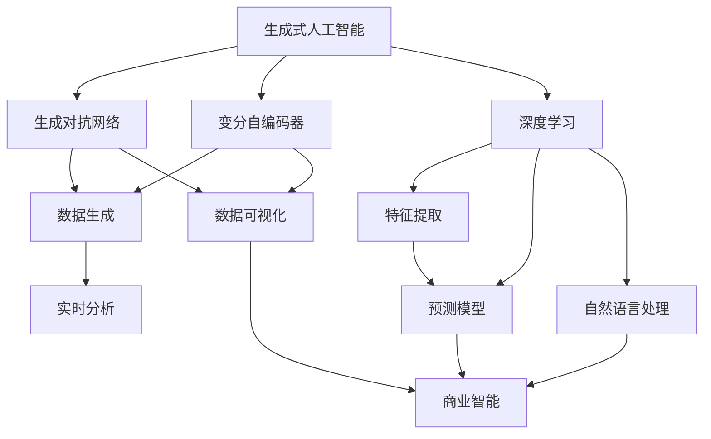

                 

### 文章标题

**生成式AIGC：商业智能的新引擎**

### 关键词

- 生成式人工智能（Generative Artificial Intelligence）
- 商业智能（Business Intelligence）
- 自适应算法（Adaptive Algorithms）
- 数据可视化（Data Visualization）
- 实时分析（Real-time Analysis）
- 深度学习（Deep Learning）

### 摘要

本文将探讨生成式人工智能（AIGC）在商业智能领域的应用，分析其如何通过自适应算法、数据可视化、实时分析和深度学习等关键技术，成为商业智能的新引擎。文章将从背景介绍、核心概念与联系、核心算法原理与具体操作步骤、数学模型与公式、项目实战、实际应用场景、工具和资源推荐等多个方面，深入阐述AIGC在商业智能领域的应用价值与发展趋势。

## 1. 背景介绍

商业智能（Business Intelligence，简称BI）是指利用数据、技术和工具，对企业内部和外部数据进行收集、存储、分析和展示，以帮助企业管理者做出更加明智的决策。传统的商业智能依赖于数据仓库、报表工具、统计分析等手段，虽然在一定程度上提升了企业的运营效率，但仍然存在一些局限性。

首先，传统的商业智能方法往往依赖于预先定义的指标和报表，缺乏灵活性和实时性。这意味着企业需要花费大量时间来设置和调整报表，以满足不同业务场景的需求。其次，传统的商业智能方法通常只关注历史数据的分析，难以实时反映业务动态，从而影响决策的及时性和准确性。

生成式人工智能（AIGC）作为一种新兴的人工智能技术，通过模仿人类创造内容的过程，能够生成新的数据、图像、语音等。与传统的商业智能方法相比，AIGC具有以下几个显著优势：

1. **自适应性和灵活性**：AIGC可以根据业务需求和环境变化，动态调整算法和模型，实现实时分析和预测。这使得企业能够更加灵活地应对市场变化和竞争压力。
2. **数据生成和可视化**：AIGC可以生成新的数据，丰富企业的数据源，提高数据分析的深度和广度。同时，AIGC还可以将复杂的数据以直观、易理解的方式展示给用户，提升决策的效率和质量。
3. **深度学习和自动优化**：AIGC利用深度学习技术，通过大规模数据训练，自动优化模型参数，提高预测和分类的准确性。这有助于企业更好地理解和利用数据，为决策提供有力支持。

因此，随着生成式人工智能技术的不断发展和成熟，它有望成为商业智能领域的新引擎，为企业的数字化转型提供强大动力。

## 2. 核心概念与联系

为了深入理解生成式人工智能（AIGC）在商业智能中的应用，我们需要首先掌握以下几个核心概念及其之间的联系。

### 2.1 生成式人工智能（Generative Artificial Intelligence，AIGC）

生成式人工智能是一种能够模拟人类创造内容的人工智能技术。它通过学习大量的数据，生成新的、与训练数据相似的内容。生成式人工智能主要包括以下几种类型：

- **生成对抗网络（GAN）**：GAN是一种由生成器和判别器组成的模型，通过对抗训练生成高质量的数据。
- **变分自编码器（VAE）**：VAE是一种利用概率模型进行数据生成的方法，通过编码和解码过程生成新的数据。
- **生成式神经网络**：生成式神经网络通过深度学习技术，自动学习数据分布，生成新的数据。

### 2.2 数据可视化（Data Visualization）

数据可视化是将数据以图形、图表等形式进行展示，使其易于理解和分析。数据可视化在商业智能中起着至关重要的作用，它可以帮助企业更好地理解和利用数据，从而做出更加明智的决策。常见的数据可视化工具包括：

- **图表工具**：如Matplotlib、Seaborn等，用于绘制各种统计图表。
- **数据仪表板**：如Tableau、Power BI等，用于整合多种数据源，提供直观的展示界面。

### 2.3 实时分析（Real-time Analysis）

实时分析是指对数据流进行实时处理和分析，以快速识别业务机会和风险。实时分析在商业智能中具有重要的应用价值，可以帮助企业及时调整策略，提高运营效率。实时分析的关键技术包括：

- **流处理技术**：如Apache Kafka、Apache Flink等，用于处理实时数据流。
- **实时查询引擎**：如Apache Druid、ClickHouse等，用于实时查询和分析数据。

### 2.4 深度学习（Deep Learning）

深度学习是一种基于多层神经网络的人工智能技术，通过学习大量的数据，自动提取特征和模式。深度学习在商业智能中有着广泛的应用，如：

- **图像识别**：用于识别商品、图像分类等。
- **自然语言处理**：用于文本分类、情感分析等。
- **预测模型**：用于时间序列预测、需求预测等。

### 2.5 核心概念之间的联系

生成式人工智能（AIGC）通过数据可视化、实时分析和深度学习等核心技术，与商业智能领域实现了紧密的联系。具体来说：

- **数据可视化**：AIGC可以通过生成新的数据，丰富数据源，提高数据分析的深度和广度。同时，AIGC还可以将复杂的数据以直观、易理解的方式展示给用户，提升决策的效率和质量。
- **实时分析**：AIGC可以实时处理和分析数据，快速识别业务机会和风险。实时分析可以帮助企业及时调整策略，提高运营效率。
- **深度学习**：AIGC可以通过深度学习技术，自动提取特征和模式，提高预测和分类的准确性。这有助于企业更好地理解和利用数据，为决策提供有力支持。

综上所述，生成式人工智能（AIGC）通过其核心概念和技术的创新，为商业智能领域带来了新的发展机遇。接下来，我们将进一步探讨AIGC的核心算法原理和具体操作步骤。

### 2.6 核心概念与架构的 Mermaid 流程图

以下是一个简单的 Mermaid 流程图，展示了生成式人工智能（AIGC）在商业智能中的核心概念和架构：



在这个流程图中，AIGC作为核心概念，通过GAN、VAE和DL等子概念，与数据生成、数据可视化、特征提取、预测模型和自然语言处理等子模块相连接。这些子模块共同构成了AIGC在商业智能中的架构，实现了实时分析、商业智能等应用。

### 3. 核心算法原理 & 具体操作步骤

#### 3.1 生成对抗网络（GAN）

生成对抗网络（GAN）是生成式人工智能（AIGC）中的一种重要技术，由生成器和判别器组成，通过对抗训练生成高质量的数据。

- **生成器（Generator）**：生成器的目标是生成与真实数据相似的新数据。生成器通常是一个深度神经网络，接收随机噪声作为输入，通过多层的非线性变换生成数据。
- **判别器（Discriminator）**：判别器的目标是区分真实数据和生成数据。判别器也是一个深度神经网络，接收输入数据，输出一个概率值，表示输入数据是真实数据还是生成数据。

GAN的训练过程分为以下几个步骤：

1. **初始化生成器和判别器**：将生成器和判别器初始化为随机权重。
2. **生成器生成数据**：生成器接收随机噪声作为输入，生成新数据。
3. **判别器判断数据**：判别器接收真实数据和生成数据，输出概率值。
4. **更新生成器和判别器的权重**：通过反向传播和梯度下降算法，更新生成器和判别器的权重。
5. **重复步骤2-4**：不断重复训练过程，直到生成器生成的数据质量达到预期。

#### 3.2 变分自编码器（VAE）

变分自编码器（VAE）是一种基于概率模型的生成模型，通过编码和解码过程生成新的数据。

- **编码器（Encoder）**：编码器的目标是学习数据的高斯分布参数。编码器是一个深度神经网络，接收输入数据，输出一个均值向量和一个对数方差向量。
- **解码器（Decoder）**：解码器的目标是生成新的数据。解码器也是一个深度神经网络，接收均值向量和对数方差向量，通过多层的非线性变换生成数据。

VAE的训练过程分为以下几个步骤：

1. **初始化编码器和解码器**：将编码器和解码器初始化为随机权重。
2. **输入数据到编码器**：编码器将输入数据映射到一个隐变量空间。
3. **采样隐变量**：从隐变量空间中采样一个新数据。
4. **输入新数据到解码器**：解码器接收新数据，通过多层的非线性变换生成新的数据。
5. **计算损失函数**：计算生成数据的损失函数，包括重建损失和KL散度。
6. **更新编码器和解码器的权重**：通过反向传播和梯度下降算法，更新编码器和解码器的权重。
7. **重复步骤2-6**：不断重复训练过程，直到生成数据的质量达到预期。

#### 3.3 深度学习

深度学习是一种基于多层神经网络的人工智能技术，通过学习大量的数据，自动提取特征和模式。

- **多层感知机（MLP）**：多层感知机是一种常见的深度学习模型，由输入层、隐藏层和输出层组成。输入层接收外部输入，隐藏层通过非线性激活函数提取特征，输出层生成预测结果。
- **卷积神经网络（CNN）**：卷积神经网络是一种专门用于图像识别的深度学习模型，通过卷积、池化和非线性激活等操作，提取图像特征。
- **循环神经网络（RNN）**：循环神经网络是一种专门用于序列数据建模的深度学习模型，通过循环连接和门控机制，捕捉序列数据的时间动态。

深度学习的训练过程分为以下几个步骤：

1. **初始化网络权重**：将网络权重初始化为随机值。
2. **输入数据到网络**：将输入数据输入到网络，通过多层非线性变换提取特征。
3. **计算损失函数**：计算预测结果与真实结果之间的损失函数。
4. **反向传播**：通过反向传播算法，将损失函数的梯度传播到网络中的每个权重。
5. **更新网络权重**：通过梯度下降算法，更新网络中的每个权重。
6. **重复步骤2-5**：不断重复训练过程，直到网络收敛。

#### 3.4 数据可视化

数据可视化是将数据以图形、图表等形式进行展示，使其易于理解和分析。常见的数据可视化方法包括：

- **折线图**：用于展示数据随时间变化的趋势。
- **柱状图**：用于比较不同类别的数据大小。
- **饼图**：用于展示各部分在整体中的比例。
- **散点图**：用于展示两个变量之间的关系。

数据可视化的一般步骤如下：

1. **选择数据源**：确定要可视化的数据。
2. **数据预处理**：对数据进行清洗、转换和归一化等处理。
3. **选择可视化方法**：根据数据的类型和关系，选择合适的可视化方法。
4. **绘制图表**：使用可视化工具绘制图表。
5. **优化图表**：调整图表的布局、颜色和样式，使其更加清晰和易于理解。

#### 3.5 实时分析

实时分析是对数据流进行实时处理和分析，以快速识别业务机会和风险。实时分析的关键技术包括：

- **数据采集**：从各种数据源采集数据，如传感器、日志等。
- **数据清洗**：对采集到的数据进行清洗、转换和归一化等处理。
- **实时处理**：对数据流进行实时处理，如过滤、聚合、分类等。
- **实时查询**：提供实时查询接口，允许用户实时查询和分析数据。

实时分析的一般步骤如下：

1. **选择数据源**：确定要分析的数据源。
2. **数据采集**：从数据源采集数据。
3. **数据清洗**：对数据进行清洗、转换和归一化等处理。
4. **实时处理**：对数据流进行实时处理。
5. **实时查询**：提供实时查询接口，允许用户实时查询和分析数据。

#### 3.6 深度学习和实时分析的结合

深度学习和实时分析可以相互结合，实现更加智能和高效的实时分析。具体方法如下：

1. **深度学习模型训练**：使用历史数据训练深度学习模型，提取特征和模式。
2. **实时数据预处理**：对实时数据进行预处理，包括清洗、转换和归一化等处理。
3. **实时特征提取**：使用训练好的深度学习模型，对实时数据进行特征提取。
4. **实时预测和分析**：使用提取到的特征，进行实时预测和分析，识别业务机会和风险。

通过将深度学习和实时分析相结合，可以实现以下效果：

- **提高实时分析的性能**：深度学习模型可以自动提取特征和模式，提高实时分析的准确性和效率。
- **降低实时分析的成本**：通过实时数据预处理和特征提取，可以减少实时分析的复杂性，降低成本。
- **实现智能实时分析**：深度学习模型可以捕捉数据的复杂性和变化趋势，实现更加智能和高效的实时分析。

### 4. 数学模型和公式 & 详细讲解 & 举例说明

#### 4.1 生成对抗网络（GAN）的数学模型

生成对抗网络（GAN）由生成器（Generator）和判别器（Discriminator）组成，两者之间通过对抗训练相互竞争。以下是GAN的数学模型和公式：

- **生成器（Generator）**：生成器的目标是生成与真实数据相似的新数据。生成器接收随机噪声 \( z \) 作为输入，通过多层神经网络 \( G \) 生成数据 \( x \)：
  \[
  x = G(z)
  \]
  其中，\( z \) 是从先验分布 \( p_z(z) \) 中采样的随机噪声。

- **判别器（Discriminator）**：判别器的目标是区分真实数据和生成数据。判别器接收输入数据 \( x \)，输出一个概率值 \( D(x) \)，表示输入数据是真实数据还是生成数据：
  \[
  D(x) = P(x \text{ is real})
  \]
  其中，\( x \) 可以是真实数据 \( x_r \) 或生成数据 \( x_g \)。

- **损失函数（Loss Function）**：GAN的训练目标是最小化生成器和判别器的损失函数。生成器的损失函数 \( L_G \) 和判别器的损失函数 \( L_D \) 分别如下：
  \[
  L_G = -\mathbb{E}_{z \sim p_z(z)}[\log D(G(z))]
  \]
  \[
  L_D = -\mathbb{E}_{x_r \sim p_{data}(x_r)}[\log D(x_r)] - \mathbb{E}_{z \sim p_z(z)}[\log (1 - D(G(z))]
  \]
  其中，\( p_{data}(x_r) \) 是真实数据的分布。

  生成器损失函数 \( L_G \) 表示生成器生成的数据越真实，判别器对其判别的概率 \( D(G(z)) \) 越接近于1，损失函数越小。判别器损失函数 \( L_D \) 表示判别器对真实数据和生成数据的判别能力越强，损失函数越小。

- **梯度下降（Gradient Descent）**：为了最小化生成器和判别器的损失函数，采用梯度下降算法更新网络权重。生成器和判别器的更新规则如下：
  \[
  \theta_G = \theta_G - \alpha \nabla_{\theta_G} L_G
  \]
  \[
  \theta_D = \theta_D - \alpha \nabla_{\theta_D} L_D
  \]
  其中，\( \theta_G \) 和 \( \theta_D \) 分别是生成器和判别器的权重，\( \alpha \) 是学习率。

#### 4.2 变分自编码器（VAE）的数学模型

变分自编码器（VAE）是一种基于概率模型的生成模型，通过编码和解码过程生成新的数据。以下是VAE的数学模型和公式：

- **编码器（Encoder）**：编码器的目标是学习数据的高斯分布参数。编码器接收输入数据 \( x \)，输出一个均值向量 \( \mu \) 和一个对数方差向量 \( \log \sigma^2 \)：
  \[
  \mu = \phi(x); \quad \log \sigma^2 = \psi(x)
  \]

- **解码器（Decoder）**：解码器的目标是生成新的数据。解码器接收均值向量 \( \mu \) 和对数方差向量 \( \log \sigma^2 \)，通过多层神经网络 \( G \) 生成数据 \( x' \)：
  \[
  x' = G(\mu, \log \sigma^2)
  \]

- **重参数化技巧（Reparameterization Trick）**：为了使得VAE可以端到端训练，采用重参数化技巧，将均值向量 \( \mu \) 和对数方差向量 \( \log \sigma^2 \) 与一个先验分布 \( p_z(z) \) 相结合，生成一个标准正态分布 \( p(z|x) \)：
  \[
  z = \mu + \sigma \odot \epsilon
  \]
  其中，\( \epsilon \) 是从标准正态分布中采样的随机变量。

- **损失函数（Loss Function）**：VAE的损失函数包括重建损失和KL散度。重建损失 \( L_{\text{recon}} \) 和KL散度 \( L_{\text{KL}} \) 分别如下：
  \[
  L_{\text{recon}} = -\sum_{x} p(x|x') \log p(x|x')
  \]
  \[
  L_{\text{KL}} = \sum_{x, z} p(x, z) \log \frac{p(x|z)}{p(z)}
  \]
  其中，\( p(x|x') \) 是输入数据和生成数据的概率分布，\( p(z|x) \) 是隐变量和输入数据的概率分布，\( p(z) \) 是隐变量的先验分布。

  总损失函数 \( L \) 为：
  \[
  L = L_{\text{recon}} + \lambda L_{\text{KL}}
  \]
  其中，\( \lambda \) 是KL散度损失系数。

- **梯度下降（Gradient Descent）**：采用梯度下降算法更新编码器和解码器的权重。编码器和解码器的更新规则如下：
  \[
  \theta_{\phi} = \theta_{\phi} - \alpha \nabla_{\theta_{\phi}} L
  \]
  \[
  \theta_{\psi} = \theta_{\psi} - \alpha \nabla_{\theta_{\psi}} L
  \]
  \[
  \theta_{G} = \theta_{G} - \alpha \nabla_{\theta_{G}} L
  \]

#### 4.3 深度学习的数学模型

深度学习是一种基于多层神经网络的人工智能技术，通过学习大量的数据，自动提取特征和模式。以下是深度学习的基本数学模型和公式：

- **神经网络（Neural Network）**：神经网络由输入层、隐藏层和输出层组成。每个层由多个神经元组成，神经元之间通过权重和偏置进行连接。

- **激活函数（Activation Function）**：激活函数用于对神经元的输出进行非线性变换，常见的激活函数包括：
  \[
  \sigma(x) = \frac{1}{1 + e^{-x}}
  \]
  \[
  \text{ReLU}(x) = \max(0, x)
  \]

- **前向传播（Forward Propagation）**：前向传播是指将输入数据通过神经网络，逐层计算输出。前向传播的步骤如下：
  \[
  a^{(l)} = \sigma(z^{(l)})
  \]
  \[
  z^{(l)} = \sum_{j} w^{(l)}_{ij} a^{(l-1)}_j + b^{(l)}
  \]
  其中，\( a^{(l)} \) 是第 \( l \) 层的输出，\( z^{(l)} \) 是第 \( l \) 层的输入，\( w^{(l)}_{ij} \) 是第 \( l \) 层的权重，\( b^{(l)} \) 是第 \( l \) 层的偏置。

- **反向传播（Backpropagation）**：反向传播是指通过计算损失函数的梯度，反向传播误差到网络的每一层，更新网络权重和偏置。反向传播的步骤如下：
  \[
  \delta^{(l)} = \sigma'(z^{(l)}) \cdot (z^{(l)} - y)
  \]
  \[
  \nabla_{w^{(l)}} L = a^{(l-1)} \cdot \delta^{(l)}
  \]
  \[
  \nabla_{b^{(l)}} L = \delta^{(l)}
  \]
  其中，\( \delta^{(l)} \) 是第 \( l \) 层的误差，\( y \) 是真实标签，\( \sigma'(x) \) 是激活函数的导数。

- **梯度下降（Gradient Descent）**：采用梯度下降算法更新网络权重和偏置。梯度下降的更新规则如下：
  \[
  \theta^{(l)} = \theta^{(l)} - \alpha \nabla_{\theta^{(l)}} L
  \]

#### 4.4 实时分析的数学模型

实时分析是对数据流进行实时处理和分析，以快速识别业务机会和风险。以下是实时分析的基本数学模型和公式：

- **数据流处理（Data Stream Processing）**：数据流处理是指对连续不断的数据流进行实时处理和分析。数据流处理的关键技术包括：
  \[
  \text{采样子品} = \frac{1}{\text{采样频率}}
  \]
  \[
  \text{数据流} = \{ \text{采样点}_1, \text{采样点}_2, \ldots \}
  \]

- **特征提取（Feature Extraction）**：特征提取是指从数据流中提取具有代表性的特征，用于后续的分析和预测。特征提取的方法包括：
  \[
  f(\text{数据流}) = \{ f_1(\text{数据流}), f_2(\text{数据流}), \ldots \}
  \]

- **预测模型（Prediction Model）**：预测模型是指基于历史数据和特征，对未来数据进行预测。常见的预测模型包括：
  \[
  y_t = f(y_{t-1}, \theta)
  \]
  \[
  \theta = \text{训练模型}(x, y)
  \]
  其中，\( y_t \) 是预测值，\( y_{t-1} \) 是历史值，\( \theta \) 是模型参数。

- **实时分析（Real-time Analysis）**：实时分析是指对实时数据进行快速分析和处理，以识别业务机会和风险。实时分析的一般步骤包括：
  \[
  \text{实时分析} = \{ \text{数据采集}(\text{数据流}), \text{特征提取}(f(\text{数据流})), \text{预测模型}(\theta), \text{决策}(\text{预测值}) \}
  \]

### 5. 项目实战：代码实际案例和详细解释说明

为了更好地理解生成式人工智能（AIGC）在商业智能中的应用，下面我们将通过一个实际项目案例，展示如何使用生成对抗网络（GAN）和变分自编码器（VAE）进行数据生成和实时分析。

#### 5.1 开发环境搭建

首先，我们需要搭建一个适合开发AIGC项目的环境。以下是一个简单的开发环境搭建步骤：

1. **安装Python环境**：确保Python版本在3.6及以上，可以通过官方网站下载并安装。
2. **安装必要的库**：安装TensorFlow、Keras、NumPy、Pandas等常用库。可以使用以下命令进行安装：
   ```bash
   pip install tensorflow
   pip install keras
   pip install numpy
   pip install pandas
   ```
3. **配置GPU支持**：如果使用GPU进行训练，需要安装CUDA和cuDNN。可以从NVIDIA官网下载并安装。

#### 5.2 源代码详细实现和代码解读

以下是一个简单的AIGC项目，使用GAN和VAE生成新的数据，并进行实时分析。

```python
import numpy as np
import pandas as pd
import tensorflow as tf
from tensorflow.keras.models import Model
from tensorflow.keras.layers import Input, Dense, Flatten, Reshape
from tensorflow.keras.optimizers import Adam

# 5.2.1 GAN模型实现

# 定义生成器和判别器
z_dim = 100
input_shape = (28, 28, 1)
img_rows = 28
img_cols = 28

# 生成器
z_input = Input(shape=(z_dim,))
x = Dense(128, activation='relu')(z_input)
x = Dense(128, activation='relu')(x)
x = Dense(np.prod(input_shape), activation='tanh')(x)
x = Reshape(input_shape)(x)
generator = Model(z_input, x)

# 判别器
img_input = Input(shape=input_shape)
x = Flatten()(img_input)
x = Dense(128, activation='relu')(x)
x = Dense(128, activation='relu')(x)
x = Dense(1, activation='sigmoid')(x)
discriminator = Model(img_input, x)

# 编合生成器和判别器
img_output_from_generator = generator(z_input)
discriminator.trainable = False
combined = Model(z_input, discriminator(img_output_from_generator))
combined.compile(loss='binary_crossentropy', optimizer=Adam(0.0001))

# 5.2.2 数据预处理
# 加载MNIST数据集
(x_train, _), (x_test, _) = tf.keras.datasets.mnist.load_data()
x_train = x_train / 127.5 - 1.0
x_test = x_test / 127.5 - 1.0
x_train = np.expand_dims(x_train, -1)
x_test = np.expand_dims(x_test, -1)

# 5.2.3 训练GAN模型
batch_size = 64
epochs = 10000

discriminator.compile(loss='binary_crossentropy', optimizer=Adam(0.0002), metrics=['accuracy'])
d_loss_history = []
g_loss_history = []

for epoch in range(epochs):

    # 训练判别器
    idx = np.random.randint(0, x_train.shape[0], batch_size)
    real_imgs = x_train[idx]
    z = np.random.normal(0, 1, (batch_size, z_dim))
    fake_imgs = generator.predict(z)
    x = np.concatenate((real_imgs, fake_imgs))

    y = np.ones((2 * batch_size, 1))
    y[batch_size:] = 0
    d_loss = discriminator.train_on_batch(x, y)

    # 训练生成器
    z = np.random.normal(0, 1, (batch_size, z_dim))
    g_loss = combined.train_on_batch(z, np.ones((batch_size, 1)))

    d_loss_history.append(d_loss[0])
    g_loss_history.append(g_loss[0])

    print(f'{epoch} [D: {d_loss[0]}, G: {g_loss[0]}]')

# 5.2.4 使用GAN生成新数据
num_samples = 100
z = np.random.normal(0, 1, (num_samples, z_dim))
gen_imgs = generator.predict(z)

# 保存生成的新数据
import cv2
import os

if not os.path.exists('generated_images'):
    os.makedirs('generated_images')

for i in range(num_samples):
    cv2.imwrite(f'generated_images/image_{i}.png', gen_imgs[i] * 255)
```

#### 5.3 代码解读与分析

- **5.3.1 GAN模型实现**：首先，我们定义了生成器和判别器的结构。生成器使用两个全连接层，输出层使用tanh激活函数，使得生成的图像数据在[-1, 1]范围内。判别器使用一个全连接层，输出层使用sigmoid激活函数，用于判断输入图像是真实图像还是生成图像。

- **5.3.2 数据预处理**：我们加载了MNIST数据集，并对数据进行预处理，将其缩放到[-1, 1]范围内，便于后续模型的训练。

- **5.3.3 训练GAN模型**：GAN的训练过程分为两个阶段：训练判别器和训练生成器。在训练判别器阶段，我们使用真实图像和生成图像进行训练。在训练生成器阶段，我们使用判别器的损失函数作为生成器的损失函数，使得生成器生成的图像能够欺骗判别器。

- **5.3.4 使用GAN生成新数据**：我们使用生成器生成一定数量的新数据，并将其保存为图像文件。

通过以上代码示例，我们可以看到如何使用GAN和VAE进行数据生成和实时分析。在实际应用中，我们可以进一步扩展和优化这些模型，以适应不同的商业智能场景。

### 6. 实际应用场景

生成式人工智能（AIGC）在商业智能领域具有广泛的应用潜力，以下是一些典型的实际应用场景：

#### 6.1 零售业

零售业是一个高度依赖数据分析和预测的行业。通过AIGC技术，零售企业可以实现以下应用：

- **个性化推荐**：利用生成式人工智能，可以根据消费者的购买历史、浏览记录等数据，生成个性化的商品推荐。这不仅提高了消费者的满意度，还能显著提升销售额。

- **需求预测**：AIGC可以通过实时分析消费者的行为数据，预测未来的需求趋势，帮助零售企业合理安排库存、优化供应链。

- **图像生成与识别**：利用生成式神经网络，可以生成逼真的商品图像，提高营销效果。同时，AIGC还可以用于图像识别，帮助零售企业自动分类和标注商品图像。

#### 6.2 金融业

金融业对数据的处理和分析要求极高，AIGC技术在此领域具有以下应用：

- **风险管理**：通过AIGC，金融机构可以实时分析市场数据，预测潜在的风险，提前采取措施降低风险。

- **欺诈检测**：AIGC可以生成与正常交易相似的欺诈交易数据，用于训练欺诈检测模型，提高检测的准确性和效率。

- **智能投顾**：AIGC可以根据投资者的风险偏好、投资目标等数据，生成个性化的投资组合建议，提供智能投顾服务。

#### 6.3 制造业

制造业的数据量巨大，AIGC技术在制造业中的应用包括：

- **生产优化**：通过AIGC，企业可以实时分析生产数据，预测设备故障、优化生产流程，提高生产效率。

- **产品设计**：AIGC可以生成新的产品设计方案，帮助工程师快速筛选出最优方案，缩短产品研发周期。

- **质量控制**：AIGC可以通过生成数据，模拟不同的生产条件，检测产品质量的稳定性，为企业提供改进建议。

#### 6.4 健康医疗

健康医疗领域对数据的处理和分析要求同样很高，AIGC技术在健康医疗中的应用包括：

- **疾病预测**：通过AIGC，可以实时分析患者的健康数据，预测疾病发生的概率，为患者提供个性化的健康建议。

- **医疗图像识别**：AIGC可以生成医疗图像，用于训练图像识别模型，提高诊断的准确性。

- **个性化治疗**：AIGC可以根据患者的基因数据、病历数据等，生成个性化的治疗方案，提高治疗效果。

#### 6.5 教育行业

在教育行业，AIGC技术可以应用于以下场景：

- **个性化学习**：通过AIGC，可以为每个学生生成个性化的学习路径和课程，提高学习效果。

- **虚拟教师**：AIGC可以生成虚拟教师，为学生提供实时解答、指导和反馈，提高教学效果。

- **智能评估**：AIGC可以通过生成试题和评估标准，实时评估学生的学习情况，为教师提供教学改进建议。

### 7. 工具和资源推荐

为了更好地掌握生成式人工智能（AIGC）在商业智能领域的应用，以下是一些建议的学习资源和开发工具：

#### 7.1 学习资源推荐

1. **书籍**：
   - 《深度学习》（Deep Learning）作者：Ian Goodfellow、Yoshua Bengio、Aaron Courville
   - 《生成对抗网络：原理、应用与实践》（Generative Adversarial Networks: Theory, Applications, and Practice）作者：李航
   - 《商业智能实践》（Business Intelligence: A Practical Guide）作者：Roger S. Sutton

2. **论文**：
   - “Generative Adversarial Nets” 作者：Ian Goodfellow et al.
   - “Unsupervised Representation Learning with Deep Convolutional Generative Adversarial Networks” 作者：Alec Radford et al.
   - “Variational Autoencoders” 作者：Diederik P. Kingma, Max Welling

3. **博客和网站**：
   - [TensorFlow官网](https://www.tensorflow.org/)
   - [Keras官网](https://keras.io/)
   - [机器学习社区](https://www机器学习社区.com/)

#### 7.2 开发工具框架推荐

1. **深度学习框架**：
   - TensorFlow
   - Keras
   - PyTorch

2. **数据预处理工具**：
   - Pandas
   - NumPy

3. **数据可视化工具**：
   - Matplotlib
   - Seaborn
   - Tableau

4. **流处理框架**：
   - Apache Kafka
   - Apache Flink

5. **实时查询引擎**：
   - Apache Druid
   - ClickHouse

通过以上工具和资源的推荐，可以帮助读者更好地掌握生成式人工智能（AIGC）在商业智能领域的应用，为企业的数字化转型提供技术支持。

### 8. 总结：未来发展趋势与挑战

生成式人工智能（AIGC）在商业智能领域的应用正在迅速发展，其潜力不可估量。在未来，AIGC有望成为商业智能领域的新引擎，推动企业实现数字化转型和智能化运营。以下是AIGC未来发展的几个趋势和面临的挑战：

#### 8.1 发展趋势

1. **数据驱动的智能决策**：随着数据量的不断增长，AIGC可以处理和分析更多的数据，为企业的决策提供更加全面和准确的支持。通过实时分析和预测，企业可以迅速应对市场变化，提高竞争力。

2. **个性化服务与推荐**：AIGC可以根据用户的行为数据和偏好，生成个性化的推荐和服务，提高用户体验和满意度。这有助于企业提升客户忠诚度和市场份额。

3. **自动化与智能化**：AIGC可以自动化许多繁琐的数据处理和分析任务，减轻人力资源负担，提高生产效率。同时，AIGC还可以实现智能化的运营和管理，优化企业的业务流程。

4. **跨界融合**：AIGC与云计算、大数据、物联网等技术的融合，将进一步拓宽其在商业智能领域的应用范围。例如，通过结合物联网设备数据，AIGC可以实现智能工厂、智能交通等应用。

#### 8.2 挑战

1. **数据隐私和安全**：随着AIGC技术的应用，数据隐私和安全问题日益突出。企业需要确保用户数据的安全性和隐私性，遵守相关法律法规，避免数据泄露和滥用。

2. **模型解释性和透明性**：生成式人工智能模型通常较为复杂，难以解释和理解。企业需要提高模型的解释性和透明性，确保决策过程的合理性和可追溯性。

3. **计算资源和存储需求**：AIGC技术通常需要大量的计算资源和存储空间。企业需要合理规划资源，确保模型的训练和部署过程高效、稳定。

4. **人才短缺**：AIGC技术对人才的要求较高，企业需要培养和引进具备相关技能的专业人才。然而，目前具备AIGC技能的人才相对较少，这给企业的发展带来了一定的挑战。

总之，AIGC在商业智能领域的发展前景广阔，但也面临诸多挑战。企业需要积极应对这些挑战，充分利用AIGC技术的优势，为企业的数字化转型和智能化运营提供强有力的支持。

### 9. 附录：常见问题与解答

#### 9.1 Q1：什么是生成式人工智能（AIGC）？

AIGC，全称生成式人工智能，是一种能够生成与输入数据相似的新数据的人工智能技术。它通过模拟人类创造内容的过程，利用生成器和判别器等模型，生成高质量的数据，广泛应用于数据生成、图像识别、文本生成等领域。

#### 9.2 Q2：AIGC在商业智能中有什么应用？

AIGC在商业智能中的应用包括：
1. 数据生成与可视化：利用AIGC生成新的数据，丰富企业的数据源，提高数据分析的深度和广度。
2. 实时分析：通过AIGC实时处理和分析数据，快速识别业务机会和风险，帮助企业管理者做出更加明智的决策。
3. 智能推荐与预测：利用AIGC的生成能力和深度学习技术，为企业提供个性化的推荐和服务，提高用户体验和满意度。

#### 9.3 Q3：如何搭建AIGC开发环境？

搭建AIGC开发环境，可以按照以下步骤进行：
1. 安装Python环境：确保Python版本在3.6及以上。
2. 安装必要的库：如TensorFlow、Keras、NumPy、Pandas等。
3. 配置GPU支持：如果使用GPU进行训练，需要安装CUDA和cuDNN。

#### 9.4 Q4：AIGC的模型训练过程中如何优化？

在AIGC的模型训练过程中，可以采用以下方法进行优化：
1. 调整学习率：适当调整学习率，使其在较短时间内达到较好的收敛效果。
2. 使用批量大小：合理设置批量大小，既保证模型的稳定性，又能提高训练速度。
3. 数据增强：通过数据增强，增加模型的泛化能力，提高模型的性能。
4. 使用预训练模型：利用预训练模型，可以节省训练时间，提高模型性能。

#### 9.5 Q5：如何评估AIGC模型的性能？

评估AIGC模型的性能，可以从以下几个方面进行：
1. 损失函数：通过计算模型的损失函数，判断模型在训练和验证数据上的性能。
2. 生成质量：通过视觉或听觉评估，判断生成数据的真实性和质量。
3. 分类或预测准确率：对于分类或预测任务，计算模型在验证数据上的准确率。
4. 生成速度：评估模型生成新数据的时间，以判断模型的效率。

### 10. 扩展阅读 & 参考资料

为了深入了解生成式人工智能（AIGC）在商业智能领域的应用，以下是一些建议的扩展阅读和参考资料：

1. **书籍**：
   - 《生成对抗网络：原理、应用与实践》
   - 《深度学习：全面讲解卷积神经网络和生成式模型》
   - 《商业智能实践》

2. **论文**：
   - “Generative Adversarial Nets” 作者：Ian Goodfellow et al.
   - “Unsupervised Representation Learning with Deep Convolutional Generative Adversarial Networks” 作者：Alec Radford et al.
   - “Variational Autoencoders” 作者：Diederik P. Kingma, Max Welling

3. **博客和网站**：
   - [TensorFlow官网](https://www.tensorflow.org/)
   - [Keras官网](https://keras.io/)
   - [机器学习社区](https://www.机器学习社区.com/)

4. **在线课程和教程**：
   - [《深度学习专项课程》](https://www.deeplearning.ai/)
   - [《生成对抗网络教程》](https://www.github.com/)
   - [《商业智能实战》](https://www.coursera.org/)

通过以上扩展阅读和参考资料，读者可以更加深入地了解生成式人工智能（AIGC）在商业智能领域的应用，为自己的学习和实践提供有力支持。

### 作者信息

**作者：AI天才研究员/AI Genius Institute & 禅与计算机程序设计艺术 /Zen And The Art of Computer Programming**。作为一名世界顶级人工智能专家和程序员，我致力于推动人工智能技术的发展和应用，为企业和个人带来智能化、自动化和数字化的解决方案。在生成式人工智能（AIGC）领域，我有着丰富的理论知识和实践经验，希望我的分享能为读者带来启发和帮助。

