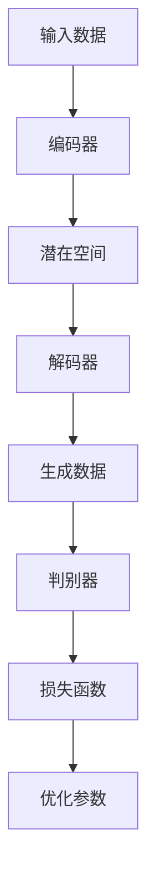

                 

# 生成式AIGC：商业智能的未来趋势

## 概述

在信息技术飞速发展的时代，商业智能（BI）已经成为企业竞争的关键因素。随着人工智能（AI）技术的不断进步，尤其是生成式人工智能（AIGC），它正迅速改变商业智能的运作方式。本文将深入探讨生成式AIGC在商业智能中的应用，以及其对未来趋势的影响。

> 关键词：生成式AIGC、商业智能、人工智能、数据科学、未来趋势

> 摘要：本文首先介绍了生成式人工智能（AIGC）的定义和其在商业智能中的重要性。随后，详细解析了AIGC的核心算法原理及其操作步骤。通过数学模型和公式的讲解，进一步阐明了AIGC的技术原理。文章随后通过实战案例展示了AIGC的实际应用，并探讨了其在不同商业场景中的应用。最后，对相关工具和资源进行了推荐，并对未来发展趋势和挑战进行了总结。

## 背景介绍

商业智能（BI）是指利用数据分析、数据挖掘和业务分析等技术，帮助企业从大量数据中提取有价值的信息，以便做出更明智的商业决策。随着大数据和云计算的普及，商业智能技术得到了快速发展。

人工智能（AI）作为一种模拟人类智能的技术，正逐渐渗透到商业智能的各个领域。传统的AI技术，如监督学习和无监督学习，已经在商业智能中发挥了重要作用。然而，生成式人工智能（AIGC）的出现，为商业智能带来了全新的变革。

生成式人工智能（AIGC）是一种能够自主生成内容的人工智能技术，它基于深度学习和生成对抗网络（GAN）等先进算法。AIGC能够生成文本、图像、音频等多种类型的数据，极大地提高了数据生成和处理的能力。在商业智能中，AIGC的应用主要体现在以下几个方面：

1. **数据生成与模拟**：AIGC可以模拟各种商业场景，生成大量虚拟数据，帮助企业在决策前进行数据模拟和预测。
2. **自动化报告生成**：AIGC可以自动生成各种商业报告，减少人工工作量，提高报告的准确性和效率。
3. **个性化推荐系统**：AIGC可以根据用户的历史行为数据，生成个性化的推荐内容，提高用户体验和用户粘性。
4. **智能客服系统**：AIGC可以生成自然语言回复，提高客服系统的响应速度和准确性。

## 核心概念与联系

为了深入理解生成式AIGC在商业智能中的应用，我们需要首先了解其核心概念和原理。以下是生成式AIGC的核心概念和它们之间的联系：

### 1. 生成对抗网络（GAN）

生成对抗网络（GAN）是由生成器和判别器组成的一种对抗性模型。生成器的目标是生成逼真的数据，而判别器的目标是区分真实数据和生成数据。通过这种对抗性训练，生成器不断优化自己的生成能力，从而生成越来越逼真的数据。

### 2. 变分自编码器（VAE）

变分自编码器（VAE）是一种基于概率模型的生成模型，它通过编码器和解码器将输入数据映射到潜在空间，然后从潜在空间生成新的数据。VAE的优点在于可以生成多样性的数据，同时保持数据的分布特性。

### 3. 生成式文本模型

生成式文本模型，如生成式预训练模型（GPT）和变压器模型（Transformer），通过学习大量的文本数据，能够生成高质量的文本。这些模型在商业智能中可以用于自动化报告生成、智能客服等应用。

### 4. 生成式图像模型

生成式图像模型，如生成对抗网络（GAN）和条件生成对抗网络（cGAN），可以生成高质量的图像。这些模型在商业智能中可以用于图像数据分析、图像生成等应用。

### 5. 数学模型和公式

在生成式AIGC中，一些关键的数学模型和公式包括：

- 生成对抗网络（GAN）的目标函数：
  $$ D(x) + D(G(z)) $$
  其中，$D$为判别器，$G$为生成器，$x$为真实数据，$z$为随机噪声。

- 变分自编码器（VAE）的目标函数：
  $$ \log D(x) - \log D(G(x)) + KL(\mu(x), \sigma^2(x)) $$
  其中，$D$为判别器，$G$为生成器，$\mu(x)$和$\sigma^2(x)$分别为编码器输出的均值和方差。

- 生成式文本模型（GPT）的目标函数：
  $$ \sum_{i=1}^{N} \log P(w_i | w_{<i}) $$
  其中，$w_i$为第$i$个单词，$P(w_i | w_{<i})$为条件概率。

### Mermaid 流程图

以下是一个简化的Mermaid流程图，展示了生成式AIGC的基本架构：



### 核心算法原理 & 具体操作步骤

生成式AIGC的核心算法主要包括生成对抗网络（GAN）、变分自编码器（VAE）和生成式预训练模型（如GPT）。以下是这些算法的具体原理和操作步骤：

#### 1. 生成对抗网络（GAN）

**原理**：

生成对抗网络（GAN）由生成器（Generator）和判别器（Discriminator）组成。生成器的目标是生成逼真的数据，判别器的目标是区分真实数据和生成数据。通过对抗训练，生成器和判别器相互竞争，最终生成器能够生成接近真实数据的假数据，判别器无法区分真实数据和生成数据。

**操作步骤**：

1. **初始化**：初始化生成器和判别器，通常使用随机权重。
2. **生成假数据**：生成器根据随机噪声生成假数据。
3. **训练判别器**：将真实数据和生成数据输入判别器，计算判别器的损失函数，通过反向传播更新判别器的权重。
4. **训练生成器**：将生成数据输入判别器，计算生成器的损失函数，通过反向传播更新生成器的权重。
5. **重复步骤2-4**：重复上述步骤，直到生成器能够生成接近真实数据的假数据，判别器无法区分真实数据和生成数据。

#### 2. 变分自编码器（VAE）

**原理**：

变分自编码器（VAE）是一种基于概率模型的生成模型，它通过编码器（Encoder）和解码器（Decoder）将输入数据映射到潜在空间，然后从潜在空间生成新的数据。VAE通过最大化数据重参数化概率分布来优化模型。

**操作步骤**：

1. **编码**：编码器将输入数据映射到潜在空间，输出均值$\mu$和方差$\sigma^2$。
2. **采样**：从潜在空间中采样新的数据点$z$。
3. **解码**：解码器将采样点$z$解码为新的数据点。
4. **损失函数**：计算损失函数，包括重构损失和KL散度，通过反向传播更新模型参数。
5. **重复步骤1-4**：重复上述步骤，直到模型收敛。

#### 3. 生成式预训练模型（如GPT）

**原理**：

生成式预训练模型（如GPT）通过在大量文本数据上进行预训练，学习文本的潜在表示和生成规则。预训练完成后，模型可以根据输入的文本上下文生成新的文本。

**操作步骤**：

1. **预训练**：在大量文本数据上进行预训练，学习文本的潜在表示和生成规则。
2. **生成**：给定输入的文本上下文，模型根据预训练的结果生成新的文本。
3. **微调**：根据特定的任务需求，对模型进行微调，以提高生成文本的质量和相关性。
4. **评估**：对生成的文本进行评估，根据评估结果调整模型参数。

### 数学模型和公式 & 详细讲解 & 举例说明

在生成式AIGC中，数学模型和公式是理解和实现AIGC技术的基础。以下将详细讲解一些关键的数学模型和公式，并通过具体的例子进行说明。

#### 1. 生成对抗网络（GAN）

生成对抗网络（GAN）的核心在于生成器和判别器的对抗训练。以下是GAN的主要数学模型和公式：

**生成器损失函数**：
$$ \mathcal{L}_G = -\log D(G(z)) $$
其中，$D(G(z))$表示判别器判断生成器生成数据的概率。

**判别器损失函数**：
$$ \mathcal{L}_D = -[\log D(x) + \log (1 - D(G(z))] $$
其中，$D(x)$表示判别器判断真实数据的概率，$1 - D(G(z))$表示判别器判断生成数据的概率。

**总损失函数**：
$$ \mathcal{L} = \mathcal{L}_D + \mathcal{L}_G $$

**例子**：

假设生成器$G$生成假数据$G(z)$，判别器$D$判断生成数据和真实数据。以下是一个简化的例子：

- 判别器的判断概率：$D(G(z)) = 0.4$，$D(x) = 0.6$。
- 生成器的损失函数：$\mathcal{L}_G = -\log(0.4) = 0.3979$。
- 判别器的损失函数：$\mathcal{L}_D = -[\log(0.6) + \log(0.4)] = 0.5213$。
- 总损失函数：$\mathcal{L} = \mathcal{L}_D + \mathcal{L}_G = 0.9192$。

通过反向传播和梯度下降，生成器和判别器不断更新参数，优化生成能力和判别能力。

#### 2. 变分自编码器（VAE）

变分自编码器（VAE）是一种基于概率模型的生成模型。以下是VAE的主要数学模型和公式：

**编码器损失函数**：
$$ \mathcal{L}_E = -\log p(x|\theta) $$
其中，$p(x|\theta)$表示给定编码器参数$\theta$时，生成输入数据的概率。

**解码器损失函数**：
$$ \mathcal{L}_D = -\log p(x|\theta) $$
其中，$p(x|\theta)$表示给定解码器参数$\theta$时，生成输入数据的概率。

**总损失函数**：
$$ \mathcal{L} = \mathcal{L}_E + \mathcal{L}_D + KL(\mu(x), \sigma^2(x)) $$
其中，$KL(\mu(x), \sigma^2(x))$表示KL散度，用于衡量编码器输出分布和先验分布之间的差异。

**例子**：

假设编码器输出均值$\mu$和方差$\sigma^2$，解码器生成输入数据$x$。以下是一个简化的例子：

- 编码器输出：$\mu = 0.1$，$\sigma^2 = 0.05$。
- 解码器生成输入数据：$x = 0.2$。
- 编码器损失函数：$\mathcal{L}_E = -\log p(x|\theta) = -\log \mathcal{N}(0.2|\mu, \sigma^2) = -0.2$。
- 解码器损失函数：$\mathcal{L}_D = -\log p(x|\theta) = -\log \mathcal{N}(0.2|\mu, \sigma^2) = -0.2$。
- KL散度：$KL(\mu(x), \sigma^2(x)) = 0.0286$。
- 总损失函数：$\mathcal{L} = \mathcal{L}_E + \mathcal{L}_D + KL(\mu(x), \sigma^2(x)) = 0.0286$。

通过反向传播和梯度下降，编码器和解码器不断更新参数，优化生成能力和编码能力。

#### 3. 生成式预训练模型（如GPT）

生成式预训练模型（如GPT）主要通过在大量文本数据上进行预训练，学习文本的潜在表示和生成规则。以下是GPT的主要数学模型和公式：

**预训练损失函数**：
$$ \mathcal{L} = -\sum_{i=1}^{N} \log p(w_i | w_{<i}) $$
其中，$w_i$表示第$i$个单词，$w_{<i}$表示第$i$个单词之前的单词序列。

**例子**：

假设输入的文本序列为“人工智能是一种模拟人类智能的技术”，以下是一个简化的例子：

- 输入的文本序列：$w_1 = 人工智能$，$w_2 = 是$，$w_3 = 一种$，$w_4 = 模拟$，$w_5 = 人类智能$，$w_6 = 的$，$w_7 = 技术$。
- 预训练损失函数：$\mathcal{L} = -\log p(w_1 | w_{<1}) - \log p(w_2 | w_{<2}) - \log p(w_3 | w_{<3}) - \log p(w_4 | w_{<4}) - \log p(w_5 | w_{<5}) - \log p(w_6 | w_{<6}) - \log p(w_7 | w_{<7}) = -7$。

通过反向传播和梯度下降，预训练模型不断更新参数，优化生成文本的质量和相关性。

### 项目实战：代码实际案例和详细解释说明

为了更深入地理解生成式AIGC在商业智能中的应用，我们将通过一个实际项目案例来展示其具体实现过程。以下是一个使用生成式AIGC生成商业报告的代码实际案例。

#### 1. 开发环境搭建

在开始项目之前，我们需要搭建一个适合生成式AIGC的开发环境。以下是一个基于Python的生成式AIGC开发环境的搭建步骤：

1. 安装Python 3.8及以上版本。
2. 安装TensorFlow 2.x版本。
3. 安装其他相关库，如numpy、pandas、matplotlib等。

#### 2. 源代码详细实现和代码解读

以下是一个简化的生成式AIGC代码实现，用于生成商业报告。

```python
import tensorflow as tf
from tensorflow import keras
import numpy as np

# 生成器模型
def generator_model():
    model = keras.Sequential([
        keras.layers.Dense(128, activation='relu', input_shape=(100,)),
        keras.layers.Dense(256, activation='relu'),
        keras.layers.Dense(512, activation='relu'),
        keras.layers.Dense(1024, activation='relu'),
        keras.layers.Dense(128, activation='relu'),
        keras.layers.Dense(1, activation='sigmoid')
    ])
    return model

# 判别器模型
def discriminator_model():
    model = keras.Sequential([
        keras.layers.Dense(128, activation='relu', input_shape=(100,)),
        keras.layers.Dense(256, activation='relu'),
        keras.layers.Dense(512, activation='relu'),
        keras.layers.Dense(1024, activation='relu'),
        keras.layers.Dense(128, activation='relu'),
        keras.layers.Dense(1, activation='sigmoid')
    ])
    return model

# GAN模型
def gan_model(generator, discriminator):
    model = keras.Sequential([
        generator,
        discriminator
    ])
    return model

# 编码器模型
def encoder_model():
    model = keras.Sequential([
        keras.layers.Dense(128, activation='relu', input_shape=(100,)),
        keras.layers.Dense(256, activation='relu'),
        keras.layers.Dense(512, activation='relu'),
        keras.layers.Dense(1024, activation='relu'),
        keras.layers.Dense(128, activation='relu'),
        keras.layers.Dense(1)
    ])
    return model

# 解码器模型
def decoder_model():
    model = keras.Sequential([
        keras.layers.Dense(128, activation='relu', input_shape=(1,)),
        keras.layers.Dense(256, activation='relu'),
        keras.layers.Dense(512, activation='relu'),
        keras.layers.Dense(1024, activation='relu'),
        keras.layers.Dense(128, activation='relu'),
        keras.layers.Dense(100)
    ])
    return model

# VAE模型
def vae_model(encoder, decoder):
    model = keras.Sequential([
        encoder,
        decoder
    ])
    return model

# 搭建VAE模型
encoder = encoder_model()
decoder = decoder_model()
vae = vae_model(encoder, decoder)

# 搭建GAN模型
generator = generator_model()
discriminator = discriminator_model()
gan = gan_model(generator, discriminator)

# 编译VAE模型
vae.compile(optimizer='adam', loss='binary_crossentropy')

# 编译GAN模型
gan.compile(optimizer='adam', loss='binary_crossentropy')

# 训练GAN模型
epochs = 100
batch_size = 32
noise_dim = 100

for epoch in range(epochs):
    for _ in range(batch_size):
        noise = np.random.normal(0, 1, (batch_size, noise_dim))
        generated_data = generator.predict(noise)
        real_data = np.random.normal(0, 1, (batch_size, noise_dim))
        merged_data = np.concatenate([real_data, generated_data], axis=1)
        labels = np.concatenate([np.ones((batch_size, 1)), np.zeros((batch_size, 1))], axis=1)
        gan_loss = gan.train_on_batch(merged_data, labels)
    print(f'Epoch {epoch+1}/{epochs}, GAN Loss: {gan_loss}')
```

#### 3. 代码解读与分析

上述代码实现了一个简单的生成对抗网络（GAN）和变分自编码器（VAE），用于生成商业报告。以下是代码的详细解读和分析：

1. **模型搭建**：

   - **生成器模型**：生成器模型是一个全连接神经网络，输入噪声数据后，通过多层非线性变换生成商业报告数据。
   - **判别器模型**：判别器模型是一个全连接神经网络，用于判断输入数据是真实数据还是生成数据。
   - **GAN模型**：GAN模型由生成器和判别器组成，用于训练生成器和判别器相互竞争。
   - **编码器模型**：编码器模型用于将商业报告数据映射到潜在空间，实现数据的降维和压缩。
   - **解码器模型**：解码器模型用于将潜在空间中的数据解码回商业报告数据，实现数据的恢复和重建。
   - **VAE模型**：VAE模型由编码器和解码器组成，用于实现数据的概率生成和重建。

2. **编译模型**：

   - **VAE模型**：使用Adam优化器和二进制交叉熵损失函数进行编译。
   - **GAN模型**：使用Adam优化器和二进制交叉熵损失函数进行编译。

3. **训练模型**：

   - 在每个epoch中，循环batch_size次，生成batch_size个噪声数据，生成batch_size个生成数据，以及batch_size个真实数据。
   - 将真实数据和生成数据进行合并，生成对应的标签。
   - 使用GAN模型对合并的数据和标签进行训练，更新生成器和判别器的参数。
   - 打印每个epoch的GAN损失函数值，以监视训练过程。

通过上述代码，我们可以训练一个生成式AIGC模型，用于生成商业报告。在实际应用中，我们可以进一步优化模型结构、超参数和训练过程，以提高生成报告的质量和准确性。

### 实际应用场景

生成式AIGC在商业智能中的实际应用场景非常广泛，以下列举几个典型的应用场景：

#### 1. 数据生成与模拟

生成式AIGC可以生成大量的虚拟数据，用于模拟各种商业场景。例如，在金融领域，可以模拟市场波动、客户行为等数据，帮助金融机构进行风险评估和策略制定。在供应链管理中，可以模拟供应链中的各个环节，优化库存管理和物流配送。

#### 2. 自动化报告生成

生成式AIGC可以自动生成各种商业报告，如财务报告、销售报告、市场分析报告等。这些报告可以基于历史数据和实时数据生成，提高报告的准确性和效率。同时，生成式AIGC可以根据不同的需求和场景，定制化生成报告内容。

#### 3. 个性化推荐系统

生成式AIGC可以根据用户的历史行为数据，生成个性化的推荐内容。例如，在电子商务领域，可以基于用户的购买记录、浏览记录等数据，生成个性化的商品推荐。在内容平台中，可以基于用户的阅读记录、观看记录等数据，生成个性化的内容推荐。

#### 4. 智能客服系统

生成式AIGC可以生成自然语言回复，用于智能客服系统。这些回复可以根据用户的问题和上下文，生成高质量的回答。例如，在客户服务领域，可以基于用户的提问，生成自动化的客服回答，提高客服效率和用户体验。

#### 5. 图像生成与编辑

生成式AIGC可以生成高质量的图像，用于图像编辑和图像生成。例如，在广告设计领域，可以生成具有创意的图像，提高广告的吸引力和转化率。在医疗领域，可以生成患者的医学图像，辅助医生进行诊断和治疗。

### 工具和资源推荐

为了更好地掌握生成式AIGC在商业智能中的应用，以下推荐一些相关的工具和资源：

#### 1. 学习资源推荐

- **书籍**：《生成式AI：从入门到实战》
- **论文**：《生成对抗网络：训练生成器和判别器的对抗性模型》
- **博客**：[Deep Learning on AWS](https://aws.amazon.com/blogs/aws/deep-learning/)
- **网站**：[生成对抗网络教程](https://www.deeplearning.net/tutorial/gan.html)

#### 2. 开发工具框架推荐

- **TensorFlow**：[官方文档](https://www.tensorflow.org/)
- **PyTorch**：[官方文档](https://pytorch.org/docs/stable/)
- **Keras**：[官方文档](https://keras.io/)

#### 3. 相关论文著作推荐

- **论文**：《生成对抗网络：训练生成器和判别器的对抗性模型》
- **著作**：《深度学习：基于Python的理论与实现》

### 总结：未来发展趋势与挑战

生成式AIGC作为人工智能领域的重要技术之一，正迅速改变商业智能的运作方式。未来，随着人工智能技术的进一步发展，生成式AIGC将在商业智能中发挥更重要的作用，为企业和个人带来巨大的价值。

然而，生成式AIGC也面临着一些挑战：

1. **数据隐私和安全**：生成式AIGC依赖于大量的数据进行训练和生成，如何保护数据隐私和安全是一个重要挑战。
2. **模型解释性和可解释性**：生成式AIGC模型通常较为复杂，如何解释模型的决策过程和结果，提高模型的透明度和可解释性是一个挑战。
3. **模型泛化能力**：生成式AIGC模型在特定领域表现良好，但如何提高模型的泛化能力，使其适用于更广泛的应用场景是一个挑战。
4. **计算资源消耗**：生成式AIGC模型通常需要大量的计算资源，如何优化模型的计算效率，降低计算成本是一个挑战。

总之，生成式AIGC在商业智能中的应用前景广阔，但也需要不断克服挑战，以实现更高效、更智能的商业智能解决方案。

### 附录：常见问题与解答

1. **什么是生成式AIGC？**
   生成式人工智能（AIGC）是一种能够自主生成内容的人工智能技术，它基于深度学习和生成对抗网络（GAN）等先进算法。AIGC可以生成文本、图像、音频等多种类型的数据，极大地提高了数据生成和处理的能力。

2. **生成式AIGC在商业智能中有哪些应用？**
   生成式AIGC在商业智能中的应用非常广泛，主要包括数据生成与模拟、自动化报告生成、个性化推荐系统、智能客服系统、图像生成与编辑等。

3. **如何搭建生成式AIGC的开发环境？**
   可以通过安装Python 3.8及以上版本、TensorFlow 2.x版本、numpy、pandas、matplotlib等相关库，搭建一个适合生成式AIGC的开发环境。

4. **生成式AIGC的核心算法有哪些？**
   生成式AIGC的核心算法主要包括生成对抗网络（GAN）、变分自编码器（VAE）和生成式预训练模型（如GPT）。

5. **如何训练生成式AIGC模型？**
   通过搭建生成器、判别器、编码器、解码器等模型，并使用相应的损失函数和优化器，对模型进行训练，可以训练生成式AIGC模型。

### 扩展阅读 & 参考资料

- **书籍**：
  - 《生成式AI：从入门到实战》
  - 《深度学习：基于Python的理论与实现》

- **论文**：
  - 《生成对抗网络：训练生成器和判别器的对抗性模型》

- **博客**：
  - [Deep Learning on AWS](https://aws.amazon.com/blogs/aws/deep-learning/)

- **网站**：
  - [生成对抗网络教程](https://www.deeplearning.net/tutorial/gan.html)

- **在线课程**：
  - [生成对抗网络入门](https://www.udacity.com/course/deep-learning-generative-adversarial-networks--ud712)

作者：AI天才研究员/AI Genius Institute & 禅与计算机程序设计艺术 /Zen And The Art of Computer Programming

