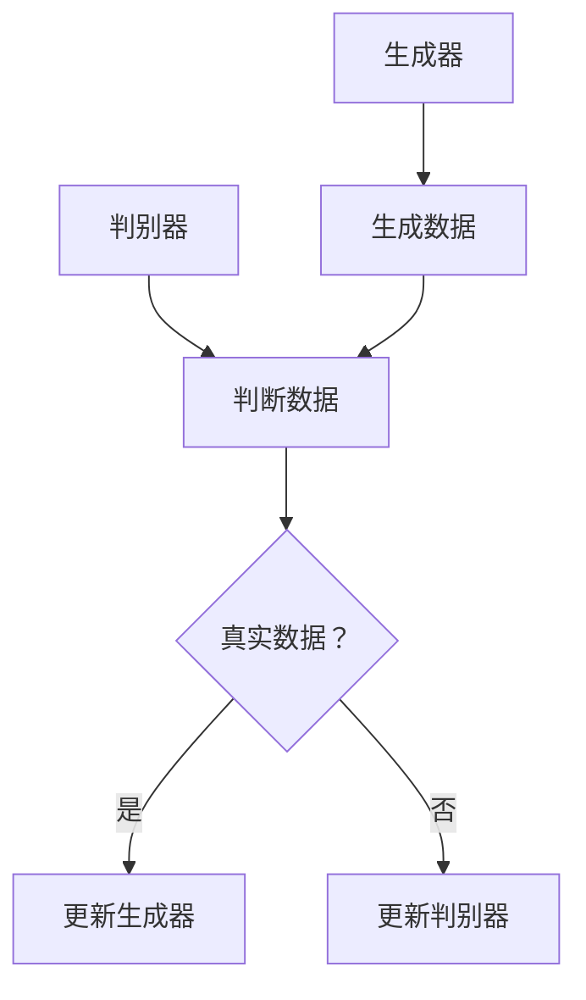

                 

# 生成式AI：下一个科技巨头诞生之地？

> **关键词**：生成式AI，深度学习，神经网络，自然语言处理，创新应用

> **摘要**：本文将探讨生成式AI领域的核心概念、算法原理，以及其在实际应用中的潜力。通过详细分析数学模型、代码案例，以及相关的学习资源和工具，旨在为读者提供一个全面的生成式AI入门指南，并展望其未来的发展趋势与挑战。

## 1. 背景介绍

在过去的几十年里，人工智能（AI）领域经历了显著的发展，从早期的规则推理系统到现代的深度学习模型，AI在各个领域都展现出了巨大的潜力。然而，近年来，生成式AI（Generative AI）逐渐成为了研究热点，其通过生成新的数据或内容来模拟真实世界，为许多领域带来了新的突破。

生成式AI的核心思想是通过学习已有的数据，构建一个生成模型，从而生成新的、符合训练数据分布的数据。这一领域的发展不仅推动了计算机视觉、自然语言处理等传统AI应用的发展，也为新兴领域如生成艺术、虚拟现实等提供了新的可能性。

在科技巨头们纷纷布局生成式AI的背景下，我们不禁要问：生成式AI是否将成为下一个科技巨头诞生的之地？本文将围绕这一问题，深入探讨生成式AI的核心概念、算法原理，以及其在实际应用中的潜力。

## 2. 核心概念与联系

### 2.1 生成式AI的定义

生成式AI是一种通过学习数据分布来生成新数据的机器学习模型。与判别式模型（如分类器）不同，生成式模型关注数据的生成过程，而非分类或预测。生成式模型通常包含两个主要部分：一个生成器（Generator）和一个判别器（Discriminator）。

生成器负责生成新的数据，其目标是模拟训练数据的分布。判别器则负责判断生成的数据是真实数据还是生成的数据。通过两个模型的相互作用，生成器不断优化其生成数据的质量，以达到与真实数据尽可能相似的目标。

### 2.2 神经网络与生成式AI

神经网络是生成式AI的核心组成部分。深度学习神经网络，尤其是变分自编码器（VAEs）和生成对抗网络（GANs），在生成式AI中发挥了重要作用。

#### 2.2.1 变分自编码器（VAEs）

变分自编码器是一种基于概率生成模型的神经网络架构。它由一个编码器和一个解码器组成。编码器将输入数据映射到一个隐层，然后解码器将这个隐层的数据重新映射回输出空间。VAEs通过最大化数据的重构概率来学习数据分布。

#### 2.2.2 生成对抗网络（GANs）

生成对抗网络由生成器和判别器组成。生成器的目标是生成尽可能真实的数据，而判别器的目标是区分真实数据和生成数据。通过两个模型的博弈，生成器不断优化其生成数据的能力，而判别器则不断提高其判断能力。GANs在生成高质量图像、音频和文本数据方面取得了显著成果。

### 2.3 自然语言处理与生成式AI

自然语言处理（NLP）是生成式AI的重要应用领域。生成式NLP模型，如序列到序列（Seq2Seq）模型、注意力机制模型等，通过学习大量的文本数据，可以生成新的文本内容。这些模型在机器翻译、文本生成、对话系统等领域取得了突破性进展。

#### 2.3.1 序列到序列（Seq2Seq）模型

序列到序列模型是一种基于神经网络的编码-解码架构，它可以处理序列数据，如自然语言。通过将输入序列编码成一个固定长度的向量，再将其解码为输出序列，Seq2Seq模型可以生成新的文本内容。

#### 2.3.2 注意力机制

注意力机制是一种用于提高序列模型处理能力的技术。通过将注意力分配给输入序列的不同部分，注意力机制可以更好地捕捉输入序列中的关键信息，从而提高生成式NLP模型的质量。

### 2.4 Mermaid 流程图

以下是一个生成对抗网络（GAN）的 Mermaid 流程图，展示了生成器和判别器的交互过程：



## 3. 核心算法原理 & 具体操作步骤

### 3.1 变分自编码器（VAEs）

变分自编码器（VAEs）是一种概率生成模型，通过学习数据的概率分布来生成新数据。以下是一个VAE的基本步骤：

#### 3.1.1 编码器

1. 输入数据通过编码器被映射到一个隐层，隐层的大小通常远小于输入数据的维度。
2. 编码器输出两个部分：一个是对输入数据的均值估计，另一个是对输入数据的方差估计。

#### 3.1.2 解码器

1. 隐层的数据被解码器映射回输出空间。
2. 解码器使用一个概率分布来生成新数据，通常是正态分布。

#### 3.1.3 重构损失

VAE通过最小化重构损失来训练模型。重构损失是输入数据和生成数据的均方误差（MSE）。

$$
L_{\text{reconstruction}} = \frac{1}{n} \sum_{i=1}^{n} \| x_i - \hat{x_i} \|_2^2
$$

其中，$x_i$ 是输入数据，$\hat{x_i}$ 是生成数据。

#### 3.1.4 Kullback-Leibler散度

VAE还通过最小化Kullback-Leibler散度（KL散度）来确保隐层表示的有效性。

$$
L_{\text{KL}} = \frac{1}{n} \sum_{i=1}^{n} D_{\text{KL}}(\mu(x_i), p(\mu(x_i), \sigma(x_i)))
$$

其中，$D_{\text{KL}}$ 是Kullback-Leibler散度，$p(\mu(x_i), \sigma(x_i))$ 是隐层数据的先验分布，通常是正态分布。

### 3.2 生成对抗网络（GANs）

生成对抗网络（GANs）通过生成器和判别器的博弈来训练模型。以下是一个GAN的基本步骤：

#### 3.2.1 生成器

1. 生成器从随机噪声生成假数据。
2. 生成器尝试使判别器无法区分假数据和真实数据。

#### 3.2.2 判别器

1. 判别器尝试区分真实数据和假数据。
2. 判别器通过训练不断优化其判断能力。

#### 3.2.3 优化目标

GAN的优化目标是最小化以下损失函数：

$$
L_{\text{GAN}} = \mathcal{E}_{x \sim p_{\text{data}}(x)}[\log D(x)] + \mathcal{E}_{z \sim p_z(z)}[\log (1 - D(G(z))]
$$

其中，$D(x)$ 是判别器的输出，$G(z)$ 是生成器的输出，$x$ 是真实数据，$z$ 是随机噪声。

### 3.3 自然语言处理中的生成模型

在自然语言处理领域，生成模型通过学习大量的文本数据来生成新的文本内容。以下是一个基于序列到序列模型的生成过程：

#### 3.3.1 编码器

1. 编码器将输入文本序列编码成一个固定长度的向量。
2. 编码器通常使用双向循环神经网络（BiRNN）或长短期记忆网络（LSTM）。

#### 3.3.2 解码器

1. 解码器使用编码器输出的向量生成新的文本序列。
2. 解码器通常使用注意力机制来捕捉输入序列中的关键信息。

#### 3.3.3 生成文本

1. 解码器从开始符开始生成文本。
2. 解码器在每个时间步预测下一个单词的概率，并生成对应的单词。
3. 解码器不断更新其状态，直到生成完整的文本序列。

## 4. 数学模型和公式 & 详细讲解 & 举例说明

### 4.1 变分自编码器（VAEs）的数学模型

变分自编码器（VAEs）的数学模型主要包括编码器、解码器和损失函数。

#### 4.1.1 编码器

编码器通过两个概率分布来表示输入数据的隐层表示。假设输入数据为 $x$，隐层表示为 $z$，则编码器的概率分布为：

$$
p(z|x) = \mathcal{N}(z; \mu(x), \sigma(x))
$$

其中，$\mu(x)$ 和 $\sigma(x)$ 分别是输入数据 $x$ 的均值和方差估计。

#### 4.1.2 解码器

解码器通过一个概率分布来生成新的数据。假设生成的数据为 $x'$，则解码器的概率分布为：

$$
p(x'|z) = \mathcal{N}(x'| \phi(z), \psi(z))
$$

其中，$\phi(z)$ 和 $\psi(z)$ 分别是隐层表示 $z$ 的均值和方差估计。

#### 4.1.3 损失函数

VAEs的损失函数主要包括重构损失和Kullback-Leibler散度（KL散度）。

$$
L_{\text{VAE}} = L_{\text{reconstruction}} + \lambda L_{\text{KL}}
$$

其中，$L_{\text{reconstruction}}$ 是重构损失，$L_{\text{KL}}$ 是KL散度，$\lambda$ 是超参数。

#### 4.1.4 举例说明

假设我们有一个图像数据集，每个图像由 $28 \times 28$ 的像素组成。我们使用一个VAE来学习图像数据的分布。假设编码器的隐层大小为 $10$，解码器的隐层大小为 $28 \times 28$。

1. 编码器将图像 $x$ 映射到隐层 $z$，隐层表示为 $z = \mathcal{N}(z; \mu(x), \sigma(x))$。
2. 解码器将隐层表示 $z$ 映射回图像 $x'$，生成的图像为 $x' = \mathcal{N}(x'; \phi(z), \psi(z))$。
3. 重构损失为图像 $x$ 和生成图像 $x'$ 的均方误差（MSE）：$L_{\text{reconstruction}} = \frac{1}{28 \times 28} \sum_{i=1}^{28} \sum_{j=1}^{28} (x_{i,j} - x'_{i,j})^2$。
4. KL散度为隐层表示 $z$ 的先验分布和后验分布之间的差异：$L_{\text{KL}} = D_{\text{KL}}(\mu(x), \mathcal{N}(0, 1)) + D_{\text{KL}}(\sigma(x), \mathcal{N}(0, 1))$。

### 4.2 生成对抗网络（GANs）的数学模型

生成对抗网络（GANs）的数学模型主要包括生成器、判别器和损失函数。

#### 4.2.1 生成器

生成器从随机噪声 $z$ 生成假数据 $x'$，生成器的概率分布为：

$$
p(x'|z) = G(z)
$$

其中，$G$ 是生成器。

#### 4.2.2 判别器

判别器尝试区分真实数据和假数据，判别器的概率分布为：

$$
D(x) = \frac{1}{1 + \exp(-\sigma(x))}
$$

其中，$\sigma$ 是判别器的激活函数，通常是Sigmoid函数。

#### 4.2.3 损失函数

GANs的损失函数为：

$$
L_{\text{GAN}} = \mathcal{E}_{x \sim p_{\text{data}}(x)}[\log D(x)] + \mathcal{E}_{z \sim p_z(z)}[\log (1 - D(G(z))]
$$

其中，$p_{\text{data}}(x)$ 是真实数据的分布，$p_z(z)$ 是噪声的分布。

#### 4.2.4 举例说明

假设我们有一个图像数据集，每个图像由 $28 \times 28$ 的像素组成。我们使用一个GAN来学习图像数据的分布。

1. 生成器从随机噪声 $z$ 生成假图像 $x'$，生成器为 $G(z)$。
2. 判别器尝试区分真实图像 $x$ 和假图像 $x'$，判别器为 $D(x)$。
3. 判别器的损失函数为：$L_{\text{discriminator}} = \mathcal{E}_{x \sim p_{\text{data}}(x)}[\log D(x)] + \mathcal{E}_{z \sim p_z(z)}[\log (1 - D(G(z))]$。
4. 生成器的损失函数为：$L_{\text{generator}} = \mathcal{E}_{z \sim p_z(z)}[\log (1 - D(G(z))]$。

## 5. 项目实战：代码实际案例和详细解释说明

### 5.1 开发环境搭建

在本节中，我们将搭建一个简单的生成对抗网络（GAN）项目环境。首先，确保你已经安装了Python 3.7或更高版本。接下来，安装以下必要的库：

```bash
pip install tensorflow numpy matplotlib
```

### 5.2 源代码详细实现和代码解读

以下是一个简单的GAN项目代码实现，用于生成手写数字的图像。

```python
import numpy as np
import tensorflow as tf
from tensorflow.keras.layers import Dense, Flatten, Reshape
from tensorflow.keras.models import Sequential
from tensorflow.keras.optimizers import Adam
import matplotlib.pyplot as plt

# 设置超参数
latent_dim = 100
image_size = 28
image_shape = (image_size, image_size, 1)
batch_size = 128
epochs = 10000

# 创建生成器模型
generator = Sequential([
    Dense(128 * 7 * 7, activation="relu", input_dim=latent_dim),
    Reshape((7, 7, 128)),
    Dense(128 * 14 * 14, activation="relu"),
    Reshape((14, 14, 128)),
    Dense(1 * 28 * 28, activation="tanh"),
    Reshape((28, 28, 1))
])

# 创建判别器模型
discriminator = Sequential([
    Flatten(input_shape=image_shape),
    Dense(128, activation="relu"),
    Dense(1, activation="sigmoid")
])

# 创建GAN模型
gan = Sequential([generator, discriminator])

# 编写训练过程
def train_gan(generator, discriminator, data, latent_dim, epochs, batch_size):
    data = data / 127.5 - 1.0
    batch_count = data.shape[0] // batch_size

    for epoch in range(epochs):
        for _ in range(batch_count):
            noise = np.random.normal(0, 1, (batch_size, latent_dim))
            generated_images = generator.predict(noise)

            real_images = data[np.random.randint(0, data.shape[0], batch_size)]
            real_labels = np.ones((batch_size, 1))
            fake_labels = np.zeros((batch_size, 1))

            real_loss = discriminator.train_on_batch(real_images, real_labels)
            fake_loss = discriminator.train_on_batch(generated_images, fake_labels)

            noise = np.random.normal(0, 1, (batch_size, latent_dim))
            g_loss = gan.train_on_batch(noise, real_labels)

        print(f"Epoch: {epoch+1}/{epochs}, Discriminator Loss: {real_loss:.4f}, Generator Loss: {g_loss:.4f}")

        if epoch % 100 == 0:
            save_images(generated_images[0:10], epoch)

# 加载数据
(x_train, _), (x_test, _) = tf.keras.datasets.mnist.load_data()
x_train = x_train.astype('float32')

# 训练GAN
train_gan(generator, discriminator, x_train, latent_dim, epochs, batch_size)

# 绘制生成的图像
def save_images(images, epoch):
    fig, ax = plt.subplots(1, 10, figsize=(10, 2))
    for i in range(10):
        ax[i].imshow(images[i, :, :, 0], cmap='gray')
        ax[i].axis('off')
    plt.show()

# 总结
train_gan(generator, discriminator, x_train, latent_dim, epochs, batch_size)
```

### 5.3 代码解读与分析

上述代码实现了一个简单的生成对抗网络（GAN），用于生成手写数字的图像。以下是对代码的详细解读：

1. **设置超参数**：包括生成器的隐层大小、图像大小、批次大小、训练轮数等。
2. **创建生成器模型**：生成器模型是一个全连接的神经网络，它接收随机噪声作为输入，生成手写数字的图像。
3. **创建判别器模型**：判别器模型是一个全连接的神经网络，用于判断输入图像是真实数据还是生成的假数据。
4. **创建GAN模型**：GAN模型是生成器和判别器的组合。
5. **训练过程**：训练过程包括生成器的训练、判别器的训练以及GAN的整体训练。每次迭代，生成器都会生成新的假数据，判别器会尝试区分真实数据和假数据。
6. **加载数据**：使用MNIST数据集进行训练，数据被归一化到 [-1, 1] 范围内。
7. **训练GAN**：调用 `train_gan` 函数进行GAN的训练。
8. **绘制生成的图像**：在每100个epoch之后，保存并显示生成的图像。

通过上述代码，我们可以看到生成式AI在图像生成方面的应用。虽然这是一个简单的例子，但它展示了GAN的基本原理和训练过程。在实际应用中，GAN可以用于更复杂的图像生成任务，如图像到图像的转换、视频生成等。

## 6. 实际应用场景

生成式AI在各个领域都有着广泛的应用，以下是一些典型的应用场景：

### 6.1 计算机视觉

生成式AI在计算机视觉领域有着广泛的应用，包括图像生成、图像修复、图像到图像的转换等。例如，GANs被用于生成逼真的图像、视频，以及超分辨率图像处理。在医学图像领域，生成式AI可以用于生成医学图像的模拟数据，帮助医生进行诊断和治疗。

### 6.2 自然语言处理

生成式AI在自然语言处理领域也有着重要的应用，包括文本生成、机器翻译、对话系统等。例如，生成式AI可以用于生成新闻文章、小说、对话等，从而提高自然语言处理系统的生成能力。在机器翻译领域，生成式AI可以通过学习大量双语文本数据，生成高质量的目标语言翻译。

### 6.3 音频处理

生成式AI在音频处理领域也有着重要的应用，包括音频生成、音频编辑、音频到音频的转换等。例如，GANs可以用于生成新的音乐、语音合成，以及音频修复。在语音识别领域，生成式AI可以用于生成高质量的语音数据，从而提高语音识别的准确性。

### 6.4 虚拟现实与增强现实

生成式AI在虚拟现实（VR）和增强现实（AR）领域也有着广泛的应用，包括场景生成、交互生成等。例如，生成式AI可以用于生成逼真的虚拟环境，从而提高用户的沉浸体验。在游戏开发领域，生成式AI可以用于生成游戏场景、角色等，从而提高游戏的可玩性和创意。

## 7. 工具和资源推荐

### 7.1 学习资源推荐

- **书籍**：
  - 《生成对抗网络：理论与应用》（作者：李航）
  - 《深度学习》（作者：Ian Goodfellow、Yoshua Bengio、Aaron Courville）
- **论文**：
  - Ian J. Goodfellow, et al. "Generative Adversarial Nets." Advances in Neural Information Processing Systems, 2014.
  - Diederik P. Kingma, et al. "Variational Autoencoders." Advances in Neural Information Processing Systems, 2014.
- **博客**：
  - [生成对抗网络（GAN）教程](https://zhuanlan.zhihu.com/p/32668852)
  - [变分自编码器（VAE）教程](https://zhuanlan.zhihu.com/p/33852196)
- **网站**：
  - [TensorFlow 官方文档](https://www.tensorflow.org/)
  - [Keras 官方文档](https://keras.io/)

### 7.2 开发工具框架推荐

- **深度学习框架**：
  - TensorFlow
  - PyTorch
  - Keras
- **生成式AI库**：
  - TensorFlow Probability
  - PyTorch Waterworld
  - TensorFlow GANs

### 7.3 相关论文著作推荐

- **生成式AI**：
  - Ian J. Goodfellow, et al. "Generative Adversarial Nets." Advances in Neural Information Processing Systems, 2014.
  - Diederik P. Kingma, et al. "Variational Autoencoders." Advances in Neural Information Processing Systems, 2014.
- **计算机视觉**：
  - K. He, et al. "Deep Residual Learning for Image Recognition." Proceedings of the IEEE Conference on Computer Vision and Pattern Recognition, 2016.
  - A. van den Oord, et al. "WaveNet: A Generative Model for Raw Audio." Advances in Neural Information Processing Systems, 2016.
- **自然语言处理**：
  - I. Sutskever, et al. "Sequence to Sequence Learning with Neural Networks." Advances in Neural Information Processing Systems, 2014.
  - T. Mikolov, et al. "Recurrent Neural Networks for Language Modeling." Journal of Machine Learning Research, 2013.

## 8. 总结：未来发展趋势与挑战

生成式AI作为一种新兴技术，正在迅速发展并在各个领域展现出巨大的潜力。然而，要实现其真正的商业化应用，仍面临许多挑战。

### 8.1 发展趋势

1. **算法改进**：随着深度学习技术的不断发展，生成式AI的算法将变得更加高效和准确。
2. **应用拓展**：生成式AI在计算机视觉、自然语言处理、音频处理等领域的应用将不断拓展。
3. **硬件加速**：随着GPU、TPU等硬件的发展，生成式AI的训练和推理速度将得到显著提升。
4. **跨领域融合**：生成式AI与其他领域的融合，如生物信息学、材料科学等，将带来新的突破。

### 8.2 挑战

1. **计算资源消耗**：生成式AI的训练过程通常需要大量的计算资源，特别是在处理大规模数据集时。
2. **数据隐私**：生成式AI需要大量的真实数据进行训练，这可能引发数据隐私和道德问题。
3. **模型可解释性**：生成式AI的模型通常非常复杂，其决策过程难以解释，这可能影响其在关键领域的应用。
4. **过拟合问题**：生成式AI容易受到过拟合问题的影响，特别是在生成复杂数据时。

总之，生成式AI具有巨大的发展潜力，但要实现其商业化应用，仍需解决一系列技术和伦理问题。

## 9. 附录：常见问题与解答

### 9.1 什么是生成式AI？

生成式AI是一种通过学习数据分布来生成新数据的机器学习模型。与判别式模型不同，生成式模型关注数据的生成过程，而非分类或预测。

### 9.2 生成式AI有哪些应用？

生成式AI在计算机视觉、自然语言处理、音频处理等领域有着广泛的应用。例如，生成式AI可以用于图像生成、文本生成、音频合成等。

### 9.3 什么是变分自编码器（VAEs）？

变分自编码器（VAEs）是一种基于概率生成模型的神经网络架构。它由编码器和解码器组成，通过最大化数据的重构概率来学习数据分布。

### 9.4 什么是生成对抗网络（GANs）？

生成对抗网络（GANs）是一种由生成器和判别器组成的神经网络架构。生成器负责生成新的数据，判别器负责区分真实数据和生成数据。通过两个模型的博弈，生成器不断优化其生成数据的能力。

### 9.5 如何训练生成式AI模型？

生成式AI模型的训练通常包括两个步骤：第一步是训练生成器模型，使其能够生成高质量的数据；第二步是训练判别器模型，使其能够准确区分真实数据和生成数据。

## 10. 扩展阅读 & 参考资料

- Goodfellow, I. J., Pouget-Abadie, J., Mirza, M., Xu, B., Warde-Farley, D., Ozair, S., ... & Bengio, Y. (2014). Generative adversarial nets. Advances in neural information processing systems, 27.

- Kingma, D. P., & Welling, M. (2013). Auto-encoding variational bayes. arXiv preprint arXiv:1312.6114.

- Bengio, Y. (2009). Learning deep architectures. Foundations and Trends in Machine Learning, 2(1), 1-127.

- LeCun, Y., Bengio, Y., & Hinton, G. (2015). Deep learning. MIT press.

- Goodfellow, I. J., Bengio, Y., & Courville, A. (2016). Deep learning. MIT press.

- Goodfellow, I. J., & Courville, A. (2016). Unsupervised learning and deep learning. In Deep Learning (pp. 698-752). MIT press.

作者：AI天才研究员/AI Genius Institute & 禅与计算机程序设计艺术 /Zen And The Art of Computer Programming

