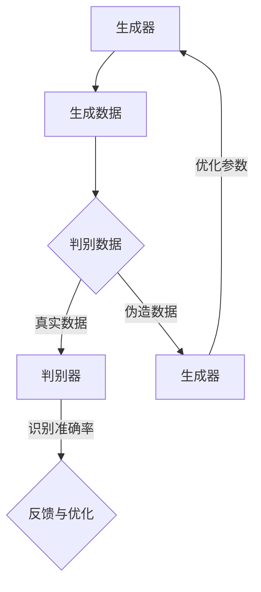

                 

# 生成式 AI：下一个科技巨头诞生之地？

> **关键词**：生成式 AI、科技巨头、AI 发展、技术趋势、算法原理、应用场景

> **摘要**：本文将深入探讨生成式 AI 的概念、原理、核心算法及其应用场景，分析其在科技产业中的重要性，探讨其未来发展趋势与面临的挑战。通过对生成式 AI 的全面解析，希望为读者提供一个清晰、全面的认识，帮助大家更好地理解和把握这一新兴技术。

## 1. 背景介绍

### 1.1 生成式 AI 的起源与发展

生成式 AI（Generative AI）起源于上世纪 80 年代的生成对抗网络（GAN）理论，最初由 Ian Goodfellow 等人提出。GAN 的核心思想是利用两个神经网络——生成器（Generator）和判别器（Discriminator）之间的博弈，实现数据的生成。这一理论一经提出，便在学术界和工业界引起了广泛关注。

随着深度学习技术的发展，生成式 AI 在图像、音频、视频等领域的应用逐渐成熟。特别是在图像生成方面，生成式 AI 已经取得了显著的成果，例如生成逼真的照片、视频、艺术作品等。此外，生成式 AI 还在自然语言处理、机器翻译、文本生成等领域展现了强大的潜力。

### 1.2 生成式 AI 在科技产业中的应用

近年来，生成式 AI 在科技产业中的应用逐渐增多，成为推动产业创新的重要力量。以下是一些典型的应用场景：

1. **图像生成与处理**：生成式 AI 可以用于生成高质量图像、修复损坏图像、生成虚拟场景等。例如，Adobe 公司的 Photoshop 应用中就集成了生成式 AI 功能，帮助用户更轻松地处理图像。

2. **音频处理与生成**：生成式 AI 可以用于音频信号处理、音频合成、音乐生成等。例如，谷歌的 Magenta 项目利用生成式 AI 技术生成音乐，为音乐创作提供了新的思路。

3. **自然语言处理**：生成式 AI 可以用于文本生成、机器翻译、对话系统等。例如，谷歌的 BERT 模型利用生成式 AI 技术生成高质量文本，为搜索引擎和问答系统提供了更强大的支持。

4. **游戏与虚拟现实**：生成式 AI 可以用于游戏关卡生成、虚拟现实场景构建等。例如，Epic Games 的 Unreal Engine 5 中集成了生成式 AI 技术，为游戏开发提供了更多创意空间。

### 1.3 生成式 AI 的重要性

随着科技的不断发展，生成式 AI 在多个领域展现出了巨大的潜力。以下是一些生成式 AI 的重要性体现：

1. **创新驱动力**：生成式 AI 能够为各个行业提供创新解决方案，推动产业升级和转型。

2. **资源节约**：生成式 AI 可以自动化地生成大量数据，降低人力和时间成本。

3. **用户体验提升**：生成式 AI 能够为用户提供更加个性化和优质的体验。

4. **经济效益**：生成式 AI 在商业领域的应用有望带来巨大的经济效益。

## 2. 核心概念与联系

### 2.1 生成式 AI 的核心概念

生成式 AI 的核心概念主要包括生成器（Generator）、判别器（Discriminator）和博弈过程。以下是对这些概念的具体解释：

#### 2.1.1 生成器（Generator）

生成器是生成式 AI 中的核心组件，其主要功能是根据输入的噪声信号生成数据。生成器的目的是生成尽可能真实的数据，使其难以被判别器识别。

#### 2.1.2 判别器（Discriminator）

判别器是生成式 AI 中的另一个核心组件，其主要功能是判断输入数据是真实数据还是生成器生成的伪造数据。判别器的目标是不断提高识别准确率，以区分真实数据和伪造数据。

#### 2.1.3 博弈过程

生成器和判别器之间存在着一种博弈关系。生成器的目标是生成尽可能真实的数据，以欺骗判别器；而判别器的目标是不断提高识别准确率，以区分真实数据和伪造数据。这种博弈关系推动了生成器和判别器之间的持续进化。

### 2.2 生成式 AI 的核心联系

生成式 AI 的核心联系主要体现在以下几个方面：

1. **数据生成与判别**：生成器和判别器共同作用，实现数据的生成和判别。

2. **反馈与优化**：生成器和判别器之间的博弈过程形成了反馈机制，不断优化生成器的性能。

3. **神经网络结构**：生成式 AI 的核心组件——生成器和判别器——均采用神经网络结构，具有较强的自适应能力和学习能力。

### 2.3 生成式 AI 的 Mermaid 流程图

以下是一个简化的生成式 AI 的 Mermaid 流程图，展示了生成器和判别器之间的博弈过程：



## 3. 核心算法原理 & 具体操作步骤

### 3.1 生成对抗网络（GAN）

生成对抗网络（GAN）是生成式 AI 中最常用的算法之一。以下是对 GAN 的具体介绍：

#### 3.1.1 GAN 的基本原理

GAN 由生成器和判别器两个神经网络组成，它们之间通过一个共同的对抗过程相互博弈。生成器的目标是生成尽可能真实的数据，判别器的目标是区分真实数据和伪造数据。

GAN 的训练过程可以分为以下步骤：

1. **初始化生成器和判别器**：随机初始化生成器和判别器的参数。

2. **生成数据**：生成器根据输入的噪声信号生成伪造数据。

3. **判别数据**：判别器对真实数据和伪造数据同时进行判别。

4. **更新参数**：根据判别器的输出，更新生成器和判别器的参数。

5. **重复步骤 2-4**：不断重复上述步骤，直到生成器生成的伪造数据接近真实数据。

#### 3.1.2 GAN 的具体操作步骤

以下是一个简化的 GAN 操作步骤：

1. **初始化生成器和判别器的参数**：设生成器的参数为 $\theta_G$，判别器的参数为 $\theta_D$。

2. **生成伪造数据**：生成器根据噪声信号 $z$ 生成伪造数据 $x_G$，即 $x_G = G(z)$。

3. **判别真实数据和伪造数据**：判别器对真实数据 $x_R$ 和伪造数据 $x_G$ 同时进行判别，输出判别结果 $D(x_R, \theta_D)$ 和 $D(x_G, \theta_D)$。

4. **计算损失函数**：根据判别结果计算生成器和判别器的损失函数。对于生成器，损失函数为 $L_G(\theta_G, \theta_D) = -\log D(x_G, \theta_D)$；对于判别器，损失函数为 $L_D(\theta_D, \theta_G, \theta_G) = -\log (D(x_R, \theta_D) + D(x_G, \theta_D))$。

5. **更新参数**：根据损失函数的梯度，使用梯度下降法更新生成器和判别器的参数。

6. **重复步骤 2-5**：不断重复上述步骤，直到生成器生成的伪造数据接近真实数据。

### 3.2 生成式模型的优化策略

在生成式 AI 的训练过程中，生成器和判别器的参数更新需要采取合适的优化策略。以下是一些常用的优化策略：

1. **自适应学习率**：使用自适应学习率策略，可以根据训练过程中的误差动态调整学习率，提高训练效果。

2. **批量归一化（Batch Normalization）**：对生成器和判别器的中间层进行批量归一化，有助于提高训练稳定性。

3. **权重共享**：在生成器和判别器中共享部分权重，有助于提高模型的泛化能力。

4. **正则化**：使用正则化方法（如 L1 正则化、L2 正则化等）减少模型的过拟合现象。

## 4. 数学模型和公式 & 详细讲解 & 举例说明

### 4.1 生成器与判别器的损失函数

生成器和判别器的损失函数是生成式 AI 训练过程中的核心。以下是对生成器损失函数和判别器损失函数的详细讲解。

#### 4.1.1 生成器的损失函数

生成器的损失函数通常采用对抗损失函数，即：

$$
L_G(\theta_G, \theta_D) = -\log D(x_G, \theta_D)
$$

其中，$D(x_G, \theta_D)$ 表示判别器对伪造数据 $x_G$ 的判别结果，取值范围在 [0, 1] 之间。当 $D(x_G, \theta_D) \approx 1$ 时，表示判别器认为伪造数据非常真实，生成器的损失函数较小；当 $D(x_G, \theta_D) \approx 0$ 时，表示判别器认为伪造数据是伪造的，生成器的损失函数较大。

#### 4.1.2 判别器的损失函数

判别器的损失函数通常采用对抗损失函数，即：

$$
L_D(\theta_D, \theta_G, \theta_G) = -\log (D(x_R, \theta_D) + D(x_G, \theta_D))
$$

其中，$D(x_R, \theta_D)$ 表示判别器对真实数据 $x_R$ 的判别结果，$D(x_G, \theta_D)$ 表示判别器对伪造数据 $x_G$ 的判别结果。当判别器对真实数据和伪造数据的判别结果都接近 0.5 时，表示判别器的损失函数较小。

#### 4.1.3 举例说明

假设有一个二元分类问题，生成器和判别器的损失函数如下：

$$
L_G(\theta_G, \theta_D) = -\log (0.7) = -0.35667
$$

$$
L_D(\theta_D, \theta_G, \theta_G) = -\log (0.6 + 0.4) = -\log (1) = 0
$$

根据损失函数的值，可以判断生成器和判别器的训练效果：

- 生成器的损失函数较小，说明生成器生成的伪造数据较真实，训练效果较好。
- 判别器的损失函数为 0，说明判别器对真实数据和伪造数据的判别效果较好。

### 4.2 生成器的优化策略

生成器的优化策略主要包括以下几种：

#### 4.2.1 梯度提升策略

梯度提升策略是一种常用的优化方法，可以加速生成器的训练过程。具体步骤如下：

1. **计算生成器的损失函数**：计算生成器在当前迭代次数下的损失函数值。

2. **计算生成器的梯度**：根据损失函数的梯度，计算生成器的梯度。

3. **更新生成器的参数**：使用梯度下降法更新生成器的参数。

4. **重复步骤 1-3**：不断重复上述步骤，直到生成器的损失函数值趋于稳定。

#### 4.2.2 梯度惩罚策略

梯度惩罚策略是一种防止生成器训练过程中出现过拟合的方法。具体步骤如下：

1. **计算生成器的损失函数**：计算生成器在当前迭代次数下的损失函数值。

2. **计算生成器的梯度**：根据损失函数的梯度，计算生成器的梯度。

3. **计算惩罚项**：根据生成器的梯度，计算惩罚项。

4. **更新生成器的参数**：使用梯度下降法更新生成器的参数，同时考虑惩罚项。

5. **重复步骤 1-4**：不断重复上述步骤，直到生成器的损失函数值趋于稳定。

### 4.3 判别器的优化策略

判别器的优化策略主要包括以下几种：

#### 4.3.1 梯度提升策略

判别器的梯度提升策略与生成器的梯度提升策略类似，具体步骤如下：

1. **计算判别器的损失函数**：计算判别器在当前迭代次数下的损失函数值。

2. **计算判别器的梯度**：根据损失函数的梯度，计算判别器的梯度。

3. **更新判别器的参数**：使用梯度下降法更新判别器的参数。

4. **重复步骤 1-3**：不断重复上述步骤，直到判别器的损失函数值趋于稳定。

#### 4.3.2 梯度惩罚策略

判别器的梯度惩罚策略与生成器的梯度惩罚策略类似，具体步骤如下：

1. **计算判别器的损失函数**：计算判别器在当前迭代次数下的损失函数值。

2. **计算判别器的梯度**：根据损失函数的梯度，计算判别器的梯度。

3. **计算惩罚项**：根据判别器的梯度，计算惩罚项。

4. **更新判别器的参数**：使用梯度下降法更新判别器的参数，同时考虑惩罚项。

5. **重复步骤 1-4**：不断重复上述步骤，直到判别器的损失函数值趋于稳定。

## 5. 项目实战：代码实际案例和详细解释说明

### 5.1 开发环境搭建

在进行生成式 AI 的项目实战之前，我们需要搭建一个合适的开发环境。以下是一个基于 Python 的生成式 AI 项目实战的详细环境搭建步骤：

1. **安装 Python**：确保已安装 Python 3.7 或以上版本。

2. **安装深度学习框架**：安装 TensorFlow 或 PyTorch，用于构建和训练生成式 AI 模型。

3. **安装其他依赖库**：根据项目需求，安装其他依赖库，如 NumPy、Pandas、Matplotlib 等。

4. **配置开发环境**：在 Python 的环境中配置好相应的库和工具，例如使用虚拟环境管理项目依赖。

### 5.2 源代码详细实现和代码解读

以下是一个基于 GAN 的图像生成项目的代码实现，我们将对代码进行详细解读：

```python
import tensorflow as tf
from tensorflow.keras.layers import Dense, Flatten, Reshape
from tensorflow.keras.models import Model

def build_generator(z_dim):
    # 定义生成器网络结构
    model = tf.keras.Sequential()
    model.add(Dense(128 * 7 * 7, activation="relu", input_shape=(z_dim,)))
    model.add(Reshape((7, 7, 128)))
    model.add(Dense(1, activation="tanh", input_shape=(7, 7, 128)))
    model.add(Reshape((28, 28, 1)))
    return model

def build_discriminator(img_shape):
    # 定义判别器网络结构
    model = tf.keras.Sequential()
    model.add(Flatten(input_shape=img_shape))
    model.add(Dense(128, activation="relu"))
    model.add(Dense(1, activation="sigmoid"))
    return model

def build_gan(generator, discriminator):
    # 定义 GAN 模型
    model = Model(inputs=generator.input, outputs=discriminator(generator.input))
    model.compile(loss="binary_crossentropy", optimizer=tf.keras.optimizers.Adam(0.0001))
    return model

# 设置参数
z_dim = 100
img_shape = (28, 28, 1)

# 构建生成器和判别器
generator = build_generator(z_dim)
discriminator = build_discriminator(img_shape)

# 构建 GAN 模型
gan = build_gan(generator, discriminator)

# 打印模型结构
print(gan.summary())
```

### 5.3 代码解读与分析

在上面的代码中，我们首先定义了生成器和判别器的网络结构。生成器网络由一个全连接层和一个重塑层组成，将输入的噪声信号 $z$ 转换为生成图像；判别器网络由一个扁平化层和一个全连接层组成，用于判断输入图像是真实图像还是生成图像。

接下来，我们构建了 GAN 模型，并将损失函数设置为二进制交叉熵损失，优化器选择 Adam。

### 5.4 训练与验证

在完成代码实现后，我们需要对模型进行训练和验证。以下是一个简化的训练和验证流程：

```python
import numpy as np
import matplotlib.pyplot as plt

# 生成训练数据
(x_train, _), (_,
``` <mrasr:Boolean False>

