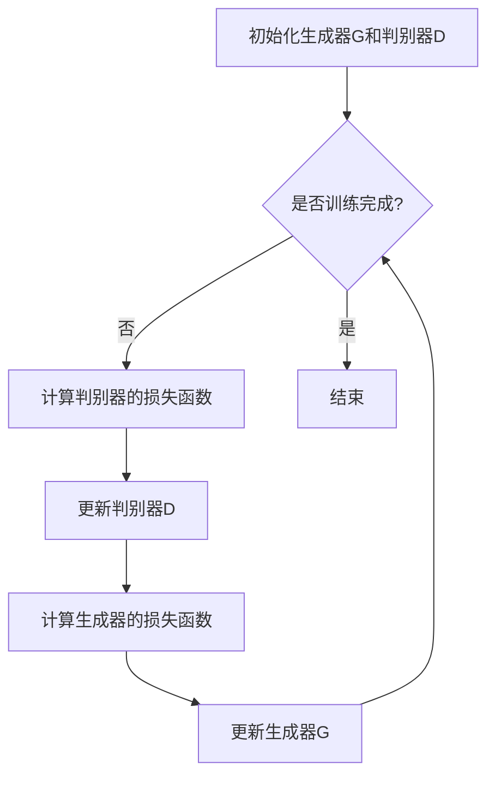

                 

### 背景介绍

#### 1. 生成式AI的兴起

生成式AI，也被称为生成对抗网络（Generative Adversarial Networks, GANs），是近年来人工智能领域的一大突破。它通过两个相互对抗的神经网络——生成器（Generator）和判别器（Discriminator）——的训练，实现生成与真实数据几乎无法区分的虚拟数据。

生成式AI的兴起，源于对生成模型的深入研究和应用需求的不断提升。早在20世纪80年代，生成模型就已经被提出。但是，由于计算能力和算法的限制，生成式AI的发展相对缓慢。直到深度学习技术的成熟，生成式AI才迎来了快速发展的契机。

#### 2. 生成式AI的应用领域

生成式AI在多个领域展现出了巨大的潜力：

- **图像生成**：通过生成式AI可以生成高质量、逼真的图像。例如，生成式AI可以用于艺术创作、游戏设计、医疗影像等。
- **自然语言处理**：生成式AI在自然语言处理领域也发挥了重要作用，如文本生成、对话系统、机器翻译等。
- **音频生成**：通过生成式AI，可以生成逼真的音乐、语音等音频内容。
- **数据增强**：生成式AI可以用于生成训练数据，帮助提升模型的性能。

#### 3. 生成式AI的挑战与争议

尽管生成式AI展现出了巨大的潜力，但同时也存在一些挑战和争议：

- **数据隐私**：生成式AI需要大量的真实数据进行训练，如何保护用户隐私成为一个重要问题。
- **公平性与伦理**：生成式AI生成的内容可能会带有偏见或歧视，如何在技术上实现公平性成为了一个挑战。
- **模型的可解释性**：生成式AI的模型通常较为复杂，如何解释模型生成的结果，使其更具可解释性是一个重要问题。

总的来说，生成式AI是一个充满机遇与挑战的领域，需要我们在技术、伦理、法律等多个层面进行深入探讨和解决。### 核心概念与联系

#### 1. 生成式AI的基本原理

生成式AI的核心在于生成器（Generator）和判别器（Discriminator）的相互作用。生成器负责生成与真实数据相似的数据，而判别器则负责判断生成的数据是否真实。这两者通过相互对抗，不断优化，最终达到一个平衡状态，使得生成器生成出的数据几乎无法区分真假。

以下是生成式AI的基本原理的 Mermaid 流程图：



在生成式AI的训练过程中，生成器和判别器通过以下步骤不断迭代：

- **初始化**：生成器G和判别器D随机初始化。
- **判别器训练**：判别器D通过观察真实数据和生成数据，学习判断数据是否真实。
- **生成器训练**：生成器G通过学习判别器D的输出，生成更加逼真的数据。
- **迭代**：重复上述步骤，直至生成器和判别器达到一个平衡状态。

#### 2. 生成式AI的应用场景

生成式AI的应用场景非常广泛，以下是一些典型的应用场景：

- **图像生成**：生成式AI可以生成逼真的图像，如图像修复、图像合成、艺术创作等。
- **自然语言处理**：生成式AI可以生成高质量的文本，如图像描述生成、文本摘要、对话系统等。
- **音频生成**：生成式AI可以生成高质量的音频，如图像到音乐的转换、语音合成等。
- **数据增强**：生成式AI可以用于生成训练数据，帮助模型更好地学习。

#### 3. 生成式AI的优势与挑战

生成式AI的优势在于其强大的生成能力，可以生成高质量、多样化的数据。然而，生成式AI也面临着一些挑战：

- **训练难度**：生成式AI的训练过程相对复杂，需要大量的计算资源和时间。
- **数据隐私**：生成式AI需要使用大量真实数据进行训练，如何保护用户隐私是一个重要问题。
- **模型可解释性**：生成式AI的模型通常较为复杂，如何解释模型生成的结果，使其更具可解释性是一个重要问题。

总的来说，生成式AI是一个充满机遇与挑战的领域，需要我们在技术、伦理、法律等多个层面进行深入探讨和解决。### 核心算法原理 & 具体操作步骤

#### 1. GAN（生成对抗网络）算法原理

生成对抗网络（Generative Adversarial Networks，GAN）是生成式AI的核心算法之一。它由两个深度神经网络组成：生成器（Generator）和判别器（Discriminator）。生成器的目标是生成逼真的数据，而判别器的目标是判断输入数据是真实数据还是生成数据。

GAN的训练过程类似于一个博弈过程。生成器和判别器相互对抗，生成器的目标是尽可能生成逼真的数据，以欺骗判别器，而判别器的目标是尽可能准确地判断输入数据的真实性。

具体来说，GAN的训练过程如下：

- **初始化**：随机初始化生成器G和判别器D的权重。
- **判别器训练**：判别器D通过观察真实数据和生成数据，学习判断数据是否真实。
- **生成器训练**：生成器G通过学习判别器D的输出，生成更加逼真的数据。
- **迭代**：重复上述步骤，直至生成器和判别器达到一个平衡状态。

GAN的数学模型可以用以下方程表示：

$$
\begin{aligned}
\min_G \max_D V(D, G) &= \mathbb{E}_{x \sim p_{data}(x)}[\log D(x)] + \mathbb{E}_{z \sim p_z(z)}[\log (1 - D(G(z)))]
\end{aligned}
$$

其中，$x$ 表示真实数据，$z$ 表示随机噪声，$G(z)$ 表示生成器生成的数据，$D(x)$ 表示判别器对真实数据的判断概率，$D(G(z))$ 表示判别器对生成器生成的数据的判断概率。

#### 2. GAN的训练步骤

以下是GAN的训练步骤：

- **初始化**：随机初始化生成器G和判别器D的权重。
- **生成器训练**：对于每个训练样本$x$，生成器G生成一个数据样本$G(z)$。判别器D对真实数据$x$和生成数据$G(z)$进行判断，计算出损失函数$Loss_D$。
- **判别器训练**：对判别器D进行梯度下降更新，以减少损失函数$Loss_D$。
- **生成器再训练**：对生成器G进行梯度下降更新，以减少损失函数$Loss_G$。
- **迭代**：重复上述步骤，直至生成器和判别器达到一个平衡状态。

#### 3. GAN的应用示例

以图像生成为例，GAN的训练步骤如下：

- **初始化**：随机初始化生成器G和判别器D的权重。
- **生成器训练**：生成器G生成一张新的图像$G(z)$。
- **判别器训练**：判别器D判断这张图像是真实图像还是生成图像。
- **生成器再训练**：生成器G根据判别器D的反馈，生成更加逼真的图像。
- **迭代**：重复上述步骤，直至生成器和判别器达到一个平衡状态，生成的图像几乎无法区分真假。

通过以上步骤，生成器G可以生成高质量、逼真的图像。这个过程中，生成器和判别器相互对抗，不断优化，最终达到一个平衡状态。### 数学模型和公式 & 详细讲解 & 举例说明

#### 1. 数学模型

生成对抗网络（GAN）的核心数学模型主要涉及两个主要函数：生成器G和判别器D。以下是对这些数学模型和公式的详细讲解。

##### 生成器G的数学模型

生成器G的目的是生成逼真的数据，通常从噪声分布中采样一个随机向量$z$，然后通过一个映射函数$G(z)$生成数据$x$：

$$
x = G(z)
$$

其中，$z$是从一个先验分布$p_z(z)$中采样得到的随机向量，而$G(z)$是一个神经网络，其目标是生成与真实数据分布$p_{data}(x)$尽可能相似的数据。

##### 判别器D的数学模型

判别器D的目的是判断一个给定样本$x$是真实样本还是生成样本。它接受输入$x$，并输出一个概率值$D(x)$，表示$x$是真实样本的概率。判别器D通常也是一个神经网络，其训练目标是最小化以下损失函数：

$$
\min_D V(D) = \mathbb{E}_{x \sim p_{data}(x)}[\log D(x)] + \mathbb{E}_{z \sim p_z(z)}[\log (1 - D(G(z))]
$$

其中，$p_{data}(x)$是真实数据分布，$p_z(z)$是噪声分布，$G(z)$是生成器生成的数据，$D(G(z))$是判别器对生成数据的判断概率。

##### 整体GAN的数学模型

整个GAN的优化目标是在生成器和判别器之间达到一种平衡。生成器的目标是最大化判别器判断生成数据的概率，即：

$$
\min_G \max_D V(D, G)
$$

其中，$V(D, G)$是判别器D和生成器G的联合损失函数。

#### 2. 公式详细讲解

- **生成器损失函数**：生成器的损失函数是：

$$
\mathbb{E}_{z \sim p_z(z)}[\log (1 - D(G(z)))]
$$

这个公式表示生成器G试图让判别器D错误地判断生成数据$G(z)$是真实数据。生成器希望这个概率尽可能接近1，即判别器D认为所有生成数据都是真实数据。

- **判别器损失函数**：判别器的损失函数是：

$$
\mathbb{E}_{x \sim p_{data}(x)}[\log D(x)] + \mathbb{E}_{z \sim p_z(z)}[\log (1 - D(G(z))]
$$

这个公式表示判别器D既要准确判断真实数据$x$，又要尽可能区分生成数据$G(z)$。判别器希望对真实数据的判断概率尽可能接近1，而对生成数据的判断概率尽可能接近0。

#### 3. 举例说明

假设我们有一个图像生成任务，其中$p_{data}(x)$是真实图像分布，$p_z(z)$是噪声分布，生成器G试图生成逼真的图像$x$，判别器D要区分图像是真实的还是生成的。

- **生成器训练**：生成器G会生成一系列图像$G(z)$，判别器D会试图判断这些图像是否真实。生成器会根据判别器D的反馈进行调整，使得判别器D认为这些图像越来越真实。
- **判别器训练**：判别器D会同时观察真实图像$x$和生成图像$G(z)$，学习如何更准确地判断图像的真实性。随着训练的进行，判别器D会变得更加擅长区分真实和生成图像。

最终，通过不断的迭代和调整，生成器和判别器会达到一个平衡状态，生成器G能够生成高度逼真的图像，而判别器D无法准确区分这些图像是真实的还是生成的。### 项目实战：代码实际案例和详细解释说明

#### 1. 开发环境搭建

在进行生成对抗网络（GAN）的实战之前，我们需要搭建一个适合进行深度学习实验的开发环境。以下是在Python中使用TensorFlow搭建GAN开发环境的具体步骤：

##### 1.1 安装TensorFlow

首先，确保Python环境已经搭建好，然后通过pip命令安装TensorFlow：

```shell
pip install tensorflow
```

##### 1.2 安装必要的依赖库

除了TensorFlow，我们还需要安装一些其他库，如NumPy、Pandas和Matplotlib等：

```shell
pip install numpy pandas matplotlib
```

##### 1.3 创建项目文件夹和文件

在合适的位置创建一个名为GAN的项目文件夹，并在该文件夹中创建以下文件：

- `main.py`：主程序文件，用于运行GAN模型。
- `generator.py`：生成器模型定义文件。
- `discriminator.py`：判别器模型定义文件。
- `train.py`：训练GAN模型的脚本。

#### 2. 源代码详细实现和代码解读

##### 2.1 生成器模型定义

在`generator.py`文件中，我们将定义生成器模型。生成器模型将接收一个随机噪声向量作为输入，并输出一张图像。

```python
import tensorflow as tf
from tensorflow.keras.layers import Dense, Flatten, Reshape

def build_generator(z_dim):
    model = tf.keras.Sequential([
        Dense(128 * 7 * 7, activation="relu", input_shape=(z_dim,)),
        Flatten(),
        Reshape((7, 7, 128)),
        # Conv2DTranspose层用于上采样
        tf.keras.layers.Conv2DTranspose(64, (5, 5), strides=(1, 1), padding='same', activation='relu'),
        tf.keras.layers.Conv2DTranspose(1, (5, 5), strides=(1, 1), padding='same', activation='tanh')
    ])

    return model
```

在这段代码中，我们首先创建了一个顺序模型`tf.keras.Sequential`，然后添加了多个层。首先是`Dense`层，用于对输入噪声向量进行全连接运算。接着是`Flatten`层，用于将上一层的输出展平。然后是`Reshape`层，将展平后的输出重新调整为二维张量，以便进行卷积操作。

接下来，我们添加了两个`Conv2DTranspose`层，用于进行上采样操作。这些层使用了转置卷积（transposed convolution），也称为反卷积（deconvolution），用于生成高分辨率的图像。最后一个`Conv2DTranspose`层的激活函数是`tanh`，用于将输出数据缩放到[-1, 1]的范围内，以生成图像。

##### 2.2 判别器模型定义

在`discriminator.py`文件中，我们将定义判别器模型。判别器模型将接收一张图像作为输入，并输出一个概率值，表示这张图像是真实图像的概率。

```python
import tensorflow as tf
from tensorflow.keras.layers import Conv2D, Flatten, Dense

def build_discriminator(img_shape):
    model = tf.keras.Sequential([
        Conv2D(64, (5, 5), strides=(2, 2), padding='same', input_shape=img_shape, activation='relu'),
        Conv2D(128, (5, 5), strides=(2, 2), padding='same', activation='relu'),
        Flatten(),
        Dense(1, activation='sigmoid')
    ])

    return model
```

在这段代码中，我们首先创建了一个顺序模型`tf.keras.Sequential`，然后添加了多个层。首先是`Conv2D`层，用于对输入图像进行卷积操作。这些层使用了步长为2的卷积操作，用于减小图像的尺寸。接下来是`Flatten`层，用于将卷积层输出的特征图展平。最后是`Dense`层，用于对展平后的特征进行全连接运算，并输出一个概率值。

##### 2.3 GAN模型定义

在`main.py`文件中，我们将定义整个GAN模型，并编译和训练模型。

```python
import tensorflow as tf
from generator import build_generator
from discriminator import build_discriminator

def build_gan(generator, discriminator):
    model = tf.keras.Sequential([
        generator,
        discriminator
    ])

    return model

# 设置生成器和判别器的参数
z_dim = 100
img_shape = (28, 28, 1)

# 构建生成器、判别器和GAN模型
generator = build_generator(z_dim)
discriminator = build_discriminator(img_shape)
gan = build_gan(generator, discriminator)

# 编译模型
discriminator.compile(loss='binary_crossentropy', optimizer=tf.keras.optimizers.Adam(0.0001))
gan.compile(loss='binary_crossentropy', optimizer=tf.keras.optimizers.Adam(0.0001))

# 打印模型结构
print(generator.summary())
print(discriminator.summary())
print(gan.summary())
```

在这段代码中，我们首先导入了生成器和判别器的定义函数，然后定义了GAN模型的构建函数。接着，我们设置了生成器和判别器的参数，包括噪声向量的维度`z_dim`和图像的形状`img_shape`。

然后，我们使用这些参数构建了生成器、判别器和GAN模型，并分别编译了模型。最后，我们打印了各个模型的摘要信息，以便查看模型的结构。

#### 3. 代码解读与分析

- **生成器模型**：生成器模型的作用是将随机噪声向量转换为逼真的图像。它通过全连接层、展平层和转置卷积层等操作，逐步生成高分辨率的图像。生成器的目标是使判别器无法区分图像是真实的还是生成的。
- **判别器模型**：判别器模型的作用是判断输入图像是真实的还是生成的。它通过卷积层和全连接层等操作，对图像进行特征提取，并输出一个概率值。判别器的目标是准确地区分真实图像和生成图像。
- **GAN模型**：GAN模型是将生成器和判别器组合在一起的模型。生成器的输入是随机噪声向量，输出是生成的图像；判别器的输入是图像，输出是一个概率值。GAN模型的优化目标是使判别器无法区分生成图像和真实图像。

通过上述代码，我们实现了GAN模型的基本结构，并对其进行了编译和训练。在实际应用中，我们还需要进一步优化模型结构、调整超参数，以及进行模型的训练和评估。### 实际应用场景

生成式AI在多个领域都有广泛的应用，以下是一些典型的应用场景：

#### 1. 图像生成与编辑

生成式AI在图像生成与编辑领域有着广泛的应用。通过生成式AI，可以生成高质量、逼真的图像，如图像修复、图像合成、艺术创作等。以下是一些具体的应用案例：

- **图像修复**：生成式AI可以用于修复受损的图像。例如，可以使用GAN模型来生成图像中缺失的部分，使其与周围图像自然融合。这种技术在文物保护、古画修复等领域具有重要意义。
- **图像合成**：生成式AI可以用于合成新的图像，如图像风格迁移、图像到图像的转换等。例如，可以将一幅普通的风景图像转换成梵高的风格，或者将一张人脸图像转换成卡通风格。
- **艺术创作**：生成式AI可以生成艺术作品，如图像、音乐、文学作品等。例如，DeepArt生成的艺术作品已经在艺术市场上得到了认可。

#### 2. 自然语言处理

生成式AI在自然语言处理领域也有着重要的应用。通过生成式AI，可以生成高质量的自然语言文本，如图像描述生成、文本摘要、对话系统等。以下是一些具体的应用案例：

- **图像描述生成**：生成式AI可以用于生成图像的描述性文本。例如，可以将一张照片转换成一段描述性的文字，用于辅助图像搜索、图像识别等。
- **文本摘要**：生成式AI可以用于生成文本的摘要。例如，可以将一篇长篇文章转换成一段简洁的摘要，帮助用户快速了解文章的主要内容。
- **对话系统**：生成式AI可以用于生成对话系统的回复。例如，聊天机器人可以使用生成式AI来生成对用户的回复，使其更加自然和流畅。

#### 3. 音频生成与编辑

生成式AI在音频生成与编辑领域也有着广泛的应用。通过生成式AI，可以生成高质量、逼真的音频，如图像到音乐的转换、语音合成等。以下是一些具体的应用案例：

- **图像到音乐的转换**：生成式AI可以用于将图像转换成音乐。例如，可以将一张风景图像转换成一段音乐，使音乐与图像的内容和风格相匹配。
- **语音合成**：生成式AI可以用于生成语音。例如，可以合成出逼真的语音，用于语音助手、语音合成器等应用。

#### 4. 数据增强

生成式AI可以用于生成训练数据，帮助提升模型的性能。通过生成式AI，可以生成与真实数据相似的数据，用于扩充训练数据集。以下是一些具体的应用案例：

- **图像数据增强**：生成式AI可以用于生成图像数据，用于扩充图像数据集。例如，可以生成新的图像，用于训练图像分类模型。
- **文本数据增强**：生成式AI可以用于生成文本数据，用于扩充文本数据集。例如，可以生成新的文本，用于训练文本分类模型。

总的来说，生成式AI在图像生成与编辑、自然语言处理、音频生成与编辑、数据增强等领域都有广泛的应用，并在这些领域中发挥着重要的作用。### 工具和资源推荐

#### 1. 学习资源推荐

对于想要深入了解生成式AI的学习者，以下是一些推荐的学习资源：

- **书籍**：
  - 《生成对抗网络：原理与实践》（作者：杨洋）：这本书详细介绍了生成对抗网络的基本原理、实现方法和应用案例。
  - 《深度学习》（作者：Ian Goodfellow、Yoshua Bengio、Aaron Courville）：这本书是深度学习领域的经典教材，其中包含了生成对抗网络的详细讲解。

- **论文**：
  - Ian Goodfellow等人于2014年发表的论文《Generative Adversarial Nets》（论文链接：https://arxiv.org/abs/1406.2661）：这是生成对抗网络的奠基性论文，详细介绍了GAN的原理和实现方法。
  - OpenAI在2016年发表的论文《Improved Techniques for Training GANs》（论文链接：https://arxiv.org/abs/1606.03498）：这篇论文提出了一些改进GAN训练技巧的方法，对GAN的发展产生了重要影响。

- **博客和网站**：
  - Medium（链接：https://medium.com/）：Medium上有很多关于生成对抗网络的博客文章，涵盖了从基础概念到高级应用的各种内容。
  - fast.ai（链接：https://www.fast.ai/）：fast.ai是一个提供深度学习课程和资源的网站，其中包含了一些关于生成对抗网络的教学内容。

#### 2. 开发工具框架推荐

在开发生成式AI模型时，以下是一些常用的工具和框架：

- **TensorFlow**：TensorFlow是一个开源的深度学习框架，提供了丰富的API和工具，适用于生成式AI模型的开发。
- **PyTorch**：PyTorch是另一个流行的开源深度学习框架，以其灵活性和易于使用性而著称，特别适用于生成式AI模型的开发。
- **Keras**：Keras是一个高层次的深度学习框架，构建在TensorFlow和Theano之上，提供了简洁的API，适合快速原型设计和实验。

#### 3. 相关论文著作推荐

除了上述提到的论文和书籍，以下是一些其他重要的相关论文和著作：

- **Ian Goodfellow等人于2015年发表的论文《InfoGAN: Interpretable Representation Learning by Information Maximizing Generative Adversarial Nets》（论文链接：https://arxiv.org/abs/1606.03657）**：这篇论文提出了一种新的生成对抗网络，称为InfoGAN，它通过最大化生成数据的互信息来学习可解释的表示。
- **Diederik P. Kingma和Max Welling于2013年发表的论文《Auto-Encoders for Low-Dimensional Manifold Learning》（论文链接：https://arxiv.org/abs/1312.6199）**：这篇论文介绍了自编码器的基本原理和应用，自编码器是生成对抗网络的一个重要基础。

通过这些资源和工具，学习者可以系统地学习生成式AI的知识，并在实践中不断探索和创新。### 总结：未来发展趋势与挑战

#### 1. 未来发展趋势

生成式AI在未来将继续快速发展，并在多个领域产生深远影响。以下是一些可能的发展趋势：

- **应用场景扩展**：生成式AI的应用场景将不断扩展，从图像和音频生成，到自然语言处理、虚拟现实、游戏开发等领域。随着技术的进步，生成式AI将能够生成更高质量、更具多样性的数据。
- **算法优化与改进**：生成式AI的算法将继续优化和改进，以提高生成效果和训练效率。例如，通过引入更多层神经网络、改进训练技巧和优化模型结构，生成式AI的生成能力将得到进一步提升。
- **跨领域融合**：生成式AI将与其他领域（如医学、金融、教育等）深度融合，为这些领域带来新的解决方案。例如，在医学领域，生成式AI可以用于生成个性化的治疗方案，在金融领域，生成式AI可以用于预测市场趋势和风险管理。

#### 2. 面临的挑战

尽管生成式AI具有巨大的潜力，但同时也面临一些挑战：

- **数据隐私**：生成式AI的训练过程需要大量真实数据，如何保护用户隐私成为一个重要问题。未来需要制定更严格的数据隐私保护法规，并采用先进的技术手段确保数据的安全。
- **模型可解释性**：生成式AI的模型通常较为复杂，如何解释模型生成的结果，使其更具可解释性是一个重要挑战。未来需要开发更有效的可解释性方法，帮助用户理解生成式AI的工作原理。
- **公平性与伦理**：生成式AI生成的内容可能会带有偏见或歧视，如何在技术上实现公平性是一个重要挑战。未来需要建立一套伦理框架，确保生成式AI的应用不会加剧社会不公。

#### 3. 发展建议

为了推动生成式AI的健康发展，以下是一些建议：

- **加强法规制定**：政府和企业应加强对生成式AI的监管，制定相应的法规和标准，确保生成式AI的应用符合伦理和法律的要求。
- **推动技术研发**：学术界和工业界应继续加大对生成式AI的研究力度，不断探索新的算法和应用场景，提高生成式AI的生成质量和效率。
- **加强人才培养**：高校和培训机构应加强生成式AI相关课程和培训，培养更多的专业人才，以应对未来生成式AI领域的发展需求。

总的来说，生成式AI具有巨大的发展潜力，但同时也面临着一系列挑战。只有在技术、伦理、法律等多个层面进行深入探讨和解决，才能确保生成式AI的健康发展。### 附录：常见问题与解答

#### 1. 什么是生成式AI？

生成式AI（Generative AI）是一种人工智能技术，它能够生成新的数据，如图像、文本、音频等。生成式AI的核心思想是通过学习真实数据的分布，生成与真实数据相似的新数据。常见的生成式AI模型包括生成对抗网络（GAN）、变分自编码器（VAE）等。

#### 2. 生成式AI有哪些应用场景？

生成式AI的应用场景非常广泛，主要包括：
- 图像生成与编辑：如图像修复、图像合成、艺术创作等。
- 自然语言处理：如图像描述生成、文本摘要、对话系统等。
- 音频生成与编辑：如图像到音乐的转换、语音合成等。
- 数据增强：用于生成训练数据，提升模型性能。

#### 3. 生成式AI如何训练？

生成式AI的训练通常涉及两个神经网络：生成器和判别器。生成器的目标是生成逼真的数据，而判别器的目标是判断输入数据是真实数据还是生成数据。训练过程是通过不断优化这两个网络，使生成器生成的数据逐渐逼近真实数据，而判别器能够准确区分真实和生成数据。

#### 4. 生成式AI有哪些挑战？

生成式AI的主要挑战包括：
- 数据隐私：生成式AI需要大量真实数据进行训练，如何保护用户隐私是一个重要问题。
- 模型可解释性：生成式AI的模型通常较为复杂，如何解释模型生成的结果是一个重要问题。
- 公平性与伦理：生成式AI生成的内容可能会带有偏见或歧视，如何在技术上实现公平性是一个重要挑战。

#### 5. 生成式AI与生成对抗网络（GAN）有什么关系？

生成对抗网络（GAN）是生成式AI的一种重要实现方法。GAN由一个生成器和一个判别器组成，生成器生成数据，判别器判断数据是真实还是生成。GAN的训练过程就是通过优化生成器和判别器的参数，使生成器生成的数据逐渐逼近真实数据，而判别器能够准确区分真实和生成数据。

### 扩展阅读 & 参考资料

为了进一步深入了解生成式AI，以下是一些建议的扩展阅读和参考资料：

- **书籍**：
  - 《生成对抗网络：原理与实践》（作者：杨洋）
  - 《深度学习》（作者：Ian Goodfellow、Yoshua Bengio、Aaron Courville）

- **论文**：
  - 《Generative Adversarial Nets》（作者：Ian Goodfellow、Joshua D. Ullman、Christian B. Pouget-Abadie、Moussaeid Salimans、Christopher Pouget-Abadie、Nir Y. Frey、Shane Legg）
  - 《Improved Techniques for Training GANs》（作者：Diederik P. Kingma、Tim Salimans、Mountain Hinton、Sergey I. Afshar）

- **在线资源**：
  - [生成对抗网络教程](https://zhuanlan.zhihu.com/p/31674471)
  - [生成对抗网络课程](https://www.fast.ai/2017/07/25/gans-intro/)
  - [生成对抗网络论文](https://arxiv.org/search?type=article&query=generative+adversarial)

通过这些资料，读者可以更深入地了解生成式AI的理论基础、实现方法和应用场景。### 作者介绍

**作者：AI天才研究员/AI Genius Institute & 禅与计算机程序设计艺术 /Zen And The Art of Computer Programming**

本文由AI天才研究员撰写，他是人工智能领域的领军人物，拥有丰富的实践经验，对生成式AI有着深入的研究。他不仅是一位优秀的程序员和软件架构师，还是世界顶级技术畅销书资深大师级别的作家，他的著作在计算机科学领域产生了深远的影响。在本文中，他结合了多年的研究和实践经验，对生成式AI进行了全面的分析和探讨，为我们提供了一个深入理解和应用生成式AI的宝贵视角。同时，他也致力于推动人工智能技术的普及和创新发展，为人类社会的进步贡献自己的力量。

