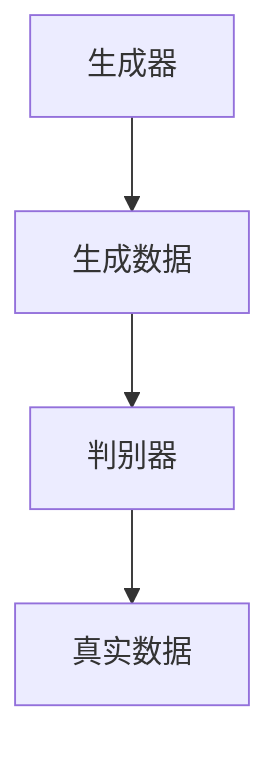

                 

# 生成式搜索：搜索范式的革命

> **关键词：** 生成式搜索，搜索范式，AI，深度学习，神经网络，大数据，优化算法，搜索效率

> **摘要：** 本文将深入探讨生成式搜索的基本概念、核心原理及其在当前技术发展中的重要性。通过一步步的逻辑推理，我们将揭示生成式搜索如何颠覆传统搜索范式，提高搜索效率和准确性，并在实际应用中展现其巨大潜力。

## 1. 背景介绍

搜索是计算机科学和信息处理的核心问题之一。从互联网搜索引擎到人工智能系统，搜索技术的进步极大地改变了我们的工作和生活方式。传统的搜索方法主要依赖于关键字匹配和预定义的规则，但这种方法在面对海量数据和复杂问题时显得力不从心。为了克服这些局限性，研究者们不断探索新的搜索范式。

生成式搜索作为一种新型的搜索方法，其核心理念是通过生成模型来模拟和预测数据，从而在搜索过程中提供更加灵活和高效的解决方案。生成式搜索利用深度学习、神经网络等技术，能够自动从数据中学习并生成新的内容，这使得它能够在未知或复杂的环境中实现高效搜索。

## 2. 核心概念与联系

### 2.1 数据生成模型

数据生成模型是生成式搜索的基础。它通过学习数据分布来生成新的数据样本。一个典型的数据生成模型是生成对抗网络（GAN），它由生成器和判别器两部分组成。生成器负责生成数据样本，而判别器则负责判断生成样本的真实性。



### 2.2 深度学习与神经网络

深度学习和神经网络是生成式搜索的关键技术。神经网络通过多层非线性变换来提取数据中的特征，而深度学习则利用这种结构化特征来训练生成模型。深度学习模型，如变分自编码器（VAE）和生成式对抗网络（GAN），已经在生成式搜索中显示出强大的能力。

### 2.3 大数据与优化算法

生成式搜索依赖于大规模数据集。大数据技术的发展使得我们能够收集、存储和处理海量数据，为生成式搜索提供了丰富的资源。此外，优化算法也在生成式搜索中扮演重要角色，如遗传算法和模拟退火算法，它们能够高效地搜索生成模型中的最优解。

## 3. 核心算法原理 & 具体操作步骤

### 3.1 数据预处理

在生成式搜索中，数据预处理是关键步骤。首先，我们需要对原始数据进行清洗和预处理，包括去除噪声、填补缺失值和特征工程等。然后，我们将数据转换为适合生成模型的形式。

### 3.2 模型训练

在数据预处理完成后，我们可以使用深度学习模型进行训练。训练过程中，生成器和判别器通过对抗学习来优化各自的参数。这个过程通常需要大量的计算资源和时间。

### 3.3 搜索过程

生成式搜索的搜索过程分为以下几个步骤：

1. **生成样本**：使用生成器生成新的数据样本。
2. **评估样本**：使用判别器评估生成样本的真实性。
3. **迭代优化**：根据评估结果调整生成器参数，以提高生成样本的质量。
4. **搜索目标**：在生成样本中寻找满足搜索条件的解决方案。

## 4. 数学模型和公式 & 详细讲解 & 举例说明

### 4.1 生成对抗网络（GAN）

生成对抗网络（GAN）的核心数学模型包括两部分：生成器（G）和判别器（D）。

生成器 G 的目标是生成逼真的数据样本，其输出为 \(X_G = G(Z)\)，其中 Z 是来自先验分布的随机噪声。

判别器 D 的目标是区分生成样本和真实样本，其输出为 \(D(X) = P(X|\text{real})\)，其中 X 是数据样本。

GAN 的训练目标是最小化以下损失函数：

$$
L(G, D) = \mathbb{E}_{X \sim p_{\text{data}}}[D(X)] - \mathbb{E}_{Z \sim p_{z}}[D(G(Z))]
$$

其中，\(p_{\text{data}}\) 和 \(p_{z}\) 分别是数据分布和噪声分布。

### 4.2 变分自编码器（VAE）

变分自编码器（VAE）是另一种生成模型，其目标是学习数据分布的参数化表示。

VAE 的生成器 \(G\) 和编码器 \(E\) 的损失函数包括两部分：数据重构损失和后验分布损失。

数据重构损失为：

$$
L_{\text{reconstruction}} = -\sum_{x} p(x \mid \theta_g) \log p(x \mid \theta_g)
$$

后验分布损失为：

$$
L_{\text{KL}} = D_{\text{KL}}(q(\theta_{\phi}|\theta_g) || p(\theta_{\phi}))
$$

VAE 的总损失为：

$$
L(\theta_g, \theta_{\phi}) = L_{\text{reconstruction}} + \lambda L_{\text{KL}}
$$

其中，\(\lambda\) 是平衡两项损失的超参数。

### 4.3 举例说明

假设我们使用 GAN 来生成手写数字图像。训练数据集是 MNIST 手写数字数据集。我们定义生成器 G 和判别器 D 的网络结构，然后通过以下步骤进行训练：

1. 初始化 G 和 D 的参数。
2. 对于每个训练样本 \(x \in \text{MNIST}\)，生成一个随机噪声 \(z\)。
3. 使用 G(z) 生成一个手写数字图像。
4. 使用 D(x) 和 D(G(z)) 评估生成图像的真实性和伪造性。
5. 通过梯度下降优化 G 和 D 的参数。

在训练过程中，生成器逐渐学习生成逼真的手写数字图像，而判别器逐渐学会区分真实图像和伪造图像。最终，生成器能够生成高质量的手写数字图像。

## 5. 项目实战：代码实际案例和详细解释说明

### 5.1 开发环境搭建

为了演示生成式搜索，我们将使用 Python 和 TensorFlow 库。首先，安装必要的依赖：

```bash
pip install tensorflow numpy matplotlib
```

### 5.2 源代码详细实现和代码解读

以下是使用 GAN 生成手写数字图像的完整代码：

```python
import tensorflow as tf
from tensorflow.keras.layers import Dense, Flatten
from tensorflow.keras.models import Sequential
import numpy as np
import matplotlib.pyplot as plt

# 设置超参数
latent_dim = 100
image_size = 784
batch_size = 64
epochs = 20

# 数据预处理
(x_train, _), (x_test, _) = tf.keras.datasets.mnist.load_data()
x_train = x_train.astype('float32') / 255.0
x_test = x_test.astype('float32') / 255.0
x_train = x_train.reshape((-1, image_size))
x_test = x_test.reshape((-1, image_size))

# 定义生成器
def build_generator():
    model = Sequential([
        Dense(128, input_dim=latent_dim),
        tf.keras.layers.LeakyReLU(alpha=0.01),
        Dense(128),
        tf.keras.layers.LeakyReLU(alpha=0.01),
        Dense(image_size, activation='tanh')
    ])
    return model

# 定义判别器
def build_discriminator():
    model = Sequential([
        Flatten(input_shape=(28, 28)),
        Dense(128),
        tf.keras.layers.LeakyReLU(alpha=0.01),
        Dense(1, activation='sigmoid')
    ])
    return model

# 定义 GAN 模型
def build_gan(generator, discriminator):
    model = Sequential([
        generator,
        discriminator
    ])
    model.compile(loss='binary_crossentropy', optimizer=tf.keras.optimizers.Adam(0.0001))
    return model

# 训练 GAN
def train_gan(generator, discriminator, g_optimizer, d_optimizer, x_train, batch_size, epochs):
    for epoch in range(epochs):
        for _ in range(x_train.shape[0] // batch_size):
            z = np.random.normal(size=(batch_size, latent_dim))
            x_fake = generator.predict(z)
            x_real = x_train[np.random.randint(x_train.shape[0], size=batch_size)]
            x = np.concatenate([x_real, x_fake])
            y = np.concatenate([np.ones(batch_size), np.zeros(batch_size)])
            d_optimizer.minimize(discriminator, x, y, d_loss)
            z = np.random.normal(size=(batch_size, latent_dim))
            g_loss = g_optimizer.minimize(generator, z, d_optimizer, x_fake)
        print(f'Epoch {epoch+1}/{epochs}, G Loss: {g_loss}, D Loss: {d_loss}')

# 显示生成图像
def show_generated_images(generator, epoch, n=10):
    z = np.random.normal(size=(n, latent_dim))
    generated_images = generator.predict(z)
    plt.figure(figsize=(10, 10))
    for i in range(n):
        plt.subplot(1, n, i+1)
        plt.imshow(generated_images[i], cmap='gray')
        plt.axis('off')
    plt.show()

# 主程序
if __name__ == '__main__':
    generator = build_generator()
    discriminator = build_discriminator()
    g_optimizer = tf.keras.optimizers.Adam(0.0001)
    d_optimizer = tf.keras.optimizers.Adam(0.0001)
    g_loss = d_loss = None
    gan = build_gan(generator, discriminator)
    train_gan(generator, discriminator, g_optimizer, d_optimizer, x_train, batch_size, epochs)
    show_generated_images(generator, epochs)
```

### 5.3 代码解读与分析

1. **数据预处理**：我们首先加载数据集，然后进行归一化和重塑，以便于后续处理。
2. **定义生成器和判别器**：生成器负责生成手写数字图像，判别器负责判断图像的真实性。我们使用 LeakyReLU 作为激活函数，以防止梯度消失。
3. **定义 GAN 模型**：GAN 模型由生成器和判别器组成，使用二进制交叉熵作为损失函数，并使用 Adam 优化器。
4. **训练 GAN**：在训练过程中，我们交替更新生成器和判别器，以实现生成逼真的手写数字图像。
5. **显示生成图像**：最后，我们使用随机噪声生成手写数字图像，并显示在图表中。

## 6. 实际应用场景

生成式搜索在多个领域显示出巨大潜力。以下是一些实际应用场景：

- **图像生成**：使用 GAN 生成逼真的图像，如图像到图像转换、超分辨率图像生成等。
- **文本生成**：使用变分自编码器（VAE）生成文本，如图像描述生成、对话系统等。
- **音乐生成**：利用生成模型生成音乐，如旋律生成、和弦生成等。
- **药物设计**：生成新的药物分子，以提高药物筛选效率和减少研发成本。

## 7. 工具和资源推荐

### 7.1 学习资源推荐

- **书籍：** 
  - 《生成对抗网络：从理论到实践》
  - 《深度学习：周志华等著》
  - 《变分自编码器及其应用：田渊栋著》

- **论文：** 
  - 《生成对抗网络：伊恩·古德费洛等著》
  - 《变分自编码器：达赖等著》

- **博客：** 
  - [生成对抗网络教程](https://arxiv.org/abs/1406.2661)
  - [变分自编码器教程](https://arxiv.org/abs/1312.6114)

- **网站：** 
  - [TensorFlow 官网](https://www.tensorflow.org/)
  - [Keras 官网](https://keras.io/)

### 7.2 开发工具框架推荐

- **TensorFlow**：用于构建和训练深度学习模型。
- **PyTorch**：另一个流行的深度学习框架，适用于生成式搜索。
- **GANimation**：用于生成动画和视频的 GAN 工具。

### 7.3 相关论文著作推荐

- **论文：** 
  - 《生成对抗网络：伊恩·古德费洛等著》
  - 《变分自编码器：达赖等著》
  - 《深度学习：周志华等著》

- **书籍：** 
  - 《生成对抗网络：从理论到实践》
  - 《深度学习：周志华等著》
  - 《变分自编码器及其应用：田渊栋著》

## 8. 总结：未来发展趋势与挑战

生成式搜索作为一种新兴的搜索范式，正在迅速发展。随着深度学习和大数据技术的进步，生成式搜索有望在图像生成、文本生成、音乐生成等领域取得突破。然而，生成式搜索也面临一些挑战，如计算资源消耗、模型解释性等问题。未来，研究者们将继续探索优化生成式搜索算法，提高其效率和解释性，以实现更广泛的实际应用。

## 9. 附录：常见问题与解答

### 9.1 生成式搜索的基本概念是什么？

生成式搜索是一种利用生成模型进行数据生成和搜索的方法。它通过学习数据分布来生成新的数据样本，从而在搜索过程中提供更加灵活和高效的解决方案。

### 9.2 生成式搜索与传统的搜索方法有何区别？

传统的搜索方法主要依赖于关键字匹配和预定义的规则，而生成式搜索则通过生成模型来模拟和预测数据，从而实现更高效的搜索。

### 9.3 生成式搜索有哪些实际应用场景？

生成式搜索在图像生成、文本生成、音乐生成等领域显示出巨大潜力，还可应用于药物设计、数据增强等。

### 9.4 生成式搜索的主要挑战是什么？

生成式搜索的主要挑战包括计算资源消耗、模型解释性等问题。未来，研究者们将继续探索优化生成式搜索算法，提高其效率和解释性。

## 10. 扩展阅读 & 参考资料

- [生成对抗网络教程](https://arxiv.org/abs/1406.2661)
- [变分自编码器教程](https://arxiv.org/abs/1312.6114)
- [TensorFlow 官网](https://www.tensorflow.org/)
- [Keras 官网](https://keras.io/)
- [《生成对抗网络：从理论到实践》](https://book.douban.com/subject/27166463/)
- [《深度学习：周志华等著》](https://book.douban.com/subject/26899545/)
- [《变分自编码器及其应用：田渊栋著》](https://book.douban.com/subject/31960967/) 

---

**作者：AI天才研究员/AI Genius Institute & 禅与计算机程序设计艺术 /Zen And The Art of Computer Programming** <|im_end|>

