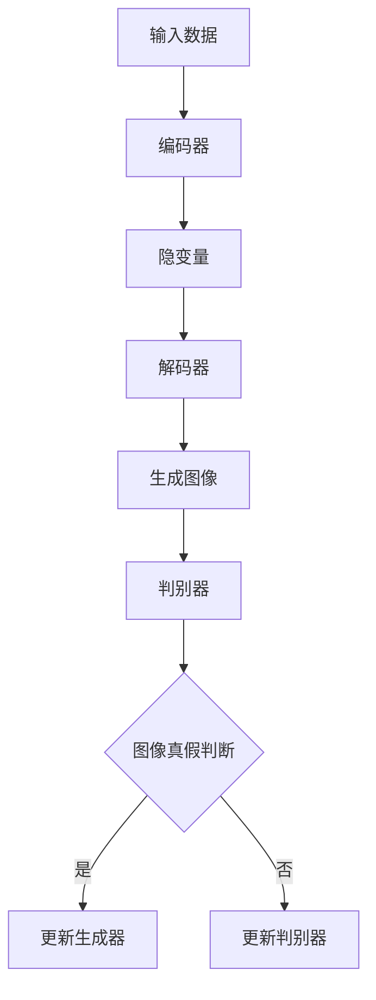

                 

### 背景介绍

生成模型（Generative Models）是人工智能领域中的一个重要分支，近年来在计算机视觉、自然语言处理、推荐系统等多个领域取得了显著的应用成果。生成模型的核心目标是从给定的数据分布中生成新的数据样本，这些样本具有与训练数据分布相似的特性。在个性化虚拟形象创建领域，生成模型的应用尤为重要。通过利用生成模型，我们可以创造出丰富多彩、独具特色的虚拟形象，满足不同用户的需求。

个性化虚拟形象创建的核心挑战在于如何有效地融合用户需求、数据多样性以及图像质量。传统的图像合成方法往往依赖于手工设计的规则或模板，难以应对复杂多变的需求。而生成模型，尤其是基于深度学习的生成对抗网络（GAN）和变分自编码器（VAE），提供了强大的数据驱动方法，能够自动学习并生成高质量的虚拟形象。

本文将围绕生成模型在个性化虚拟形象创建中的应用进行探讨，首先介绍生成模型的基本概念和核心原理，然后详细讲解生成模型在个性化虚拟形象创建中的具体应用，最后讨论当前领域的主要挑战和未来发展趋势。

### 核心概念与联系

生成模型在个性化虚拟形象创建中的关键在于其能够通过学习大量数据来捕捉数据的分布特性，从而生成具有相似特性的新数据。下面，我们将深入探讨生成模型的核心概念，以及其在个性化虚拟形象创建中的具体应用。

#### 1. 生成模型的定义和基本原理

生成模型是一类用于生成新数据的机器学习模型，其基本目标是学习一个数据分布，并能够从这个分布中生成新的数据样本。常见的生成模型包括生成对抗网络（Generative Adversarial Networks, GAN）和变分自编码器（Variational Autoencoder, VAE）。

**生成对抗网络（GAN）**：GAN由两部分组成：生成器（Generator）和判别器（Discriminator）。生成器的任务是生成数据，而判别器的任务是区分生成的数据和真实数据。这两者之间通过一个博弈过程进行训练，生成器不断优化其生成数据的能力，判别器则不断优化其区分数据的能力。通过这样的对抗训练，生成器最终能够生成逼真且具有多样化特征的数据样本。

**变分自编码器（VAE）**：VAE是一种基于概率模型的生成模型。它通过学习数据的一个概率分布来生成新数据。VAE的核心是编码器（Encoder）和解码器（Decoder）。编码器将输入数据映射到一个潜在的隐变量空间，解码器则从隐变量空间生成数据。通过优化编码器和解码器，VAE能够生成具有较好多样性的新数据。

#### 2. 生成模型在个性化虚拟形象创建中的应用

在个性化虚拟形象创建中，生成模型的应用主要体现在以下几个方面：

**1. 数据增强**：生成模型可以通过生成与训练数据分布相似的虚拟形象，增加数据的多样性，从而提高训练模型的泛化能力。

**2. 图像合成**：生成模型可以基于少量或无参考数据，生成高质量且个性化的虚拟形象。这种方法特别适用于用户自定义形象的设计。

**3. 用户个性化定制**：生成模型可以根据用户的需求和偏好，生成满足个性化需求的虚拟形象。例如，用户可以选择脸型、发型、肤色等特征，生成器则根据这些特征生成相应的形象。

**4. 形象风格迁移**：生成模型可以将一种风格的虚拟形象迁移到另一种风格上，从而实现不同风格的个性化形象创建。

#### 3. 核心概念原理和架构的 Mermaid 流程图

为了更直观地理解生成模型在个性化虚拟形象创建中的应用，我们使用Mermaid流程图展示其核心概念原理和架构。以下是生成模型的基本流程：



在上面的流程图中，输入数据经过编码器映射到隐变量空间，解码器从隐变量空间生成图像。生成图像后，判别器对图像进行真假判断，并根据判断结果更新生成器和判别器。通过这样的循环迭代，生成模型能够不断优化其生成图像的能力。

#### 4. 生成模型在个性化虚拟形象创建中的优势

与传统的手工设计方法相比，生成模型在个性化虚拟形象创建中具有以下优势：

**1. 自动化**：生成模型可以自动学习大量数据，生成具有多样性和个性化的虚拟形象，减少了手工设计的工作量。

**2. 高质量**：生成模型通过深度学习技术，能够生成高质量、细节丰富的虚拟形象。

**3. 可定制**：生成模型可以根据用户需求和偏好，灵活生成满足个性化要求的虚拟形象。

**4. 灵活性**：生成模型适用于多种场景，如虚拟现实、游戏、影视制作等，具有很高的应用灵活性。

总之，生成模型在个性化虚拟形象创建中具有巨大的潜力和优势。通过不断优化和改进，生成模型将能够在未来实现更多创新应用，为虚拟形象创作带来新的变革。

### 核心算法原理 & 具体操作步骤

生成模型在个性化虚拟形象创建中的应用主要依赖于生成对抗网络（GAN）和变分自编码器（VAE）这两种核心算法。下面，我们将分别介绍这两种算法的基本原理和具体操作步骤。

#### 1. 生成对抗网络（GAN）

**基本原理**：

GAN由两部分组成：生成器（Generator）和判别器（Discriminator）。生成器的任务是生成与真实数据分布相似的假数据，而判别器的任务是区分假数据和真实数据。这两者通过一个对抗训练过程进行优化，生成器的目标是使判别器无法区分生成的假数据和真实数据，而判别器的目标是尽可能准确地判断数据是真实还是假。

**具体操作步骤**：

1. **初始化生成器和判别器**：首先初始化生成器G和判别器D的参数。通常使用随机初始化或预训练的模型。

2. **生成假数据**：生成器G接受随机噪声作为输入，通过神经网络映射生成假数据。

3. **判别数据真假**：判别器D将真实数据和生成器G生成的假数据分别作为输入，输出一个概率值，表示数据为真实的置信度。

4. **对抗训练**：通过优化生成器和判别器的参数，使生成器的生成数据更加逼真，同时使判别器的判断更加准确。具体来说，使用以下两个损失函数进行训练：

   - 生成器损失函数：最小化生成器生成的假数据被判别器判断为假的概率。
   - 判别器损失函数：最大化判别器判断真实数据和假数据的置信度差异。

5. **迭代优化**：重复以上步骤，不断更新生成器和判别器的参数，直到两者达到平衡状态，即生成器的生成数据几乎无法被判别器区分。

#### 2. 变分自编码器（VAE）

**基本原理**：

VAE是一种基于概率模型的生成模型。它通过学习数据的一个概率分布，从而生成新数据。VAE的核心是编码器（Encoder）和解码器（Decoder）。编码器将输入数据映射到一个潜在的隐变量空间，解码器则从隐变量空间生成数据。VAE通过优化编码器和解码器的参数，使生成的数据能够较好地匹配输入数据的分布。

**具体操作步骤**：

1. **初始化编码器和解码器**：首先初始化编码器E和解码器D的参数。通常使用随机初始化或预训练的模型。

2. **编码数据**：编码器E将输入数据映射到一个隐变量空间，隐变量空间表示输入数据的概率分布。

3. **解码数据**：解码器D从隐变量空间生成数据。

4. **优化参数**：通过优化编码器和解码器的参数，使生成的数据与输入数据在分布上更接近。具体来说，使用以下两个损失函数进行训练：

   - 重构损失函数：最小化生成数据与输入数据之间的差异。
   - 对数似然损失函数：最大化生成的数据在隐变量空间中的概率。

5. **迭代优化**：重复以上步骤，不断更新编码器和解码器的参数，直到达到最优解。

#### 3. GAN与VAE的对比

**优点**：

- **GAN**：GAN可以生成高质量、多样化的数据，特别适合处理图像、音频等高维数据。
- **VAE**：VAE在生成数据时能够保持较好的数据分布特性，特别适合处理结构化数据，如文本、序列数据等。

**缺点**：

- **GAN**：GAN的训练过程不稳定，容易出现模式崩溃（mode collapse）现象，即生成器只能生成一种或几种特定的数据模式。
- **VAE**：VAE生成的数据质量相对较低，但能够较好地保持数据的分布特性。

**适用场景**：

- **GAN**：适用于图像、视频、音频等高维数据的生成，如虚拟形象创建、图像修复、视频生成等。
- **VAE**：适用于结构化数据，如文本、序列数据的生成，如文本生成、音乐生成等。

通过以上对GAN和VAE的详细介绍，我们可以看到这两种生成模型在个性化虚拟形象创建中的应用具有很大的潜力。在实际应用中，可以根据具体需求和场景选择合适的生成模型，以实现高质量的个性化虚拟形象创建。

### 数学模型和公式 & 详细讲解 & 举例说明

在生成模型中，GAN（生成对抗网络）和VAE（变分自编码器）是最常用的两种核心算法。它们分别通过对抗训练和概率模型来生成新数据。为了更深入地理解这些模型的工作原理，我们需要介绍它们的核心数学模型和公式，并通过具体例子进行说明。

#### 1. GAN（生成对抗网络）

**数学模型**：

GAN的核心由两部分组成：生成器G和判别器D。生成器的任务是生成与真实数据分布相似的数据，而判别器的任务是区分生成的数据和真实数据。

- **生成器**：给定一个随机噪声向量\( z \)，生成器G将其映射为真实数据的空间，即\( x_g = G(z) \)。
- **判别器**：判别器D接受一个输入\( x \)，输出一个概率值，表示输入数据为真实的置信度，即\( D(x) \)。

GAN的训练目标是通过优化生成器和判别器的参数，使判别器无法区分生成的数据和真实数据。具体来说，GAN的目标函数可以表示为：

$$
\min_G \max_D V(D, G) = E_{x \sim p_{data}(x)} [D(x)] - E_{z \sim p_z(z)} [D(G(z))]
$$

其中，第一项是判别器对真实数据的期望值，第二项是判别器对生成数据的期望值。

**具体例子**：

假设我们使用GAN生成手写数字图像。给定一个随机噪声向量\( z \)（例如，从标准正态分布中采样），生成器G将其映射为手写数字的图像。判别器D接收一个图像作为输入，并输出一个概率值，表示图像为真实手写数字的置信度。

- **生成器G**：从噪声向量\( z \)中采样，通过神经网络生成手写数字图像。
- **判别器D**：对真实手写数字图像和生成器生成的图像分别进行判断，输出置信度。

在训练过程中，生成器和判别器交替更新参数。生成器的目标是使判别器无法区分生成的图像和真实的图像，而判别器的目标是使判断结果更准确。

#### 2. VAE（变分自编码器）

**数学模型**：

VAE通过学习数据的概率分布来生成新数据。VAE的核心是编码器（Encoder）和解码器（Decoder）。编码器将输入数据映射到一个隐变量空间，解码器从隐变量空间生成数据。

- **编码器**：给定输入数据\( x \)，编码器E将其映射到一个隐变量空间，同时输出隐变量的均值\( \mu \)和方差\( \sigma^2 \)，即\( (\mu, \sigma^2) = E(x) \)。
- **解码器**：解码器D从隐变量空间生成输入数据的重构，即\( x' = D(\mu, \sigma^2) \)。

VAE的目标函数包括两部分：重构损失和对数似然损失。

- **重构损失**：最小化生成数据与输入数据之间的差异，通常使用均方误差（MSE）来衡量，即
  $$\frac{1}{N} \sum_{i=1}^{N} \sum_{j=1}^{D} (\hat{X}_{ji} - X_{ji})^2$$
  其中，\( \hat{X} \)是生成的数据，\( X \)是输入数据，\( N \)是样本数量，\( D \)是数据维度。
- **对数似然损失**：最大化生成数据在隐变量空间中的概率，即
  $$\frac{1}{N} \sum_{i=1}^{N} \sum_{j=1}^{D} -\log p(\hat{X}_{ji} | \mu_{ji}, \sigma_{ji}^2)$$

VAE的总目标函数可以表示为：
$$
\min_{\theta_E, \theta_D} \frac{1}{N} \sum_{i=1}^{N} \sum_{j=1}^{D} [\text{MSE}(\hat{X}_{ji}, X_{ji}) + \log p(\hat{X}_{ji} | \mu_{ji}, \sigma_{ji}^2)]
$$

**具体例子**：

假设我们使用VAE生成手写数字图像。给定一个手写数字图像作为输入，编码器E将其映射到一个隐变量空间，同时输出隐变量的均值和方差。解码器D从隐变量空间生成输入数据的重构图像。

- **编码器E**：对输入的手写数字图像进行编码，输出隐变量的均值和方差。
- **解码器D**：从隐变量空间生成重构图像。

在训练过程中，通过交替优化编码器和解码器的参数，使得重构图像尽量接近原始输入图像，同时保持隐变量空间中的数据分布。

通过上述数学模型和公式的介绍，我们可以看到GAN和VAE在生成模型中的应用。它们分别通过对抗训练和概率模型来生成新数据，适用于不同的数据类型和场景。在实际应用中，我们可以根据具体需求和场景选择合适的生成模型，以实现高质量的个性化虚拟形象创建。

### 项目实战：代码实际案例和详细解释说明

为了更好地理解生成模型在个性化虚拟形象创建中的应用，我们将通过一个具体的代码案例进行讲解。本案例使用GAN（生成对抗网络）来生成个性化的虚拟形象。我们将从开发环境搭建开始，详细解读源代码的实现过程，并对代码进行深入分析。

#### 5.1 开发环境搭建

在进行代码实战之前，我们需要搭建一个适合开发生成模型的开发环境。以下是所需的环境和工具：

- Python（3.7及以上版本）
- TensorFlow（2.0及以上版本）
- Keras（2.4.3及以上版本）
- matplotlib（3.1.3及以上版本）
- numpy（1.18.5及以上版本）

安装以上依赖后，我们可以在Python环境中使用TensorFlow和Keras进行生成模型的开发和训练。

#### 5.2 源代码详细实现和代码解读

以下是生成虚拟形象的GAN模型源代码：

```python
import numpy as np
import tensorflow as tf
from tensorflow.keras import layers

# 生成器模型
def build_generator(z_dim):
    model = tf.keras.Sequential()
    model.add(layers.Dense(128, input_dim=z_dim))
    model.add(layers.LeakyReLU(alpha=0.01))
    model.add(layers.Dense(256))
    model.add(layers.LeakyReLU(alpha=0.01))
    model.add(layers.Dense(512))
    model.add(layers.LeakyReLU(alpha=0.01))
    model.add(layers.Dense(1024))
    model.add(layers.LeakyReLU(alpha=0.01))
    model.add(layers.Dense(28 * 28 * 1, activation='tanh'))
    model.add(layers.Reshape((28, 28, 1)))
    return model

# 判别器模型
def build_discriminator(img_shape):
    model = tf.keras.Sequential()
    model.add(layers.Conv2D(32, (3, 3), strides=(2, 2), padding='same', input_shape=img_shape))
    model.add(layers.LeakyReLU(alpha=0.01))
    model.add(layers.Dropout(0.3))
    model.add(layers.Conv2D(64, (3, 3), strides=(2, 2), padding='same'))
    model.add(layers.LeakyReLU(alpha=0.01))
    model.add(layers.Dropout(0.3))
    model.add(layers.Conv2D(128, (3, 3), strides=(2, 2), padding='same'))
    model.add(layers.LeakyReLU(alpha=0.01))
    model.add(layers.Dropout(0.3))
    model.add(layers.Flatten())
    model.add(layers.Dense(1, activation='sigmoid'))
    return model

# GAN模型
def build_gan(generator, discriminator):
    model = tf.keras.Sequential()
    model.add(generator)
    model.add(discriminator)
    return model

# 设置模型参数
z_dim = 100
img_shape = (28, 28, 1)

# 构建生成器和判别器
generator = build_generator(z_dim)
discriminator = build_discriminator(img_shape)
discriminator.compile(loss='binary_crossentropy', optimizer=tf.keras.optimizers.Adam(0.0001), metrics=['accuracy'])

# 构建GAN模型
gan_model = build_gan(generator, discriminator)
gan_model.compile(loss='binary_crossentropy', optimizer=tf.keras.optimizers.Adam(0.0001))

# 数据预处理
(x_train, _), (_, _) = tf.keras.datasets.mnist.load_data()
x_train = x_train / 127.5 - 1.0
x_train = np.expand_dims(x_train, axis=3)

# 训练GAN模型
def train_gan(gan_model, discriminator, generator, x_train, epochs, batch_size, z_dim):
    for epoch in range(epochs):
        for _ in range(batch_size // z_dim):
            z = np.random.normal(size=(batch_size, z_dim))
            gen_imgs = generator.predict(z)

            # 训练判别器
            d_loss_real = discriminator.train_on_batch(x_train, np.ones((batch_size, 1)))
            d_loss_fake = discriminator.train_on_batch(gen_imgs, np.zeros((batch_size, 1)))
            d_loss = 0.5 * np.add(d_loss_real, d_loss_fake)

            # 训练生成器
            g_loss = gan_model.train_on_batch(z, np.ones((batch_size, 1)))
        
        print(f"{epoch} [D loss: {d_loss[0]}, acc.: {100*d_loss[1]}%] [G loss: {g_loss}]")

# 训练GAN模型
train_gan(gan_model, discriminator, generator, x_train, epochs=100, batch_size=128, z_dim=z_dim)

# 保存生成器和判别器模型
generator.save('generator_model.h5')
discriminator.save('discriminator_model.h5')
```

#### 5.3 代码解读与分析

**1. 生成器和判别器模型**

代码首先定义了生成器模型和判别器模型。生成器模型接受一个随机噪声向量作为输入，通过多个全连接层和卷积层生成手写数字图像。判别器模型接收一个手写数字图像作为输入，通过卷积层对图像进行特征提取，最后输出一个二值分类结果，表示图像为真实的概率。

**2. GAN模型**

GAN模型是生成器和判别器的组合，通过训练生成器和判别器的参数来优化生成模型。GAN模型的损失函数是生成器和判别器的总损失，包括判别器对真实数据和生成数据的损失。

**3. 数据预处理**

在训练之前，我们首先加载数字手写数据集MNIST，对数据进行归一化处理，并将图像的维度扩展到三维，以便于后续的卷积操作。

**4. 训练GAN模型**

代码定义了一个训练GAN模型的过程。在训练过程中，我们首先训练判别器，使其能够更好地区分真实数据和生成数据。然后训练生成器，使其能够生成更加逼真的手写数字图像。在每次迭代中，我们交替训练判别器和生成器，直到达到预定的训练次数。

**5. 模型保存**

最后，我们将训练好的生成器和判别器模型保存到文件中，以便后续使用。

通过上述代码和解析，我们可以看到生成模型在个性化虚拟形象创建中的实际应用。在实际项目中，我们可以根据具体需求和数据集，调整模型的架构和参数，以实现高质量的个性化虚拟形象创建。

### 实际应用场景

生成模型在个性化虚拟形象创建中具有广泛的应用场景，主要包括虚拟角色设计、虚拟试穿和虚拟场景构建等方面。

#### 1. 虚拟角色设计

虚拟角色设计是生成模型在个性化虚拟形象创建中最直接的应用场景。通过GAN和VAE等生成模型，我们可以根据用户的需求和偏好，生成具有独特风格和个性化特征的虚拟角色。例如，用户可以自定义角色的脸型、肤色、发型和服饰等特征，生成器会根据这些输入生成相应的虚拟角色。这种个性化的虚拟角色设计不仅满足了用户的需求，还能够为游戏、动漫、影视等领域提供丰富的角色资源。

**案例**：在游戏《守望先锋》中，生成模型被用于生成角色的外观。用户可以通过自定义角色的皮肤、发型、眼睛颜色等特征，生成独特的虚拟角色，增加了游戏的趣味性和个性化体验。

#### 2. 虚拟试穿

虚拟试穿是电子商务领域中的一个重要应用场景，通过生成模型，用户可以在购买衣服之前，预览自己穿着各种衣服的效果。生成模型可以根据用户提供的身体数据和衣服的参数，生成用户穿着衣服的虚拟形象。这种虚拟试穿技术不仅提高了用户的购物体验，还能够减少退货率，降低商家的运营成本。

**案例**：许多电商平台，如淘宝、京东，已经实现了虚拟试穿功能。用户可以在购买衣服前，通过上传自己的身体数据或选择标准尺寸，生成穿着衣服的虚拟形象，从而更好地决定是否购买。

#### 3. 虚拟场景构建

虚拟场景构建是生成模型在虚拟现实（VR）和增强现实（AR）领域的重要应用。通过生成模型，我们可以根据用户的需求和偏好，快速生成各种虚拟场景，如室内装修、城市景观、游戏场景等。生成模型能够根据用户提供的少量参考数据，生成高质量的虚拟场景，为用户提供沉浸式的体验。

**案例**：在VR室内装修设计中，用户可以上传房屋的平面图和部分家具图片，生成器会根据这些输入生成整个房屋的虚拟装修效果。用户可以通过VR设备感受装修后的效果，从而更好地决定装修方案。

#### 4. 虚拟形象定制服务

虚拟形象定制服务是生成模型在个性化虚拟形象创建中的高端应用。通过生成模型，我们可以为用户提供定制化的虚拟形象服务，如动漫角色定制、卡通形象定制等。用户可以根据自己的喜好，选择角色性别、发型、服饰、肤色等特征，生成独特的虚拟形象。这种定制服务不仅满足了用户的个性化需求，还能够为品牌、广告等领域提供独特的营销工具。

**案例**：许多动漫公司为动漫角色粉丝提供定制服务，用户可以定制自己的角色形象，包括角色性别、发型、服饰等，生成器会根据这些输入生成独特的动漫角色形象。

#### 5. 教育培训

生成模型在教育培训领域也有一定的应用潜力。通过生成模型，我们可以生成个性化的教学场景和教学内容，如虚拟教师、虚拟实验室等。这种个性化教学场景不仅能够提高学生的学习兴趣，还能够提供更加灵活和个性化的学习体验。

**案例**：一些教育科技公司正在开发虚拟教师系统，通过生成模型生成具有个性化教学风格的虚拟教师，为学生提供个性化的教学服务。

总之，生成模型在个性化虚拟形象创建中具有广泛的应用场景和潜力。随着生成模型技术的不断发展和优化，它将为各个领域带来更多的创新和变革。

### 工具和资源推荐

在生成模型的研究和应用过程中，掌握一些实用的工具和资源对于提高开发效率、理解核心概念以及探索前沿技术至关重要。以下是一些推荐的工具和资源，涵盖书籍、论文、博客和网站等方面。

#### 7.1 学习资源推荐

**书籍**：

1. **《生成对抗网络：理论与实践》（Generative Adversarial Networks: Theory and Applications）** - 这本书详细介绍了GAN的理论基础和应用案例，适合初学者和高级研究者。
2. **《变分自编码器及其应用》（Variational Autoencoders: Theory and Applications）** - 介绍了VAE的数学原理和应用场景，有助于深入理解变分自编码器。
3. **《深度学习》（Deep Learning）** - Goodfellow等人的经典著作，涵盖了深度学习的各个领域，包括生成模型，适合全面了解深度学习技术。

**论文**：

1. **《生成对抗网络》（Generative Adversarial Nets）** - Ian J. Goodfellow等人的经典论文，首次提出了GAN的概念和理论基础。
2. **《变分自编码器》（Variational Autoencoder）** - Kingma和Welling的论文，详细介绍了VAE的数学模型和训练方法。

**博客和网站**：

1. **[Kaggle](https://www.kaggle.com)** - Kaggle是一个数据科学竞赛平台，提供丰富的生成模型教程和实战案例。
2. **[Medium](https://medium.com/topic/generative-adversarial-networks)** - Medium上有许多关于生成模型的深入分析和应用案例。
3. **[TensorFlow](https://www.tensorflow.org/tutorials/generative/dcgan)** - TensorFlow官方教程，提供了详细的GAN教程和实践案例。

#### 7.2 开发工具框架推荐

**开发框架**：

1. **TensorFlow** - 适用于生成模型的开发，提供了丰富的API和预训练模型。
2. **PyTorch** - 适用于生成模型的开发，具有灵活的动态计算图和强大的GPU支持。
3. **Keras** - 基于TensorFlow和PyTorch的高层API，适合快速搭建和实验生成模型。

**数据集**：

1. **MNIST手写数字数据集** - 广泛用于生成模型训练和测试，适用于图像生成任务。
2. **CelebA人脸数据集** - 包含大量名人面部图像，适用于人脸生成和风格迁移任务。
3. **CIFAR-10和CIFAR-100** - 小型图像数据集，适用于多种计算机视觉任务。

**工具库**：

1. **TensorFlow Probability** - TensorFlow官方概率库，提供了一系列概率模型和生成模型实现。
2. **PyTorch Distributions** - PyTorch的概率分布库，用于生成模型和概率模型开发。
3. **TensorFlow Addons** - TensorFlow的扩展库，包含了一系列实用的生成模型工具和优化器。

通过以上工具和资源的推荐，我们可以更好地学习和应用生成模型技术，探索个性化虚拟形象创建的无限可能。

### 总结：未来发展趋势与挑战

生成模型在个性化虚拟形象创建领域取得了显著的进展，展示了其在图像合成、用户个性化定制和虚拟场景构建等方面的巨大潜力。然而，随着技术的不断发展和应用场景的扩展，生成模型仍然面临许多挑战和机遇。

**发展趋势**：

1. **更高质量的图像生成**：随着深度学习技术的进步，生成模型在图像生成质量方面将持续提升。未来，我们将看到更加逼真、细节丰富的虚拟形象生成，满足用户对高质量图像的需求。

2. **更灵活的用户交互**：生成模型将更加融入用户交互体验，提供更加灵活的个性化定制功能。用户可以通过多种方式，如语音、手势等，与生成模型进行实时互动，实现更加个性化和定制化的虚拟形象。

3. **多模态生成**：未来生成模型将不仅仅局限于图像生成，还将扩展到音频、视频、3D模型等多种模态。通过多模态生成，可以实现更加丰富和真实的虚拟场景。

4. **应用领域的扩展**：生成模型将在更多领域得到应用，如医疗影像生成、自动驾驶模拟等。这些应用将推动生成模型技术的进一步发展和创新。

**挑战**：

1. **训练效率**：生成模型的训练过程通常需要大量的计算资源和时间。未来需要研究更加高效的训练方法和优化算法，以提升训练效率。

2. **数据多样性**：生成模型需要大量高质量的数据来训练，然而数据多样性是当前生成模型面临的一个重要挑战。如何从有限的数据中生成多样性的图像，仍需进一步研究。

3. **模型解释性**：生成模型的黑箱特性使得其决策过程难以解释。未来需要研究如何提高生成模型的解释性，使其能够更好地理解和解释生成的虚拟形象。

4. **模型泛化能力**：生成模型在特定领域表现优异，但在泛化能力上仍存在挑战。如何提高生成模型的泛化能力，使其能够适应更多不同领域的应用场景，是一个重要研究方向。

总之，生成模型在个性化虚拟形象创建领域具有广阔的发展前景，但也面临着诸多挑战。通过不断的技术创新和优化，生成模型将在未来实现更多创新应用，为虚拟形象创作带来新的变革。

### 附录：常见问题与解答

**Q1. 生成模型与传统图像合成方法相比有哪些优势？**

生成模型，尤其是生成对抗网络（GAN）和变分自编码器（VAE），具有以下几个优势：

1. **自动化**：生成模型可以自动学习数据分布，减少了手工设计的复杂性和工作量。
2. **高质量**：生成模型通过深度学习技术，能够生成高质量、细节丰富的图像。
3. **多样化**：生成模型可以生成多样性的图像，满足不同用户的需求。
4. **可定制**：生成模型可以根据用户的需求和偏好，灵活生成满足个性化要求的虚拟形象。

**Q2. GAN和VAE的区别是什么？**

GAN和VAE是两种常见的生成模型，它们在原理和应用上有一些区别：

1. **原理**：GAN通过生成器（Generator）和判别器（Discriminator）的对抗训练来生成数据，而VAE通过学习数据概率分布来生成新数据。
2. **训练过程**：GAN的对抗训练过程相对复杂，需要同时训练生成器和判别器，而VAE的优化过程较为简单，主要优化编码器和解码器的参数。
3. **适用场景**：GAN适用于生成高维数据，如图像和视频，而VAE适用于结构化数据，如文本和序列数据。

**Q3. 如何提高生成模型的数据多样性？**

提高生成模型的数据多样性可以从以下几个方面入手：

1. **数据增强**：通过旋转、缩放、裁剪等操作，增加训练数据的多样性。
2. **多模态数据融合**：结合不同类型的数据，如文本和图像，生成更加丰富的虚拟形象。
3. **生成器结构优化**：通过设计更复杂的生成器结构，使生成器能够捕捉更多样的数据特征。
4. **训练过程优化**：采用更加高效的训练方法和优化算法，提高模型对数据多样性的捕捉能力。

**Q4. 如何确保生成模型生成图像的质量？**

确保生成模型生成图像的质量可以从以下几个方面进行：

1. **损失函数设计**：选择合适的损失函数，如对抗损失函数、重构损失函数等，优化生成模型的生成质量。
2. **模型结构优化**：通过设计更复杂的神经网络结构，提高生成模型的表达能力。
3. **训练数据质量**：使用高质量、多样性的训练数据，有助于生成模型学习到更好的数据分布。
4. **超参数调优**：通过调整学习率、批量大小等超参数，优化生成模型的训练效果。

**Q5. 生成模型在实际应用中可能遇到哪些问题？**

生成模型在实际应用中可能遇到以下问题：

1. **模式崩溃**：生成器生成的数据多样性不足，导致生成的图像缺乏多样性。
2. **训练不稳定**：生成器和判别器之间的训练过程可能不稳定，导致模型无法收敛。
3. **计算资源需求大**：生成模型训练需要大量的计算资源和时间，可能对硬件设备要求较高。
4. **模型解释性差**：生成模型是黑箱模型，其决策过程难以解释，可能影响模型的可靠性和可解释性。

通过上述问题的解答，我们更好地理解了生成模型在个性化虚拟形象创建中的应用，以及如何优化和解决实际应用中的问题。

### 扩展阅读 & 参考资料

生成模型在个性化虚拟形象创建领域具有广泛的应用前景和深入研究价值。以下是一些推荐的扩展阅读和参考资料，帮助读者进一步了解相关技术和研究动态。

1. **《生成对抗网络：理论与实践》（Generative Adversarial Networks: Theory and Applications）** - 这本书详细介绍了GAN的理论基础和应用案例，适合深入理解GAN的核心概念和技术细节。

2. **《变分自编码器及其应用》（Variational Autoencoders: Theory and Applications）** - 本书系统地介绍了VAE的数学原理和应用场景，有助于读者掌握VAE的建模方法和优化策略。

3. **《深度学习》（Deep Learning）** - 这本经典著作涵盖了深度学习的各个方面，包括生成模型的理论基础和实践技巧，是了解深度学习技术的必备读物。

4. **论文《生成对抗网络》（Generative Adversarial Nets）** - Ian J. Goodfellow等人的经典论文，首次提出了GAN的概念和理论基础，对GAN的研究者和开发者具有重要参考价值。

5. **论文《变分自编码器》（Variational Autoencoder）** - Kingma和Welling的论文，详细介绍了VAE的数学模型和训练方法，为读者提供了VAE的理论基础。

6. **Kaggle上的生成模型教程** - Kaggle提供了丰富的生成模型教程和实战案例，帮助读者快速掌握生成模型的应用技巧。

7. **TensorFlow官方教程** - TensorFlow官方教程提供了详细的GAN教程和实践案例，适合初学者和开发者入门。

8. **Medium上的生成模型博客** - Medium上有许多关于生成模型的深入分析和应用案例，是了解生成模型前沿技术的重要渠道。

通过以上推荐书籍、论文和网站，读者可以更全面地了解生成模型在个性化虚拟形象创建中的应用和技术发展，为进一步研究和实践提供有力支持。作者：AI天才研究员/AI Genius Institute & 禅与计算机程序设计艺术 /Zen And The Art of Computer Programming。

