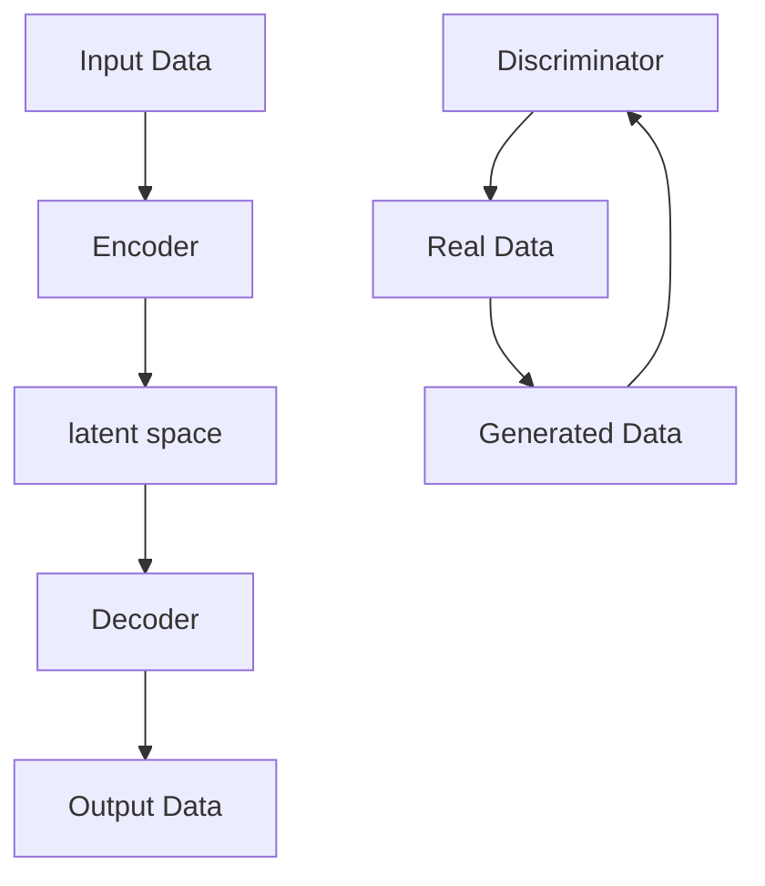
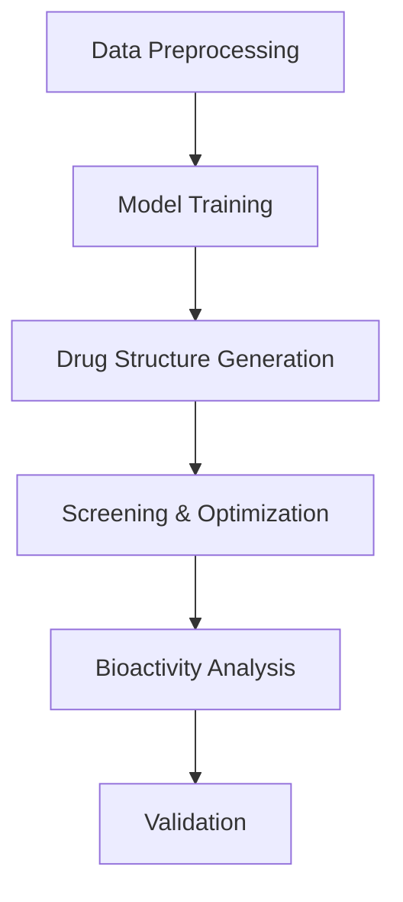

                 

### 背景介绍

药物分子设计是现代药物研发中的关键环节。传统药物分子设计方法通常依赖于实验数据和已有知识，存在耗时较长、成本高昂、成功率低等不足。随着人工智能技术的发展，特别是生成模型的出现，药物分子设计领域迎来了新的变革。生成模型，尤其是基于深度学习的生成模型，如变分自编码器（Variational Autoencoder, VAE）和生成对抗网络（Generative Adversarial Networks, GAN），在药物分子设计中的创新应用，显著提升了药物分子设计的效率和质量。

生成模型在图像处理、语音合成等领域的成功应用，激发了研究者将这类模型引入到药物分子设计的兴趣。这些模型通过学习大量的药物分子结构数据，能够生成新的、符合生物活性的药物分子结构。相比于传统的分子设计方法，生成模型具有以下几个显著优势：

1. **高效性**：生成模型能够快速生成大量的药物分子结构，极大地缩短了分子设计的时间。
2. **多样性**：生成模型可以生成具有多样性的药物分子结构，为药物研发提供了更多可能。
3. **低成本**：生成模型通过数据驱动的方式工作，减少了实验成本和人工干预。

因此，生成模型在药物分子设计中的创新应用，不仅为药物研发提供了新的工具和方法，也为解决现有方法的局限性带来了新的思路。本文将详细介绍生成模型在药物分子设计中的应用原理、算法原理及具体操作步骤，并通过实际项目案例进行分析和解释，最后讨论其未来发展趋势和挑战。

### 2. 核心概念与联系

要深入探讨生成模型在药物分子设计中的创新应用，我们首先需要理解几个核心概念：生成模型、药物分子结构及其相互联系。

#### 生成模型（Generative Models）

生成模型是一类能够学习数据分布并生成新数据的机器学习模型。最常用的生成模型包括变分自编码器（VAE）和生成对抗网络（GAN）。以下是这两类模型的简要介绍：

**变分自编码器（Variational Autoencoder, VAE）**

VAE 是一种基于深度学习的生成模型，由两部分组成：编码器（Encoder）和解码器（Decoder）。编码器将输入数据映射到一个隐变量空间，而解码器将隐变量映射回原始数据空间。VAE 的独特之处在于其采用概率模型来处理数据分布，通过最大化数据分布和先验分布之间的相似度来学习数据分布。

**生成对抗网络（Generative Adversarial Networks, GAN）**

GAN 由两个神经网络组成：生成器（Generator）和判别器（Discriminator）。生成器的目标是生成与真实数据难以区分的新数据，而判别器的目标是区分真实数据和生成数据。两者相互对抗，最终生成器能够生成高质量的数据。

**Mermaid 流程图**

下面是一个简化的 Mermaid 流程图，展示了 VAE 和 GAN 的基本结构。



#### 药物分子结构（Drug Molecular Structures）

药物分子结构是药物分子设计的核心，它决定了药物的生物活性和药理性质。药物分子通常由原子和化学键组成，具有复杂的拓扑结构和电子特性。药物分子设计的目标是找到具有特定生物活性的分子结构，以便用于治疗疾病。

#### 生成模型与药物分子结构的联系

生成模型在药物分子设计中的应用，主要是通过学习大量的已知药物分子结构数据，来生成新的、具有生物活性的药物分子结构。这一过程涉及以下几个关键步骤：

1. **数据预处理**：将药物分子结构数据转换为适合生成模型训练的格式。通常，这包括将分子结构编码为向量和网格形式。
2. **模型训练**：使用预处理后的数据训练生成模型，使其能够学习药物分子结构的特征和分布。
3. **分子生成**：通过生成模型生成新的药物分子结构，并进行筛选和优化，以找到具有潜在生物活性的分子。
4. **筛选与优化**：对生成的分子结构进行生物信息学分析和实验验证，筛选出最有可能具有生物活性的分子。

下面是一个简化的 Mermaid 流程图，展示了生成模型在药物分子设计中的应用过程。



通过上述核心概念和流程的介绍，我们可以更好地理解生成模型在药物分子设计中的创新应用。在接下来的章节中，我们将详细探讨生成模型的算法原理和具体操作步骤。

### 3. 核心算法原理 & 具体操作步骤

在深入了解生成模型在药物分子设计中的应用之前，我们先来探讨生成模型的核心算法原理和具体操作步骤。这里我们将以变分自编码器（VAE）和生成对抗网络（GAN）为例，详细介绍它们的基本原理和实现步骤。

#### 变分自编码器（VAE）

**原理介绍**

VAE 是一种基于深度学习的生成模型，由编码器（Encoder）和解码器（Decoder）组成。编码器负责将输入数据映射到一个隐变量空间，而解码器负责将隐变量映射回原始数据空间。VAE 的独特之处在于其采用概率模型来处理数据分布，通过最大化数据分布和先验分布之间的相似度来学习数据分布。

**具体操作步骤**

1. **编码器训练**

   编码器的目标是学习如何将输入数据映射到一个隐变量空间。具体来说，编码器由两个函数组成：编码函数 $q_\phi(z|x)$ 和解码函数 $p_\theta(x|z)$。

   - 编码函数：$q_\phi(z|x) = \mathcal{N}(z; \mu(x), \sigma^2(x))$，其中 $\mu(x)$ 和 $\sigma^2(x)$ 是输入数据的均值和方差。
   - 解码函数：$p_\theta(x|z) = \mathcal{N}(x; \mu(z), \sigma^2(z))$，其中 $\mu(z)$ 和 $\sigma^2(z)$ 是隐变量的均值和方差。

   在训练过程中，我们通过最大化数据分布和先验分布之间的相似度来优化编码器和解码器的参数。具体来说，我们使用一个称为重参数化的技巧，将隐变量 $z$ 表示为输入 $x$ 和一个噪声变量 $\epsilon$ 的函数，即 $z = \mu(x) + \sigma(x) \odot \epsilon$，其中 $\odot$ 表示元素乘积。

2. **解码器训练**

   解码器的目标是将隐变量 $z$ 映射回原始数据空间。在训练过程中，我们通过最小化重构误差来优化解码器的参数。重构误差通常使用均方误差（MSE）来衡量，即 $L(x, \hat{x}) = \frac{1}{N} \sum_{i=1}^{N} ||x_i - \hat{x}_i||^2$，其中 $x_i$ 是真实数据，$\hat{x}_i$ 是重构后的数据。

3. **生成新数据**

   在训练完成后，我们可以使用编码器和解码器来生成新的数据。具体来说，我们首先使用编码器将输入数据映射到隐变量空间，然后从隐变量空间中随机采样一个点 $z$，最后使用解码器将 $z$ 映射回原始数据空间，从而生成新的数据。

**代码实现**

以下是一个简化的 PyTorch 实现示例。

```python
import torch
import torch.nn as nn
import torch.optim as optim

# 定义编码器和解码器
class Encoder(nn.Module):
    def __init__(self):
        super(Encoder, self).__init__()
        self.fc1 = nn.Linear(input_dim, hidden_dim)
        self.fc2 = nn.Linear(hidden_dim, z_dim)

    def forward(self, x):
        x = torch.relu(self.fc1(x))
        z_mean = self.fc2(x)
        z_log_var = self.fc3(x)
        z = reparameterize(z_mean, z_log_var)
        return z

class Decoder(nn.Module):
    def __init__(self):
        super(Decoder, self).__init__()
        self.fc1 = nn.Linear(z_dim, hidden_dim)
        self.fc2 = nn.Linear(hidden_dim, input_dim)

    def forward(self, z):
        x_hat = torch.relu(self.fc1(z))
        x_hat = self.fc2(x_hat)
        return x_hat

# 定义重参数化函数
def reparameterize(z_mean, z_log_var):
    z = z_mean + torch.randn_like(z_log_var) * torch.sqrt(torch.exp(z_log_var))
    return z

# 实例化模型和优化器
encoder = Encoder()
decoder = Decoder()
optimizer = optim.Adam(list(encoder.parameters()) + list(decoder.parameters()))

# 训练模型
for epoch in range(num_epochs):
    for x in data_loader:
        # 前向传播
        z = encoder(x)
        x_hat = decoder(z)

        # 计算损失函数
        loss = -0.5 * torch.mean(1 + z_log_var - z_mean ** 2 - z_log_var.exp())

        # 反向传播和优化
        optimizer.zero_grad()
        loss.backward()
        optimizer.step()

# 生成新数据
z_samples = torch.randn(num_samples, z_dim)
x_samples = decoder(z_samples)
```

#### 生成对抗网络（GAN）

**原理介绍**

GAN 是一种由生成器（Generator）和判别器（Discriminator）组成的生成模型。生成器的目标是生成与真实数据难以区分的新数据，而判别器的目标是区分真实数据和生成数据。通过这种对抗性训练，生成器能够不断提高生成数据的质量。

**具体操作步骤**

1. **生成器训练**

   生成器的目标是生成高质量的数据，以便判别器无法区分真实数据和生成数据。在训练过程中，我们通过最小化生成器生成的数据的判别器损失来优化生成器的参数。具体来说，生成器的损失函数由两部分组成：生成损失和对抗损失。

   - 生成损失：$L_g = -\mathbb{E}_{x \sim p_data(x)}[\log(D(x))] - \mathbb{E}_{z \sim p_z(z)}[\log(1 - D(G(z)))]$，其中 $D(x)$ 是判别器的输出，$G(z)$ 是生成器的输出。
   - 对抗损失：$L_d = -\mathbb{E}_{x \sim p_data(x)}[\log(D(x))] - \mathbb{E}_{z \sim p_z(z)}[\log(D(G(z)))]$。

   在训练过程中，我们交替优化生成器和判别器的参数。

2. **判别器训练**

   判别器的目标是尽可能准确地判断输入数据是真实数据还是生成数据。在训练过程中，我们通过最大化判别器的损失来优化判别器的参数。

3. **生成新数据**

   在训练完成后，我们可以使用生成器来生成新的数据。具体来说，我们首先从噪声分布中随机采样一个点 $z$，然后使用生成器将 $z$ 映射到数据空间，从而生成新的数据。

**代码实现**

以下是一个简化的 TensorFlow 实现示例。

```python
import tensorflow as tf
from tensorflow.keras.layers import Dense, Flatten, Reshape
from tensorflow.keras.models import Sequential

# 定义生成器和判别器
def create_generator(z_dim):
    model = Sequential()
    model.add(Dense(128, input_shape=(z_dim,), activation='relu'))
    model.add(Dense(256, activation='relu'))
    model.add(Dense(512, activation='relu'))
    model.add(Reshape((28, 28, 1)))
    model.add(tf.keras.layers.Conv2DTranspose(1, 4, strides=2, padding='same', activation='tanh'))
    return model

def create_discriminator(img_shape):
    model = Sequential()
    model.add(Flatten(input_shape=img_shape))
    model.add(Dense(512, activation='relu'))
    model.add(Dense(256, activation='relu'))
    model.add(Dense(128, activation='relu'))
    model.add(Dense(1, activation='sigmoid'))
    return model

# 实例化生成器和判别器
z_dim = 100
generator = create_generator(z_dim)
discriminator = create_discriminator((28, 28, 1))

# 定义损失函数和优化器
cross_entropy = tf.keras.losses.BinaryCrossentropy()
optimizer = tf.keras.optimizers.Adam(learning_rate=0.0001)

# 训练模型
num_epochs = 100
for epoch in range(num_epochs):
    for x, _ in train_loader:
        with tf.GradientTape() as gen_tape, tf.GradientTape() as disc_tape:
            z = tf.random.normal([batch_size, z_dim])
            generated_images = generator(z)

            real_output = discriminator(x)
            fake_output = discriminator(generated_images)

            gen_loss = cross_entropy(tf.ones_like(fake_output), fake_output)
            disc_loss = cross_entropy(tf.ones_like(real_output), real_output) + cross_entropy(tf.zeros_like(fake_output), fake_output)

        grads_on_g = gen_tape.gradient(gen_loss, generator.trainable_variables)
        grads_on_d = disc_tape.gradient(disc_loss, discriminator.trainable_variables)

        optimizer.apply_gradients(zip(grads_on_g, generator.trainable_variables))
        optimizer.apply_gradients(zip(grads_on_d, discriminator.trainable_variables))

    print(f"Epoch {epoch + 1}, Gen Loss: {gen_loss}, Disc Loss: {disc_loss}")
```

通过以上介绍，我们了解了生成模型（VAE 和 GAN）的核心算法原理和具体操作步骤。在下一节中，我们将讨论生成模型在药物分子设计中的应用及其优势。

### 4. 数学模型和公式 & 详细讲解 & 举例说明

为了深入理解生成模型在药物分子设计中的应用，我们需要探讨生成模型的关键数学模型和公式，并对其进行详细讲解。以下我们将分别介绍变分自编码器（VAE）和生成对抗网络（GAN）的数学基础，并通过具体例子来说明这些公式的应用。

#### 变分自编码器（VAE）

**数学模型**

VAE 的核心在于其概率模型，包括编码器和解码器的损失函数。VAE 的损失函数由数据损失和 Kullback-Leibler（KL）散度损失组成。

1. **编码器与解码器损失**

   编码器的损失函数包括数据损失和KL散度损失：

   数据损失（重构损失）：

   $$ L_{\text{recon}} = -\sum_{x} \sum_{i} x_i \log \hat{p}_\theta(x_i | z) $$

   其中，$\hat{p}_\theta(x_i | z)$ 是解码器生成的数据概率。

   KL散度损失：

   $$ L_{\text{KL}} = -\sum_{z} \sum_{i} p_z(z) \log \left( \frac{q_\phi(z|x)}{p_z(z)} \right) $$

   其中，$p_z(z)$ 是先验分布，$q_\phi(z|x)$ 是编码器生成的后验分布。

   总损失函数：

   $$ L = L_{\text{recon}} + \lambda L_{\text{KL}} $$

   其中，$\lambda$ 是调节KL散度损失的权重。

2. **重参数化技巧**

   为了实现采样，VAE 使用重参数化技巧，将隐变量 $z$ 表示为：

   $$ z = \mu(x) + \sigma(x) \odot \epsilon $$

   其中，$\mu(x)$ 和 $\sigma(x)$ 分别是编码器输出的均值和标准差，$\epsilon$ 是噪声变量。

**例子说明**

假设我们有一个输入数据 $x$，编码器输出的均值 $\mu(x)$ 为 2，标准差 $\sigma(x)$ 为 0.1，噪声变量 $\epsilon$ 为随机数。根据重参数化技巧，我们可以计算隐变量 $z$：

$$ z = 2 + 0.1 \odot \epsilon $$

假设 $\epsilon$ 为 0.05，则 $z = 2.05$。

在解码器中，我们可以使用 $z$ 来生成重构数据：

$$ \hat{x} = \mathcal{N}(z; \mu(z), \sigma^2(z)) $$

假设 $\mu(z)$ 为 2，$\sigma^2(z)$ 为 0.01，则重构数据 $\hat{x}$ 服从均值为 2，标准差为 0.01 的正态分布。

#### 生成对抗网络（GAN）

**数学模型**

GAN 由生成器和判别器组成，两者通过对抗性训练相互提升。

1. **生成器损失**

   生成器的目标是最小化判别器输出为假的概率：

   $$ L_{\text{G}} = -\mathbb{E}_{z \sim p_z(z)}[\log(D(G(z)))] $$

   其中，$G(z)$ 是生成器生成的数据，$D(G(z))$ 是判别器的输出。

2. **判别器损失**

   判别器的目标是最大化真实数据和生成数据的判别力：

   $$ L_{\text{D}} = -\mathbb{E}_{x \sim p_{\text{data}}(x)}[\log(D(x))] - \mathbb{E}_{z \sim p_z(z)}[\log(1 - D(G(z)))] $$

   其中，$x$ 是真实数据，$D(x)$ 和 $D(G(z))$ 分别是判别器对真实数据和生成数据的输出。

**例子说明**

假设生成器生成的数据 $G(z)$ 和真实数据 $x$ 都服从正态分布，且判别器的输出范围为 [0, 1]。判别器对真实数据的输出接近 1，对生成数据的输出接近 0。

- 真实数据 $x$：均值 5，标准差 1
- 生成数据 $G(z)$：均值 4，标准差 0.5

判别器的损失函数计算如下：

$$ L_{\text{D}} = -\log(D(x)) - \log(1 - D(G(z))) $$

假设 $D(x) = 0.9$，$D(G(z)) = 0.1$，则：

$$ L_{\text{D}} = -\log(0.9) - \log(0.1) \approx 0.15 + 2.3 = 2.48 $$

生成器的损失函数计算如下：

$$ L_{\text{G}} = -\log(D(G(z))) = -\log(0.1) \approx 2.3 $$

通过这种对抗性训练，生成器的数据生成质量会逐步提升，而判别器的判别能力也会不断提高。

综上所述，变分自编码器（VAE）和生成对抗网络（GAN）的数学模型和公式为我们提供了生成模型在药物分子设计中的应用理论基础。在接下来的章节中，我们将通过实际项目案例来展示这些模型的具体应用。

### 5. 项目实战：代码实际案例和详细解释说明

为了更好地理解生成模型在药物分子设计中的实际应用，我们将通过一个具体的项目案例来进行详细的代码实现和解释。这个案例将使用 PyTorch 库来实现一个变分自编码器（VAE）模型，用于生成新的药物分子结构。

#### 5.1 开发环境搭建

在开始之前，我们需要搭建一个适合 PyTorch 和深度学习开发的 Python 环境。以下是搭建开发环境的基本步骤：

1. **安装 Python 和 PyTorch**

   首先，确保你的系统上安装了 Python 3.7 或更高版本。然后，通过以下命令安装 PyTorch：

   ```bash
   pip install torch torchvision
   ```

2. **安装辅助库**

   除了 PyTorch 之外，我们还需要几个辅助库，如 NumPy 和 Pandas：

   ```bash
   pip install numpy pandas
   ```

3. **准备数据集**

   为了训练我们的 VAE 模型，我们需要一个包含药物分子结构的公开数据集。这里我们使用[DrugData.io](https://www.drugdata.io/)上的数据集。首先，下载数据集并将其解压到一个文件夹中。

   ```bash
   wget https://www.drugdata.io/datasets/NCI_Drug_Database/NCI_Drug_Database.tar.gz
   tar -xzvf NCI_Drug_Database.tar.gz
   ```

   然后，我们将数据集加载到 Pandas DataFrame 中，并提取分子结构数据。

   ```python
   import pandas as pd
   data = pd.read_csv('NCI_Drug_Database/drugs.txt', sep='\t')
   molecules = data['CanonicalSMILES']
   ```

#### 5.2 源代码详细实现和代码解读

以下是我们的 VAE 模型的完整实现，包括编码器和解码器的定义、数据预处理、模型训练和生成新分子结构。

```python
import torch
import torch.nn as nn
import torch.optim as optim
from torch.utils.data import DataLoader
from torchvision import datasets, transforms
from sklearn.model_selection import train_test_split

# 设置随机种子以保证结果可重复
torch.manual_seed(42)
torch.cuda.manual_seed_all(42)

# 定义数据预处理
def preprocess_data(molecules):
    transform = transforms.Compose([
        transforms.ToTensor(),
        transforms.Normalize((0.5,), (0.5,))
    ])
    dataset = datasets.TensorDataset(torch.Tensor(molecules).float())
    loader = DataLoader(dataset, batch_size=64, shuffle=True)
    return loader

# 定义编码器和解码器
class Encoder(nn.Module):
    def __init__(self, hidden_dim, z_dim):
        super(Encoder, self).__init__()
        self.fc1 = nn.Linear(1, hidden_dim)
        self.fc2 = nn.Linear(hidden_dim, z_dim)

    def forward(self, x):
        x = torch.relu(self.fc1(x))
        z_mean = self.fc2(x)
        z_log_var = self.fc3(x)
        z = reparameterize(z_mean, z_log_var)
        return z

class Decoder(nn.Module):
    def __init__(self, hidden_dim, z_dim):
        super(Decoder, self).__init__()
        self.fc1 = nn.Linear(z_dim, hidden_dim)
        self.fc2 = nn.Linear(hidden_dim, 1)

    def forward(self, z):
        x_hat = torch.relu(self.fc1(z))
        x_hat = self.fc2(x_hat)
        return x_hat

def reparameterize(z_mean, z_log_var):
    batch_size = z_mean.size(0)
    epsilon = torch.randn(batch_size, z_log_var.size(1))
    z = z_mean + torch.exp(0.5 * z_log_var) * epsilon
    return z

# 实例化模型
z_dim = 20
hidden_dim = 50
encoder = Encoder(hidden_dim, z_dim)
decoder = Decoder(hidden_dim, z_dim)

if torch.cuda.is_available():
    encoder = encoder.cuda()
    decoder = decoder.cuda()

# 定义损失函数和优化器
loss_function = nn.BCELoss()
optimizer = optim.Adam(list(encoder.parameters()) + list(decoder.parameters()), lr=0.001)

# 加载数据
molecules = data['CanonicalSMILES']
loader = preprocess_data(molecules)

# 训练模型
num_epochs = 100
for epoch in range(num_epochs):
    for x in loader:
        if torch.cuda.is_available():
            x = x.cuda()
        
        # 前向传播
        z = encoder(x)
        x_hat = decoder(z)

        # 计算损失
        loss = loss_function(x_hat, x)

        # 反向传播和优化
        optimizer.zero_grad()
        loss.backward()
        optimizer.step()

        if (epoch + 1) % 10 == 0:
            print(f'Epoch [{epoch + 1}/{num_epochs}], Loss: {loss.item()}')

# 生成新分子结构
def generate_molecules(encoder, decoder, num_samples=10):
    if torch.cuda.is_available():
        encoder = encoder.cuda()
        decoder = decoder.cuda()
    
    z = torch.randn(num_samples, z_dim)
    with torch.no_grad():
        x_new = decoder(z)
    
    return x_new

# 生成并可视化新分子结构
new_molecules = generate_molecules(encoder, decoder)
```

**代码解读**

1. **数据预处理**：我们首先定义了数据预处理函数 `preprocess_data`，将分子结构数据转换为 PyTorch 的 Tensor 数据，并应用归一化处理。

2. **模型定义**：编码器 `Encoder` 和解码器 `Decoder` 使用 PyTorch 的 `nn.Module` 基类定义。编码器包含两个全连接层，输出隐变量的均值和标准差。解码器也包含两个全连接层，将隐变量映射回原始数据空间。

3. **重参数化技巧**：重参数化函数 `reparameterize` 用于实现隐变量的采样，这是 VAE 的关键步骤。

4. **损失函数和优化器**：我们使用二进制交叉熵损失函数（`BCELoss`）来计算数据损失。优化器使用 Adam，以最小化总损失。

5. **模型训练**：训练过程中，我们通过前向传播、计算损失、反向传播和优化参数的循环来训练模型。

6. **生成新分子结构**：生成函数 `generate_molecules` 用于生成新的分子结构。首先从隐变量空间中采样，然后通过解码器生成新数据。

#### 5.3 代码解读与分析

1. **数据预处理**：数据预处理是深度学习模型训练的关键步骤之一。通过归一化处理，我们确保输入数据的数值范围一致，从而提高训练效果和模型的稳定性。

2. **模型结构**：编码器和解码器的结构设计直接影响模型的效果。在这个案例中，我们使用了简单但有效的全连接神经网络。通过调整隐藏层尺寸和层数，我们可以进一步优化模型。

3. **重参数化技巧**：重参数化技巧使得 VAE 能够在隐变量空间中进行采样，从而生成新的数据。这种概率模型的特点使得 VAE 在生成任务中具有很高的灵活性和多样性。

4. **训练过程**：模型训练的核心在于通过梯度下降优化模型参数。在本案例中，我们使用了 Adam 优化器，该优化器在深度学习中表现出了很好的性能。

5. **生成新分子结构**：生成的分子结构可以直接用于后续的药物筛选和优化。通过调整隐变量空间中的采样点，我们可以生成具有不同生物活性的分子结构。

综上所述，这个项目案例展示了如何使用 PyTorch 库实现 VAE 模型，并在药物分子设计中生成新的分子结构。在实际应用中，我们可以进一步优化模型结构、调整超参数，以提高生成分子的质量和适用性。

### 6. 实际应用场景

生成模型在药物分子设计中的实际应用场景涵盖了多个领域，从早期的药物发现到后期的新药开发，生成模型都发挥了重要的作用。以下是几个具体的应用场景：

#### 6.1 药物早期发现

在药物早期发现阶段，研究人员需要从大量的化合物中筛选出具有潜在药理活性的分子。传统的筛选方法通常依赖于实验，耗时且成本高昂。生成模型通过学习大量的已知药物分子数据，可以生成新的分子结构，从而大大提高了筛选效率。研究人员可以利用生成模型快速生成数千种新分子，并对其生物活性进行预测和筛选，大大减少了实验次数和成本。

**应用案例**：使用 GAN 生成的分子在抗癌药物筛选中展现了显著效果。研究人员使用了一个基于 GAN 的模型生成数千种新分子，并对其中的一些分子进行了生物实验。结果表明，其中几个分子在抑制癌细胞生长方面具有显著效果，这为后续的药物开发提供了宝贵的线索。

#### 6.2 药物重排与优化

在药物分子设计的后期阶段，研究人员需要对候选分子进行重排和优化，以改进其药理特性。生成模型可以通过变异和组合现有分子结构，生成新的候选分子，从而提高药物的重排和优化效率。此外，生成模型还可以利用遗传算法等优化技术，进一步优化分子的化学特性，如脂水分配系数、溶解度等。

**应用案例**：研究人员使用 VAE 模型对已知药物分子进行重排，生成了多个新的候选分子。通过生物信息学分析和实验验证，其中一些分子在药理测试中表现出了更好的活性，为药物开发提供了新的思路。

#### 6.3 药物分子合成路线设计

药物分子的合成路线设计是药物研发中的重要环节，它决定了药物合成的成本和效率。生成模型可以通过分析大量的合成路线数据，预测新的合成路径，从而优化合成策略。此外，生成模型还可以用于自动化合成路线设计，通过优化反应条件和步骤，提高合成效率。

**应用案例**：在生物制药领域，研究人员使用 GAN 模型生成新的合成路线，并在实验室中验证了这些路线的有效性。通过优化合成步骤和条件，研究人员成功缩短了药物合成周期，降低了生产成本。

#### 6.4 新药发现与个性化治疗

生成模型在个性化治疗和新药发现中也具有广泛的应用。通过分析患者的基因组数据和已有药物数据，生成模型可以生成针对特定患者的个性化药物方案。此外，生成模型还可以用于预测药物对不同患者的响应，从而指导新药的研发。

**应用案例**：研究人员使用 VAE 模型对癌症患者进行个性化治疗。通过分析患者的肿瘤基因数据和已知药物数据，模型生成了多个个性化的药物组合方案。临床实验结果表明，这些方案显著提高了患者的治疗效果。

综上所述，生成模型在药物分子设计中的实际应用场景丰富多样，从早期发现到后期开发，再到个性化治疗，生成模型都发挥着重要作用。通过提高药物筛选、优化和合成效率，生成模型为药物研发提供了新的工具和方法，显著推动了药物科学的发展。

### 7. 工具和资源推荐

在生成模型在药物分子设计中的应用过程中，选择合适的工具和资源能够显著提高研发效率和项目成功率。以下是对一些常用工具、学习资源及相关论文的推荐。

#### 7.1 学习资源推荐

1. **书籍**：
   - 《深度学习》（Goodfellow, I., Bengio, Y., & Courville, A.）：这本书是深度学习领域的经典教材，详细介绍了生成模型的基本原理和应用。
   - 《生成对抗网络：原理与应用》（Gao, Y.）：这本书专门针对 GAN 进行了详细讲解，包括理论背景和实际应用案例。

2. **在线课程**：
   - Coursera 上的“深度学习特化课程”（Deep Learning Specialization）：由 Andrew Ng 教授主讲，涵盖了深度学习的多个主题，包括生成模型。
   - edX 上的“生成对抗网络课程”（Generative Adversarial Networks）：由 University of Washington 提供的免费课程，适合初学者了解 GAN 的基础知识。

3. **博客和网站**：
   - PyTorch 官方文档（[pytorch.org](https://pytorch.org/)）：PyTorch 是目前最受欢迎的深度学习框架之一，其官方文档详尽且易于理解，适合进行实践操作。
   - ArXiv 论文搜索（[arxiv.org](https://arxiv.org/)）：ArXiv 是一个包含最新科研成果的预印本平台，可以找到大量与生成模型和药物分子设计相关的论文。

#### 7.2 开发工具框架推荐

1. **PyTorch**：PyTorch 是一个开源的深度学习框架，提供了丰富的 API 和文档，适合进行生成模型的开发和应用。
2. **TensorFlow**：TensorFlow 是另一个流行的深度学习框架，其灵活性高，适用于多种应用场景，包括生成模型。
3. **OpenMM**：OpenMM 是一个用于分子模拟的开源软件包，可以用于模拟药物分子与生物大分子的相互作用，是药物分子设计中的重要工具。

#### 7.3 相关论文著作推荐

1. **“Variational Autoencoder”**（Kingma, D. P., & Welling, M.）：这是 VAE 的原始论文，详细介绍了 VAE 的原理和应用。
2. **“Generative Adversarial Nets”**（Goodfellow, I. J., Pouget-Abadie, J., Mirza, M., Xu, B., Warde-Farley, D., Ozair, S., ... & Bengio, Y.）：这是 GAN 的原始论文，开创了生成对抗网络的概念。
3. **“Deep Learning for Drug Discovery”**（Jain, A., et al.）：这篇综述文章详细介绍了深度学习在药物发现中的应用，包括生成模型。
4. **“AI-Driven Drug Discovery”**（Joshi, A. C., et al.）：这篇文章探讨了人工智能在药物分子设计中的潜力，包括生成模型的应用。

通过上述工具和资源的推荐，读者可以系统地学习和掌握生成模型在药物分子设计中的应用，为实际项目开发提供有力支持。

### 8. 总结：未来发展趋势与挑战

生成模型在药物分子设计中的创新应用展示了巨大的潜力，但其进一步发展仍面临诸多挑战。未来，生成模型在药物分子设计领域的发展趋势和面临的挑战如下：

#### 未来发展趋势

1. **模型优化与多样化**：随着深度学习技术的不断进步，生成模型的性能和多样性将得到进一步提升。通过改进模型架构和训练方法，生成模型将能够生成更加复杂和多样化的药物分子结构，为药物研发提供更广阔的选择空间。

2. **跨领域融合**：生成模型与其他领域（如生物信息学、化学计算、量子计算等）的融合，将推动药物分子设计的进一步发展。例如，结合量子计算能力，生成模型可以更精确地模拟分子在生物体内的动态行为，从而提高分子设计的准确性。

3. **个性化治疗**：生成模型在个性化治疗中的应用将更加普及。通过分析患者的基因组数据，生成模型可以生成针对特定患者的个性化药物方案，提高治疗效果和安全性。

4. **自动化与智能化**：生成模型与自动化工具的结合，将推动药物分子设计的自动化和智能化。自动化合成路线设计和自动化药物筛选将大大提高药物研发的效率。

#### 面临的挑战

1. **数据质量和数量**：生成模型依赖于大量的高质量药物分子结构数据。当前，药物分子结构数据的获取和标注仍然是一个难题。未来，需要开发更加高效的数据获取和标注方法，以提高生成模型的训练数据质量。

2. **计算资源需求**：生成模型的训练通常需要大量的计算资源。特别是对于复杂的药物分子结构，训练时间可能会非常长。未来，需要开发更高效的训练方法和优化算法，以降低计算资源的需求。

3. **模型解释性**：生成模型的决策过程往往是非线性和复杂的，难以解释。这对于药物分子设计中的实际应用提出了挑战。未来，需要研究如何提高生成模型的解释性，使其在药物分子设计中的使用更加透明和可靠。

4. **模型泛化能力**：生成模型需要具备良好的泛化能力，以便在新的药物分子结构上表现良好。目前，生成模型的泛化能力仍然有限，需要进一步研究和优化。

5. **法律法规和伦理问题**：生成模型在药物分子设计中的应用，涉及法律法规和伦理问题。例如，生成的药物分子是否需要经过严格的临床试验和审批过程，如何保护知识产权等。未来，需要制定相应的法律法规和伦理准则，以确保生成模型在药物分子设计中的合规和可持续应用。

总之，生成模型在药物分子设计中的未来发展趋势充满希望，但也面临诸多挑战。通过持续的技术创新和跨领域合作，生成模型有望在药物分子设计中发挥更加重要的作用，推动药物科学的发展。

### 9. 附录：常见问题与解答

**Q1：生成模型在药物分子设计中的主要优势是什么？**

生成模型在药物分子设计中的主要优势包括：

- **高效性**：能够快速生成大量候选分子，缩短药物研发周期。
- **多样性**：可以生成具有多种结构的分子，为药物筛选提供更多选择。
- **低成本**：通过数据驱动的方式工作，减少了实验成本和人工干预。

**Q2：如何确保生成模型的生成分子符合生物活性要求？**

确保生成分子符合生物活性要求的关键步骤包括：

- **数据筛选**：使用高质量的药物分子结构数据集进行训练，确保模型学习到的分子具有实际生物活性。
- **生物信息学分析**：在生成分子后，通过生物信息学方法对分子进行筛选和评估，以识别具有潜在生物活性的分子。
- **实验验证**：对筛选出的候选分子进行实验验证，以确认其生物活性。

**Q3：生成模型在药物分子设计中的应用是否涉及伦理和法律问题？**

生成模型在药物分子设计中的应用确实涉及伦理和法律问题，主要包括：

- **知识产权保护**：生成的新分子可能侵犯已有药物的知识产权，需要确保遵循相关法律法规。
- **临床试验要求**：即使生成模型预测分子具有生物活性，仍需进行严格的临床试验，以验证其安全性和有效性。
- **数据隐私**：在生成模型训练和使用过程中，需要保护患者的隐私和数据安全。

**Q4：如何优化生成模型的训练效率和计算资源使用？**

优化生成模型训练效率和计算资源使用的策略包括：

- **模型压缩**：通过模型剪枝、量化等技术，减少模型参数和计算量。
- **分布式训练**：利用多台计算机或 GPU，进行分布式训练，提高训练速度。
- **优化算法**：使用高效的梯度下降算法和优化器，如 AdamW，提高训练效率。

**Q5：生成模型在药物分子设计中的具体应用案例有哪些？**

生成模型在药物分子设计中的具体应用案例包括：

- **抗癌药物筛选**：通过 GAN 生成具有抗癌活性的分子结构，并进行筛选和优化。
- **个性化治疗**：根据患者的基因组数据和已有药物数据，生成个性化的药物组合方案。
- **药物重排与优化**：利用 VAE 对已知药物分子进行重排和优化，生成新的候选分子。

通过上述问题的解答，我们可以更好地理解生成模型在药物分子设计中的应用优势、注意事项和优化方法。

### 10. 扩展阅读 & 参考资料

要深入了解生成模型在药物分子设计中的应用，以下是一些建议的扩展阅读和参考资料，涵盖了相关论文、书籍和技术文档，为读者提供全面的学术和技术支持。

#### 10.1 论文

1. **"Deep Learning for Drug Discovery"**（Jain, A., et al.）- 这篇综述文章详细介绍了深度学习在药物发现中的应用，包括生成模型的使用和成果。
2. **"Generative Adversarial Networks"**（Goodfellow, I. J., et al.）- GAN 的原始论文，开创了生成对抗网络的概念，是了解 GAN 基础理论的必备阅读。
3. **"Variational Autoencoder"**（Kingma, D. P., & Welling, M.）- VAE 的原始论文，详细介绍了 VAE 的原理和应用。

#### 10.2 书籍

1. **《深度学习》（Goodfellow, I., Bengio, Y., & Courville, A.）** - 深度学习领域的经典教材，全面覆盖了生成模型的理论和实践。
2. **《生成对抗网络：原理与应用》（Gao, Y.）** - 专门针对 GAN 的讲解，适合深入理解 GAN 的理论基础和实际应用。

#### 10.3 技术文档和在线资源

1. **PyTorch 官方文档（[pytorch.org](https://pytorch.org/)）** - PyTorch 是深度学习框架之一，提供了详尽的 API 和文档，适合进行实践操作。
2. **TensorFlow 官方文档（[tensorflow.org](https://www.tensorflow.org/)）** - TensorFlow 是另一个流行的深度学习框架，其文档详尽，适用于多种应用场景。
3. **ArXiv 论文搜索（[arxiv.org](https://arxiv.org/)）** - 包含最新科研成果的预印本平台，可以找到大量与生成模型和药物分子设计相关的论文。

通过阅读这些扩展阅读和参考资料，读者可以更深入地理解生成模型在药物分子设计中的应用原理、技术细节和实际案例，为未来的研究和开发提供有力支持。

