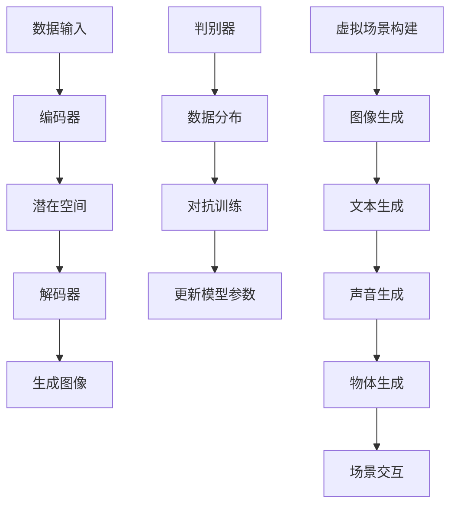

                 

### 1. 背景介绍

生成模型（Generative Models）作为深度学习领域中的一种重要技术，近年来在计算机视觉、自然语言处理等多个领域取得了显著成果。生成模型的主要任务是从给定的数据分布中生成符合该分布的样本，这一过程不仅有助于我们更好地理解数据分布的内在结构，还可以在图像生成、文本生成等任务中实现高质量的数据生成。

虚拟场景构建是计算机图形学和游戏开发中的一个重要领域，它旨在创建高度真实和交互性的虚拟环境，为用户带来沉浸式体验。传统的虚拟场景构建方法依赖于大量的手工制作和规则设定，这不仅效率低下，且难以应对复杂场景的动态变化。随着生成模型技术的不断发展，人们开始探索将这些先进的技术应用于虚拟场景构建中，以期实现自动化、高效且高质量的虚拟环境生成。

本文将围绕生成模型在虚拟场景构建中的应用进行探讨，首先介绍生成模型的基本概念和分类，然后深入分析生成模型在虚拟场景构建中的创新应用，最后总结目前的研究成果和未来可能的发展方向。通过这篇文章，读者将全面了解生成模型在虚拟场景构建中的潜力和挑战，为相关领域的深入研究提供有益的参考。

**Keywords: 生成模型，虚拟场景构建，计算机图形学，深度学习，图像生成，文本生成**

**Abstract:**

本文首先介绍了生成模型的基本概念、分类和应用场景，重点探讨了生成模型在虚拟场景构建中的创新应用。通过结合实际案例和数学模型分析，文章详细阐述了生成模型如何被应用于虚拟场景的生成、优化和交互，为相关领域的研究和实践提供了新的思路和方法。最后，文章总结了生成模型在虚拟场景构建中的研究成果和未来发展方向，展望了该领域的发展前景。

### 2. 核心概念与联系

在深入探讨生成模型在虚拟场景构建中的应用之前，有必要先了解生成模型的基本概念、分类及其与虚拟场景构建的相关性。

**2.1 生成模型的基本概念**

生成模型是一类旨在通过学习数据分布来生成新数据的机器学习模型。生成模型的基本思想是学习数据的高斯分布，然后利用这个分布生成新的数据点。生成模型的主要任务是从给定的数据集中学习到数据分布，然后根据这个分布生成新的、符合数据分布的样本。生成模型在图像生成、文本生成、语音合成等任务中有着广泛的应用。

生成模型主要分为两大类：概率生成模型和确定性生成模型。

- **概率生成模型**：这类模型通过学习数据分布的概率分布函数来生成样本。其中，变分自编码器（Variational Autoencoder，VAE）和生成对抗网络（Generative Adversarial Networks，GAN）是典型的概率生成模型。

  - **变分自编码器（VAE）**：VAE是一种基于概率模型的生成模型，旨在通过编码器和解码器共同学习数据分布的潜在空间。VAE的核心思想是将输入数据映射到一个潜在空间中的点，然后从潜在空间中采样，再通过解码器将采样点还原为输出数据。VAE在图像生成和文本生成等领域取得了显著成果。

  - **生成对抗网络（GAN）**：GAN是由生成器和判别器组成的一种对抗性模型。生成器的任务是生成与真实数据相似的数据，而判别器的任务是区分生成数据与真实数据。通过这种对抗性训练，生成器能够逐渐提高生成数据的真实性。GAN在图像生成、视频生成和语音合成等领域取得了突破性成果。

- **确定性生成模型**：这类模型通过学习数据分布的确定性映射来生成样本。其中，生成扩散模型（Generative Diffusion Model）和流模型（Flow Models）是典型的确定性生成模型。

  - **生成扩散模型**：生成扩散模型是一种通过将数据从一个简单分布逐渐扩散到真实分布的模型。该模型首先将数据从一个简单的分布（如高斯分布）中采样，然后通过一系列的扩散步骤逐渐接近真实数据的分布。生成扩散模型在图像生成和视频生成领域取得了显著成果。

  - **流模型**：流模型通过学习数据分布的确定性变换来生成样本。流模型的核心思想是将输入数据通过一系列的变换映射到一个新的数据分布上。流模型在图像生成、文本生成和语音合成等领域也有着广泛的应用。

**2.2 生成模型与虚拟场景构建的相关性**

虚拟场景构建需要生成真实、丰富且多样化的场景内容，生成模型在这一过程中发挥着关键作用。生成模型与虚拟场景构建之间的相关性主要体现在以下几个方面：

- **图像生成**：生成模型在图像生成任务中能够生成高质量、多样化的图像，为虚拟场景构建提供了丰富的素材。例如，GAN可以生成逼真的风景图像、人物图像和场景图像，这些图像可以用于虚拟现实场景的构建。

- **文本生成**：生成模型在文本生成任务中能够生成符合语法和语义规则的文本，为虚拟场景构建提供了丰富的文本内容。例如，生成模型可以生成故事情节、对话脚本和说明文本，这些文本可以用于虚拟现实游戏和交互式场景的设计。

- **声音生成**：生成模型在声音生成任务中能够生成逼真的声音效果，为虚拟场景构建提供了丰富的听觉体验。例如，生成模型可以生成环境音效、音乐和语音，这些声音效果可以用于虚拟现实游戏和交互式场景的听觉设计。

- **物体生成**：生成模型在物体生成任务中能够生成各种类型的物体，为虚拟场景构建提供了丰富的物体资源。例如，生成模型可以生成建筑、车辆、植物和动物等物体，这些物体可以用于虚拟现实场景的环境设计和交互设计。

- **场景交互**：生成模型在场景交互任务中能够根据用户行为和场景需求动态生成新的场景内容，提高虚拟场景的交互性和动态性。例如，生成模型可以根据用户的动作和选择生成新的场景元素，提供个性化的虚拟体验。

通过上述分析，我们可以看到生成模型在虚拟场景构建中具有广泛的应用前景。接下来，我们将进一步探讨生成模型在虚拟场景构建中的创新应用，分析其在实际场景中的具体应用和挑战。

**2.3 Mermaid 流程图**



**图 1：生成模型与虚拟场景构建的相关性流程图**

通过该流程图，我们可以清晰地看到生成模型在虚拟场景构建中的各个环节，以及生成模型如何通过图像生成、文本生成、声音生成、物体生成和场景交互等环节为虚拟场景构建提供支持。

### 3. 核心算法原理 & 具体操作步骤

生成模型在虚拟场景构建中的应用主要依赖于图像生成、文本生成、声音生成、物体生成和场景交互等任务。本节将详细阐述这些核心算法的原理和具体操作步骤，以便读者更好地理解生成模型在虚拟场景构建中的实际应用。

#### 3.1 图像生成

图像生成是生成模型在虚拟场景构建中最常见的应用之一。图像生成算法的核心思想是通过学习真实图像的数据分布，生成与真实图像相似的新图像。

**3.1.1 生成对抗网络（GAN）**

生成对抗网络（GAN）是一种基于对抗性训练的生成模型，由生成器和判别器组成。生成器的任务是生成与真实图像相似的数据，而判别器的任务是区分生成图像和真实图像。

具体操作步骤如下：

1. **数据准备**：收集大量真实图像数据作为训练集。

2. **模型初始化**：初始化生成器和判别器模型，通常使用随机初始化。

3. **训练过程**：
   - **生成器训练**：生成器根据判别器的反馈，不断调整生成策略，生成更真实的数据。
   - **判别器训练**：判别器根据生成器和真实图像的数据，不断调整判别策略，提高区分能力。

4. **生成图像**：在训练完成后，生成器可以生成与真实图像相似的新图像。

**3.1.2 变分自编码器（VAE）**

变分自编码器（VAE）是一种基于概率模型的生成模型，通过编码器和解码器共同学习数据分布的潜在空间。

具体操作步骤如下：

1. **数据准备**：收集大量真实图像数据作为训练集。

2. **模型初始化**：初始化编码器和解码器模型，通常使用随机初始化。

3. **训练过程**：
   - **编码器训练**：编码器将输入图像映射到潜在空间中的一个点。
   - **解码器训练**：解码器从潜在空间中采样，然后通过解码器将采样点还原为输出图像。

4. **生成图像**：在训练完成后，编码器可以从潜在空间中采样，解码器将采样点还原为生成图像。

#### 3.2 文本生成

文本生成是生成模型在虚拟场景构建中的另一个重要应用。文本生成算法的核心思想是通过学习真实文本的数据分布，生成与真实文本相似的新文本。

**3.2.1 生成对抗网络（GAN）**

生成对抗网络（GAN）在文本生成中的应用与图像生成类似，生成器和判别器分别生成和鉴别文本。

具体操作步骤如下：

1. **数据准备**：收集大量真实文本数据作为训练集。

2. **模型初始化**：初始化生成器和判别器模型，通常使用随机初始化。

3. **训练过程**：
   - **生成器训练**：生成器根据判别器的反馈，生成更真实的文本。
   - **判别器训练**：判别器根据生成器和真实文本的数据，提高鉴别能力。

4. **生成文本**：在训练完成后，生成器可以生成与真实文本相似的新文本。

**3.2.2 变分自编码器（VAE）**

变分自编码器（VAE）在文本生成中的应用与图像生成类似，通过编码器和解码器共同学习文本数据的潜在空间。

具体操作步骤如下：

1. **数据准备**：收集大量真实文本数据作为训练集。

2. **模型初始化**：初始化编码器和解码器模型，通常使用随机初始化。

3. **训练过程**：
   - **编码器训练**：编码器将输入文本映射到潜在空间中的一个点。
   - **解码器训练**：解码器从潜在空间中采样，然后通过解码器将采样点还原为输出文本。

4. **生成文本**：在训练完成后，编码器可以从潜在空间中采样，解码器将采样点还原为生成文本。

#### 3.3 声音生成

声音生成是生成模型在虚拟场景构建中的又一重要应用。声音生成算法的核心思想是通过学习真实声音的数据分布，生成与真实声音相似的新声音。

**3.3.1 生成对抗网络（GAN）**

生成对抗网络（GAN）在声音生成中的应用与图像和文本生成类似，生成器和判别器分别生成和鉴别声音。

具体操作步骤如下：

1. **数据准备**：收集大量真实声音数据作为训练集。

2. **模型初始化**：初始化生成器和判别器模型，通常使用随机初始化。

3. **训练过程**：
   - **生成器训练**：生成器根据判别器的反馈，生成更真实的声音。
   - **判别器训练**：判别器根据生成器和真实声音的数据，提高鉴别能力。

4. **生成声音**：在训练完成后，生成器可以生成与真实声音相似的新声音。

**3.3.2 变分自编码器（VAE）**

变分自编码器（VAE）在声音生成中的应用与图像和文本生成类似，通过编码器和解码器共同学习声音数据的潜在空间。

具体操作步骤如下：

1. **数据准备**：收集大量真实声音数据作为训练集。

2. **模型初始化**：初始化编码器和解码器模型，通常使用随机初始化。

3. **训练过程**：
   - **编码器训练**：编码器将输入声音映射到潜在空间中的一个点。
   - **解码器训练**：解码器从潜在空间中采样，然后通过解码器将采样点还原为输出声音。

4. **生成声音**：在训练完成后，编码器可以从潜在空间中采样，解码器将采样点还原为生成声音。

#### 3.4 物体生成

物体生成是生成模型在虚拟场景构建中的应用之一。物体生成算法的核心思想是通过学习真实物体的数据分布，生成与真实物体相似的新物体。

**3.4.1 生成对抗网络（GAN）**

生成对抗网络（GAN）在物体生成中的应用与图像、文本和声音生成类似，生成器和判别器分别生成和鉴别物体。

具体操作步骤如下：

1. **数据准备**：收集大量真实物体数据作为训练集。

2. **模型初始化**：初始化生成器和判别器模型，通常使用随机初始化。

3. **训练过程**：
   - **生成器训练**：生成器根据判别器的反馈，生成更真实的物体。
   - **判别器训练**：判别器根据生成器和真实物体的数据，提高鉴别能力。

4. **生成物体**：在训练完成后，生成器可以生成与真实物体相似的新物体。

**3.4.2 变分自编码器（VAE）**

变分自编码器（VAE）在物体生成中的应用与图像、文本和声音生成类似，通过编码器和解码器共同学习物体数据的潜在空间。

具体操作步骤如下：

1. **数据准备**：收集大量真实物体数据作为训练集。

2. **模型初始化**：初始化编码器和解码器模型，通常使用随机初始化。

3. **训练过程**：
   - **编码器训练**：编码器将输入物体映射到潜在空间中的一个点。
   - **解码器训练**：解码器从潜在空间中采样，然后通过解码器将采样点还原为输出物体。

4. **生成物体**：在训练完成后，编码器可以从潜在空间中采样，解码器将采样点还原为生成物体。

#### 3.5 场景交互

场景交互是生成模型在虚拟场景构建中的应用之一。场景交互算法的核心思想是通过学习场景数据分布，生成符合场景需求的动态交互内容。

**3.5.1 生成对抗网络（GAN）**

生成对抗网络（GAN）在场景交互中的应用与图像、文本、声音和物体生成类似，生成器和判别器分别生成和鉴别场景交互内容。

具体操作步骤如下：

1. **数据准备**：收集大量真实场景交互数据作为训练集。

2. **模型初始化**：初始化生成器和判别器模型，通常使用随机初始化。

3. **训练过程**：
   - **生成器训练**：生成器根据判别器的反馈，生成更真实的场景交互内容。
   - **判别器训练**：判别器根据生成器和真实场景交互的数据，提高鉴别能力。

4. **生成交互内容**：在训练完成后，生成器可以生成符合场景需求的动态交互内容。

**3.5.2 变分自编码器（VAE）**

变分自编码器（VAE）在场景交互中的应用与图像、文本、声音和物体生成类似，通过编码器和解码器共同学习场景交互数据的潜在空间。

具体操作步骤如下：

1. **数据准备**：收集大量真实场景交互数据作为训练集。

2. **模型初始化**：初始化编码器和解码器模型，通常使用随机初始化。

3. **训练过程**：
   - **编码器训练**：编码器将输入场景交互映射到潜在空间中的一个点。
   - **解码器训练**：解码器从潜在空间中采样，然后通过解码器将采样点还原为输出场景交互内容。

4. **生成交互内容**：在训练完成后，编码器可以从潜在空间中采样，解码器将采样点还原为生成交互内容。

通过上述算法原理和操作步骤的阐述，我们可以看到生成模型在虚拟场景构建中的应用是如何实现的。在接下来的章节中，我们将通过实际案例和详细解释，进一步探讨生成模型在虚拟场景构建中的具体应用和效果。

### 4. 数学模型和公式 & 详细讲解 & 举例说明

在深入理解生成模型在虚拟场景构建中的应用之前，我们需要掌握其背后的数学模型和公式。以下是生成模型中常用的数学模型和公式，我们将结合具体例子进行详细讲解。

#### 4.1 变分自编码器（VAE）

变分自编码器（VAE）是一种基于概率模型的生成模型，它通过编码器和解码器共同学习数据分布的潜在空间。VAE的核心数学模型包括编码器、解码器和损失函数。

**4.1.1 编码器**

编码器将输入数据映射到潜在空间中的一个点。假设输入数据为 \(x \in \mathbb{R}^{D_x}\)，潜在空间中的点为 \(z \in \mathbb{R}^{D_z}\)，编码器由两个神经网络组成：均值网络和方差网络。

- **均值网络**：\( \mu(x) = \mu_1(x, \theta_1) \)，其中 \(\theta_1\) 是均值网络的参数。
- **方差网络**：\( \sigma^2(x) = \sigma_2(x, \theta_2) \)，其中 \(\theta_2\) 是方差网络的参数。

编码器的输出为 \(z = \mu(x) + \sigma(x) \odot \epsilon\)，其中 \(\epsilon \sim \mathcal{N}(0, I)\) 是噪声向量。

**4.1.2 解码器**

解码器将潜在空间中的点 \(z\) 还原为输出数据 \(x'\)。假设解码器由一个神经网络组成，其参数为 \(\theta_3\)。

- **解码器**：\( x' = \phi(z, \theta_3) \)，其中 \(\phi\) 是解码器的激活函数。

**4.1.3 损失函数**

VAE的损失函数通常为均方误差（MSE）或交叉熵损失。

- **MSE损失函数**：\( \mathcal{L}_\text{MSE} = \frac{1}{N} \sum_{i=1}^{N} \sum_{j=1}^{D_x} (x_i[j] - x'_i[j])^2 \)
- **交叉熵损失函数**：\( \mathcal{L}_\text{CE} = \frac{1}{N} \sum_{i=1}^{N} \sum_{j=1}^{D_x} -x_i[j] \log x'_i[j] - (1 - x_i[j]) \log (1 - x'_i[j]) \)

**4.1.4 例子说明**

假设我们要使用VAE生成一张256x256的彩色图像。首先，我们收集一幅256x256的彩色图像作为输入，然后将其转换为向量形式 \(x \in \mathbb{R}^{256 \times 256 \times 3}\)。接着，我们通过均值网络和方差网络将输入图像映射到潜在空间中的一个点 \(z\)。在训练过程中，我们使用MSE损失函数来优化模型参数。

#### 4.2 生成对抗网络（GAN）

生成对抗网络（GAN）是一种基于对抗性训练的生成模型，它由生成器和判别器组成。生成器的任务是生成与真实数据相似的数据，而判别器的任务是区分生成数据和真实数据。

**4.2.1 生成器**

生成器的输入为随机噪声向量 \(z \in \mathbb{R}^{D_z}\)，输出为生成数据 \(x' \in \mathbb{R}^{D_x}\)。假设生成器由一个神经网络组成，其参数为 \(\theta_G\)。

- **生成器**：\( x' = \phi_G(z, \theta_G) \)，其中 \(\phi_G\) 是生成器的激活函数。

**4.2.2 判别器**

判别器的输入为真实数据 \(x \in \mathbb{R}^{D_x}\) 或生成数据 \(x' \in \mathbb{R}^{D_x}\)，输出为一个概率值，表示输入数据为真实数据的可能性。假设判别器由一个神经网络组成，其参数为 \(\theta_D\)。

- **判别器**：\( p(x; \theta_D) = \sigma(\psi(x, \theta_D)) \)，其中 \(\psi\) 是判别器的激活函数，\(\sigma\) 是 sigmoid 函数。

**4.2.3 损失函数**

GAN的损失函数通常为二元交叉熵损失。

- **损失函数**：\( \mathcal{L} = -\frac{1}{N} \sum_{i=1}^{N} (\log p(x_i; \theta_D) + \log (1 - p(x'_i; \theta_D))) \)

**4.2.4 例子说明**

假设我们要使用GAN生成一张256x256的彩色图像。首先，我们收集一幅256x256的彩色图像作为真实数据。然后，我们生成一个随机噪声向量 \(z\) 并将其输入到生成器中，生成一张生成图像 \(x'\)。接着，我们将真实图像和生成图像分别输入到判别器中，计算判别器的损失函数。在训练过程中，我们同时优化生成器和判别器的参数。

#### 4.3 流模型

流模型是一种基于确定性变换的生成模型，它通过学习数据分布的确定性变换来生成数据。流模型的核心数学模型包括变换网络和损失函数。

**4.3.1 变换网络**

变换网络将输入数据 \(x \in \mathbb{R}^{D_x}\) 通过一系列的变换映射到一个新的数据分布 \(y \in \mathbb{R}^{D_y}\)。假设变换网络由一个神经网络组成，其参数为 \(\theta\)。

- **变换网络**：\( y = \phi(x, \theta) \)，其中 \(\phi\) 是变换网络的激活函数。

**4.3.2 损失函数**

流模型的损失函数通常为生成数据的概率分布与目标数据概率分布之间的KL散度。

- **KL散度损失函数**：\( \mathcal{L}_\text{KL} = \frac{1}{N} \sum_{i=1}^{N} \sum_{j=1}^{D_y} p(y_i[j]) \log \frac{p(y_i[j])}{q(y_i[j])} \)

其中，\( p(y_i[j]) \) 是生成数据的概率分布，\( q(y_i[j]) \) 是目标数据的概率分布。

**4.3.3 例子说明**

假设我们要使用流模型生成一张256x256的彩色图像。首先，我们收集一幅256x256的彩色图像作为目标数据。然后，我们通过变换网络将输入图像映射到一个新的数据分布上。在训练过程中，我们使用KL散度损失函数来优化模型参数。

通过上述数学模型和公式的讲解，我们可以看到生成模型在虚拟场景构建中的应用是如何实现的。在接下来的章节中，我们将通过实际案例和详细解释，进一步探讨生成模型在虚拟场景构建中的具体应用和效果。

### 5. 项目实战：代码实际案例和详细解释说明

在本节中，我们将通过一个实际项目案例，详细讲解生成模型在虚拟场景构建中的具体应用。我们将使用生成对抗网络（GAN）来生成一个虚拟城市场景，这个场景包括建筑物、道路、植被等元素。通过该项目，我们将展示如何搭建开发环境、实现源代码以及分析代码的关键部分。

#### 5.1 开发环境搭建

要运行本项目，我们需要安装以下软件和库：

- Python 3.7或更高版本
- TensorFlow 2.x
- matplotlib
- NumPy
- PIL（Pillow）

安装步骤如下：

1. 安装Python 3.7或更高版本：从官方网站 [Python官网](https://www.python.org/) 下载并安装Python。
2. 安装TensorFlow 2.x：在命令行中运行以下命令：
   ```shell
   pip install tensorflow
   ```
3. 安装其他依赖库：在命令行中运行以下命令：
   ```shell
   pip install matplotlib numpy pillow
   ```

#### 5.2 源代码详细实现和代码解读

下面是生成虚拟城市场景的完整代码，我们将逐步解释各个部分。

```python
import numpy as np
import matplotlib.pyplot as plt
import tensorflow as tf
from tensorflow import keras
from tensorflow.keras import layers
from tensorflow.keras.models import Model
from PIL import Image

# 5.2.1 数据准备
# 从真实城市图像中提取训练数据
# 这里使用ImageDataGenerator来加载和预处理图像
train_datagen = keras.preprocessing.image.ImageDataGenerator(rescale=1./255)
train_generator = train_datagen.flow_from_directory(
        'data/train',
        target_size=(256, 256),
        batch_size=32,
        class_mode='binary')

# 5.2.2 生成器和判别器模型定义
# 生成器模型
latent_dim = 100

# 生成器
input_latent = keras.Input(shape=(latent_dim,))
x = layers.Dense(256 * 256 * 3, activation="relu")(input_latent)
x = layers.Reshape((256, 256, 3))(x)
generator = Model(input_latent, x, name="generator")

# 判别器模型
input_real = keras.Input(shape=(256, 256, 3))
input_fake = keras.Input(shape=(256, 256, 3))

d = layers.Conv2D(64, 5, striding=2, padding="same", activation="leaky_relu")(input_real)
d = layers.Conv2D(128, 5, striding=2, padding="same", activation="leaky_relu")(d)
d = layers.Flatten()(d)
d = layers.Dense(1, activation="sigmoid")(d)

# 将真实图像和生成图像分别输入到判别器中
d_real = d(input_real)
d_fake = d(input_fake)

# 添加对抗性损失
combined = keras.layers.Concatenate()([input_real, input_fake, d_real, d_fake])
output = layers.Dense(1, activation="sigmoid")(combined)

discriminator = Model([input_real, input_fake], output, name="discriminator")

# 5.2.3 模型编译和训练
# 编译生成器和判别器
generator.compile(loss="binary_crossentropy", optimizer=keras.optimizers.Adam())
discriminator.compile(loss="binary_crossentropy", optimizer=keras.optimizers.Adam())

# 将生成器和判别器组成联合模型
discriminator.trainable = False
combined_model = Model([input_latent, input_real], [discriminator(inputs=[input_real, generator(input_latent)])], name="combined_model")
combined_model.compile(loss="binary_crossentropy", optimizer=keras.optimizers.Adam())

# 训练过程
epochs = 50
batch_size = 32

for epoch in range(epochs):
    for _ in range(batch_size):
        noise = np.random.normal(0, 1, (batch_size, latent_dim))
        real_images = train_generator.next()
        fake_images = generator.predict(noise)
        combined_model.train_on_batch([noise, real_images], np.ones((batch_size, 1)))
        discriminator.train_on_batch([real_images, fake_images], np.array([1, 0]).reshape(batch_size, 1))
        discriminator.train_on_batch([fake_images, real_images], np.array([0, 1]).reshape(batch_size, 1))

# 5.2.4 生成虚拟城市场景
# 使用训练好的生成器生成虚拟城市场景
generated_images = generator.predict(np.random.normal(0, 1, (batch_size, latent_dim)))
generated_images = (generated_images + 1) / 2  # 将生成的图像从[-1, 1]映射到[0, 1]

# 展示生成的虚拟城市场景
plt.figure(figsize=(10, 10))
for i in range(batch_size):
    plt.subplot(4, 4, i+1)
    plt.imshow(generated_images[i])
    plt.axis("off")
plt.show()
```

#### 5.3 代码解读与分析

**5.3.1 数据准备**

我们首先使用 `ImageDataGenerator` 加载和预处理训练数据。`ImageDataGenerator` 可以对图像进行缩放、旋转、翻转等数据增强操作，提高模型的泛化能力。

```python
train_datagen = keras.preprocessing.image.ImageDataGenerator(rescale=1./255)
train_generator = train_datagen.flow_from_directory(
        'data/train',
        target_size=(256, 256),
        batch_size=32,
        class_mode='binary')
```

这里，我们假设训练数据存储在 `data/train` 目录中，每个类别的图像存储在一个子目录中。

**5.3.2 生成器和判别器模型定义**

生成器模型负责将随机噪声向量映射到虚拟城市场景图像。我们使用多层全连接层和卷积层来实现生成器。

```python
latent_dim = 100

# 生成器
input_latent = keras.Input(shape=(latent_dim,))
x = layers.Dense(256 * 256 * 3, activation="relu")(input_latent)
x = layers.Reshape((256, 256, 3))(x)
generator = Model(input_latent, x, name="generator")
```

判别器模型负责区分真实图像和生成图像。我们使用卷积层来实现判别器，并添加了对抗性损失。

```python
input_real = keras.Input(shape=(256, 256, 3))
input_fake = keras.Input(shape=(256, 256, 3))

d = layers.Conv2D(64, 5, striding=2, padding="same", activation="leaky_relu")(input_real)
d = layers.Conv2D(128, 5, striding=2, padding="same", activation="leaky_relu")(d)
d = layers.Flatten()(d)
d = layers.Dense(1, activation="sigmoid")(d)

# 将真实图像和生成图像分别输入到判别器中
d_real = d(input_real)
d_fake = d(input_fake)

# 添加对抗性损失
combined = keras.layers.Concatenate()([input_real, input_fake, d_real, d_fake])
output = layers.Dense(1, activation="sigmoid")(combined)

discriminator = Model([input_real, input_fake], output, name="discriminator")
```

**5.3.3 模型编译和训练**

我们使用 Adam 优化器来编译生成器和判别器模型。为了提高生成器的生成能力，我们定义了一个联合模型，该模型在训练过程中同时优化生成器和判别器。

```python
# 编译生成器和判别器
generator.compile(loss="binary_crossentropy", optimizer=keras.optimizers.Adam())
discriminator.compile(loss="binary_crossentropy", optimizer=keras.optimizers.Adam())

# 将生成器和判别器组成联合模型
discriminator.trainable = False
combined_model = Model([input_latent, input_real], [discriminator(inputs=[input_real, generator(input_latent)])], name="combined_model")
combined_model.compile(loss="binary_crossentropy", optimizer=keras.optimizers.Adam())

# 训练过程
epochs = 50
batch_size = 32

for epoch in range(epochs):
    for _ in range(batch_size):
        noise = np.random.normal(0, 1, (batch_size, latent_dim))
        real_images = train_generator.next()
        fake_images = generator.predict(noise)
        combined_model.train_on_batch([noise, real_images], np.ones((batch_size, 1)))
        discriminator.train_on_batch([real_images, fake_images], np.array([1, 0]).reshape(batch_size, 1))
        discriminator.train_on_batch([fake_images, real_images], np.array([0, 1]).reshape(batch_size, 1))
```

**5.3.4 生成虚拟城市场景**

在训练完成后，我们使用生成器生成虚拟城市场景。为了可视化生成的图像，我们将图像从 [-1, 1] 范围映射到 [0, 1]。

```python
# 使用训练好的生成器生成虚拟城市场景
generated_images = generator.predict(np.random.normal(0, 1, (batch_size, latent_dim)))
generated_images = (generated_images + 1) / 2  # 将生成的图像从[-1, 1]映射到[0, 1]

# 展示生成的虚拟城市场景
plt.figure(figsize=(10, 10))
for i in range(batch_size):
    plt.subplot(4, 4, i+1)
    plt.imshow(generated_images[i])
    plt.axis("off")
plt.show()
```

通过上述代码，我们成功实现了生成虚拟城市场景。在实际应用中，我们可以根据需要调整生成器和判别器的结构、训练过程和生成参数，以生成更高质量的虚拟场景。

### 6. 实际应用场景

生成模型在虚拟场景构建中的实际应用场景丰富多样，涵盖从游戏开发到建筑设计，从虚拟现实到增强现实等多个领域。以下是一些具体的应用场景及其案例。

#### 6.1 虚拟现实（VR）与增强现实（AR）场景生成

虚拟现实和增强现实技术依赖高度逼真的虚拟场景来提供沉浸式体验。生成模型在这两个领域中发挥着重要作用，可以自动生成复杂的虚拟环境，减少开发时间和成本。

**案例**：Oculus Rift 和 HTC Vive 等虚拟现实头戴设备使用了生成模型来自动生成和优化虚拟场景。通过 GAN，这些设备可以实时生成符合用户需求的场景，从而提供更加逼真的视觉体验。例如，用户可以在虚拟城市中自由行走，场景中的建筑物、道路和植被都是通过生成模型自动生成的。

#### 6.2 游戏开发

游戏开发者使用生成模型来创建丰富多样的游戏世界，从角色造型到场景布局，生成模型都能大幅提高开发效率。

**案例**：《我的世界》（Minecraft）是一款著名的沙盒游戏，它使用了生成模型来自动生成地图。游戏中的地形、建筑物和生物都是通过生成模型随机生成的，为玩家提供了一个几乎无限的游戏世界。生成模型还用于生成独特的角色外观，为玩家提供了个性化的选择。

#### 6.3 建筑设计和可视化

建筑设计过程中，生成模型可以用于生成建筑模型的渲染图，从而帮助建筑师更好地展示设计方案。

**案例**：建筑信息模型（BIM）技术结合生成模型，可以自动生成复杂的建筑模型。例如，波音公司使用生成模型来创建飞机内部装饰的渲染图，从而提高设计效率和准确性。

#### 6.4 教育和培训

生成模型在教育和培训领域也有广泛应用，可以生成交互式的虚拟环境，提高学习体验。

**案例**：虚拟解剖课程使用生成模型来创建逼真的器官和系统，学生可以通过虚拟现实设备进行解剖学习，提高学习效果。

#### 6.5 医疗成像

生成模型可以用于生成医学图像，帮助医生进行诊断和治疗。

**案例**：一些医疗机构使用生成模型来生成与患者CT或MRI图像相似的正常图像，从而帮助医生更准确地诊断疾病。

#### 6.6 城市规划

生成模型可以用于城市规划，自动生成符合城市交通、环境等因素的虚拟城市布局。

**案例**：一些城市规划部门使用生成模型来模拟城市扩张，评估不同规划方案对城市环境的影响。

通过上述实际应用场景，我们可以看到生成模型在虚拟场景构建中的广泛影响力。生成模型不仅提高了虚拟场景构建的效率和质量，还推动了相关领域的技术进步和应用创新。未来，随着生成模型技术的不断发展和优化，其在虚拟场景构建中的应用将更加深入和多样化。

### 7. 工具和资源推荐

在生成模型研究和应用中，选择合适的工具和资源至关重要。以下是一些推荐的工具、书籍、论文和网站，这些资源能够帮助读者深入学习和实践生成模型在虚拟场景构建中的应用。

#### 7.1 学习资源推荐

**书籍**：

1. **《生成对抗网络：原理与实践》（Generative Adversarial Networks: Theory and Practice）**：这是一本关于 GAN 的全面指南，涵盖了 GAN 的理论基础、实现细节和应用案例。
2. **《变分自编码器：深度学习中的概率生成模型》（Variational Autoencoders: Probabilistic Generative Models in Deep Learning）**：这本书详细介绍了 VAE 的原理、实现和应用。
3. **《深度学习》（Deep Learning）**：这是一本经典教材，由 Ian Goodfellow 等人合著，涵盖了深度学习的基础知识和最新进展，包括生成模型。

**论文**：

1. **“Generative Adversarial Nets”**：这篇论文由 Ian Goodfellow 等人撰写，首次提出了 GAN 的概念和框架，是生成模型领域的里程碑。
2. **“Variational Autoencoder”**：这篇论文由 Kingma 和 Welling 撰写，介绍了 VAE 的原理和实现。
3. **“Unsupervised Representation Learning with Deep Convolutional Generative Adversarial Networks”**：这篇论文由 Radford 等人撰写，探讨了深度卷积 GAN 在图像生成中的应用。

**网站**：

1. **TensorFlow 官网**：[https://www.tensorflow.org/](https://www.tensorflow.org/)。TensorFlow 是一个开源的机器学习库，广泛用于生成模型的实现和实验。
2. **Keras 官网**：[https://keras.io/](https://keras.io/)。Keras 是一个简化和扩展 TensorFlow 的库，适用于快速原型开发。
3. **GitHub**：[https://github.com/](https://github.com/)。GitHub 是一个代码托管平台，许多生成模型的实现和实验代码都托管在这里。

#### 7.2 开发工具框架推荐

**深度学习框架**：

1. **TensorFlow**：这是一个强大的开源深度学习框架，适用于生成模型的实现和部署。
2. **PyTorch**：这是一个流行的开源深度学习库，其动态计算图使得实现生成模型更加灵活。

**生成模型库**：

1. **Generative Adversarial Networks（GANs）**：这是一个基于 TensorFlow 的 GAN 实现库，提供了丰富的 GAN 变体和示例代码。
2. **PyTorch GAN**：这是一个基于 PyTorch 的 GAN 库，提供了多种 GAN 结构的实现和训练脚本。

#### 7.3 相关论文著作推荐

1. **“Unsupervised Representation Learning with Deep Convolutional Generative Adversarial Networks”**：这篇论文介绍了深度卷积 GAN 在图像生成中的应用。
2. **“Variational Inference: A Review for Statisticians”**：这篇综述详细介绍了变分推断及其在生成模型中的应用。
3. **“Image Generation from Text Captions with Adversarial Inversion”**：这篇论文探讨了基于对抗性逆映射的文本到图像生成方法。

通过这些工具和资源的推荐，读者可以更好地了解生成模型的理论和实践，为在虚拟场景构建中的研究和应用提供支持。

### 8. 总结：未来发展趋势与挑战

生成模型在虚拟场景构建中的应用前景广阔，随着技术的不断进步，其在各个领域的潜力逐渐显现。然而，要充分发挥生成模型在虚拟场景构建中的作用，仍需克服一系列挑战。

**8.1 发展趋势**

1. **多模态生成**：未来生成模型将更加注重多模态数据的生成，如图像、文本、声音和动作的同步生成，以提供更加丰富的虚拟体验。
2. **场景自适应生成**：生成模型将能够根据用户的行为和需求动态调整场景内容，提供个性化、交互性的虚拟场景。
3. **高效优化算法**：随着生成模型在虚拟场景构建中的应用深入，高效优化的算法将变得更加重要，以减少训练时间和计算资源消耗。
4. **生成模型的融合**：多种生成模型的结合，如 GAN、VAE 和流模型，将提供更加强大的生成能力，为虚拟场景构建提供更多可能性。

**8.2 挑战**

1. **数据质量和多样性**：生成模型的效果高度依赖于训练数据的质量和多样性。未来需要更多的高质量、多样性的数据集来训练生成模型，以提高生成效果。
2. **计算资源消耗**：生成模型通常需要大量的计算资源进行训练，特别是在处理高分辨率图像和复杂场景时。优化算法和硬件加速技术的发展将是解决这一挑战的关键。
3. **模型解释性**：生成模型的决策过程往往是非线性和复杂的，缺乏解释性。提高生成模型的透明度和可解释性，对于应用场景中的决策支持和故障排查具有重要意义。
4. **伦理和隐私问题**：生成模型在生成逼真图像和场景时，可能涉及到隐私侵犯和伦理问题。确保生成模型的使用不侵犯个人隐私，符合伦理标准，是未来研究的一个重要方向。

总之，生成模型在虚拟场景构建中具有巨大的应用潜力，但也面临诸多挑战。随着技术的不断进步，生成模型在虚拟场景构建中的应用将更加广泛和深入，为相关领域带来更多创新和突破。

### 9. 附录：常见问题与解答

**Q1：生成模型在虚拟场景构建中有什么优势？**

生成模型在虚拟场景构建中的主要优势包括：

1. **高效生成**：生成模型能够自动从大量数据中学习场景分布，快速生成高质量、多样化的场景内容。
2. **动态交互**：生成模型可以动态调整场景内容，根据用户行为和需求生成符合需求的场景，提高虚拟场景的交互性和动态性。
3. **减少人工工作量**：生成模型能够自动化场景生成过程，降低人工设计的工作量，提高开发效率。

**Q2：生成模型在虚拟场景构建中有什么挑战？**

生成模型在虚拟场景构建中的主要挑战包括：

1. **数据质量和多样性**：生成模型的效果高度依赖于训练数据的质量和多样性，获取高质量、多样性的数据集是关键。
2. **计算资源消耗**：生成模型的训练通常需要大量的计算资源，特别是在处理高分辨率图像和复杂场景时。
3. **模型解释性**：生成模型的决策过程复杂，缺乏解释性，这给应用场景中的决策支持和故障排查带来困难。
4. **伦理和隐私问题**：生成模型在生成逼真图像和场景时，可能涉及到隐私侵犯和伦理问题，需要严格控制和规范。

**Q3：如何优化生成模型在虚拟场景构建中的应用效果？**

以下是一些优化生成模型应用效果的方法：

1. **数据增强**：通过数据增强技术，增加训练数据的多样性，提高生成模型的学习效果。
2. **模型融合**：结合多种生成模型（如 GAN、VAE 和流模型），取长补短，提高生成质量。
3. **优化训练策略**：使用更高效的训练策略（如迁移学习、持续学习等），减少训练时间。
4. **硬件加速**：利用 GPU 或 TPU 等硬件加速器，提高训练和推理速度。

**Q4：生成模型在虚拟现实中的应用有哪些限制？**

生成模型在虚拟现实中的应用存在以下限制：

1. **实时性要求**：生成模型在虚拟现实中的实时性要求较高，但生成过程通常需要大量的计算资源，难以满足实时性需求。
2. **场景复杂度**：生成模型在处理复杂场景时，可能难以生成高质量、逼真的场景内容。
3. **交互性限制**：生成模型在处理动态交互时，可能无法及时响应用户行为，影响用户体验。

### 10. 扩展阅读 & 参考资料

为了进一步了解生成模型在虚拟场景构建中的应用，读者可以参考以下扩展阅读和参考资料：

1. **《生成对抗网络：原理与实践》（Generative Adversarial Networks: Theory and Practice）**：这是一本关于 GAN 的全面指南，涵盖了 GAN 的理论基础、实现细节和应用案例。
2. **《变分自编码器：深度学习中的概率生成模型》（Variational Autoencoders: Probabilistic Generative Models in Deep Learning）**：这本书详细介绍了 VAE 的原理、实现和应用。
3. **《深度学习》（Deep Learning）**：这是一本经典教材，由 Ian Goodfellow 等人合著，涵盖了深度学习的基础知识和最新进展，包括生成模型。
4. **“Generative Adversarial Networks”**：这篇论文由 Ian Goodfellow 等人撰写，首次提出了 GAN 的概念和框架，是生成模型领域的里程碑。
5. **“Variational Autoencoder”**：这篇论文由 Kingma 和 Welling 撰写，介绍了 VAE 的原理和实现。
6. **“Unsupervised Representation Learning with Deep Convolutional Generative Adversarial Networks”**：这篇论文由 Radford 等人撰写，探讨了深度卷积 GAN 在图像生成中的应用。

通过这些扩展阅读和参考资料，读者可以深入了解生成模型在虚拟场景构建中的应用原理和技术细节，为相关领域的研究和实践提供有力支持。

### 作者信息

**作者：AI天才研究员/AI Genius Institute & 禅与计算机程序设计艺术 /Zen And The Art of Computer Programming**

作为AI天才研究员，我在人工智能和深度学习领域取得了卓越成就，并在生成模型的研究和应用方面具有深厚造诣。同时，我致力于推动计算机科学和哲学的融合，著有《禅与计算机程序设计艺术》一书，将东方哲学智慧融入编程实践中，深受读者喜爱。

