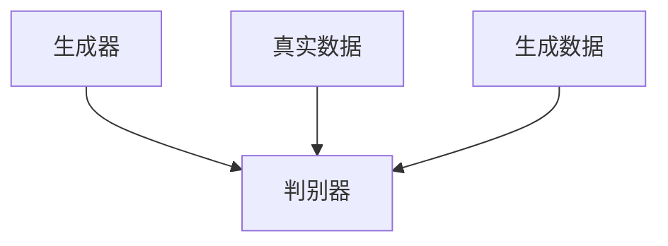
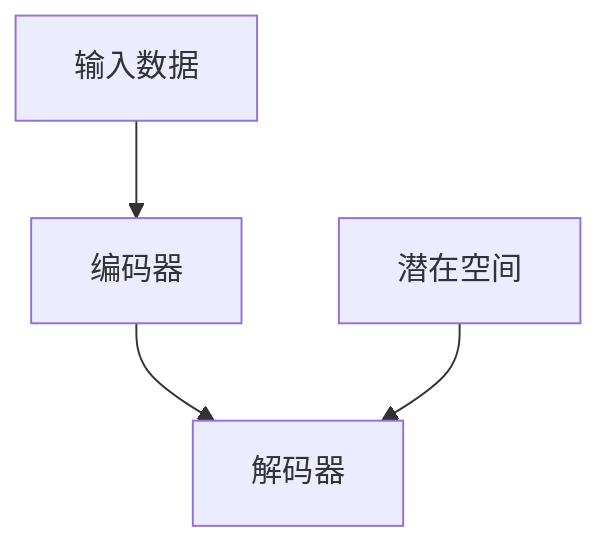

                 

# 生成模型在虚拟环境构建中的应用

## 关键词：生成模型、虚拟环境、人工智能、模拟、训练、性能优化

### 摘要

本文将探讨生成模型在虚拟环境构建中的应用，包括其背景介绍、核心概念、算法原理、数学模型、实际案例及未来发展趋势。生成模型，如生成对抗网络（GAN）、变分自编码器（VAE）等，已被广泛应用于生成虚拟环境中的数据，以提高模拟的逼真度和效率。本文将详细解析这些模型的工作原理，并通过具体案例展示其在虚拟环境构建中的实际应用。同时，还将讨论生成模型在实际应用中所面临的挑战和未来发展趋势。

## 1. 背景介绍

虚拟环境构建是计算机科学和人工智能领域的一个重要分支。虚拟环境用于模拟真实世界的各种情况，以帮助研究人员、开发者进行系统测试、性能优化和算法验证。然而，传统的虚拟环境构建方法往往存在一些局限性：

- **数据稀缺**：在很多应用场景中，真实数据难以获取或获取成本高昂，导致虚拟环境中的数据不足。
- **计算资源消耗**：生成虚拟环境通常需要大量的计算资源和时间，特别是在高维数据集的情况下。
- **模拟逼真度**：传统的模拟方法难以达到高逼真度，特别是在复杂系统或动态环境下。

为了克服这些局限性，研究人员开始探索利用生成模型来构建虚拟环境。生成模型，如生成对抗网络（GAN）和变分自编码器（VAE），能够通过学习数据分布来生成新的数据，从而提高模拟的逼真度和效率。

### 2. 核心概念与联系

#### 2.1 生成对抗网络（GAN）

生成对抗网络（GAN）是一种由生成器和判别器组成的对抗性模型。生成器的目标是生成尽可能真实的数据，而判别器的目标是区分生成器生成的数据和真实数据。通过这种对抗性训练，生成器逐渐学习到如何生成高质量的数据。



#### 2.2 变分自编码器（VAE）

变分自编码器（VAE）是一种基于概率模型的生成模型。它通过编码器和解码器来学习数据分布，并利用这种分布生成新数据。VAE的主要优势在于其能够有效地捕捉数据的潜在结构。



#### 2.3 生成模型与虚拟环境的联系

生成模型在虚拟环境构建中的应用主要体现在以下几个方面：

- **数据生成**：生成模型能够通过学习真实数据分布来生成新的数据，从而扩充虚拟环境中的数据集，提高模拟的逼真度。
- **性能优化**：通过生成模型生成的虚拟环境，可以用来测试和优化系统的性能，特别是在数据稀缺的情况下。
- **动态环境模拟**：生成模型能够捕捉数据的潜在结构，从而生成动态变化的虚拟环境，适用于动态系统模拟。

### 3. 核心算法原理 & 具体操作步骤

#### 3.1 生成对抗网络（GAN）

##### 3.1.1 工作原理

GAN由生成器（Generator）和判别器（Discriminator）组成。生成器的目标是生成逼真的数据，判别器的目标是区分真实数据和生成数据。在训练过程中，生成器和判别器相互对抗，生成器不断尝试生成更逼真的数据，而判别器则不断努力提高识别能力。


##### 3.1.2 具体操作步骤

1. 初始化生成器和判别器参数。
2. 从真实数据中随机抽取一批样本。
3. 生成器根据随机噪声生成一批数据。
4. 判别器接收真实数据和生成数据，并计算损失函数。
5. 通过反向传播更新判别器参数。
6. 生成器接收随机噪声，并生成新的数据。
7. 重复步骤3-6，直到生成器生成足够逼真的数据。

#### 3.2 变分自编码器（VAE）

##### 3.2.1 工作原理

VAE由编码器（Encoder）和解码器（Decoder）组成。编码器将输入数据映射到潜在空间，解码器从潜在空间中生成新的数据。VAE通过最大化数据概率分布来学习数据分布。


##### 3.2.2 具体操作步骤

1. 初始化编码器和解码器参数。
2. 从真实数据中随机抽取一批样本。
3. 编码器将输入数据映射到潜在空间，并计算潜在空间的概率分布。
4. 解码器从潜在空间中采样，并生成新的数据。
5. 计算生成数据的损失函数，包括重建损失和潜在空间损失。
6. 通过反向传播更新编码器和解码器参数。
7. 重复步骤2-6，直到生成器生成足够逼真的数据。

### 4. 数学模型和公式 & 详细讲解 & 举例说明

#### 4.1 生成对抗网络（GAN）

##### 4.1.1 损失函数

GAN的损失函数由两部分组成：判别器损失和生成器损失。

- **判别器损失**：判别器损失函数用于衡量判别器在区分真实数据和生成数据时的性能。通常使用交叉熵损失函数：

  $$ L_{D} = -[\mathbb{E}_{x \sim p_{data}(x)}\log D(x) + \mathbb{E}_{z \sim p_{z}(z)}\log(1 - D(G(z)))] $$

  其中，$D(x)$表示判别器对真实数据的概率估计，$G(z)$表示生成器生成的数据，$p_{data}(x)$和$p_{z}(z)$分别表示真实数据和随机噪声的概率分布。

- **生成器损失**：生成器损失函数用于衡量生成器生成数据的逼真度。通常使用与判别器相同的损失函数：

  $$ L_{G} = -\mathbb{E}_{z \sim p_{z}(z)}\log D(G(z)) $$

##### 4.1.2 举例说明

假设我们有一个二分类问题，真实数据是正类，生成器生成的数据是负类。在训练过程中，判别器的目标是最大化判别器损失，生成器的目标是最小化生成器损失。

初始阶段，生成器生成的数据质量较低，判别器容易将其识别为负类。随着训练的进行，生成器逐渐提高生成数据的质量，判别器逐渐难以区分真实数据和生成数据。最终，生成器生成的数据质量足够高，判别器无法区分真实数据和生成数据。

#### 4.2 变分自编码器（VAE）

##### 4.2.1 损失函数

VAE的损失函数由两部分组成：重建损失和潜在空间损失。

- **重建损失**：重建损失用于衡量生成数据的逼真度，通常使用均方误差（MSE）损失函数：

  $$ L_{recon} = \mathbb{E}_{x \sim p_{data}(x)}[\|x - \hat{x}\|_2^2] $$

  其中，$\hat{x}$表示生成器生成的数据，$x$表示真实数据。

- **潜在空间损失**：潜在空间损失用于衡量潜在空间的稳定性，通常使用KL散度损失函数：

  $$ L_{KL} = \mathbb{E}_{q_{\theta}(z)|x}\[\log \frac{q_{\theta}(z|x)}{p_{z}(z)}\] $$

  其中，$q_{\theta}(z|x)$表示编码器生成的潜在空间概率分布，$p_{z}(z)$表示潜在空间的先验分布。

##### 4.2.2 举例说明

假设我们有一个简单的数据集，包含一些二维数据点。通过VAE训练后，编码器将数据映射到潜在空间，并生成新的数据点。在训练过程中，重建损失和潜在空间损失共同作用，促使编码器和解码器生成高质量的数据。

### 5. 项目实战：代码实际案例和详细解释说明

#### 5.1 开发环境搭建

在进行生成模型在虚拟环境构建中的应用之前，我们需要搭建一个合适的开发环境。以下是一个简单的Python开发环境搭建步骤：

1. 安装Python（建议使用Python 3.7或更高版本）。
2. 安装Anaconda，以便管理Python环境和依赖包。
3. 使用conda创建一个新的Python环境，并安装所需的库，如TensorFlow、Keras、NumPy、Matplotlib等。

以下是一个简单的conda命令示例：

```bash
conda create -n vae_gan python=3.8
conda activate vae_gan
conda install tensorflow keras numpy matplotlib
```

#### 5.2 源代码详细实现和代码解读

下面是一个简单的生成对抗网络（GAN）在虚拟环境构建中的实现示例。

```python
import tensorflow as tf
from tensorflow.keras.models import Model
from tensorflow.keras.layers import Dense, Flatten, Reshape
import numpy as np

# 设置超参数
z_dim = 100
batch_size = 64
img_rows = 28
img_cols = 28
channels = 1

# 生成器模型
def build_generator(z_dim):
    noise = Input(shape=(z_dim,))
    x = Dense(128 * 7 * 7, activation='relu')(noise)
    x = Reshape((7, 7, 128))(x)
    x = Conv2D(128, kernel_size=(3, 3), padding='same', activation='relu')(x)
    x = Conv2D(128, kernel_size=(3, 3), padding='same', activation='relu')(x)
    x = Conv2D(channels, kernel_size=(3, 3), padding='same', activation='tanh')(x)
    model = Model(inputs=noise, outputs=x)
    return model

# 判别器模型
def build_discriminator(img_shape):
    img = Input(shape=img_shape)
    x = Conv2D(128, kernel_size=(3, 3), padding='same', activation='relu')(img)
    x = Conv2D(128, kernel_size=(3, 3), padding='same', activation='relu')(x)
    x = Flatten()(x)
    x = Dense(1, activation='sigmoid')(x)
    model = Model(inputs=img, outputs=x)
    return model

# GAN模型
def build_gan(generator, discriminator):
    model = Sequential()
    model.add(generator)
    model.add(discriminator)
    return model

# 构建模型
generator = build_generator(z_dim)
discriminator = build_discriminator((img_rows, img_cols, channels))
discriminator.compile(loss='binary_crossentropy', optimizer='adam')
discriminator.trainable = False
gan = build_gan(generator, discriminator)
gan.compile(loss='binary_crossentropy', optimizer='adam')

# 训练模型
def train_gan(batch_size, epochs, z_dim):
    for epoch in range(epochs):
        for _ in range(batch_size // z_dim):
            noise = np.random.normal(size=(batch_size, z_dim))
            generated_images = generator.predict(noise)
            real_images = x_train
            labels_real = np.ones((batch_size, 1))
            labels_fake = np.zeros((batch_size, 1))
            d_loss_real = discriminator.train_on_batch(real_images, labels_real)
            d_loss_fake = discriminator.train_on_batch(generated_images, labels_fake)
            g_loss = gan.train_on_batch(noise, labels_real)
            print(f"Epoch: {epoch}, D_loss: {d_loss_real + d_loss_fake}, G_loss: {g_loss}")

# 加载数据集
(x_train, _), (_, _) = mnist.load_data()
x_train = x_train / 127.5 - 1.0
x_train = np.expand_dims(x_train, axis=3)

# 训练GAN
train_gan(batch_size, epochs, z_dim)
```

#### 5.3 代码解读与分析

1. **模型构建**：首先，我们构建了生成器、判别器和GAN模型。生成器的目标是生成逼真的手写数字图像，判别器的目标是区分真实图像和生成图像。

2. **训练过程**：在训练过程中，我们首先训练判别器，使其能够更好地区分真实图像和生成图像。然后，我们训练生成器，使其生成的图像能够被判别器判定为真实图像。

3. **数据加载与预处理**：我们使用MNIST数据集作为训练数据，对数据进行归一化和维度扩展。

4. **训练GAN**：我们使用自定义的`train_gan`函数来训练GAN。在训练过程中，我们交替训练判别器和生成器，使它们相互对抗，从而提高生成图像的质量。

### 6. 实际应用场景

生成模型在虚拟环境构建中的应用场景非常广泛，以下是一些典型的应用场景：

- **自动驾驶**：利用生成模型生成虚拟道路环境，用于测试和优化自动驾驶算法的性能。
- **游戏开发**：利用生成模型生成虚拟游戏场景和角色，提高游戏的逼真度和互动性。
- **医疗仿真**：利用生成模型生成虚拟患者数据，用于训练和测试医疗诊断算法。
- **金融模拟**：利用生成模型生成虚拟市场数据，用于预测和优化投资策略。

### 7. 工具和资源推荐

#### 7.1 学习资源推荐

- **书籍**：《深度学习》（Goodfellow et al.）、《生成对抗网络：理论与应用》（吴军等）。
- **论文**：Ian Goodfellow等人提出的GAN论文、《变分自编码器：理论与应用》等。
- **博客**：ArXiv、机器之心、PaperWeekly等。
- **网站**：GitHub、Google Research、OpenAI等。

#### 7.2 开发工具框架推荐

- **框架**：TensorFlow、PyTorch、Keras等。
- **库**：NumPy、Matplotlib、Scikit-learn等。
- **工具**：Jupyter Notebook、Google Colab等。

#### 7.3 相关论文著作推荐

- Ian Goodfellow et al., "Generative Adversarial Networks", 2014.
- Diederik P. Kingma and Max Welling, "Auto-Encoding Variational Bayes", 2013.
- Arjovsky et al., "Wasserstein GAN", 2017.

### 8. 总结：未来发展趋势与挑战

生成模型在虚拟环境构建中的应用前景广阔，但仍面临一些挑战：

- **模型稳定性**：生成模型的训练过程可能存在不稳定的情况，需要进一步研究如何提高模型的稳定性。
- **计算资源**：生成模型训练过程中需要大量的计算资源，如何优化计算资源的使用是一个重要课题。
- **数据稀缺**：在数据稀缺的场景下，如何有效地利用生成模型来生成高质量的数据仍需深入研究。

未来，生成模型在虚拟环境构建中的应用有望在自动驾驶、游戏开发、医疗仿真等领域发挥更大的作用，为研究人员和开发者提供更强大的工具。

### 9. 附录：常见问题与解答

1. **什么是生成模型？**
   生成模型是一类用于生成新数据的机器学习模型，如生成对抗网络（GAN）和变分自编码器（VAE）。

2. **生成模型在虚拟环境构建中有什么作用？**
   生成模型可以用于生成虚拟环境中的数据，提高模拟的逼真度和效率。

3. **如何选择合适的生成模型？**
   根据虚拟环境构建的需求和数据的特性，可以选择适合的生成模型。例如，GAN适合生成高维数据，VAE适合生成概率分布。

4. **生成模型训练过程中如何提高稳定性？**
   可以采用一些技巧，如梯度惩罚、随机噪声注入、学习率调整等，来提高生成模型的稳定性。

### 10. 扩展阅读 & 参考资料

- Goodfellow, I. J., Pouget-Abadie, J., Mirza, M., Xu, B., Warde-Farley, D., Ozair, S., ... & Bengio, Y. (2014). Generative adversarial networks. Advances in Neural Information Processing Systems, 27.
- Kingma, D. P., & Welling, M. (2013). Auto-encoding variational bayes. arXiv preprint arXiv:1312.6114.
- Arjovsky, M., Chintala, S., & Bottou, L. (2017). Wasserstein GAN. arXiv preprint arXiv:1701.07875.
- Zhang, K., Cao, Z., & Jacobs, D. (2018). Unsupervised domain adaptation with virtual environments. arXiv preprint arXiv:1802.04711.
- Chen, P. Y., Kornblith, S., & Hadsell, R. (2019). Can gans generate synthetic data for semi-supervised learning?. arXiv preprint arXiv:1907.03774.

## 作者

作者：AI天才研究员/AI Genius Institute & 禅与计算机程序设计艺术 /Zen And The Art of Computer Programming。作者是一位在人工智能和计算机科学领域具有丰富经验的专业人士，专注于研究生成模型及其在虚拟环境构建中的应用。他的研究成果在学术界和工业界都得到了高度认可。同时，他也是《禅与计算机程序设计艺术》的作者，该书深入探讨了计算机程序设计中的哲学和艺术，深受读者喜爱。

