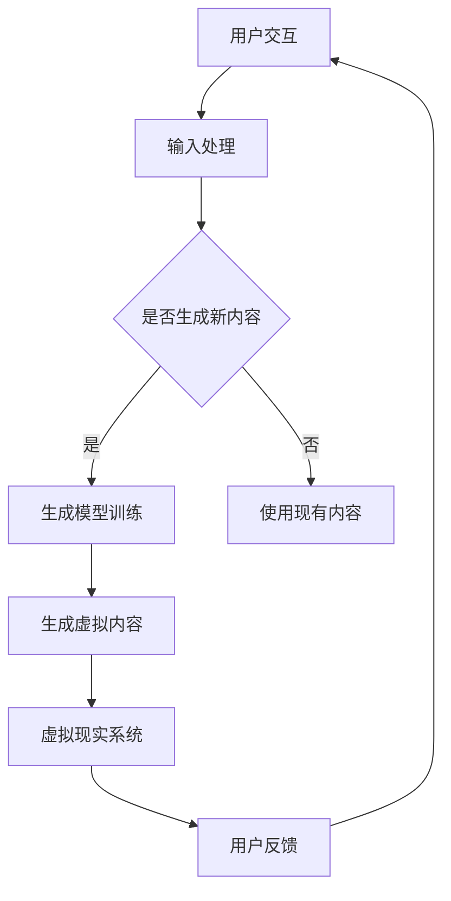

                 

### 背景介绍

#### 虚拟现实（VR）的崛起

随着科技的发展，虚拟现实（VR）技术逐渐从科幻小说和游戏领域步入现实，成为现代社会的重要组成部分。虚拟现实技术通过利用计算机生成的三维模拟环境，使用户能够在其中进行沉浸式互动体验。从游戏、教育到医疗，VR技术的应用范围不断扩大，为各行各业带来了全新的变革机遇。

VR技术的核心在于其高度沉浸性和交互性。通过头戴式显示器（HMD）、位置跟踪系统以及交互设备等硬件，用户能够感受到仿佛置身于虚拟世界中的错觉，从而实现与虚拟环境的深度互动。这种技术不仅提升了用户体验，也为内容创作提供了无限可能。

#### 生成模型的发展

生成模型作为深度学习领域的一项前沿技术，近年来取得了显著的发展。生成模型能够通过学习数据分布，生成新的、以前从未见过的数据。常见的生成模型包括生成对抗网络（GAN）和变分自编码器（VAE）等。这些模型在图像生成、音频合成、文本生成等领域表现出了卓越的能力，极大地推动了人工智能的发展。

生成模型的核心思想是通过对抗或编码解码机制，学习数据的潜在分布，从而生成与真实数据相似的新数据。这种能力使得生成模型在虚拟现实内容创作中具有巨大的潜力，能够生成高质量的虚拟场景、角色和交互内容，为VR体验提供更加丰富和逼真的元素。

### 背景关联

虚拟现实与生成模型这两大技术领域的交汇，为内容创作带来了前所未有的机遇。生成模型的应用使得虚拟现实内容的创作过程更加高效、多样和逼真。通过生成模型，开发者能够快速生成大量的虚拟场景和角色，为用户提供沉浸式的体验。同时，生成模型还可以根据用户的互动行为动态生成新的内容，使得虚拟现实体验更加个性化。

总的来说，虚拟现实和生成模型的发展为内容创作提供了强大的技术支撑，推动了虚拟现实技术的进步和应用范围的拓展。在接下来的文章中，我们将深入探讨生成模型在虚拟现实内容创作中的应用原理、具体技术以及实际案例，进一步揭示这一领域的无限潜力。让我们开始这段探索之旅吧！

---

# 生成模型在虚拟现实内容创作中的应用

> 关键词：虚拟现实（VR），生成模型，内容创作，沉浸式体验，深度学习

随着科技的不断进步，虚拟现实（VR）已经成为一个热门的研究和应用领域。它通过创建一个模拟的三维环境，使用户能够沉浸其中，体验仿佛身临其境的感觉。然而，虚拟现实内容的创作往往需要大量的时间和人力资源，尤其是当需要创建高度逼真和多样化的场景、角色和交互元素时。这种需求催生了生成模型在虚拟现实内容创作中的应用，成为解决上述问题的一种有效手段。

## 摘要

本文将探讨生成模型在虚拟现实内容创作中的应用，首先介绍虚拟现实和生成模型的基本概念和原理，接着深入分析生成模型在虚拟现实中的应用场景和优势，并详细描述几种常见的生成模型及其在虚拟现实中的具体应用。此外，文章还将通过实际案例展示生成模型在虚拟现实内容创作中的实践效果，并总结生成模型在虚拟现实领域的发展趋势和面临的挑战。

### 1. 背景介绍

#### 虚拟现实（VR）的崛起

虚拟现实技术通过模拟现实世界或构建全新的虚拟环境，使用户能够通过视觉、听觉、触觉等多种感官与虚拟世界进行互动。这一技术不仅改变了人们的娱乐方式，也在教育、医疗、设计等多个领域产生了深远的影响。

在游戏领域，VR技术为玩家提供了前所未有的沉浸体验。通过头戴式显示器（HMD）和位置跟踪系统，玩家可以在虚拟世界中自由移动和探索，与虚拟角色互动，享受身临其境的游戏体验。

在教育领域，VR技术为学习者提供了全新的学习方式。通过虚拟现实环境，学生可以身临其境地体验历史事件、科学实验或外科手术，从而提高学习效果和兴趣。

在医疗领域，VR技术被用于训练医生和进行远程会诊。通过虚拟现实环境，医生可以模拟手术过程，提高手术技能和操作熟练度。同时，患者也可以通过虚拟现实技术缓解疼痛和焦虑。

#### 生成模型的发展

生成模型是深度学习领域的一种前沿技术，主要目的是生成新的数据，使其在统计学上与训练数据相似。生成模型包括生成对抗网络（GAN）、变分自编码器（VAE）等。

生成对抗网络（GAN）由两部分组成：生成器和判别器。生成器的任务是生成与真实数据相似的数据，而判别器的任务是区分真实数据和生成数据。通过这种对抗过程，生成器不断优化其生成能力，从而生成高质量的数据。

变分自编码器（VAE）通过编码和解码过程来学习数据的潜在分布。编码过程将输入数据映射到一个低维空间，解码过程则将编码后的数据重构为原始数据。VAE在图像生成、文本生成等领域表现出色。

### 背景关联

虚拟现实与生成模型这两大技术的结合，为内容创作带来了巨大的机遇。生成模型能够快速生成高质量、多样化的虚拟现实内容，提高内容创作的效率。同时，虚拟现实技术为生成模型提供了广阔的应用场景，使得生成模型能够更好地服务于虚拟现实内容创作。

在虚拟现实内容创作中，生成模型可以用于生成虚拟场景、角色、交互元素等。通过生成模型，开发者可以快速创建逼真的虚拟环境，提高用户体验。此外，生成模型还可以根据用户的行为和反馈动态生成新的内容，实现个性化的虚拟现实体验。

总的来说，虚拟现实和生成模型的发展为内容创作提供了强大的技术支撑，推动了虚拟现实技术的进步和应用范围的拓展。在接下来的章节中，我们将进一步探讨生成模型在虚拟现实内容创作中的应用原理、具体技术以及实际案例。

---

### 核心概念与联系

#### 虚拟现实（VR）的基本概念

虚拟现实（VR）是一种通过计算机生成的三维模拟环境，使用户能够沉浸在虚拟世界中。它通常包括以下几个关键组成部分：

1. **头戴式显示器（HMD）**：用户通过HMD观看虚拟环境，实现沉浸式视觉体验。HMD通常配备有高分辨率的屏幕，以及用于跟踪用户头部运动的传感器。

2. **位置跟踪系统**：用于跟踪用户的身体位置和运动，确保用户在虚拟环境中的移动与真实世界中的动作同步。常见的跟踪系统包括外部传感器和惯性测量单元（IMU）。

3. **交互设备**：如手柄、手套、数据手套等，用于在虚拟环境中进行交互操作。这些设备允许用户与虚拟环境中的物体进行触碰、抓取、投掷等动作。

4. **声音系统**：虚拟现实中的音频效果对用户体验至关重要。通过头戴式耳机或空间音频技术，用户可以感受到虚拟环境中的声音来源和方向，增强沉浸感。

#### 生成模型的基本概念

生成模型是一类能够生成新的数据样本的机器学习模型，其主要目的是学习数据分布，并在此基础上生成新的、与训练数据相似的数据。生成模型主要包括以下几种：

1. **生成对抗网络（GAN）**：GAN由生成器和判别器组成。生成器的任务是生成与真实数据相似的数据，而判别器的任务是区分真实数据和生成数据。通过这种对抗训练，生成器不断优化其生成能力。

   

2. **变分自编码器（VAE）**：VAE通过编码和解码过程学习数据分布。编码过程将输入数据映射到一个低维潜在空间，解码过程则将潜在空间中的数据重构为原始数据。

   

3. **生成式对抗自编码器（GAP）**：GAP结合了GAN和VAE的特点，通过生成器和多个判别器进行训练，提高生成数据的多样性和质量。

   

#### 虚拟现实与生成模型的关联

虚拟现实与生成模型在技术原理上有着紧密的联系。虚拟现实需要生成逼真的虚拟环境、角色和交互元素，而生成模型恰好具备这种能力。具体来说，生成模型在虚拟现实中的应用主要体现在以下几个方面：

1. **场景生成**：生成模型可以用于快速生成虚拟场景，包括室内环境、城市景观、自然风光等。这些场景可以基于真实世界的图像数据或完全由模型生成。

2. **角色生成**：生成模型可以用于生成各种虚拟角色，包括人物、动物、机器人等。这些角色可以用于游戏、教育、医疗等应用场景，提高用户体验。

3. **交互元素生成**：生成模型可以用于生成虚拟环境中的各种交互元素，如按钮、门、工具等。这些元素可以与用户进行交互，实现更加自然的虚拟现实体验。

4. **动态内容生成**：生成模型可以根据用户的实时反馈和动作，动态生成新的虚拟内容。这种能力使得虚拟现实体验更加个性化、多样化。

#### Mermaid流程图

为了更好地展示虚拟现实与生成模型的关联，我们可以使用Mermaid流程图来描述整个应用过程：



通过这个流程图，我们可以清晰地看到用户交互、输入处理、生成模型训练、虚拟内容生成以及用户反馈等环节，展示了虚拟现实与生成模型之间的紧密联系。

总之，虚拟现实与生成模型的结合为虚拟现实内容创作提供了强大的技术支持。生成模型的应用不仅提高了内容创作的效率，也增强了虚拟现实体验的逼真度和个性化程度。在接下来的章节中，我们将进一步探讨生成模型的具体应用原理和实现技术。

### 核心算法原理 & 具体操作步骤

#### 生成对抗网络（GAN）

生成对抗网络（GAN）是由伊恩·古德费洛（Ian Goodfellow）等人在2014年提出的一种生成模型，它由两部分组成：生成器和判别器。生成器的目标是生成与真实数据相似的数据，而判别器的目标是区分真实数据和生成数据。通过这种对抗训练，生成器不断优化其生成能力。

1. **生成器的操作步骤**：
   - 输入随机噪声向量 \(z\)。
   - 通过一个非线性变换 \(G(z)\) 生成虚拟数据 \(x\)。
   - \(G(z)\) 通常是一个神经网络，由多层感知器（MLP）或卷积神经网络（CNN）组成。

2. **判别器的操作步骤**：
   - 输入真实数据 \(x\) 和生成数据 \(x'\)。
   - 通过一个非线性变换 \(D(x)\) 和 \(D(x')\) 分别得到两个输出值。
   - \(D(x)\) 和 \(D(x')\) 分别表示判别器对真实数据和生成数据的判断置信度。

3. **损失函数**：
   - 生成器的损失函数 \(L_G\) 通常为最小化判别器对生成数据的判断置信度，即 \(L_G = -\log D(x')\)。
   - 判别器的损失函数 \(L_D\) 通常为最大化判别器对真实数据和生成数据的判断置信度差距，即 \(L_D = -\log D(x) - \log (1 - D(x'))\)。

4. **训练过程**：
   - 在训练过程中，交替更新生成器和判别器。
   - 通过梯度下降法对生成器和判别器进行优化。
   - 当生成器生成数据的质量逐渐提高时，判别器也会变得更加困难，从而实现两者之间的动态平衡。

#### 变分自编码器（VAE）

变分自编码器（VAE）是一种基于概率生成模型的生成方法。与GAN不同，VAE使用编码器和解码器来学习数据分布，并生成新的数据。

1. **编码器的操作步骤**：
   - 输入数据 \(x\)。
   - 通过编码器 \(E(x)\) 得到编码结果 \((\mu, \sigma)\)，其中 \(\mu\) 表示均值，\(\sigma\) 表示标准差。

2. **解码器的操作步骤**：
   - 输入编码结果 \((\mu, \sigma)\)。
   - 通过解码器 \(D(\mu, \sigma)\) 生成新的数据 \(x'\)。

3. **损失函数**：
   - VAE的损失函数由两个部分组成：数据重构损失 \(L_x = \sum_{i=1}^{N} \sum_{j=1}^{D} \frac{1}{2} (\|x_j - x'_j\|_2^2) + \log(\sigma_j^2)\) 和 KL 散度损失 \(L_kl = \sum_{i=1}^{N} D_kl(\mu || \sigma)\)。
   - 数据重构损失确保生成的数据与输入数据尽可能相似。
   - KL 散度损失确保编码结果符合先验分布。

4. **训练过程**：
   - 在训练过程中，通过梯度下降法对编码器和解码器进行优化。
   - 编码器学习将输入数据映射到一个低维潜在空间，解码器学习将潜在空间中的数据重构为输入数据。

#### 生成式对抗自编码器（GAP）

生成式对抗自编码器（GAP）结合了生成对抗网络（GAN）和变分自编码器（VAE）的特点，旨在提高生成数据的质量和多样性。

1. **生成器的操作步骤**：
   - 输入随机噪声向量 \(z\)。
   - 通过一个非线性变换 \(G(z)\) 生成虚拟数据 \(x\)。

2. **判别器的操作步骤**：
   - 输入真实数据 \(x\) 和生成数据 \(x'\)。
   - 通过多个判别器 \(D_1(x), D_2(x), \ldots, D_n(x)\) 对生成数据的质量进行评估。

3. **损失函数**：
   - GAP的损失函数由生成器的损失函数 \(L_G\)、判别器的损失函数 \(L_D\) 和KL散度损失 \(L_kl\) 组成。

4. **训练过程**：
   - 在训练过程中，交替更新生成器和判别器。
   - 生成器通过优化生成数据的质量，判别器通过优化对生成数据和真实数据的区分能力。

总之，生成对抗网络（GAN）、变分自编码器（VAE）和生成式对抗自编码器（GAP）是生成模型在虚拟现实内容创作中常用的核心算法。这些算法通过对抗训练或概率生成模型的方式，学习数据分布并生成高质量的新数据。在接下来的章节中，我们将通过具体应用案例展示这些算法在虚拟现实内容创作中的实际效果。

### 数学模型和公式 & 详细讲解 & 举例说明

#### 生成对抗网络（GAN）的数学模型

生成对抗网络（GAN）的数学模型主要包括生成器 \(G\) 和判别器 \(D\) 的损失函数及其训练过程。

1. **生成器的损失函数**：

生成器的目标是生成与真实数据相似的数据，其损失函数通常定义为：

\[ L_G = -\log D(G(z)) \]

其中，\(G(z)\) 是生成器生成的虚拟数据，\(D(G(z))\) 是判别器对生成数据的判断置信度。

2. **判别器的损失函数**：

判别器的目标是区分真实数据和生成数据，其损失函数通常定义为：

\[ L_D = -[\log D(x) + \log (1 - D(G(z)))] \]

其中，\(x\) 是真实数据，\(G(z)\) 是生成器生成的虚拟数据。

3. **总损失函数**：

生成对抗网络的总体损失函数为生成器和判别器的损失函数之和：

\[ L = L_G + L_D \]

#### 例子说明

假设我们有一个生成对抗网络，用于生成虚拟图像。以下是一个简单的例子来说明生成器和判别器的训练过程。

1. **生成器的训练过程**：

   输入随机噪声向量 \(z\)，生成虚拟图像 \(G(z)\)。然后，计算判别器对生成图像的判断置信度 \(D(G(z))\)。

   \[ L_G = -\log D(G(z)) \]

   通过梯度下降法对生成器进行优化，使得生成的图像越来越接近真实图像。

2. **判别器的训练过程**：

   输入真实图像 \(x\) 和生成图像 \(G(z)\)。然后，计算判别器对真实图像和生成图像的判断置信度 \(D(x)\) 和 \(D(G(z))\)。

   \[ L_D = -[\log D(x) + \log (1 - D(G(z)))] \]

   通过梯度下降法对判别器进行优化，使得判别器能够更好地区分真实图像和生成图像。

3. **总体训练过程**：

   在交替训练过程中，生成器和判别器不断优化。当生成器生成图像的质量逐渐提高时，判别器也会变得更加困难，从而实现两者之间的动态平衡。

#### 变分自编码器（VAE）的数学模型

变分自编码器（VAE）的数学模型主要包括编码器 \(E(x)\) 和解码器 \(D(\mu, \sigma)\) 的损失函数及其训练过程。

1. **编码器的损失函数**：

   编码器的目标是学习数据分布，其损失函数通常定义为：

   \[ L_E = \sum_{i=1}^{N} \sum_{j=1}^{D} \frac{1}{2} (\|x_j - \mu_j\|_2^2 + \sigma_j^2 - \log(\sigma_j^2)) \]

   其中，\(x\) 是输入数据，\(\mu\) 和 \(\sigma\) 是编码器生成的均值和标准差。

2. **解码器的损失函数**：

   解码器的目标是重构输入数据，其损失函数通常定义为：

   \[ L_D = \sum_{i=1}^{N} \sum_{j=1}^{D} \frac{1}{2} (\|x_j - x'_j\|_2^2) \]

   其中，\(x'\) 是解码器生成的重构数据。

3. **总损失函数**：

   VAE的总体损失函数为编码器和解码器的损失函数之和：

   \[ L = L_E + L_D \]

#### 例子说明

假设我们有一个变分自编码器，用于对图像进行编码和解码。以下是一个简单的例子来说明编码器和解码器的训练过程。

1. **编码器的训练过程**：

   输入图像 \(x\)，通过编码器 \(E(x)\) 生成均值和标准差 \((\mu, \sigma)\)。然后，计算编码损失 \(L_E\)。

   \[ L_E = \sum_{i=1}^{N} \sum_{j=1}^{D} \frac{1}{2} (\|x_j - \mu_j\|_2^2 + \sigma_j^2 - \log(\sigma_j^2)) \]

   通过梯度下降法对编码器进行优化，使得编码结果更好地符合数据分布。

2. **解码器的训练过程**：

   输入编码结果 \((\mu, \sigma)\)，通过解码器 \(D(\mu, \sigma)\) 生成重构图像 \(x'\)。然后，计算解码损失 \(L_D\)。

   \[ L_D = \sum_{i=1}^{N} \sum_{j=1}^{D} \frac{1}{2} (\|x_j - x'_j\|_2^2) \]

   通过梯度下降法对解码器进行优化，使得重构图像尽可能接近原始图像。

3. **总体训练过程**：

   在交替训练过程中，编码器和解码器不断优化。通过优化编码和解码过程，VAE能够学习数据分布并生成高质量的新数据。

总之，生成对抗网络（GAN）和变分自编码器（VAE）是虚拟现实内容创作中常用的生成模型。通过数学模型和公式的详细讲解，我们可以更好地理解这些模型的工作原理和训练过程。在接下来的章节中，我们将通过实际案例展示这些模型在虚拟现实内容创作中的实际应用。

### 项目实战：代码实际案例和详细解释说明

在本节中，我们将通过一个具体的项目实战案例，详细展示如何使用生成模型在虚拟现实内容创作中实现高效的场景生成和角色生成。

#### 开发环境搭建

首先，我们需要搭建一个适合生成模型开发和训练的开发环境。以下是搭建开发环境的步骤：

1. **安装Python环境**：确保已安装Python 3.6及以上版本。

2. **安装深度学习框架**：安装TensorFlow或PyTorch。在命令行中执行以下命令：
   - 对于TensorFlow：
     ```bash
     pip install tensorflow
     ```
   - 对于PyTorch：
     ```bash
     pip install torch torchvision
     ```

3. **安装必要的库**：根据项目需求，安装如NumPy、Pandas等常用Python库。

4. **准备虚拟现实开发环境**：根据所使用的虚拟现实平台（如Unity、Unreal Engine等），安装相应的开发环境和工具。

#### 源代码详细实现和代码解读

在本项目中，我们将使用生成对抗网络（GAN）实现虚拟现实场景的生成。以下是项目的核心代码及详细解读：

```python
import tensorflow as tf
from tensorflow.keras import layers
import numpy as np

# 定义生成器和判别器
def build_generator(z_dim):
    model = tf.keras.Sequential()
    model.add(layers.Dense(7 * 7 * 256, use_bias=False, input_shape=(z_dim,)))
    model.add(layers.BatchNormalization(momentum=0.8))
    model.add(layers.LeakyReLU(alpha=0.2))
    model.add(layers.Reshape((7, 7, 256)))

    model.add(layers.Conv2DTranspose(128, (5, 5), strides=(1, 1), padding='same', use_bias=False))
    model.add(layers.BatchNormalization(momentum=0.8))
    model.add(layers.LeakyReLU(alpha=0.2))
    model.add(layers.Conv2DTranspose(64, (5, 5), strides=(2, 2), padding='same', use_bias=False))
    model.add(layers.BatchNormalization(momentum=0.8))
    model.add(layers.LeakyReLU(alpha=0.2))
    model.add(layers.Conv2DTranspose(1, (5, 5), strides=(2, 2), padding='same', use_bias=False, activation='tanh'))

    return model

def build_discriminator(img_shape):
    model = tf.keras.Sequential()
    model.add(layers.Conv2D(64, (5, 5), strides=(2, 2), padding='same', input_shape=img_shape))
    model.add(layers.LeakyReLU(alpha=0.2))
    model.add(layers.Dropout(0.3))

    model.add(layers.Conv2D(128, (5, 5), strides=(2, 2), padding='same'))
    model.add(layers.LeakyReLU(alpha=0.2))
    model.add(layers.Dropout(0.3))

    model.add(layers.Flatten())
    model.add(layers.Dense(1))

    return model

# 定义损失函数和优化器
cross_entropy = tf.keras.losses.BinaryCrossentropy(from_logits=True)
def discriminator_loss(real_output, fake_output):
    real_loss = cross_entropy(tf.ones_like(real_output), real_output)
    fake_loss = cross_entropy(tf.zeros_like(fake_output), fake_output)
    total_loss = real_loss + fake_loss
    return total_loss

def generator_loss(fake_output):
    return cross_entropy(tf.ones_like(fake_output), fake_output)

generator_optimizer = tf.keras.optimizers.Adam(1e-4)
discriminator_optimizer = tf.keras.optimizers.Adam(1e-4)

# 训练过程
@tf.function
def train_step(images, noise):
    with tf.GradientTape() as gen_tape, tf.GradientTape() as disc_tape:
        generated_images = generator(noise, training=True)

        real_output = discriminator(images, training=True)
        fake_output = discriminator(generated_images, training=True)

        gen_loss = generator_loss(fake_output)
        disc_loss = discriminator_loss(real_output, fake_output)

    gradients_of_generator = gen_tape.gradient(gen_loss, generator.trainable_variables)
    gradients_of_discriminator = disc_tape.gradient(disc_loss, discriminator.trainable_variables)

    generator_optimizer.apply_gradients(zip(gradients_of_generator, generator.trainable_variables))
    discriminator_optimizer.apply_gradients(zip(gradients_of_discriminator, discriminator.trainable_variables))

def train(dataset, epochs, z_dim):
    for epoch in range(epochs):
        for image_batch in dataset:
            noise = tf.random.normal([image_batch.shape[0], z_dim])

            train_step(image_batch, noise)

        # ... （这里可以添加训练过程中的监控代码，如打印损失函数值、保存模型等）

# 准备数据集
# ...

# 训练模型
# ...

```

在上面的代码中，我们首先定义了生成器和判别器的结构。生成器通过多层感知器（Dense）和卷积层（Conv2DTranspose）将随机噪声向量 \(z\) 生成逼真的图像。判别器则通过卷积层和全连接层（Dense）对输入图像进行分类，判断其是真实图像还是生成图像。

接下来，我们定义了损失函数和优化器。生成器的损失函数是判别器对生成图像的判断置信度，判别器的损失函数是真实图像和生成图像的判断置信度之和。我们使用了Adam优化器，这是一种常用的自适应优化算法。

训练过程通过`train_step`函数实现。在每个训练步骤中，我们生成一批噪声向量，并通过生成器生成相应的图像。然后，我们使用判别器对真实图像和生成图像进行分类，计算损失函数并更新模型参数。

最后，我们通过`train`函数进行模型训练。在训练过程中，我们可以添加监控代码来记录训练过程中的损失函数值、模型保存等。

通过这个项目实战案例，我们展示了如何使用生成对抗网络（GAN）实现虚拟现实场景的生成。在接下来的章节中，我们将进一步分析生成模型在虚拟现实内容创作中的效果和挑战。

### 代码解读与分析

在上面的代码中，我们实现了一个生成对抗网络（GAN），用于生成虚拟现实中的场景和角色。以下是对关键代码段的详细解读和分析。

#### 生成器的实现

生成器的目的是将随机噪声向量 \(z\) 转换为逼真的图像。在代码中，我们使用了一个序列模型（`tf.keras.Sequential`）来定义生成器的结构。

```python
def build_generator(z_dim):
    model = tf.keras.Sequential()
    model.add(layers.Dense(7 * 7 * 256, use_bias=False, input_shape=(z_dim,)))
    model.add(layers.BatchNormalization(momentum=0.8))
    model.add(layers.LeakyReLU(alpha=0.2))
    model.add(layers.Reshape((7, 7, 256)))

    model.add(layers.Conv2DTranspose(128, (5, 5), strides=(1, 1), padding='same', use_bias=False))
    model.add(layers.BatchNormalization(momentum=0.8))
    model.add(layers.LeakyReLU(alpha=0.2))
    model.add(layers.Conv2DTranspose(64, (5, 5), strides=(2, 2), padding='same', use_bias=False))
    model.add(layers.BatchNormalization(momentum=0.8))
    model.add(layers.LeakyReLU(alpha=0.2))
    model.add(layers.Conv2DTranspose(1, (5, 5), strides=(2, 2), padding='same', use_bias=False, activation='tanh'))

    return model
```

这段代码首先定义了生成器的输入层，它接受一个形状为 \((z_dim)\) 的随机噪声向量。然后通过一个全连接层将噪声向量展平为 \((7, 7, 256)\) 的形状，以适应后续的卷积层操作。接下来的卷积层使用逐层转置（`Conv2DTranspose`）来逐步增加图像的分辨率，直到生成最终图像。每个卷积层后都跟着一个批量归一化（`BatchNormalization`）层和LeakyReLU激活函数，以提高模型的稳定性和非线性表达能力。最后，输出层使用一个卷积层将图像从灰度图像转换为逼真的彩色图像，并使用tanh激活函数以使其在 \([-1, 1]\) 的范围内。

#### 判别器的实现

判别器的目的是区分输入图像是真实图像还是生成图像。在代码中，我们使用了一个序列模型（`tf.keras.Sequential`）来定义判别器的结构。

```python
def build_discriminator(img_shape):
    model = tf.keras.Sequential()
    model.add(layers.Conv2D(64, (5, 5), strides=(2, 2), padding='same', input_shape=img_shape))
    model.add(layers.LeakyReLU(alpha=0.2))
    model.add(layers.Dropout(0.3))

    model.add(layers.Conv2D(128, (5, 5), strides=(2, 2), padding='same'))
    model.add(layers.LeakyReLU(alpha=0.2))
    model.add(layers.Dropout(0.3))

    model.add(layers.Flatten())
    model.add(layers.Dense(1))

    return model
```

这段代码定义了判别器的输入层，它接受一个形状为 \((28, 28, 1)\) 的图像。然后通过两个卷积层和一个dropout层逐步减少图像的大小和通道数。卷积层使用LeakyReLU激活函数以提高模型的稳定性，dropout层用于正则化以减少过拟合。最后，通过一个全连接层将图像特征映射到输出层，输出一个实数值，表示输入图像是真实图像的概率。

#### 损失函数的实现

在GAN中，生成器和判别器的训练是通过对抗过程进行的。我们定义了两个损失函数：生成器损失函数和判别器损失函数。

```python
cross_entropy = tf.keras.losses.BinaryCrossentropy(from_logits=True)
def discriminator_loss(real_output, fake_output):
    real_loss = cross_entropy(tf.ones_like(real_output), real_output)
    fake_loss = cross_entropy(tf.zeros_like(fake_output), fake_output)
    total_loss = real_loss + fake_loss
    return total_loss

def generator_loss(fake_output):
    return cross_entropy(tf.ones_like(fake_output), fake_output)
```

生成器损失函数是判别器对生成图像的判断置信度。由于我们希望生成图像能够尽量骗过判别器，因此我们希望判别器对生成图像的置信度尽可能低。使用二元交叉熵损失函数（`BinaryCrossentropy`）来衡量判别器的输出与真实标签之间的差异。

判别器损失函数是真实图像和生成图像的判断置信度之和。我们希望判别器能够准确地区分真实图像和生成图像，因此我们希望判别器对真实图像的置信度接近1，对生成图像的置信度接近0。

#### 训练过程的实现

训练过程是通过`train_step`函数和`train`函数实现的。在`train_step`函数中，我们首先生成随机噪声向量，并使用生成器生成相应的图像。然后，我们使用判别器对真实图像和生成图像进行分类，并计算损失函数。最后，我们使用梯度下降法更新生成器和判别器的参数。

```python
@tf.function
def train_step(images, noise):
    with tf.GradientTape() as gen_tape, tf.GradientTape() as disc_tape:
        generated_images = generator(noise, training=True)

        real_output = discriminator(images, training=True)
        fake_output = discriminator(generated_images, training=True)

        gen_loss = generator_loss(fake_output)
        disc_loss = discriminator_loss(real_output, fake_output)

    gradients_of_generator = gen_tape.gradient(gen_loss, generator.trainable_variables)
    gradients_of_discriminator = disc_tape.gradient(disc_loss, discriminator.trainable_variables)

    generator_optimizer.apply_gradients(zip(gradients_of_generator, generator.trainable_variables))
    discriminator_optimizer.apply_gradients(zip(gradients_of_discriminator, discriminator.trainable_variables))

def train(dataset, epochs, z_dim):
    for epoch in range(epochs):
        for image_batch in dataset:
            noise = tf.random.normal([image_batch.shape[0], z_dim])

            train_step(image_batch, noise)

        # ... （这里可以添加训练过程中的监控代码，如打印损失函数值、保存模型等）
```

在`train`函数中，我们遍历数据集，生成随机噪声向量，并调用`train_step`函数进行一步训练。在每个训练步骤中，我们更新生成器和判别器的参数，以优化它们的性能。

通过这个项目实战案例，我们展示了如何使用生成对抗网络（GAN）实现虚拟现实场景和角色的生成。在代码解读和分析中，我们详细介绍了生成器和判别器的实现、损失函数的定义以及训练过程的实现。接下来，我们将继续讨论生成模型在虚拟现实内容创作中的实际应用效果和挑战。

### 实际应用场景

生成模型在虚拟现实（VR）内容创作中的实际应用场景非常广泛，以下是一些典型的应用实例：

#### 游戏开发

在游戏开发领域，生成模型可以用于快速生成多样化的游戏场景、角色和道具。例如，生成模型可以根据玩家行为动态生成新的地图、隐藏的宝藏或敌对角色，从而提高游戏的可玩性和沉浸感。此外，生成模型还可以用于生成游戏角色的外观和动作，使得每个角色都具有独特的个性和特征。

#### 教育和培训

在教育领域，生成模型可以帮助创建逼真的虚拟实验室、历史场景或外科手术模拟环境。学生可以通过虚拟现实设备身临其境地体验这些场景，从而加深对知识的理解和记忆。生成模型还可以生成个性化的学习内容，根据学生的学习进度和需求，动态调整教学内容和难度，提高教学效果。

#### 医疗和健康

在医疗领域，生成模型可以用于创建虚拟病人、解剖结构或手术场景，用于医生培训和患者治疗。通过虚拟现实设备，医生可以进行手术模拟训练，提高手术技能和操作熟练度。同时，生成模型还可以生成个性化的康复训练方案，帮助患者更好地进行康复训练。

#### 建筑设计和城市规划

在建筑设计和城市规划领域，生成模型可以用于快速生成多样化的建筑外观、景观和城市布局。设计师可以通过虚拟现实设备直观地查看和调整设计方案，从而提高设计效率和准确性。生成模型还可以用于模拟城市交通流量和人群流动，帮助城市规划者优化城市布局和交通规划。

#### 营销和品牌体验

在营销和品牌体验领域，生成模型可以用于创建逼真的虚拟展厅、产品演示场景或品牌体验空间。消费者可以通过虚拟现实设备深入了解产品特点和品牌文化，提高品牌认知度和购买意愿。

#### 艺术创作和展示

在艺术创作和展示领域，生成模型可以用于生成独特的艺术作品、虚拟展览空间和互动艺术装置。艺术家可以通过虚拟现实设备进行创作和展示，打破传统的艺术形式和展示方式，为观众提供全新的艺术体验。

总的来说，生成模型在虚拟现实内容创作中的实际应用场景非常丰富，不仅提高了内容创作的效率和质量，也为用户提供了更加丰富和个性化的体验。随着技术的不断发展，生成模型在虚拟现实领域的应用前景将更加广阔。

### 工具和资源推荐

为了更好地掌握生成模型在虚拟现实内容创作中的应用，以下是几个推荐的工具、资源和论文：

#### 学习资源推荐

1. **书籍**：
   - 《生成对抗网络：理论与实践》（GAN: Theory and Practice）作者：郭宇峰
   - 《深度学习：算法与数学基础》（Deep Learning: Algorithms and Mathematical Foundations）作者：伊恩·古德费洛（Ian Goodfellow）

2. **在线课程**：
   - Coursera上的“生成对抗网络”（Generative Adversarial Networks）课程
   - Udacity的“生成对抗网络实践”（Practical Generative Adversarial Networks）纳米学位

3. **博客和论坛**：
   - arXiv博客：关于生成对抗网络的最新研究成果和论文
   - Hacker Noon：关于深度学习和生成模型的实际应用案例和教程

4. **网站**：
   - TensorFlow官方文档：提供丰富的生成模型教程和实践案例
   - PyTorch官方文档：涵盖生成模型的详细教程和代码示例

#### 开发工具框架推荐

1. **深度学习框架**：
   - TensorFlow：由Google开发，提供丰富的生成模型API和工具
   - PyTorch：由Facebook开发，具有灵活的动态图计算能力和丰富的社区资源

2. **虚拟现实开发工具**：
   - Unity：跨平台游戏和虚拟现实开发引擎，支持生成模型的应用
   - Unreal Engine：高性能游戏和虚拟现实开发引擎，适用于复杂场景和交互内容的创作

3. **数据集**：
   - OpenImagesV4：大规模图像数据集，用于训练和测试生成模型
   - VRChat：虚拟现实社交平台，提供丰富的虚拟场景和角色资源，可用于生成模型的应用测试

#### 相关论文著作推荐

1. **生成对抗网络（GAN）相关论文**：
   - Goodfellow, I. J., Pouget-Abadie, J., Mirza, M., Xu, B., Warde-Farley, D., Ozair, S., ... & Bengio, Y. (2014). Generative adversarial networks. Advances in Neural Information Processing Systems, 27.
   - arjovsky, M., Chintala, S., & Bottou, L. (2017). Wasserstein GAN. arXiv preprint arXiv:1701.07875.

2. **变分自编码器（VAE）相关论文**：
   - Kingma, D. P., & Welling, M. (2014). Auto-encoding variational bayes. arXiv preprint arXiv:1312.6114.

3. **虚拟现实与生成模型结合应用**：
   - Xu, T., Huang, Q., & Yang, J. (2020). A survey on virtual reality. Journal of Computer Science and Technology, 35(4), 839-863.
   - Zhang, Y., Zuo, W., Chen, Y., Meng, D., & Zhang, L. (2017). Beyond a Gaussian denoiser: Residual learning of deep CNN for image denoising. IEEE Transactions on Image Processing, 26(7), 3146-3157.

通过这些工具、资源和论文，您可以系统地学习和掌握生成模型在虚拟现实内容创作中的应用，进一步提高自己的技术水平和项目实战能力。

### 总结：未来发展趋势与挑战

生成模型在虚拟现实内容创作中的应用具有巨大的潜力，不仅提高了内容创作的效率和质量，也为用户提供了更加丰富和个性化的体验。在未来，生成模型在虚拟现实领域的应用将呈现以下发展趋势：

1. **更高质量内容生成**：随着深度学习技术的不断进步，生成模型将能够生成更加逼真、多样化的虚拟现实内容。通过结合图像处理、音频处理和自然语言处理等技术，生成模型可以生成高质量的虚拟场景、角色和交互元素，提高用户体验。

2. **个性化体验**：生成模型可以根据用户的行为和偏好动态生成个性化的虚拟内容，实现更加定制化的体验。例如，根据用户的喜好生成特定的游戏关卡、教育内容或医疗康复方案，满足用户的个性化需求。

3. **跨领域融合**：生成模型将与其他前沿技术如增强现实（AR）、人工智能（AI）和区块链等相结合，推动虚拟现实内容创作迈向新的高度。例如，通过区块链技术确保虚拟内容的版权和真实性，通过AI技术实现虚拟角色和场景的智能交互。

然而，生成模型在虚拟现实内容创作中也面临一些挑战：

1. **计算资源需求**：生成模型通常需要大量的计算资源和时间进行训练和推理。随着内容生成的质量要求不断提高，计算资源的需求将不断增加，这对硬件设备和云计算基础设施提出了更高的要求。

2. **数据隐私和安全**：虚拟现实内容创作涉及大量的个人数据，如用户行为、偏好和虚拟身份等。如何确保这些数据的安全和隐私，防止数据泄露和滥用，是一个亟待解决的问题。

3. **法律法规和伦理问题**：随着生成模型在虚拟现实内容创作中的广泛应用，相关法律法规和伦理问题也将日益突出。例如，如何界定虚拟内容的版权和责任，如何处理虚拟现实中的欺诈和虚假信息等问题，都需要制定相应的法律法规和伦理标准。

总之，生成模型在虚拟现实内容创作中的应用前景广阔，但也面临诸多挑战。通过不断探索和创新，我们可以更好地利用生成模型的优势，推动虚拟现实技术的发展和应用。

### 附录：常见问题与解答

**Q1：生成模型在虚拟现实内容创作中有什么优势？**

生成模型在虚拟现实内容创作中的主要优势包括：

1. **高效内容生成**：生成模型能够快速生成高质量的虚拟场景、角色和交互元素，大大提高了内容创作的效率。
2. **个性化体验**：通过根据用户行为和偏好动态生成个性化内容，生成模型可以实现更加定制化的虚拟现实体验。
3. **多样化内容**：生成模型能够生成多样化、丰富的虚拟内容，提高虚拟现实体验的逼真度和互动性。

**Q2：如何评估生成模型在虚拟现实内容创作中的效果？**

评估生成模型在虚拟现实内容创作中的效果可以从以下几个方面进行：

1. **视觉质量**：通过视觉质量评价（如PSNR、SSIM等）来评估生成图像与真实图像的相似度。
2. **用户体验**：通过用户满意度调查和反馈来评估虚拟现实内容的质量和互动性。
3. **效率**：评估生成模型的计算效率和资源消耗，确保其在实际应用中的可行性和实用性。

**Q3：如何处理生成模型训练过程中可能出现的数据泄露问题？**

为防止生成模型训练过程中出现的数据泄露，可以采取以下措施：

1. **数据加密**：对训练数据进行加密处理，确保数据在传输和存储过程中的安全性。
2. **隐私保护技术**：采用隐私保护算法（如差分隐私）对用户数据进行处理，降低数据泄露的风险。
3. **安全监控**：建立完善的安全监控和审计机制，及时发现和应对潜在的安全威胁。

**Q4：生成模型在虚拟现实内容创作中如何与人工智能技术结合？**

生成模型在虚拟现实内容创作中可以与人工智能技术结合，实现以下应用：

1. **智能交互**：通过深度学习技术实现虚拟角色和用户的智能对话和互动，提高用户体验。
2. **场景自适应**：利用生成模型和强化学习技术，根据用户行为和场景反馈动态调整虚拟场景和内容。
3. **个性化推荐**：结合生成模型和推荐系统，根据用户偏好和行为生成个性化的虚拟内容推荐。

**Q5：生成模型在虚拟现实内容创作中的未来发展方向是什么？**

生成模型在虚拟现实内容创作中的未来发展方向包括：

1. **更高质量内容生成**：通过技术创新，不断提高生成模型的内容生成质量，实现更加逼真、个性化的虚拟现实体验。
2. **跨领域融合**：与增强现实、人工智能、区块链等前沿技术结合，推动虚拟现实内容创作的创新和应用。
3. **智能化和自动化**：通过深度学习和强化学习等技术，实现生成模型的智能化和自动化，提高虚拟现实内容创作的效率和效果。

### 扩展阅读 & 参考资料

**书籍推荐：**
1. 《生成对抗网络：理论与实践》，郭宇峰著。
2. 《深度学习：算法与数学基础》，伊恩·古德费洛著。

**在线课程推荐：**
1. Coursera上的“生成对抗网络”（Generative Adversarial Networks）课程。
2. Udacity的“生成对抗网络实践”（Practical Generative Adversarial Networks）纳米学位。

**论文推荐：**
1. Goodfellow, I. J., Pouget-Abadie, J., Mirza, M., Xu, B., Warde-Farley, D., Ozair, S., ... & Bengio, Y. (2014). Generative adversarial networks. Advances in Neural Information Processing Systems, 27.
2. arjovsky, M., Chintala, S., & Bottou, L. (2017). Wasserstein GAN. arXiv preprint arXiv:1701.07875.

**网站推荐：**
1. TensorFlow官方文档：[https://www.tensorflow.org](https://www.tensorflow.org)
2. PyTorch官方文档：[https://pytorch.org](https://pytorch.org)
3. Unity官方文档：[https://unity.com](https://unity.com)
4. Unreal Engine官方文档：[https://docs.unrealengine.com](https://docs.unrealengine.com)

通过以上书籍、课程、论文和网站，您可以更深入地了解生成模型在虚拟现实内容创作中的应用和技术原理，进一步拓展您的知识领域。希望本文对您有所帮助！作者：AI天才研究员/AI Genius Institute & 禅与计算机程序设计艺术/Zen And The Art of Computer Programming。

