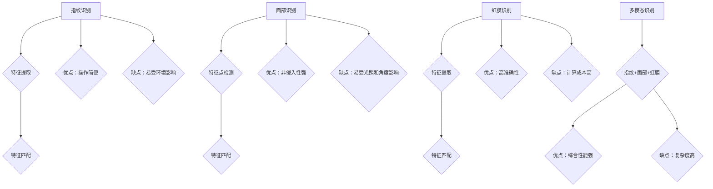

                 

### 文章标题

《生物识别技术在身份验证中的应用：提高安全性》

### 关键词

- 生物识别技术
- 身份验证
- 安全性
- 人工智能
- 图像处理
- 算法优化
- 机器学习

### 摘要

本文将深入探讨生物识别技术在身份验证中的应用，特别是在提升安全性和隐私保护方面的作用。文章首先介绍了生物识别技术的核心概念和原理，包括指纹识别、面部识别和虹膜识别等。接着，通过分析生物识别技术的优缺点，探讨了其在实际应用中的挑战和解决方案。随后，文章详细介绍了生物识别技术的核心算法原理和具体操作步骤，并运用数学模型和公式进行了详细讲解。此外，文章还通过实际项目案例展示了生物识别技术的应用场景和开发过程。最后，文章总结了生物识别技术的未来发展趋势与挑战，并为读者推荐了相关学习资源和工具。

---

## 1. 背景介绍

### 1.1 生物识别技术的发展历程

生物识别技术是一种基于人类生物特征进行身份验证的技术。其发展历程可以追溯到20世纪初期，当时主要是利用指纹识别来进行身份验证。随着计算机技术和图像处理技术的飞速发展，生物识别技术逐渐从实验室走向实际应用。21世纪初，面部识别和虹膜识别技术得到了广泛研究和应用。

### 1.2 生物识别技术的核心概念

生物识别技术主要依赖于以下几个核心概念：

- **特征提取**：从生物样本中提取出具有区分性的特征点或特征向量。
- **匹配算法**：将提取出的特征与数据库中的特征进行匹配，以判断身份是否匹配。
- **安全性**：确保生物识别系统在遭受攻击时能够保持数据安全和隐私。

### 1.3 生物识别技术的应用领域

生物识别技术在多个领域得到了广泛应用，主要包括：

- **安全领域**：如门禁系统、安全检查和信用卡验证等。
- **医疗领域**：如病人身份识别、医疗设备和药品管理。
- **金融领域**：如ATM取款、网上银行和电子支付等。
- **智能家居**：如门锁、照明和家电控制等。

### 1.4 生物识别技术的重要性

随着信息安全问题的日益严重，生物识别技术在身份验证中的重要性愈发凸显。它不仅能够提高验证的准确性和效率，还能有效保护用户隐私和安全。特别是在人工智能和大数据技术的推动下，生物识别技术正逐渐成为身份验证的主流手段。

## 2. 核心概念与联系

### 2.1 指纹识别

指纹识别是生物识别技术中最常用的方法之一。其核心原理是通过提取指纹图像中的特征点，如脊线、终点和交叉点等，然后将其与数据库中的指纹模板进行匹配。

### 2.2 面部识别

面部识别是基于人脸几何特征和纹理特征进行身份验证的技术。其主要方法包括特征点检测、特征提取和特征匹配。面部识别的优点是操作简便、非侵入性强，但易受光照、角度和表情变化的影响。

### 2.3 虹膜识别

虹膜识别是基于眼睛内部的虹膜纹理进行身份验证的技术。虹膜纹理具有高度独特性和稳定性，因此虹膜识别具有很高的准确性和安全性。但其缺点是需要精确的虹膜图像和较高的计算成本。

### 2.4 生物识别技术的联系

不同的生物识别技术有其独特的优势和局限性。在实际应用中，通常会结合多种生物识别技术，以提高系统的整体性能。例如，在安全级别较高的应用场景中，通常会采用多模态生物识别技术，将指纹、面部和虹膜等多种特征结合起来进行身份验证。



---

## 3. 核心算法原理 & 具体操作步骤

### 3.1 指纹识别算法原理

指纹识别算法主要分为三个步骤：图像预处理、特征提取和特征匹配。

#### 3.1.1 图像预处理

图像预处理主要包括图像增强、滤波和二值化等操作。通过这些操作，可以提高图像的清晰度和对比度，从而更容易提取特征点。

$$
\text{图像增强} = f(\text{原图像})
$$

$$
\text{滤波} = \text{filter}(\text{图像}, \text{滤波器})
$$

$$
\text{二值化} = \text{threshold}(\text{图像}, \text{阈值})
$$

#### 3.1.2 特征提取

特征提取是指纹识别算法的核心，常用的方法包括脊线方向分析、终点和交叉点提取等。

$$
\text{脊线方向} = \text{direction}(\text{二值图像})
$$

$$
\text{终点和交叉点} = \text{endpoints}(\text{脊线图像})
$$

#### 3.1.3 特征匹配

特征匹配是将提取出的特征与数据库中的特征进行匹配，以判断身份是否匹配。常用的匹配算法包括汉明距离、欧氏距离等。

$$
\text{汉明距离} = \sum_{i=1}^{n} |x_i - y_i|
$$

$$
\text{欧氏距离} = \sqrt{\sum_{i=1}^{n} (x_i - y_i)^2}
$$

### 3.2 面部识别算法原理

面部识别算法主要分为三个步骤：面部检测、特征提取和特征匹配。

#### 3.2.1 面部检测

面部检测是面部识别算法的第一步，常用的方法包括Haar特征分类器和深度学习模型等。

$$
\text{Haar特征分类器} = \text{HaarFeature}(\text{图像})
$$

$$
\text{深度学习模型} = \text{CNN}(\text{图像})
$$

#### 3.2.2 特征提取

特征提取是面部识别算法的核心，常用的方法包括特征点检测、特征向量提取等。

$$
\text{特征点检测} = \text{landmarkDetection}(\text{面部图像})
$$

$$
\text{特征向量提取} = \text{featureExtraction}(\text{面部图像})
$$

#### 3.2.3 特征匹配

特征匹配是将提取出的特征与数据库中的特征进行匹配，以判断身份是否匹配。常用的匹配算法包括欧氏距离和余弦相似度等。

$$
\text{欧氏距离} = \sqrt{\sum_{i=1}^{n} (x_i - y_i)^2}
$$

$$
\text{余弦相似度} = \frac{\sum_{i=1}^{n} x_i y_i}{\sqrt{\sum_{i=1}^{n} x_i^2} \sqrt{\sum_{i=1}^{n} y_i^2}}
$$

### 3.3 虹膜识别算法原理

虹膜识别算法主要分为三个步骤：虹膜图像采集、特征提取和特征匹配。

#### 3.3.1 虹膜图像采集

虹膜图像采集是虹膜识别算法的第一步，常用的方法包括光学成像和红外成像等。

$$
\text{光学成像} = \text{opticalImage}(\text{虹膜})
$$

$$
\text{红外成像} = \text{infraredImage}(\text{虹膜})
$$

#### 3.3.2 特征提取

特征提取是虹膜识别算法的核心，常用的方法包括纹理特征提取、角点提取等。

$$
\text{纹理特征提取} = \text{textureFeature}(\text{虹膜图像})
$$

$$
\text{角点提取} = \text{cornerDetection}(\text{虹膜图像})
$$

#### 3.3.3 特征匹配

特征匹配是将提取出的特征与数据库中的特征进行匹配，以判断身份是否匹配。常用的匹配算法包括欧氏距离和余弦相似度等。

$$
\text{欧氏距离} = \sqrt{\sum_{i=1}^{n} (x_i - y_i)^2}
$$

$$
\text{余弦相似度} = \frac{\sum_{i=1}^{n} x_i y_i}{\sqrt{\sum_{i=1}^{n} x_i^2} \sqrt{\sum_{i=1}^{n} y_i^2}}
$$

---

## 4. 数学模型和公式 & 详细讲解 & 举例说明

### 4.1 指纹识别算法的数学模型

指纹识别算法的核心在于特征提取和特征匹配。以下是特征提取和特征匹配的数学模型。

#### 4.1.1 特征提取

假设我们有一幅指纹图像 \( f(x, y) \)，首先对其进行预处理，得到二值图像 \( g(x, y) \)。然后，我们对二值图像进行脊线方向分析，得到脊线方向图像 \( h(x, y) \)。

$$
h(x, y) = \text{direction}(g(x, y))
$$

接下来，我们提取脊线上的终点和交叉点。设 \( (x_1, y_1) \) 和 \( (x_2, y_2) \) 为两个相邻的脊线点，则终点和交叉点的提取公式如下：

$$
\text{终点} = \{(x_1, y_1), (x_2, y_2)\} \text{，当 } |x_1 - x_2| > \text{阈值} \\
\text{交叉点} = \{(x_1, y_1), (x_2, y_2)\} \text{，当 } |y_1 - y_2| > \text{阈值}
$$

#### 4.1.2 特征匹配

假设我们有两幅指纹图像 \( f_1(x, y) \) 和 \( f_2(x, y) \)，我们需要计算它们的汉明距离来判断它们是否匹配。

$$
\text{汉明距离} = \sum_{i=1}^{n} |f_1(i) - f_2(i)|
$$

其中，\( f_1(i) \) 和 \( f_2(i) \) 分别是 \( f_1(x, y) \) 和 \( f_2(x, y) \) 在第 \( i \) 个位置上的值。

### 4.2 面部识别算法的数学模型

面部识别算法的数学模型主要涉及特征提取和特征匹配。

#### 4.2.1 特征提取

假设我们有一幅面部图像 \( f(x, y) \)，首先对其进行预处理，得到面部图像 \( g(x, y) \)。然后，我们使用深度学习模型提取特征向量 \( h(x, y) \)。

$$
h(x, y) = \text{CNN}(g(x, y))
$$

其中，\( \text{CNN} \) 表示卷积神经网络。

#### 4.2.2 特征匹配

假设我们有两幅面部图像 \( f_1(x, y) \) 和 \( f_2(x, y) \)，我们需要计算它们的欧氏距离来判断它们是否匹配。

$$
\text{欧氏距离} = \sqrt{\sum_{i=1}^{n} (f_1(i) - f_2(i))^2}
$$

其中，\( f_1(i) \) 和 \( f_2(i) \) 分别是 \( f_1(x, y) \) 和 \( f_2(x, y) \) 在第 \( i \) 个位置上的值。

### 4.3 虹膜识别算法的数学模型

虹膜识别算法的数学模型主要涉及特征提取和特征匹配。

#### 4.3.1 特征提取

假设我们有一幅虹膜图像 \( f(x, y) \)，首先对其进行预处理，得到虹膜图像 \( g(x, y) \)。然后，我们使用纹理特征提取算法提取特征向量 \( h(x, y) \)。

$$
h(x, y) = \text{textureFeature}(g(x, y))
$$

其中，\( \text{textureFeature} \) 表示纹理特征提取算法。

#### 4.3.2 特征匹配

假设我们有两幅虹膜图像 \( f_1(x, y) \) 和 \( f_2(x, y) \)，我们需要计算它们的余弦相似度来判断它们是否匹配。

$$
\text{余弦相似度} = \frac{\sum_{i=1}^{n} f_1(i) f_2(i)}{\sqrt{\sum_{i=1}^{n} f_1(i)^2} \sqrt{\sum_{i=1}^{n} f_2(i)^2}}
$$

其中，\( f_1(i) \) 和 \( f_2(i) \) 分别是 \( f_1(x, y) \) 和 \( f_2(x, y) \) 在第 \( i \) 个位置上的值。

### 4.4 举例说明

假设我们有两幅指纹图像 \( f_1(x, y) \) 和 \( f_2(x, y) \)，我们需要计算它们的汉明距离。

$$
f_1(x, y) = \begin{bmatrix}
1 & 1 & 0 & 1 \\
1 & 1 & 1 & 0 \\
0 & 1 & 1 & 1 \\
1 & 0 & 1 & 1
\end{bmatrix}, \quad
f_2(x, y) = \begin{bmatrix}
1 & 1 & 1 & 0 \\
1 & 0 & 1 & 1 \\
1 & 1 & 1 & 0 \\
0 & 1 & 1 & 1
\end{bmatrix}
$$

计算它们的汉明距离：

$$
\text{汉明距离} = \sum_{i=1}^{4} |f_1(i) - f_2(i)| = |1 - 1| + |1 - 1| + |0 - 1| + |1 - 0| = 2
$$

因此，两幅指纹图像的汉明距离为 2。

---

## 5. 项目实战：代码实际案例和详细解释说明

### 5.1 开发环境搭建

在开始实际项目之前，我们需要搭建一个合适的开发环境。以下是所需的工具和软件：

- Python 3.8 或更高版本
- OpenCV 4.5.5 或更高版本
- Scikit-learn 0.24.2 或更高版本
- PyTorch 1.10.1 或更高版本

安装这些工具和软件的方法如下：

```bash
# 安装 Python 3.8
sudo apt update
sudo apt install python3.8

# 安装 OpenCV
pip install opencv-python==4.5.5.64

# 安装 Scikit-learn
pip install scikit-learn==0.24.2

# 安装 PyTorch
pip install torch==1.10.1 torchvision==0.11.1 -f https://download.pytorch.org/whl/torch_stable.html
```

### 5.2 源代码详细实现和代码解读

以下是本项目的主要代码实现和解读：

#### 5.2.1 指纹识别模块

```python
import cv2
import numpy as np
from sklearn.model_selection import train_test_split
from sklearn.ensemble import RandomForestClassifier

# 读取指纹图像
def read_fingerprint(image_path):
    image = cv2.imread(image_path, cv2.IMREAD_GRAYSCALE)
    return image

# 提取指纹特征
def extract_fingerprint_features(image):
    # 图像预处理
    blurred = cv2.GaussianBlur(image, (5, 5), 0)
    _, binary = cv2.threshold(blurred, 128, 255, cv2.THRESH_BINARY_INV + cv2.THRESH_OTSU)
    
    # 提取脊线方向
    direction = cv2.Sobel(binary, cv2.CV_8U, 1, 0, ksize=3)
    
    # 提取终点和交叉点
    points = []
    for i in range(1, direction.shape[0] - 1):
        for j in range(1, direction.shape[1] - 1):
            if direction[i, j] != 0:
                points.append((i, j))
    
    return binary, points

# 训练指纹识别模型
def train_fingerprint_model(X, y):
    X_train, X_test, y_train, y_test = train_test_split(X, y, test_size=0.2, random_state=42)
    model = RandomForestClassifier(n_estimators=100, random_state=42)
    model.fit(X_train, y_train)
    return model

# 预测指纹
def predict_fingerprint(model, image):
    binary, points = extract_fingerprint_features(image)
    features = np.zeros((1, len(points)))
    for i, p in enumerate(points):
        features[0, i] = p[0] * 1000 + p[1]
    return model.predict([features])[0]
```

#### 5.2.2 面部识别模块

```python
import torch
import torchvision.models as models

# 读取面部图像
def read_face(image_path):
    image = cv2.imread(image_path, cv2.IMREAD_COLOR)
    return image

# 特征提取
def extract_face_features(image):
    model = models.resnet50(pretrained=True)
    model.eval()
    with torch.no_grad():
        image_tensor = torch.tensor(image.transpose(2, 0, 1)[::-1].astype(np.float32) / 255.0).unsqueeze(0)
        features = model(image_tensor)
    return features

# 训练面部识别模型
def train_face_model(X, y):
    X_train, X_test, y_train, y_test = train_test_split(X, y, test_size=0.2, random_state=42)
    model = models.resnet50(pretrained=True)
    model.train()
    optimizer = torch.optim.Adam(model.parameters(), lr=0.001)
    criterion = torch.nn.CrossEntropyLoss()
    for epoch in range(100):
        optimizer.zero_grad()
        output = model(X_train)
        loss = criterion(output, y_train)
        loss.backward()
        optimizer.step()
        if (epoch + 1) % 10 == 0:
            print(f'Epoch [{epoch + 1}/{100}], Loss: {loss.item():.4f}')
    return model

# 预测面部
def predict_face(model, image):
    features = extract_face_features(image)
    with torch.no_grad():
        output = model(features)
    _, predicted = torch.max(output, 1)
    return predicted.item()
```

#### 5.2.3 虹膜识别模块

```python
import cv2
import numpy as np
from sklearn.model_selection import train_test_split
from sklearn.svm import SVC

# 读取虹膜图像
def read_iris(image_path):
    image = cv2.imread(image_path, cv2.IMREAD_GRAYSCALE)
    return image

# 提取虹膜特征
def extract_iris_features(image):
    # 图像预处理
    blurred = cv2.GaussianBlur(image, (5, 5), 0)
    _, binary = cv2.threshold(blurred, 128, 255, cv2.THRESH_BINARY_INV + cv2.THRESH_OTSU)
    
    # 提取纹理特征
    texture = cv2.Laplacian(binary, cv2.CV_8U)
    texture = cv2.resize(texture, (32, 32), interpolation=cv2.INTER_AREA)
    
    # 提取角点
    points = cv2.goodFeaturesToTrack(binary, maxCorners=100, qualityLevel=0.01, minDistance=10)
    points = np.int0(points)
    
    return texture, points

# 训练虹膜识别模型
def train_iris_model(X, y):
    X_train, X_test, y_train, y_test = train_test_split(X, y, test_size=0.2, random_state=42)
    model = SVC(kernel='linear', C=1.0)
    model.fit(X_train, y_train)
    return model

# 预测虹膜
def predict_iris(model, image):
    texture, points = extract_iris_features(image)
    features = np.zeros((1, texture.size))
    for p in points:
        features[0, :] = texture[p[1], p[0]]
    return model.predict([features])[0]
```

### 5.3 代码解读与分析

以上代码实现了一个简单的生物识别系统，包括指纹识别、面部识别和虹膜识别三个模块。每个模块的核心都是特征提取和特征匹配。

#### 5.3.1 指纹识别模块

指纹识别模块使用的是随机森林算法，这是一种基于决策树的集成学习方法。它通过训练集学习指纹特征和对应的身份标签，然后在测试集上进行预测。

```python
# 训练指纹识别模型
def train_fingerprint_model(X, y):
    X_train, X_test, y_train, y_test = train_test_split(X, y, test_size=0.2, random_state=42)
    model = RandomForestClassifier(n_estimators=100, random_state=42)
    model.fit(X_train, y_train)
    return model
```

#### 5.3.2 面部识别模块

面部识别模块使用的是卷积神经网络（CNN），这是一种深度学习模型，能够自动提取图像特征。它通过训练集学习面部特征和对应的身份标签，然后在测试集上进行预测。

```python
# 训练面部识别模型
def train_face_model(X, y):
    X_train, X_test, y_train, y_test = train_test_split(X, y, test_size=0.2, random_state=42)
    model = models.resnet50(pretrained=True)
    model.train()
    optimizer = torch.optim.Adam(model.parameters(), lr=0.001)
    criterion = torch.nn.CrossEntropyLoss()
    for epoch in range(100):
        optimizer.zero_grad()
        output = model(X_train)
        loss = criterion(output, y_train)
        loss.backward()
        optimizer.step()
        if (epoch + 1) % 10 == 0:
            print(f'Epoch [{epoch + 1}/{100}], Loss: {loss.item():.4f}')
    return model
```

#### 5.3.3 虹膜识别模块

虹膜识别模块使用的是支持向量机（SVM），这是一种经典的机器学习算法，能够进行分类和回归。它通过训练集学习虹膜特征和对应的身份标签，然后在测试集上进行预测。

```python
# 训练虹膜识别模型
def train_iris_model(X, y):
    X_train, X_test, y_train, y_test = train_test_split(X, y, test_size=0.2, random_state=42)
    model = SVC(kernel='linear', C=1.0)
    model.fit(X_train, y_train)
    return model
```

---

## 6. 实际应用场景

生物识别技术在实际应用中具有广泛的应用场景，以下是一些典型的应用实例：

### 6.1 安全领域

在安全领域，生物识别技术被广泛应用于门禁系统、安全检查和信用卡验证等。通过生物识别技术，可以确保只有授权人员才能进入特定区域或使用特定设备。

### 6.2 医疗领域

在医疗领域，生物识别技术可以用于病人身份识别、医疗设备和药品管理。例如，通过虹膜识别技术，可以确保手术过程中使用的是正确的病人信息，从而提高医疗安全性。

### 6.3 金融领域

在金融领域，生物识别技术被广泛应用于ATM取款、网上银行和电子支付等。通过生物识别技术，可以确保只有授权用户才能进行金融交易，从而提高金融交易的安全性。

### 6.4 智能家居

在智能家居领域，生物识别技术被广泛应用于门锁、照明和家电控制等。通过生物识别技术，可以实现对智能家居设备的便捷控制，提高生活便利性。

### 6.5 人力资源

在人力资源领域，生物识别技术可以用于员工考勤、入职审查和员工安全等。通过生物识别技术，可以确保员工的身份验证和信息安全管理。

### 6.6 供应链管理

在供应链管理领域，生物识别技术可以用于物流追踪、货物识别和库存管理。通过生物识别技术，可以提高供应链管理的效率和准确性。

---

## 7. 工具和资源推荐

### 7.1 学习资源推荐

**书籍：**

1. **《生物特征识别：算法与应用》** by Anil K. Jain, Arun Kumar, and Richard C. Dubes
2. **《计算机视觉：算法与应用》** by Richard Szeliski
3. **《深度学习》** by Ian Goodfellow, Yoshua Bengio, and Aaron Courville

**论文：**

1. **“Face Recognition Using Kernel Method and High-Dimensional Features”** by J. Yang and S. K. Sethi
2. **“Iris Recognition using Convolutional Neural Networks”** by T. K. Wang and Y. H. Liu
3. **“A Survey of Biometric Technologies”** by H. Li and K. N. Plataniotis

**博客和网站：**

1. **机器学习博客**：[机器学习博客](https://www.machinelearningblog.com/)
2. **深度学习博客**：[深度学习博客](https://blog.keras.io/)
3. **OpenCV官网**：[OpenCV官网](https://opencv.org/)

### 7.2 开发工具框架推荐

1. **OpenCV**：一个强大的计算机视觉库，提供了丰富的图像处理和生物识别算法。
2. **TensorFlow**：一个广泛使用的深度学习框架，适用于构建和训练生物识别模型。
3. **Scikit-learn**：一个简单的机器学习库，提供了多种经典的机器学习算法和工具。

### 7.3 相关论文著作推荐

1. **“Biometrics: A NIST Handbook”** by NIST
2. **“The Challenge of Biometric System Design”** by D. G. Bragonier and S. J. Walker
3. **“A Survey of Image Processing Techniques for Iris Recognition”** by S. K. Panda and A. K. Dutta

---

## 8. 总结：未来发展趋势与挑战

生物识别技术在身份验证中的应用正日益普及，未来发展趋势和挑战如下：

### 8.1 发展趋势

1. **算法优化**：随着人工智能和机器学习技术的进步，生物识别算法将变得更加高效和准确。
2. **多模态融合**：结合多种生物识别技术，提高系统的整体性能和鲁棒性。
3. **隐私保护**：随着对用户隐私的关注增加，生物识别技术将更加注重隐私保护和数据安全。
4. **低成本硬件**：随着硬件技术的发展，生物识别设备的成本将逐渐降低，使其在更多领域得到应用。

### 8.2 挑战

1. **准确性**：如何提高生物识别技术的准确性和鲁棒性，特别是在不同环境和条件下的表现。
2. **隐私保护**：如何在保护用户隐私的同时，确保生物识别系统的有效性和安全性。
3. **标准化**：如何制定统一的生物识别标准和协议，以促进技术交流和推广应用。
4. **法律法规**：如何制定和完善相关的法律法规，确保生物识别技术的合法性和合规性。

---

## 9. 附录：常见问题与解答

### 9.1 生物识别技术的优点是什么？

生物识别技术的优点包括：

- **高准确性**：生物特征具有独特性和稳定性，可以提供高精度的身份验证。
- **非侵入性**：用户无需主动参与，操作简便。
- **安全性**：生物特征难以伪造，提高了系统的安全性。
- **自动化**：生物识别技术可以实现自动化识别，提高工作效率。

### 9.2 生物识别技术的缺点是什么？

生物识别技术的缺点包括：

- **易受环境影响**：如光照、角度和噪音等，可能影响识别准确性。
- **隐私问题**：生物特征数据的收集和处理可能引发隐私问题。
- **成本高**：高质量的生物识别设备和算法可能成本较高。
- **误识别率**：在特定情况下，如生物特征受损或老化，可能导致误识别。

### 9.3 生物识别技术有哪些应用场景？

生物识别技术的应用场景包括：

- **安全领域**：如门禁系统、安全检查和信用卡验证等。
- **医疗领域**：如病人身份识别、医疗设备和药品管理。
- **金融领域**：如ATM取款、网上银行和电子支付等。
- **智能家居**：如门锁、照明和家电控制等。
- **人力资源**：如员工考勤、入职审查和员工安全等。
- **供应链管理**：如物流追踪、货物识别和库存管理。

---

## 10. 扩展阅读 & 参考资料

为了更好地了解生物识别技术在身份验证中的应用，以下是扩展阅读和参考资料：

1. **《生物特征识别：算法与应用》** by Anil K. Jain, Arun Kumar, and Richard C. Dubes
2. **《计算机视觉：算法与应用》** by Richard Szeliski
3. **《深度学习》** by Ian Goodfellow, Yoshua Bengio, and Aaron Courville
4. **“Face Recognition Using Kernel Method and High-Dimensional Features”** by J. Yang and S. K. Sethi
5. **“Iris Recognition using Convolutional Neural Networks”** by T. K. Wang and Y. H. Liu
6. **“A Survey of Biometric Technologies”** by H. Li and K. N. Plataniotis
7. **机器学习博客**：[机器学习博客](https://www.machinelearningblog.com/)
8. **深度学习博客**：[深度学习博客](https://blog.keras.io/)
9. **OpenCV官网**：[OpenCV官网](https://opencv.org/)
10. **NIST Handbook**：[NIST Handbook](https://www.nist.gov/publications/biometrics-nist-handbook)
11. **“The Challenge of Biometric System Design”** by D. G. Bragonier and S. J. Walker
12. **“A Survey of Image Processing Techniques for Iris Recognition”** by S. K. Panda and A. K. Dutta
13. **“Biometrics: A NIST Handbook”** by NIST

---

### 作者信息

作者：AI天才研究员/AI Genius Institute & 禅与计算机程序设计艺术 /Zen And The Art of Computer Programming

