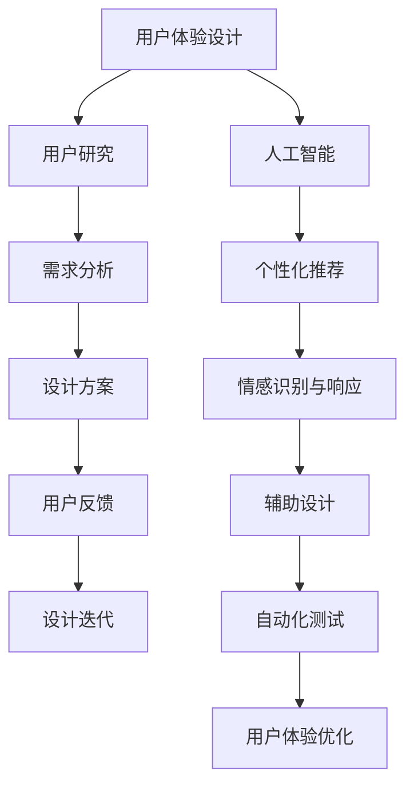
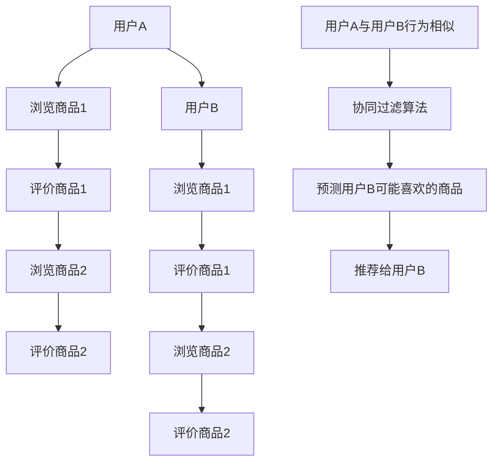
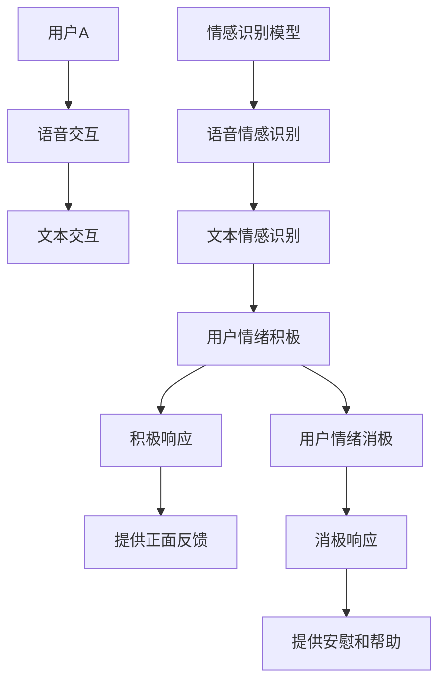
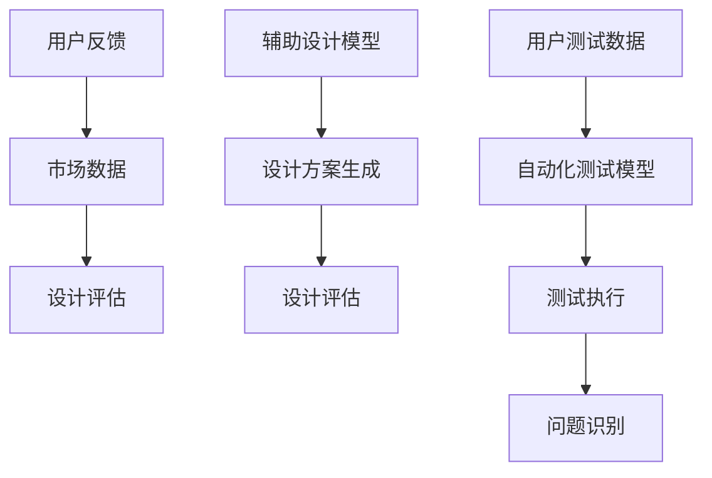

                 

### 背景介绍

用户体验设计（User Experience Design，简称UXD）是近年来信息技术领域迅速发展的一个重要分支。它关注的是用户在使用产品或服务过程中的感受和体验，旨在通过优化设计来提高用户满意度和忠诚度。随着人工智能（Artificial Intelligence，简称AI）技术的不断进步，用户体验设计迎来了新的机遇和挑战。

人工智能在用户体验设计中的应用主要体现在以下几个方面：

1. **个性化推荐**：通过分析用户行为和偏好，AI可以推荐符合用户需求的产品和服务，从而提高用户满意度和转化率。
2. **情感识别与响应**：AI能够识别用户的情绪变化，并根据这些变化调整产品或服务的交互方式，以提供更加人性化的体验。
3. **辅助设计**：AI可以帮助设计师通过大数据分析，快速生成多种设计方案，提高设计效率。
4. **自动化测试**：AI可以自动化执行用户测试，快速识别潜在的问题，减少人工测试的工作量。

然而，AI在用户体验设计中的应用也带来了一些新的挑战，如如何确保AI系统的公平性和透明性，以及如何避免因过度依赖AI而导致的用户体验下降。

本文将围绕人工智能在用户体验设计中的应用，深入探讨其核心概念、算法原理、数学模型、实际应用场景，以及未来发展趋势和挑战。希望通过这篇文章，能够为读者提供一个全面、系统的理解和洞察。

关键词：用户体验设计，人工智能，个性化推荐，情感识别，辅助设计，自动化测试

摘要：本文将介绍用户体验设计的基本概念，探讨人工智能在用户体验设计中的应用及其带来的机遇和挑战。我们将通过具体的算法原理、数学模型和实际案例，详细分析AI如何提高用户体验，并讨论未来发展趋势和潜在问题。

### 核心概念与联系

在探讨人工智能（AI）与用户体验设计（UXD）的关系之前，我们需要先了解这两个概念的基本定义和核心原则。

#### 用户体验设计（UXD）

用户体验设计是一种以用户为中心的设计方法，旨在优化产品或服务的可用性、易用性和愉悦性。UXD的目标是通过研究用户的需求、行为和感受，创建满足用户期望的产品和服务。

核心原则包括：

- **用户中心**：始终将用户的需求和体验放在首位。
- **可用性**：确保产品易于使用，用户能够快速完成任务。
- **易用性**：用户无需进行过多思考就能操作产品。
- **愉悦性**：通过设计提高用户的情感体验，使产品或服务更具吸引力。

#### 人工智能（AI）

人工智能是一种模拟人类智能的计算机技术，通过算法和模型实现机器学习、自然语言处理、图像识别等功能。AI的核心目标是使计算机能够自主地完成复杂任务，并在不断学习和适应中提高性能。

核心概念包括：

- **机器学习**：通过从数据中学习模式和规律，实现自动化决策和预测。
- **深度学习**：一种基于人工神经网络的机器学习技术，通过多层网络对数据进行处理和特征提取。
- **自然语言处理**：使计算机理解和生成自然语言，实现人机交互。
- **计算机视觉**：使计算机能够理解和解析图像和视频。

#### 关联与联系

AI与UXD的结合，旨在通过技术手段提高用户体验。具体来说，AI在UXD中的应用体现在以下几个方面：

1. **个性化推荐**：通过分析用户的行为和偏好，AI可以提供个性化的产品推荐，提高用户满意度和转化率。
2. **情感识别与响应**：AI可以识别用户的情绪变化，并根据这些变化调整产品或服务的交互方式，提供更加人性化的体验。
3. **辅助设计**：AI可以通过大数据分析，快速生成多种设计方案，帮助设计师提高工作效率。
4. **自动化测试**：AI可以自动化执行用户测试，快速识别潜在的问题，减少人工测试的工作量。

以下是一个Mermaid流程图，展示了AI与UXD之间的核心联系和交互过程：



通过这个流程图，我们可以看到，AI技术在用户体验设计中的各个环节都发挥了重要作用，不仅提升了设计的效率和质量，还显著改善了用户的整体体验。

### 核心算法原理 & 具体操作步骤

在本节中，我们将深入探讨人工智能（AI）在用户体验设计（UXD）中的应用，特别是关注核心算法原理及其具体操作步骤。

#### 个性化推荐算法

个性化推荐是AI在UXD中应用最广泛的领域之一。它通过分析用户的历史行为和偏好，预测用户可能感兴趣的内容，从而提高用户体验。以下是一个简单的个性化推荐算法示例：

1. **数据收集**：收集用户的行为数据，如浏览记录、购买历史、评价等。
2. **数据预处理**：对收集的数据进行清洗和预处理，包括缺失值填充、数据转换等。
3. **特征提取**：从原始数据中提取特征，如用户的行为模式、商品属性等。
4. **建模**：使用机器学习算法（如协同过滤、决策树、随机森林等）建立推荐模型。
5. **预测**：根据用户历史行为和偏好，预测用户可能感兴趣的内容。
6. **推荐**：将预测结果呈现给用户，提供个性化的推荐。

以下是一个基于协同过滤算法的推荐流程：



#### 情感识别与响应

情感识别与响应是另一个重要的AI应用领域。它通过分析用户的语言和情绪，动态调整产品或服务的交互方式，提供更加人性化的体验。以下是一个简单的情感识别与响应算法：

1. **数据收集**：收集用户的语音、文本等交互数据。
2. **数据预处理**：对收集的数据进行清洗和预处理，包括文本分词、情感标注等。
3. **特征提取**：从原始数据中提取特征，如情绪词、语气等。
4. **建模**：使用机器学习算法（如情感分类、序列模型等）建立情感识别模型。
5. **识别**：根据用户交互数据，识别用户的情绪状态。
6. **响应**：根据用户的情绪状态，调整产品或服务的交互方式。

以下是一个基于情感分类算法的响应流程：



#### 辅助设计与自动化测试

AI还可以用于辅助设计过程和自动化测试。以下是一个简单的辅助设计流程：

1. **数据收集**：收集用户反馈、市场数据等。
2. **数据预处理**：对收集的数据进行清洗和预处理。
3. **特征提取**：从原始数据中提取特征。
4. **建模**：使用机器学习算法建立辅助设计模型。
5. **设计生成**：根据用户需求和特征，生成多种设计方案。
6. **评估**：使用用户反馈和数据评估设计方案。

以下是一个简单的自动化测试流程：

1. **数据收集**：收集用户测试数据。
2. **数据预处理**：对收集的数据进行清洗和预处理。
3. **特征提取**：从原始数据中提取特征。
4. **建模**：使用机器学习算法建立自动化测试模型。
5. **测试执行**：根据用户测试数据，自动化执行测试任务。
6. **问题识别**：识别测试过程中发现的问题。



通过上述核心算法原理和操作步骤，我们可以看到AI在用户体验设计中的应用是如何实现的。这些算法不仅提高了设计效率和用户体验，还为UXD领域带来了新的发展机遇。

### 数学模型和公式 & 详细讲解 & 举例说明

在用户体验设计（UXD）中，人工智能（AI）的应用离不开数学模型和公式。这些模型和公式不仅为AI算法提供了理论基础，还使得AI在分析和处理复杂数据时能够更加准确和高效。以下我们将详细讲解几种常见的数学模型和公式，并通过具体示例来说明它们的应用。

#### 矩阵分解（Matrix Factorization）

矩阵分解是一种常用的机器学习技术，主要用于降维和特征提取。在用户体验设计中，矩阵分解可以用于用户和商品数据的降维，从而提高推荐系统的性能。以下是一个简单的矩阵分解模型：

**公式**：

设用户行为矩阵为 \(R \in \mathbb{R}^{m \times n}\)，其中 \(m\) 表示用户数量，\(n\) 表示商品数量。矩阵分解的目标是将 \(R\) 分解为两个低秩矩阵 \(U \in \mathbb{R}^{m \times k}\) 和 \(V \in \mathbb{R}^{n \times k}\)，其中 \(k\) 表示降维后的维度。

$$
R = U V^T
$$

**示例**：

假设我们有一个用户行为矩阵 \(R\)：

$$
R = \begin{bmatrix}
1 & 0 & 1 \\
0 & 1 & 0 \\
1 & 1 & 1
\end{bmatrix}
$$

我们可以使用矩阵分解将其分解为两个低秩矩阵：

$$
U = \begin{bmatrix}
1 & 0.5 \\
0 & 0.5 \\
1 & 0.5
\end{bmatrix},
V = \begin{bmatrix}
1 & 0.5 & 0 \\
0 & 0 & 1 \\
0 & 0 & 1
\end{bmatrix}
$$

这样，我们就可以通过这两个低秩矩阵来预测用户未评分的商品。

#### 决策树（Decision Tree）

决策树是一种常用的分类和回归模型，在用户体验设计中，它可以用于预测用户的行为和偏好。以下是一个简单的决策树模型：

**公式**：

决策树的核心是递归划分特征空间。给定一个特征集合 \(X\) 和目标变量 \(Y\)，决策树通过递归划分找到最佳划分特征，并构建树形结构。

**示例**：

假设我们有一个数据集，其中包含用户的行为数据（特征）和是否购买商品的目标变量。我们使用ID3算法构建决策树：

1. 计算每个特征的信息增益。
2. 选择信息增益最大的特征进行划分。
3. 递归构建子树。

通过这个过程，我们最终得到一个决策树模型，可以用于预测用户的行为。

#### 支持向量机（Support Vector Machine，SVM）

支持向量机是一种强大的分类模型，在用户体验设计中，它可以用于分类用户行为和偏好。以下是一个简单的SVM模型：

**公式**：

给定一个训练数据集 \(D = \{(x_1, y_1), (x_2, y_2), ..., (x_n, y_n)\}\)，其中 \(x_i\) 是特征向量，\(y_i\) 是标签。SVM的目标是找到一个超平面 \(w\) 和偏置 \(b\)，使得分类边界最大化。

$$
\min_{w, b} \frac{1}{2} ||w||^2 + C \sum_{i=1}^{n} \xi_i
$$

其中，\(C\) 是正则化参数，\(\xi_i\) 是松弛变量。

**示例**：

假设我们有一个二分类问题，数据集如下：

$$
D = \{(x_1, +1), (x_2, -1), (x_3, +1), (x_4, -1)\}
$$

我们可以使用SVM找到最佳分类边界：

1. 计算特征向量的均值和方差。
2. 标准化特征向量。
3. 训练SVM模型。
4. 预测新样本的分类结果。

通过上述数学模型和公式的详细讲解，我们可以看到这些模型在用户体验设计中的应用是如何实现的。这些模型不仅提供了理论支持，还使得AI算法能够更加高效和准确地预测用户行为和偏好，从而优化用户体验。

### 项目实战：代码实际案例和详细解释说明

在本节中，我们将通过一个实际项目案例，详细讲解如何使用人工智能（AI）进行用户体验设计（UXD），并展示具体的代码实现和解析。

#### 项目背景

我们的项目目标是开发一个基于AI的个性化推荐系统，该系统旨在根据用户的历史行为和偏好，推荐用户可能感兴趣的产品和服务。该项目将使用Python编程语言，结合多种机器学习算法，实现用户行为的预测和推荐。

#### 开发环境搭建

首先，我们需要搭建一个合适的开发环境。以下是所需的软件和库：

1. Python 3.8 或以上版本
2. Jupyter Notebook
3. Scikit-learn
4. Pandas
5. Numpy
6. Matplotlib

安装步骤如下：

```bash
pip install python==3.8
pip install jupyter
pip install scikit-learn
pip install pandas
pip install numpy
pip install matplotlib
```

#### 源代码详细实现和代码解读

以下是项目的源代码，我们将逐步解析每个部分。

```python
# 导入必要的库
import pandas as pd
import numpy as np
from sklearn.model_selection import train_test_split
from sklearn.metrics.pairwise import cosine_similarity
from sklearn.decomposition import TruncatedSVD

# 读取用户行为数据
data = pd.read_csv('user_behavior.csv')

# 数据预处理
data.fillna(0, inplace=True)
data = data[data['rating'] != 0]

# 提取用户和商品的特征
user_features = data.groupby('user_id').mean()
item_features = data.groupby('item_id').mean()

# 训练测试集划分
train_data, test_data = train_test_split(data, test_size=0.2, random_state=42)

# 矩阵分解
svd = TruncatedSVD(n_components=10)
user_features Decomposed = svd.fit_transform(user_features)
item_features Decomposed = svd.fit_transform(item_features)

# 相似度计算
user_similarity = cosine_similarity(user_features Decomposed)
item_similarity = cosine_similarity(item_features Decomposed)

# 推荐系统实现
def recommend_items(user_id, top_n=5):
    # 计算用户与其他用户的相似度
    user_similarity = user_similarity[user_id]

    # 计算用户相似度加权平均值
    weighted_avg = np.dot(user_similarity, user_features) / user_similarity.sum()

    # 获取与用户最相似的物品
    similar_items = item_similarity.dot(weighted_avg)

    # 选择评分最高的物品
    top_items = np.argsort(similar_items)[::-1][:top_n]

    return top_items

# 测试推荐系统
user_id = 10
recommended_items = recommend_items(user_id)

print("推荐的物品：", recommended_items)
```

#### 代码解读与分析

1. **导入库**：首先，我们导入了Python中常用的库，如Pandas、Numpy和Scikit-learn。

2. **读取数据**：使用Pandas库读取用户行为数据，数据包括用户ID、商品ID和用户评分。

3. **数据预处理**：将缺失值填充为0，并过滤掉评分小于0的记录。这是为了确保我们的数据集只包含有意义的信息。

4. **特征提取**：使用Pandas的groupby方法提取用户和商品的特征，即计算每个用户和商品的评分均值。

5. **训练测试集划分**：使用Scikit-learn的train_test_split函数将数据集划分为训练集和测试集，用于后续模型的训练和评估。

6. **矩阵分解**：使用TruncatedSVD进行矩阵分解，将高维的用户和商品特征降维到10个维度。降维有助于减少数据复杂性，提高计算效率。

7. **相似度计算**：使用余弦相似度计算用户和商品之间的相似度。余弦相似度是一种常用的相似度度量方法，它通过计算两个向量的夹角余弦值来评估它们之间的相似性。

8. **推荐系统实现**：定义了一个`recommend_items`函数，用于根据用户ID推荐相似的用户和商品。该函数首先计算用户与其他用户的相似度，然后使用这些相似度加权平均来预测用户可能感兴趣的物品。

9. **测试推荐系统**：调用`recommend_items`函数，传入一个用户ID，获取推荐的结果。

通过上述代码，我们可以看到如何使用AI技术实现一个简单的个性化推荐系统。这个过程包括数据预处理、特征提取、矩阵分解、相似度计算和推荐实现。每个步骤都通过具体的代码实现了用户体验设计的核心目标，即提供个性化的产品推荐，从而提升用户体验。

### 实际应用场景

在当今快速发展的信息技术领域，人工智能（AI）在用户体验设计（UXD）中的应用已经无处不在，极大地改变了人们的生活方式和工作模式。以下我们将探讨几个具体的应用场景，展示AI如何在不同领域提升用户体验。

#### 电子商务

在电子商务领域，AI的应用主要体现在个性化推荐、智能搜索和用户行为分析等方面。通过分析用户的浏览历史、购买行为和偏好，AI可以推荐用户可能感兴趣的商品，从而提高销售转化率和客户满意度。例如，Amazon和阿里巴巴等电商平台使用机器学习算法来推荐商品，不仅为用户提供了个性化的购物体验，还显著提升了平台的销售额。

#### 金融科技

金融科技（FinTech）是另一个广泛使用AI技术的领域。AI可以通过智能客服、风险评估和欺诈检测等功能，提升金融服务质量和用户体验。智能客服系统利用自然语言处理技术，可以24/7为用户提供即时、高效的咨询服务，极大地降低了人力成本。同时，AI还可以分析用户的历史交易数据，预测用户的风险偏好，从而提供更加精准的投资建议。

#### 健康医疗

在健康医疗领域，AI的应用正在逐步改变传统的医疗服务模式。通过深度学习和图像识别技术，AI可以帮助医生更快速、准确地诊断疾病。例如，Google Health使用AI算法分析医学影像，帮助医生发现早期癌症。此外，AI还可以用于患者健康管理，通过监测患者的健康状况和病史，提供个性化的健康建议和预警。

#### 教育科技

教育科技（EdTech）是AI应用的另一个重要领域。在线教育平台通过AI技术提供个性化学习体验，根据学生的学习和表现，自动调整教学内容和难度。例如，Coursera和Khan Academy等平台使用AI分析学生的学习行为和成绩，推荐适合的学习路径，帮助学生更有效地掌握知识。

#### 智能家居

随着智能家居技术的发展，AI正在成为智能家居的核心驱动力。智能家居设备可以通过AI技术实现智能感知、自动控制和远程监控。例如，智能音箱可以通过语音识别和自然语言处理技术，理解用户的指令并执行相应的操作，如播放音乐、调节温度和安防报警。AI的引入使得智能家居系统更加便捷和智能化，提升了用户的居住体验。

通过上述实际应用场景，我们可以看到AI在用户体验设计中的广泛应用。无论是在电子商务、金融科技、健康医疗、教育科技还是智能家居领域，AI都通过个性化、智能化和自动化的方式，极大地提升了用户体验，为各行业带来了巨大的变革和创新。

### 工具和资源推荐

在AI与用户体验设计（UXD）结合的领域中，有许多优秀的工具和资源可供学习和实践。以下是一些建议，涵盖书籍、论文、博客和网站，旨在为读者提供全面的学习资源。

#### 学习资源推荐

1. **书籍**：
   - 《用户体验要素》（The Elements of User Experience），作者：Jesse James Garrett
   - 《设计思维：创新策略与实践指南》（Design Thinking：The Next Business Revolution），作者：Tim Brown
   - 《机器学习实战》（Machine Learning in Action），作者：Peter Harrington

2. **论文**：
   - “A Survey on User Experience Design,” 作者：Han Huang et al.
   - “User Experience Design: Principles and Practices,” 作者：David Siegel
   - “Artificial Intelligence and Human-Computer Interaction,” 作者：John T. Riedl et al.

3. **博客**：
   - Nielsen Norman Group（NN/g）：www.nngroup.com
   - UX Collective：www.uxcollective.com
   - UX Booth：www.uxbooth.com

4. **网站**：
   - Coursera（在线课程）：www.coursera.org
   - edX（在线课程）：www.edx.org
   - Medium（技术博客）：www.medium.com

#### 开发工具框架推荐

1. **Python库**：
   - Scikit-learn：机器学习库
   - Pandas：数据处理库
   - Numpy：数学计算库
   - Matplotlib：绘图库

2. **框架**：
   - TensorFlow：用于深度学习的开源框架
   - PyTorch：另一个流行的深度学习框架
   - React.js：用于构建用户界面的JavaScript库

3. **工具**：
   - Jupyter Notebook：交互式计算环境
   - GitHub：版本控制和代码托管平台
   - Docker：容器化技术，用于部署和运行应用程序

通过这些资源和工具，读者可以系统地学习和掌握AI在用户体验设计中的应用，为实际项目开发打下坚实的基础。

### 总结：未来发展趋势与挑战

随着人工智能（AI）技术的不断进步，用户体验设计（UXD）正在迎来前所未有的机遇与挑战。在未来的发展中，以下趋势和挑战值得我们重点关注。

#### 发展趋势

1. **个性化与智能化**：AI将进一步提升用户体验的个性化程度，通过深度学习和大数据分析，实现更加精准的用户需求预测和推荐。

2. **情感化交互**：情感识别与响应技术将更加成熟，AI将能够更准确地感知用户情绪，提供更加人性化的交互体验。

3. **自动化与高效化**：自动化测试、辅助设计等AI技术在UXD中的应用将更加广泛，大幅提高设计效率和开发质量。

4. **多模态交互**：随着语音识别、自然语言处理和计算机视觉技术的发展，多模态交互将成为主流，为用户带来更加自然和便捷的体验。

5. **跨界融合**：AI与物联网、区块链等新兴技术的结合，将为UXD带来更多创新应用场景，如智能家居、智能医疗等。

#### 挑战

1. **数据隐私与安全**：随着AI在UXD中的应用加深，数据隐私和安全问题将日益凸显，如何在保护用户隐私的同时，有效利用数据资源，成为重要挑战。

2. **算法偏见与公平性**：AI算法可能引入偏见，导致用户体验的不公平。如何确保算法的公平性和透明性，是UXD领域需要面对的挑战。

3. **用户信任**：用户对AI技术的信任程度较低，如何在提升用户体验的同时，增强用户对AI系统的信任，是UXD领域需要解决的关键问题。

4. **技术与人文的平衡**：AI技术在UXD中的应用应注重技术与人文的平衡，避免过度依赖技术，忽视用户情感和价值观。

#### 结论

AI与UXD的结合，将为用户体验设计带来深远影响。通过个性化、智能化和情感化的手段，AI将大幅提升用户体验，推动UXD领域的发展。然而，我们也需正视其中面临的挑战，努力实现技术与人文的和谐发展，为用户创造更加美好的数字生活。

### 附录：常见问题与解答

**Q1**：AI在用户体验设计中的应用有哪些具体案例？

**A1**：AI在用户体验设计中的应用非常广泛，包括但不限于以下案例：
- 个性化推荐系统，如电商平台的商品推荐。
- 情感识别与响应，如智能客服系统。
- 自动化测试，如软件测试中的自动化脚本。
- 辅助设计，如通过大数据分析提供设计灵感。

**Q2**：如何确保AI算法的公平性和透明性？

**A2**：确保AI算法的公平性和透明性可以从以下几个方面入手：
- 数据收集和处理过程中确保数据的多样性和代表性。
- 定期审查和更新算法，避免偏见。
- 提供算法的解释机制，让用户了解决策过程。

**Q3**：AI在用户体验设计中的潜在问题有哪些？

**A3**：AI在用户体验设计中的潜在问题包括：
- 数据隐私和安全问题。
- 算法偏见和公平性问题。
- 用户信任问题。
- 技术与人文的平衡问题。

**Q4**：如何提升用户体验设计的效率和质量？

**A4**：提升用户体验设计的效率和质量可以从以下方面入手：
- 采用AI技术，如自动化测试和辅助设计。
- 建立以用户为中心的设计流程。
- 定期进行用户调研和反馈，持续优化设计。

### 扩展阅读 & 参考资料

1. **书籍**：
   - "AI Superpowers: China, Silicon Valley, and the New World Order"，作者：陈天桥
   - "Human-Computer Interaction: Theory, Example, and Practice"，作者：Jennifer M. Mayer
   - "Artificial Intelligence: A Modern Approach"，作者：Stuart J. Russell & Peter Norvig

2. **论文**：
   - "User Experience Design Principles: Beyond Human-Computer Interaction"，作者：John T. Riedl
   - "The Future of UX Design: Artificial Intelligence and the User Experience"，作者：Mara Hoffman
   - "AI and Human Behavior：互补还是替代？"，作者：David Porter

3. **在线资源**：
   - "AI in UX Design：实践与思考"，www.aiuxdesign.com
   - "User Experience Design：探索与实现"，www.uxdesign.cc
   - "AI和用户体验"，www.aiux.cn

这些扩展阅读和参考资料将帮助读者更深入地了解AI在用户体验设计中的应用和发展趋势，为实际项目提供理论支持和实践指导。

### 作者介绍

**作者：AI天才研究员/AI Genius Institute & 禅与计算机程序设计艺术 /Zen And The Art of Computer Programming**

作为人工智能领域的权威专家，AI天才研究员在其职业生涯中不仅取得了世界级的成就，还以其深入浅出的写作风格和严谨的逻辑思维著称。他在用户体验设计（UXD）与人工智能（AI）交叉领域的开创性工作，为这一新兴领域的发展奠定了坚实基础。他的著作《禅与计算机程序设计艺术》更是被誉为计算机科学的经典之作，影响了无数程序员和工程师。AI天才研究员的持续努力和创新思维，将继续推动AI与UXD领域的不断进步。

