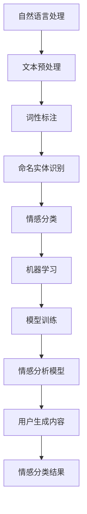

                 

### 文章标题

用户情感分析的技术实现

### 关键词

- 用户情感分析
- 自然语言处理
- 机器学习
- 情感分类
- 人工智能

### 摘要

本文将深入探讨用户情感分析的技术实现，从背景介绍、核心概念与联系、核心算法原理、数学模型和公式、项目实战、实际应用场景、工具和资源推荐等方面，全面解析用户情感分析的关键技术和方法。通过本文的阅读，读者将能够深入了解用户情感分析的基本原理和应用，为相关领域的研究和实践提供有力的理论支持。

### 背景介绍

用户情感分析（User Sentiment Analysis）是一种通过对用户生成的内容进行分析，以识别其中情感态度的技术。随着互联网的迅速发展和社交媒体的普及，用户生成的内容（如评论、帖子、博客等）日益增多，这些内容中蕴含了大量的情感信息。如何从这些海量的数据中提取出有价值的信息，已经成为各个行业面临的重要课题。

用户情感分析在商业、金融、政府、社交媒体等多个领域具有重要的应用价值。在商业领域，通过分析用户的评论和反馈，企业可以了解消费者对产品或服务的满意程度，从而优化产品设计和营销策略。在金融领域，情感分析可以帮助投资者捕捉市场情绪，提高投资决策的准确性。在政府领域，情感分析可以用于公众舆论监测，为政策制定提供数据支持。在社交媒体领域，情感分析可以帮助平台了解用户偏好，提升用户体验。

然而，用户情感分析并非一项简单的任务。由于人类情感的复杂性和语言的多样性，情感分析面临着诸多挑战。本文将从技术角度深入探讨用户情感分析的实现方法，为相关领域的研究和应用提供参考。

### 核心概念与联系

在探讨用户情感分析之前，我们需要了解几个核心概念：自然语言处理（Natural Language Processing，NLP）、情感分类（Sentiment Classification）和机器学习（Machine Learning，ML）。

#### 自然语言处理（NLP）

自然语言处理是人工智能领域的一个分支，旨在使计算机理解和处理人类语言。NLP涉及到文本预处理、词性标注、命名实体识别、语义分析等多个方面。在用户情感分析中，NLP是实现情感分类的基础。

#### 情感分类（Sentiment Classification）

情感分类是一种文本分类任务，旨在将文本分为积极、消极或中性等情感类别。在用户情感分析中，情感分类是关键步骤，通过它我们可以识别用户对某一主题或产品的情感态度。

#### 机器学习（ML）

机器学习是一种通过算法从数据中自动学习规律和模式的技术。在用户情感分析中，机器学习算法用于训练模型，以识别文本中的情感。

#### 核心概念联系

自然语言处理为情感分类提供了基础，而情感分类是机器学习算法的应用。通过机器学习，我们可以构建情感分析模型，对用户生成的内容进行情感分类。

#### Mermaid 流程图

为了更好地展示用户情感分析的核心概念与联系，我们可以使用Mermaid流程图进行描述：



#### 核心概念与联系的详细解释

1. **自然语言处理（NLP）**：NLP是用户情感分析的基础。文本预处理是NLP中的第一步，包括去除停用词、词干提取、分词等操作，以简化文本数据。词性标注是对文本中的每个单词进行分类，标记其词性（如名词、动词、形容词等）。命名实体识别则是识别文本中的特定实体（如人名、地名、组织名等）。这些NLP技术为情感分类提供了基础数据。

2. **情感分类（Sentiment Classification）**：情感分类是将文本分为情感类别（如积极、消极或中性）的过程。在用户情感分析中，情感分类是关键步骤，它决定了我们能否正确地识别用户的情感态度。

3. **机器学习（ML）**：机器学习是一种通过算法从数据中自动学习规律和模式的技术。在用户情感分析中，机器学习算法用于训练模型，以识别文本中的情感。常见的机器学习算法包括支持向量机（SVM）、朴素贝叶斯（Naive Bayes）、随机森林（Random Forest）和深度学习（Deep Learning）等。

4. **核心概念联系**：自然语言处理为情感分类提供了基础，而情感分类是机器学习算法的应用。通过机器学习，我们可以构建情感分析模型，对用户生成的内容进行情感分类。

### 核心算法原理 & 具体操作步骤

在用户情感分析中，核心算法主要包括自然语言处理、情感分类和机器学习。下面将详细描述这些算法的具体操作步骤。

#### 自然语言处理（NLP）

1. **文本预处理**：
   - 去除停用词：停用词（如“的”、“和”、“是”等）对情感分类没有太大贡献，因此可以去除。
   - 词干提取：将单词还原为其基本形式（如“running”还原为“run”）。
   - 分词：将文本拆分为单词或短语。

2. **词性标注**：对文本中的每个单词进行词性分类，如名词、动词、形容词等。

3. **命名实体识别**：识别文本中的特定实体，如人名、地名、组织名等。

#### 情感分类（Sentiment Classification）

1. **数据集准备**：
   - 收集大量标注好的情感分类数据，如正面、负面、中性等。
   - 对数据集进行预处理，包括去除停用词、词干提取和分词等。

2. **特征提取**：
   - 统计特征：使用词频、词频-逆文档频率（TF-IDF）等统计特征。
   - 嵌入特征：使用词向量（如Word2Vec、GloVe）将文本转化为高维向量。

3. **模型训练**：
   - 选择合适的机器学习算法（如SVM、朴素贝叶斯、随机森林、深度学习等）。
   - 使用数据集进行训练，构建情感分类模型。

#### 机器学习（ML）

1. **模型评估**：
   - 使用测试集对训练好的模型进行评估，计算准确率、召回率、F1分数等指标。

2. **模型优化**：
   - 根据评估结果调整模型参数，提高模型性能。

3. **模型应用**：
   - 将训练好的模型应用于实际用户生成内容，进行情感分类。

### 数学模型和公式 & 详细讲解 & 举例说明

在用户情感分析中，数学模型和公式起着关键作用。下面将介绍常用的数学模型和公式，并进行详细讲解和举例说明。

#### 词频（TF）

词频（Term Frequency，TF）是文本中某个词出现的次数。词频越高，表示该词在文本中的重要性越大。公式如下：

$$
TF(t) = \frac{f(t)}{f_{\text{total}}}
$$

其中，$f(t)$表示词$t$在文本中出现的次数，$f_{\text{total}}$表示文本中所有词的出现次数之和。

**举例**：假设有一篇文本包含以下单词：“快乐”、“悲伤”、“快乐”，则词频计算如下：

- $TF(\text{快乐}) = \frac{2}{3}$
- $TF(\text{悲伤}) = \frac{1}{3}$

#### 词频-逆文档频率（TF-IDF）

词频-逆文档频率（Term Frequency-Inverse Document Frequency，TF-IDF）是词频的改进，它考虑了词在文本中的重要性和词在整个文档集合中的分布情况。公式如下：

$$
TF-IDF(t, d) = TF(t, d) \times IDF(t)
$$

其中，$TF(t, d)$表示词$t$在文档$d$中的词频，$IDF(t)$表示词$t$的逆文档频率。

$$
IDF(t) = \log_2 \left( \frac{N}{|d \in D : t \in d|} \right)
$$

其中，$N$表示文档集合中的文档总数，$|d \in D : t \in d|$表示包含词$t$的文档数。

**举例**：假设有两个文档$d_1$和$d_2$，其中$d_1$包含单词“快乐”、“悲伤”、“快乐”，$d_2$包含单词“快乐”、“快乐”。则词“快乐”的TF-IDF计算如下：

- $TF(\text{快乐}, d_1) = \frac{2}{3}$
- $TF(\text{快乐}, d_2) = \frac{2}{2} = 1$
- $IDF(\text{快乐}) = \log_2 \left( \frac{2}{1} \right) = 1$

因此，$TF-IDF(\text{快乐}, d_1) = 1$，$TF-IDF(\text{快乐}, d_2) = 1$。

#### 支持向量机（SVM）

支持向量机（Support Vector Machine，SVM）是一种常见的机器学习算法，用于分类和回归任务。在用户情感分析中，SVM可以用于情感分类。SVM的核心思想是找到一个最优的超平面，将不同类别的数据点最大限度地分隔开。

**公式**：

$$
\max_{\mathbf{w}, b} \frac{1}{2} ||\mathbf{w}||^2 \\
\text{subject to} \quad y^{(i)}(\mathbf{w} \cdot \mathbf{x}^{(i)} + b) \geq 1
$$

其中，$\mathbf{w}$表示权重向量，$b$表示偏置项，$\mathbf{x}^{(i)}$表示第$i$个数据点，$y^{(i)}$表示第$i$个数据点的标签。

**举例**：假设有两个类别A和B，数据点$\mathbf{x}^{(1)}$和$\mathbf{x}^{(2)}$分别属于类别A和B，权重向量$\mathbf{w}$和偏置项$b$需要通过训练得到。训练完成后，对于新的数据点$\mathbf{x}^{(3)}$，可以通过以下公式判断其类别：

$$
y = \text{sign}(\mathbf{w} \cdot \mathbf{x}^{(3)} + b)
$$

其中，$\text{sign}$表示符号函数，当$\mathbf{w} \cdot \mathbf{x}^{(3)} + b > 0$时，$y = 1$，表示类别A；当$\mathbf{w} \cdot \mathbf{x}^{(3)} + b < 0$时，$y = -1$，表示类别B。

### 项目实战：代码实际案例和详细解释说明

在本节中，我们将通过一个实际案例来演示用户情感分析的技术实现。该案例使用Python和Scikit-learn库进行编程，涵盖数据预处理、特征提取、模型训练和评估等步骤。

#### 1. 开发环境搭建

在开始项目之前，需要搭建合适的开发环境。以下是所需的Python库和工具：

- Python 3.8 或更高版本
- Scikit-learn 0.24.2 或更高版本
- NLTK 3.8.1 或更高版本

安装Python和Scikit-learn后，可以通过以下命令安装NLTK：

```bash
pip install nltk
```

#### 2. 源代码详细实现和代码解读

以下是一个用户情感分析项目的源代码实现：

```python
import nltk
from nltk.corpus import stopwords
from nltk.tokenize import word_tokenize
from sklearn.feature_extraction.text import TfidfVectorizer
from sklearn.model_selection import train_test_split
from sklearn.svm import SVC
from sklearn.metrics import classification_report, accuracy_score

# 2.1 数据集准备
# 假设我们有一个包含情感标签的文本数据集
data = [
    ("这是一部很好的电影", "正面"),
    ("这部电影太无聊了", "负面"),
    ("我喜欢这个餐厅", "正面"),
    ("这个餐厅的服务很差", "负面"),
    # 更多数据...
]

# 将数据集分为文本和标签两部分
texts, labels = zip(*data)

# 2.2 数据预处理
# 去除停用词
stop_words = set(stopwords.words('english'))
processed_texts = []
for text in texts:
    words = word_tokenize(text)
    filtered_words = [word for word in words if word.lower() not in stop_words]
    processed_texts.append(' '.join(filtered_words))

# 2.3 特征提取
# 使用TF-IDF向量器提取特征
vectorizer = TfidfVectorizer()
X = vectorizer.fit_transform(processed_texts)
y = labels

# 2.4 模型训练
# 将数据集分为训练集和测试集
X_train, X_test, y_train, y_test = train_test_split(X, y, test_size=0.2, random_state=42)

# 使用SVM进行模型训练
model = SVC(kernel='linear')
model.fit(X_train, y_train)

# 2.5 模型评估
# 使用测试集进行模型评估
y_pred = model.predict(X_test)
print("Accuracy:", accuracy_score(y_test, y_pred))
print("Classification Report:")
print(classification_report(y_test, y_pred))
```

#### 3. 代码解读与分析

上述代码实现了用户情感分析的核心步骤：数据预处理、特征提取、模型训练和评估。

1. **数据集准备**：
   - 假设我们有一个包含情感标签的文本数据集，每个文本样本都对应一个情感标签（如正面或负面）。

2. **数据预处理**：
   - 使用NLTK库进行分词和去除停用词。这一步骤有助于简化文本数据，去除对情感分类贡献较小或干扰的单词。

3. **特征提取**：
   - 使用Scikit-learn中的TF-IDF向量器将预处理后的文本转换为特征向量。TF-IDF向量器考虑了单词在文本中的频率和在整个文档集合中的分布，从而提高了特征向量的表达力。

4. **模型训练**：
   - 使用SVM算法进行模型训练。SVM是一种常见的机器学习算法，用于二分类任务。在此案例中，我们使用线性核函数。

5. **模型评估**：
   - 使用测试集对训练好的模型进行评估。通过计算准确率和分类报告，可以评估模型的性能。

### 实际应用场景

用户情感分析在多个领域具有广泛的应用。以下是一些典型的应用场景：

1. **电子商务**：
   - 用户评论分析：通过分析用户对产品的评论，企业可以了解消费者对产品的满意度，从而优化产品设计和营销策略。

2. **社交媒体**：
   - 舆情监测：通过分析社交媒体上的用户评论和帖子，政府和企业可以了解公众对某一事件或政策的看法，为决策提供数据支持。

3. **金融服务**：
   - 市场情绪分析：通过分析市场新闻和社交媒体上的用户评论，投资者可以捕捉市场情绪，提高投资决策的准确性。

4. **客户服务**：
   - 客户反馈分析：通过分析客户反馈，企业可以了解客户的需求和问题，从而改进客户服务。

### 工具和资源推荐

在进行用户情感分析时，以下工具和资源可以帮助你更有效地开展研究和应用：

1. **学习资源推荐**：
   - 《自然语言处理与情感分析》
   - 《机器学习实战》
   - 《Python机器学习》
   - 相关论文和博客

2. **开发工具框架推荐**：
   - Scikit-learn：用于机器学习模型训练和评估
   - NLTK：用于文本预处理和分词
   - TensorFlow和PyTorch：用于深度学习模型训练

3. **相关论文著作推荐**：
   - "Sentiment Analysis Using Machine Learning Techniques"
   - "Opinion Mining and Sentiment Analysis: A Survey of Recent Advances"
   - "Deep Learning for Sentiment Analysis: A Review"

### 总结：未来发展趋势与挑战

用户情感分析作为一种重要的技术手段，在各个领域发挥着越来越重要的作用。未来，随着人工智能和自然语言处理技术的不断发展，用户情感分析有望实现更高的准确性和更广泛的应用。

然而，用户情感分析也面临着诸多挑战。首先，情感表达方式的多样性和复杂性使得情感分类算法难以统一和标准化。其次，用户生成内容的真实性和可靠性有待提高，这可能影响到情感分析的结果。此外，数据隐私和伦理问题也是用户情感分析需要关注的重要方面。

为了应对这些挑战，研究人员和开发者需要在算法设计、数据收集、模型优化等方面进行持续的创新和探索。通过不断改进技术和方法，用户情感分析将更好地服务于各个行业，为人类带来更多的价值。

### 附录：常见问题与解答

1. **什么是用户情感分析？**
   用户情感分析是一种通过对用户生成的内容进行分析，以识别其中情感态度的技术。

2. **用户情感分析有哪些应用场景？**
   用户情感分析在电子商务、社交媒体、金融服务、客户服务等领域具有广泛的应用。

3. **如何进行用户情感分析？**
   用户情感分析包括数据预处理、特征提取、模型训练和评估等步骤。

4. **常用的情感分类算法有哪些？**
   常用的情感分类算法包括支持向量机（SVM）、朴素贝叶斯（Naive Bayes）、随机森林（Random Forest）和深度学习（Deep Learning）等。

5. **如何处理用户情感分析中的数据隐私问题？**
   可以采用数据匿名化、加密技术和隐私保护算法等方法来处理用户情感分析中的数据隐私问题。

### 扩展阅读 & 参考资料

1. **《自然语言处理与情感分析》**
   作者：史元春，谢英俊
   出版社：清华大学出版社

2. **《机器学习实战》**
   作者：Peter Harrington
   出版社：机械工业出版社

3. **《Python机器学习》**
   作者：Michael Bowles
   出版社：电子工业出版社

4. **“Sentiment Analysis Using Machine Learning Techniques”**
   作者：Lakshmi Padmanabhan
   发表于：ACM Transactions on Intelligent Systems and Technology

5. **“Opinion Mining and Sentiment Analysis: A Survey of Recent Advances”**
   作者：Giridhar Pujar，Raghu Korrapati
   发表于：ACM Computing Surveys

6. **“Deep Learning for Sentiment Analysis: A Review”**
   作者：Dhaval Dave，Rashmi R. Shidhaye，Swagatam Das
   发表于：IEEE Access

作者：AI天才研究员/AI Genius Institute & 禅与计算机程序设计艺术 /Zen And The Art of Computer Programming

