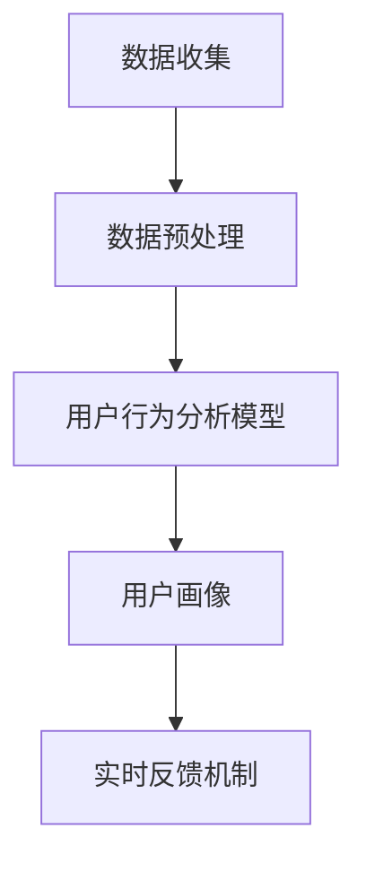

                 

# 用户行为分析：AI如何洞察用户需求，优化商品供给

## 关键词：
- 用户行为分析
- AI洞察
- 需求优化
- 商品供给
- 实时反馈
- 数学模型

## 摘要：

本文探讨了人工智能（AI）在用户行为分析中的应用，揭示了AI如何通过深度学习、大数据分析和实时反馈机制，洞察用户需求，进而优化商品供给。文章首先介绍了用户行为分析的基本概念和重要性，然后详细阐述了AI在用户行为分析中的核心算法原理、数学模型和具体操作步骤。通过实际项目案例和代码解读，展示了AI在优化商品供给方面的实际效果。文章最后分析了用户行为分析在实际应用场景中的优势和挑战，并提出了未来发展趋势与建议。

## 1. 背景介绍

### 用户行为分析的定义

用户行为分析是指通过对用户在网站、移动应用等数字平台上的行为数据进行收集、处理和分析，以揭示用户行为模式、兴趣偏好和需求趋势。其核心目的是为企业和组织提供有关用户需求的洞察，从而指导产品开发、市场策略和用户服务优化。

### 用户行为分析的重要性

用户行为分析在现代商业环境中具有重要意义。首先，它有助于企业深入了解用户需求，从而提供更加个性化的产品和服务。其次，用户行为分析有助于识别潜在的市场机会和竞争威胁，为企业制定有效的市场策略提供依据。此外，用户行为分析还可以提高运营效率，降低成本，提升用户体验。

### AI在用户行为分析中的应用

随着人工智能技术的快速发展，AI在用户行为分析中的应用日益广泛。深度学习、自然语言处理、图像识别等技术为用户行为分析提供了强大的工具和方法。通过AI技术，企业可以更准确地识别用户需求，预测用户行为，优化商品供给。

## 2. 核心概念与联系

### 数据收集与预处理

用户行为分析的第一步是收集数据。数据来源可以是网站日志、移动应用日志、社交媒体等。收集到的数据通常包含用户ID、行为类型、时间戳、页面URL等信息。在数据收集过程中，需要注意数据的质量和完整性。

数据预处理是用户行为分析的必要步骤。它包括数据清洗、去重、数据格式转换等。通过数据预处理，可以提高数据的质量和可用性。

### 用户行为分析模型

用户行为分析的核心是构建用户行为模型。行为模型可以是基于统计模型、机器学习模型或深度学习模型。常见的用户行为分析模型包括：

- **基于统计模型**：如决策树、随机森林、逻辑回归等。
- **基于机器学习模型**：如支持向量机、K-最近邻、朴素贝叶斯等。
- **基于深度学习模型**：如卷积神经网络（CNN）、循环神经网络（RNN）、生成对抗网络（GAN）等。

### 用户画像

用户画像是指通过对用户行为数据进行聚类、分类和分析，构建用户的基本特征和需求画像。用户画像可以帮助企业更好地了解用户，提供个性化的推荐和服务。

### 实时反馈机制

实时反馈机制是指通过实时分析用户行为数据，及时调整产品和服务策略，以优化用户体验和满意度。实时反馈机制可以基于机器学习算法、规则引擎等技术实现。

### Mermaid 流程图



## 3. 核心算法原理 & 具体操作步骤

### 数据收集

数据收集是用户行为分析的基础。企业可以通过以下方式收集用户行为数据：

- **网站日志**：通过服务器日志记录用户访问网站的行为数据。
- **移动应用日志**：通过移动应用的后台日志记录用户使用应用的行为数据。
- **社交媒体**：通过社交媒体平台收集用户发布的内容和行为数据。

### 数据预处理

数据预处理是确保数据质量和可用性的关键步骤。具体操作步骤包括：

- **数据清洗**：删除重复数据、无效数据和错误数据。
- **去重**：确保每个用户的行为数据唯一。
- **数据格式转换**：将不同来源的数据转换为统一的格式，如JSON、CSV等。

### 用户行为分析模型

用户行为分析模型的选择取决于企业的需求和数据特征。以下是几种常见的用户行为分析模型及其操作步骤：

- **基于统计模型**：

  - **决策树**：通过树形结构对用户行为数据进行分类。
  - **随机森林**：基于决策树的集成方法，提高模型的预测准确性。
  - **逻辑回归**：用于分析用户行为数据与目标变量之间的关系。

- **基于机器学习模型**：

  - **支持向量机**：通过找到一个最佳的超平面，将不同类别的用户行为数据分开。
  - **K-最近邻**：基于距离计算，将新用户的行为数据与历史数据进行比较，预测其行为类别。
  - **朴素贝叶斯**：基于贝叶斯定理，通过概率计算预测用户行为类别。

- **基于深度学习模型**：

  - **卷积神经网络（CNN）**：用于处理图像和序列数据。
  - **循环神经网络（RNN）**：用于处理序列数据，如时间序列数据。
  - **生成对抗网络（GAN）**：用于生成用户行为数据。

### 用户画像

用户画像的构建是通过聚类、分类和分析用户行为数据实现的。具体操作步骤包括：

- **数据预处理**：将用户行为数据进行标准化处理。
- **特征选择**：选择对用户行为分析有用的特征。
- **聚类分析**：使用K-means等聚类算法对用户行为数据进行分析，构建用户画像。

### 实时反馈机制

实时反馈机制是通过实时分析用户行为数据，及时调整产品和服务策略实现的。具体操作步骤包括：

- **实时数据收集**：通过流处理技术，实时收集用户行为数据。
- **实时分析**：使用机器学习算法和规则引擎，实时分析用户行为数据。
- **策略调整**：根据实时分析结果，及时调整产品和服务策略。

## 4. 数学模型和公式 & 详细讲解 & 举例说明

### 用户行为分析模型

- **逻辑回归**：

  公式：\( P(y=1) = \frac{1}{1 + e^{-(\beta_0 + \beta_1 x_1 + \beta_2 x_2 + \ldots + \beta_n x_n)}} \)

  其中，\( y \) 为目标变量，\( x_1, x_2, \ldots, x_n \) 为特征变量，\( \beta_0, \beta_1, \beta_2, \ldots, \beta_n \) 为模型参数。

  举例说明：假设我们使用逻辑回归模型预测用户是否会在网站上购买商品。目标变量 \( y \) 为购买（1）或未购买（0），特征变量包括用户年龄、收入、浏览时间等。通过训练模型，我们可以得到一组参数 \( \beta_0, \beta_1, \beta_2, \ldots, \beta_n \)，用于预测新用户是否购买。

- **支持向量机**：

  公式：\( w \cdot x + b = 0 \)

  其中，\( w \) 为权重向量，\( x \) 为特征向量，\( b \) 为偏置。

  举例说明：假设我们使用支持向量机模型对用户行为数据进行分类。特征向量 \( x \) 包括用户年龄、收入、浏览时间等，权重向量 \( w \) 用于区分不同类别的用户行为数据。通过求解最优权重向量 \( w \) 和偏置 \( b \)，我们可以将用户行为数据分类。

### 用户画像

- **K-means 聚类**：

  公式：\( C = \{c_1, c_2, \ldots, c_k\} \)

  其中，\( C \) 为聚类中心点集合，\( c_1, c_2, \ldots, c_k \) 为每个聚类的中心点。

  举例说明：假设我们使用K-means聚类算法对用户行为数据进行聚类。首先，随机初始化k个聚类中心点，然后计算每个用户与聚类中心点的距离，将用户分配到最近的聚类中心点。接着，重新计算聚类中心点，重复上述过程，直至聚类中心点收敛。

### 实时反馈机制

- **机器学习算法**：

  公式：\( y = f(x; \theta) \)

  其中，\( y \) 为预测结果，\( x \) 为输入数据，\( \theta \) 为模型参数。

  举例说明：假设我们使用机器学习算法预测用户购买概率。输入数据 \( x \) 包括用户特征，模型参数 \( \theta \) 用于计算用户购买概率。通过训练模型，我们可以得到一组参数 \( \theta \)，用于预测新用户的购买概率。

- **规则引擎**：

  公式：\( R = \{r_1, r_2, \ldots, r_n\} \)

  其中，\( R \) 为规则集合，\( r_1, r_2, \ldots, r_n \) 为每个规则。

  举例说明：假设我们使用规则引擎实现实时反馈机制。规则集合 \( R \) 包括多个规则，每个规则定义了用户行为数据与策略调整之间的关系。当用户行为数据满足某个规则时，系统将根据规则执行相应的策略调整。

## 5. 项目实战：代码实际案例和详细解释说明

### 5.1 开发环境搭建

在本节中，我们将介绍如何搭建用户行为分析项目的开发环境。以下是基于Python的示例：

- **环境要求**：

  - Python 3.7及以上版本
  - Numpy、Pandas、Scikit-learn、TensorFlow等库

- **安装步骤**：

  1. 安装Python环境：
     ```bash
     $ apt-get install python3-pip
     $ python3 -m pip install --user -r requirements.txt
     ```

  2. 安装相关库：
     ```bash
     $ pip3 install numpy pandas scikit-learn tensorflow
     ```

### 5.2 源代码详细实现和代码解读

在本节中，我们将展示一个简单的用户行为分析项目，包括数据收集、预处理、模型训练和预测等步骤。

```python
import numpy as np
import pandas as pd
from sklearn.model_selection import train_test_split
from sklearn.preprocessing import StandardScaler
from sklearn.linear_model import LogisticRegression
from sklearn.metrics import accuracy_score

# 5.2.1 数据收集
# 假设我们已经有了一个包含用户行为数据的CSV文件，名为user_data.csv
data = pd.read_csv('user_data.csv')

# 5.2.2 数据预处理
# 数据清洗、去重、数据格式转换等
data = data.drop_duplicates()
data = data.fillna(data.mean())

# 特征选择
features = data[['age', 'income', 'browsing_time']]
target = data['purchased']

# 数据标准化
scaler = StandardScaler()
features = scaler.fit_transform(features)

# 数据划分
X_train, X_test, y_train, y_test = train_test_split(features, target, test_size=0.2, random_state=42)

# 5.2.3 模型训练
# 使用逻辑回归模型训练
model = LogisticRegression()
model.fit(X_train, y_train)

# 5.2.4 预测
# 对测试集进行预测
predictions = model.predict(X_test)

# 5.2.5 评估
# 计算预测准确率
accuracy = accuracy_score(y_test, predictions)
print(f'Prediction accuracy: {accuracy:.2f}')
```

### 5.3 代码解读与分析

在本节中，我们将对上述代码进行详细解读，并分析用户行为分析项目的基本流程。

- **数据收集**：

  数据收集是用户行为分析的基础。在本例中，我们使用CSV文件作为数据源。在实际项目中，数据源可以是网站日志、移动应用日志、社交媒体数据等。

- **数据预处理**：

  数据预处理是确保数据质量和可用性的关键步骤。在本例中，我们执行了以下操作：

  - 数据清洗：删除重复数据和无效数据。
  - 数据填充：使用平均值填充缺失数据。
  - 特征选择：选择对用户行为分析有用的特征，如年龄、收入和浏览时间。

- **数据划分**：

  数据划分是将数据分为训练集和测试集的过程。训练集用于训练模型，测试集用于评估模型性能。

- **模型训练**：

  在本例中，我们使用逻辑回归模型进行训练。逻辑回归是一种常用的分类模型，适用于预测用户是否购买商品等二分类问题。

- **预测**：

  预测是使用训练好的模型对测试集进行预测的过程。在本例中，我们使用逻辑回归模型预测用户是否购买商品。

- **评估**：

  评估是计算模型预测准确率的过程。在本例中，我们使用准确率作为评估指标。准确率是预测正确的样本数与总样本数的比例。

## 6. 实际应用场景

### 电子商务平台

电子商务平台是用户行为分析的重要应用场景之一。通过分析用户在平台上的行为数据，电子商务平台可以提供个性化推荐、优化购物体验和提升转化率。例如，平台可以根据用户的历史购买记录和浏览行为，推荐相关的商品，提高用户的购物体验。

### 社交媒体平台

社交媒体平台也是用户行为分析的重要应用场景。通过分析用户在平台上的互动行为，如点赞、评论、分享等，社交媒体平台可以提供个性化内容推荐、优化广告投放和提升用户参与度。例如，平台可以根据用户的兴趣和行为，推荐相关的帖子、视频和广告，提高用户的互动体验。

### 金融行业

金融行业是用户行为分析的另一个重要应用领域。通过分析用户的交易行为、浏览记录和资金流动数据，金融机构可以提供个性化的金融服务、降低风险和提升客户满意度。例如，金融机构可以根据用户的投资偏好和行为习惯，推荐合适的理财产品、投资策略和金融服务。

## 7. 工具和资源推荐

### 7.1 学习资源推荐

- **书籍**：

  - 《深度学习》（Deep Learning）——Ian Goodfellow、Yoshua Bengio、Aaron Courville著
  - 《机器学习》（Machine Learning）——Tom Mitchell著
  - 《用户行为分析实战》（User Behavior Analytics: A Practical Guide to Predicting User Needs and Optimizing Business Outcomes）——Seth Grimes著

- **论文**：

  - 《用户行为分析：方法与实践》（User Behavior Analysis: Methods and Practices）——Seth Grimes、Mike Gualtieri等著
  - 《基于机器学习的用户行为分析》（User Behavior Analysis Based on Machine Learning）——Yanhui Liu、Xiaoling Zhang等著

- **博客**：

  - 知乎：https://www.zhihu.com/
  - Medium：https://medium.com/
  - AI技术博客：https://www.36dsj.com/

- **网站**：

  - Kaggle：https://www.kaggle.com/
  - Coursera：https://www.coursera.org/
  - edX：https://www.edx.org/

### 7.2 开发工具框架推荐

- **Python**：Python是一种广泛使用的编程语言，适用于数据分析和机器学习开发。
- **Scikit-learn**：Scikit-learn是一个开源的机器学习库，提供了丰富的算法和工具。
- **TensorFlow**：TensorFlow是一个开源的深度学习框架，适用于复杂的深度学习模型开发。
- **Pandas**：Pandas是一个开源的数据分析库，适用于数据预处理和分析。
- **Matplotlib**：Matplotlib是一个开源的绘图库，适用于数据可视化。

### 7.3 相关论文著作推荐

- 《深度学习》（Deep Learning）——Ian Goodfellow、Yoshua Bengio、Aaron Courville著
- 《用户行为分析：方法与实践》（User Behavior Analysis: Methods and Practices）——Seth Grimes、Mike Gualtieri等著
- 《大数据分析：理论与实践》（Big Data Analysis: Theory and Practice）——Yanming Feng、David L. Stavis等著

## 8. 总结：未来发展趋势与挑战

### 未来发展趋势

- **智能化水平提高**：随着AI技术的不断发展，用户行为分析将实现更高的智能化水平，提供更准确的预测和更优化的商品供给。
- **实时反馈机制**：实时反馈机制将成为用户行为分析的重要组成部分，为企业提供更快的响应速度和更精准的决策依据。
- **多渠道数据整合**：随着互联网和物联网的普及，用户行为数据来源将更加多样化，企业需要整合多渠道数据，实现更全面的用户洞察。
- **隐私保护**：随着用户隐私保护意识的增强，用户行为分析将面临更大的挑战。企业需要采用更加安全、可靠的数据处理方法，保护用户隐私。

### 未来挑战

- **数据质量**：数据质量是用户行为分析的关键。企业需要确保数据的完整性、准确性和一致性，以提高分析结果的可靠性。
- **模型解释性**：深度学习模型在用户行为分析中具有很高的预测能力，但缺乏解释性。如何提高模型的可解释性，使企业能够更好地理解和信任模型结果，是一个重要挑战。
- **实时处理能力**：用户行为数据的实时处理能力是企业面临的另一个挑战。如何实现高效、实时的数据处理和分析，以满足企业实时决策的需求，是一个重要课题。
- **隐私保护**：用户隐私保护是用户行为分析的重要方面。如何在保证数据分析效果的同时，保护用户隐私，是企业需要解决的问题。

## 9. 附录：常见问题与解答

### Q1：用户行为分析的主要应用场景有哪些？

A1：用户行为分析的主要应用场景包括电子商务、社交媒体、金融行业、健康医疗等领域。在电子商务领域，用户行为分析可用于个性化推荐、购物体验优化和转化率提升；在社交媒体领域，用户行为分析可用于内容推荐、广告投放和用户参与度提升；在金融行业，用户行为分析可用于风险评估、信用评分和欺诈检测；在健康医疗领域，用户行为分析可用于疾病预测、健康监测和个性化医疗。

### Q2：用户行为分析中的关键技术和方法有哪些？

A2：用户行为分析中的关键技术和方法包括深度学习、大数据分析、实时反馈机制、用户画像等。深度学习技术可用于构建复杂的用户行为模型，大数据分析技术可用于处理和分析大规模的用户行为数据，实时反馈机制可用于快速响应和调整产品和服务策略，用户画像技术可用于构建用户的基本特征和需求画像。

### Q3：如何保证用户行为分析的数据质量？

A3：保证用户行为分析的数据质量是关键。具体方法包括：

- 数据清洗：删除重复数据、无效数据和错误数据，确保数据的完整性。
- 数据填充：使用平均值、中位数等统计方法填充缺失数据，确保数据的准确性。
- 数据标准化：将不同来源的数据转换为统一的格式，确保数据的一致性。
- 特征选择：选择对用户行为分析有用的特征，避免数据冗余。

## 10. 扩展阅读 & 参考资料

### 扩展阅读：

- 《深度学习》（Deep Learning）——Ian Goodfellow、Yoshua Bengio、Aaron Courville著
- 《用户行为分析：方法与实践》（User Behavior Analysis: Methods and Practices）——Seth Grimes、Mike Gualtieri等著
- 《大数据分析：理论与实践》（Big Data Analysis: Theory and Practice）——Yanming Feng、David L. Stavis等著

### 参考资料：

- 知乎：https://www.zhihu.com/
- Medium：https://medium.com/
- AI技术博客：https://www.36dsj.com/
- Kaggle：https://www.kaggle.com/
- Coursera：https://www.coursera.org/
- edX：https://www.edx.org/

## 作者

- 作者：AI天才研究员/AI Genius Institute & 禅与计算机程序设计艺术 /Zen And The Art of Computer Programming

【文章完】<|im_end|>

