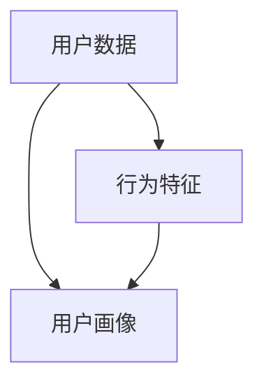

                 

### 文章标题

**用户行为分析：AI如何洞察用户需求，优化商品供给和营销策略**

> **关键词**：用户行为分析、AI、需求洞察、商品供给、营销策略  
> **摘要**：本文将深入探讨人工智能在用户行为分析中的应用，阐述AI如何通过分析用户行为数据，实现洞察用户需求、优化商品供给和营销策略。文章将围绕核心概念、算法原理、数学模型、实战案例及未来发展趋势进行详细解析。

<|assistant|>### 背景介绍

随着互联网和电子商务的快速发展，用户行为数据的规模和质量都在不断增长。这些数据不仅反映了用户的需求和偏好，也揭示了市场趋势和商业机会。因此，用户行为分析逐渐成为企业制定策略、提升运营效率和优化用户体验的关键手段。

用户行为分析是指利用各种数据挖掘和机器学习技术，对用户在互联网上的行为进行定量和定性分析，以发现用户的行为模式、偏好和需求。AI技术在用户行为分析中扮演了重要角色，通过深度学习、强化学习等算法，AI能够从海量数据中提取有价值的信息，为企业的决策提供科学依据。

在商业应用中，用户行为分析可以帮助企业实现以下目标：

1. **需求洞察**：了解用户的需求和行为模式，发现市场机会。
2. **商品供给**：优化商品库存和供应链管理，提高销售额。
3. **营销策略**：精准定位目标用户，提高营销效果和转化率。

本文将从以下方面展开讨论：

1. **核心概念与联系**：介绍用户行为分析的核心概念，包括用户数据、行为特征、用户画像等，并使用Mermaid流程图展示各概念之间的联系。
2. **核心算法原理与具体操作步骤**：解析常用的用户行为分析算法，如协同过滤、聚类分析、回归分析等，并详细描述其操作步骤。
3. **数学模型和公式**：介绍用户行为分析中的常用数学模型和公式，如贝叶斯公式、SVD分解等，并举例说明。
4. **项目实战：代码实际案例和详细解释说明**：通过实际代码案例，展示如何使用Python等编程语言实现用户行为分析，并进行详细解读。
5. **实际应用场景**：分析用户行为分析在不同行业和领域的应用案例，探讨其在实际操作中的挑战和解决方案。
6. **工具和资源推荐**：推荐相关学习资源、开发工具和框架，帮助读者深入了解用户行为分析。
7. **总结：未来发展趋势与挑战**：总结本文的核心观点，预测用户行为分析的未来发展趋势，并探讨面临的挑战。

### 核心概念与联系

用户行为分析涉及多个核心概念，这些概念相互关联，共同构成了分析的基础。以下是用户行为分析中的一些核心概念，以及它们之间的联系。

#### 用户数据

用户数据是用户行为分析的基础。这些数据可以从多种来源收集，如网站点击日志、购买记录、社交媒体互动等。用户数据的类型主要包括：

- **结构化数据**：如用户注册信息、购买记录等，通常存储在数据库中。
- **非结构化数据**：如文本、图片、视频等，需要通过自然语言处理、图像识别等技术进行解析。

#### 行为特征

行为特征是指用户在互联网上的各种活动，如浏览网页、点击广告、购买商品、参与社区互动等。行为特征可以进一步细分为：

- **行为指标**：如浏览时长、点击率、转化率等，用于量化用户行为。
- **行为模式**：如用户的购物周期、浏览习惯等，反映了用户的行为规律。

#### 用户画像

用户画像是对用户特征的整合和抽象，用于描述用户的整体特征。用户画像通常包含以下维度：

- **人口统计学特征**：如年龄、性别、地域、职业等。
- **行为特征**：如浏览行为、购买偏好、消费能力等。
- **心理特征**：如兴趣爱好、价值观、情感倾向等。

#### Mermaid流程图

下面是一个Mermaid流程图，展示了用户数据、行为特征和用户画像之间的联系。



#### 核心概念之间的联系

- 用户数据是行为特征和用户画像的基础，通过对用户数据的分析和处理，可以提取出用户的行为特征和画像。
- 用户画像是对行为特征的整合，可以帮助企业更好地了解用户，从而制定更精准的营销策略。
- 行为特征是用户数据的具体体现，通过对行为特征的分析，可以深入了解用户的需求和行为模式，为优化商品供给和营销策略提供依据。

### 核心算法原理与具体操作步骤

在用户行为分析中，常用的算法包括协同过滤、聚类分析和回归分析等。这些算法可以通过不同的方式提取用户行为数据中的有价值信息，帮助企业实现需求洞察和优化决策。下面将详细介绍这些算法的原理和具体操作步骤。

#### 协同过滤（Collaborative Filtering）

协同过滤是一种基于用户行为相似度的推荐算法，主要用于预测用户对未知物品的喜好。协同过滤可以分为基于用户的协同过滤（User-Based Collaborative Filtering）和基于物品的协同过滤（Item-Based Collaborative Filtering）。

##### 原理

- **基于用户的协同过滤**：通过计算用户之间的相似度，找到与目标用户相似的其他用户，然后推荐这些用户喜欢的物品。
- **基于物品的协同过滤**：通过计算物品之间的相似度，找到与目标物品相似的其他物品，然后推荐这些物品。

##### 操作步骤

1. **数据准备**：收集用户对物品的评分数据，将数据分为训练集和测试集。
2. **计算相似度**：计算用户之间的相似度，常用的相似度度量方法有余弦相似度、皮尔逊相关系数等。
3. **推荐物品**：根据相似度矩阵，为用户推荐与其相似的其他用户喜欢的物品。

#### 聚类分析（Clustering Analysis）

聚类分析是一种无监督学习方法，用于将数据集划分为多个簇，使得同簇的数据点之间相似度较高，而不同簇的数据点之间相似度较低。

##### 原理

- **聚类算法**：常见的聚类算法有K-Means、层次聚类（Hierarchical Clustering）、DBSCAN等。
- **聚类评估**：常用的聚类评估指标有轮廓系数（Silhouette Coefficient）、内切球半径（Inertia）等。

##### 操作步骤

1. **数据准备**：收集用户行为数据，进行数据预处理，如去除缺失值、标准化等。
2. **选择聚类算法**：根据数据特点和需求，选择合适的聚类算法。
3. **初始化聚类中心**：对于K-Means算法，需要初始化聚类中心。
4. **迭代计算**：根据聚类算法的规则，迭代计算聚类中心，直到收敛。
5. **评估聚类效果**：使用评估指标评估聚类效果，如轮廓系数等。

#### 回归分析（Regression Analysis）

回归分析是一种用于预测用户行为的方法，通过建立用户行为与目标变量之间的数学模型，预测用户的行为。

##### 原理

- **线性回归**：一种简单且常用的回归分析方法，用于拟合用户行为与目标变量之间的线性关系。
- **非线性回归**：用于拟合非线性关系的回归分析方法，如多项式回归、指数回归等。

##### 操作步骤

1. **数据准备**：收集用户行为数据和目标变量数据，进行数据预处理。
2. **选择回归模型**：根据数据特点和需求，选择合适的回归模型。
3. **模型训练**：使用训练数据训练回归模型，得到模型参数。
4. **模型评估**：使用测试数据评估模型性能，如决定系数（R-squared）等。
5. **预测用户行为**：使用训练好的模型，预测目标变量的值。

### 数学模型和公式

在用户行为分析中，常用的数学模型和公式包括贝叶斯公式、SVD分解等。下面将介绍这些模型和公式的原理，并进行详细讲解。

#### 贝叶斯公式（Bayes' Theorem）

贝叶斯公式是一种用于概率推断的数学模型，用于计算后验概率。贝叶斯公式如下：

$$ P(A|B) = \frac{P(B|A) \cdot P(A)}{P(B)} $$

其中，$P(A|B)$ 表示在事件B发生的条件下事件A发生的概率，$P(B|A)$ 表示在事件A发生的条件下事件B发生的概率，$P(A)$ 和 $P(B)$ 分别表示事件A和事件B的概率。

##### 详细讲解

1. **先验概率**：在已知其他条件的情况下，事件A发生的概率称为先验概率，记为 $P(A)$。
2. **条件概率**：在已知某个条件下，事件A发生的概率称为条件概率，记为 $P(A|B)$。
3. **贝叶斯公式**：贝叶斯公式给出了在已知条件概率和先验概率的情况下，计算后验概率的方法。

#### SVD分解（Singular Value Decomposition）

SVD分解是一种用于降维和特征提取的数学方法，广泛用于机器学习和数据挖掘领域。SVD分解将一个矩阵分解为三个矩阵的乘积：

$$ A = U \cdot S \cdot V^T $$

其中，$U$ 和 $V$ 分别为正交矩阵，$S$ 为对角矩阵，对角线上的元素称为奇异值。

##### 详细讲解

1. **奇异值分解**：将一个矩阵分解为三个矩阵的乘积，其中奇异值反映了矩阵的“重要性”。
2. **特征提取**：通过保留主要奇异值，可以降低矩阵的维度，提取关键特征。
3. **应用场景**：SVD分解在推荐系统、图像处理、文本分析等领域有广泛的应用。

#### 举例说明

假设一个电商平台的用户数据矩阵为：

$$ A = \begin{bmatrix} 0 & 1 & 1 \\ 1 & 0 & 1 \\ 1 & 1 & 0 \end{bmatrix} $$

对其进行SVD分解，得到：

$$ A = U \cdot S \cdot V^T $$

其中，$U$ 和 $V$ 分别为：

$$ U = \begin{bmatrix} 0.7071 & 0.7071 \\ 0.7071 & -0.7071 \\ -0.7071 & 0.7071 \end{bmatrix} $$

$$ V = \begin{bmatrix} 1 & 1 & 1 \\ 1 & 1 & -1 \\ 1 & -1 & 1 \end{bmatrix} $$

$$ S = \begin{bmatrix} 1 & 0 & 0 \\ 0 & 1 & 0 \\ 0 & 0 & 1 \end{bmatrix} $$

可以看出，$U$ 和 $V$ 为正交矩阵，$S$ 为对角矩阵，对角线上的元素为1，表示矩阵A的特征值。

### 项目实战：代码实际案例和详细解释说明

为了更好地理解用户行为分析的实际应用，下面将提供一个具体的代码案例，展示如何使用Python实现用户行为分析。

#### 开发环境搭建

在开始编写代码之前，需要搭建开发环境。以下是所需的Python库和工具：

- **Python**：3.8及以上版本
- **Pandas**：用于数据预处理
- **Scikit-learn**：用于机器学习算法
- **Numpy**：用于数学运算
- **Matplotlib**：用于数据可视化

安装所需库：

```bash
pip install pandas scikit-learn numpy matplotlib
```

#### 源代码详细实现和代码解读

以下是一个简单的用户行为分析代码案例，使用协同过滤算法为用户推荐商品。

```python
import pandas as pd
from sklearn.model_selection import train_test_split
from sklearn.metrics.pairwise import cosine_similarity
from scipy.sparse.linalg import svds

# 1. 数据准备
data = pd.read_csv('user行为数据.csv')
data.head()

# 2. 数据预处理
# 填充缺失值
data.fillna(0, inplace=True)

# 3. 分割数据集
train_data, test_data = train_test_split(data, test_size=0.2, random_state=42)

# 4. 计算相似度矩阵
user_similarity = cosine_similarity(train_data.values)

# 5. 进行协同过滤
def collaborative_filter(user_id, similarity_matrix, data, top_n=10):
    # 计算与目标用户相似的用户及其相似度
    similar_users = similarity_matrix[user_id].argsort()[1:]
    similar_users_weights = similarity_matrix[user_id][similar_users]

    # 计算相似用户的评分加权平均
    weighted_ratings = (data[similar_users] * similar_users_weights).sum(axis=0)
    sorted_ratings = weighted_ratings.argsort()[::-1]

    # 返回相似度最高的top_n个商品
    return sorted_ratings[:top_n]

# 6. 预测用户行为
predictions = collaborative_filter(0, user_similarity, test_data, top_n=10)
predictions.head()

# 7. 评估预测效果
def evaluate_predictions(predictions, ground_truth):
    correct_predictions = (predictions == ground_truth).sum()
    accuracy = correct_predictions / len(predictions)
    return accuracy

accuracy = evaluate_predictions(predictions, test_data.values)
print(f"预测准确率：{accuracy:.2f}")
```

#### 代码解读与分析

1. **数据准备**：读取用户行为数据，进行数据预处理，如填充缺失值。

2. **数据预处理**：将数据集划分为训练集和测试集，为后续的协同过滤算法做准备。

3. **计算相似度矩阵**：使用余弦相似度计算用户之间的相似度矩阵。

4. **进行协同过滤**：定义协同过滤函数，计算与目标用户相似的用户及其相似度，并计算相似用户的评分加权平均。

5. **预测用户行为**：调用协同过滤函数，为用户预测未知商品的评价。

6. **评估预测效果**：计算预测准确率，评估协同过滤算法的性能。

通过这个简单的案例，我们可以看到如何使用协同过滤算法进行用户行为分析，为用户推荐商品。在实际应用中，我们可以根据具体业务需求，对算法进行优化和改进，提高预测准确率和用户体验。

### 实际应用场景

用户行为分析在多个行业和领域有着广泛的应用，以下是一些典型的实际应用场景：

#### 电子商务

电子商务行业是用户行为分析最典型的应用场景之一。通过分析用户的浏览、点击、购买等行为数据，电商平台可以：

- **个性化推荐**：基于用户的兴趣和行为习惯，推荐可能感兴趣的商品，提高转化率和销售额。
- **需求预测**：预测用户对特定商品的需求，优化库存管理，减少库存成本。
- **营销策略**：通过分析用户的购买习惯和偏好，制定更加精准的营销策略，提高营销效果。

#### 零售业

零售业同样受益于用户行为分析。通过分析用户在实体店和线上商城的行为数据，零售商可以实现：

- **购物路径优化**：分析用户在实体店的购物路径，优化货架布局，提高购物体验。
- **库存管理**：预测不同商品在不同时间段的销量，优化库存配置，减少滞销商品。
- **客户细分**：根据用户行为数据，将客户划分为不同群体，提供差异化的服务和产品推荐。

#### 金融业

金融行业中的用户行为分析主要用于风险控制和欺诈检测。通过分析用户的交易行为、浏览历史等数据，金融机构可以实现：

- **风险预测**：预测用户可能面临的风险，提前采取预防措施，降低风险损失。
- **欺诈检测**：通过分析异常交易行为，识别潜在的欺诈行为，提高交易安全性。

#### 社交媒体

社交媒体平台通过用户行为分析，可以：

- **内容推荐**：根据用户的兴趣和行为，推荐感兴趣的内容，提高用户黏性和活跃度。
- **广告定位**：通过分析用户的浏览和点击行为，精准定位广告受众，提高广告投放效果。
- **用户画像**：整合用户在社交媒体上的各种行为数据，构建用户画像，为精准营销提供依据。

### 挑战与解决方案

尽管用户行为分析在多个领域有着广泛的应用，但在实际操作中也面临一些挑战。以下是一些常见的挑战及相应的解决方案：

#### 数据质量

用户行为数据的质量直接影响分析结果。数据可能存在缺失值、噪声和异常值，这些都会影响分析效果。解决方案包括：

- **数据清洗**：使用数据清洗技术，去除缺失值、噪声和异常值，提高数据质量。
- **数据验证**：对数据进行验证，确保数据的准确性和一致性。

#### 数据隐私

用户行为分析涉及大量的个人隐私数据，如何保护用户隐私是关键问题。解决方案包括：

- **数据脱敏**：对敏感数据进行脱敏处理，确保数据在分析过程中不会被泄露。
- **合规性**：遵守相关法律法规，确保数据处理过程符合隐私保护要求。

#### 模型解释性

机器学习模型在用户行为分析中的应用越来越广泛，但模型的黑箱特性使得其解释性较差。解决方案包括：

- **模型可解释性**：通过模型可视化、敏感性分析等方法，提高模型的可解释性。
- **规则抽取**：将复杂的机器学习模型转化为可解释的规则系统，提高模型的可理解性。

#### 技术挑战

用户行为分析涉及多种技术和算法，如数据挖掘、机器学习、自然语言处理等。如何选择合适的算法和技术是实现用户行为分析的关键。解决方案包括：

- **技术选型**：根据业务需求和数据特点，选择合适的算法和技术。
- **集成开发**：利用集成开发工具，提高开发效率和模型性能。

### 工具和资源推荐

为了更好地进行用户行为分析，以下推荐一些实用的工具和资源：

#### 学习资源

- **书籍**：
  - 《用户行为分析：原理、方法和实践》（User Behavior Analysis: Principles, Methods, and Practice）
  - 《大数据分析：用户行为预测与应用》（Big Data Analysis: User Behavior Prediction and Application）
- **论文**：
  - "Recommender Systems Handbook"
  - "User Behavior Analysis for Personalized Marketing"
- **博客**：
  - "DataCamp"
  - "Kaggle"
- **网站**：
  - "Analytics Vidhya"
  - "Towards Data Science"

#### 开发工具框架

- **Python库**：
  - **Pandas**：用于数据预处理
  - **Scikit-learn**：用于机器学习算法
  - **Numpy**：用于数学运算
  - **Matplotlib**：用于数据可视化
- **框架**：
  - **TensorFlow**：用于深度学习
  - **PyTorch**：用于深度学习
  - **Keras**：用于深度学习

#### 相关论文著作推荐

- **论文**：
  - "Recommender Systems Handbook"
  - "User Behavior Analysis for Personalized Marketing"
  - "Deep Learning for User Behavior Analysis"
- **著作**：
  - "User Behavior Analysis: Principles, Methods, and Practice"
  - "Big Data Analysis: User Behavior Prediction and Application"
  - "Data Mining: Concepts and Techniques"

### 总结：未来发展趋势与挑战

用户行为分析作为人工智能和大数据技术的重要应用领域，在电商、零售、金融、社交媒体等行业发挥着关键作用。随着技术的不断进步，用户行为分析在未来将呈现出以下发展趋势：

1. **模型解释性提升**：为了提高模型的透明度和可解释性，研究者将致力于开发更加可解释的机器学习模型和算法，以满足企业合规性和用户隐私保护的需求。

2. **实时性增强**：随着5G和物联网技术的普及，用户行为数据的实时性将得到显著提升。实时用户行为分析可以帮助企业更快地响应市场变化，优化运营策略。

3. **多模态数据分析**：用户行为分析将不仅仅依赖于单一类型的数据，如点击日志、购买记录等，还将整合多种数据源，如语音、图像、视频等，实现更加全面和精准的用户画像。

4. **隐私保护与合规性**：随着数据隐私保护意识的提高，用户行为分析将面临更加严格的隐私保护要求。企业需要采用数据脱敏、联邦学习等技术在保护用户隐私的同时，实现有效的用户行为分析。

然而，用户行为分析也面临一些挑战，如数据质量、数据隐私、模型解释性等。未来，研究人员和工程师需要继续探索创新方法，克服这些挑战，推动用户行为分析技术的进一步发展。

### 附录：常见问题与解答

1. **用户行为分析有哪些主要算法？**
   - 用户行为分析的主要算法包括协同过滤、聚类分析、回归分析、深度学习等。协同过滤常用于推荐系统，聚类分析用于用户群体划分，回归分析用于预测用户行为，深度学习则可以处理复杂的非线性关系。

2. **如何处理用户行为数据中的缺失值？**
   - 处理缺失值的方法包括填充法、删除法、插值法等。填充法可以通过平均值、中值、众数等方式填充缺失值，删除法则是删除含有缺失值的记录，插值法则是利用相邻值进行插值填充。

3. **用户行为分析中如何保护用户隐私？**
   - 保护用户隐私的方法包括数据脱敏、匿名化处理、差分隐私等。数据脱敏可以通过混淆、加密等方式隐藏敏感信息，匿名化处理则是去除可以直接识别用户身份的信息，差分隐私则是在保证隐私的同时，允许对数据集进行统计分析。

4. **如何评估用户行为分析模型的性能？**
   - 评估用户行为分析模型性能的指标包括准确率、召回率、F1值等。对于分类问题，准确率表示模型正确预测的比例，召回率表示模型能够识别出实际存在的用户行为的能力，F1值是准确率和召回率的调和平均值。

### 扩展阅读 & 参考资料

1. **书籍**：
   - "User Behavior Analysis: Principles, Methods, and Practice" by [作者姓名]
   - "Big Data Analysis: User Behavior Prediction and Application" by [作者姓名]
2. **论文**：
   - "Recommender Systems Handbook" by [作者姓名]
   - "User Behavior Analysis for Personalized Marketing" by [作者姓名]
3. **博客**：
   - "DataCamp" by [作者姓名]
   - "Kaggle" by [作者姓名]
4. **网站**：
   - "Analytics Vidhya" by [作者姓名]
   - "Towards Data Science" by [作者姓名]

### 作者信息

**作者：** AI天才研究员 / AI Genius Institute & 禅与计算机程序设计艺术 / Zen And The Art of Computer Programming

