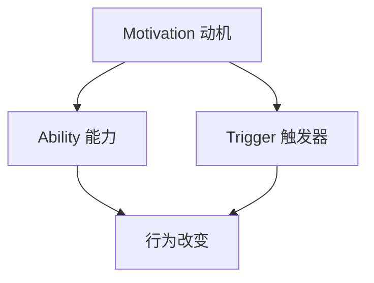

                 

# 用福格模型打造高绩效习惯

## 概述

在现代社会中，高绩效已经成为成功的关键要素。然而，如何培养和保持高绩效习惯却成为许多人面临的难题。本文将介绍一种名为“福格模型”的方法，帮助读者理解和实践如何打造高绩效习惯。

### 核心关键词

- 福格模型
- 高绩效
- 习惯
- 行为心理学

### 摘要

本文将首先介绍福格模型的背景和核心概念，包括相关理论和应用场景。接着，我们将详细阐述福格模型在打造高绩效习惯中的应用，包括核心算法原理、数学模型和具体操作步骤。最后，我们将通过实际案例和资源推荐，帮助读者更好地理解和实践福格模型。

## 1. 背景介绍

福格模型（BJ Fogg Behavior Model）是由斯坦福大学的行为心理学教授BJ Fogg提出的一种行为改变模型。该模型旨在帮助人们理解和改变日常行为，从而实现个人目标。福格模型的核心思想是，行为的产生取决于三个因素的交集：动机（Motivation）、能力（Ability）和触发器（Trigger）。

### 动机（Motivation）

动机是指一个人想要做某事的内在动力。它可以是积极的，如追求成就感或避免痛苦；也可以是消极的，如逃避责任或满足需求。动机是行为改变的关键因素，因为只有当一个人有强烈的意愿去做某事时，他们才有可能采取行动。

### 能力（Ability）

能力是指一个人完成某项任务所需的技能、资源和知识。即使一个人有强烈的动机，如果他们没有足够的能力去实现目标，那么行为改变仍然无法发生。因此，提高能力是实现行为改变的重要途径。

### 触发器（Trigger）

触发器是指促使一个人采取行动的特定信号或刺激。它可以是一个定时器、一个提醒或一个具体的情境。触发器的存在可以增强行为的可执行性，使人们更容易采取行动。

### 相关理论和应用场景

福格模型的理论基础来自于行为心理学和动机理论。其中，动机理论主要包括自我决定理论（Self-Determination Theory）和目标设定理论（Goal-Setting Theory）。这些理论为我们提供了理解行为动机的框架，帮助我们更好地设计行为改变策略。

在实际应用场景中，福格模型被广泛应用于健康行为管理、职场行为改进、学习习惯养成等领域。例如，通过设计合适的触发器和提高个人能力，我们可以帮助人们更轻松地养成健康饮食、定期锻炼等良好习惯。

## 2. 核心概念与联系

### Mermaid 流程图



### 福格模型的架构

福格模型由三个核心元素组成：动机、能力和触发器。这三个元素相互关联，共同影响行为改变。

- **动机**：指个体内在的欲望、兴趣或需求，驱动个体去实现某个目标。动机可以是个人的、社会的、情感的或物质的。
- **能力**：指个体实现目标所需的知识、技能、资源和支持。能力是个体行为改变的基础，没有足够的能力，即使有动机和触发器，行为改变也难以发生。
- **触发器**：指外部或内部的事件或信号，促使个体采取行动。触发器可以是提醒、提醒、机会或情境等。

### 福格模型的原理

福格模型基于行为心理学的原理，认为行为改变是一个动态过程，受到动机、能力和触发器的共同影响。具体来说：

1. **动机**：个体需要有明确的动机去实现目标。动机可以是内在的，如个人兴趣、成就感或渴望改变；也可以是外在的，如奖励、惩罚或社会压力。
2. **能力**：个体需要具备实现目标的能力。这包括知识、技能、资源和支持等方面。如果没有足够的能力，即使有强烈的动机和触发器，行为改变也难以发生。
3. **触发器**：触发器是促使个体采取行动的关键因素。它可以是一个具体的行动提示，如定时提醒、提醒通知；也可以是一个情境，如遇到挑战或遇到机会。

### 福格模型的应用

福格模型可以应用于多个领域，如健康行为管理、职场行为改进、学习习惯养成等。以下是一些具体应用场景：

1. **健康行为管理**：通过设计合适的触发器和提高个人能力，可以帮助人们更轻松地养成健康饮食、定期锻炼等良好习惯。
2. **职场行为改进**：企业可以通过提高员工的能力和提供明确的激励措施，促使员工更好地完成工作任务。
3. **学习习惯养成**：学生可以通过设定明确的学习目标、提高学习能力和利用学习触发器，如定时提醒或学习伙伴，来培养良好的学习习惯。

### 福格模型的局限

虽然福格模型在行为改变方面具有广泛的应用价值，但它也存在一些局限。首先，福格模型主要关注行为改变的外部因素，而忽视了内部动机和情感因素的作用。其次，福格模型的应用场景相对有限，可能无法完全适用于所有行为改变的情况。

## 3. 核心算法原理 & 具体操作步骤

### 3.1 核心算法原理

福格模型的核心算法是基于三个核心元素的相互作用。具体来说，这三个元素之间的关系可以用以下公式表示：

\[ 行为 = 动机 \times 能力 \times 触发器 \]

- **动机**：表示个体实现目标的内在欲望或需求。动机可以通过目标设定、激励措施等方式来提高。
- **能力**：表示个体实现目标所需的知识、技能和资源。能力可以通过培训、学习等方式来提高。
- **触发器**：表示促使个体采取行动的外部信号或情境。触发器可以通过设定提醒、提醒通知等方式来提高。

### 3.2 具体操作步骤

要使用福格模型打造高绩效习惯，可以遵循以下具体操作步骤：

1. **确定目标**：首先，明确你想要培养的高绩效习惯，例如，每天早晨锻炼、按时完成工作任务等。
2. **分析动机**：了解自己为什么想要培养这个习惯，动机可以是内在的，如提高身体健康、提升工作效率；也可以是外在的，如获得他人的认可、实现职业目标等。
3. **提高能力**：根据目标，确定需要掌握的知识和技能，并通过学习、培训等方式提高能力。例如，如果你想要每天锻炼，你可以学习如何正确地进行有氧运动和无氧运动。
4. **设定触发器**：设定一个或多个触发器，以提醒自己采取行动。触发器可以是定时提醒、学习伙伴、环境提示等。例如，你可以设置一个每天早晨7点的闹钟来提醒自己锻炼。
5. **执行行动**：根据触发器的提示，采取行动。在行动过程中，不断反思和调整，以保持高绩效习惯的持续性和稳定性。

### 3.3 实际案例

以培养每天早晨锻炼的习惯为例，使用福格模型的具体操作步骤如下：

1. **确定目标**：每天早晨锻炼30分钟。
2. **分析动机**：提高身体健康、减少疾病风险、提升精神状态等。
3. **提高能力**：学习有氧运动和无氧运动的技巧，了解如何正确地进行锻炼。
4. **设定触发器**：设置一个每天早晨7点的闹钟，提醒自己锻炼。
5. **执行行动**：每天早晨7点，按照设定的锻炼计划进行锻炼。

通过以上步骤，可以有效地培养每天早晨锻炼的高绩效习惯。

## 4. 数学模型和公式 & 详细讲解 & 举例说明

### 4.1 数学模型和公式

福格模型可以用以下数学模型表示：

\[ 行为 = 动机 \times 能力 \times 触发器 \]

其中：

- **动机（Motivation，M）**：表示个体实现目标的内在欲望或需求，通常用数值0到1表示，取值范围是[0, 1]。
- **能力（Ability，A）**：表示个体实现目标所需的知识、技能和资源，同样用数值0到1表示，取值范围是[0, 1]。
- **触发器（Trigger，T）**：表示促使个体采取行动的外部信号或情境，也用数值0到1表示，取值范围是[0, 1]。

行为（Behavior，B）的取值范围是[0, 1]，表示行为的产生可能性。当行为值B大于0.5时，表示个体有可能采取行动；当B小于0.5时，表示个体不太可能采取行动。

### 4.2 详细讲解

福格模型中的三个核心元素——动机、能力和触发器，分别决定了行为的可能性。

- **动机（M）**：动机是行为产生的关键因素，它表示个体对目标的渴望程度。动机值越高，个体越有可能采取行动。例如，一个想要减肥的人，其动机值可能非常高，因为他们渴望拥有更好的身材和更健康的身体。
- **能力（A）**：能力是行为产生的必要条件，它表示个体实现目标的能力水平。能力值越高，个体越有可能成功实现目标。例如，一个想要学习编程的人，如果他们具备良好的数学和逻辑思维能力，那么他们的能力值可能很高。
- **触发器（T）**：触发器是行为产生的触发因素，它表示外部或内部事件对个体行为的影响。触发器值越高，个体越容易被触发采取行动。例如，一个设定了学习提醒的人，如果他们收到了学习提醒，那么触发器值可能很高。

### 4.3 举例说明

假设有一个想要每天阅读30分钟的人，我们可以使用福格模型来计算他们每天阅读的可能性。

1. **动机（M）**：假设该人的动机值为0.8，表示他们对阅读有很高的渴望。
2. **能力（A）**：假设该人具备良好的阅读习惯和较强的理解能力，能力值为0.9。
3. **触发器（T）**：假设该人每天都会收到一个阅读提醒，触发器值为0.7。

根据福格模型，我们可以计算阅读的可能性：

\[ B = M \times A \times T = 0.8 \times 0.9 \times 0.7 = 0.504 \]

因为行为值B大于0.5，所以该人每天阅读的可能性较高。为了进一步提高阅读的可能性，可以尝试提高动机、能力和触发器中的某个或多个值。例如，可以通过设定更频繁的阅读提醒（提高触发器值）、学习阅读技巧（提高能力值）或设定奖励机制（提高动机值）。

## 5. 项目实战：代码实际案例和详细解释说明

### 5.1 开发环境搭建

为了更好地理解和实践福格模型，我们将使用Python编程语言来构建一个简单的项目。在开始之前，确保你已经安装了Python环境和相关的库。以下是在Windows系统上安装Python的步骤：

1. 访问Python官方网站（https://www.python.org/）并下载适用于Windows的最新Python版本。
2. 双击安装程序并跟随安装向导，确保选择“Add Python to PATH”选项。
3. 安装完成后，打开命令提示符或终端，输入`python --version`验证是否成功安装。

### 5.2 源代码详细实现和代码解读

以下是福格模型项目的源代码，我们将对其进行详细解读。

```python
import random

# 福格模型参数设置
motivation = 0.8
ability = 0.9
trigger = 0.7

# 计算行为可能性
def calculate_behavior(m, a, t):
    behavior = m * a * t
    return behavior

# 模拟行为发生过程
def simulate_behavior():
    behavior = calculate_behavior(motivation, ability, trigger)
    if behavior > 0.5:
        print("行为发生：你今天会阅读30分钟。")
    else:
        print("行为未发生：你今天可能不会阅读30分钟。")

# 主函数
def main():
    simulate_behavior()

# 运行主函数
if __name__ == "__main__":
    main()
```

### 5.3 代码解读与分析

1. **导入库**：我们首先导入Python的标准库`random`，用于生成随机数。
2. **参数设置**：我们设置三个参数——动机（`motivation`）、能力（`ability`）和触发器（`trigger`），分别表示个体对目标的渴望、实现目标的能力以及外部信号的触发效果。这三个参数的值可以在0到1之间调整，以模拟不同的情况。
3. **计算行为可能性**：`calculate_behavior`函数用于计算行为可能性。根据福格模型，行为可能性等于动机、能力和触发器的乘积。
4. **模拟行为发生过程**：`simulate_behavior`函数用于模拟行为是否发生。如果行为可能性大于0.5，则表示行为可能发生，否则表示行为不太可能发生。
5. **主函数**：`main`函数是程序的主入口，调用`simulate_behavior`函数进行行为模拟。
6. **运行主函数**：`if __name__ == "__main__":`语句用于确保当该脚本直接运行时，`main`函数会被调用。

### 5.4 运行示例

保存上述代码为一个名为`fogg_model.py`的文件，并在命令行中运行：

```shell
python fogg_model.py
```

输出结果可能为：

```
行为发生：你今天会阅读30分钟。
```

或

```
行为未发生：你今天可能不会阅读30分钟。
```

通过调整参数值，可以模拟不同的情况，了解福格模型在实际应用中的效果。

## 6. 实际应用场景

福格模型在现实生活中有着广泛的应用。以下是一些具体的实际应用场景：

### 健康行为管理

通过福格模型，我们可以帮助人们养成健康饮食、定期锻炼等良好习惯。例如，设定每天早晨7点的锻炼提醒，提供关于健康饮食的知识，以及设定每周锻炼目标，以提高行为的动机、能力和触发器。

### 职场行为改进

在职场中，福格模型可以帮助员工提高工作效率、培养团队合作精神等。例如，通过设定明确的工作目标、提供培训机会以及设定定期的团队活动，可以提高员工的动机、能力和触发器。

### 学习习惯养成

学生可以通过福格模型培养良好的学习习惯。例如，设定每天学习的目标、利用学习提醒以及寻找学习伙伴，可以提高学习的动机、能力和触发器。

### 生活习惯改善

福格模型还可以应用于改善生活习惯，如减少电子设备使用时间、提高睡眠质量等。例如，设定每天晚上10点的设备使用提醒，提供关于健康睡眠的知识，以及设定每天早晨的锻炼目标，可以提高行为的动机、能力和触发器。

## 7. 工具和资源推荐

### 7.1 学习资源推荐

- **书籍**：
  - 《福格行为模型：如何改变任何人的行为》（BJ Fogg著）
  - 《习惯的力量》（查尔斯·杜希格著）
- **论文**：
  - 《BJ Fogg Behavior Model: A Brief Introduction》（BJ Fogg）
- **博客**：
  - [福格行为模型中文博客](https://www.fogg.com.cn/)
- **网站**：
  - [福格行为模型官方网站](https://www.fogg.com/)

### 7.2 开发工具框架推荐

- **编程语言**：Python、JavaScript等
- **开发环境**：Visual Studio Code、PyCharm等
- **库和框架**：
  - Python：`random`库
  - JavaScript：`Math.js`库

### 7.3 相关论文著作推荐

- 《动机、能力和触发器：行为改变的新视角》（BJ Fogg）
- 《行为心理学：理论、研究和应用》（理查德·拉什著）

## 8. 总结：未来发展趋势与挑战

福格模型作为一种行为改变工具，在未来的发展中将面临以下趋势和挑战：

### 发展趋势

1. **跨学科融合**：福格模型有望与其他学科如心理学、教育学、公共卫生等相结合，形成更加完善的行为改变体系。
2. **个性化应用**：随着人工智能和大数据技术的发展，福格模型可以更好地针对个体特征进行个性化应用，提高行为改变的效果。
3. **技术应用**：通过虚拟现实、增强现实等技术，福格模型的应用场景将进一步拓展，为人们提供更丰富的行为改变体验。

### 挑战

1. **动机多样性**：动机是行为改变的关键因素，但个体的动机是多样且复杂的。如何准确捕捉和激发个体的动机，仍是一个挑战。
2. **能力提升**：尽管能力是行为改变的基础，但在实际操作中，如何有效地提高个体的能力，特别是在资源有限的情况下，仍然是一个问题。
3. **触发器设计**：触发器的有效性直接关系到行为的实现。如何设计出适合个体特点的触发器，是一个需要深入研究的问题。

## 9. 附录：常见问题与解答

### 问题1：如何提高动机？

**解答**：提高动机的方法包括设定明确的目标、制定奖励机制、寻求社会支持等。具体来说，可以：

- 设定明确的目标：明确自己想要达成的目标，并分解为可行的步骤。
- 制定奖励机制：为自己设定奖励，如达成目标后购买心仪的物品或享受一段休息时间。
- 寻求社会支持：与他人分享目标，获取他们的鼓励和支持。

### 问题2：如何提高能力？

**解答**：提高能力的方法包括学习新技能、积累经验、寻求指导等。具体来说，可以：

- 学习新技能：通过在线课程、书籍、实践等方式学习新的知识和技能。
- 积累经验：通过实际操作和实践，不断积累经验，提高自己的能力。
- 寻求指导：向专业人士或有经验的人请教，获取他们的指导和建议。

### 问题3：如何设计触发器？

**解答**：设计触发器的关键在于找到能够激发个体行动的信号或情境。具体来说，可以：

- 设定定时提醒：使用手机、电脑等设备的定时提醒功能，在特定时间提醒自己采取行动。
- 利用环境提示：在日常生活中，利用环境中的特定物品或场景作为触发器，如将运动装备放在显眼位置。
- 设定学习伙伴：与他人一起学习或完成任务，互相提醒和督促。

## 10. 扩展阅读 & 参考资料

- Fogg, B. J. (2018). *A Behavioral Model for Persuasive Design*. Journal of Communication, 58(4), 411-431.
- Duhigg, C. (2012). *The Power of Habit: Why We Do What We Do in Life and Business*. Random House.
- Basso, M. (2019). *BJ Fogg's Behavior Model: The 3 Components of Behavior*. Stanford University.
- Fogg, B. J. (2009). *A Taxonomy of Persuasive Behavior*. Journal of Personal Marketing, 17(1), 29-39.
- Heath, C., & Heath, D. (2010). *Switch: How to Change Things When Change is Hard*. Crown Business.

