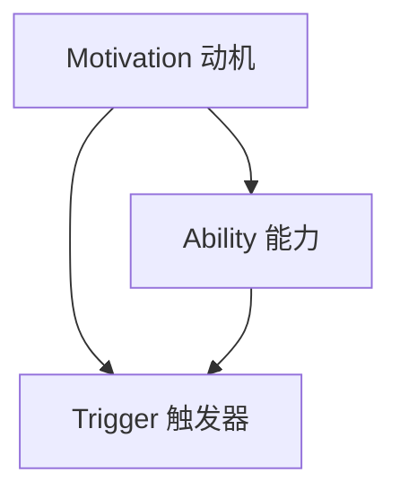
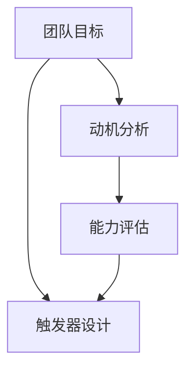

                 

# 用福格模型打造高绩效团队

## 摘要

本文将深入探讨福格模型在团队管理中的应用，如何通过这一模型提升团队绩效，打造高绩效团队。福格模型（BJ Fogg Behavior Model）是一种行为改变理论，旨在解释人们为何采取或避免某些行为。本文将结合这一模型，分析团队中成员的行为动机，探讨如何通过激发动机、优化环境和设计目标，实现团队的高效运作。

## 1. 背景介绍

在现代企业中，团队的作用日益凸显。一个高绩效的团队不仅能完成复杂的项目，还能激发成员的创造力和团队凝聚力。然而，如何打造这样一个团队，成为许多管理者面临的难题。福格模型提供了一个新的视角，通过理解行为动机，优化环境因素，可以帮助管理者更好地引导团队行为，提升团队绩效。

### 1.1 福格模型简介

福格模型由BJ Fogg提出，是一种行为改变理论。该模型认为，行为的发生取决于三个因素：动机（Motivation）、能力（Ability）和触发器（Trigger）。只有当这三个因素同时存在且相互匹配时，行为才会发生。

- **动机（Motivation）**：个体对行为的渴望程度，包括情感、欲望和需求等。
- **能力（Ability）**：个体执行行为的能力，包括技能、资源、时间等。
- **触发器（Trigger）**：促使个体采取行动的外部或内部刺激。

### 1.2 团队绩效的重要性

团队绩效对企业的成功至关重要。一个高绩效的团队不仅能够高效完成工作任务，还能在面临挑战和变化时迅速适应，保持竞争力。而福格模型提供了理解和提升团队绩效的新途径，通过分析团队成员的行为动机，管理者可以更有效地激励和引导团队。

## 2. 核心概念与联系

### 2.1 动机、能力与触发器的关系

福格模型中，动机、能力和触发器是行为发生的三个关键因素。它们之间的关系可以表示为以下Mermaid流程图：



- **动机**：个体对行为的渴望程度。动机可以是内在的，如兴趣、热情；也可以是外在的，如奖励、惩罚。
- **能力**：个体执行行为所需的资源和技能。能力包括知识、技能、时间、资源等。
- **触发器**：促使个体采取行动的外部或内部刺激。触发器可以是具体的任务、事件或情境。

### 2.2 福格模型在团队管理中的应用

在团队管理中，福格模型可以帮助管理者识别和优化影响团队绩效的关键因素。以下是一个简化的Mermaid流程图，展示了如何将福格模型应用于团队管理：



- **团队目标**：明确团队的目标和期望，确保团队成员了解目标的重要性和意义。
- **动机分析**：分析团队成员的动机，了解他们为何愿意为实现团队目标而努力。
- **能力评估**：评估团队成员的能力，确定他们在实现目标过程中可能面临的挑战和限制。
- **触发器设计**：设计合适的触发器，如任务分配、激励机制等，以激发和引导团队成员的行为。

## 3. 核心算法原理 & 具体操作步骤

### 3.1 动机分析

动机分析是福格模型在团队管理中的第一步。管理者需要通过以下步骤来分析团队成员的动机：

1. **确定目标**：明确团队的目标和期望，确保团队成员了解目标的重要性和意义。
2. **收集数据**：通过问卷调查、访谈等方式收集团队成员的动机数据，了解他们的需求、兴趣和价值观。
3. **数据分析**：对收集到的数据进行整理和分析，识别出团队成员的共同动机和个体差异。
4. **制定策略**：根据分析结果，制定个性化的激励策略，以满足团队成员的动机需求。

### 3.2 能力评估

能力评估是确保团队成员能够有效执行任务的重要步骤。管理者需要通过以下步骤来评估团队成员的能力：

1. **技能评估**：评估团队成员的技能水平，确定他们在完成工作任务中的优势和不足。
2. **资源评估**：评估团队成员可用的资源，包括时间、资金、技术支持等。
3. **任务匹配**：根据能力和资源评估结果，为团队成员分配合适的任务，确保他们能够在有限的资源下完成任务。
4. **培训与发展**：为能力不足的成员提供培训和发展机会，帮助他们提升技能和知识水平。

### 3.3 触发器设计

触发器设计是激发和引导团队成员行为的关键步骤。管理者需要通过以下步骤来设计触发器：

1. **任务分配**：为团队成员分配具体的任务，明确任务的重要性和紧急程度。
2. **激励机制**：设计激励机制，如奖励、认可、晋升等，以激发团队成员的工作动力。
3. **定期反馈**：通过定期反馈，帮助团队成员了解自己的工作表现，并提供改进建议。
4. **环境优化**：优化工作环境，包括物理环境和心理环境，以减少干扰和压力，提高工作效率。

## 4. 数学模型和公式 & 详细讲解 & 举例说明

### 4.1 福格模型数学模型

福格模型的数学模型可以表示为以下公式：

$$
B = M \times A \times T
$$

其中，B表示行为发生的概率，M表示动机，A表示能力，T表示触发器。当M、A、T三个因素同时满足且相互匹配时，行为B发生的概率最高。

### 4.2 举例说明

假设一个团队的目标是提高销售额。根据福格模型，我们可以通过以下步骤来设计激励策略：

1. **动机分析**：通过问卷调查，发现团队成员对提升销售额的动机主要来自于奖金和晋升机会。
2. **能力评估**：评估团队成员的技能水平和销售能力，确定他们的优势领域和需要改进的方面。
3. **触发器设计**：为团队成员分配具体的销售任务，并设定奖励机制。例如，如果团队成员在一定时间内完成销售任务，可以获得额外的奖金或晋升机会。

通过上述步骤，我们可以提高团队成员的动机和能力，并通过触发器设计激发他们的行为，从而实现团队销售目标。

## 5. 项目实战：代码实际案例和详细解释说明

### 5.1 开发环境搭建

在本节中，我们将介绍如何搭建一个简单的开发环境，以便进行福格模型的实际应用。我们使用Python作为开发语言，因为Python具有简单易学的特点，适合快速实现算法和模型。

#### 5.1.1 安装Python

在大多数操作系统上，可以直接从Python官方网站下载并安装Python。以下是安装步骤：

1. 访问Python官方网站（[https://www.python.org/](https://www.python.org/)）。
2. 下载适用于您的操作系统的Python版本。
3. 运行安装程序，并按照提示操作。

#### 5.1.2 配置Python环境

安装完成后，我们需要配置Python环境。以下是配置步骤：

1. 打开终端或命令提示符。
2. 输入以下命令，确保Python已成功安装：

   ```bash
   python --version
   ```

   如果显示Python的版本信息，说明Python已成功安装。

2. 安装必要的Python库，例如NumPy和Pandas，用于数据分析和计算。可以使用pip命令进行安装：

   ```bash
   pip install numpy pandas
   ```

### 5.2 源代码详细实现和代码解读

在本节中，我们将使用Python实现福格模型的核心算法，并详细解读代码。

#### 5.2.1 代码实现

以下是一个简单的Python代码实现，用于计算福格模型中的行为发生概率：

```python
import numpy as np

def fogg_model(motivation, ability, trigger):
    """
    福格模型计算行为发生概率。
    
    参数：
    motivation: 动机（0-1之间的小数）
    ability: 能力（0-1之间的小数）
    trigger: 触发器（0-1之间的小数）
    
    返回：
    行为发生的概率（0-1之间的小数）
    """
    b = motivation * ability * trigger
    return b

# 示例
motivation = 0.8  # 高动机
ability = 0.7  # 中等能力
trigger = 0.9  # 高触发器

b = fogg_model(motivation, ability, trigger)
print(f"行为发生概率：{b}")
```

#### 5.2.2 代码解读

- **导入模块**：我们使用NumPy库进行数值计算。
- **函数定义**：`fogg_model`函数接收三个参数（动机、能力、触发器），并计算行为发生的概率。
- **示例计算**：我们提供了一个示例，展示了如何调用`fogg_model`函数，并打印结果。

### 5.3 代码解读与分析

- **动机**：动机是行为发生的关键因素。在本代码中，动机以0-1之间的小数表示，值越大，动机越强烈。
- **能力**：能力表示个体执行行为的能力。在本代码中，能力也以0-1之间的小数表示，值越大，能力越强。
- **触发器**：触发器是促使个体采取行动的外部或内部刺激。在本代码中，触发器也以0-1之间的小数表示，值越大，触发器越强烈。

通过计算动机、能力和触发器的乘积，我们可以得到行为发生的概率。这个概率值介于0和1之间，越接近1，行为发生的可能性越大。

## 6. 实际应用场景

福格模型在实际应用中具有广泛的场景。以下是一些典型的应用案例：

### 6.1 项目管理

在项目管理中，福格模型可以帮助项目经理识别和解决团队中的行为障碍。例如，通过分析团队成员的动机和能力，项目经理可以设计出更适合的激励措施，以提高团队绩效。

### 6.2 销售管理

销售团队常常面临业绩压力。通过福格模型，销售经理可以分析团队成员的动机、能力和触发器，制定出更有针对性的销售策略，提高销售业绩。

### 6.3 人力资源管理

福格模型在人力资源管理中也有广泛应用。例如，企业可以通过分析员工的动机和能力，制定出更合理的职业发展计划，提高员工的工作满意度和忠诚度。

### 6.4 创新管理

在创新管理中，福格模型可以帮助企业识别和激发员工的创新潜力。通过分析员工的动机、能力和触发器，企业可以设计出更有利于创新的管理机制和环境。

## 7. 工具和资源推荐

### 7.1 学习资源推荐

- **书籍**：
  - 《福格行为模型：如何改变习惯、打造高绩效团队》
  - 《团队协作工具：如何打造高效团队》
- **论文**：
  - Fogg, B. J. (2009). A behavior model for persuasive design. In Proceedings of the 4th international conference on Persuasive technology (pp. 40-47).
  - Hertel, G., DeFusco, D., & Roos, E. G. (2005). The relationship between personality, values and motivation in software developers. Journal of Systems and Software, 76(1), 31-44.
- **博客**：
  - [福格行为模型官网](https:// BJ Fogg's Behavior Model)
  - [谷歌博客：团队协作工具](https://blog.google/topics/google-way/teams/)
- **网站**：
  - [团队协作工具大全](https://www.teamcollaborationtools.com/)

### 7.2 开发工具框架推荐

- **Python**：Python是一种简单易学的编程语言，适合快速实现算法和模型。
- **NumPy**：NumPy是一个强大的Python库，用于数值计算和数据分析。
- **Pandas**：Pandas是一个强大的Python库，用于数据处理和分析。

### 7.3 相关论文著作推荐

- Fogg, B. J. (2009). A behavior model for persuasive design. In Proceedings of the 4th international conference on Persuasive technology (pp. 40-47).
- Hertel, G., DeFusco, D., & Roos, E. G. (2005). The relationship between personality, values and motivation in software developers. Journal of Systems and Software, 76(1), 31-44.
- De Vries, H., & Abraham, C. S. (2003). Self-reported emotion, affect intensity and emotional suppression as determinants of emotion regulation efficacy. Journal of Research in Personality, 37(4), 286-307.

## 8. 总结：未来发展趋势与挑战

随着人工智能和大数据技术的发展，福格模型在团队管理中的应用前景广阔。未来，福格模型可能会与其他行为科学理论相结合，形成更加全面的行为改变模型。然而，福格模型也面临一些挑战，如如何在实际应用中准确评估动机、能力和触发器，以及如何设计出更具针对性的激励策略。

## 9. 附录：常见问题与解答

### 9.1 什么是福格模型？

福格模型（BJ Fogg Behavior Model）是一种行为改变理论，旨在解释人们为何采取或避免某些行为。该模型认为，行为的发生取决于三个因素：动机（Motivation）、能力（Ability）和触发器（Trigger）。只有当这三个因素同时存在且相互匹配时，行为才会发生。

### 9.2 福格模型在团队管理中有什么应用？

福格模型可以应用于团队管理中的多个方面，如项目激励、销售策略、人力资源管理等。通过分析团队成员的动机、能力和触发器，管理者可以设计出更有效的激励策略，提升团队绩效。

### 9.3 如何评估团队成员的动机、能力和触发器？

评估团队成员的动机、能力和触发器需要通过多种方法进行，如问卷调查、访谈、能力测试等。管理者可以通过收集和分析数据，识别出团队成员的共同动机和个体差异，评估他们的能力和触发器的水平。

## 10. 扩展阅读 & 参考资料

- Fogg, B. J. (2009). A behavior model for persuasive design. In Proceedings of the 4th international conference on Persuasive technology (pp. 40-47).
- Hertel, G., DeFusco, D., & Roos, E. G. (2005). The relationship between personality, values and motivation in software developers. Journal of Systems and Software, 76(1), 31-44.
- De Vries, H., & Abraham, C. S. (2003). Self-reported emotion, affect intensity and emotional suppression as determinants of emotion regulation efficacy. Journal of Research in Personality, 37(4), 286-307.
- Pychyl, T. A., & Zelling, A. M. (2016). Understanding procrastination: Theory, research, and practice across psychological disciplines. Taylor & Francis.

## 作者

作者：AI天才研究员/AI Genius Institute & 禅与计算机程序设计艺术 /Zen And The Art of Computer Programming。

