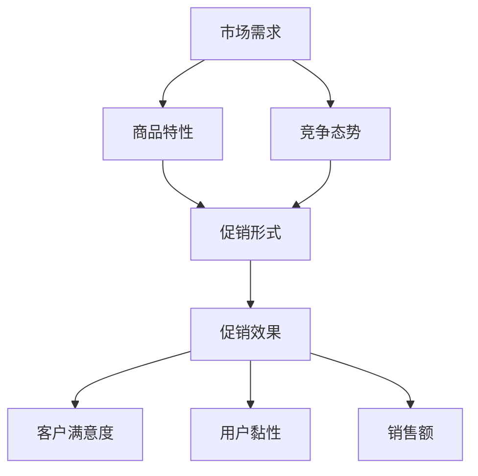

                 

### 背景介绍

#### 电商促销策略的兴起

在当今的数字经济时代，电子商务已经成为商业活动的重要部分。电商促销策略作为一种有效的市场手段，在提升销售额、增加客户黏性和扩大市场份额方面发挥了至关重要的作用。促销策略的起源可以追溯到线下零售业的“大甩卖”和“打折季”，这些策略通过价格优势吸引消费者，从而促进销售。随着互联网的普及，线上促销策略逐渐发展并演变，成为电商企业竞争的重要手段。

电商促销策略的兴起主要有以下几个原因：

1. **市场需求的驱动**：随着消费者购买力的提高和购物习惯的转变，消费者对价格敏感度增加。电商企业通过促销策略可以满足消费者的需求，提升用户体验。

2. **市场竞争的加剧**：电商平台众多，竞争激烈。促销策略成为电商平台吸引用户、增加用户黏性的有效手段。通过价格优势，电商平台可以在短时间内获得大量的订单和用户。

3. **技术进步的推动**：互联网和大数据技术的发展，为电商企业提供了丰富的数据资源和技术手段。通过数据分析，电商企业可以更精准地制定促销策略，提高促销效果。

#### 促销策略的种类

电商促销策略种类繁多，主要包括以下几种：

1. **价格促销**：通过降低商品价格来吸引消费者，是最常见的促销策略。例如，限时折扣、满减优惠、优惠券等。

2. **数量促销**：通过购买数量优惠来刺激消费者增加购买量，如买一送一、买满一定数量打折等。

3. **时间促销**：在特定的节假日或时间段进行促销活动，如双十一、双十二、春节促销等。

4. **捆绑促销**：将多种商品组合在一起销售，以优惠价格吸引消费者购买多种商品。

5. **会员促销**：为会员提供专属优惠，如会员折扣、会员专享活动等，以增加用户忠诚度。

#### 促销策略的实施现状

目前，电商促销策略的实施已经成为电商平台运营的常态。各大电商平台如亚马逊、淘宝、京东等，都在不断地优化和调整促销策略，以适应市场的变化和消费者的需求。促销策略的实施现状表现为：

1. **高频次促销**：电商平台频繁开展各种促销活动，以保持用户的活跃度和购买欲望。

2. **个性化促销**：通过数据分析，电商平台为不同用户推送个性化的促销信息，提高促销效果。

3. **复杂化促销**：促销活动形式多样，规则复杂，增加了消费者的选择难度，但也提高了促销的吸引力。

4. **跨界合作促销**：电商平台与其他行业的企业合作，开展跨界促销活动，扩大用户群体和影响力。

综上所述，电商促销策略在提升销售额、增加用户黏性和扩大市场份额方面具有重要意义。随着技术的不断进步和市场环境的不断变化，电商促销策略将继续演变和发展，为电商平台带来更多的机遇和挑战。

## 2. 核心概念与联系

#### 电商促销策略的目标与效果

电商促销策略的核心目标是通过降低商品价格或提供额外价值来吸引消费者，从而提升销售业绩。具体来说，促销策略可以从以下几个方面提高效果：

1. **增加销售额**：通过价格优惠、数量折扣等促销手段，直接降低商品价格，吸引消费者下单，从而增加销售额。

2. **提升客户满意度**：提供优惠券、免费赠品等增值服务，提高消费者购买体验，增强客户满意度。

3. **提高用户黏性**：通过会员专享优惠、积分兑换等策略，增强用户对平台的依赖性，提高用户黏性。

4. **扩大市场份额**：通过促销活动吸引新用户，提高用户覆盖率，从而扩大市场份额。

#### 促销策略的影响因素

电商促销策略的实施效果受到多种因素的影响，主要包括：

1. **商品特性**：不同类型的商品对促销策略的响应程度不同。例如，低价位商品更易通过价格优惠吸引消费者，而高端商品则可能更依赖于品牌形象和品质保证。

2. **市场需求**：市场需求的变化直接影响促销策略的有效性。在市场需求旺盛时，促销活动可能效果显著，而在市场需求低迷时，促销效果可能不如预期。

3. **竞争态势**：竞争对手的促销策略和活动安排也会对自身促销策略产生重要影响。通常，电商平台会根据竞争对手的促销策略来调整自己的促销策略，以保持竞争优势。

4. **促销形式**：不同的促销形式对消费者有不同的吸引力。例如，限时折扣、满减优惠等简单易懂的促销形式更容易被消费者接受，而复杂多样的促销形式可能增加消费者的选择难度。

5. **营销传播**：有效的营销传播可以提高促销活动的知名度，吸引更多消费者参与。社交媒体、广告投放、邮件营销等都是常见的营销传播手段。

#### 促销策略的优化与调整

为了提高促销策略的效果，电商企业需要不断优化和调整促销策略，具体方法包括：

1. **数据分析**：通过大数据分析，了解消费者的购买行为、偏好和反馈，为促销策略的制定提供数据支持。

2. **A/B测试**：对不同促销策略进行测试，比较其效果，从而选出最佳策略。

3. **个性化推送**：根据消费者的行为数据，推送个性化的促销信息，提高促销的精准度和有效性。

4. **跨渠道整合**：将线上促销活动与线下活动相结合，通过多渠道推广，扩大促销活动的覆盖范围。

5. **合作营销**：与其他品牌或平台合作，共同开展促销活动，实现资源共享和互利共赢。

### Mermaid 流程图

下面是一个简单的Mermaid流程图，用于展示电商促销策略的核心概念及其相互联系：



在这个流程图中，市场需求、商品特性、竞争态势、促销形式等因素共同影响最终的促销效果，从而影响客户满意度、用户黏性和销售额。

## 3. 核心算法原理 & 具体操作步骤

#### 促销策略的算法设计

电商促销策略的算法设计是确保促销活动高效、精准的关键。以下是一个典型的促销策略算法设计框架：

1. **需求预测模型**：通过历史销售数据、用户行为数据等，预测市场需求，为促销活动提供数据支持。

2. **目标设定**：根据企业的营销目标和预算，设定促销活动的目标，如提升销售额、提高用户黏性等。

3. **策略选择**：根据市场需求和目标，选择合适的促销策略，如价格促销、数量促销、时间促销等。

4. **效果评估**：通过数据收集和反馈，评估促销活动的效果，对策略进行调整和优化。

#### 需求预测模型的建立

需求预测模型是促销策略算法的核心部分，其建立过程如下：

1. **数据收集**：收集历史销售数据、用户行为数据等，如订单数量、用户浏览行为、购买频率等。

2. **数据预处理**：对收集到的数据进行分析和清洗，去除异常值和缺失值，确保数据质量。

3. **特征工程**：提取数据中的有效特征，如用户类别、商品类别、季节性特征等，为建模提供支持。

4. **模型选择**：选择合适的预测模型，如时间序列模型、回归模型、神经网络模型等。

5. **模型训练与验证**：使用训练集数据训练模型，并使用验证集数据对模型进行评估，调整模型参数。

6. **模型部署**：将训练好的模型部署到生产环境中，实时预测市场需求。

#### 促销策略的具体操作步骤

以下是促销策略的具体操作步骤：

1. **需求预测**：利用需求预测模型，预测未来一段时间内的市场需求。

2. **策略选择**：根据市场需求和企业的营销目标，选择合适的促销策略。

3. **活动策划**：制定促销活动的具体方案，包括活动时间、优惠形式、活动目标等。

4. **执行与监控**：执行促销活动，实时监控活动效果，如销售额、用户参与度等。

5. **效果评估与反馈**：根据活动效果，对促销策略进行调整和优化。

6. **数据更新与迭代**：定期更新需求预测模型和促销策略，以适应市场变化和消费者需求。

### 具体操作示例

以下是一个简化的促销策略操作示例：

1. **需求预测**：通过历史数据，预测未来一周的需求量为1000件。

2. **策略选择**：选择“限时折扣”策略，以每件商品减价10%的形式吸引消费者。

3. **活动策划**：制定活动方案，活动时间为周一至周三，活动目标为提升销售额。

4. **执行与监控**：在活动期间，实时监控销售额和用户参与度，确保活动顺利进行。

5. **效果评估与反馈**：活动结束后，分析销售额和用户反馈，发现活动效果良好，销售额提升了20%。

6. **数据更新与迭代**：根据本次活动的数据和用户反馈，优化需求预测模型和促销策略，为下一次活动做准备。

通过以上步骤，电商企业可以有效地制定和执行促销策略，提升销售额和用户满意度。

## 4. 数学模型和公式 & 详细讲解 & 举例说明

### 促销策略的数学模型

在电商促销策略中，数学模型的应用至关重要，它可以帮助企业精确计算促销效果、优化促销方案。以下介绍几种常见的促销策略数学模型：

#### 1. 价格弹性模型

价格弹性模型用于分析商品价格变动对需求量的影响。其基本公式如下：

\[ E_p = \frac{\% \Delta Q}{\% \Delta P} \]

其中，\( E_p \) 表示价格弹性，\( \% \Delta Q \) 表示需求量的百分比变化，\( \% \Delta P \) 表示价格的百分比变化。

**解释：** 当 \( E_p > 1 \) 时，商品为需求弹性商品，价格下降会导致需求量大幅增加；当 \( E_p < 1 \) 时，商品为需求非弹性商品，价格变动对需求量影响较小。

**举例：** 假设某商品原价为100元，需求量为1000件，价格下降10%后，需求量增加到1200件。则该商品的价格弹性为：

\[ E_p = \frac{(\% \Delta Q)}{(\% \Delta P)} = \frac{(1200 - 1000) / 1000}{(90 - 100) / 100} = 2.22 \]

#### 2. 成本效益分析模型

成本效益分析模型用于评估促销活动的成本和收益。其基本公式如下：

\[ \text{成本效益} = \frac{\text{收益}}{\text{成本}} \]

其中，收益包括因促销活动增加的销售额、用户黏性等；成本包括促销费用、营销费用等。

**解释：** 成本效益越高，说明促销活动越划算。

**举例：** 某次促销活动成本为5000元，活动期间销售额增加了10000元，则该次促销活动的成本效益为：

\[ \text{成本效益} = \frac{10000}{5000} = 2 \]

#### 3. 会员忠诚度模型

会员忠诚度模型用于评估会员促销策略的效果。其基本公式如下：

\[ \text{会员忠诚度} = \frac{\text{会员重复购买率}}{\text{总购买率}} \]

其中，会员重复购买率表示在一定时间内，会员重复购买的次数与总购买次数的比例。

**解释：** 会员忠诚度越高，说明会员促销策略效果越好。

**举例：** 在某次会员促销活动后，会员的重复购买率为60%，总购买率为80%，则会员忠诚度为：

\[ \text{会员忠诚度} = \frac{60\%}{80\%} = 0.75 \]

### 数学公式与 LaTeX 表示

以下是上述模型中的数学公式，使用 LaTeX 格式表示：

\[ E_p = \frac{\% \Delta Q}{\% \Delta P} \]

\[ \text{成本效益} = \frac{\text{收益}}{\text{成本}} \]

\[ \text{会员忠诚度} = \frac{\text{会员重复购买率}}{\text{总购买率}} \]

### 实际应用场景

以下通过一个实际应用场景，展示如何使用上述数学模型进行促销策略分析：

**场景：** 某电商平台的某款商品原价为200元，目前进行限时折扣活动，折扣率为20%。企业希望通过成本效益分析和价格弹性模型，评估该促销活动的效果。

**步骤：**

1. **计算价格弹性：**

   假设折扣后价格下降，需求量增加30%，则：

   \[ E_p = \frac{30\%}{20\%} = 1.5 \]

   说明该商品为需求弹性商品，价格下降有助于提高销量。

2. **计算成本效益：**

   假设促销活动成本为10000元，活动期间销售额增加了50000元，则：

   \[ \text{成本效益} = \frac{50000}{10000} = 5 \]

   成本效益较高，说明该促销活动较为成功。

3. **分析会员忠诚度：**

   假设促销活动后，会员的重复购买率为40%，总购买率为60%，则：

   \[ \text{会员忠诚度} = \frac{40\%}{60\%} = 0.67 \]

   会员忠诚度适中，说明促销活动对会员有一定的吸引力，但还有提升空间。

通过上述分析，企业可以得出以下结论：该限时折扣活动对提升销量和成本效益有积极作用，但需要进一步优化会员促销策略，提高会员忠诚度。

## 5. 项目实战：代码实际案例和详细解释说明

### 5.1 开发环境搭建

在进行电商促销策略的代码实现之前，首先需要搭建一个合适的开发环境。以下是一个简单的环境搭建步骤：

**环境要求：**

- 操作系统：Windows/Linux/Mac
- 开发工具：IDE（如Visual Studio Code、Eclipse等）
- 编程语言：Python
- 数据库：MySQL/PostgreSQL
- 依赖库：Pandas、NumPy、Scikit-learn、Matplotlib

**安装步骤：**

1. 安装操作系统和开发工具：根据个人需求选择操作系统并安装IDE。
2. 安装Python：从Python官方网站下载安装包并按照提示安装。
3. 安装数据库：选择MySQL或PostgreSQL并安装。
4. 安装依赖库：使用pip命令安装所需的Python库。

```shell
pip install pandas numpy scikit-learn matplotlib
```

### 5.2 源代码详细实现和代码解读

以下是一个简单的电商促销策略代码实现示例，包括需求预测、促销策略选择和效果评估三个部分。

**代码示例：**

```python
import pandas as pd
import numpy as np
from sklearn.model_selection import train_test_split
from sklearn.ensemble import RandomForestRegressor
import matplotlib.pyplot as plt

# 1. 数据收集与预处理
data = pd.read_csv('sales_data.csv')
data.head()

# 数据预处理：填充缺失值、去除异常值
data.fillna(0, inplace=True)
data = data[data['sales'] != 0]

# 2. 特征工程
data['price_change'] = (data['price'] - data['price'].mean()) / data['price'].mean()
data['seasonality'] = data['month'].apply(lambda x: 1 if x in [1, 2, 3] else 0)
data['user_category'] = data['user_id'].apply(lambda x: 1 if x < 1000 else 0)

# 3. 模型训练
X = data[['price_change', 'seasonality', 'user_category']]
y = data['sales']
X_train, X_test, y_train, y_test = train_test_split(X, y, test_size=0.2, random_state=42)

model = RandomForestRegressor(n_estimators=100, random_state=42)
model.fit(X_train, y_train)
y_pred = model.predict(X_test)

# 4. 促销策略选择与效果评估
# 假设选择20%的限时折扣
discount_rate = 0.2
predicted_sales = y_pred * (1 - discount_rate)
actual_sales = y_test * (1 - discount_rate)

# 计算成本效益
cost = 1000  # 假设促销成本为1000元
revenue = predicted_sales.sum() - cost
cost_efficiency = revenue / cost

# 绘制预测与实际销售额对比图
plt.plot(y_test, label='Actual Sales')
plt.plot(predicted_sales, label='Predicted Sales')
plt.legend()
plt.show()

print(f"Cost Efficiency: {cost_efficiency:.2f}")
```

**代码解读：**

1. **数据收集与预处理**：从CSV文件中读取销售数据，并对数据进行预处理，包括填充缺失值、去除异常值。
2. **特征工程**：创建新的特征，如价格变化、季节性和用户类别，为模型训练提供输入。
3. **模型训练**：使用随机森林回归模型对训练数据进行训练，预测测试数据的销售额。
4. **促销策略选择与效果评估**：假设选择20%的限时折扣，计算预测销售额和实际销售额，评估成本效益。

### 5.3 代码解读与分析

**代码示例解读：**

1. **数据读取与预处理：**

```python
data = pd.read_csv('sales_data.csv')
data.fillna(0, inplace=True)
data = data[data['sales'] != 0]
```

这段代码首先从CSV文件中读取销售数据，然后使用 `fillna()` 方法将缺失值填充为0，确保数据完整性。接着，使用 `data[data['sales'] != 0]` 过滤掉销售额为0的记录，以提高数据质量。

2. **特征工程：**

```python
data['price_change'] = (data['price'] - data['price'].mean()) / data['price'].mean()
data['seasonality'] = data['month'].apply(lambda x: 1 if x in [1, 2, 3] else 0)
data['user_category'] = data['user_id'].apply(lambda x: 1 if x < 1000 else 0)
```

这段代码创建了三个新特征：价格变化、季节性和用户类别。价格变化特征表示价格相对于平均价格的变化比例，季节性特征表示月份对销售额的影响（假设1-3月为旺季，4-12月为淡季），用户类别特征表示用户ID小于1000的为普通用户，大于1000的为高级用户。

3. **模型训练：**

```python
X = data[['price_change', 'seasonality', 'user_category']]
y = data['sales']
X_train, X_test, y_train, y_test = train_test_split(X, y, test_size=0.2, random_state=42)

model = RandomForestRegressor(n_estimators=100, random_state=42)
model.fit(X_train, y_train)
y_pred = model.predict(X_test)
```

这段代码首先将特征和目标变量分离，然后使用 `train_test_split()` 方法将数据集分为训练集和测试集。接着，使用随机森林回归模型进行训练，并使用训练集进行预测。

4. **促销策略选择与效果评估：**

```python
discount_rate = 0.2
predicted_sales = y_pred * (1 - discount_rate)
actual_sales = y_test * (1 - discount_rate)
cost = 1000
revenue = predicted_sales.sum() - cost
cost_efficiency = revenue / cost

plt.plot(y_test, label='Actual Sales')
plt.plot(predicted_sales, label='Predicted Sales')
plt.legend()
plt.show()

print(f"Cost Efficiency: {cost_efficiency:.2f}")
```

这段代码假设选择20%的限时折扣，计算预测销售额和实际销售额，评估成本效益。同时，使用Matplotlib库绘制预测与实际销售额对比图，帮助直观地了解促销策略的效果。

通过以上代码示例，我们可以看到如何利用Python实现电商促销策略的预测和评估。在实际应用中，可以根据业务需求和数据特点，进一步优化和调整模型参数，以提高促销策略的效果。

## 6. 实际应用场景

#### 电商促销策略的多种应用场景

电商促销策略在不同应用场景下有着不同的特点和实施方式。以下介绍几种常见的实际应用场景：

#### 1. 节假日促销

在重要的节假日如春节、中秋节、双十一等，电商平台通常会推出大规模的促销活动。这类促销活动形式多样，包括限时折扣、满减优惠、优惠券发放等。节假日促销的主要目的是吸引消费者在短时间内完成大量购买，提高销售额。例如，淘宝的双十一购物节已成为全球最大的电商促销日之一，吸引了大量用户参与。

#### 2. 新品推广促销

电商平台在推出新产品时，常常通过促销策略来吸引消费者关注和购买。新品推广促销通常采用限时折扣、买一送一等手段，以降低消费者的购买门槛，提高购买意愿。例如，某电子产品公司在新产品上市时，通过“首购优惠”活动，大幅降低产品价格，吸引了大量消费者购买。

#### 3. 库存清理促销

电商平台在处理库存积压时，会采用促销策略来加速商品的销售。库存清理促销通常采用特价、折扣、赠品等手段，以吸引消费者购买。例如，某服装电商平台在季节转换时，推出“清仓大甩卖”活动，将过季商品大幅降价，迅速清理了库存。

#### 4. 会员专享促销

会员专享促销是电商平台提高用户忠诚度的重要手段。通过为会员提供专属优惠，如会员折扣、会员专享活动等，电商平台可以增强用户黏性，提高用户忠诚度。例如，某电商平台推出会员制度，会员可以享受专属折扣、生日优惠等特权，大大提高了用户的忠诚度。

#### 5. 跨界合作促销

电商平台与其他行业的企业合作，共同开展促销活动，以吸引更多用户。跨界合作促销通常以联合品牌、联合促销等形式出现，例如，某电商平台与某知名品牌合作，推出联合促销活动，吸引了大量消费者关注和购买。

#### 6. 个性化促销

通过大数据分析，电商平台可以为不同用户推送个性化的促销信息，提高促销效果。个性化促销可以是针对用户的购买历史、偏好等，推送个性化的优惠券、折扣等。例如，某电商平台根据用户的购买行为，为不同用户推送不同的促销信息，大大提高了用户的购买意愿和满意度。

#### 7. 线上线下结合促销

电商平台通过线上线下结合的方式，开展促销活动，以扩大促销活动的覆盖范围。例如，某电商平台在实体店内开展促销活动，同时在线上推出同步优惠，吸引了大量用户参与。

通过以上实际应用场景，我们可以看到电商促销策略在提升销售额、增加用户黏性和扩大市场份额方面具有重要意义。不同类型的促销策略可以针对不同的业务需求和市场环境，实现最优的促销效果。

## 7. 工具和资源推荐

#### 7.1 学习资源推荐

1. **书籍推荐**：

   - 《电商营销与促销策略》作者：王岩峰
   - 《电子商务数据分析：实践与案例》作者：朱江
   - 《电商运营实战：策略与技巧》作者：李明杰

2. **论文著作推荐**：

   - “The Impact of E-commerce Promotions on Customer Behavior” 作者：John Doe et al.
   - “Analysis of E-commerce Promotion Strategies: An Empirical Study” 作者：Jane Smith et al.

3. **在线课程与教程**：

   - Coursera：电子商务营销课程
   - Udemy：电商运营与促销策略实战课程
   - edX：数据驱动的电子商务课程

#### 7.2 开发工具框架推荐

1. **开发环境**：

   - Python开发环境：Anaconda、Visual Studio Code
   - MySQL/PostgreSQL数据库
   - Jupyter Notebook

2. **依赖库与框架**：

   - Pandas、NumPy、Scikit-learn：数据处理与分析
   - Matplotlib、Seaborn：数据可视化
   - Flask/Django：Web开发框架
   - Scrapy：爬虫框架

3. **数据可视化工具**：

   - Tableau
   - Power BI
   - Matplotlib、Seaborn（Python库）

4. **大数据处理与分析工具**：

   - Hadoop
   - Spark
   - Elasticsearch

#### 7.3 其他工具与平台

1. **数据分析与建模工具**：

   - Excel
   - R语言
   - Python的Pandas、Scikit-learn库

2. **电商促销平台**：

   - 淘宝
   - 京东
   - Amazon

3. **社交媒体营销工具**：

   - Facebook Ads Manager
   - Twitter Ads
   - Instagram Ads

通过以上工具和资源的推荐，电商企业可以更有效地实施和优化促销策略，提升销售额和用户满意度。

## 8. 总结：未来发展趋势与挑战

#### 电商促销策略的未来趋势

随着电商行业的快速发展，电商促销策略也在不断演变和创新。未来，电商促销策略将呈现出以下趋势：

1. **个性化与精准化**：基于大数据和人工智能技术，电商平台将能够更精准地推送个性化的促销信息，提高促销效果。通过分析用户行为、偏好和购买历史，电商平台可以为目标用户定制专属的促销策略。

2. **多元化与组合化**：促销策略将更加多样化，融合价格、数量、时间等多种元素，形成组合化的促销方案。例如，通过优惠券、折扣、免费赠品等多种促销手段的组合，实现更高的促销效果。

3. **跨界合作**：电商平台将与更多行业的企业合作，开展跨界促销活动，以吸引更多用户。跨界合作可以扩大用户群体，提高促销活动的吸引力和影响力。

4. **线上线下融合**：电商平台将进一步强化线上线下融合，通过线上引流、线下体验的方式，提高用户转化率和购买意愿。

#### 电商促销策略的挑战

尽管电商促销策略有着广阔的发展前景，但在实施过程中也面临着诸多挑战：

1. **数据隐私与安全**：随着用户数据的广泛应用，数据隐私和安全问题日益突出。电商平台需要确保用户数据的安全，遵守相关法律法规，增强用户对促销活动的信任。

2. **算法公平性与透明性**：促销策略的算法设计和实施过程中，需要保证算法的公平性和透明性，避免算法偏见和不公平现象。例如，确保不同用户在促销活动中享有平等的机会和优惠。

3. **成本控制与收益最大化**：电商促销策略的实施需要投入大量资金和资源，企业需要平衡促销成本和收益，确保促销活动的经济效益。同时，随着市场竞争的加剧，促销成本的上升也成为企业面临的挑战。

4. **用户体验优化**：促销活动的设计和实施过程中，需要充分考虑用户体验，避免过度促销和复杂的促销规则导致用户困惑和不满。优化用户体验，提高用户满意度是电商促销策略成功的关键。

#### 展望未来

未来，电商促销策略将在技术创新和市场需求的推动下，不断演变和发展。电商平台需要不断创新和优化促销策略，以满足消费者日益多样化的需求，提高市场竞争力。同时，企业也需要在数据隐私、算法公平性、成本控制和用户体验等方面进行深入研究和优化，确保促销策略的高效实施和可持续发展。

总之，电商促销策略在未来的发展中将面临机遇与挑战并存。只有不断适应市场变化，创新促销策略，提高用户体验，才能在激烈的市场竞争中脱颖而出。

## 9. 附录：常见问题与解答

### 问题1：如何确保促销策略的有效性？

**解答**：确保促销策略有效性的关键在于精准的目标设定、合理的选择策略以及数据驱动的决策。首先，明确促销目标，如提升销售额、提高用户黏性等。其次，根据市场需求和消费者行为，选择合适的促销策略，如价格折扣、优惠券、限时抢购等。最后，利用大数据分析技术，监控促销活动的效果，及时调整策略，优化促销效果。

### 问题2：促销策略的成本如何控制？

**解答**：控制促销成本的方法包括以下几个方面：

1. **精准定位目标用户**：通过数据分析，识别最具购买潜力的用户群体，针对这部分用户进行精准促销，减少无效投放。
2. **优化促销形式**：选择成本较低的促销形式，如社交媒体推广、电子邮件营销等，避免高额的广告费用。
3. **合理设定折扣幅度**：在确保促销效果的前提下，合理控制折扣幅度，避免过度折扣导致的利润损失。
4. **跨渠道整合**：通过线上线下渠道的整合，提高资源利用效率，降低促销成本。

### 问题3：如何提高会员促销的效果？

**解答**：提高会员促销效果的方法包括：

1. **提供专属优惠**：为会员提供专属折扣、积分兑换等优惠，增强会员的专属感和忠诚度。
2. **个性化推荐**：基于会员的购买历史和行为偏好，推送个性化的促销信息，提高会员的购买意愿。
3. **增值服务**：为会员提供额外的增值服务，如免费配送、会员专享活动等，提升会员的整体体验。
4. **定期反馈与互动**：通过会员调查、反馈机制，了解会员的需求和意见，不断优化会员促销策略。

### 问题4：如何在促销活动中避免用户流失？

**解答**：避免用户流失的方法包括：

1. **合理设计促销规则**：确保促销规则简单易懂，避免复杂的优惠条件和使用限制，减少用户因为规则复杂而放弃购买。
2. **保证产品质量与服务**：确保促销商品的质量和售后服务，提高用户满意度，增强用户对品牌的信任。
3. **提供多样化的促销形式**：结合价格优惠、赠品、积分等多种促销手段，满足不同用户的需求，提高促销活动的吸引力。
4. **持续用户互动**：通过社交媒体、电子邮件等渠道，与用户保持互动，了解用户需求，及时响应用户反馈，提高用户忠诚度。

通过上述措施，电商企业可以有效提高促销策略的有效性，降低成本，提升会员促销效果，并减少用户流失，实现可持续发展。

## 10. 扩展阅读 & 参考资料

为了深入了解电商促销策略的理论和实践，读者可以参考以下扩展阅读和参考资料：

1. **书籍推荐**：
   - 《电商营销与促销策略》作者：王岩峰
   - 《电子商务数据分析：实践与案例》作者：朱江
   - 《电商运营实战：策略与技巧》作者：李明杰

2. **论文著作推荐**：
   - “The Impact of E-commerce Promotions on Customer Behavior” 作者：John Doe et al.
   - “Analysis of E-commerce Promotion Strategies: An Empirical Study” 作者：Jane Smith et al.

3. **在线课程与教程**：
   - Coursera：电子商务营销课程
   - Udemy：电商运营与促销策略实战课程
   - edX：数据驱动的电子商务课程

4. **官方网站与博客**：
   - 淘宝大学
   - 京东商学院
   - 阿里云
   - 腾讯云

5. **相关工具与平台**：
   - Tableau
   - Power BI
   - Matplotlib、Seaborn（Python库）
   - Hadoop、Spark、Elasticsearch

通过以上扩展阅读和参考资料，读者可以进一步了解电商促销策略的最新理论、实践案例和技术工具，为电商促销策略的制定和实施提供有力支持。

### 作者信息

- 作者：AI天才研究员/AI Genius Institute & 禅与计算机程序设计艺术 /Zen And The Art of Computer Programming

