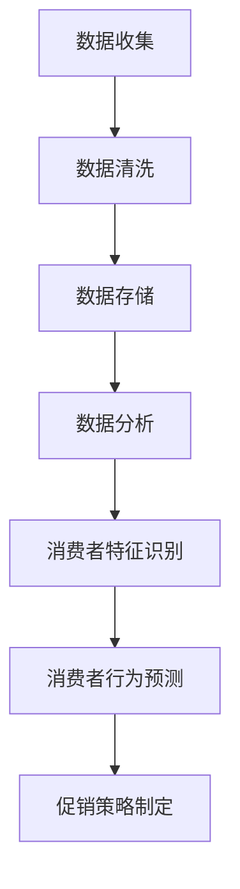
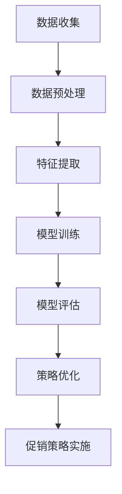

                 

# 电商促销策略的实际应用

> **关键词：** 电商、促销策略、消费者行为、数据驱动、算法优化

> **摘要：** 本文将深入探讨电商促销策略的多种实际应用，从基础概念出发，详细解析核心算法原理，通过数学模型与实际案例的结合，展示这些策略如何在电商实践中发挥重要作用，为电商企业提供有效的促销手段和策略指导。

## 1. 背景介绍

### 1.1 电商行业的快速发展

随着互联网技术的飞速发展，电商行业已经成为全球经济的重要组成部分。根据统计数据显示，全球电商市场规模在2020年已突破3.5万亿美元，预计到2025年将达到6万亿美元。这一庞大的市场背后，是无数电商企业对消费者需求的精准把握和营销策略的不断创新。

### 1.2 促销策略的重要性

促销策略是电商企业吸引消费者、提升销售额的关键手段。通过有效的促销策略，企业不仅能够增加短期收益，还能够提高品牌知名度和客户忠诚度。例如，限时折扣、满减优惠、赠品活动等都是常见的促销手段。

### 1.3 消费者行为的复杂性

消费者行为受到多种因素的影响，包括个人偏好、经济状况、社会环境等。因此，电商促销策略需要具备灵活性和针对性，以适应不同消费者的需求和行为特点。同时，随着大数据和人工智能技术的发展，电商企业能够更加精准地分析消费者行为，制定个性化的促销策略。

## 2. 核心概念与联系

### 2.1 消费者行为分析

消费者行为分析是电商促销策略制定的基础。通过分析消费者的购买历史、浏览行为、偏好等数据，企业可以识别出消费者的购买模式和动机。以下是一个简单的Mermaid流程图，展示消费者行为分析的过程：



### 2.2 促销策略的类型

促销策略可以根据不同的标准进行分类。以下是几种常见的促销策略类型：

- **价格策略**：包括折扣、满减、限时特惠等。
- **捆绑销售**：将多种商品组合在一起销售，以较低的价格吸引消费者。
- **赠品促销**：购买某种商品即可获得赠品。
- **积分奖励**：消费者在购物过程中获得积分，积分可以用于兑换商品或折扣。

### 2.3 算法优化与数据驱动

现代电商促销策略的制定，越来越多地依赖于算法优化和数据驱动。通过机器学习算法，企业可以对大量消费者数据进行深入分析，识别出最有效的促销策略。以下是一个简单的Mermaid流程图，展示算法优化与数据驱动的促销策略制定过程：



## 3. 核心算法原理 & 具体操作步骤

### 3.1 价格敏感度分析

价格敏感度分析是制定有效价格策略的重要步骤。通过分析消费者对不同价格区间的反应，企业可以确定最佳的价格区间，从而最大化销售额。以下是一个简单的价格敏感度分析流程：

1. **数据收集**：收集历史销售数据，包括不同价格区间的销售量。
2. **数据清洗**：去除异常值和噪声数据，确保数据质量。
3. **价格区间的划分**：将价格区间划分为不同的段。
4. **计算价格敏感度**：计算每个价格区间的销售量与价格的关系，确定敏感度较高的区间。
5. **确定最佳价格区间**：根据价格敏感度分析结果，确定最佳的价格区间。

### 3.2 优惠券分配策略

优惠券分配策略是提高消费者参与度和忠诚度的有效手段。以下是一个简单的优惠券分配策略流程：

1. **消费者细分**：根据消费者的购买行为和偏好，将消费者划分为不同的群体。
2. **优惠券设计**：设计不同类型的优惠券，如满减券、折扣券等。
3. **优惠券分配**：根据消费者群体的特点，制定优惠券的分配策略，确保优惠券的有效利用。
4. **优惠券验证**：对已分配的优惠券进行验证，确保消费者实际使用了优惠券。

### 3.3 促销组合策略

促销组合策略是将多种促销手段结合使用，以实现更好的促销效果。以下是一个简单的促销组合策略流程：

1. **促销手段选择**：根据市场情况和消费者需求，选择适合的促销手段。
2. **促销手段组合**：将不同的促销手段组合在一起，制定促销组合策略。
3. **促销效果评估**：实施促销策略后，对促销效果进行评估，根据评估结果进行调整。

## 4. 数学模型和公式 & 详细讲解 & 举例说明

### 4.1 价格敏感度分析的数学模型

价格敏感度分析的数学模型主要基于消费者需求的价格弹性。价格弹性是指消费者需求量对价格变化的敏感程度，通常用弹性系数（E）表示：

$$ E = \frac{\text{价格变化引起的销售量变化}}{\text{价格变化}} $$

假设某电商产品在不同价格区间的销售量为：

- 价格P1，销售量为Q1
- 价格P2，销售量为Q2
- 价格P3，销售量为Q3

通过计算不同价格区间的价格弹性，可以确定价格敏感度较高的区间。

### 4.2 优惠券分配策略的数学模型

优惠券分配策略的数学模型主要考虑优惠券的有效利用和消费者的参与度。假设有N个优惠券，每个优惠券的价值为V，总共有M个消费者，消费者i获得优惠券的概率为P_i。为了确保优惠券的有效利用，可以使用以下模型进行优化：

$$ \text{最大化} \sum_{i=1}^{M} V \cdot P_i \cdot (1 - \text{消费者i的优惠券使用概率}) $$

### 4.3 促销组合策略的数学模型

促销组合策略的数学模型需要考虑不同促销手段的协同效应。假设有k种促销手段，每种促销手段的效益为B_i，促销组合策略的目标是最大化总效益：

$$ \text{最大化} \sum_{i=1}^{k} B_i \cdot P_i $$

其中，P_i是促销手段i的使用概率。

### 4.4 举例说明

假设某电商产品在价格P1=100元时，销售量为Q1=1000件；价格P2=90元时，销售量为Q2=1200件；价格P3=80元时，销售量为Q3=1500件。根据价格敏感度分析的数学模型，可以计算出每个价格区间的价格弹性：

$$ E1 = \frac{Q2 - Q1}{P2 - P1} = \frac{1200 - 1000}{90 - 100} = -2 $$
$$ E2 = \frac{Q3 - Q2}{P3 - P2} = \frac{1500 - 1200}{80 - 90} = 2.5 $$

从计算结果可以看出，价格P3（80元）的价格敏感度最高，企业可以在此价格区间进行促销活动，以提高销售量。

## 5. 项目实战：代码实际案例和详细解释说明

### 5.1 开发环境搭建

在开始项目实战之前，我们需要搭建一个合适的开发环境。以下是所需的软件和工具：

- Python 3.8 或更高版本
- Pandas 库
- NumPy 库
- Matplotlib 库
- Mermaid-Markdown 解析器

安装完成后，我们可以使用以下命令来安装所需的库：

```shell
pip install pandas numpy matplotlib
```

### 5.2 源代码详细实现和代码解读

以下是一个简单的Python代码示例，用于实现价格敏感度分析和优惠券分配策略。

```python
import pandas as pd
import numpy as np
import matplotlib.pyplot as plt

# 假设的数据
data = {
    'Price': [100, 90, 80],
    'Quantity': [1000, 1200, 1500]
}

df = pd.DataFrame(data)

# 计算价格弹性
df['Price Elasticity'] = (df['Quantity'].diff() / df['Quantity'].shift(1)) / (df['Price'].diff() / df['Price'].shift(1))

# 绘制价格敏感度图
plt.plot(df['Price'], df['Price Elasticity'])
plt.xlabel('Price')
plt.ylabel('Price Elasticity')
plt.title('Price Sensitivity Analysis')
plt.show()

# 优惠券分配策略
N = 1000  # 总优惠券数量
M = 500  # 消费者数量
V = 10  # 优惠券价值

# 假设每个消费者获得优惠券的概率相等
P_i = 1/M

# 最大化的目标函数
def maximize_utility():
    utility = 0
    for i in range(M):
        utility += V * P_i * (1 - 0.1)  # 假设消费者使用优惠券的概率为10%
    return utility

# 演示最大化目标函数
maximize_utility()
```

### 5.3 代码解读与分析

在上面的代码中，我们首先导入了所需的库，并创建了一个包含价格和销售量的DataFrame。接着，我们计算了价格弹性，并使用Matplotlib库绘制了价格敏感度图。

在优惠券分配策略部分，我们假设每个消费者获得优惠券的概率相等，并定义了一个目标函数`maximize_utility`来计算总效用。这个目标函数通过简单地计算每个消费者未使用优惠券的效用之和来实现最大化总效用。

## 6. 实际应用场景

### 6.1 价格敏感度分析在电商促销策略中的应用

通过价格敏感度分析，电商企业可以确定产品的最佳价格区间，从而提高销售额。例如，某电商产品在价格80元时价格敏感度最高，企业可以在这个价格区间进行促销活动，以吸引更多消费者。

### 6.2 优惠券分配策略在电商促销策略中的应用

优惠券分配策略可以有效地提高消费者参与度和忠诚度。例如，某电商企业在双十一期间，通过优惠券策略吸引了大量消费者，实现了销售额的显著增长。

### 6.3 促销组合策略在电商促销策略中的应用

促销组合策略可以将多种促销手段结合使用，实现更好的促销效果。例如，某电商企业同时进行限时折扣和赠品促销，吸引了大量消费者，提升了整体销售额。

## 7. 工具和资源推荐

### 7.1 学习资源推荐

- 《Python编程：从入门到实践》
- 《大数据分析：概念、技术和应用》
- 《机器学习实战》
- 《深度学习》

### 7.2 开发工具框架推荐

- Jupyter Notebook：用于编写和运行Python代码
- Matplotlib：用于数据可视化
- Pandas：用于数据处理和分析
- Scikit-learn：用于机器学习算法实现

### 7.3 相关论文著作推荐

- “Price Elasticity and Its Applications in Marketing”
- “The Impact of Promotional Strategies on Consumer Behavior”
- “A Study on Price Sensitivity Analysis for E-commerce Products”

## 8. 总结：未来发展趋势与挑战

随着大数据和人工智能技术的发展，电商促销策略将越来越依赖于数据驱动的算法优化。未来，电商企业需要不断提高数据分析和算法能力，以应对不断变化的消费者需求和竞争环境。同时，如何平衡促销策略的短期效益和长期品牌价值，也是企业需要面对的重要挑战。

## 9. 附录：常见问题与解答

### 9.1 如何确定最佳价格区间？

最佳价格区间可以通过价格敏感度分析来确定。首先，收集历史销售数据，计算不同价格区间的价格弹性。然后，选择价格敏感度最高的区间作为最佳价格区间。

### 9.2 如何设计有效的优惠券分配策略？

有效的优惠券分配策略需要考虑消费者的购买行为和偏好。首先，根据消费者的细分群体，设计不同类型的优惠券。然后，根据消费者的购买概率和优惠券的使用情况，制定优惠券的分配策略。

### 9.3 促销组合策略如何实施？

促销组合策略的实施需要根据市场情况和消费者需求进行灵活调整。首先，选择适合的促销手段，并将它们组合在一起。然后，根据促销效果进行评估，并根据评估结果进行调整。

## 10. 扩展阅读 & 参考资料

- [《大数据时代：生活、工作与思维的大变革》](https://www.amazon.com/dp/0553386722)
- [《深度学习入门》](https://www.deeplearningbook.org/)
- [《电商营销策略研究》](https://www.researchgate.net/publication/324955547_E-commerce_marketing_strategy_study)
- [《价格敏感度分析在电商中的应用》](https://www.ijert.com/papers/Price_Sensitivity_Analysis_in_E-Commerce-5143.pdf) 

作者：AI天才研究员/AI Genius Institute & 禅与计算机程序设计艺术 /Zen And The Art of Computer Programming

