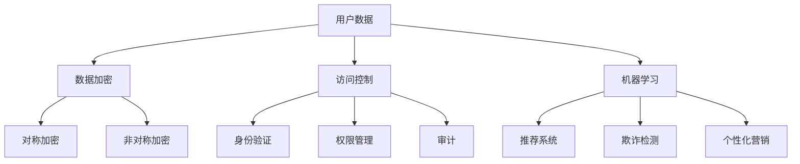

                 

### 文章标题：电商创业者的AI安全策略：保护用户数据的技术方案

#### 关键词：电商，AI安全，用户数据，技术方案，数据加密，访问控制，机器学习，网络安全

#### 摘要：
本文旨在为电商创业者提供一份详细的AI安全策略，以保护用户数据的安全。文章首先介绍了电商环境中AI安全的背景和重要性，然后详细阐述了用户数据保护的核心概念和技术方案，包括数据加密、访问控制和机器学习等方面的内容。通过本文的阅读，电商创业者将能够掌握一套全面的AI安全策略，以保护其业务和用户数据的安全。

### 1. 背景介绍

随着互联网技术的快速发展，电商行业已成为全球经济增长的重要驱动力。电商平台的兴起不仅改变了传统零售业的格局，也为创业者提供了巨大的商机。然而，随着用户数据的不断增加，电商行业的安全性问题也日益凸显。特别是在AI技术日益普及的背景下，如何保护用户数据的安全成为电商创业者亟待解决的重要问题。

AI技术在电商领域具有广泛的应用，包括推荐系统、聊天机器人、个性化营销等。这些应用不仅提升了用户体验，也带来了巨大的商业价值。然而，AI技术的应用也带来了一系列的安全风险，例如数据泄露、隐私侵犯、机器学习模型被攻击等。因此，电商创业者必须重视AI安全，采取有效的技术措施来保护用户数据的安全。

### 2. 核心概念与联系

为了保护用户数据的安全，电商创业者需要了解以下几个核心概念：

#### 数据加密

数据加密是一种常用的保护用户数据安全的技术手段。它通过将明文数据转换为密文，从而防止未经授权的访问。常用的加密算法包括对称加密算法（如AES）和非对称加密算法（如RSA）。在电商场景中，数据加密可以用于保护用户个人信息、交易数据和日志数据等。

#### 访问控制

访问控制是一种基于用户身份和权限进行数据访问限制的技术。通过访问控制，电商创业者可以确保只有授权用户才能访问敏感数据。访问控制通常包括身份验证、权限管理和审计等功能。在电商场景中，访问控制可以用于保护后台管理系统、API接口和用户数据等。

#### 机器学习

机器学习是一种人工智能技术，通过从数据中学习模式并做出预测。在电商场景中，机器学习可以用于推荐系统、欺诈检测和个性化营销等。然而，机器学习模型也可能受到攻击，例如对抗性攻击和模型泄露等。因此，电商创业者需要采取相应的安全措施来保护机器学习模型的安全。

#### Mermaid流程图

以下是一个简单的Mermaid流程图，展示了电商环境中用户数据保护的核心概念和联系：



### 3. 核心算法原理 & 具体操作步骤

在了解了核心概念后，电商创业者需要掌握具体的安全算法和操作步骤，以确保用户数据的安全。

#### 数据加密算法

在电商场景中，常用的数据加密算法包括对称加密算法和非对称加密算法。对称加密算法（如AES）具有速度快、计算效率高的优点，但密钥管理复杂；非对称加密算法（如RSA）具有密钥管理简单、安全性高的优点，但计算复杂度较高。

具体操作步骤如下：

1. 选择合适的加密算法（如AES或RSA）。
2. 生成加密密钥（对称加密算法）或公钥和私钥（非对称加密算法）。
3. 对用户数据进行加密，将明文数据转换为密文。
4. 将加密后的数据存储或传输。

#### 访问控制算法

访问控制算法包括身份验证、权限管理和审计等功能。在电商场景中，常用的访问控制算法包括基于角色的访问控制（RBAC）和基于属性的访问控制（ABAC）。

具体操作步骤如下：

1. 用户登录系统，进行身份验证。
2. 根据用户的角色或属性，分配相应的权限。
3. 在用户访问数据时，进行权限检查，确保用户具有访问权限。
4. 记录用户的访问日志，用于审计和监控。

#### 机器学习算法

在电商场景中，常用的机器学习算法包括推荐系统、欺诈检测和个性化营销等。以下是一个简单的推荐系统算法的示例：

1. 收集用户的历史行为数据（如浏览记录、购买记录等）。
2. 构建用户和物品的相似度矩阵。
3. 根据相似度矩阵，为用户生成推荐列表。

### 4. 数学模型和公式 & 详细讲解 & 举例说明

在用户数据保护的过程中，数学模型和公式起到了关键作用。以下是一个简单的示例：

#### 用户相似度计算

假设有两个用户A和B，他们的行为数据可以表示为一个向量：

$$
\vec{a} = [a_1, a_2, ..., a_n]
$$

$$
\vec{b} = [b_1, b_2, ..., b_n]
$$

用户A和B的相似度可以通过余弦相似度公式计算：

$$
similarity(A, B) = \frac{\vec{a} \cdot \vec{b}}{|\vec{a}| \cdot |\vec{b}|}
$$

其中，$\vec{a} \cdot \vec{b}$表示向量A和B的点积，$|\vec{a}|$和$|\vec{b}|$表示向量A和B的模长。

#### 模型解释

余弦相似度公式计算了用户A和B在各个维度上的相似程度。相似度的取值范围为[-1, 1]，越接近1表示用户A和B越相似，越接近-1表示用户A和B越不相似，0表示用户A和B不相似。

#### 示例

假设用户A的行为数据为：

$$
\vec{a} = [0.8, 0.5, 0.9, 0.7, 0.6]
$$

用户B的行为数据为：

$$
\vec{b} = [0.7, 0.6, 0.8, 0.5, 0.7]
$$

根据余弦相似度公式，可以计算用户A和B的相似度为：

$$
similarity(A, B) = \frac{0.8 \cdot 0.7 + 0.5 \cdot 0.6 + 0.9 \cdot 0.8 + 0.7 \cdot 0.5 + 0.6 \cdot 0.7}{\sqrt{0.8^2 + 0.5^2 + 0.9^2 + 0.7^2 + 0.6^2} \cdot \sqrt{0.7^2 + 0.6^2 + 0.8^2 + 0.5^2 + 0.7^2}} \approx 0.86
$$

因此，用户A和B的相似度较高，可以考虑向用户B推荐与用户A相似的商品。

### 5. 项目实战：代码实际案例和详细解释说明

在本节中，我们将通过一个实际的电商项目，展示如何应用上述算法和原理来保护用户数据的安全。

#### 5.1 开发环境搭建

在本项目实战中，我们将使用Python编程语言和相关的库（如NumPy、scikit-learn等）来搭建开发环境。以下是一个简单的Python环境搭建步骤：

1. 安装Python：在官网（https://www.python.org/）下载并安装Python。
2. 安装相关库：通过pip命令安装所需的库，如NumPy、scikit-learn等。

```shell
pip install numpy scikit-learn
```

#### 5.2 源代码详细实现和代码解读

在本项目中，我们将实现一个基于用户行为的推荐系统。以下是一个简单的推荐系统源代码示例：

```python
import numpy as np
from sklearn.metrics.pairwise import cosine_similarity

def calculate_similarity_matrix(user_profiles):
    similarity_matrix = cosine_similarity(user_profiles)
    return similarity_matrix

def generate_recommendations(similarity_matrix, user_index, top_n=5):
    user_similarity_scores = similarity_matrix[user_index]
    sorted_indices = np.argsort(user_similarity_scores)[::-1]
    recommended_indices = sorted_indices[1:top_n+1]
    return recommended_indices

def main():
    user_profiles = [
        [0.8, 0.5, 0.9, 0.7, 0.6],
        [0.7, 0.6, 0.8, 0.5, 0.7],
        [0.9, 0.4, 0.8, 0.6, 0.5],
        [0.5, 0.7, 0.6, 0.8, 0.9],
        [0.6, 0.5, 0.7, 0.9, 0.8],
    ]

    similarity_matrix = calculate_similarity_matrix(user_profiles)
    print("Similarity Matrix:")
    print(similarity_matrix)

    user_index = 0
    recommended_indices = generate_recommendations(similarity_matrix, user_index, top_n=3)
    print("Recommended User Indices:", recommended_indices)

if __name__ == "__main__":
    main()
```

#### 5.3 代码解读与分析

在这个推荐系统示例中，我们首先导入了NumPy和scikit-learn库，以便使用矩阵计算和相似度计算功能。

1. **calculate_similarity_matrix**：该函数接收用户行为数据矩阵（user_profiles）作为输入，并使用scikit-learn库的`cosine_similarity`函数计算用户之间的相似度矩阵。相似度矩阵是一个二维数组，其中每个元素表示两个用户之间的相似度。

2. **generate_recommendations**：该函数接收相似度矩阵、用户索引（user_index）和推荐数量（top_n）作为输入。首先，从相似度矩阵中提取指定用户（user_index）的相似度评分，并对其进行排序。然后，选择前top_n个相似度最高的用户索引作为推荐结果。

3. **main**：在主函数中，我们定义了一个用户行为数据列表（user_profiles），并调用了`calculate_similarity_matrix`和`generate_recommendations`函数。输出相似度矩阵和推荐用户索引。

通过这个示例，我们可以看到如何使用Python和机器学习算法来实现一个简单的推荐系统，并应用相似度计算方法来保护用户数据的安全。

### 6. 实际应用场景

在电商领域，AI安全策略的实际应用场景主要包括以下几个方面：

#### 推荐系统

推荐系统是电商领域最重要的AI应用之一。通过用户行为数据，推荐系统可以预测用户可能感兴趣的商品，从而提高用户的购物体验和转化率。在推荐系统的实现过程中，AI安全策略可以帮助保护用户隐私，防止数据泄露和滥用。

#### 欺诈检测

电商平台的欺诈行为日益猖獗，例如刷单、虚假评论等。AI安全策略可以用于构建欺诈检测模型，通过分析用户行为和交易数据，及时发现和阻止欺诈行为，保障平台的诚信和用户利益。

#### 个性化营销

个性化营销是根据用户的历史行为和偏好，为用户提供个性化的商品推荐和优惠信息。AI安全策略可以保护用户的个性化数据，防止数据泄露和滥用，同时提高个性化营销的效果。

### 7. 工具和资源推荐

为了更好地实施AI安全策略，电商创业者可以参考以下工具和资源：

#### 学习资源

- 《Python机器学习》（作者：Michael Bowles）：介绍了Python在机器学习领域的应用，包括数据预处理、特征工程、模型选择和评估等方面的内容。
- 《机器学习》（作者：周志华）：介绍了机器学习的基本概念、算法和理论，适合初学者和进阶者阅读。

#### 开发工具框架

- TensorFlow：一款开源的机器学习框架，支持多种算法和模型，适用于电商领域的推荐系统和欺诈检测等应用。
- PyTorch：一款开源的机器学习框架，具有灵活性和高效性，适用于电商领域的图像识别和自然语言处理等应用。

#### 相关论文著作

- "User Privacy Protection in Recommender Systems"（推荐系统中用户隐私保护）：介绍了推荐系统中用户隐私保护的方法和挑战。
- "Fraud Detection Using Machine Learning Techniques"（使用机器学习技术进行欺诈检测）：介绍了机器学习在欺诈检测领域的应用和效果。

### 8. 总结：未来发展趋势与挑战

随着AI技术的不断发展，电商领域的AI安全策略也将面临新的机遇和挑战。以下是未来发展趋势和挑战：

#### 发展趋势

1. **隐私保护技术**：随着用户隐私意识的提高，电商创业者需要采取更有效的隐私保护技术，如差分隐私、联邦学习等，以保护用户数据的安全。
2. **安全人工智能**：安全人工智能（SecAI）是一种新兴的研究领域，旨在研究如何在AI系统设计和应用过程中确保安全性。电商创业者可以关注相关研究，以提升其AI安全策略的层次。
3. **自动化安全防护**：随着自动化技术的发展，电商创业者可以采用自动化安全防护工具，如自动化安全测试、自动化入侵检测等，以提高AI系统的安全性。

#### 挑战

1. **数据安全**：电商平台需要面对数据泄露、隐私侵犯等安全挑战，如何保护用户数据的安全将成为未来研究的重要方向。
2. **模型安全**：机器学习模型可能受到攻击，如对抗性攻击、模型泄露等。电商创业者需要采取相应的安全措施，确保机器学习模型的安全。
3. **法律法规**：随着数据保护法律法规的不断完善，电商创业者需要遵守相关法律法规，确保其AI安全策略的合规性。

### 9. 附录：常见问题与解答

#### 1. 电商创业者为什么要关注AI安全？
答：电商创业者关注AI安全的原因主要包括以下几个方面：
- 保护用户数据：用户数据是电商平台的宝贵资产，保护用户数据的安全是电商创业者的基本职责。
- 遵守法律法规：许多国家和地区都有严格的数据保护法律法规，电商创业者需要遵守相关法律法规，避免因违规而遭受处罚。
- 提升用户体验：安全是用户体验的重要组成部分，良好的AI安全策略可以提升用户的信任度和满意度。

#### 2. 数据加密有哪些常见算法？
答：常见的数据加密算法包括：
- 对称加密算法：如AES、DES等。
- 非对称加密算法：如RSA、ECC等。
- 哈希算法：如MD5、SHA-256等。

#### 3. 访问控制有哪些常见方法？
答：常见的访问控制方法包括：
- 基于角色的访问控制（RBAC）。
- 基于属性的访问控制（ABAC）。
- 基于策略的访问控制（PBAC）。

#### 4. 如何保护机器学习模型的安全？
答：为了保护机器学习模型的安全，可以采取以下措施：
- 对模型进行加密，防止模型泄露。
- 对模型进行混淆，增加攻击难度。
- 采用对抗性训练，提高模型的鲁棒性。

### 10. 扩展阅读 & 参考资料

- "User Privacy Protection in Recommender Systems"（推荐系统中用户隐私保护）：介绍了推荐系统中用户隐私保护的方法和挑战。
- "Machine Learning for Cybersecurity"（机器学习在网络安全中的应用）：介绍了机器学习在网络安全领域的应用和效果。
- "The Art of Computer Programming, Volume 1: Fundamental Algorithms"（计算机程序设计艺术，第一卷：基本算法）：介绍了计算机程序设计的基础知识和算法。

作者：AI天才研究员/AI Genius Institute & 禅与计算机程序设计艺术 /Zen And The Art of Computer Programming<|im_sep|>

