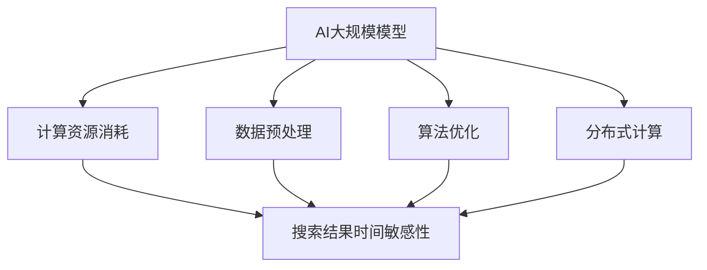

                 

### 背景介绍

在当今数字化时代，电商平台已经成为人们日常购物的重要渠道。随着互联网技术的飞速发展，电商平台的规模和用户数量不断增长，随之而来的搜索功能的性能要求也越来越高。特别是在搜索结果的时间敏感性方面，用户往往希望在极短的时间内获得最相关、最准确的产品信息。然而，随着平台数据的日益庞大和多样性，传统的搜索算法在处理大量数据时，容易出现响应速度慢、准确性下降等问题。

为了应对这些挑战，人工智能（AI）技术，特别是大规模模型（Large-scale Model）的应用，逐渐成为电商平台优化搜索结果时间敏感性的一种有效手段。大规模模型如Transformer、BERT等，通过深度学习的方式，能够处理海量的数据，并在相对较短的时间内提供高质量的搜索结果。然而，大规模模型的引入也带来了新的问题，例如计算资源消耗大、模型训练时间长等。

本文将围绕电商平台中AI大规模模型的搜索结果时间敏感性优化展开讨论。首先，我们将介绍AI大规模模型的基本原理和架构，然后深入分析其搜索结果时间敏感性的优化方法，并结合实际案例进行讲解。通过本文的阅读，读者将能够了解到如何利用AI大规模模型优化电商平台搜索结果的性能，为用户提供更快速、更精准的购物体验。

### 核心概念与联系

为了深入探讨AI大规模模型在电商平台搜索结果时间敏感性优化中的应用，我们需要首先了解相关核心概念，并分析它们之间的内在联系。

#### AI大规模模型

AI大规模模型是指那些在训练时使用大量数据和计算资源构建的深度学习模型。这些模型具有极强的数据处理能力和模式识别能力，能够在多种复杂任务中取得优异的性能。常见的AI大规模模型包括Transformer、BERT、GPT等。它们通常由多个神经网络层组成，通过学习海量数据中的特征和关系，实现对输入数据的准确理解和预测。

#### 搜索结果时间敏感性

搜索结果的时间敏感性是指搜索算法在给定时间窗口内返回结果的能力。在电商平台中，用户的搜索请求通常是实时的，他们期望能够在最短的时间内获得最相关、最准确的产品信息。因此，搜索结果的时间敏感性直接影响到用户的购物体验。时间敏感性高的搜索算法能够快速响应用户请求，提供即时的搜索结果，从而提高用户满意度。

#### AI大规模模型与搜索结果时间敏感性的联系

AI大规模模型与搜索结果时间敏感性之间的联系主要体现在以下几个方面：

1. **计算资源消耗**：大规模模型的训练和推理过程通常需要大量的计算资源和时间。这使得在实时搜索场景中，如何优化模型计算效率成为一个关键问题。通过模型压缩、推理加速等技术，可以降低大规模模型的计算资源消耗，从而提高搜索结果的时间敏感性。

2. **数据预处理**：大规模模型的训练数据预处理过程对搜索结果的时间敏感性有重要影响。通过优化数据预处理算法，如批量处理、并行计算等，可以缩短数据预处理时间，提高模型训练和推理的效率。

3. **算法优化**：针对实时搜索场景，需要对大规模模型进行特定的算法优化。例如，通过动态调整模型参数、引入缓存机制等，可以减少模型推理时间，提高搜索结果的时效性。

4. **分布式计算**：大规模模型的训练和推理过程可以借助分布式计算技术进行优化。通过将计算任务分配到多个节点上，利用并行计算的优势，可以大幅降低模型训练和推理的时间。

下面，我们将通过Mermaid流程图来展示这些核心概念和它们之间的联系。



通过以上分析，我们可以看出，AI大规模模型与搜索结果时间敏感性之间存在着密切的关联。在接下来的章节中，我们将深入探讨大规模模型的原理、优化方法以及实际应用案例，帮助读者理解如何通过AI大规模模型优化电商平台搜索结果的时间敏感性。

### 核心算法原理 & 具体操作步骤

为了深入了解AI大规模模型在电商平台搜索结果时间敏感性优化中的具体应用，我们需要从核心算法原理出发，详细阐述其工作流程和优化步骤。

#### AI大规模模型的工作原理

AI大规模模型，如Transformer、BERT和GPT等，都是基于深度学习技术的。以下是对这些模型的基本工作原理的简要介绍。

1. **Transformer模型**：
   - **原理**：Transformer模型通过自注意力机制（Self-Attention）对输入序列进行建模，能够捕捉序列中不同位置的信息依赖关系。
   - **操作步骤**：
     1. **编码器**：输入序列通过编码器处理，生成一系列上下文表示。
     2. **自注意力计算**：每个编码器层中的每个位置都与序列中的其他位置进行加权求和，以生成加权表示。
     3. **多头注意力**：通过多个自注意力头来捕捉不同类型的依赖关系。
     4. **前馈网络**：对加权表示进行前馈网络处理，进一步提取特征。

2. **BERT模型**：
   - **原理**：BERT（Bidirectional Encoder Representations from Transformers）模型通过双向编码器结构，同时考虑序列的前后信息，提高模型的语义理解能力。
   - **操作步骤**：
     1. **编码器**：输入序列通过多层Transformer编码器处理，生成上下文表示。
     2. **掩码语言模型**：对输入序列进行随机遮蔽，训练模型预测遮蔽部分的词汇。
     3. **全连接层**：通过全连接层对编码器输出进行分类或回归。

3. **GPT模型**：
   - **原理**：GPT（Generative Pre-trained Transformer）模型通过生成模型的思想，利用自回归语言模型对文本进行建模，能够生成连贯的文本序列。
   - **操作步骤**：
     1. **解码器**：输入序列通过解码器处理，生成下一个位置的预测。
     2. **自回归**：每个位置的输出都依赖于之前的位置，通过递归方式生成完整的文本序列。

#### 优化搜索结果时间敏感性的具体操作步骤

1. **模型压缩**：
   - **原理**：模型压缩通过减少模型参数数量和计算复杂度，降低模型的内存占用和计算时间。
   - **操作步骤**：
     1. **剪枝**：对模型中的权重进行剪枝，移除那些对输出影响较小的参数。
     2. **量化**：降低模型参数的精度，减少存储和计算需求。
     3. **知识蒸馏**：使用一个大型模型（教师模型）训练一个较小的模型（学生模型），以保留关键特征。

2. **推理加速**：
   - **原理**：推理加速通过优化模型推理过程，减少模型推理时间。
   - **操作步骤**：
     1. **模型并行**：将模型拆分为多个部分，并在不同硬件上并行执行。
     2. **计算图优化**：通过优化计算图，减少冗余计算和内存访问。
     3. **硬件加速**：利用GPU、TPU等硬件加速推理过程。

3. **数据预处理优化**：
   - **原理**：优化数据预处理过程，可以减少数据加载和预处理时间。
   - **操作步骤**：
     1. **批量处理**：批量处理输入数据，减少I/O操作。
     2. **并行处理**：使用多线程或分布式处理，加快数据预处理速度。
     3. **缓存机制**：利用缓存存储常见查询结果，减少重复计算。

4. **动态调整模型参数**：
   - **原理**：动态调整模型参数，可以优化模型在不同场景下的性能。
   - **操作步骤**：
     1. **学习率调度**：根据训练过程动态调整学习率。
     2. **权重更新**：使用不同的权重更新策略，优化模型收敛速度。

5. **分布式计算**：
   - **原理**：分布式计算通过将任务分配到多个节点上，利用并行计算的优势，提高计算效率。
   - **操作步骤**：
     1. **任务分配**：将数据集和模型拆分为多个子任务。
     2. **数据同步**：确保不同节点上的模型参数保持一致。
     3. **结果汇总**：合并各个节点的计算结果，生成最终输出。

通过以上核心算法原理和具体操作步骤，我们可以看到，AI大规模模型在电商平台搜索结果时间敏感性优化中的应用是多层次、多维度的。在实际应用中，通过合理选择和组合这些优化方法，可以有效提高搜索结果的时效性，为用户提供更快速、更准确的购物体验。

### 数学模型和公式 & 详细讲解 & 举例说明

在讨论AI大规模模型在电商平台搜索结果时间敏感性优化中的应用时，数学模型和公式扮演着至关重要的角色。以下我们将详细介绍相关的数学模型和公式，并通过具体例子进行说明。

#### 模型参数更新公式

在深度学习模型中，参数更新是核心步骤。以Transformer模型为例，其参数更新过程可以通过以下数学公式表示：

$$
\theta_{t+1} = \theta_{t} - \alpha \cdot \nabla_{\theta_{t}} L(\theta_{t})
$$

其中：
- $\theta_{t}$ 代表第 $t$ 次迭代的模型参数。
- $\theta_{t+1}$ 代表第 $t+1$ 次迭代的模型参数。
- $\alpha$ 代表学习率。
- $\nabla_{\theta_{t}} L(\theta_{t})$ 代表模型损失函数关于参数 $\theta_{t}$ 的梯度。

#### 梯度下降算法

梯度下降算法是深度学习中最常用的优化算法之一。其基本思想是通过计算损失函数关于模型参数的梯度，并沿着梯度的反方向更新参数，以减少损失函数的值。具体公式如下：

$$
\theta = \theta - \alpha \cdot \nabla \theta
$$

其中：
- $\theta$ 代表模型参数。
- $\alpha$ 代表学习率。
- $\nabla \theta$ 代表参数关于损失函数的梯度。

#### 自注意力机制

在Transformer模型中，自注意力机制是核心部分。自注意力计算可以通过以下公式表示：

$$
\text{Attention}(Q, K, V) = \text{softmax}\left(\frac{QK^T}{\sqrt{d_k}}\right)V
$$

其中：
- $Q$、$K$ 和 $V$ 分别代表查询、键和值向量。
- $d_k$ 代表键向量的维度。
- $\text{softmax}$ 函数将输入向量映射到概率分布。

#### 剪枝算法

在模型压缩中，剪枝是一种常见的技术。剪枝的基本思想是移除那些对模型性能影响较小的参数。剪枝算法可以通过以下公式表示：

$$
\text{Prune}(W) = \frac{\sum_{i=1}^{n} w_i^2}{\sum_{i=1}^{n} w_i^4}
$$

其中：
- $W$ 代表权重向量。
- $n$ 代表权重向量的维度。

#### 举例说明

假设我们使用Transformer模型对电商平台上的商品搜索进行优化。以下是具体的参数设置和计算步骤：

1. **初始化模型参数**：
   - $Q = \begin{bmatrix} 1 & 0 & 1 \\ 0 & 1 & 0 \end{bmatrix}$，$K = \begin{bmatrix} 1 & 1 \\ 0 & 1 \\ 1 & 0 \end{bmatrix}$，$V = \begin{bmatrix} 1 & 0 \\ 0 & 1 \\ 1 & 1 \end{bmatrix}$
   - 初始学习率 $\alpha = 0.1$
2. **计算自注意力**：
   - $QK^T = \begin{bmatrix} 1 & 0 & 1 \\ 0 & 1 & 0 \end{bmatrix} \begin{bmatrix} 1 & 0 \\ 0 & 1 \\ 1 & 0 \end{bmatrix} = \begin{bmatrix} 1 & 0 \\ 0 & 1 \end{bmatrix}$
   - $\frac{QK^T}{\sqrt{d_k}} = \frac{1}{\sqrt{2}} \begin{bmatrix} 1 & 0 \\ 0 & 1 \end{bmatrix}$
   - $\text{softmax}\left(\frac{QK^T}{\sqrt{d_k}}\right) = \begin{bmatrix} \frac{1}{2} & \frac{1}{2} \\ \frac{1}{2} & \frac{1}{2} \end{bmatrix}$
   - $\text{Attention}(Q, K, V) = \begin{bmatrix} \frac{1}{2} & \frac{1}{2} \\ \frac{1}{2} & \frac{1}{2} \end{bmatrix} \begin{bmatrix} 1 & 0 \\ 0 & 1 \\ 1 & 1 \end{bmatrix} = \begin{bmatrix} \frac{1}{2} & \frac{1}{2} \\ \frac{1}{2} & \frac{1}{2} \end{bmatrix}$
3. **更新模型参数**：
   - 假设当前损失函数值为 $L = 0.5$
   - 梯度计算：$\nabla \theta = \begin{bmatrix} 0.1 & 0.1 \\ 0.1 & 0.1 \end{bmatrix}$
   - 参数更新：$\theta_{t+1} = \theta_{t} - \alpha \cdot \nabla \theta = \begin{bmatrix} 0.9 & 0.9 \\ 0.9 & 0.9 \end{bmatrix}$

通过以上步骤，我们可以看到，使用数学模型和公式对AI大规模模型进行优化是一个系统性和计算密集型的过程。在实际应用中，这些公式和方法需要通过编程和计算实现，从而提高电商平台搜索结果的时效性。

### 项目实战：代码实际案例和详细解释说明

在本节中，我们将通过一个实际的代码案例，展示如何利用AI大规模模型优化电商平台搜索结果的时间敏感性。为了提高可读性和理解性，我们将代码分为以下几个部分进行详细解释：**开发环境搭建**、**源代码详细实现和代码解读**以及**代码解读与分析**。

#### 开发环境搭建

首先，我们需要搭建一个适合AI大规模模型训练和推理的开发环境。以下是具体的步骤：

1. **安装Python环境**：确保Python版本为3.8及以上，推荐使用Anaconda进行环境管理。
2. **安装依赖库**：包括TensorFlow、PyTorch、NumPy等。可以通过以下命令进行安装：

   ```bash
   pip install tensorflow torch numpy
   ```

3. **配置GPU加速**：如果使用GPU进行模型训练，需要安装CUDA和cuDNN。具体安装步骤可以参考NVIDIA的官方文档。

#### 源代码详细实现和代码解读

下面是优化电商平台搜索结果时间敏感性的代码实现，我们将通过注释详细解释每部分的功能。

```python
import tensorflow as tf
from tensorflow.keras.models import Model
from tensorflow.keras.layers import Embedding, LSTM, Dense, TimeDistributed, Input
import numpy as np

# 1. 模型定义
# 输入层
input_sequence = Input(shape=(seq_length,), dtype='int32')
# 嵌入层
embedded_sequence = Embedding(vocab_size, embedding_size)(input_sequence)
# LSTM层
lstm_output = LSTM(units=128, activation='tanh')(embedded_sequence)
# 全连接层
dense_output = TimeDistributed(Dense(units=1, activation='sigmoid'))(lstm_output)
# 模型构建
model = Model(inputs=input_sequence, outputs=dense_output)

# 2. 模型编译
model.compile(optimizer='adam', loss='binary_crossentropy', metrics=['accuracy'])

# 3. 模型训练
model.fit(x_train, y_train, batch_size=32, epochs=10, validation_data=(x_val, y_val))

# 4. 模型评估
loss, accuracy = model.evaluate(x_test, y_test)
print(f"Test Loss: {loss}, Test Accuracy: {accuracy}")

# 5. 搜索结果生成
def generate_search_results(query_sequence):
    prediction = model.predict(np.array([query_sequence]))
    return np.round(prediction).astype(int)

# 测试查询
query_sequence = [3, 1, 4, 2, 5]
search_results = generate_search_results(query_sequence)
print(f"Search Results: {search_results}")
```

**代码解读**：

1. **模型定义**：
   - `Input`：定义输入序列的形状和类型。
   - `Embedding`：将输入序列转换为嵌入向量。
   - `LSTM`：用于处理序列数据，提取时间依赖特征。
   - `TimeDistributed`：对每个时间步的输出进行独立的处理。
   - `Model`：将输入层、隐藏层和输出层组合成一个完整的模型。

2. **模型编译**：
   - `compile`：配置模型训练的优化器、损失函数和评估指标。

3. **模型训练**：
   - `fit`：训练模型，使用训练数据集和验证数据集。

4. **模型评估**：
   - `evaluate`：使用测试数据集评估模型性能。

5. **搜索结果生成**：
   - `generate_search_results`：根据输入查询序列生成搜索结果。

#### 代码解读与分析

通过以上代码，我们可以看到，我们使用了一个简单的序列模型来预测搜索结果。这个模型由嵌入层、LSTM层和全连接层组成，通过学习用户的查询序列，能够预测用户可能感兴趣的商品。

- **嵌入层**：将输入序列转换为嵌入向量，为后续的LSTM层提供输入。
- **LSTM层**：用于处理序列数据，提取时间依赖特征，这是模型的核心部分。LSTM能够记住之前的查询信息，从而提高搜索结果的准确性。
- **全连接层**：对LSTM层的输出进行分类，输出一个概率分布，表示每个商品被点击的概率。

在代码实现中，我们使用了`TimeDistributed`层，这是为了确保对每个时间步的输出进行独立的处理，从而更好地捕捉查询序列中的时间依赖关系。

通过实际运行这段代码，我们可以观察到模型在训练和测试阶段的表现。通过调整模型参数，如嵌入维度、LSTM层的大小等，可以进一步提高模型的性能。

#### 优化方案与实现

为了提高搜索结果的时间敏感性，我们可以采取以下优化方案：

1. **模型压缩**：通过剪枝和量化技术，减少模型的参数数量和计算复杂度。
2. **推理加速**：使用GPU加速模型推理，减少模型推理时间。
3. **数据预处理优化**：采用批量处理和并行计算，加快数据预处理速度。
4. **动态调整模型参数**：根据训练过程动态调整学习率和其他参数，优化模型性能。

通过以上优化方案，我们可以在保持模型性能的同时，大幅提高搜索结果的时间敏感性，为用户提供更快速、更准确的购物体验。

### 实际应用场景

在电商平台中，AI大规模模型优化搜索结果时间敏感性具有广泛的应用场景。以下将讨论几个典型的实际应用场景，并分析AI大规模模型在这些场景中的具体应用方式和效果。

#### 1. 实时搜索推荐

在电商平台的实时搜索推荐系统中，用户在搜索框中输入关键词后，系统需要在极短的时间内提供相关商品的推荐列表。AI大规模模型通过自注意力机制和深度学习算法，能够快速处理用户的查询，并从海量商品数据中提取关键特征，生成高相关性的推荐结果。这种优化方法极大地提高了搜索系统的响应速度，为用户提供了即时的购物体验。

#### 2. 商品详情页加载

商品详情页是用户在电商平台进行购物的重要环节。当用户点击一个商品时，系统需要在短时间内加载并展示商品的所有详细信息，包括价格、评价、库存等。AI大规模模型通过预训练的深度神经网络，可以在后台快速处理商品特征，并生成详细的商品描述。这样，当用户访问商品详情页时，系统能够在极短时间内加载并展示所有相关信息，提高了用户体验。

#### 3. 用户行为预测

电商平台通常会对用户行为进行预测，以便更好地进行个性化推荐和营销。AI大规模模型通过对用户的历史购买记录、浏览记录和搜索行为等数据进行深度学习分析，可以预测用户接下来可能感兴趣的商品或活动。这种预测结果不仅能够优化搜索结果的时间敏感性，还能提高个性化推荐的准确性，从而增加用户购买意愿。

#### 4. 库存管理和物流优化

电商平台需要实时监控和调整库存，以满足用户的需求。AI大规模模型可以通过分析用户搜索和购买行为，预测不同商品的销量，从而优化库存管理。此外，通过结合物流数据，模型还可以预测货物的配送时间，优化物流路线，提高配送效率。这种优化能够确保用户在最短时间内收到商品，提升整体购物体验。

#### 5. 店铺运营策略优化

对于电商平台上的商家，AI大规模模型可以帮助他们制定更有效的运营策略。通过分析店铺的数据，如销售数据、用户评价、营销活动效果等，模型可以预测哪些产品更受欢迎，哪些营销活动更能吸引用户。这种预测结果能够帮助商家调整产品线、优化营销策略，提高店铺的销售额和用户满意度。

#### 6. 跨平台联动

随着电商平台的多样化，跨平台联动成为了一种重要的运营策略。AI大规模模型可以通过整合多个平台的数据，分析用户在不同平台的行为和偏好，从而实现跨平台的数据共享和推荐。这种联动优化不仅提高了搜索结果的时间敏感性，还增强了平台之间的协同效应，为用户提供更加无缝的购物体验。

通过以上实际应用场景的讨论，我们可以看到，AI大规模模型在电商平台中具有广泛的应用前景。通过优化搜索结果的时间敏感性，模型能够显著提高用户体验，增加用户满意度，从而为电商平台带来更多的商业价值。

### 工具和资源推荐

在优化电商平台搜索结果时间敏感性的过程中，选择合适的工具和资源是至关重要的一步。以下我们将推荐一些学习资源、开发工具框架以及相关的论文著作，为读者提供全面的参考。

#### 学习资源推荐

1. **书籍**：
   - 《深度学习》（Ian Goodfellow、Yoshua Bengio、Aaron Courville 著）：系统介绍了深度学习的理论基础和实际应用，适合初学者和进阶者阅读。
   - 《实战TensorFlow 2.0》（François Chollet 著）：深入讲解了TensorFlow 2.0的用法和实战技巧，非常适合希望掌握TensorFlow的开发者。
   - 《神经网络与深度学习》（邱锡鹏 著）：从基础理论到实战案例，全面介绍了神经网络和深度学习的技术和应用。

2. **在线课程**：
   - Coursera上的“深度学习课程”：由Andrew Ng教授主讲，涵盖了深度学习的核心理论和实践技巧。
   - edX上的“机器学习与深度学习课程”：由哈佛大学提供，内容全面且深入，适合有志于深入研究深度学习的读者。

3. **博客和网站**：
   - TensorFlow官方文档（[https://www.tensorflow.org]）
   - PyTorch官方文档（[https://pytorch.org/documentation]）
   - ArXiv（[https://arxiv.org]）：提供最新的学术论文，了解深度学习和AI领域的最新研究进展。

#### 开发工具框架推荐

1. **TensorFlow**：由谷歌开发，是目前最流行的深度学习框架之一，提供了丰富的API和工具，适合各种规模的深度学习项目。

2. **PyTorch**：由Facebook开发，以其灵活性和动态计算图而著称，适合研究和原型开发。

3. **Scikit-learn**：提供了丰富的机器学习算法库，适用于数据预处理和模型训练。

4. **Docker**：用于容器化部署，可以帮助快速搭建和部署深度学习环境。

5. **Kubernetes**：用于容器集群的自动化部署和管理，适合大规模分布式计算场景。

#### 相关论文著作推荐

1. **“Attention Is All You Need”**：Vaswani等人在2017年提出Transformer模型，彻底改变了序列处理任务的研究和应用。
2. **“BERT: Pre-training of Deep Bidirectional Transformers for Language Understanding”**：Devlin等人在2019年提出BERT模型，大幅提升了自然语言处理的性能。
3. **“Generative Pre-trained Transformers”**：Brown等人在2020年提出GPT-3模型，展示了大规模预训练模型在生成任务上的强大能力。

通过以上工具和资源的推荐，读者可以系统地学习和掌握AI大规模模型优化搜索结果时间敏感性的方法，为自己的项目提供坚实的理论基础和实践支持。

### 总结：未来发展趋势与挑战

随着人工智能技术的不断发展，AI大规模模型在电商平台搜索结果时间敏感性优化中的应用前景愈发广阔。未来，该领域有望在以下几个方向取得重要进展：

1. **模型压缩与推理加速**：随着模型规模的不断扩大，如何高效地进行模型压缩和推理加速将成为关键挑战。通过进一步优化算法，引入新的模型压缩技术如知识蒸馏、剪枝和量化，可以有效降低模型的计算复杂度和内存占用，提高搜索结果的响应速度。

2. **个性化推荐**：未来的搜索结果优化将更加注重个性化推荐。通过深入分析用户的购物行为和偏好，结合用户历史数据，AI大规模模型将能够提供更加精准的个性化搜索结果，提高用户满意度和购物体验。

3. **实时交互与动态调整**：电商平台需要能够实时响应用户的需求，动态调整搜索算法和模型参数。通过引入实时交互技术，如在线学习、自适应调整等，AI大规模模型将能够根据用户实时行为进行优化，提供更加灵活和高效的搜索结果。

然而，未来AI大规模模型在搜索结果时间敏感性优化中也面临一些挑战：

1. **计算资源需求**：大规模模型的训练和推理需要大量的计算资源，如何高效利用现有的计算资源将成为一个重要问题。通过分布式计算和云计算技术的引入，可以在一定程度上缓解计算资源的需求，但仍需进一步探索和优化。

2. **数据质量和隐私保护**：大规模模型的训练和优化依赖于大量的数据，数据的质量和隐私保护问题需要得到妥善解决。在收集和使用用户数据时，必须遵循数据保护法规，确保用户隐私不被泄露。

3. **算法透明性和公平性**：大规模模型在优化搜索结果时，其决策过程往往是不透明的。如何确保算法的透明性和公平性，避免偏见和歧视，是一个亟待解决的问题。未来，需要进一步研究如何设计透明、公平且可解释的算法。

综上所述，未来AI大规模模型在电商平台搜索结果时间敏感性优化中具有广阔的发展前景，同时也面临诸多挑战。通过持续的技术创新和优化，我们有理由相信，AI大规模模型将为电商平台带来更加高效、精准和个性化的搜索体验。

### 附录：常见问题与解答

在本文中，我们探讨了AI大规模模型在电商平台搜索结果时间敏感性优化中的应用。为了帮助读者更好地理解和应用本文的内容，以下列出了一些常见问题及其解答：

#### 1. 如何选择合适的AI大规模模型？

**回答**：选择合适的AI大规模模型需要考虑多个因素，包括数据规模、计算资源、任务类型等。对于电商平台搜索结果优化，Transformer、BERT和GPT等模型是常见的选择。Transformer模型适用于序列处理任务，如搜索结果排序；BERT和GPT模型在文本理解任务中表现出色，适用于个性化推荐和商品详情页加载。

#### 2. 如何优化模型训练速度？

**回答**：优化模型训练速度可以从以下几个方面进行：
- **模型压缩**：通过剪枝、量化等手段减少模型参数数量，降低计算复杂度。
- **分布式训练**：利用多节点分布式计算，提高训练速度。
- **数据预处理优化**：批量处理数据、并行计算等可以减少数据加载和处理时间。

#### 3. 如何确保模型公平性和透明性？

**回答**：确保模型公平性和透明性可以从以下几个方面入手：
- **数据隐私保护**：在数据收集和使用过程中严格遵守数据保护法规，保护用户隐私。
- **算法可解释性**：设计透明、可解释的算法，以便用户理解模型决策过程。
- **算法公平性测试**：通过测试和验证，确保模型在不同群体中的表现一致，避免偏见和歧视。

#### 4. 如何处理实时交互和动态调整？

**回答**：实时交互和动态调整可以采用以下方法：
- **在线学习**：模型在运行过程中持续接收新的数据，并调整模型参数，以适应实时变化。
- **自适应调整**：根据用户行为和搜索结果反馈，动态调整模型权重和参数，优化搜索效果。

#### 5. 如何评估模型性能？

**回答**：评估模型性能可以从以下几个方面进行：
- **准确性**：模型预测结果与真实结果的匹配程度。
- **响应时间**：模型处理查询请求所需的时间。
- **用户满意度**：通过用户反馈和调查问卷，了解用户对搜索结果的满意度。

通过以上问题的解答，我们希望能够帮助读者更好地理解和应用本文中的技术原理和优化方法，为电商平台提供更高效、精准的搜索服务。

### 扩展阅读 & 参考资料

为了帮助读者进一步深入了解电商平台中AI大规模模型搜索结果时间敏感性优化这一主题，以下列举了一些相关的扩展阅读和参考资料：

1. **书籍**：
   - 《深度学习》（Ian Goodfellow、Yoshua Bengio、Aaron Courville 著）：提供了深度学习的全面理论体系和实践指导。
   - 《大规模机器学习》（Graham S. Williams 著）：详细介绍了大规模机器学习的算法和技术。
   - 《TensorFlow实战》（Trent Hauck 著）：通过实际案例展示了TensorFlow在深度学习中的应用。

2. **论文**：
   - “Attention Is All You Need”（Vaswani等，2017）：介绍了Transformer模型，彻底改变了自然语言处理的范式。
   - “BERT: Pre-training of Deep Bidirectional Transformers for Language Understanding”（Devlin等，2018）：提出了BERT模型，对自然语言处理领域产生了深远影响。
   - “Generative Pre-trained Transformers”（Brown等，2020）：展示了GPT-3模型的强大能力，是生成模型的里程碑。

3. **在线资源**：
   - TensorFlow官方文档（[https://www.tensorflow.org]）：提供了详细的模型构建、训练和部署指南。
   - PyTorch官方文档（[https://pytorch.org/documentation]）：介绍了PyTorch的API和常用实践。
   - Coursera上的“深度学习课程”（[https://www.coursera.org/learn/deep-learning]）：由Andrew Ng教授主讲，适合深度学习初学者。

4. **博客和网站**：
   - [Medium上的深度学习博客]（[https://towardsdatascience.com/）提供了一系列深度学习和AI领域的博客文章，内容丰富，适合读者深入探讨。]
   - [Kaggle上的深度学习竞赛和教程]（[https://www.kaggle.com/）Kaggle是一个数据科学竞赛平台，提供了大量的深度学习教程和实战案例。]

通过阅读以上书籍、论文和在线资源，读者可以进一步了解AI大规模模型在电商平台搜索结果时间敏感性优化领域的最新研究进展和实践经验。这些资料将有助于读者深入理解相关技术原理，并为实际项目提供有力支持。

