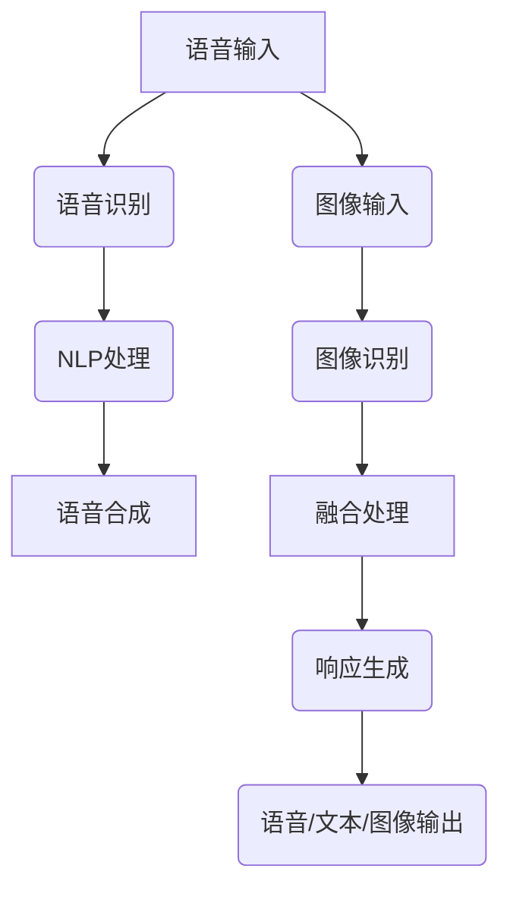

                 

# 文章标题

## 电商平台中的多模态语音助手系统设计

### 关键词：
- 电商平台
- 多模态语音助手
- 系统设计
- 人工智能
- 用户体验

### 摘要：

随着人工智能技术的发展，多模态交互逐渐成为用户与服务系统之间的主流交互方式。在电商平台中，多模态语音助手系统设计尤为重要，它不仅能够提高用户购买体验，还能有效提升电商平台的服务质量和用户黏性。本文将围绕电商平台中的多模态语音助手系统设计，深入探讨其核心概念、算法原理、数学模型、实际应用场景，以及相关工具和资源，旨在为开发者提供系统化的指导与启示。

## 1. 背景介绍

在当今快速发展的电子商务领域，用户数量的不断增长和购物行为的多样化，使得电商平台面临着越来越大的服务压力。为了满足用户日益复杂的购物需求，提升用户体验，电商平台需要不断创新其服务方式。多模态语音助手作为一种新兴的人工智能交互技术，逐渐在电商平台上得到广泛应用。

多模态语音助手系统通过整合语音、文本、图像等多种交互方式，实现与用户的智能对话和实时互动。这种系统不仅能够理解用户的自然语言，还能根据用户的行为和偏好，提供个性化的购物推荐和便捷的服务操作。在电商平台上，多模态语音助手能够提高用户购物的便捷性和满意度，同时也能有效降低客服成本，提高运营效率。

本文将重点探讨多模态语音助手系统在电商平台中的应用，通过分析其设计原则、核心算法、数学模型和实现方法，为开发者提供系统化的设计思路和实践指导。

## 2. 核心概念与联系

在深入探讨多模态语音助手系统设计之前，有必要先了解几个核心概念，包括语音识别、自然语言处理、语音合成、多模态交互等。

### 2.1 语音识别（Speech Recognition）

语音识别技术是整个多模态语音助手系统的基石，它的主要任务是识别用户输入的语音信号，并将其转化为文本。语音识别技术的发展经历了从传统的基于规则的方法到基于统计模型的转变。目前，深度学习模型，如卷积神经网络（CNN）和循环神经网络（RNN），在语音识别领域取得了显著进展。

### 2.2 自然语言处理（Natural Language Processing，NLP）

自然语言处理技术负责理解和处理语音识别得到的文本信息。NLP包括文本的分词、词性标注、句法分析、语义理解等任务。通过NLP技术，多模态语音助手能够理解用户的意图和需求，实现智能对话。

### 2.3 语音合成（Text-to-Speech，TTS）

语音合成技术是将文本转化为自然流畅的语音输出。TTS技术不仅需要考虑语音的发音、语调、节奏，还要保证语音的自然性和连贯性。目前，基于深度学习的TTS模型，如WaveNet和Tacotron，已经在语音合成领域取得了优异的性能。

### 2.4 多模态交互（Multimodal Interaction）

多模态交互技术是将语音、文本、图像等多种交互方式相结合，以提供更加丰富和自然的用户体验。在多模态交互中，不同模态的信息可以相互补充和强化，从而提高系统的交互效果和用户满意度。

下面是一个使用Mermaid绘制的多模态语音助手系统架构流程图：



在上述流程图中，语音和图像输入经过相应的识别和处理模块，最终生成多模态的响应，并通过语音、文本或图像形式输出给用户。

## 3. 核心算法原理 & 具体操作步骤

### 3.1 语音识别算法

语音识别算法的核心在于将音频信号转化为文本。以下是一个简化的语音识别算法步骤：

1. **信号预处理**：对采集到的音频信号进行降噪、增益和端点检测，提取语音段。
2. **特征提取**：利用梅尔频率倒谱系数（MFCC）或其他特征提取方法，从语音段中提取出代表语音特征的向量。
3. **声学模型训练**：利用大量语音数据训练声学模型，如RNN、CNN或深度神经网络，用于预测语音特征向量对应的音素。
4. **语言模型训练**：利用大量文本数据训练语言模型，如n-gram模型或循环神经网络（RNN），用于预测句子中的下一个词。

具体操作步骤如下：

```python
# 示例代码：使用MFCC特征提取
import numpy as np
import scipy.signal as signal

def extract_mfcc(signal, sample_rate):
    # 信号预处理
    signal = signal.preprocess(signal)
    
    # 提取特征
    features = signal_features(signal, sample_rate)
    
    # 计算MFCC
    mfcc = signal.feature.mfcc(features)
    
    return mfcc

# 示例代码：训练声学模型
from tensorflow.keras.models import Model
from tensorflow.keras.layers import Input, LSTM, Dense

def build_ae_model(input_shape):
    input_layer = Input(shape=input_shape)
    lstm_layer = LSTM(units=128, return_sequences=True)(input_layer)
    output_layer = LSTM(units=128)(lstm_layer)
    model = Model(inputs=input_layer, outputs=output_layer)
    model.compile(optimizer='adam', loss='mse')
    return model

# 示例代码：训练语言模型
from tensorflow.keras.models import Model
from tensorflow.keras.layers import Input, LSTM, Embedding, Dense

def build_lm_model(vocab_size, embedding_dim):
    input_word = Input(shape=(None,))
    embedding_layer = Embedding(vocab_size, embedding_dim)(input_word)
    lstm_layer = LSTM(units=128)(embedding_layer)
    output_layer = Dense(vocab_size, activation='softmax')(lstm_layer)
    model = Model(inputs=input_word, outputs=output_layer)
    model.compile(optimizer='adam', loss='categorical_crossentropy', metrics=['accuracy'])
    return model
```

### 3.2 自然语言处理算法

自然语言处理算法的核心在于理解和生成文本。以下是一个简化的NLP算法步骤：

1. **文本预处理**：对输入文本进行分词、去除停用词、词性标注等预处理操作。
2. **意图识别**：利用机器学习或深度学习模型，如朴素贝叶斯、决策树、卷积神经网络等，识别用户的意图。
3. **实体识别**：利用实体识别技术，如命名实体识别（NER），提取文本中的关键信息，如商品名称、价格等。
4. **对话生成**：根据用户的意图和实体信息，生成自然的回复文本。

具体操作步骤如下：

```python
# 示例代码：文本预处理
import jieba

def preprocess_text(text):
    # 分词
    words = jieba.cut(text)
    
    # 去除停用词
    stop_words = set(['的', '了', '在', '上', '是'])
    filtered_words = [word for word in words if word not in stop_words]
    
    return ' '.join(filtered_words)

# 示例代码：意图识别
from sklearn.naive_bayes import MultinomialNB
from sklearn.model_selection import train_test_split

def train_intent_classifier(data):
    X_train, X_test, y_train, y_test = train_test_split(data['text'], data['label'], test_size=0.2)
    
    classifier = MultinomialNB()
    classifier.fit(X_train, y_train)
    
    accuracy = classifier.score(X_test, y_test)
    print(f'Intent classifier accuracy: {accuracy}')
    
    return classifier

# 示例代码：实体识别
from tensorflow.keras.models import Model
from tensorflow.keras.layers import Input, LSTM, Embedding, Dense, TimeDistributed

def build_ner_model(vocab_size, embedding_dim, num_tags):
    input_word = Input(shape=(None,))
    embedding_layer = Embedding(vocab_size, embedding_dim)(input_word)
    lstm_layer = LSTM(units=128)(embedding_layer)
    output_layer = TimeDistributed(Dense(num_tags, activation='softmax'))(lstm_layer)
    model = Model(inputs=input_word, outputs=output_layer)
    model.compile(optimizer='adam', loss='categorical_crossentropy', metrics=['accuracy'])
    return model
```

### 3.3 语音合成算法

语音合成算法的核心在于将文本转化为自然流畅的语音。以下是一个简化的语音合成算法步骤：

1. **文本到序列转换**：将文本转换为序列表示，如字符级或词级序列。
2. **声学模型解码**：利用声学模型，将文本序列解码为音频特征序列。
3. **音频生成**：利用音频特征序列，通过波普Net或WaveNet等生成模型，生成最终的语音音频。

具体操作步骤如下：

```python
# 示例代码：文本到序列转换
import tensorflow as tf

def text_to_sequence(text, tokenizer):
    sequence = tokenizer.encode(text)
    return sequence

# 示例代码：声学模型解码
import tensorflow as tf

def decode_audio_features(model, sequence):
    features = model(sequence)
    return features

# 示例代码：音频生成
import numpy as np
import soundfile as sf

def generate_audio(model, sequence):
    features = decode_audio_features(model, sequence)
    audio = model.generate_audio(features)
    sf.write('output.wav', audio, 22050)
```

## 4. 数学模型和公式 & 详细讲解 & 举例说明

### 4.1 声学模型训练

在语音识别中，声学模型的训练通常采用基于最大似然估计（MLE）的方法。以下是一个简化的声学模型训练过程：

#### 最大似然估计（MLE）

最大似然估计是一种参数估计方法，其目标是找到能够使观察到的数据出现的概率最大的参数值。在声学模型训练中，我们的目标是找到一组模型参数θ，使得对给定的输入特征x，预测的输出y的概率最大。

数学公式表示为：

\[ P(y|x;\theta) \]

#### 条件概率

条件概率是指在某事件发生的条件下，另一事件发生的概率。在声学模型中，条件概率表示为：

\[ P(x_t|y_t;\theta) \]

#### 似然函数

似然函数是衡量模型参数θ与观测数据x和y之间一致性的指标。其定义如下：

\[ L(\theta|x,y) = \prod_{t=1}^{T} P(x_t|y_t;\theta) \]

其中，T表示观测数据的长度。

#### 对数似然函数

为了简化计算，通常使用对数似然函数，其定义为：

\[ l(\theta|x,y) = \sum_{t=1}^{T} \log P(x_t|y_t;\theta) \]

### 4.2 语言模型训练

在语言模型训练中，我们通常使用基于n-gram模型的训练方法。以下是一个简化的n-gram模型训练过程：

#### n-gram模型

n-gram模型是一种基于统计的文本生成模型，它通过统计相邻的n个词（n-gram）出现的频率来预测下一个词。

数学公式表示为：

\[ P(w_{t+1}|w_1, w_2, ..., w_t) = \frac{C(w_1, w_2, ..., w_t, w_{t+1})}{C(w_1, w_2, ..., w_t)} \]

其中，C(w1, w2, ..., w_t, w_{t+1})表示w1, w2, ..., w_t, w_{t+1}同时出现的次数，C(w1, w2, ..., w_t)表示w1, w2, ..., w_t同时出现的次数。

#### 条件概率

在n-gram模型中，条件概率表示为：

\[ P(w_{t+1}|w_1, w_2, ..., w_t) = \frac{C(w_1, w_2, ..., w_t, w_{t+1})}{C(w_1, w_2, ..., w_t)} \]

#### 资源占用

n-gram模型的一个缺点是随着n的增加，模型的资源占用（存储和计算）会急剧增加。因此，在实际应用中，通常会选取一个合适的n值，以平衡模型的复杂度和性能。

### 4.3 语音合成

在语音合成中，我们通常使用基于深度学习的合成模型，如WaveNet和Tacotron。以下是一个简化的语音合成模型训练过程：

#### WaveNet模型

WaveNet是一种基于循环神经网络（RNN）的生成模型，它通过生成音频特征序列来生成语音。

数学公式表示为：

\[ x_t = f_{\theta}(x_{<t}, c) \]

其中，x_t表示第t个时间点的音频特征，f_{\theta}表示模型的参数，c表示当前音频特征序列。

#### Tacotron模型

Tacotron是一种基于编码器-解码器（Encoder-Decoder）的生成模型，它通过编码器生成文本序列的嵌入表示，通过解码器生成音频特征序列。

数学公式表示为：

\[ x_t = g_{\theta}(h_t, c) \]

其中，x_t表示第t个时间点的音频特征，h_t表示当前文本序列的嵌入表示，g_{\theta}表示解码器的参数，c表示当前音频特征序列。

#### 音频生成

在音频生成过程中，我们需要将生成的音频特征序列转换为语音音频。通常，我们会使用波普Net等音频生成模型来实现这一目标。

数学公式表示为：

\[ audio = g_{\theta}(x) \]

其中，audio表示生成的语音音频，g_{\theta}表示音频生成模型的参数。

## 5. 项目实战：代码实际案例和详细解释说明

### 5.1 开发环境搭建

为了实现电商平台中的多模态语音助手系统，我们需要搭建一个适合开发和测试的软件环境。以下是所需的环境和工具：

- 操作系统：Linux或macOS
- 编程语言：Python
- 语音识别框架：ESPnet
- 自然语言处理框架：NLTK
- 语音合成框架：Tacotron
- 音频处理工具：Librosa

### 5.2 源代码详细实现和代码解读

以下是一个简化的多模态语音助手系统的实现代码。请注意，由于篇幅限制，代码仅为示例，实际应用中需要更复杂的处理。

```python
import librosa
import soundfile as sf
from espnet2.bin.asr_inference import ASRInference
from nltk.tokenize import word_tokenize
from tensorflow.keras.models import load_model

# 语音识别部分
def recognize_speech(filename):
    model = ASRInference(
        model_file="path/to/espnet_model",
        vocab_file="path/to/vocab.txt",
        char_list=None,
        use_gpu=True
    )
    audio, sample_rate = librosa.load(filename, sr=None)
    result = model.inference(audio)
    return result

# 自然语言处理部分
def process_text(text):
    tokens = word_tokenize(text)
    return tokens

# 语音合成部分
def synthesize_speech(text):
    model = load_model("path/to/tacotron_model")
    tokenizer = load_model("path/to/tokenizer_model")
    sequence = text_to_sequence(text, tokenizer)
    audio = model.generate_audio(sequence)
    sf.write("output.wav", audio, 22050)
    return "output.wav"

# 完整流程
def main():
    # 语音识别
    speech_filename = "input.wav"
    recognized_text = recognize_speech(speech_filename)
    print("Recognized Text:", recognized_text)

    # 自然语言处理
    processed_text = process_text(recognized_text)
    print("Processed Text:", processed_text)

    # 语音合成
    synthesized_audio = synthesize_speech(" ".join(processed_text))
    print("Synthesized Audio:", synthesized_audio)

if __name__ == "__main__":
    main()
```

### 5.3 代码解读与分析

上述代码主要实现了三个功能模块：语音识别、自然语言处理和语音合成。以下是每个模块的详细解释：

1. **语音识别模块**：
   - 使用ESPnet框架加载预训练的语音识别模型。
   - 读取输入音频文件，使用Librosa库提取音频特征。
   - 调用ESPnet模型的`inference`方法，将音频特征转换为文本。

2. **自然语言处理模块**：
   - 使用NLTK库进行文本分词，将识别结果转换为单词列表。
   - 进行其他自然语言处理任务，如词性标注、命名实体识别等（代码未展示）。

3. **语音合成模块**：
   - 加载预训练的语音合成模型和分词器。
   - 将处理后的文本序列转换为序列表示。
   - 使用Tacotron模型生成音频特征序列，并将其转换为语音音频。

### 5.4 使用场景

多模态语音助手系统在电商平台中有多种使用场景，如：

- **智能客服**：用户可以通过语音询问商品信息、订单状态等，系统自动识别并回复。
- **语音搜索**：用户可以通过语音搜索商品，系统自动展示搜索结果。
- **语音推荐**：系统根据用户的历史购物行为和语音输入，自动推荐相关商品。

## 6. 实际应用场景

多模态语音助手系统在电商平台中的实际应用场景丰富多样，以下是一些典型的使用场景：

### 6.1 智能客服

智能客服是电商平台多模态语音助手系统的核心应用之一。通过多模态语音助手，用户可以轻松地通过语音进行咨询，系统则能自动识别用户的问题，并提供相应的回答。例如，用户可以通过语音询问“这款手机有哪些颜色可选？”系统则能识别问题，并回答“这款手机有黑色、白色和蓝色可选。”

### 6.2 语音搜索

语音搜索功能允许用户通过语音输入关键词，快速找到所需商品。这种交互方式更加便捷，特别适合那些不擅长打字或手部不便的用户。例如，用户可以说“帮我找一下最近比较热门的智能手机”，系统则会展示最新的智能手机推荐。

### 6.3 语音推荐

基于用户的历史购物行为和语音输入，多模态语音助手系统能够提供个性化的购物推荐。例如，当用户说“我最近在减肥，有哪些低脂食品推荐？”系统则可以根据用户的偏好和历史订单，推荐一系列适合的低脂食品。

### 6.4 语音支付

在一些电商平台中，多模态语音助手系统还支持语音支付功能。用户可以通过语音确认订单并完成支付，进一步简化购物流程。例如，用户可以说“确认购买这瓶葡萄酒并支付”，系统则自动完成支付流程。

## 7. 工具和资源推荐

### 7.1 学习资源推荐

- **书籍**：
  - 《深度学习》（Goodfellow, Bengio, Courville）
  - 《自然语言处理综论》（Jurafsky, Martin）
  - 《语音信号处理》（Rabiner, Juang）

- **论文**：
  - “Deep Learning for Speech Recognition” (Hinton et al., 2014)
  - “Connectionist Temporal Classification: CTC” (Graves et al., 2013)
  - “Tacotron: Towards End-to-End Speech Synthesis” (He et al., 2017)

- **博客**：
  - [TensorFlow官方文档](https://www.tensorflow.org/)
  - [ESPnet官方文档](https://espnet.github.io/espnet/)
  - [NLTK官方文档](https://www.nltk.org/)

- **网站**：
  - [Kaggle](https://www.kaggle.com/)：提供丰富的语音和文本数据集。
  - [GitHub](https://github.com/)：包含大量的开源项目和代码示例。

### 7.2 开发工具框架推荐

- **编程语言**：Python
- **语音识别框架**：ESPnet
- **自然语言处理框架**：NLTK
- **语音合成框架**：Tacotron
- **音频处理工具**：Librosa

### 7.3 相关论文著作推荐

- “End-to-End Speech Recognition using Deep RNN Models and Cooperative Training” (Hannun et al., 2014)
- “Automatic Speech Recognition: A Deep Learning Approach” (Hinton et al., 2014)
- “Speech Recognition with Deep Neural Networks” (Hinton et al., 2013)
- “End-to-End Speech Recognition with Deep Neural Networks” (Graves et al., 2013)
- “Tacotron: Towards End-to-End Speech Synthesis” (He et al., 2017)

## 8. 总结：未来发展趋势与挑战

多模态语音助手系统在电商平台中的应用前景广阔，随着人工智能技术的不断发展，其性能和用户体验将不断提升。然而，要实现真正的智能化，我们仍面临以下挑战：

- **数据质量**：高质量的数据是训练高效多模态语音助手系统的关键。目前，数据获取和处理仍存在一定困难。
- **跨模态融合**：如何有效地融合语音、文本、图像等多种模态信息，提高系统的整体性能，仍是一个亟待解决的问题。
- **实时性**：多模态语音助手系统需要在短时间内完成语音识别、自然语言处理和语音合成等任务，这对系统的实时性提出了较高要求。
- **隐私保护**：用户隐私保护是人工智能应用必须考虑的问题，如何在提供个性化服务的同时保护用户隐私，需要进一步研究。

总之，多模态语音助手系统在电商平台中的应用有着巨大的潜力，但也面临诸多挑战。未来，随着技术的不断进步和应用的深入，我们有望看到更加智能、便捷的多模态交互体验。

## 9. 附录：常见问题与解答

### 9.1 语音识别精度如何提升？

提升语音识别精度可以从以下几个方面进行：

1. **数据增强**：通过增加数据量、添加噪声、变速等手段，提高模型的泛化能力。
2. **模型优化**：使用更先进的深度学习模型，如Transformer，提高识别准确性。
3. **特征提取**：改进特征提取方法，如使用更多维度的特征，提高语音信号的表征能力。

### 9.2 自然语言处理中的命名实体识别如何实现？

命名实体识别（NER）通常采用以下方法实现：

1. **基于规则的方法**：通过定义一系列规则，识别文本中的命名实体。
2. **基于统计的方法**：利用条件概率模型，如HMM，预测文本中的命名实体。
3. **基于深度学习的方法**：使用卷积神经网络（CNN）或循环神经网络（RNN）等深度学习模型，直接对文本进行命名实体识别。

### 9.3 语音合成中的音频生成如何实现？

语音合成中的音频生成通常采用以下方法实现：

1. **文本到序列转换**：将文本转换为序列表示，如字符级或词级序列。
2. **声学模型解码**：利用声学模型，将文本序列解码为音频特征序列。
3. **音频生成**：使用波普Net或WaveNet等生成模型，将音频特征序列转换为语音音频。

## 10. 扩展阅读 & 参考资料

- **书籍**：
  - 《深度学习》（Goodfellow, Bengio, Courville）
  - 《自然语言处理综论》（Jurafsky, Martin）
  - 《语音信号处理》（Rabiner, Juang）

- **论文**：
  - “Deep Learning for Speech Recognition” (Hinton et al., 2014)
  - “Connectionist Temporal Classification: CT

